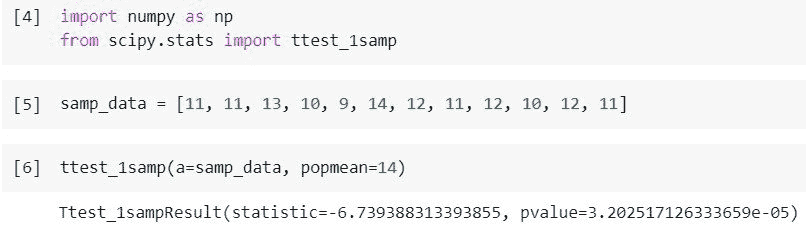
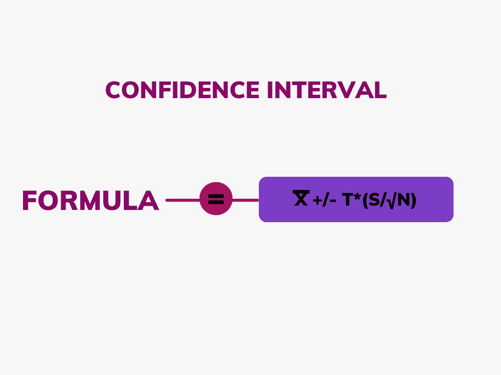
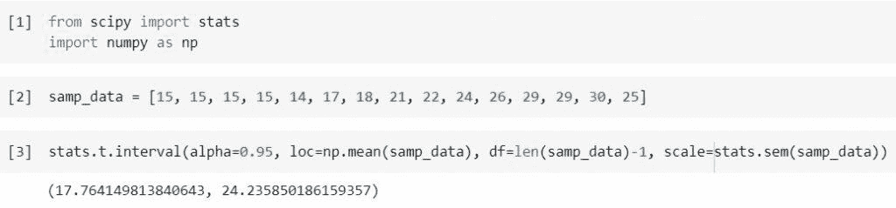
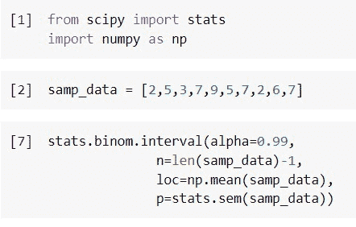
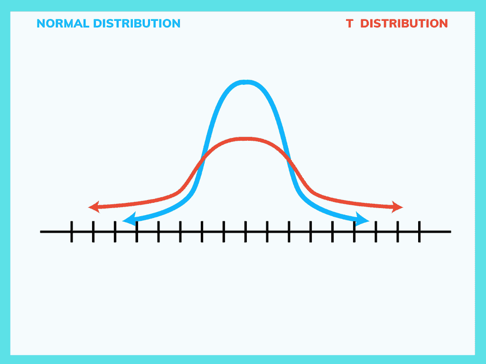
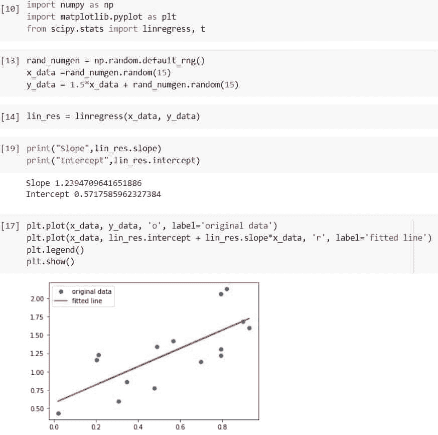
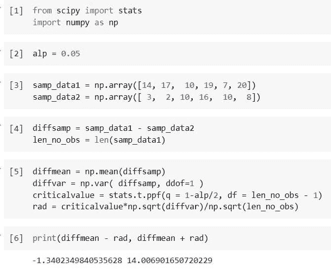
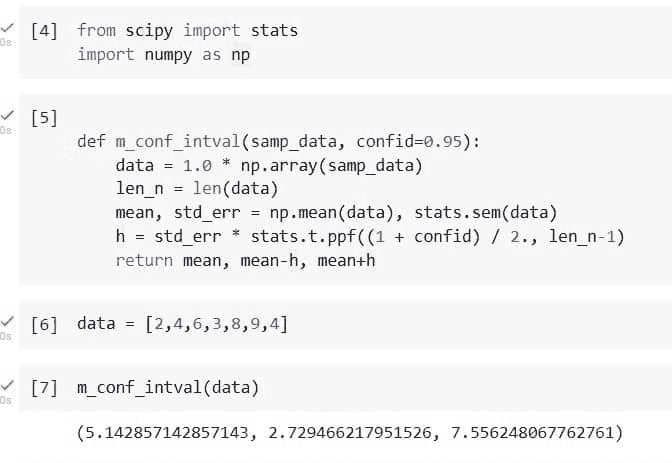

# Python Scipy 置信区间[9 个有用的例子]

> 原文：<https://pythonguides.com/scipy-confidence-interval/>

[](https://sharepointsky.teachable.com/p/python-and-machine-learning-training-course)

在本 [Python 教程](https://pythonguides.com/learn-python/)中，我们将学习“ **Python Scipy 置信区间**”，以及与其使用相关的某些示例。此外，我们将讨论以下主题。

*   Python Scipy 置信区间
*   Python Scipy 置信区间 T 检验
*   Python Scipy 置信区间均值
*   Python Scipy 置信区间比例
*   Python Scipy 置信区间 T 分布
*   Python 科学置信区间二项式
*   Python Scipy 置信区间线性回归
*   Python Scipy 置信区间差
*   Python Scipy 置信区间示例

目录

[](#)

*   [Python Scipy 置信区间](#Python_Scipy_Confidence_Interval "Python Scipy Confidence Interval")
*   [Python Scipy 置信区间 T 检验](#Python_Scipy_Confidence_Interval_T-Test "Python Scipy Confidence Interval T-Test")
*   [Python Scipy 置信区间均值](#Python_Scipy_Confidence_Interval_Mean "Python Scipy Confidence Interval Mean")
*   [Python Scipy 置信区间比例](#Python_Scipy_Confidence_Interval_Proportion "Python Scipy Confidence Interval Proportion")
*   [Python Scipy 置信区间二项式](#Python_Scipy_Confidence_Interval_Binomial "Python Scipy Confidence Interval Binomial")
*   [Python Scipy 置信区间 T 分布](#Python_Scipy_Confidence_Interval_T_Distribution "Python Scipy Confidence Interval T Distribution")
*   [Python Scipy 置信区间线性回归](#Python_Scipy_Confidence_Interval_Linear_Regression "Python Scipy Confidence Interval Linear Regression")
*   [Python Scipy 置信区间差](#Python_Scipy_Confidence_Interval_Difference "Python Scipy Confidence Interval Difference")
*   [Python Scipy 置信区间样本](#Python_Scipy_Confidence_Interval_Sample "Python Scipy Confidence Interval Sample")

## Python Scipy 置信区间

一个**置信区间** (CI)是一组被期望包含一个具有高度确定性的总体值的值。当总体均值落在两个区间之间时，通常用百分比表示。

抽样过程中不确定性或确定性的程度由置信区间来衡量。他们可以使用任意数量的置信度，95%或 99%的置信度是最普遍的。t 检验等统计工具用于计算置信区间。

例如，研究人员可以从同一总体中随机选择不同的样本，并计算每个样本的置信区间，以确定它在多大程度上代表了总体变量的真实值。出现的数据集都是唯一的，一些区间包含真实的总体参数，而另一些不包含。

但是***“95%或者 99%的置信区间意味着什么？”***95%或 99%置信区间是一组数字，在这个区间内你可能有 95%或 99%的把握，真实的总体均值是包含在内的。

如果多次使用抽样技术，大约 95%的区间可以获得真实的总体平均值。

阅读: [Python Scipy 卡方测试](https://pythonguides.com/python-scipy-chi-square-test/)

## Python Scipy 置信区间 T 检验

t 检验是比较两组平均值的统计检验。它经常被用于假设检验，以观察一种方法或治疗是否对感兴趣的人群有影响，或者两个群体是否彼此不同。

Python Scipy 有四种不同的方法`*`ttest_1samp()`*`、`*`ttest_ind()`*`、`*`ttest_ind_from_stats()`*`和`*`ttest_rel()`*`。

*   `ttest_1samp()` :计算一组分数平均值的 T 检验。
*   `ttest_ind()` :计算两个独立分数样本的 T 检验。
*   `ttest_ind_from_stats()` :来自描述统计学，对两个独立样本的均值进行 T 检验。
*   `ttest_rel()` :计算两个相关分数样本 a 和 b 的 t 检验。

这里我们将学习唯一的方法`*`ttest_1samp()`*`，要了解其余方法，请访问 Python SciPY 的官网。

下面给出了该方法的语法。

```py
scipy.stats.ttest_1samp(a,axis=0, popmean, nan_policy='propagate', alternative='one-sided')
```

其中参数为:

*   ***a(数组 _ 数据):*** 观察样本。
*   ***轴(int):*** 测试将沿此轴计算；默认值为 0。如果没有，则对整个数组 a 执行计算。
*   ***【pop mean():***在零假设下，这是期望值。如果是 array_data，它应该有精确的形状，减去轴的维度。
*   ***备择:*** 备择假设在此定义。有多种选择，如双面、较小和较大。
*   ***nan_policy:*** 当输入包含 nan 时，该属性指定如何处理。有几个选项可用，默认为“propagate”:

1.  ' propagate ':这是一个返回 nan 的选项。
2.  ' raise ':它会导致引发错误。
3.  '省略':它在执行计算时忽略 nan 值。

让我们以下面的步骤为例:

使用下面的 python 代码导入所需的库或方法。

```py
import numpy as np
from scipy.stats import ttest_1samp
```

首先，我们将使用下面的代码创建一个数组来保存 12 个工厂的测量值。

```py
samp_data = [11, 11, 13, 10, 9, 14, 12, 11, 12, 10, 12, 11]
```

使用方法 `ttest_1samp()` 执行单样本测试，如以下代码所示。

```py
ttest_1samp(a=samp_data, popmean=14)
```



Python Scipy Confidence Interval T-Test

t 检验统计量的双侧 p 值为 3.2025，t 检验统计量为 6.7393。

对于这个单样本 t 检验，以下是两个假设:

*   H0(无效假设):这种植物的平均高度是 14 英寸
*   H1(另一个假设):平均身高不是 14 英寸。( ≠14)

这里 p 值大于 0.5，所以我们拒绝零假设，接受备择假设。

阅读: [Python Scipy FFT](https://pythonguides.com/python-scipy-fft/)

## Python Scipy 置信区间均值

均值的置信区间是一组值，在特定的置信水平下，这些值可能包括总体均值。

置信区间的公式如下所示。



Confidence interval

其中参数为:

**x̅:** 代表样本均值。
**t:** 置信度对应的 t 值。
**s:** 样本的标准差。
**n:** 样本数。

如果我们有一个小样本，比如少于 30 个，我们可以使用`*`scipy.stats`*` Python 库的`*`t.interval()`*`函数构建一个总体均值的置信区间。

让我们通过下面的步骤来了解一个示例:

使用下面的 python 代码导入所需的库。

```py
from scipy import stats
import numpy as np
```

使用下面的代码创建示例数据。

```py
samp_data = [15, 15, 15, 15, 14, 17, 18, 21, 22, 24, 26, 29, 29, 30, 25]
```

使用下面的代码创建 99%的置信区间。

```py
stats.t.interval(alpha=0.95, loc=np.mean(samp_data), df=len(samp_data)-1, scale=stats.sem(samp_data)) 
```



Python Scipy Confidence Interval Mean

真实总体均值的 95%置信区间为(17.764，24.235)。

阅读: [Python Scipy Matrix +示例](https://pythonguides.com/python-scipy-matrix/)

## Python Scipy 置信区间比例

Python Scipy 在模块`*`scipy.stats._result_classes`*`中包含了一个方法`*`BinomTestResult.proportion_ci()`*`,用于确定估计比例的置信区间。

下面给出了语法。

```py
BinomTestResult.proportion_ci(confidence_level=0.99, method='wilson')
```

其中参数为:

*   **confidence_level(float):** 估计比例的计算置信区间的置信水平。默认值为 0.95。
*   **方法:**选择计算比例估计置信区间的方法:

1.  “精确”:应该使用 Clopper-Pearson 精确方法。
2.  '威尔逊':威尔逊的方法没有连续性校正被称为'威尔逊'
3.  威尔逊的技术包括连续性校正。

方法`*`BinomTestResult.proportion_ci()`*`返回 ***`ci`(置信区间的上下界存储在对象的高低属性中)*** 。

阅读:[Scipy Linalg–实用指南](https://pythonguides.com/scipy-linalg/)

## Python Scipy 置信区间二项式

二项式分布是一种概率分布，表示在给定一组因素或假设的情况下，某个值取两个独立值之一的可能性。在本节中，我们将使用二项式分布来计算置信区间。

Python Scipy 模块`*`scipy.stats`*`包含一个方法`*`binom.interval()`*`，使用这个方法我们将计算 CI。让我们按照以下步骤来看一个例子:

使用下面的 python 代码导入所需的库。

```py
from scipy import stats
import numpy as np
```

使用下面的代码创建示例数据。

```py
samp_data = [2,5,3,7,9,5,7,2,6,7]
```

使用下面的代码计算置信区间。

```py
stats.binom.interval(alpha=0.99,
              n=len(samp_data)-1,
              loc=np.mean(samp_data), 
              p=stats.sem(samp_data))
```



Python Scipy Confidence Interval Binomial

这就是如何计算二项分布的置信区间。

阅读: [Scipy 正态分布](https://pythonguides.com/scipy-normal-distribution/)

## Python Scipy 置信区间 T 分布

当总体标准差未知且数据来自正态分布总体时，t 分布表征样本均值和总体均值之间的归一化距离。

*   换句话说，t 分布也称为学生 t 分布，是一组类似于正态分布曲线但略短且略粗的分布。
*   当样本很少时，使用 t 分布，而不是正态分布。t 分布更像正态分布，更像样本量的增加。
*   实际上，对于大于 20 的样本量，该分布几乎与正态分布相同。

下面是正态和 t 分布形状的给定图片。



Scipy Confidence Interval T Distribution

我们已经做过与 t 分布相关的例子，请参考本教程的***“Python Scipy 置信区间均值”*** 小节。

阅读: [Scipy Ndimage Rotate](https://pythonguides.com/scipy-ndimage-rotate/)

## Python Scipy 置信区间线性回归

Python Scipy 模块`*`scipy.stats`*`包含一个方法`*`linregress()`*`，该方法用于两组测量，以执行线性最小二乘回归。这里我们将计算两个变量 x 和 y 之间的线性回归，然后求出所计算的线性回归的斜率和截距的置信区间。

下面给出了语法。

```py
scipy.stats.linregress(x, y=None, alternative='less')
```

其中参数为:

*   **x，y(array_data):** 有两个测量集。两个数组的长度应该相同。如果只指定了 x(并且 y=None)，则数组必须是二维的，其中一个维度的长度为 2。
*   **备择:**备择假设在这里定义。有多种选择，如双面、较小和较大。

方法`*`linregress()`*`返回类型 float 的`*`slope`*`、`*`intercept`*`、`*`rvalue`*`、`*`pvalue`*`、`*`stderr`*`和`*`intercept_err`*`。

让我们按照以下步骤通过一个示例来理解:

使用下面的 python 代码导入所需的库。

```py
import numpy as np
import matplotlib.pyplot as plt
from scipy.stats import linregress, t
```

使用下面的代码创建一个随机数生成器并生成 x 和 y 数据。

```py
rand_numgen = np.random.default_rng()
x_data =rand_numgen.random(15)
y_data = 1.5*x_data + rand_numgen.random(15)
```

使用下面的代码计算线性回归。

```py
lin_res = linregress(x_data, y_data)
```

使用下面的代码打印斜率和截距。

```py
print("Slope",lin_res.slope)
print("Intercept",lin_res.intercept)
```

使用下面的代码将数据和拟合线一起绘制在图表上。

```py
plt.plot(x_data, y_data, 'o', label='original data')
plt.plot(x_data, lin_res.intercept + lin_res.slope*x_data, 'r', label='fitted line')
plt.legend()
plt.show()
```



Python Scipy Confidence Interval Linear Regression

使用以下代码计算斜率和截距的 95%置信区间。

```py
t_inv = lambda prob, degree_of_freedom: abs(t.ppf(prob/2, degree_of_freedom))
```

使用下面的代码打印斜率和截距的置信区间。

阅读: [Scipy Integrate +示例](https://pythonguides.com/scipy-integrate/)

## Python Scipy 置信区间差

假设我们有来自配对实验的两组数据，它们并不相互独立，我们希望为两个样本之间的平均差异建立一个置信区间。计算置信区间的程序是什么？假设我们决定置信水平为 0.05。

使用下面的 python 代码导入所需的库。

```py
from scipy import stats
import numpy as np
```

使用下面的代码指定由 alpha 表示的 95%的置信度。

```py
alp = 0.05
```

使用下面的代码创建两个样本数据。

```py
samp_data1 = np.array([14, 17,  10, 19, 7, 20])
samp_data2 = np.array([ 3,  2, 10, 16,  10,  8])
```

使用下面的代码计算一个样本和每个样本中的观察值之间的差异。

```py
diffsamp = samp_data1 - samp_data2                     
len_no_obs = len(samp_data1) 
```

此外，使用以下代码计算 CI 的均值和方差、临界值和半径。

```py
diffmean = np.mean(diffsamp)                      
diffvar = np.var( diffsamp, ddof=1 )          
criticalvalue = stats.t.ppf(q = 1-alp/2, df = len_no_obs - 1)   
rad = criticalvalue*np.sqrt(diffvar)/np.sqrt(len_no_obs)
```

现在使用下面的代码计算置信区间差。

```py
print(diffmean - rad, diffmean + rad)
```



Python Scipy Confidence Interval Difference

这就是求置信区间差的方法。

阅读: [Scipy 信号-有用教程](https://pythonguides.com/scipy-signal/)

## Python Scipy 置信区间样本

在本节中，我们将创建一个函数，它将根据给定的样本数据计算置信区间。

让我们按照下面的步骤来创建一个方法或函数。

使用下面的 python 代码导入所需的库。

```py
from scipy import stats
import numpy as np
```

使用下面的代码创建一个函数来计算给定数据样本的置信区间。

```py
 def m_conf_intval(samp_data, confid=0.95):
    data = 1.0 * np.array(samp_data)
    len_n = len(data)
    mean, std_err = np.mean(data), stats.sem(data)
    h = std_err * stats.t.ppf((1 + confid) / 2., len_n-1)
    return mean, mean-h, mean+h
```

现在，使用下面的代码向上面创建的方法提供样本数据。

```py
data = [2,4,6,3,8,9,4]

m_conf_intval(data)
```



Python Scipy Confidence Interval Sample

看输出，置信区间的范围是 2.729 到 7.556。

在上面的代码中，我们创建了一个方法`*`m_conf_intval()`*`来计算给定数据或样本的置信区间。

另外，看看更多的 Python SciPy 教程。

*   [Scipy Convolve–完整指南](https://pythonguides.com/scipy-convolve/)
*   [如何使用 Python Scipy Linprog](https://pythonguides.com/python-scipy-linprog/)
*   [Python Scipy 特征值](https://pythonguides.com/python-scipy-eigenvalues/)
*   [Scipy Stats–完整指南](https://pythonguides.com/scipy-stats/)
*   [Scipy 优化–实用指南](https://pythonguides.com/scipy-optimize/)
*   [Python Scipy 距离矩阵](https://pythonguides.com/scipy-distance-matrix/)

因此，在本教程中，我们已经了解了" **Python Scipy 置信区间**"并涵盖了以下主题。

*   Python Scipy 置信区间
*   Python Scipy 置信区间 T 检验
*   Python Scipy 置信区间均值
*   Python Scipy 置信区间比例
*   Python Scipy 置信区间 T 分布
*   Python 科学置信区间二项式
*   Python Scipy 置信区间线性回归
*   Python Scipy 置信区间差
*   Python Scipy 置信区间示例

[Bijay Kumar](https://pythonguides.com/author/fewlines4biju/)

Python 是美国最流行的语言之一。我从事 Python 工作已经有很长时间了，我在与 Tkinter、Pandas、NumPy、Turtle、Django、Matplotlib、Tensorflow、Scipy、Scikit-Learn 等各种库合作方面拥有专业知识。我有与美国、加拿大、英国、澳大利亚、新西兰等国家的各种客户合作的经验。查看我的个人资料。

[enjoysharepoint.com/](https://enjoysharepoint.com/)[](https://www.facebook.com/fewlines4biju "Facebook")[](https://www.linkedin.com/in/fewlines4biju/ "Linkedin")[](https://twitter.com/fewlines4biju "Twitter")