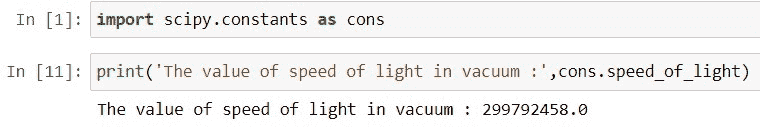

# Scipy 常量–多个示例

> 原文：<https://pythonguides.com/scipy-constants/>

[](https://sharepointsky.teachable.com/p/python-and-machine-learning-training-course)

在这个 [Python 教程](https://pythonguides.com/learn-python/)中，我们将学习“ **Scipy 常量**，在这里我们将了解 Scipy 中不同类型的**常量。此外，涵盖以下主题。**

*   科学常数 Python
*   Scipy 常量单位
*   Scipy 常量列表
*   科学常数 C
*   科学常数ε0
*   Scipy 常量查找
*   科学常数 hbar
*   Scipy Constants mu0
*   光速常数
*   科学常数里德伯
*   科学常数温度

目录

[](#)

*   [科学常数 Python](#Scipy_Constants_Python "Scipy Constants Python")
*   [Scipy 常量单位](#Scipy_Constants_Units "Scipy Constants Units")
    *   [角度](#Angle "Angle")
    *   [质量](#Mass "Mass")
    *   [SI 前缀](#SI_Prefixes "SI Prefixes")
    *   [二进制前缀](#Binary_Prefixes "Binary Prefixes")
    *   [时间](#Time "Time")
    *   [长度](#Length "Length")
    *   [压力](#Pressure "Pressure")
    *   [体积](#Volume "Volume")
    *   [速度](#Speed "Speed")
    *   [区域](#Area "Area")
    *   [温度](#Temperature "Temperature")
    *   [能量](#Energy "Energy")
    *   [功率](#Power "Power")
    *   [光学](#Optics "Optics")
    *   [力](#Force "Force")
*   [Scipy 常量列表](#Scipy_Constants_list "Scipy Constants list")
*   [科学常数 C](#Scipy_Constants_C "Scipy Constants C")
*   [科学常数ε0](#Scipy_Constants_epsilon_0 "Scipy Constants epsilon 0")
*   [Scipy 常量查找](#Scipy_Constants_find "Scipy Constants find")
*   [科学常数 hbar](#Scipy_Constants_hbar "Scipy Constants hbar")
*   [科学常数 mu0](#Scipy_Constants_mu0 "Scipy Constants mu0")
*   [光速常数](#Scipy_Constants_speed_of_light "Scipy Constants speed of light")
*   [科学常数里德堡](#Scipy_Constants_Rydberg "Scipy Constants Rydberg")
*   [Scipy 常数温度](#Scipy_Constants_Temperature "Scipy Constants Temperature")

## 科学常数 Python

Scipy Constants 是一个 Python 子包，包含许多不同类型的科学领域常数。这些常数可以根据我们在数据科学、深度学习、[机器学习](https://pythonguides.com/machine-learning-using-python/)中的需要来使用。

Scipy 中有三种类型的常量:

*   **物理常数:**物理常数有真空中的光速( **`c`** )、磁常数(``mu_0``)等。
*   **数学常数:**数学常数有圆周率( **`pi`** )、黄金分割率( **`golden` )** 、( **`golden_ratio`** )。
*   **单位:**单位有`*`Mass`*`、`*`Time`*`、`*`Angle`*`等。

在后面的小节中，我们将分别学习每个常数。

这里我们将使用 Jupyter 笔记本来演示如何导入和使用 Scipy 常量。

打开 Jupyter Notebook，在单元格中键入以下代码以导入 Scipy 常量。

```py
import scipy.constants as constant
```


Scipy Constants Python

让我们检查一些 Scipy 常量的值。

使用以下代码检查数学常数`Pi`的值。

```py
print(constant.pi)
```

使用以下代码检查物理常数`speed of light`的值。

```py
print(constant.speed_of_light)
```

使用以下代码检查 Uni `gram`的值。

```py
print(constant.gram)
```


Scipy Constant

另外，检查:[Python 中的 Scikit 是学什么的](https://pythonguides.com/what-is-scikit-learn-in-python/)

## Scipy 常量单位

在这里，我们将了解 Scipy 单元，Scipy 中有 15 种类型的单元，每种类型都包含其常数。

下面给出了 Scipy 中的单位类型。

*   角
*   团
*   SI 前缀
*   二进制前缀
*   时间
*   长度
*   压力
*   卷
*   速度
*   面积
*   温度
*   活力
*   力量
*   光学
*   力

### 角度

角度单位有***`degree`***`*`arcmin`*``*`arcminute`*``*`arcsec`*``*`arcsecond`*`等常量。这些常数的单位值是弧度。

运行下面的代码来查看 Angle 中所有常量的值。

```py
print('The value of degree in radians :',const.degree)     
print('The value of arc minute in radians :',const.arcmin)    
print('The value of arc minute in radians :',const.arcminute) 
print('The value of arc second in radians :',const.arcsec)    
print('The value of arc second in radians :',const.arcsecond)
```


Scipy Constants Units Angle

### 质量

质量单位有`*`gram`*`、`*`metric`*`、`*`grain`*`等常量。它以千克为单位返回单位值。下面用代码显示了所有的常数。

运行下面的代码来查看所有联系人的值。

```py
print('The value of gram is equal to 10 to the power -3 in kg :',const.gram)        
print('The value of gram is equal to 10 to the power 3 in kg :',const.metric_ton)  
print('The value of one grain in kg :',const.grain)       
print('The value of one pound in kg :',const.lb)          
print('The value of one pound in kg :',const.pound)       
print('The value of one ounce in kg :',const.oz)          
print('The value of one ounce in kg :',const.ounce)       
print('The value of one stone in kg :',const.stone)
print('The value of one slug in kg :',const.slug)
print('The value of one long ton in kg :',const.long_ton)    
print('The value of one short ton in kg :',const.short_ton)
print('The value of one inch version of a slug in kg :',const.slinch)
print('The value of one inch version of a slug in kg :',const.blob)
print('The value of one troy ounce in kg :',const.troy_ounce)  
print('The value of one troy pound in kg :',const.troy_pound)  
print('The value of one carat in kg :',const.carat)       
print('The value of one atomic mass constant in kg :',const.atomic_mass) 
print('The value of one atomic mass constant in kg :',const.m_u)         
print('The value of one atomic mass constant in kg :',const.u)
```


Scipy Constants Units Mass

读取 [Scipy 优化](https://pythonguides.com/scipy-optimize/)

### SI 前缀

SI 前缀单位有`*`Zetta`*`、`*`Yotta`*`、`*`Peta`*`等常量。它以米为单位返回单位值。下面用代码显示了所有的常数。

```py
print('The value of yotta is equal to 10 to the power 24 :',const.yotta)    
print('The value of zetta is equal to 10 to the power 21 :',const.zetta)    
print('The value of exa is equal to 10 to the power 18 :',const.exa)      
print('The value of peta is equal to 10 to the power 15 :',const.peta)     
print('The value of tera is equal to 10 to the power 12 :',const.tera)     
print('The value of giga is equal to 10 to the power 9 :',const.giga)     
print('The value of mega is equal to 10 to the power 6 :',const.mega)     
print('The value of kilo is equal to 10 to the power 3 :',const.kilo)     
print('The value of hecto is equal to 10 to the power 2 :',const.hecto)    
print('The value of deka is equal to 10 to the power 1 :',const.deka)     
print('The value of deci is equal to 10 to the power -1 :',const.deci)     
print('The value of centi is equal to 10 to the power -2 :',const.centi)    
print('The value of milli is equal to 10 to the power -3 :',const.milli)    
print('The value of micro is equal to 10 to the power -6 :',const.micro)
print('The value of nano is equal to 10 to the power -9 :',const.nano) 
print('The value of pico is equal to 10 to the power -12 :',const.pico)   
print('The value of femto is equal to 10 to the power -15 :',const.femto) 
print('The value of atto is equal to 10 to the power -18 :',const.atto)
print('The value of zepto is equal to 10 to the power -21 :',const.zepto)
print('The value of yocto is equal to 10 to the power -24 :',const.yocto)
```


Scipy Constants Units SI prefixes

### 二进制前缀

二进制前缀单元有`*`gibi`*`、`*`pebi`*`、`*`mebi`*`等常量。它以字节为单位返回单位值。下面用代码显示了所有的常数。

```py
print('The value of kibi is equal to 2 to the power 10 :',const.kibi)
print('The value of kibi is equal to 2 to the power 20 :',const.mebi)
print('The value of kibi is equal to 2 to the power 30 :',const.gibi) 
print('The value of kibi is equal to 2 to the power 40 :',const.tebi) 
print('The value of kibi is equal to 2 to the power 50 :',const.pebi) 
print('The value of kibi is equal to 2 to the power 60 :',const.exbi) 
print('The value of kibi is equal to 2 to the power 70 :',const.zebi) 
print('The value of kibi is equal to 2 to the power 80 :',const.yobi) 
```


Scipy Constants Units Binary prefixes

### 时间

时间单位有`*`minute`*`、`*`day`*`、`*`hour`*`等常量。它以秒为单位返回单位值。下面用代码显示了所有的常数。

```py
print('The value of one minute in seconds :',const.minute)
print('The value of one hour in seconds :',const.hour)
print('The value of one day in seconds :',const.day) 
print('The value of one week in seconds :',const.week)  
print('The value of one year in seconds :',const.year) 
print('The value of one Julian_year in seconds :',const.Julian_year)
```


Scipy Constants Units Time

### 长度

长度单位有常量，如`*`foot`*`、`*`mile`*`、`*`fermi`*`等。它返回以米为单位的单位值。下面用代码显示了所有的常数。

```py
print('The value of one inch in meters :',const.inch)
print('The value of one foot in meters :',const.foot) 
print('The value of one yard in meters :',const.yard) 
print('The value of one mile in meters :',const.mile) 
print('The value of one mil in meters :',const.mil) 
print('The value of one pt in meters :',const.pt) 
print('The value of one point in meters :',const.point)  
print('The value of one survey foot in meters :',const.survey_foot)  
print('The value of one survey mile in meters :',const.survey_mile) 
print('The value of one nautical mile in meters :',const.nautical_mile)  
print('The value of one fermi in meters :',const.fermi)
print('The value of one angstrom in meters :',const.angstrom)
print('The value of one micron in meters :',const.micron) 
print('The value of one astronomical unit in meters :',const.au)
print('The value of one astronomical unit in meters :',const.astronomical_unit) 
print('The value of one light year in meters :',const.light_year)        
print('The value of one parsec in meters :',const.parsec)
```


Scipy Constants Units Length

### 压力

压力单位有`*`psi`*`、`*`atm`*`、`*`bar`*`等常量。它返回以帕斯卡为单位的单位值。下面用代码显示了所有的常数。

```py
print('The value of standard atomsphere in pascals :',const.atm) 
print('The value of standard atomsphere in pascals :',const.atmosphere) 
print('The value of one bar in pascals :',const.bar) 
print('The value of one torr in pascals :',const.torr)  
print('The value of one torr in pascals :',const.mmHg) 
print('The value of one psi in pascals :',const.psi) 
```


Scipy Constants Units Pressure

### 体积

体积单位有常数如`*`gallon`*`、`*`litre`*`、`*`barrel`*`等。它以立方米为单位返回单位值。下面用代码显示了所有的常数。

```py
print('The value of one litre in cubic meters :',const.liter) 
print('The value of one litre in cubic meters :',const.litre)      
print('The value of one gallon (United States) in cubic meters :',const.gallon)         
print('The value of one gallon (United States) in cubic meters :',const.gallon_US)
print('The value of one gallon (United Kingdom) in cubic meters :',const.gallon_imp) 
print('The value of one fluid ounce (United States) in cubic meters :',const.fluid_ounce) 
print('The value of one fluid ounce (United States) in cubic meters :',const.fluid_ounce_US)
print('The value of one fluid ounce (United Kindom) in cubic meters :',const.fluid_ounce_imp)
print('The value of one barrel in cubic meters :',const.barrel)
print('The value of one barrel in cubic meters :',const.bbl)
```


Scipy Constants Units Volume

### 速度

速度单位有`*`mph`*`、`*`mach`*`、`*`knot`*`等常量。它以米/秒为单位返回单位值。下面用代码显示了所有的常数。

```py
print('The value of kmh kilometers per hour in meters per second :',const.kmh) 
print('The value of mph miles per hour in meters per second :',const.mph) 
print('The value of one mach meters per second :',const.mach) 
print('The value of one mach meters per second :',const.speed_of_sound) 
print('The value of one knot meters per second :',const.knot) 
```


Scipy Constants Units Speed

### 区域

面积单位有像公顷、英亩这样的常数。它以平方米为单位返回单位值。下面用代码显示了所有的常数。

```py
print('The value of one hectare in square meters :',const.hectare)
print('The value of one acre in square meters :',const.acre)
```


Scipy Constants Units Area

### 温度

温度单位有零摄氏度、华氏度等常量。它返回开尔文单位值。下面用代码显示了所有的常数。

```py
print('The value of zero of celsius scale in Kelvin :',const.zero_Celsius)
print('The value of zero of fahrenheit scale in Kelvin :',const.degree_Fahrenheit)
```


Scipy Constants Units Temperature

### 能量

能量单位有 eV、卡路里等常量。它以焦耳为单位返回单位值。下面用代码显示了所有的常数。

```py
print('The value of one electron volt in Joules :',const.eV) 
print('The value of one electron volt in Joules :',const.electron_volt) 
print('The value of one calorie (Thermochemical) in Joules :',const.calorie) 
print('The value of one calorie (Thermochemical) in Joules :',const.calorie_th) 
print('The value of one calorie (International steam table calorie)in Joules :',const.calorie_IT) 
print('The value of one erg in Joules :',const.erg)  
print('The value of one british thermal unit in Joules :',const.Btu)  
print('The value of one british thermal unit (International steam table) in Joules :',const.Btu_IT)  
print('The value of one british thermal unit (International steam table) in Joules :',const.Btu_th)
print('The value of one ton of TNT in Joules :',const.ton_TNT)
```


Scipy Constants Units Energy

### 功率

功率单位有常量，如 hp，马力。它以瓦特为单位返回单位值。下面用代码显示了所有的常数。

```py
print('The value of one horsepower in watts :',const.hp) 
print('The value of one horsepower in watts :',const.horsepower)
```


Scipy Constants Units Power

### 光学

光学单元具有返回光学频率的常数``*lambda2nu( )*``和返回波长的常数``*nu2lambda( )*``。

### 力

力的单位有`*`kgf`*`、`*`dyn`*`等常量。它以牛顿为单位返回单位值。下面用代码显示了所有的常数。

```py
print('The value of one dyne in newtons :',const.dyn)
print('The value of one dyne in newtons :',const.dyne)
print('The value of one pound force in newtons :',const.lbf)
print('The value of one pound force in newtons :',const.pound_force)
print('The value of one kilogram force in newtons :',const.kgf)
print('The value of one kilogram force in newtons :',const.kilogram_force)
```


Scipy Constants Units Force

阅读:[Python 中的 tensor flow](https://pythonguides.com/tensorflow/)

## Scipy 常量列表

要查看或列出 Scipy 中的所有常数，为此我们将使用函数 ***`dir( )`*** ，我们将从 Scipy 导入的常数传递给该函数来查看所有常数。

这里我们将使用下面的代码导入 Scipy 子包常量。

```py
import scipy.constants as const
```

现在将上面导入的子包传递给函数``*dir( )*``。

```py
print(dir(const))
```

在上面的代码函数``*dir( )*``中，接受子包名称`*`const`*`并显示该包中的所有常量，如下面的输出所示。


Scipy Constants list

阅读:[py torch 是什么以及如何使用它](https://pythonguides.com/what-is-pytorch/)

## 科学常数 C

在 Scipy 中，常数`*`c`*` 代表真空中的光速，是一个物理常数。

要导入这些常量，请遵循以下步骤:

```py
import scipy.constants as cons
```

检查真空中光速不变的值。

```py
print('The value of speed of light in vacuum :',cons.c)
```

在这里，我们可以使用`*`cons.c`*`来访问常量。


Scipy Constants C

用常数`*`c`*`表示的真空中光速的值是 `299792458.0` 。

阅读:[使用 Python 的机器学习](https://pythonguides.com/machine-learning-using-python/)

## 科学常数ε0

在 Scipy 中，``*epsilon 0*``是存在于`*`scipy.constants`*`内的电常数。

要导入这些常量，请遵循以下步骤:

```py
import scipy.constants as cons
```

使用以下代码检查电常数的值。

```py
 print('The value of the electric constant :',cons.epsilon_0)
```

在这里，我们可以使用`*`cons.epsilon_0`*`来访问常量。


Scipy Constants epsilon 0

阅读:[Scipy Sparse–有用的教程](https://pythonguides.com/scipy-sparse/)

## Scipy 常量查找

为了获得 Scipy 中物理常数的密钥，使用了`*`scipy.constants`*`的方法``*find( )*``。

下面给出了语法。

```py
scipy.constants.find(sub_str=None, disp=False)
```

其中参数为:

*   ***sub_str:*** 它是子串或者是我们要搜索其关键字的物理常量的名称。
*   ***dips:*** 如果设置为`True`则返回找到的键，否则不显示任何内容列出所有键。

让我们用下面的代码来举例说明如何导入和列出物理常数的键。

```py
from scipy.constants import find, physical_constants
```

检查包含字典`***'avogadro'***`的物理常数中的键。

```py
find('avogadro')
```

使用以下代码列出常数`***'Avogadro constant'***`。

```py
physical_constants['Avogadro constant']
```


Scipy Constants find

阅读:[Scipy Stats Zscore+Examples](https://pythonguides.com/scipy-stats-zscore/)

## 科学常数 hbar

在 Scipy 中，常数`*`hbar`*`是普朗克常数的修改形式，存在于值等于``*h= h/2pi)*``的`*`scipy.constants`*`内。

要导入这些常量，请遵循以下步骤:

```py
import scipy.constants as cons
```

使用下面的代码检查普朗克常数的值。

```py
print('The value of Plancs constant :',cons.hbar)
```


Scipy Constants hbar

阅读: [Python Scipy 最小化【附 8 个例子】](https://pythonguides.com/python-scipy-minimize/)

## 科学常数 mu0

在 Scipy 中，`*`mu_0`*`是存在于`*`scipy.constants`*`内的磁常数。

要导入这些常量，请遵循以下步骤:

```py
import scipy.constants as cons
```

使用以下代码检查磁常数的值。

```py
print('The value of the magnetic constant :',cons.mu_0)
```

在这里，我们可以访问常数`*`cons.mu_0`*`。


Scipy Constants mu0

阅读: [Python Scipy 置信区间](https://pythonguides.com/scipy-confidence-interval/)

## 光速常数

在 Scipy 中，常数`*`speed_of_ligh`*`代表真空中的光速，是一个物理常数。

要导入这些常量，请遵循以下步骤:

```py
import scipy.constants as cons
```

检查真空中光速不变的值。

```py
print('The value of speed of light in vacuum :',cons.c)
```



Scipy Constants speed of light

## 科学常数里德堡

在 Scipy 中，常数`*`Rydberg`*`是里德伯常数，是物理常数。

要导入这些常量，请遵循以下步骤:

```py
import scipy.constants as cons
```

检查里德伯常数的值。

```py
print('The value of Rydberg constant :',cons.Rydberg)
```


Scipy Constants Rydberg

阅读: [Python Scipy 指数](https://pythonguides.com/python-scipy-exponential/)

## Scipy 温度常数

温度单位有`*`zero_Celsius`*`、`*`degree_Fahrenheit`*`等常量。它返回开尔文单位值。下面用代码显示了所有的常数。

```py
print('The value of zero of celsius scale in Kelvin :',const.zero_Celsius)
print('The value of zero of fahrenheit scale in Kelvin :',const.degree_Fahrenheit)
```


Scipy Constants Units Temperature

看看上面输出中两个常量的值。

还有，多看看一些教程。

*   [蟒蛇里的熊猫](https://pythonguides.com/pandas-in-python/)
*   [Python 中的 NumPy 是什么](https://pythonguides.com/numpy/)

在本教程中，我们学习了" **Scipy 常量**"并涵盖了以下主题。

*   科学常数 Python
*   Scipy 常量单位
*   Scipy 常量列表
*   科学常数 C
*   科学常数ε0
*   Scipy 常量查找
*   科学常数 hbar
*   Scipy Constants mu0
*   光速常数
*   科学常数里德伯
*   科学常数温度

[Bijay Kumar](https://pythonguides.com/author/fewlines4biju/)

Python 是美国最流行的语言之一。我从事 Python 工作已经有很长时间了，我在与 Tkinter、Pandas、NumPy、Turtle、Django、Matplotlib、Tensorflow、Scipy、Scikit-Learn 等各种库合作方面拥有专业知识。我有与美国、加拿大、英国、澳大利亚、新西兰等国家的各种客户合作的经验。查看我的个人资料。

[enjoysharepoint.com/](https://enjoysharepoint.com/)[](https://www.facebook.com/fewlines4biju "Facebook")[](https://www.linkedin.com/in/fewlines4biju/ "Linkedin")[](https://twitter.com/fewlines4biju "Twitter")