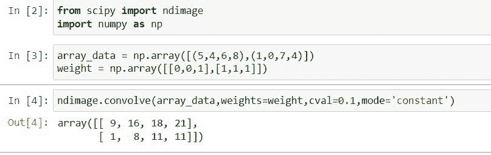

# scipy Convolve–完整指南

> 原文：<https://pythonguides.com/scipy-convolve/>

[](https://sharepointsky.teachable.com/p/python-and-machine-learning-training-course)

在这个 [Python 教程](https://pythonguides.com/learn-python/)中，我们将学习“ `Scipy Convolve` ”，此外，我们还将使用一些例子讨论以下主题。

*   Scipy 卷积 3d
*   科学卷积 2d
*   Scipy 卷积 1d
*   快速卷积 fft
*   高斯卷积
*   敏捷的回旋步伐
*   沿轴卷曲
*   卷曲核

目录

[](#)

*   [Scipy 卷积 1d](#Scipy_Convolve_1d "Scipy Convolve 1d")
*   [Scipy 卷积器 2d](#Scipy_Convolve_2d "Scipy Convolve 2d")
*   [Scipy 卷积 3d](#Scipy_Convolve_3d "Scipy Convolve 3d")
*   [Scipy 卷积 fft](#Scipy_Convolve_fft "Scipy Convolve fft")
*   [Scipy 卷积高斯](#Scipy_Convolve_gaussian "Scipy Convolve gaussian")
*   [Scipy 沿轴卷积](#Scipy_Convolve_along_axis "Scipy Convolve along axis")
*   [Scipy 卷积内核](#Scipy_Convolve_kernel "Scipy Convolve kernel")

## Scipy 卷积 1d

[Scipy](https://pythonguides.com/what-is-scipy-in-python/) 在模块`*`scipy.ndimage`*`中有一个方法`*`convolve1d()`*`,它使用提供的权重计算指定轴上的一维卷积。

下面给出了语法。

```py
scipy.ndimage.convolve1d(input, weights, axis=- 1, output=None, mode='reflect', cval=0.1, origin=1)
```

其中参数为:

*   ***输入(数组):*** 输入的是数组数据。
*   ***权重(ndarray):*** 它是一维的数列。
*   ***axis(int):*** 该参数表示给定数组中要计算卷积的轴。
*   ***output(dtype，array):*** 用于指定作为输出返回的数组的数据类型。
*   ***mode():*** 当我们想要扩展输入数组的边界时，它用来控制输入数组的边界。模式有`*`wrap`*`、`*`constant`*`、`*`nearest`*`、`*`mirror`*`和`*`reflect`*`。
*   ***cval(标量):*** 当模式设置为``constant``时，用于填充输入数组过去的边。
*   **origin(int):** 用于将过滤器放在给定的输入数组上，如果值为零则将过滤器放在中间。如果值为正，将滤镜放在左侧，如果值为负，将滤镜放在右侧。

让我们通过下面的步骤来了解一个示例:

使用下面的 python 代码导入所需的库。

```py
from scipy import ndimage
```

使用下面的 Python 代码创建一个包含多个值和权重的数组。

```py
a = [4,6,3,5,6,0,9]
w = [2,6]
```

现在将上面创建的数组和权重传递给方法`*`convolve1d`*`。

```py
ndimage.convolve1d(a,weights=w)
```


Scipy Convolve 1d

阅读: [Scipy 优化–实用指南](https://pythonguides.com/scipy-optimize/)

## Scipy 卷积器 2d

Scipy 在模块`*`scipy.ndimage`*`中有一个方法`*`convolve()`*`，它使用提供的权重计算指定轴上的多维卷积。

下面给出了语法。

```py
scipy.ndimage.convolve(input, weights, axis=- 1, output=None, mode='reflect', cval=0.1, origin=1)
```

其中参数为:

*   ***输入(数组):*** 输入的是数组数据。
*   ***权重(ndarray):*** 权重数组的维数必须等于输入数组的维数。
*   ***output(dtype，array):*** 用于指定作为输出返回的数组的数据类型。
*   ***mode():*** 当我们想要扩展输入数组的边界时，它用来控制输入数组的边界。这些模式包括环绕、恒定、最近、镜像和反射。
*   cval(标量):当模式设置为常量时，它用于填充输入数组的过去的边。
*   origin(int):用于在给定的输入数组上放置过滤器，如果值为零，则将过滤器放在中间。如果值为正，将滤镜放在左侧，如果值为负，将滤镜放在右侧。

让我们通过下面的步骤来了解一个示例:

使用下面的 python 代码导入所需的库。

```py
from scipy import ndimage
import numpy as np
```

使用下面的 Python 代码创建一个包含多个值和权重的二维数组。

```py
array_data = np.array([(5,4,6,8),(1,0,7,4)])
weight = np.array([[0,0,1],[1,1,1]])
```

现在将上面创建的二维数组和权重传递给方法`*`convolve`*`。

```py
ndimage.convolve(array_data,weights=weight,cval=0.1,mode='constant')
```



Scipy Convolve 2d

阅读:[剪切旋转图像](https://pythonguides.com/scipy-rotate-image/)

## Scipy 卷积 3d

Scipy 在模块`*`scipy.ndimage`*`中有一个方法`*`convolve()`*`，用于计算多维卷积。这里，我们将使用与上一小节中使用的 3d 数组相同的方法。

下面给出了语法。

```py
scipy.ndimage.convolve(input, weights, axis=- 1, output=None, mode='reflect', cval=0.1, origin=1)
```

其中参数为:

*   ***输入(数组):*** 输入的是数组数据。
*   ***权重(ndarray):*** 权重数组的维数必须等于输入数组的维数。
*   ***output(dtype，array):*** 用于指定作为输出返回的数组的数据类型。
*   ***mode():*** 当我们想要扩展输入数组的边界时，它用来控制输入数组的边界。这些模式包括环绕、恒定、最近、镜像和反射。
*   ***cval(标量):*** 用于在模式设置为常量时填充输入数组的过去的边。
*   ***origin(int):*** 用于将过滤器放在给定的输入数组上，如果值为零则将过滤器放在中间。如果值为正，将滤镜放在左侧，如果值为负，将滤镜放在右侧。

让我们通过下面的步骤来了解一个示例:

使用下面的 python 代码导入所需的库。

```py
from scipy import ndimage
import numpy as np
```

使用下面的代码创建一个包含多个值和权重的三维数组。

```py
array_data = np.array([[[3,18], [46, 80]], [[0, 0], [62, 86]],[[86,34],[22,19]]])
weight = np.array([[[0,0,1],[1,1,1],[0,1,0]]])
```

现在将上面创建的三维数组和权重传递给方法`*`convolve`*`。

```py
ndimage.convolve(array_data,weights=weight,cval=0.1,mode='constant')
```


Scipy Convolve 3d

阅读:[科学常数](https://pythonguides.com/scipy-constants/)

## Scipy 卷积 fft

Scipy 在模块`*`scipy.signal`*`中有一个方法`*`fftconvolve()`*`，它使用方法 `FFT` (快速傅立叶变换)卷积 n 维数组。

下面给出了语法。

```py
scipy.signal.fftconvolve(in1, in2, mode='full', method='auto')
```

其中参数为:

*   ***in1(array_data):*** 用于以数组的形式输入第一个信号。
*   ***in2(array_data):*** 用于以数组的形式输入第二个信号，维数必须与第一个输入数组相同。
*   ***模式:*** 用于指定决定输出大小的字符串。模式可以是`*`same`*`、`*`full`*`和`*`valid`*`。
*   ***方法:*** 用于指定计算卷积的方法。方法可以是`*`auto`*`、`*`direct`*`、`*`fft`*`。

让我们通过下面的步骤来了解一个示例:

使用下面的 python 代码导入所需的库。

```py
from scipy.signal import fftconvolve
import scipy.signal
import numpy as np
import matplotlib.pyplot as plt
%matplotlib inline
```

生成随机噪声信号，并使用以下代码应用方法`fftconvolveI()`。

```py
random_gen = np.random.default_rng()
s = random_gen.standard_normal(800)
autocorrelation = fftconvolve(s, s[::-1], mode='full')
```

让我们用下面的代码画出上面卷积的信号。

```py
fig, (orig_axes, mag_axes) = plt.subplots(2, 1)
orig_axes.plot(s)
orig_axes.set_title('It is noise')
mag_axes.plot(np.arange(-len(s)+1,len(s)), autocorrelation)
mag_axes.set_title('It is autocorrelation')
fig.tight_layout()
fig.show()
```


Scipy Convolve fftconvolve

这是如何在 Python 中使用 Scipy 来使用方法`*`fftconvolve()`*`。

阅读:[科学统计](https://pythonguides.com/scipy-stats/)

## Scipy 卷积高斯

Scipy 在模块`*`scipy.ndimage`*`中有一个方法`*`gaussian_filter`*`，它将高斯函数应用到多维数组中。

下面给出了语法。

```py
scipy.ndimage.gaussian_filter(input, sigma, order=0, output=int, mode='nerest', cval=1.1, truncate=3.1)
```

其中参数为:

*   ***输入(数组 _ 数据):*** 输入的是数组数据。
*   ***∑(标量序列):*** 高斯核标准差。
*   ***顺序(int):*** 用于指定过滤器的顺序。
*   ***output(dtype，array):*** 用于指定作为输出返回的数组的数据类型。
*   ***mode():*** 当我们想要扩展给定数组的边界时，它用来控制作为输入的该数组的边界。模式有`*`wrap`*`、`*`constant`*`、`*`nearest`*`、`*`mirror`*`和`*`reflect`*`。
*   ***cval(标量):*** 用于当模式设置为``constant``时，填充给定数组过去的边作为输入。

方法`*`gaussian_filter`*`返回 ndarray 类型的 ***`gaussian_filter`*** 。

让我们通过下面的步骤用一个例子来理解:
使用下面的 python 代码导入所需的库。

```py
from scipy.ndimage import gaussian_filter
import numpy as np
```

使用下面的代码创建一个包含值的数组。

```py
array_data = np.arange(100, step=4).reshape((5,5))
array_data
```

现在，使用下面的代码对数组数据应用高斯过滤器。

```py
gaussian_filter(array_data, sigma=1)
```


Scipy Convolve Gaussian

这是如何在 Python 程序中使用 Scipy 将高斯过滤器应用于数据数组。

阅读: [Scipy Misc + Examples](https://pythonguides.com/scipy-misc/)

## Scipy 沿轴卷积

这里我们将使用 Scipy 的相同方法`*`convolve1d()`*`在指定的轴上卷积给定的数组。

要了解方法`*`convolve()`*`，请参考上述小节。

让我们以下面的步骤为例:

使用下面的 python 代码导入所需的库。

```py
from scipy import ndimage
import numpy as np
```

使用下面的 python 代码创建一个包含多个值和权重的二维数组。

```py
array_data = np.array([(4,5,8,6),(0,1,4,7)])
weight = [0,1,1]
```

将上面创建的二维数组和权重传递给方法`*`convolve`*`，不指定轴参数。

```py
ndimage.convolve1d(array_data,weights=weight)
```

使用下面的代码，在轴等于 0 的情况下再次运行上面的代码。

```py
ndimage.convolve1d(array_data,weights=weight,axis=0)
```


Scipy Convolve along axis

看看两个代码的结果，一个没有轴，另一个有轴。

阅读: [Scipy 信号-有用教程](https://pythonguides.com/scipy-signal/)

## Scipy 卷积内核

权重是卷积中称为核的一组值，它作为输入在给定的数组上滑动以转换该数据。这里我们将使用我们在上面小节中学到的相同的 Scipy 方法`*`convolve()`*`。

让我们按照以下步骤通过一个示例来理解:

使用下面的 python 代码导入所需的库。

```py
from scipy import ndimage
import numpy as np
```

使用下面的代码创建一个包含几个值和权重或内核的二维数组。

```py
array_data = np.array([(1,4,8,6),(4,7,0,4)])
kernel = np.array([[1,0,1],[1,1,0]])
```

将上面创建的二维数组和内核传递给方法`*`convolve`*`并查看结果。

```py
ndimage.convolve(array_data,weights=kernel)
```

使用下面的代码创建一个新的内核。

```py
kernel_2 = np.array([[0,0,1],[0,1,1]])
```

同样，将新内核传递给一个方法，并使用下面的代码查看结果。

```py
ndimage.convolve(array_data,weights=kernel_2)
```


Scipy Convolve kernel

这就是如何使用不同的内核对相同的数据实现不同的转换。

另外，请查看以下 Python SciPy 教程。

*   [Python Scipy Freqz](https://pythonguides.com/python-scipy-freqz/)
*   [Scipy Integrate +示例](https://pythonguides.com/scipy-integrate/)
*   [Python Scipy 距离矩阵](https://pythonguides.com/scipy-distance-matrix/)
*   [Scipy Linalg–实用指南](https://pythonguides.com/scipy-linalg/)
*   [Scipy Ndimage Rotate](https://pythonguides.com/scipy-ndimage-rotate/)
*   [Python Scipy Matrix +示例](https://pythonguides.com/python-scipy-matrix/)
*   [Scipy Stats Zscore +示例](https://pythonguides.com/scipy-stats-zscore/)

因此，在本教程中，我们学习了“ `Scipy Convolve` ”并涵盖了以下主题。

*   Scipy 卷积 3d
*   科学卷积 2d
*   Scipy 卷积 1d
*   快速卷积 fft
*   高斯卷积
*   敏捷的回旋步伐
*   沿轴卷曲
*   卷曲核

[Bijay Kumar](https://pythonguides.com/author/fewlines4biju/)

Python 是美国最流行的语言之一。我从事 Python 工作已经有很长时间了，我在与 Tkinter、Pandas、NumPy、Turtle、Django、Matplotlib、Tensorflow、Scipy、Scikit-Learn 等各种库合作方面拥有专业知识。我有与美国、加拿大、英国、澳大利亚、新西兰等国家的各种客户合作的经验。查看我的个人资料。

[enjoysharepoint.com/](https://enjoysharepoint.com/)[](https://www.facebook.com/fewlines4biju "Facebook")[](https://www.linkedin.com/in/fewlines4biju/ "Linkedin")[](https://twitter.com/fewlines4biju "Twitter")