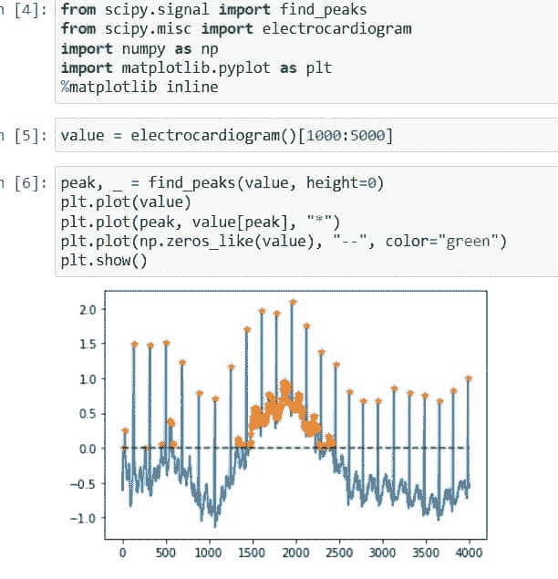
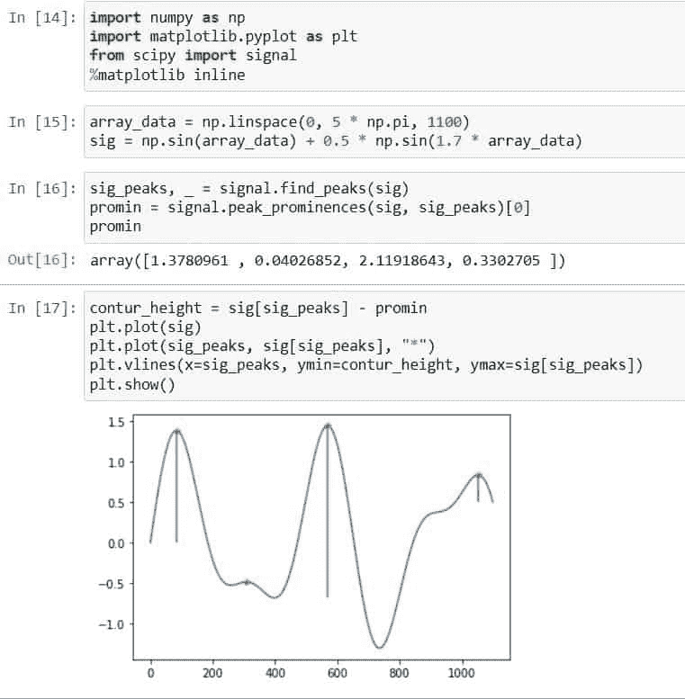
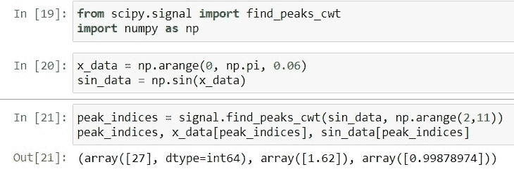
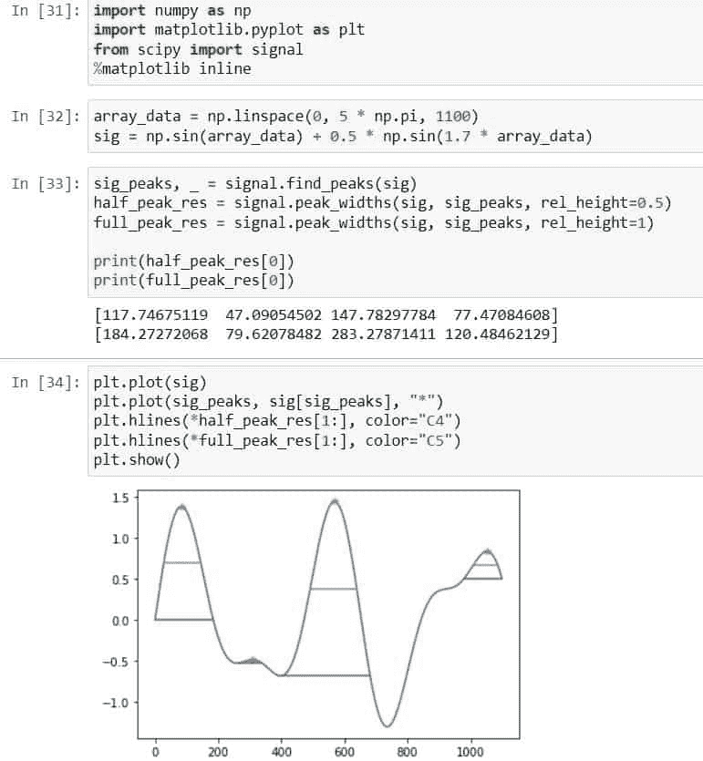
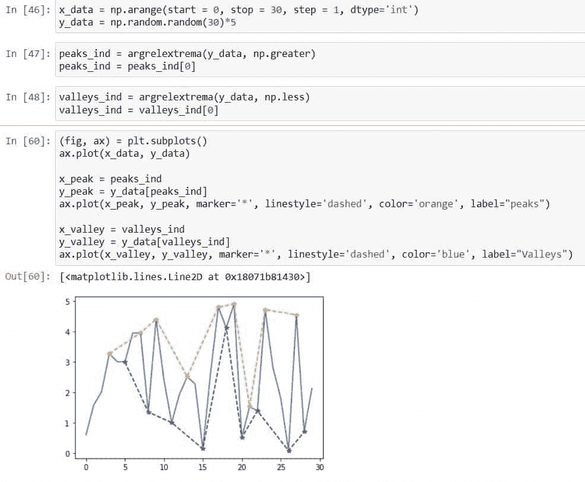
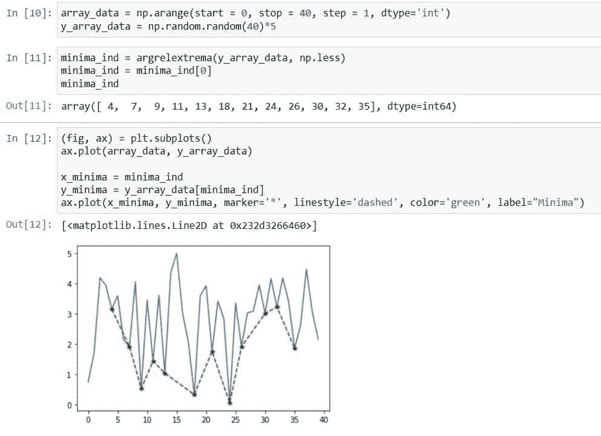

# Scipy 查找峰值–有用的教程

> 原文：<https://pythonguides.com/scipy-find-peaks/>

[](https://sharepointsky.teachable.com/p/python-and-machine-learning-training-course)

在这个 [Python 教程](https://pythonguides.com/learn-python/)中，我们将学习“ `Scipy Find Peaks` ”并借助各种例子讨论它的可用性。此外，涵盖以下主题。

*   科学发现峰值
*   科学发现了突出的顶峰
*   Scipy 查找峰值 cwt
*   科学发现高峰和低谷
*   科学发现峰值最小值
*   Scipy 发现峰宽

另外，查看最新的 Python Scipy 教程: [Python Scipy 曲线拟合](https://pythonguides.com/python-scipy-curve-fit/)

目录

[](#)

*   [科学发现高峰](#Scipy_Find_Peaks "Scipy Find Peaks")
*   [科学发现山峰突起](#Scipy_Find_Peaks_Prominence "Scipy Find Peaks Prominence")
*   [Scipy 查找峰值 cwt](#Scipy_Find_Peaks_cwt "Scipy Find Peaks cwt")
*   [Scipy 发现峰宽](#Scipy_Finds_Peak_Width "Scipy Finds Peak Width")
*   [科学发现高峰和低谷](#Scipy_Find_Peaks_and_Valleys "Scipy Find Peaks and Valleys")
*   [科学发现峰值最小值](#Scipy_Find_Peaks_Minima "Scipy Find Peaks Minima")

## 科学发现高峰

[Python Scipy](https://pythonguides.com/what-is-scipy-in-python/) 在模块`*`scipy.signal`*`中有一个方法`*`find_peaks()`*`，它根据给定的峰值属性返回所有的峰值。峰值不仅仅是电信号的峰值，数学函数中的最大值和最小值也被认为是峰值。

下面给出了语法。

```py
scipy.signal.find_peaks(x, height=1, prominence=4,  distance=2, width=2, threshold=1, rel_height=0.5, wlen=1, )
```

其中参数为:

*   ***x(序列):*** 用于接受需要寻找峰值的信号。
*   ***height (sequence，ndarray，number):*** 可能是一个整数，也可能是一个数组，用来设置待识别峰的最小高度。
*   ***threshold(sequence，ndarray，number):*** 一个峰值和它的邻居之间所需的垂直距离被称为阈值，当我们不想从噪声中挑出峰值时，它在噪声函数的情况下是非常有益的。
*   ***距离(数):*** 是相邻山峰之间所需的最小水平距离(数)。在峰值周期已知的情况下，这是非常有价值的。
*   ***日珥(sequence，ndarray，number):*** 用于提供峰值日珥。
*   ***宽度(sequence，ndarray，number):*** 用于提供峰值的宽度。
*   ***wlen(int):*** 它用于计算日珥峰值。
*   ***rel_height(int):*** 用于计算峰高。

让我们以下面的步骤为例:

使用下面的 python 代码导入所需的库。

```py
from scipy.signal import find_peaks
from scipy.misc import electrocardiogram
import matplotlib.pyplot as plt
%matplotlib inline
```

使用以下代码生成心电图。

```py
value = electrocardiogram()[1000:5000]
```

现在使用下面的代码。

```py
peak, _ = find_peaks(value, height=0)
plt.plot(value)
plt.plot(peak, value[peak], "*")
plt.plot(np.zeros_like(value), "--", color="green")
plt.show()
```



Scipy Find Peaks

这就是如何使用 Python SciPy 的方法`*`find_peaks()`*`找到信号的峰值。

阅读: [Scipy Misc + Examples](https://pythonguides.com/scipy-misc/)

## 科学发现山峰突起

Python SciPy 有一个方法`*`peak_prominence()`*`,该方法计算峰值与其最低轮廓线之间的垂直距离，并与信号的周围基线进行比较。

下面给出了语法。

```py
scipy.signal.peak_prominences(x, wlen=None, peaks)
```

其中参数为:

*   ***x(序列):*** 用于接受需要寻找峰值的信号。
*   ***wlen(int):*** 它用于指定采样窗口长度。
*   ***峰值(序列):***x 中的峰值指数

方法`*`peak_prominence()`*`返回 ndarray 类型的`*`prominences`*`(每个峰值)和 ***`left-right bases`*** 。

让我们以下面的步骤为例:

使用下面的 python 代码导入所需的库。

```py
import numpy as np
import matplotlib.pyplot as plt
from scipy import signal
%matplotlib inline
```

使用下面的代码生成一个信号。

```py
array_data = np.linspace(0, 5 * np.pi, 1100)
sig = np.sin(array_data) + 0.5 * np.sin(1.7 * array_data)
```

使用以下代码确定所有峰的显著性。

```py
sig_peaks, _ = signal.find_peaks(sig)
promin = signal.peak_prominences(sig, sig_peaks)[0]
promin
```

现在使用下面的代码计算并绘制每个峰的轮廓线的高度。

```py
contur_height = sig[sig_peaks] - promin
plt.plot(sig)
plt.plot(sig_peaks, sig[sig_peaks], "*")
plt.vlines(x=sig_peaks, ymin=contur_height, ymax=sig[sig_peaks])
plt.show()
```



Scipy Find Peaks Prominence

这就是如何使用 Python SciPy 的方法`*`peak_prominences()`*`找到峰的日珥。

阅读:[Scipy Sparse–有用的教程](https://pythonguides.com/scipy-sparse/)

## Scipy 查找峰值 cwt

Python SciPy 有一个方法`*`find_peaks_cwt()`*`，它使用``*Wavelet transformation*``在一维数组中寻找峰值。但是 ***“什么是小波变换？”*** 使用一对滤波器将 N 个样本的信号分解成低频带和高频带。每个频带都是两倍欠采样，每个频带有 N/2 个样本。

下面给出了语法。

```py
scipy.signal.find_peaks_cwt(vector, wavelet=None, widths, max_distances=None, window_size=None, gap_thresh=None, min_snr=0, min_length=None, noise_perc=9)
```

其中参数为:

*   ***vector(ndarray):*** 在一维数组中寻找波峰。
*   ***小波(可调用):*** 取两个参数后，必须返回一个一维数组与向量进行卷积。第一个参数指定输出小波数组中的点数，而第二个参数指定小波的尺度。
*   ***widths():*** 要计算 CWT 矩阵，请使用单一宽度或一维宽度数组。
*   ***最大距离(ndarray):*** 仅当第[n]行的相对最大值在第[n+1]行的相对最大值的最大距离[n]内时，脊线在每一行都是连通的。
*   ***window _ size(int):***要计算噪底，指定窗口的大小。
*   ***gap _ thresh(float):***如果在最大距离内没有找到相对最大值，就会有间隙。如果超过 *`gap_thresh`* 点而没有新的相对最大值，脊线终止。
*   ***min_snr(浮点):*** 最小信噪比。
*   ***min_length(int):*** 一条脊线的最小长度必须是可接受的。
*   ***noise _ PERC(float):***本底噪声是使用低于其噪声被考虑的数据点的百分比来计算的。

方法`*`find_peaks_cwt()`*`返回 te ***`peak_indices`*** 。

让我们通过下面的步骤来了解一个示例:

使用下面的 python 代码导入所需的库。

```py
from scipy.signal import find_peaks_cwt
import numpy as np
```

使用下面的代码，使用方法`*`np.sin()`*`生成数组元素并在该数组上应用函数 sin。

```py
x_data = np.arange(0, np.pi, 0.06)
sin_data = np.sin(x_data)
```

使用以下代码计算峰值指数或峰值。

```py
peak_indices = signal.find_peaks_cwt(sin_data, np.arange(2,11))
peak_indices, x_data[peak_indices], sin_data[peak_indices]
```



Scipy Find Peaks cwt

这就是如何使用 Python SciPy 的方法`*`find_peaks_cwt`*`找到峰值。

阅读: [Scipy 优化–实用指南](https://pythonguides.com/scipy-optimize/)

## Scipy 发现峰宽

Python SciPy 有一个方法`*`peak_widths()`*`可以确定每个信号峰值的宽度。

下面给出了语法。

```py
scipy.signal.peak_widths(x, rel_height=0.3, peaks, wlen=None, prominence_data=None)
```

其中参数为:

*   ***x(序列):*** 它用来接受信号。
*   ***wlen(int):*** 它用于指定采样窗口长度。
*   ***峰值(序列):***x 中的峰值指数
*   ***rel _ height(float):***选择峰宽的相对高度，以其突出度的百分比表示。峰的宽度在其最低轮廓线处计算为 1.0，日珥高度的一半计算为 0.5。
*   ***prominence _ data(tuple):***当用相同的参数 x 和 peaks 调用时，一个 3 数组的元组匹配 peak prominences 的结果。

方法`*`peak_widths()`*`返回 ***`widths`(样品峰宽)*** ， ***`widths_height`(用于计算宽度的轮廓线的高度。)`**``right_ips, left_ips`(各评价高度的水平线左右交点的插补位置)*** 。

让我们按照以下步骤来看一个例子:

使用下面的 python 代码导入所需的库。

```py
import numpy as np
import matplotlib.pyplot as plt
from scipy import signal
%matplotlib inline
```

使用下面的代码生成一个信号。

```py
array_data = np.linspace(0, 5 * np.pi, 1100)
sig = np.sin(array_data) + 0.5 * np.sin(1.7 * array_data)
```

使用以下代码确定所有峰的宽度。

```py
sig_peaks, _ = signal.find_peaks(sig)
promin = signal.peak_prominences(sig, sig_peaks)[0]
promin
```

使用以下代码绘制信号、峰值和等高线的宽度。

```py
plt.plot(sig)
plt.plot(sig_peaks, sig[sig_peaks], "*")
plt.hlines(*half_peak_res[1:], color="C4")
plt.hlines(*full_peak_res[1:], color="C5")
plt.show()
```



Scipy Finds Peak Width

这就是如何使用 Python SciPy 的方法`*`peak_widths()`*`计算峰宽。

阅读:[Python Scipy FFT【11 个有用的例子】](https://pythonguides.com/python-scipy-fft/)

## 科学发现高峰和低谷

在 Python SciPy 中，没有内置的方法来查找信号的波峰和波谷，这里我们将使用模块`scipy.signal`中的方法`*`argrelextrema()`*`手动执行这项任务。

要找到信号流的波峰和波谷，请执行以下步骤:

使用下面的 python 代码导入所需的库。

```py
import numpy as np
import matplotlib
import matplotlib.pyplot as plt
matplotlib.use('Agg')
from scipy.signal import argrelextrema
%matplotlib inline
```

使用下面的代码生成数据。

```py
x_data = np.arange(start = 0, stop = 30, step = 1, dtype='int')
y_data = np.random.random(30)*5
```

使用下面的代码计算峰值。

```py
peaks_ind = argrelextrema(y_data, np.greater)
peaks_ind = peaks_ind[0]
```

使用下面的代码计算山谷。

```py
valleys_ind = argrelextrema(y_data, np.less)
valleys_ind = valleys_ind[0]
```

用我们使用下面的代码生成的峰值和谷值数据绘制图表。

```py
(fig, ax) = plt.subplots()
ax.plot(x_data, y_data)

x_peak = peaks_ind
y_peak = y_data[peaks_ind]
ax.plot(x_peak, y_peak, marker='*', linestyle='dashed', color='orange', label="peaks")

x_valley = valleys_ind
y_valley = y_data[valleys_ind]
ax.plot(x_valley, y_valley, marker='*', linestyle='dashed', color='blue', label="Valleys")
```



Scipy Find Peaks and Valleys

这就是如何在 Python SciPy 中找到信号的波峰和波谷。

阅读:[Scipy Linalg–实用指南](https://pythonguides.com/scipy-linalg/)

## 科学发现峰值最小值

我们已经学习了如何使用 Python Scipy 库的方法`*`find_peaks()`*`找到信号的峰值或最大值。但在这一部分，我们将找到给定信号的最小值或谷值。

要找到信号或给定数据的最小值，请遵循以下步骤:

使用下面的 python 代码导入所需的库。

```py
import numpy as np
import matplotlib
import matplotlib.pyplot as plt
matplotlib.use('Agg')
from scipy.signal import argrelextrema
```

按照下面的代码，使用随机数据创建一个信号。

```py
array_data = np.arange(start = 0, stop = 40, step = 1, dtype='int')
y_array_data = np.random.random(40)*5
```

使用下面的代码计算信号的最小值。

```py
minima_ind = argrelextrema(y_array_data, np.less)
minima_ind = minima_ind[0]
minima_ind
```

用下面的代码在图上标出计算出的最小值。

```py
(fig, ax) = plt.subplots()
ax.plot(array_data, y_array_data)

x_minima = minima_ind
y_minima = y_array_data[minima_ind]
ax.plot(x_minima, y_minima, marker='*', linestyle='dashed', color='green', label="Minima")
```



Scipy Find Peaks Minima

这就是如何使用 Python SciPy 的方法`*`argrelextrema()`*`找到信号或数据的最小值。

另外，看看更多的 Python Scipy 教程。

*   [Python Scipy 卡方检验](https://pythonguides.com/python-scipy-chi-square-test/)
*   [Python Scipy Lognormal](https://pythonguides.com/python-scipy-lognormal/)
*   [Python Scipy 指数](https://pythonguides.com/python-scipy-exponential/)
*   [Scipy Stats Zscore +示例](https://pythonguides.com/scipy-stats-zscore/)
*   [Scipy Convolve–完整指南](https://pythonguides.com/scipy-convolve/)
*   [敏感信号——有用教程](https://pythonguides.com/scipy-signal/)
*   [Scipy Integrate +示例](https://pythonguides.com/scipy-integrate/)

因此，在本教程中，我们学习了“ `Scipy Find Peaks` ”并涵盖了以下主题。

*   科学发现峰值
*   科学发现了突出的顶峰
*   Scipy 查找峰值 cwt
*   科学发现高峰和低谷
*   科学发现峰值最小值
*   Scipy 发现峰宽

[Bijay Kumar](https://pythonguides.com/author/fewlines4biju/)

Python 是美国最流行的语言之一。我从事 Python 工作已经有很长时间了，我在与 Tkinter、Pandas、NumPy、Turtle、Django、Matplotlib、Tensorflow、Scipy、Scikit-Learn 等各种库合作方面拥有专业知识。我有与美国、加拿大、英国、澳大利亚、新西兰等国家的各种客户合作的经验。查看我的个人资料。

[enjoysharepoint.com/](https://enjoysharepoint.com/)[](https://www.facebook.com/fewlines4biju "Facebook")[](https://www.linkedin.com/in/fewlines4biju/ "Linkedin")[](https://twitter.com/fewlines4biju "Twitter")