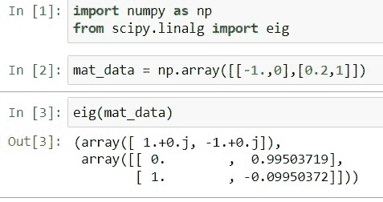
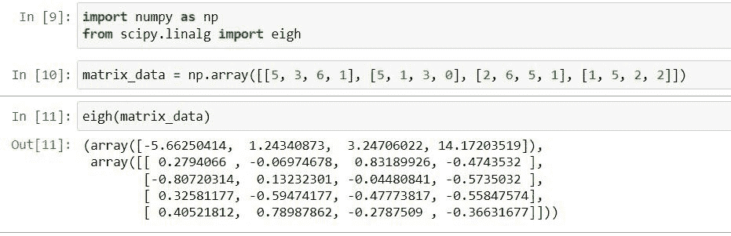
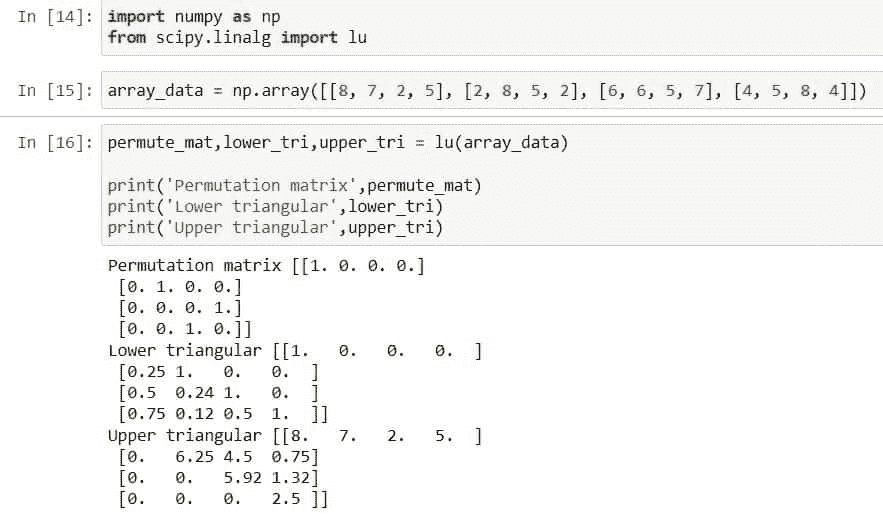
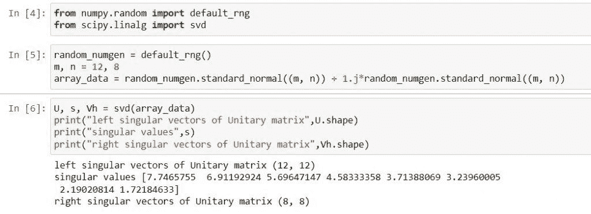
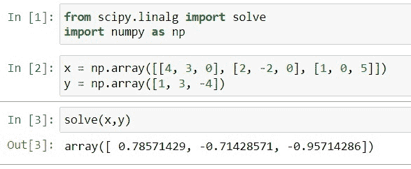
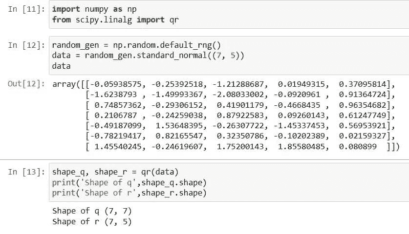
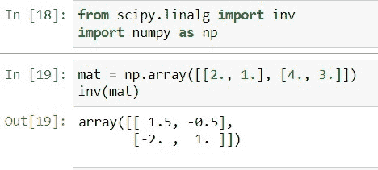
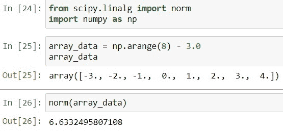
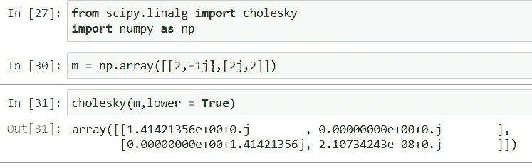

# scipy Linalg–有用的指南

> 原文：<https://pythonguides.com/scipy-linalg/>

[](https://sharepointsky.teachable.com/p/python-and-machine-learning-training-course)

在这个 [Python 教程](https://pythonguides.com/learn-python/)中，我们将学习“ `Scipy Linalg` ”。在这里我们将学习如何解决线性代数问题。此外，我们还将讨论以下主题。

*   Scipy Linalg
*   Scipy Linalg(科学怪人)
*   西比·林格尔
*   Scipy Linalg Lu
*   Scipy Linalg Svd.
*   Scipy Linalg Solve
*   Scipy Linalg Qr
*   Scipy Linalg Inverse
*   Scipy Linalg Norm
*   西皮·里纳尔格·乔莱斯基

目录

[](#)

*   [Scipy Linalg](#Scipy_Linalg "Scipy Linalg")
*   [西比林藻卵](#Scipy_Linalg_Eig "Scipy Linalg Eig")
*   [草履虫八号】T1](#Scipy_Linalg_Eigh "Scipy Linalg Eigh")
*   [Scipy Linalg Lu](#Scipy_Linalg_Lu "Scipy Linalg Lu")
*   [Scipy Linalg Svd](#Scipy_Linalg_Svd "Scipy Linalg Svd")
*   [Scipy Linalg Solve](#Scipy_Linalg_Solve "Scipy Linalg Solve")
*   [Scipy Linalg Qr](#Scipy_Linalg_Qr "Scipy Linalg Qr")
*   [Scipy Linalg inverse](#Scipy_Linalg_inverse "Scipy Linalg inverse")
*   [Scipy Linalg Norm](#Scipy_Linalg_Norm "Scipy Linalg Norm")
*   斯皮·里纳尔格·乔莱斯基

## Scipy Linalg

[Python Scipy](https://pythonguides.com/what-is-scipy-in-python/) 中的`*`scipy.linalg`*`模块用于解决线性代数问题。我们可以使用这个库来解决方程、矩阵、特征值和特殊的矩阵问题等。

它有多种解决线性代数问题的方法。`*`linalg`*`库中的所有方法被分成以下几个部分:

*   特征值问题
*   矩阵函数
*   基础
*   分解
*   草图和随机投影
*   低级例程
*   矩阵方程求解器
*   特殊矩阵

在接下来的小节中，我们将学习模块`*`scipy.linalg`*`最常见的方法。

## 西比林藻卵

Python Scipy 在模块`*`scipy.linalg`*`中有一个方法`*`eig()`*`来处理常见的特征值问题。

下面给出了语法。

```py
scipy.linalg.eig(a, b=None, right=False, left=True, overwrite_a=True, overwrite_b=True, check_finite=False, homogeneous_eigvals=True)
```

其中参数为:

*   ***a(array_data):*** 提供实矩阵或复矩阵作为计算特征向量和特征值的输入。
*   ***b(array_data):*** 输入右侧矩阵。
*   ***右(布尔):*** 计算并得到右特征向量。
*   ***左(布尔):*** 计算并得到左特征向量。
*   ***覆盖 _a(布尔):*** 覆盖`*`a`*`。
*   ***覆盖 _b(布尔):*** 覆盖`*`b`*`。
*   ***check _ finite(boolean):***检查提供的作为输入的矩阵是否有有限个数字。
*   ***【齐次 _ 特征值(布尔):*** 获取齐次坐标中的特征值

方法`*`eig()`*`返回复数 ndarray 或 double 类型的 ***`w`(特征值)*** 、 ***`vr`(规范化的右向量)*** 和 ***`vl`(规范化的左向量)***

让我们以下面的步骤为例:

使用下面的 python 代码导入所需的库。

```py
import numpy as np
from scipy.linalg import eig
```

使用下面的代码创建一个矩阵形式的数据数组。

```py
mat_data = np.array([[-1.,0],[0.2,1]])
```

使用以下代码将创建的矩阵数据传递给方法`eig()`。

```py
eig(mat_data)
```



Scipy Linalg Eig

这就是如何使用 Python Scipy 的方法`*`eig()`*`计算特征值和特征向量。

阅读: [Scipy 卷积器](https://pythonguides.com/scipy-convolve/)

## 草履虫八号】T1

Python Scipy 在模块`*`scipy.linalg`*`中有一个方法`*`eigh()`*`来处理实对称或厄米矩阵的标准普通特征值问题。

下面给出了语法。

```py
scipy.linalg.eigh(a, b=None, eigvals_only=True, lower=False, overwrite_a=True, overwrite_b=True, turbo=False, eigvals=None, type=1, check_finite=False, subset_by_index=None, subset_by_value=None, driver=None)
```

其中参数为:

*   ***a(array_data):*** 提供实矩阵或复矩阵作为计算特征向量和特征值的输入。
*   ***b(array_data):*** 输入右侧矩阵。
*   ***lower(bool):*** 相关数组的数据是从 a 的下三角还是上三角中选取的
*   ***egvals _ only(boolean):***只计算特征值，不计算特征向量。默认情况下，两者都是经过计算的。
*   ***覆盖 _a(布尔):*** 覆盖`*`a`*`。
*   ***覆盖 _b(布尔):*** 覆盖`*`b`*`。
*   ***check _ finite(boolean):***检查提供的作为输入的矩阵是否有有限个数字。
*   ***subset _ by _ index(iterable):***使用可迭代的二元定义开始和结束特征值索引。
*   ***subset _ by _ value(iterable):***用一个可迭代的二元来定义半区间只求特征值。

方法`*`eigh()`*`以 ndarray 类型的递增大小返回 ***`w`(选定的特征值)*** 。

让我们按照下面的步骤举例:

使用下面的 python 代码导入所需的库。

```py
import numpy as np
from scipy.linalg import eigh
```

使用下面的代码创建一个矩阵形式的数据数组。

```py
matrix_data = np.array([[5, 3, 6, 1], [5, 1, 3, 0], [2, 6, 5, 1], [1, 5, 2, 2]])
```

使用以下代码将创建的矩阵数据传递给方法`*`eigh()`*`。

```py
eigh(matrix_data)
```



Scipy Linalg Eigh

这就是如何使用 Python Scipy 的方法`*`eigh()`*`计算特征值。

阅读: [Scipy Ndimage Rotate](https://pythonguides.com/scipy-ndimage-rotate/)

## Scipy Linalg Lu

Python Scipy 在模块`*`scipy.linalg`*`中有一个方法`*`lu()`*`来计算矩阵的旋转 Lu 分解。

下面给出了语法。

```py
scipy.linalg.lu(a, permute_l=True, check_finite=False, overwrite_a=True,)
```

其中参数为:

*   ***a(数组 _ 数据):*** 对数组进行分解。
*   ***permute_l(布尔):*** 做乘法
*   ***覆盖 _a(布尔):*** 覆盖`a`。
*   ***check _ finit(boolean):***检查提供的作为输入的矩阵是否有有限个数字。

方法返回 ***`p`(置换矩阵)*** ， ***`l`(下三角)*** ， ***`u`(上三角)``*permute_l equal to false*``， ***`pl`(置换 L 矩阵)*** ， ***`u`(上三角) ***`permute_l equal to true```*``

让我们通过下面的步骤来了解一个示例:

使用下面的 python 代码导入所需的库。

```py
import numpy as np
from scipy.linalg import lu
```

使用下面的代码创建一个数据数组。

```py
array_data = np.array([[8, 7, 2, 5], [2, 8, 5, 2], [6, 6, 5, 7], [4, 5, 8, 4]])
```

使用下面的代码将创建的数据数组传递给方法`*`lu()`*`。

```py
permute_mat,lower_tri,upper_tri = lu(array_data)

print('Permutation matrix',permute_mat)
print('Lower triangular',lower_tri)
print('Upper triangular',upper_tri)
```



Scipy Linalg Lu

查看输出，结果是``*Permutaton matrix*``、``*Lower triangular*``和``*Upper triangular*``。

这就是如何使用``*lu() for Lu decomposition of a*`` 矩阵的方法。

阅读: [Scipy 正态分布](https://pythonguides.com/scipy-normal-distribution/)

## Scipy Linalg Svd

Python Scipy 在模块`*`scipy.linalg`*`中有一个方法`*`svd()`*`用于奇异分解值。

下面给出了语法。

```py
scipy.linalg.svd(a, compute_uv=False, full_matrices=False, overwrite_a=True, check_finite=False, lapack_driver='gesdd')
```

其中参数为:

*   ***a(array_data):*** 是用于分解的矩阵。
*   ***compute_uv(布尔):*** 计算除 s 之外的 v 和 uh
*   ***full _ matrix(布尔):*** 对于真值，v 和 uh 的形状为(M，M) (N，N)，对于假值，形状为(M，K)和(K，N)。
*   ***覆盖 _a(布尔):*** 覆盖`a`。
*   ***check _ finite(boolean):***检查提供的作为输入的矩阵是否有有限个数字。
*   ***lapack_driver(gesvd，gesdd):*** 使用更高效的通用矩形方法或分治方法。

方法`*`svd()`*`返回 ndarray 类型的 ***`U`(酉矩阵的左奇异向量)*** ， ***`s`(奇异值)*** 和 ***`vh`(酉矩阵的右奇异向量)*** 。

让我们以下面的步骤为例:

使用下面的 python 代码导入所需的库。

```py
from numpy.random import default_rng
from scipy.linalg import svd
```

使用随机生成器 default_rng 通过下面的代码生成一个数据数组。

```py
random_numgen = default_rng()
m, n = 12, 8
array_data = random_numgen.standard_normal((m, n)) + 1.j*random_numgen.standard_normal((m, n))
```

使用下面的代码对数据数组执行 svd。

```py
U, s, Vh = svd(array_data)
print("left singular vectors of Unitary matrix",U.shape)
print("singular values",s)
print("right singular vectors of Unitary matrix",Vh.shape)
```



Scipy Linalg Svd

这就是如何使用方法`*`svd()`*`对数组进行奇异分解。

阅读: [Scipy Stats Zscore](https://pythonguides.com/scipy-stats-zscore/)

## Scipy Linalg Solve

Python Scipy 在模块`*`scipy.linalg`*`中有一个方法`*`solve()`*`来处理与线性方程相关的问题，例如``*ax = b*``，这意味着这个方程是为方阵`*`a`*`的值`*`x`*`求解的。

下面给出了语法。

```py
scipy.linalg.solve(a, b, overwrite_a=True, lower=True, debug=None, overwrite_b=True, sym_pos=True, assume_a='gen', check_finite=False, transposed=True)
```

其中参数为:

*   *(array _ data):接受方形数据作为输入。*
*   *b(array_data):输入数据的右边。*
*   ****lower(bool):*** 相关数组的数据是从 a 的下三角还是上三角中选取的*
*   ****覆盖 _a(布尔):*** 覆盖 a*
*   ****覆盖 _b(布尔):*** 覆盖`*`b`*`。*
*   ****check _ finite(boolean):***检查提供的作为输入的矩阵是否有有限个数字。*
*   ****sym _ post(boolean):***而不是`*`sym_pos`*`使用参数``*assume_a = pos*``，因为`*`sym_pos`*`已经折旧。该参数认为参数`*`a`*`提供的值是非对称正定的。*
*   ****它应该包含什么*** 值在上面的参数中有解释。*
*   ****转置(布尔):*** 如果为真，则`a`转置，如``*a*T x = b*``。*

 *方法`solve`返回 ndarray 类型的 ***`x`(这是一个解数组)*** 和发生的错误。

让我们以下面的步骤为例:

使用下面的 python 代码导入所需的库。

```py
from scipy.linalg import solve
import numpy as np
```

给定 x 和 y 的值，找出 z 的值，首先，使用下面的代码创建 x 和 y 的数据数组。

```py
x = np.array([[4, 3, 0], [2, -2, 0], [1, 0, 5]])
y = np.array([1, 3, -4])
```

使用下面的代码求解 z 的 x 和 y。

```py
solve(x,y)
```



Scipy Linalg Solve

这就是如何用`*`solve()`*`的方法解决线性方程问题。

读取:[敏感信号](https://pythonguides.com/scipy-signal/)

## Scipy Linalg Qr

我们将讨论矩阵的 QR 分解或 QR 分解。QR 分解是矩阵的分解，例如“A”分解成“A=QR”，其中 R 是上三角矩阵，Q 是正交的。我们用 Python SciPy 方法`*`scipy.linalg.qr()`*`函数分解矩阵。

下面给出了语法。

```py
scipy.linalg.qr(a, overwrite_a=True, lwork=None, mode='full', pivoting=True, check_finite=False)
```

其中参数为:

*   ***a(array_data):*** 输入我们要分解的矩阵。
*   ***覆盖 _a(布尔):*** 覆盖`a`。
*   ***check _ finite(boolean):***检查提供的作为输入的矩阵是否有有限个数字。
*   ***lwork(int):*** 工作数组的大小，`lwork >= a.shape[1]`。如果未指定或指定了-1，则确定最佳大小。
*   ***模式:*** 确定将同时返回 Q 和 R ('full '，这是默认值)，仅返回 R ('r ')，或者同时返回 Q 和 R，但按经济规模计算。
*   ***旋转(布尔):*** 旋转是否应该包含在因子分解中以进行等级揭示 qr 分解。如果旋转，如上所述进行分解``*A P = Q R*``，但是选择 P，使得 R 的对角线不增加。

该方法返回 ndarray 或 float 或 int 类型的 ***`Q`(其形状为 M，M)*** ，***`R`(M，N 的形状)*** 和***`P`(N 的形状)*** 。

让我们以下面的步骤为例:

使用下面的 python 代码导入所需的库。

```py
import numpy as np
from scipy.linalg import qr
```

创建一个随机数生成器的对象，并使用下面的代码从正态分布中生成一个样本。

```py
random_gen = np.random.default_rng()
data = random_gen.standard_normal((7, 5))
data
```

对数据执行`qr`并使用以下代码检查形状。

```py
shape_q, shape_r = qr(data)
print('Shape of q',shape_q.shape)
print('Shape of r',shape_r.shape)
```



Scipy Linalg Qr

这就是如何使用 Python Scipy 的方法`*`qr()`*`进行 QR 分解。

阅读: [Scipy Misc + Examples](https://pythonguides.com/scipy-misc/)

## Scipy Linalg inverse

Python SciPy 在模块`*`sicpy.linalg`*`中包含一个方法`*`inv()`*`,用于确定矩阵的逆矩阵。

下面给出了语法。

```py
scipy.linalg.inv(a, overwrite_a=True, check_finite=False)
```

其中参数为:

*   ***a(array_data):*** 输入我们要求逆的矩阵。
*   ***覆盖 _a(布尔):*** 覆盖`a`。
*   ***check _ finite(boolean):***检查提供的作为输入的矩阵是否有有限个数字。

方法`*`inv()`*`返回 ***`inv`(矩阵的逆)*** 。

让我们以下面的步骤为例:

使用下面的代码导入所需的库。

```py
from scipy.linalg import inv
import numpy as np
```

创建一个矩阵，并用下面的代码求逆。

```py
mat = np.array([[2., 1.], [4., 3.]])
inv(mat)
```



Scipy Linalg Inverse

这就是如何使用 Python SciPy 的方法`*`inv()`*`对给定矩阵求逆。

阅读:[Scipy Sparse–有用的教程](https://pythonguides.com/scipy-sparse/)

## Scipy Linalg Norm

Python SciPy 有一个从 8 种不同形式返回矩阵范数的方法``norm()``。

下面给出了语法。

```py
scipy.linalg.norm(a, axis=None, ord=None, check_finite=True,  keepdims=True)
```

其中参数为:

*   ***a(array_data):*** 输入的数组除非 ord 为 None，否则 axis 必须为 None，a 必须为 1 维或 2 维，如果 axis 和 ord 都为 None，则返回 a.ravel 2-norm。
*   ***轴(2 元组的 int，int):*** 如果轴是整数，则指定要计算向量范数的轴。如果轴是二元组，则指定保存二维矩阵的轴，并计算这些矩阵的矩阵范数。
*   ***ord(int，inf):*** 用于提供定额订单。
*   ***check _ finite(boolean):***检查提供的作为输入的矩阵是否有有限个数字。
*   ***keepdims(布尔):*** 如果设置为真，则被赋范的轴作为尺寸为 1 的尺寸留在结果中。

方法`*`norm()`*`返回给定矩阵的范数。

让我们以下面的步骤为例:

使用下面的 python 代码导入所需的库。

```py
from scipy.linalg import norm
import numpy as np
```

创建一个矩阵形式的数据数组，将使用下面的代码计算其范数。

```py
array_data = np.arange(8) - 3.0
array_data
```

使用下面的代码计算上面创建的矩阵或数据数组的范数。

```py
norm(array_data)
```



Scipy Linalg Norm

这就是如何使用 Python SciPy 的方法`*`norm()`*`计算给定矩阵的范数。

阅读: [Scipy 优化–实用指南](https://pythonguides.com/scipy-optimize/)

## 斯皮·里纳尔格·乔莱斯基

Python SciPy 有一个方法`*`cholesky()`*`，它返回埃尔米特正定矩阵 A 的乔莱斯基分解``*A=LL or A=UU*``。

下面给出了语法。

```py
scipy.linalg.cholesky(a, lower=True, overwrite_a=True, check_finite=False)
```

其中参数为:

*   ***a(数组 _ 数据):*** 对数组进行分解。
*   `**`lower(bool):`**`相关数组的数据是从 a 的下三角还是上三角中选取的
*   ***覆盖 _a(布尔):*** 覆盖`a`。
*   ***check _ finite(boolean):***检查提供的作为输入的矩阵是否有有限个数字。

方法`*`cholesky()`*`返回 ndarray 类型的`c`(上三角形或下三角形的 Cholesky 因子)。

让我们以下面的步骤为例:

使用下面的 python 代码导入所需的库。

```py
from scipy.linalg import cholesky
import numpy as np
```

使用下面的代码创建一个矩阵。

```py
m = np.array([[2,-1j],[2j,2]])
```

使用下面的代码计算矩阵的 Cholesky。

```py
cholesky(m,lower = True)
```



Scipy Linalg Cholesky

这是如何使用 Python SciPy 的方法`*`cholesky()`*`计算给定矩阵的 Cholesky。

另外，看看更多的 Scipy 教程。

*   [Python Scipy 特辑](https://pythonguides.com/python-scipy-special/)
*   [Python Scipy 特征值](https://pythonguides.com/python-scipy-eigenvalues/)
*   [Python Scipy 衍生的数组](https://pythonguides.com/python-scipy-derivative-of-array/)
*   [Scipy 常量–多个示例](https://pythonguides.com/scipy-constants/)
*   [Scipy Sparse–有用的教程](https://pythonguides.com/scipy-sparse/)
*   [Python Scipy Matrix +示例](https://pythonguides.com/python-scipy-matrix/)

因此，在本教程中，我们已经了解了" `Scipy Linalg` "并涵盖了以下主题。

*   Scipy Linalg
*   Scipy Linalg(科学怪人)
*   scipy linalg 号文件。
*   Scipy Linalg Lu
*   Scipy Linalg Svd.
*   Scipy Linalg Solve
*   Scipy Linalg Qr
*   Scipy Linalg Inverse
*   Scipy Linalg Norm
*   西皮·里纳尔格·乔莱斯基

[Bijay Kumar](https://pythonguides.com/author/fewlines4biju/)

Python 是美国最流行的语言之一。我从事 Python 工作已经有很长时间了，我在与 Tkinter、Pandas、NumPy、Turtle、Django、Matplotlib、Tensorflow、Scipy、Scikit-Learn 等各种库合作方面拥有专业知识。我有与美国、加拿大、英国、澳大利亚、新西兰等国家的各种客户合作的经验。查看我的个人资料。

[enjoysharepoint.com/](https://enjoysharepoint.com/)[](https://www.facebook.com/fewlines4biju "Facebook")[](https://www.linkedin.com/in/fewlines4biju/ "Linkedin")[](https://twitter.com/fewlines4biju "Twitter")*