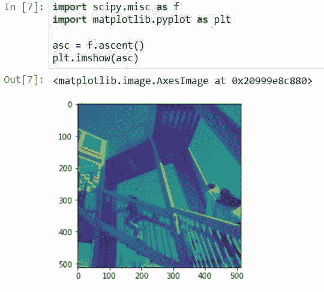

# Scipy 杂项+示例

> 原文：<https://pythonguides.com/scipy-misc/>

[](https://sharepointsky.teachable.com/p/python-and-machine-learning-training-course)

在这个 [Python 教程](https://pythonguides.com/learn-python/)中，我们将学习“ `Scipy Misc` 并讨论与之相关的多个例子。此外，我们将讨论以下主题。

*   Scipy Misc
*   Scipy 杂项信息
*   Scipy Misc imsave
*   Scipy Misc toimage
*   Scipy 杂项衍生物
*   Scipy Misc imresize
*   Scipy 杂项梳
*   Scipy 杂项上升
*   Scipy 杂项脸
*   Scipy 杂项因子

目录

[](#)

*   [Scipy Misc](#Scipy_Misc "Scipy Misc")
*   [科学杂项信息](#Scipy_Misc_imread "Scipy Misc imread")
*   [Scipy Misc imsave](#Scipy_Misc_imsave "Scipy Misc imsave")
*   [Scipy Misc toimage](#Scipy_Misc_toimage "Scipy Misc toimage")
*   [科学杂项导数](#Scipy_Misc_derivative "Scipy Misc derivative")
*   [Scipy Misc imresize](#Scipy_Misc_imresize "Scipy Misc imresize")
*   [Scipy 杂项梳](#Scipy_Misc_comb "Scipy Misc comb")
*   [科学杂项上升](#Scipy_Misc_ascent "Scipy Misc ascent")
*   [Scipy Misc face](#Scipy_Misc_face "Scipy Misc face")
*   [科学杂项阶乘](#Scipy_Misc_factorial "Scipy Misc factorial")

## Scipy Misc

在 [Scipy](https://pythonguides.com/what-is-scipy-in-python/) 中有一个模块`*`scipy.misc`*`也就是``*Miscellaneous routines*``，它有不同的不属于任何特定模块的实用程序或方法。

它有五种不同用途的五种方法，如下所示。

*   ***【central _ diff _ weights():***求给定中心导数的 Np-点的权重。
*   ***face():*** 返回浣熊脸，大小为 1024 x 768。
*   ***ascent():*** 它返回大小为 512 x 512 的 8 位灰度位深度，这是用于演示目的的派生图像。
*   ***【心电图():*** 用于加载心电图作为一维信号。
*   ***导数():*** 返回给定函数在某一点的第 n 阶导数。

在本教程的后面，我们将分别学习上述方法。

另外，检查:[科学常数](https://pythonguides.com/scipy-constants/)

## 科学杂项信息

Scipy 版本 1.2.0 中删除了用于从文件中读取图像的 Scipy 方法`*`imread()`*`。该方法存在于另一个名为`*`imageio`*`的库中。所以在这里我们将安装这个库并读取一个图像。

下面给出了语法。

```py
imageio.imread(file_path)
```

其中`*`file_path`*`是我们想要读取的图像的路径。

打开一个新的 Jupiter 笔记本或使用 cmd 在计算机上安装库，如下所示步骤:

```py
!pip install imageio
```

使用下面的代码导入库。

```py
import imageio
import matplotlib.pyplot as plt
%matplotlib inline
```

使用`imread()`方法读取图像。

```py
image = imageio.imread('keith_tanner.jpg')
```

上面的代码包含从指定路径读取图像并返回该图像的 ndarray 的方法`*`imread()`*`。

现在使用下面的代码，使用子模块`*`matplotlib.pyplot`*`的方法`*`imshow()`*`查看图像。

```py
plt.figure(figsize=(5,5))
plt.imshow(image) 
plt.axis('off')
plt.show()
```


Scipy Misc imread

这是如何使用方法`imread`读取图像。

阅读: [Scipy 优化](https://pythonguides.com/scipy-optimize/)

## Scipy Misc imsave

用于将图像从数组保存到文件的 Scipy 方法`*`imsave()`*`已从 Scipy 版本 1.2.0 中删除。存在于另一个库`*`imageio`*`中的方法`imwrite()`被用来代替那个方法。

下面给出了语法。

```py
imageio.imwrite(uri,array_data,format)
```

其中参数为:

*   ***uri(string):*** 是我们要保存的文件的名称。
*   ***array_data:*** 它是一幅图像的数组值。
*   ***格式(字符串):*** 用于指定我们要读取的图像的格式。

让我们以下面的步骤为例:

使用下面的代码导入所需的库。

```py
import numpy as np
import imageio
```

使用元组创建行和列，如下面的代码所示。

```py
row, col = (10,10)
```

使用定义的行和列创建数组。

```py
array_data = np.zeros((row,col))
```

使用下面的代码创建一个图像。

```py
 image = imageio.imwrite('creating_img.png',array_data)
```


Scipy Misc imsave

上面的代码用零值创建了 64 字节的图像。

阅读: [Scipy 稀疏](https://pythonguides.com/scipy-sparse/)

## Scipy Misc toimage

Scipy 版本 1.2.0 中删除了用于从数组创建映像的 Scipy 方法`*`toread()`*`。存在于另一个库`*`PIL`*`中的方法`*`PIL.mage.fromarray()`*`被用来代替那个方法。

下面给出了语法。

```py
image.fromarray(obj)
```

其中参数为:

*   ***obj:*** 它是一个包含图像值的数组。

让我们通过一个使用以下步骤的示例来理解:

首先，安装库`PIL`因为这里我们要在 Jupyter 笔记本中安装库。

```py
!pip install Pillow
```

使用下面的代码导入所需的库。

```py
from PIL import Image
import matplotlib.pyplot as plt
import numpy as np
%matplotlib inline
```

打开任何图像并将其转换为数组。

```py
img = Image.open("severin_candrian.jpg")
array = np.array(img)
```

使用下面的代码从上面的数组创建一个 PIL 图像。

```py
pilimage=Image.fromarray(array)
```

使用下面的代码查看图像。

```py
plt.figure(figsize=(5,5))
plt.imshow(pilimage) 
plt.axis('off')
plt.show()
```


Scipy Misc toimage

这是如何从一个给定的数组创建一个图像。

阅读:[剪切旋转图像](https://pythonguides.com/scipy-rotate-image/)

## 科学杂项导数

Scipy 模块`*`misc`*`包含一个方法`*`derivative()`*`,用于查找给定函数在某一点的 n 阶导数。

下面给出了语法。

```py
scipy.misc.derivative(func, x0, dx=1.0, n=1, args=(), order=3)
```

其中参数为:

*   ***func:*** 就是我们要求其 n 阶导数的函数。
*   ***x0(浮点):*** 用于指定求导的点。
*   ***dx(浮点):*** 用来指定间距。
*   ***n(int):*** 用于指定导数的阶。
*   ***args(tuple):*** 它用来提供自变量。
*   ***(int):***用来指定要使用的点数。

让我们以下面的代码为例。

```py
from scipy.misc import derivative
def fun(x):
    return x`4 + x`3
derivative(fun, 1.0, dx=1e-7)
```


Scipy Misc derivative

阅读: [Scipy Integrate +示例](https://pythonguides.com/scipy-integrate/)

## Scipy Misc imresize

模块`*`scipy.misc`*`中的方法`*`imresize()`*`在 Scipy 版中已被弃用。这里我们可以用库枕的方法`*`resize()`*`来代替方法`*`imresize()`*`。

下面给出了语法。

```py
image.resize(size)
```

其中参数`*`size`*`获取我们想要调整大小的图像的像素大小。

让我们以下面的步骤为例:

使用下面的代码导入库`*`pillow`*`的模块`*`image`*`。

```py
import PIL.Image as img
import matplotlib.pyplot as plt
```

使用下面的代码打开任何我们想要调整大小的图像。

```py
imz = img.open('lesly_derksen.jpg')
```

使用下面的代码查看和检查图像的大小。

```py
plt.imshow(imz)
imz.size
```


Scipy Misc imresize

为图像定义新的大小，如下面的代码所示。

```py
new_size = (300,300)
```

让我们使用下面的代码来减小图像的大小。

```py
imz1= imz.resize(new_size)
```

现在使用下面的代码来查看缩小后的图像。

```py
plt.imshow(imz1)
imz1.size
```


Scipy Misc imresize example

阅读: [Scipy 信号-有用教程](https://pythonguides.com/scipy-signal/)

## Scipy 杂项梳

模块`*`scipy.misc`*`中的方法`*`comb()`*`在 Scipy 版中已被弃用。该方法已经转移到另一个名为`*`scipy.special`*`的模块中。这个方法是用来求 k 时刻取的 n 个东西的组合数的。

下面给出了语法。

```py
scipy.special.comb(N, k, exact=False, repetition=False)
```

其中参数为:

*   ***N(ndarray 或 int):*** 用来指定事物的数量。
*   ***K(ndarray 或 int):*** 用于指定取的元素个数。
*   ***exact(boolean):*** 当其为真时，使用长整数算法计算正确的解，否则以浮点计算近似解。
*   ***重复(bool):*** 如果为真，那么它计算有重复的组合数。

让我们以下面的代码为例。

```py
from scipy.special import comb
k_time = np.array([6, 7])
n_things = np.array([15, 15])
comb(n_things, k_time, exact=False)
```


Scipy Misc comb

阅读: [Scipy 卷积-完整指南](https://pythonguides.com/scipy-convolve/)

## 科学杂项上升

Scipy 模块 ***`misc`*** 包含另一个方法`*`ascent()`*`来获取大小为 512×512 的派生图像的 8 位灰度位深度。

下面给出了语法。

```py
scipy.misc.ascent()
```

出于演示目的，该方法返回`*`ascent`*`类型的 ndarray 图像。

让我们以下面的代码为例。

```py
import scipy.misc as f
import matplotlib.pyplot as plt

asc = f.ascent()
plt.imshow(asc)
```



Scipy Misc ascent

## Scipy Misc face

Scipy 模块 ***`misc`*** 包含另一个方法`face()`来获得大小为 1024×768 的彩色浣熊脸。

下面给出了语法。

```py
scipy.misc.face(gray=False)
```

其中参数为:

***gray(布尔):*** 为真时返回 8 位灰度图像，否则返回彩色图像。

让我们按照下面的步骤举个例子。

导入必要的文件。

```py
import scipy.misc as f
import matplotlib.pyplot as plt
```

使用下面的代码生成浣熊脸。

```py
racoon_face = f.face()
```

使用下面的代码显示生成的图像。

```py
plt.imshow(racoon_face)
```


Scipy Misc face

## 科学杂项阶乘

模块`*`scipy.misc`*`中的方法`*`factorial()`*`在 Scipy 版中已被弃用。该方法已经转移到另一个名为`*`scipy.special`*`的模块中。此方法用于查找数组中包含的一个数字或所有元素的阶乘。

下面给出了语法。

```py
scipy.special.factorial(n, exact=False)
```

其中参数为:

***n(int 或 array):*** 是我们要求其阶乘的数字或数字数组。

***exact(boolean):*** 当其为真时，使用长整数算法计算正确的解，否则以浮点计算近似解。

让我们举一个例子，用下面的步骤计算一个数组中所有元素的阶乘。

使用下面的代码导入所需的库。

```py
from scipy.special import factorial
import numpy as np
```

使用下面的方法创建一个数组并将其传递给方法`*`factorial()`*`。

```py
array = np.array([5, 6, 7])
factorial(array, exact=False)
```


Scipy Misc factorial

因此，在本教程中，我们已经了解了" `Scipy Misc` "并涵盖了以下主题。

*   Scipy Misc
*   Scipy 杂项信息
*   Scipy Misc imsave
*   Scipy Misc toimage
*   Scipy 杂项衍生物
*   Scipy Misc imresize
*   Scipy 杂项梳
*   Scipy 杂项上升
*   Scipy 杂项脸
*   Scipy 杂项因子

[Bijay Kumar](https://pythonguides.com/author/fewlines4biju/)

Python 是美国最流行的语言之一。我从事 Python 工作已经有很长时间了，我在与 Tkinter、Pandas、NumPy、Turtle、Django、Matplotlib、Tensorflow、Scipy、Scikit-Learn 等各种库合作方面拥有专业知识。我有与美国、加拿大、英国、澳大利亚、新西兰等国家的各种客户合作的经验。查看我的个人资料。

[enjoysharepoint.com/](https://enjoysharepoint.com/)[](https://www.facebook.com/fewlines4biju "Facebook")[](https://www.linkedin.com/in/fewlines4biju/ "Linkedin")[](https://twitter.com/fewlines4biju "Twitter")