# 科学正态分布

> 原文：<https://pythonguides.com/scipy-normal-distribution/>

[](https://sharepointsky.teachable.com/p/python-and-machine-learning-training-course)

在本 [Python 教程](https://pythonguides.com/learn-python/)中，我们将学习“**科学正态分布**”，我们还将借助一些例子讨论以下主题。

*   科学正态分布
*   科学正态分布 PDF
*   带均值和标准差的正态分布
*   科学正态分布图
*   科学正态分布检验
*   多元正态分布
*   截断正态分布
*   Scipy 对数-正态分布
*   扭曲正态分布
*   逆正态分布
*   科学拟合正态分布
*   半正态分布
*   强正态分布分位数
*   正态分布计算概率

目录

[](#)

*   [Scipy 正态分布](#Scipy_Normal_Distribution "Scipy Normal Distribution")
*   [Scipy 正态分布 PDF](#Scipy_Normal_Distribution_PDF "Scipy Normal Distribution PDF")
*   [带均值和标准差的正态分布](#Scipy_Normal_Distribution_With_Mean_And_Standard_Deviation "Scipy Normal Distribution With Mean And Standard Deviation")
*   [Scipy 正态分布图](#Scipy_Normal_Distribution_Plot "Scipy Normal Distribution Plot")
*   [Scipy 正态分布检验](#Scipy_Normal_Distribution_Test "Scipy Normal Distribution Test")
*   [Scipy 多元正态分布](#Scipy_Multivariate_Normal_Distribution "Scipy Multivariate Normal Distribution")
*   [Scipy 截尾正态分布](#Scipy_Truncated_Normal_Distribution "Scipy Truncated Normal Distribution")
*   [Scipy 对数正态分布](#Scipy_Log-Normal_Distribution "Scipy Log-Normal Distribution")
*   [Scipy 偏斜正态分布](#Scipy_Skew_Normal_Distribution "Scipy Skew Normal Distribution")
*   [Scipy 逆正态分布](#Scipy_Inverse_Normal_Distribution "Scipy Inverse Normal Distribution")
*   [拟合正态分布](#Scipy_Fit_Normal_Distribution "Scipy Fit Normal Distribution")
*   [半正态分布](#Scipy_Half_Normal_Distribution "Scipy Half Normal Distribution")
*   [Scipy 正态分布计算概率](#Scipy_Normal_Distribution_Calculate_Probability "Scipy Normal Distribution Calculate Probability")

## Scipy 正态分布

[Python Scipy](https://pythonguides.com/what-is-scipy-in-python/) 库有一个模块`*`scipy.stats`*`包含一个对象`*`norm`*`生成各种正态分布如 CDF、PDF 等。正态分布是一种测量平均值周围数据分布的方法。

它是对称的，一半数据以对称的方式位于平均值的左侧，另一半位于平均值的右侧。正态分布的其他名称有``*Bell Curve*``和``*Gaussian Distribution*``

在 Python Scipy 中，它有两个重要的参数`*`loc`*`用于表示平均值，而`*`scale`*`用于表示标准差，因为我们知道我们使用这些参数来控制分布的形状和位置。

下面给出了语法。

```py
scipy.stats.norm.method_name(data,loc,size,moments,scale)
```

其中参数为:

*   ***数据:*** 以数组数据的形式表示均匀采样数据的一组点或值。
*   ***loc:*** 用于指定平均值，默认为 0。
*   ***矩:*** 用于计算标准差、峰度、均值等统计量。
*   ***刻度:*** 用于指定标准差，默认为 1。

以上参数是对象`*`scipy.stats.norm()`*`中所有方法的公共参数。下面给出了方法。

*   ***scipy . stats . norm . CDF():***它用于累计分布函数。
*   ***scipy . stats . norm . pdf():***它用于概率密度函数。
*   ***scipy . stats . norm . RVs():***获取随机变量。
*   ***scipy . stats . norm . stats():***用于得到标准差、均值、峰度、偏斜度。
*   ***scipy . stats . norm . log pdf():***用于获取概率密度函数相关的对数。
*   ***scipy . stats . norm . log CDF():***用于查找与累积分布函数相关的日志。
*   ***scipy . stats . norm . SF():***它用于获取生存函数的值。
*   ***scipy . stats . norm . ISF():***它用来得到逆生存函数的值。
*   ***scipy . stats . norm . logsf():***用于查找与生存函数相关的日志。
*   ***scipy . stats . norm . mean():***用于求正态分布相关的均值。
*   ***scipy . stats . norm . median():***用于求正态分布相关的中位数。
*   ***scipy . stats . norm . var():***用于求与分布相关的方差。
*   ***scipy . stats . norm . STD():***它用于求与分布相关的标准差

另外，检查: [Scipy Ndimage Rotate](https://pythonguides.com/scipy-ndimage-rotate/)

## Scipy 正态分布 PDF

正如我们在上面的 Python Scipy 小节中了解到的，对象`norm`有许多方法，如 CDF、PDF、ISF 等，来生成不同种类的正态分布。这里我们将使用`*`scipy.stats.norm.pdf()`*`中的一种方法来计算给定分布的 ***`Probability Density Funtion`*** 。

下面给出了语法。

```py
scipy.stats.norm.pdf(data,loc,scale)
```

其中参数为:

*   ***数据:*** 以数组数据的形式表示均匀采样数据的一组点或值。
*   ***loc:*** 用于指定平均值，默认为 0。
*   ***刻度:*** 用于指定标准差，默认为 1。

让我们通过以下步骤来举例说明如何计算给定分布的 pdf:

使用下面的 python 代码导入所需的库。

```py
import numpy as np
from scipy.stats import norm
import matplotlib.pyplot as plt
%matplotlib inline
```

使用下面的代码创建一个数组，包含-5 到 5 之间的值，差值为 0.3。

```py
x_array = np.arange(-5, 5, 0.3)
x_array
```

使用以下代码，通过将创建的数据数组提供给参数值为 loc = 0 且 scale = 1 的方法`norm.pdf()`来计算 pdf。

```py
y_pdf = norm.pdf(x_array,0,1)
```

现在使用下面的代码绘制分布图。

```py
plt.plot(x_array, y_pdf) 
plt.show()
```

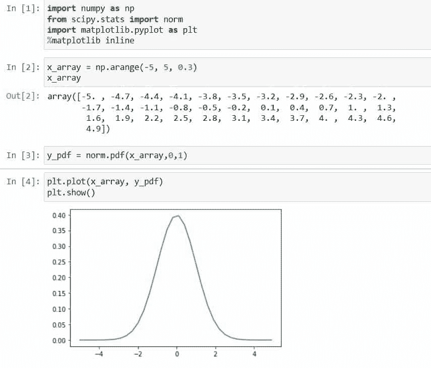

Scipy Normal Distribution PDF

这就是如何生成正态分布的 pdf。

阅读: [Scipy 卷积-完整指南](https://pythonguides.com/scipy-convolve/)

## 带均值和标准差的正态分布

Python Scipy 对象`*`norm`*`有两个重要的参数`loc`和`scale`，用于控制正态分布的位置和形状的所有方法。其中`*`loc`*`代表用于改变分配的`*`mean`*`，而`*`scale`*`是用于改变分配形状的``*standard deviation*``。

这里，我们将使用我们在上述小节中使用的相同示例，并调整参数`*`loc`*`和`*`scale`*`，以查看分布的位置和形状如何变化。

使用下面的 python 代码导入所需的库。

```py
import numpy as np
from scipy.stats import norm
import matplotlib.pyplot as plt
%matplotlib inline
```

使用下面的代码创建一个数组，包含-5 到 5 之间的值，差值为 0.3。

```py
x_array = np.arange(-5, 5, 0.3)
x_array
```

使用以下代码，通过将创建的数据数组提供给参数值为 loc = 0 且 scale = 1 的方法`norm.pdf()`来计算 pdf。

```py
y_pdf = norm.pdf(x_array,0,1)
plt.plot(x_array, y_pdf) 
plt.show()
```

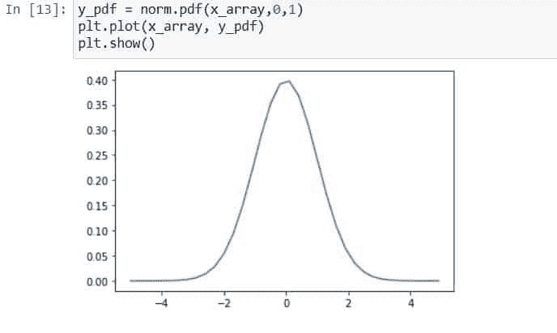

Scipy Normal Distribution With Mean And Standard Deviation example

更改 loc = 1 和 scale =1，并绘制分布图。

```py
y_pdf = norm.pdf(x_array,1,1)
plt.plot(x_array, y_pdf) 
plt.show()
```

在上面的代码中，loc =1 是均值，它使分布向均值移动，但分布的形状保持不变。输出如下所示。

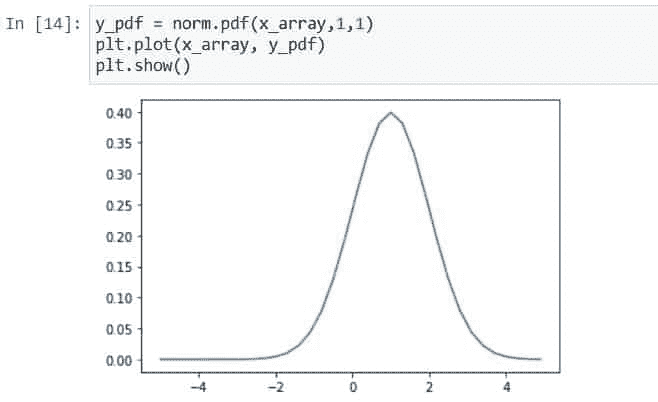

Scipy Normal Distribution With Mean And Standard Deviation tutorial

再次保持 loc = 0，改变 scale = 2，绘制分布图。

```py
y_pdf = norm.pdf(x_array,0,2)
plt.plot(x_array, y_pdf) 
plt.show()
```

在上面的代码中，改变 scale =2，这是改变分布形状的标准偏差，如下面的输出所示。

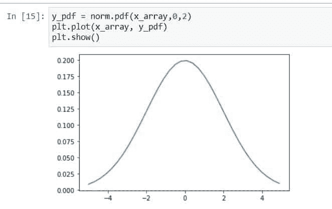

Scipy Normal Distribution With Mean And Standard Deviation

这就是如何使用均值和标准差来改变分布的位置和形状。

阅读: [Scipy 信号-有用教程](https://pythonguides.com/scipy-signal/)

## Scipy 正态分布图

在本 Python Scipy 部分，我们将通过以下步骤学习如何绘制正态分布图:

使用下面的 python 代码导入所需的库。

```py
from scipy import stats
import numpy as np
import matplotlib.pyplot as plt
%matplotlib inline
```

使用下面的代码生成范围为-15 到 15 的数据数组，差值为 0.03。

```py
x_array = np.arange(-15, 15, 0.03)
```

使用下面的代码计算生成的数据数组的平均值和标准偏差。

```py
x_array_mean = np.mean(x_array)
x_array_std = np.std(x_array)
print("Mean of sample",x_array_mean)
print("Standard Deviaton of sample",x_array_std)
```

使用下面的代码计算正态分布的 PDF。

```py
y_pdf_data = stats.norm.pdf(x_array,x_array_mean,x_array_std)
```

使用下面的代码绘制分布图。

```py
plt.plot(x_array,y_pdf_data)
plt.show()
```

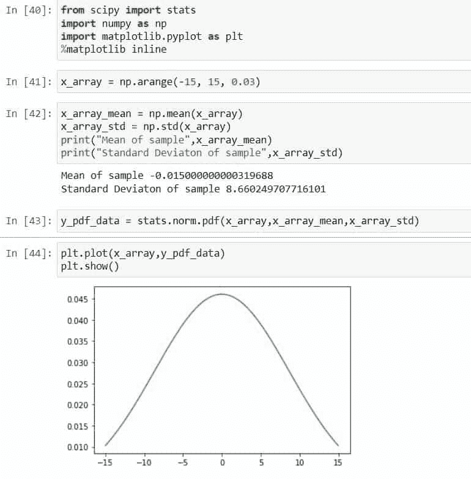

Scipy Normal Distribution Plot

这就是如何使用库 [matplotlib](https://pythonguides.com/what-is-matplotlib/) 绘制正态分布图。

## Scipy 正态分布检验

Python Scipy 在模块`*`scipy.stats`*`中有一个方法`*`normaltest()`*`来确定样本是否偏离正态分布。

下面给出了语法。

```py
scipy.stats.normaltest(a, axis=1, nan_policy='omit')
```

其中参数为:

*   ***a(array_data):*** 它是我们要测试的作为样本的数据的数组。
*   ***轴(int):*** 用于指定在哪个轴上计算测试。默认情况下，它是 0。
*   ***nan_ploicy:*** 用于处理数组内存在的 nan 值。它有一些以不同方式处理 nan 值的参数，这些参数是`*`omit`*`、`*`propagate`*`和`*`raise`*`。

方法`*`normaltest()`*`返回两个值作为统计数据和数组或浮点类型的 p 值。

让我们以一个示例为例，按照以下步骤测试该示例:

使用下面的 python 代码导入所需的库。

```py
from scipy.stats import normaltest
import numpy as np
```

使用下面的代码创建一个随机数生成器，并在生成器的帮助下生成正常的数组数据。

```py
rand_numgen = np.random.default_rng()
points = 1000
a_data = rng.normal(1, 2, size=points)
b_data = rng.normal(3, 2, size=points)
```

使用下面的代码将这两个数据组合成一个数据数组。

```py
norm_array_data = np.concatenate((a_data,b_data))
norm_array_data
```

使用下面的代码对作为样本的数据数组执行常规测试。

```py
z_score_stat, p_value = normaltest(norm_array_data)
print("Z-score statistic",z_score_stat)
print("p-value",p_value)
```

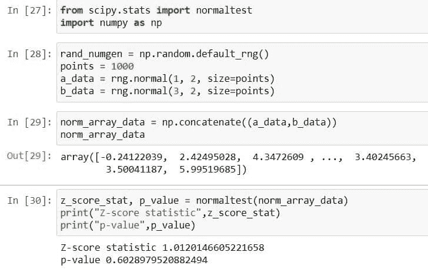

Scipy Normal Distribution Test

从输出中，我们可以看到 p 值大于 0.5，这意味着样本不符合正态分布。

这就是如何使用 Python Scipy 库检查样本的正态性。

阅读: [Scipy Integrate +示例](https://pythonguides.com/scipy-integrate/)

## Scipy 多元正态分布

Python Scipy 库有一个模块`*`scipy.stats`*`,它包含一个对象`*`multivariate_normal`*`,该对象生成一些多元正态分布，如 CDF、PDF 等。

它有两个重要参数`*`mean`*`来指定平均值，还有`*`cov`*`是协方差矩阵。

下面给出了语法。

```py
scipy.stats.multivariate_normal.method_name(x,mean,cov,allow_singular,random_state)
```

其中参数为:

*   ***x(array_data):*** 用于指定分位数。
*   ***均值(array_data):*** 提供分布的均值，默认为零。
*   ***cov(array_data):*** 提供分布的协方差矩阵。
*   ***allow _ singular(boolean):***是否允许协方差矩阵出现奇异，默认情况下为 false。
*   ***【random _ state(int，None):*** 指定数据再现性的种子。

以上参数是对象`*`scipy.stats.multivariate_normal()`*`中所有方法的公共参数。下面给出了方法。

*   ***scipy . stats . multivarial _ normal。*:【CDF()】T3 它用于累积分布函数。**
*   ***scipy . stats . multivarial _ normal。PDF():*** 它用于概率密度函数。
*   ***scipy . stats . multivariate _ normal . RVs():***从多元正态分布中获取随机变量。
*   ***scipy . stats . multivariate _ normal . log pdf():***用于获取概率密度函数相关的对数。
*   ***scipy . stats . multivariate _ normal . log CDF():***用于查找与累积分布函数相关的日志。
*   ***scipy . stats . multivariate _ normal . entropy():***求多元正态分布的微分熵。

让我们以下面的步骤为例:

使用下面的 python 代码导入所需的库。

```py
from scipy import stats
import matplotlib.pyplot as plt
import numpy as np
%matplotlib inline
```

使用下面的代码生成 x_data。

```py
x_data = np.linspace(0,6,20,endpoint=False)
x_data 
```

使用以下代码计算均值= 2.6 且协方差= 0.4 的多元正态分布的 PDF。

```py
y_data =stats.multivariate_normal.pdf(x_data, mean=2.6, cov=0.4)
y_data
```

使用以下代码绘制多元正态分布图。

```py
plt.plot(x_data,y_data)
plt.show()
```

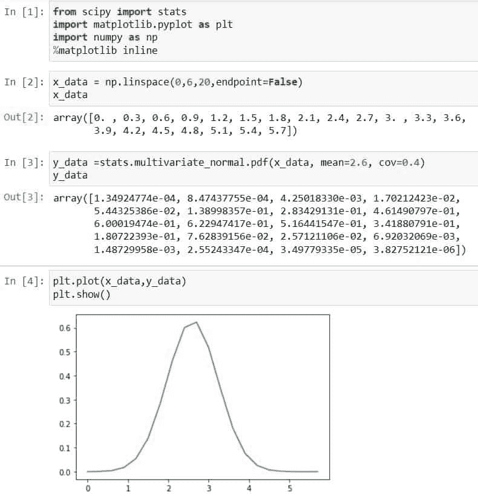

Multivariate Normal Distribution Scipy

阅读: [Scipy 旋转图像+示例](https://pythonguides.com/scipy-rotate-image/)

## Scipy 截尾正态分布

Python Scipy 库有一个模块`*`scipy.stats`*`,它包含一个对象`*`truncnorm`*`,该对象生成某种范围内的各种截断正态分布，如 CDF、PDF 等。

在 Python Scipy 中，它有两个重要的参数`*`loc`*`用于表示平均值，而`*`scale`*`用于表示标准差，因为我们知道我们使用这些参数来控制分布的形状和位置。

下面给出了语法。

```py
scipy.stats.truncnorm.method_name(x,a,b,loc,size,moments,scale)
```

其中参数为:

*   `**`x:`**`它用来定义分位数。
*   `**`a、b:`**` 它用来定义一个范围。
*   ***loc:*** 用于指定平均值，默认为 0。
*   ***矩:*** 用于计算标准差、峰度、均值等统计量。
*   ***刻度:*** 用于指定标准差，默认为 1。

以上参数是对象`*`scipy.stats.norm()`*`中所有方法的公共参数。下面给出了方法。

*   ***scipy . stats . truncnorm . CDF():***用于累计分布函数。
*   ***scipy . stats . truncnorm . pdf():***用于概率密度函数。
*   ***scipy . stats . truncnorm . RVs():***获取随机变量。
*   ***scipy . stats . truncnorm . stats():***用于获取标准差、均值、峰度、偏斜度。
*   ***scipy . stats . truncnorm . log pdf():***用于获取概率密度函数相关的日志。
*   ***scipy . stats . truncnorm . log CDF():***用于查找与累积分布函数相关的日志。
*   ***scipy . stats . truncnorm . SF():***它用于获取生存函数的值。
*   ***scipy . stats . truncnorm . ISF():***它用于获取逆生存函数的值。
*   ***scipy . stats . truncnorm . logsf():***用于查找与生存函数相关的日志。
*   ***scipy . stats . truncnorm . mean():***用于求正态分布相关的均值。
*   ***scipy . stats . truncnorm . median():***用于寻找与 truncnormal 分布相关的中位数。
*   ***scipy . stats . truncnorm . var():***用于求与分布相关的方差。
*   ***scipy . stats . truncnorm . STD():***用于求分布相关的标准差

让我们以下面的步骤为例:

使用下面的 python 代码导入所需的库。

```py
from scipy import stats
import matplotlib.pyplot as plt
import numpy as np
%matplotlib inline
```

使用下面的代码创建一个正态分布的截断范围。

```py
range_a, range_b = 0.2,3
```

使用下面的代码创建一个数据数组。

```py
fig, ax = plt.subplots(1, 1)
array_data = np.linspace(stats.truncnorm.ppf(0.02,range_a,range_b),
                stats.truncnorm.ppf(0.98,range_a,range_b), 99)
```

使用一组数据和范围执行 truncnorm 的 pdf，使用下面的代码得到截断的正态分布。

```py
ax.plot(array_data, stats.truncnorm.pdf(array_data,range_a,range_b),
       'r-', lw=5, alpha=0.6, label='truncnorm pdf')
```

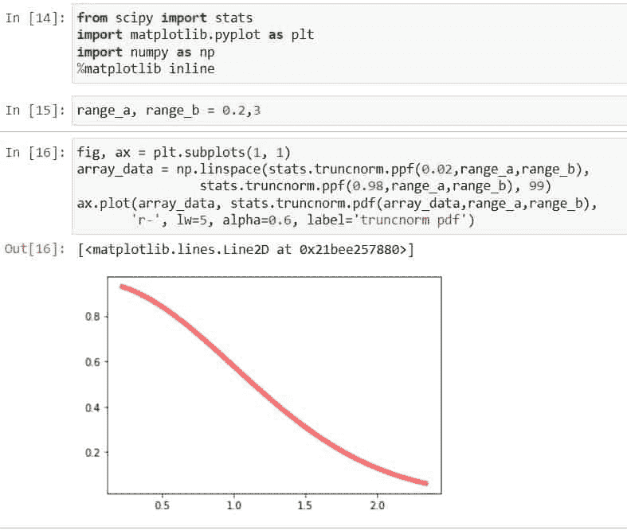

Scipy Truncated Normal Distribution

这就是如何使用方法`*`truncnorm()`*`得到截尾正态分布。

阅读:[Scipy Sparse–有用的教程](https://pythonguides.com/scipy-sparse/)

## Scipy 对数正态分布

`*`Lognormal`*`代表正态分布形式的对数。它是一个对数正态连续的随机变量。

下面给出了语法。

```py
scipy.stats.lognorm.method_name(data,loc,size,moments,scale)
```

其中参数为:

*   ***数据:*** 以数组数据的形式表示均匀采样数据的一组点或值。
*   ***loc:*** 用于指定平均值，默认为 0。
*   ***矩:*** 用于计算标准差、峰度、均值等统计量。
*   ***刻度:*** 用于指定标准差，默认为 1。

以上参数是对象`*`scipy.stats.lognorm()`*`中所有方法的公共参数。下面给出了方法。

*   ***scipy . stats . log norm . CDF():***用于累计分布函数。
*   ***scipy . stats . log norm . pdf():***用于概率密度函数。
*   ***scipy . stats . log norm . RVs():***获取随机变量。
*   ***scipy . stats . log norm . stats():***用于得到标准差、均值、峰度、偏斜度。
*   ***scipy . stats . log norm . log pdf():***用于获取概率密度函数相关的对数。
*   ***scipy . stats . log norm . log CDF():***用于查找与累积分布函数相关的日志。
*   ***scipy . stats . log norm . SF():***它用于获取生存函数的值。
*   ***scipy . stats . log norm . ISF():***它用于获取逆生存函数的值。
*   ***scipy . stats . log norm . logsf():***用于查找与生存函数相关的日志。
*   ***scipy . stats . log norm . mean():***用于求分布的均值。
*   ***scipy . stats . log norm . median():***用于求分布的中位数。
*   ***scipy . stats . log norm . var():***用于求与分布相关的方差。
*   ***scipy . stats . log norm . STD():***用于求分布相关的标准差

让我们以下面的步骤为例:

使用下面的 python 代码导入所需的库。

```py
from scipy import stats
import matplotlib.pyplot as plt
import numpy as np
%matplotlib inline
```

使用以下代码创建对数正态分布的形状参数。

```py
s_parameter = 0.999
```

使用下面的代码创建一个数据数组。

```py
fig, ax = plt.subplots(1, 1)
array_data = np.linspace(stats.lognorm.ppf(0.02,s_parameter),
                stats.lognorm.ppf(0.98,s_parameter), 99)
```

通过使用下面的代码将带有形状参数的数据数组传递给方法`*`lognorm()`*`来生成对数正态分布

```py
ax.plot(array_data, stats.lognorm.pdf(array_data,s_parameter),
       'r-', lw=5, alpha=0.6, label='truncnorm pdf')
```

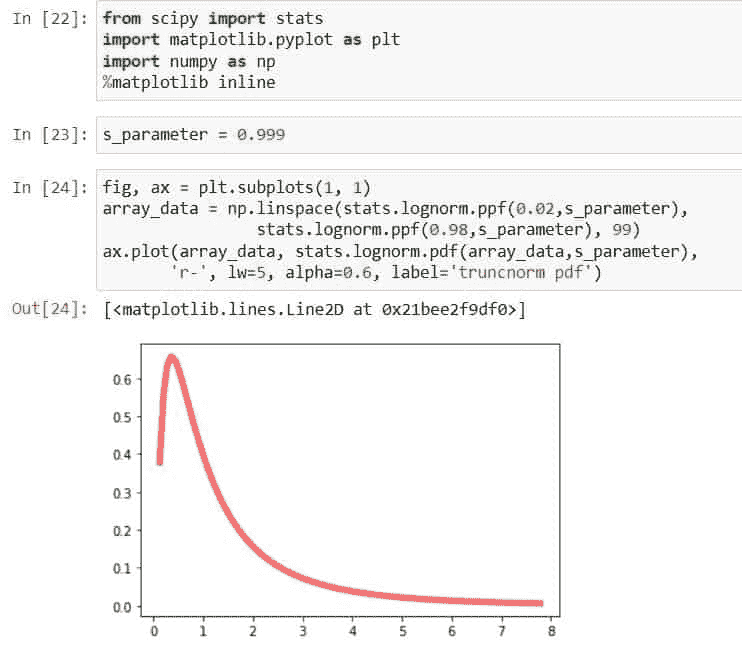

Scipy Log-Normal Distribution

这就是如何使用方法`*`lognorm()`*`创建对数正态分布。

阅读: [Scipy 优化–实用指南](https://pythonguides.com/scipy-optimize/)

## Scipy 偏斜正态分布

Python Scipy 在模块`*`scipy.stats`*`中有一个方法`*`skewnorm()`*`，该方法使用一个名为`*`skewness`*`的附加参数将正态分布的形状更改为正态左斜和正态右斜分布，该参数用字母`*`a`*`表示。

下面给出了语法。

```py
scipy.stats.truncnorm.method_name(x,a,loc,moments,scale)
```

其中参数为:

`**`x:`**`它用来定义分位数。
`**`答:`**` 它用来定义分布的一个偏度参数。
***loc:*** 用来指定平均值，默认为 0。
***矩:*** 用于计算标准差、峰度、均值等统计量。
***标度:*** 用于指定标准差，默认为 1。

以上参数是对象`*`scipy.stats.skewnorm()`*`中所有方法的公共参数。下面给出了方法。

*   ***scipy . stats . skewnorm . CDF():***用于累计分布函数。
*   ***scipy . stats . skewnorm . pdf():***用于概率密度函数。
*   ***scipy . stats . skewnorm . RVs():***获取随机变量。
*   ***scipy . stats . skewnorm . stats():***用于获取标准差、均值、峰度、偏斜度。
*   ***scipy . stats . skewnorm . log pdf():***用于获取概率密度函数相关的对数。
*   ***scipy . stats . skewnorm . log CDF():***用于查找与累积分布函数相关的日志。
*   ***scipy . stats . skewnorm . SF():***它用于获取生存函数的值。
*   ***scipy . stats . skewnorm . ISF():***它用于获取逆生存函数的值。
*   ***scipy . stats . skewnorm . logsf():***用于查找与生存函数相关的日志。
*   ***scipy . stats . skewnorm . mean():***用于求分布的均值。
*   ***scipy . stats . skewnorm . median():***用于求分布的中位数。
*   ***scipy . stats . skewnorm . var():***用于求与分布相关的方差。
*   ***scipy . stats . skewnorm . STD():***用于求分布相关的标准差

让我们以下面的步骤为例:

使用下面的 python 代码导入所需的库。

```py
from scipy import stats
import matplotlib.pyplot as plt
import numpy as np
%matplotlib inline
```

使用以下代码创建对数正态分布的形状参数。

```py
skewness_parameter = 5
```

使用下面的代码创建一个数据数组。

```py
fig, ax = plt.subplots(1, 1)
array_data = np.linspace(stats.skewnorm.ppf(0.02,skewness_parameter),
                stats.skewnorm.ppf(0.98,skewness_parameter), 99)
```

通过使用下面的代码将带有偏斜度参数的数据数组传递给方法`*`skewnorm()`*`来生成对数正态分布

```py
ax.plot(array_data, stats.skewnorm.pdf(array_data,skewness_parameter),
       'r-', lw=5, alpha=0.6, label='skewnorm pdf')
```

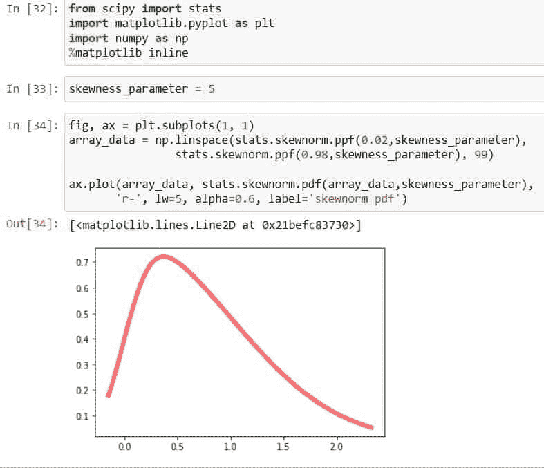

Scipy Skew Normal Distribution

这就是如何用方法`*`skewnorm()`*`使正态分布左偏或右偏——正态分布。

阅读: [Scipy 常量–多个示例](https://pythonguides.com/scipy-constants/)

## Scipy 逆正态分布

在 Python Scipy 中，模块`*`scipy.stats`*`中有一个对象`*`norminvgauss`*`用于计算逆正态分布或正态逆高斯分布。它有不同的方法，如 PDF，CDF 等来生成这种逆正态分布。

下面给出了语法。

```py
scipy.stats.norminvgauss.method_name(x,a,b,loc,size,moments,scale)
```

其中参数为:

`**`x:`**`它用来定义分位数。
`**`a、b:`**` 它用于定义一个尾部重量和不对称参数。
***loc:*** 用来指定平均值，默认为 0。
***矩:*** 用于计算标准差、峰度、均值等统计量。
***标度:*** 用于指定标准差，默认为 1。

以上参数是对象`*`scipy.stats.norminvegauss()`*`中所有方法的公共参数。下面给出了方法。

*   ***scipy . stats . norminvgauss . CDF():***它用于累计分布函数。
*   ***scipy . stats . norminvgauss . pdf():***它用于概率密度函数。
*   ***scipy . stats . norminvgauss . RVs():***获取随机变量。
*   ***scipy . stats . norminvgauss . stats():***用于获取标准差、均值、峰度、偏斜度。
*   ***scipy . stats . norminvgauss . log pdf():***用于获取概率密度函数相关的日志。
*   ***scipy . stats . norminvgauss . log CDF():***用于查找与累积分布函数相关的日志。
*   ***scipy . stats . norminvgauss . SF():***它用于获取生存函数的值。
*   ***scipy . stats . norminvgauss . ISF():***它用于获取逆生存函数的值。
*   ***scipy . stats . norminvgauss . logsf():***用于查找与生存函数相关的日志。
*   ***scipy . stats . norminvgauss . mean():***它用于求分布的均值。
*   ***scipy . stats . norminvgauss . median():***用于求分布的中位数。
*   ***scipy . stats . norminvgauss . var():***用于求与分布相关的方差。
*   ***scipy . stats . norminvgauss . STD():***用于求与分布相关的标准差

让我们以下面的步骤为例:

使用下面的 python 代码导入所需的库。

```py
from scipy import stats
import matplotlib.pyplot as plt
import numpy as np
%matplotlib inline
```

使用以下代码定义逆正态分布的尾部重量和不对称参数。

```py
param_a, param_b = 1.15,0.6
```

使用下面的代码创建一个数据数组。

```py
fig, ax = plt.subplots(1, 1)
array_data = np.linspace(stats.norminvgauss.ppf(0.02,param_a,param_b),
                stats.norminvgauss.ppf(0.98,param_a,param_b), 99)
```

用一组数据和范围执行 norminvgauss 的 pdf，使用下面的代码得到正态分布的逆。

```py
ax.plot(array_data, stats.norminvgauss.pdf(array_data,param_a,param_b),
       'r-', lw=5, alpha=0.6, label='norminvgauss pdf')
```

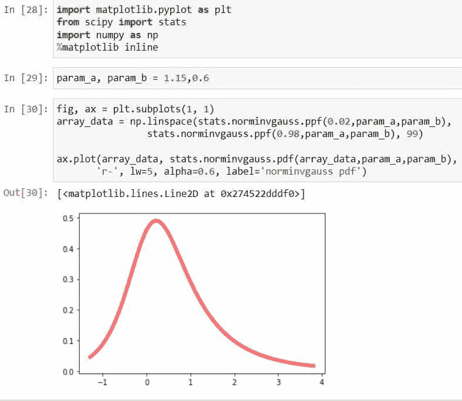

Scipy Inverse Normal Distribution

这就是如何使用方法`*`norminvgauss()`*`生成逆正态分布。

阅读:[Scipy Stats Zscore+Examples](https://pythonguides.com/scipy-stats-zscore/)

## 拟合正态分布

在这一 Python Scipy 部分，我们将通过手动创建数据和函数来使数据符合正态分布。按照以下步骤将数据拟合到正态分布。

首先，使用下面的 python 代码导入所需的库。

```py
import matplotlib.pyplot as plt
from scipy.optimize import curve_fit
import numpy as np
```

使用创建数据，并使用下面的代码将其转换为 NumPy 数组。

```py
data_x = [ -10.0, -9.0, -8.0, -7.0, -6.0, -5.0, -4.0, -3.0, -2.0, -1.0, 0.0, 1.0, 2.0, 3.0, 4.0, 5.0, 6.0, 7.0, 8.0, 9.0, 10.0]
data_y = [1.2, 4.2, 6.7, 8.3, 10.6, 11.7, 13.5, 14.5, 15.7, 16.1, 16.6, 16.0, 15.4, 14.4, 14.2, 12.7, 10.3, 8.6, 6.1, 3.9, 2.1]

data_x = np.asarray(data_x)
data_y = np.asarray(data_y)
plt.plot(data_x, data_y, 'o')
```

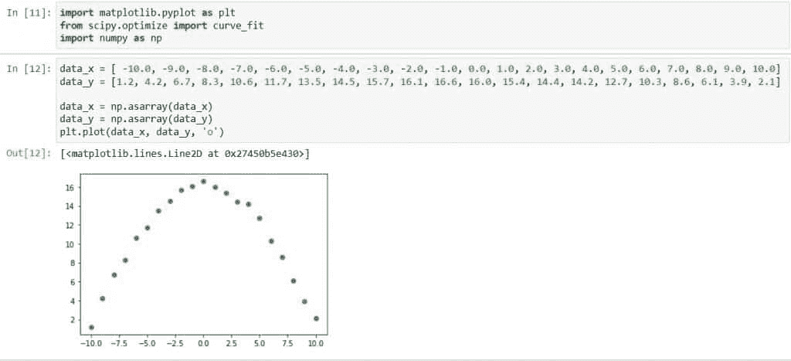

Scipy Fit Normal Distribution example

使用创建一个普通函数，并使用下面的代码将函数和数据传递给方法`*`curve_fit()`*`。

```py
def norm_dist(data, param_A, param_B):
    y_data = param_A*np.exp(-1*param_B*data**2)
    return y_data
paramet, cov = curve_fit(norm_dist, data_x, data_y)

A_fit = paramet[0]
B_fit = paramet[1]
```

使用下面的代码将拟合的数据绘制成正态分布。

```py
y_fit = norm_dist(data_x, A_fit, B_fit)
plt.plot(data_x, data_y, 'o', label='data')
plt.plot(data_x, y_fit, '-', label='fit')
plt.legend()
```

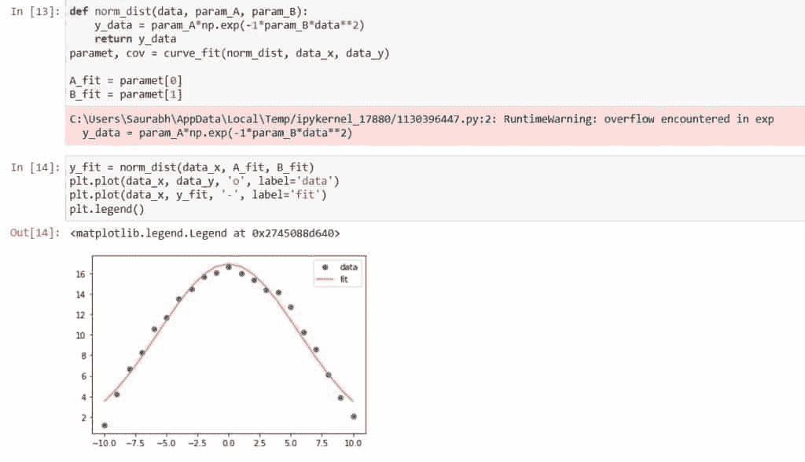

Scipy Fit Normal Distribution

这就是如何使用创建的数据和函数使数据符合正态分布。

阅读: [Scipy 寻找峰值–有用教程](https://pythonguides.com/scipy-find-peaks/)

## 半正态分布

`*`scipy.stats.halfnorm`*`表示半正态连续的随机变量。它有不同种类的功能来生成半正态分布，如 CDF，PDF，中位数等。半正态分布是截尾正态或折叠正态分布。

它有两个重要的参数`*`loc`*`用于表示平均值和`*`scale`*`用于表示标准差，因为我们知道我们使用这些参数来控制分布的形状和位置。

下面给出了语法。

```py
scipy.stats.halfnorm.method_name(data,loc,size,moments,scale)
```

其中参数为:

*   ***数据:*** 以数组数据的形式表示均匀采样数据的一组点或值。
*   ***loc:*** 用于指定平均值，默认为 0。
*   ***矩:*** 用于计算标准差、峰度、均值等统计量。
*   ***刻度:*** 用于指定标准差，默认为 1。

以上参数是对象`*`scipy.stats.halfnorm()`*`中所有方法的公共参数。下面给出了方法。

*   ***scipy . stats . half norm . CDF():***用于累计分布函数。
*   ***scipy . stats . half norm . pdf():***用于概率密度函数。
*   ***scipy . stats . half norm . RVs():***获取随机变量。
*   ***scipy . stats . half norm . stats():***用于得到标准差、均值、峰度、偏斜度。
*   ***scipy . stats . half norm . log pdf():***用于获取概率密度函数相关的对数。
*   ***scipy . stats . half norm . log CDF():***用于查找与累积分布函数相关的日志。
*   ***scipy . stats . half norm . SF():***它用于获取生存函数的值。
*   ***scipy . stats . half norm . ISF():***它用于获取逆生存函数的值。
*   ***scipy . stats . half norm . logsf():***用于查找与生存函数相关的日志。
*   ***scipy . stats . half norm . mean():***用于求正态分布相关的均值。
*   ***scipy . stats . half norm . median():***用于求正态分布相关的中位数。
*   ***scipy . stats . half norm . var():***用于求与分布相关的方差。
*   ***scipy . stats . half norm . STD():***用于求分布相关的标准差

让我们通过使用上面提到的方法之一来举一个例子，以了解如何使用带参数的方法。

使用下面的代码导入所需的库。

```py
import numpy as np
import matplotlib.pyplot as plt
from scipy import stats
```

创建观察数据值，并用``*mean = 0*``和``*standard deviation = 1*``从这些数据值中计算出``*probability density function*``。

```py
observatin_x = np.linspace(-2,2,200)
PDF_norm = stats.norm.pdf(observatin_x,loc=0,scale=1)
```

使用下面的代码绘制创建的分布图。

```py
plt.plot(observatin_x,PDF_norm)
plt.xlabel('x-values')
plt.ylabel('PDF_norm_values')
plt.title("Probability density funciton of half normal distribution")
plt.show()
```

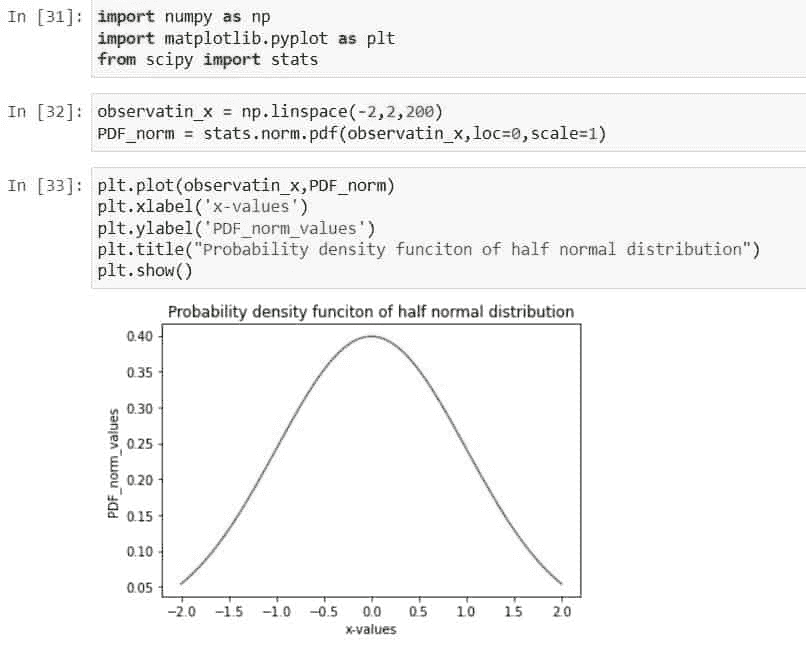

Scipy Half Normal Distribution

这就是如何使用方法`*`halfnorm()`*`创建半正态分布。

阅读:[Scipy Linalg–实用指南](https://pythonguides.com/scipy-linalg/)

## Scipy 正态分布计算概率

我们已经从上面的小节中学习了如何创建正态分布，现在我们将使用 Python Scipy 模块的`*`scipy.stats.norm`*`来计算正态分布的概率。

按照以下步骤计算正态分布的概率:

使用下面的代码导入所需的库。

```py
from scipy.stats import norm
```

现在，通过使用下面的代码向方法`*`norm()`*`提供平均值和标准偏差值来计算正态分布的概率。

```py
norm(0,1).pdf(20)

norm(2,2).pdf(50)

norm(10,20).pdf(10)
```

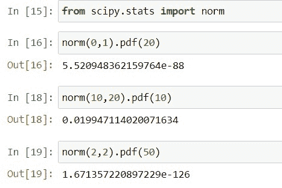

Scipy Normal Distribution Calculate Probability

查看输出，方法`*`norm()`*`使用函数 pdf 生成不同值的概率。

另外，看看更多的 SciPy 教程。

*   [Python Scipy 距离矩阵](https://pythonguides.com/scipy-distance-matrix/)

在本教程中，我们学习了“ **Scipy 正态分布**”并涵盖了以下主题。

*   科学正态分布
*   科学正态分布 PDF
*   带均值和标准差的正态分布
*   科学正态分布图
*   科学正态分布检验
*   多元正态分布
*   截断正态分布
*   Scipy 对数-正态分布
*   扭曲正态分布
*   逆正态分布
*   科学拟合正态分布
*   半正态分布
*   强正态分布分位数
*   正态分布计算概率

[Bijay Kumar](https://pythonguides.com/author/fewlines4biju/)

Python 是美国最流行的语言之一。我从事 Python 工作已经有很长时间了，我在与 Tkinter、Pandas、NumPy、Turtle、Django、Matplotlib、Tensorflow、Scipy、Scikit-Learn 等各种库合作方面拥有专业知识。我有与美国、加拿大、英国、澳大利亚、新西兰等国家的各种客户合作的经验。查看我的个人资料。

[enjoysharepoint.com/](https://enjoysharepoint.com/)[](https://www.facebook.com/fewlines4biju "Facebook")[](https://www.linkedin.com/in/fewlines4biju/ "Linkedin")[](https://twitter.com/fewlines4biju "Twitter")