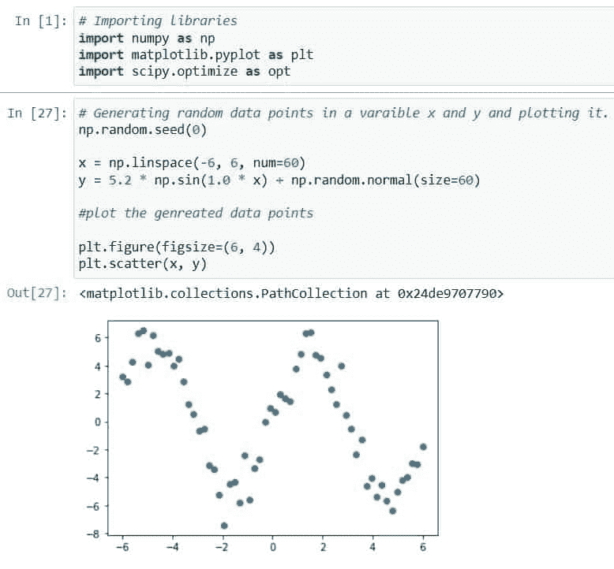

# Scipy 优化–有用的指南

> 原文：<https://pythonguides.com/scipy-optimize/>

[](https://sharepointsky.teachable.com/p/python-and-machine-learning-training-course)

在这个 [Python 教程](https://pythonguides.com/learn-python/)中，我们将学习“ **Scipy 优化**”，在这里我们将实现不同的优化算法来获得函数的最优值。此外，涵盖以下主题。

*   科学优化
*   Scipy 优化最小化示例
*   Scipy 优化最小化
*   Scipy 优化曲线拟合
*   优化最小二乘法
*   科学优化 Fmin
*   Scipy 优化约束
*   科学优化界限
*   Scipy 优化最小化约束示例

目录

[](#)

*   [Scipy 优化](#Scipy_Optimize "Scipy Optimize")
    *   [优化:](#Optimization "Optimization:")
    *   [曲线拟合:](#Curve_Fitting "Curve Fitting:")
    *   [最小二乘法:](#Least-squares "Least-squares:")
    *   [求根:](#Root_Finding "Root Finding:")
    *   [线性规划:](#Linear_Programming "Linear Programming:")
*   [Scipy 优化最小化](#Scipy_Optimize_Minimize "Scipy Optimize Minimize")
*   [Scipy 优化最小化示例](#Scipy_Optimize_Minimize_example "Scipy Optimize Minimize example")
*   [Scipy 优化曲线拟合](#Scipy_Optimize_Curve_Fit "Scipy Optimize Curve Fit")
*   [Scipy 优化 Fmin](#Scipy_Optimize_Fmin "Scipy Optimize Fmin")
*   [Scipy 优化最小二乘法](#Scipy_Optimize_Least_Squares "Scipy Optimize Least Squares")
*   [Scipy 优化约束或最小化约束示例](#Scipy_Optimize_Constraints_Or_Minimize_Constraints_Example "Scipy Optimize Constraints Or Minimize Constraints Example")
*   [Scipy 优化界限](#Scipy_Optimize_Bounds "Scipy Optimize Bounds")

## Scipy 优化

Scipy Optimize `*`(scipy.optimize)`*`是 Scipy 的一个子包，包含不同种类的方法来优化各种函数。

这些不同种类的方法是根据我们正在处理的问题的种类来区分的，例如线性规划、最小二乘法、曲线拟合和求根。下面根据类别提供了方法列表。

### 优化:

优化进一步分为三种优化:

***标量函数优化:*** 它包含方法``*minimize_scalar( )*``来最小化包含一个变量的标量函数。

***多元优化:*** 它包含的方法``*minimize( )*``是最小化包含多个变量的标量函数。

***全局优化:*** 它包含基于不同算法或优化技术的不同方法，如下所示。

*   它使用跳盆算法来寻找给定函数的全局最小值。
*   `***brute( ):***`它使用蛮力方法在指定范围内最小化给定函数。
*   它有助于找到给定多元函数的全局最小值。
*   `***dual_annealing( ):***`使用双重退火算法寻找给定函数的全局最小值。

### 曲线拟合:

它的方法``*curve_fit( )*``使用非线性最小二乘法来拟合一组数据的函数。

### 最小二乘法:

它被分成两个最小的正方形。

***非线性最小二乘:*** 它有一个方法``*least_squares( )*``解决给定变量上界的非线性最小二乘问题。

***线性最小二乘:*** 它包含了``*nnls( )*``和``*lsq_linear( )*``的方法来解决给定变量上界的线性最小二乘问题。

### 求根:

它用不同的方法来寻找给定函数的零点或根，它根据函数进一步分为两类。

***标量函数:*** 在众多寻找给定标量函数零点的方法中，它有最流行的方法``*root_scalar( )*``。

***多维:*** 它只有一个方法就是``*root( )*``求给定向量函数的零点或根。

### 线性规划:

它使用方法``*lingprog( )*``来最小化具有给定约束(例如等式和不等式)的线性目标函数。

阅读:[Python 中的 Scikit 学的是什么](https://pythonguides.com/what-is-scikit-learn-in-python/)

## Scipy 优化最小化

有两个优化函数``*minimize( )*``、``*minimize_scalar( )*``来最小化一个函数。

``*minimize_scalar( )*``该函数用于最小化包含一个变量的标量函数。下面给出了如何访问和使用子程序包`*`scipy.optimize`*`中的功能的语法。

```py
scipy.optimize.minimize_scalar(function,method='brent', bracket=None, bounds=None, args=(), tol=None, options=None)
```

其中参数为:

*   ***函数:*** 为最小化传递的目标函数。
*   ***方法:*** 是将用于给定目标函数的一种求解器或方法。方法有`*`Brent`*`、`*`Bounded`*`、`*`Golden`*`和`*`Custom`*`。
*   ***括号:*** 仅描述`*`Brent`*`和`*`Golden`*`方法的括号间隔。
*   ***bounds:*** 是包含两个值的绑定，在使用 bound 方法时是必需的。
*   ***args:*** 是提供给目标函数的附加自变量。
*   ***tol:*** 是对终止的容忍。
*   ***选项:*** 用于定义使用`*`maxiter`*`执行的最大迭代次数。

``*minimize( )*``该函数用于最小化包含多个变量的标量函数。下面给出了如何访问和使用子程序包`*`scipy.optimize`*`中的功能的语法。

```py
scipy.optimize.minimize(function, x0, args=(), method=None, jac=None, hess=None, bounds=None, constraints=(), tol=None, options=None)
```

参数在哪里。

*   ***函数:*** 传递给最小化的目标函数。
    ***方法:*** 是将用于给定目标函数的一种求解器或方法。方法有 ***信任——克雷洛夫*** `***Nelder-Mead, CG, *`Powell`*, BFGS, L-BFGS-B, TNC, COBYLA,***trust-exact,`**`` ``**`Newton-CG,`**`` `***SLSQP, dogleg, `*trust-ncg****``，``****trust-constr*`,***` 。
*   ***jac:*** 是计算梯度向量的方法。
*   ***赫斯:*** 它用来计算赫斯矩阵。
    ***界限:*** 包含两个值的界限，在使用 Nelder-Mead、TNC、SLSQP、L-BFGS-B、Powell 和 trust-constr 方法时需要。
*   ***约束:*** 它采用等式约束和不等式约束这样的目标函数的约束。
*   ***tol:*** 是对终止的容忍。
*   ***选项:*** 用于定义使用选项`*`maxiter`*`执行的最大迭代次数。

阅读:[使用 Python 的机器学习](https://pythonguides.com/machine-learning-using-python/)

## Scipy 优化最小化示例

这里我们将看到两个最小化函数的例子，我们已经在上面的***“Scipy 优化最小化”*** 小节中学习过。

在做一个例子之前，让我们先了解一下“什么是标量函数”标量函数接受一个值并输出这个值。

这里我们要用的标量函数是一个二次函数 ***`2x²+5x-4`*** ，所以这里我们会找到目标函数`***2x²+5x-4***`的最小值。该函数的图形如下所示。


Scipy Optimize Minimize example

看一下函数`***2x²+5x-4***`的图形，这里我们将使用`*`scipy.optimize`*`子包的方法`*`minimize_scalar()`*`找到一个函数的最小值。

首先使用下面的代码导入 Scipy optimize 子包。

```py
import scipy.optimize as ot
```

使用下面的代码定义我们要最小化的``*Objective function*``。

```py
def Objective_Fun(x):

    return 2*x**2+5*x-4
```

再次从子包 optimize 中导入方法``*minimize_scalar( )*``，并将创建的``*Objective function*``传递给该函数。

```py
result = ot.minimize_scalar(Objective_Fun)
```

使用以下代码检查结果``*Objective function*``的最小值。

```py
print(result)
```


Scipy Optimize Minimize minimize_scalar

上面输出中显示的`***x: -1.25***`处``*Objective function*``的最小值。这个最小值可能不是真的，但这是找到``*Objective function*``最小值的方法。

我们已经介绍了唯一可以处理包含单个变量的函数的方法``*minimize_scalar( )*``。但是会发生什么呢，如果我们有一个不止一个变量的函数，在那种情况下，方法``*minimize( )*``被用来寻找``*Objective function*``的最小值。

``*minimize( )*``也可以处理``*Objective function*``上的约束。下面给出了三种类型的约束。

*   ***界限约束:*** 暗示 x 的值位于上下限之间。
*   ***线性约束:*** 通过对给定的用户输入数组执行 x 值的内积，并将结果与一个下限和上限进行比较，来限制解决方案。
*   ***非线性约束:*** 通过将用户给定的函数应用于 x 值，并将结果与一个上下限进行比较，来限制解。

这里我们要举一个例子来说明``*minimize( )*``如何计算给定``*Objective function*`` : `***60x²+15x***`带约束的最小值。该函数的图形如下所示。


Scipy Optimize Minimize tutorial

下面给出了我们将使用 Scipy 解决的问题。

```py
Objective Function: 60x²+15x

Constraints:
           8x+16x ≥ 200
           60x+40x ≥ 960
           2x+2x ≥ 40
           x ≥ 0
```

首先，使用下面的代码在 python 中创建一个``*Objective function*``。

```py
def Obj_func(x):
    return (60*x[0]**2) + (15*x[1])
```

然后使用下面的代码在 python 中定义约束。

```py
const = ({'type': 'ineq', 'fun': lambda x:  8*x + 16*x-200},
        {'type': 'ineq', 'fun': lambda x: 60*x + 40*x-960},
        {'type': 'ineq', 'fun': lambda x: 2*x + 2*x-40})
```

定义最优值所在的函数的边界。

```py
bnds = ((0, None), (0, None))
```

从子包`scipy.optimize`中访问方法``*minimize( )*``，并使用下面的代码将创建的``*Objective function*``传递给带有约束和绑定的方法。

```py
res = minimize(Obj_func, (-1, 0), method='SLSQP', bounds=bnds,
               constraints=const)
```

检查结果的最小值`***``*Objective function*``***` 。

```py
print(res)
```


Scipy Optimize Minimize minimize method

上面输出中显示的`***x: [10.,10.]***`处``*Objective function*``的最小值。

阅读:[蟒蛇皮里的熊猫](https://pythonguides.com/pandas-in-python/)

## Scipy 优化曲线拟合

在 Scipy 中，子程序包`*`scipy.optimize`*`有方法``*curve_fit( )*``,该方法将直线拟合到给定的一组点。

下面给出了该方法的语法。

```py
scipy.optimize.curve_fit(fun, x_data, y_data, p_0=None, check_finite=True, bounds=(- inf, inf), method=None)
```

其中参数为:

*   ***好玩:*** 它是模型功能。
*   ***x_data:*** 是数组形式的数据点或任何对象，也是自变量。
*   ***y_data:*** 用函数(x_data)构造数据点或任何对象的是因变量这个函数可以 sin，cos 等。
*   ***P0:***为方法中参数的起始猜测值。
*   ***check_finite:*** 用于检查数组中是否包含 nans 值，如果包含则抛出 ValueError。默认情况下，它被设置为 True。
*   ***界限:*** 定义了参数的上下限。
*   ***方法:*** 用于指定优化问题的算法，如最小二乘法有 ***`trf`、`lm`、*** 等。

要了解更多关于曲线拟合的知识，请跟随官方文档[**“Scipy 曲线拟合”**](https://docs.scipy.org/doc/scipy/reference/generated/scipy.optimize.curve_fit.html#scipy.optimize.curve_fit)

遵循以下步骤，使用方法``*curve_fit( )*``拟合一个函数来生成数据。

按照下面的步骤，确保您了解下面给出的主题。

*   [NumPy 随机种子](https://pythonguides.com/python-numpy-random/#Python_numpy_random_seed)
*   [Numpy Linspace](https://pythonguides.com/python-numpy-linspace/)
*   [Numpy 随机正常](https://pythonguides.com/python-numpy-random/#Python_numpy_random_normal)
*   [Matplotlib Scatter](https://pythonguides.com/?s=matplotlib+scatter)
*   [Matplotlib 图](https://pythonguides.com/?s=matplotlib+figure)

使用下面的代码导入必要的库。

```py
# Importing libraries
import numpy as np
import matplotlib.pyplot as plt
import scipy.optimize as opt
```

首先，使用下面的代码生成一些随机数据。

```py
# Generating random data points in a varaible x and y and plotting it.
np.random.seed(0)

x = np.linspace(-6, 6, num=60)
y = 5.2 * np.sin(1.0 * x) + np.random.normal(size=60)

#plot the genreated data points

plt.figure(figsize=(6, 4))
plt.scatter(x, y)
```



Scipy Optimize Curve Fit example

看看上面的输出，以及生成的数据是什么样子的。

创建一个新函数`*`sin_func`*`并将此函数传递给方法`curve_fit( )`到`*`sin_func`*`，使用下面的代码生成数据。

```py
# crating the sin function and fitting this to gnerated data using
#curve_fit method

def sin_func(X, a, b):
    return a * np.sin(b * X)

param, param_covariance = opt.curve_fit(sin_func, x, y,
                                               p0=[1, 1])

print(param)
```

让我们用下面的代码画出符合生成数据的函数。

```py
# Plotting the fitted line to genreated data
plt.figure(figsize=(6, 4))
plt.scatter(x, y, label='Data')
plt.plot(x, test_func(x, param[0], param[1]),
         label='Fitted Sin function')

plt.legend(loc='best')

plt.show()
```


Scipy Optimize Curve Fit tutorial

阅读:[Scipy Sparse–有用的教程](https://pythonguides.com/scipy-sparse/)

## Scipy 优化 Fmin

`*`scipy.optimize`*` a 函数包含一个方法``*Fmin( )*``，该方法使用 ***下坡单纯形算法*** 来最小化给定的函数。

下面给出了该方法的语法。

```py
scipy.optimize.fmin(fun, x_0, args=(), max_iter=None, max_fun=None, disp=1, retall=0, initial_simplex=None)
```

其中参数为:

*   ***乐趣:*** 它是我们要最小化的目标函数。
*   ***x_0:*** 提供给一个方法用于异议函数的猜测点。
*   ***max_iter:*** 要做的最大迭代次数。
*   ***max_fun:*** 用于设置要做的最大评估次数。
*   ***disp:*** 显示收敛消息，然后将其设置为 True。
*   ***retall:*** 显示每次迭代的解，然后设置为 True
*   ***intial_simplex:*** 如果我们提供初始单纯形，那么它不使用我们提供的 x_0，而是使用 intail_simples 猜测。

让我们以下面的步骤为例:

使用下面的代码将模块`*`scipy.optimize`*`作为`*`opt`*`导入。

```py
import scipy.optimize as opt
```

使用下面的代码在 python 中定义一个新函数`***y²***`。

```py
def function(y):
    return y**2
```

从模块`*`scipy.optimize`*`中访问方法``*fmin( )*``，用初始猜测值作为`*`1`*`传递创建的函数。

```py
min = opt.fmin(function, 1)
```

使用下面的代码检查该值。

```py
print(min)
```


Scipy Optimize Fmin

根据输出，执行 17 次迭代，函数被评估 34 次，最小值为`***[-8.8817842e-16]***`。

阅读:[科学统计-完整指南](https://pythonguides.com/scipy-stats/)

## Scipy 优化最小二乘法

在`scipy.optimize`子包中，有``*nnls( )*``和``*lsq_linear( )*``两种方法处理最小二乘相关问题。

第一个``*nnls( )*``是 ***非负线性平方*** 在约束最小二乘问题中不允许负系数。

下面给出了语法``*nnls( )*``。

```py
scipy.optimize.nnls(A, b, max_iter=None)
```

其中参数为:

*   ***答:*** 是 n 数组数据或者矩阵。
*   ***b:*** 它是一个向量形式的响应变量(一列)。
*   ***max_iter:*** 执行的最大迭代次数。

上面的方法旨在找到`***argmin_x || Ax - b ||_2***`，其中`***x ≥ 0***`意味着所提供的向量的分量必须是非负的。``*nnls( )*``以类似 ndarray 的向量形式返回结果，剩余值为浮点类型。

让我们以下面的步骤创建一个矩阵和一个向量为例:

导入模块`*`scipy.optimize`*`以访问方法``*nnls( )*``和 ***`numpy`*** ，使用以下代码创建类似矩阵或向量的数组。

```py
# Importing the module scipy.optimize and numpy
import scipy.optimize as opt
import numpy as np
```

使用 NumPy 的函数`*`array`*`用下面的代码创建一个``*matrix B*``和一个``*vector c*``。

```py
# creating the matrix B and a vector c
B = np.array([[2, 1], [2, 1], [1, 2]])
c = np.array([3, 2, 2])
```

从`scipy.optimize`中访问``*nnls( )*``方法，并将上面创建的带有``*vector c*``的``*matrix B*``传递给它。

```py
# access the method nnls(), passing the matrix B and a vector c to it.
opt.nnls(B, c)
```


Scipy Optimize Least Squares nnls

输出显示包含值`***[1\. , 0.5]***`的 ndarray 或解向量，残差为浮点类型`*`0.707106781186547`*`。

第二种方法是``*lsq_linear( )*``，它解决了与变量有边界的非线性正方形相关的问题。

下面给出了语法`***``*lsq_linear( )*``***` 。

```py
scipy.optimize.lsq_linear(A, b, bounds=(- inf, inf), method='trf', lsmr_tol=None, max_iter=None, verbose=0)
```

其中参数为:

*   ***答:*** 是 n 数组数据或者矩阵。
*   ***b:*** 它是一个向量形式的响应变量(一列)。
*   ***界限:*** 是自变量上的界限(上下界)。
*   方法:用于指定使用哪种方法进行最小化，如 TRF(信赖域反射)和 bvls(有界变量最小二乘)算法。
*   lsmr_tol:默认设置为 1e-2 * tol 的公差参数。此外，它可以使用自动选项自动调整公差。
*   max_iter:终止前要执行的最大迭代次数。
*   verbose:用于定义算法的详细级别，比如指定 1 表示静默工作，2 表示显示终止信息，3 表示显示迭代过程中的信息。

``*lsq_linear( )*``返回结果作为 ndarray 中的 ***解， ***浮点型中的代价函数值*** ，***ndarray 中的残差向量*** ， ***【迭代次数】，*** 等。***

让我们以下面的步骤为例。

从`*`scipy.optimize`*`导入必要的模块`*`rand`*`、`*`numpy`*`和方法``*lsq_linear( )*``。

```py
from scipy.sparse import rand
import numpy as np
from scipy.optimize import lsq_linear
```

创建随机数生成器为`*`rng`*`和两个变量`*`l`*`和`*`m`*`，值为`*`3000`*`和`*`2000`*`。

```py
rng = np.random.default_rng()
l = 30000
m = 20000
```

使用模块`*`scipy.sparse`*`的函数`rand`创建 ***稀疏矩阵 B*** ，使用函数`*`standard_normal`*`创建 ***目标向量 c*** 。

```py
B = rand(l, m, density=1e-4, random_state=rng)
c = rng.standard_normal(l)
```

使用下面的代码定义下限和上限。

```py
lbound = rng.standard_normal(m)
ubound = lbound + 1
```


Scipy Optimize Least Squares lsq_linear example

通过将创建的 ***矩阵 B*** 和 ***向量 c*** 与优化方法`*`lsq_linear()`*`绑定，找到给定数据的最优值。使用下面的代码。

```py
res = lsq_linear(B, c, bounds=(lbound, ubound), lsmr_tol='auto', verbose=1)
```

使用下面的代码检查完整的结果。

```py
print(res)
```


Scipy Optimize Least Squares lsq_linear

从输出中，我们可以看到函数成本值、最优性等结果。

阅读: [Scipy 常量–多个示例](https://pythonguides.com/scipy-constants/)

## Scipy 优化约束或最小化约束示例

这里，我们将使用线性规划来优化带约束的问题，子包`*`scipy.optimize`*`包含一个方法``*lineprog( )*``来解决与线性规划相关的问题。

下面给出了我们想要优化的线性问题。

```py
maximize z=x+3y

subject to  3x + y <= 25
           -5x + 6y <= 15
           -x = 3y >=-3
           -x + 6y = 20
            x>= 0
            y>= 0
```

上述问题，我们需要优化，但这里有一个问题，即线性规划只处理不等式约束小于或等于符号的最小化问题。

为了解决这个问题，我们需要将这些问题转化为约束小于等于符号的最小化问题。所以改一下如下图的问题。

```py
minimize -z=x-3y

subject to  3x + y <= 25
           -5x + 6y <= 15
            x - 3y <=3
           -x + 6y = 20
            x>= 0
            y>= 0
```

让我们使用以下步骤求解上述带约束的目标函数``*-z=x-3y*``:

使用下面的代码从子包`*`scipy.optimize`*`中导入方法``*linprog( )*``。

```py
# Importing the linprog
from scipy.optimize import linprog
```

让我们使用下面的代码来定义目标函数的约束及其约束。

```py
# defining Coefficient for x and y
objective = [-1, -3]

# defining Coefficient inequalities
lhs_inequality = [[ 3,  1],
           [-5,  6],
           [ 1, -3]]

rhs_inequality = [25,
            15,
              3]

lhs_equality = [[-1, 6]]
rhs_equality = [20]
```

使用下面的代码定义边界。

```py
# defining the bounds for each variable
bound = [(0, float("inf")),  # bounds of x
     (0, float("inf"))]  # bounds of y
```

让我们通过定义的目标函数及其对方法``*linprog( )*``的约束来优化或最小化目标函数。

```py
# Optimizing the problems using the method linprog()
opt_res = linprog(c=objective, A_ub=lhs_inequality, b_ub=rhs_inequality,
           A_eq=lhs_equality, b_eq=rhs_equality, bounds=bound ,
           method="revised simplex")
```

检查优化上述功能后的结果。

```py
print(opt_res)
```


Scipy Optimize Constraints Or Minimize Constraints Example

看看上面目标函数优化的结果。

阅读: [Scipy Misc + Examples](https://pythonguides.com/scipy-misc/)

## Scipy 优化界限

在 Scipy 子包`scipy.optimize`中，有一个名为`Bounds`的方法对变量进行约束。

下面给出了语法。

```py
scipy.optimize.Bounds(lb, ub, keep_feasible=False)
```

下面给出一般的不等式形式。

```py
lowerbound <= x <= upperbound
```

```py
lb <= x <= ub
```

其中`*`lb`*`和`*`ub`*`是独立变量的下限和上限，`*`keep_feasible`*`用于在迭代期间使约束组件可行。

让我们举一个定义边界的例子。

```py
0 <= x <= 2
```

因此，在本教程中，我们已经学习了使用 `Scipy Optimize` 来实现不同的优化算法，以获得函数的最佳值。此外，我们还讨论了以下主题。

*   科学优化
*   Scipy 优化最小化示例
*   Scipy 优化最小化
*   Scipy 优化曲线拟合
*   优化最小二乘法
*   科学优化 Fmin
*   Scipy 优化约束
*   科学优化界限
*   Scipy 优化最小化约束示例

[Bijay Kumar](https://pythonguides.com/author/fewlines4biju/)

Python 是美国最流行的语言之一。我从事 Python 工作已经有很长时间了，我在与 Tkinter、Pandas、NumPy、Turtle、Django、Matplotlib、Tensorflow、Scipy、Scikit-Learn 等各种库合作方面拥有专业知识。我有与美国、加拿大、英国、澳大利亚、新西兰等国家的各种客户合作的经验。查看我的个人资料。

[enjoysharepoint.com/](https://enjoysharepoint.com/)[](https://www.facebook.com/fewlines4biju "Facebook")[](https://www.linkedin.com/in/fewlines4biju/ "Linkedin")[](https://twitter.com/fewlines4biju "Twitter")