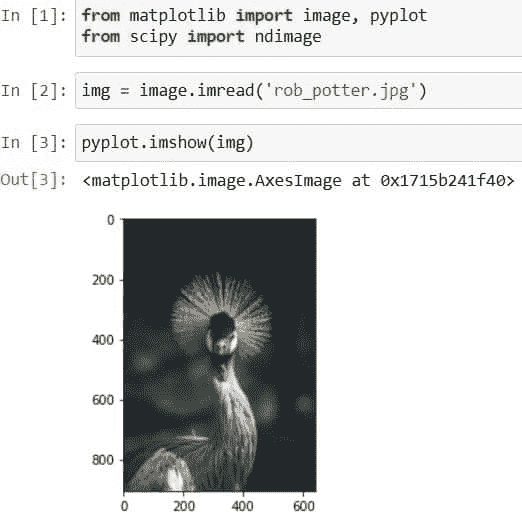
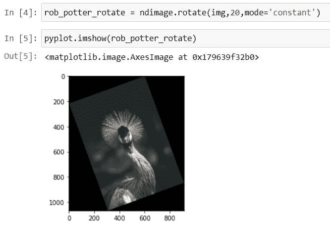
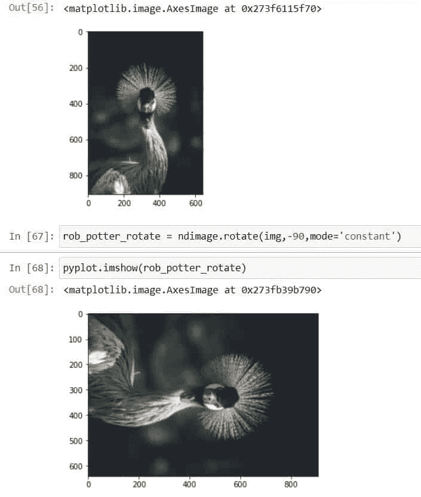
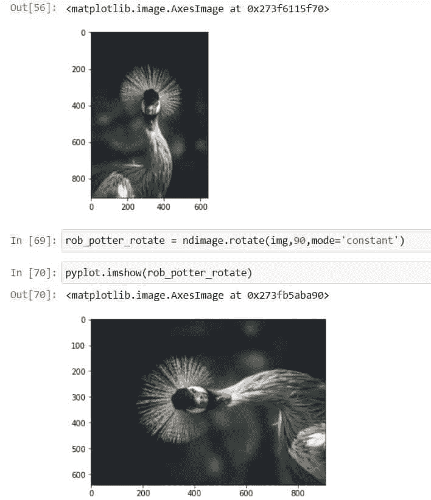
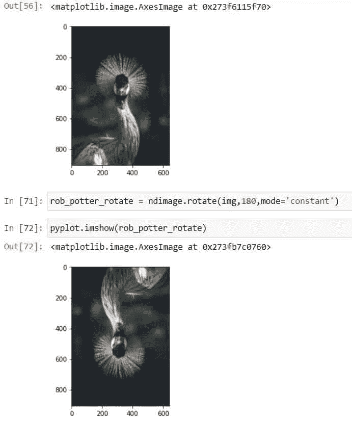
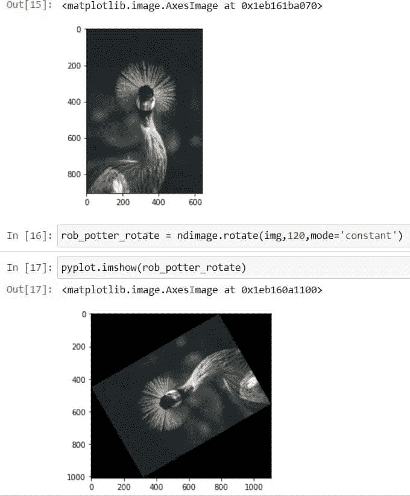
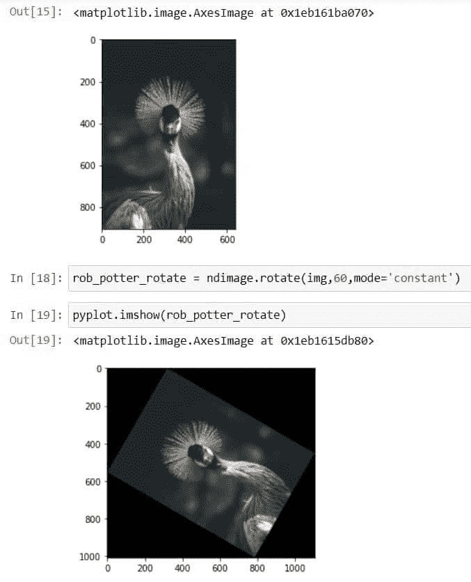
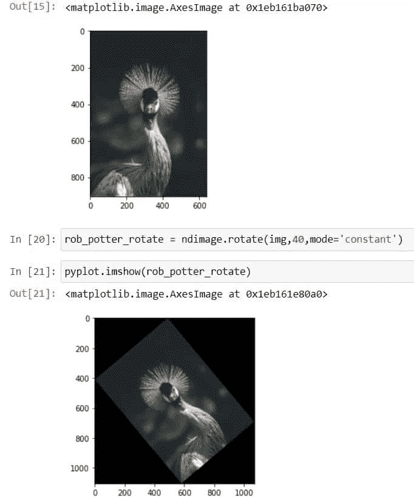

# Scipy 旋转图像+示例

> 原文：<https://pythonguides.com/scipy-rotate-image/>

[](https://sharepointsky.teachable.com/p/python-and-machine-learning-training-course)

在本 [Python 教程](https://pythonguides.com/learn-python/)中，我们将学习“ **Scipy 旋转图像**，这里将根据不同的角度旋转图像。此外，我们将讨论以下主题。

*   Scipy Rotate Image
*   将图像旋转 90 度
*   Scipy 顺时针旋转图像 90 度
*   将图像旋转 180 度
*   将图像旋转 120 度
*   Scipy 将图像旋转 60 度
*   Scipy 将图像旋转 40 度

目录

[](#)

*   [Scipy Rotate Image](#Scipy_Rotate_Image "Scipy Rotate Image")
*   [Scipy 将图像旋转 90 度](#Scipy_Rotate_Image_90_degrees "Scipy Rotate Image 90 degrees")
*   [Scipy 顺时针旋转图像 90 度](#Scipy_Rotate_Image_90_degrees_clockwise "Scipy Rotate Image 90 degrees clockwise")
*   [Scipy 将图像旋转 180 度](#Scipy_Rotate_Image_180_degrees "Scipy Rotate Image 180 degrees")
*   [Scipy 将图像旋转 120 度](#Scipy_Rotate_Image_120_degrees "Scipy Rotate Image 120 degrees")
*   [Scipy 将图像旋转 60 度](#Scipy_Rotate_Image_60_degrees "Scipy Rotate Image 60 degrees")
*   [Scipy 将图像旋转 40 度](#Scipy_Rotate_Image_40_degrees "Scipy Rotate Image 40 degrees")

## Scipy Rotate Image

[Scipy](https://pythonguides.com/what-is-scipy-in-python/) 有一个模块`*`scipy.ndimage`*`来控制图像的形状、大小等，或者执行图像处理任务，这个库有很多图像处理操作的函数。这里我们将使用函数`*`rotate()`*`以给定的角度旋转提供的图像。

下面给出了方法`*`scipy.ndimage.rotate()`*`的语法。

```py
scipy.ndimage.rotate(input, angle, axes=(1, 0), reshape=True, output=None, mode='constant')
```

以下是方法`rotate()`中最常用的参数。

*   ***input(array _ data):***就是我们要旋转的输入数组或者图像。
*   ***角度(浮点):*** 用于指定旋转角度，如 20 度或 90 度。
*   ***轴(元组中的两个整数):*** 旋转的平面由两个轴定义。
*   ***输出(数据类型或数组):*** 定义返回数组的数据类型，默认返回数组的数据类型与输入数组相同。
*   ***模式:*** 用于指定`***‘constant’, ‘mirror’, ‘wrap’, ‘reflect’, ‘nearest’***`的模式。

让我们按照以下步骤通过一个示例来理解:

使用下面的 python 代码导入所需的库，如`matplotlib`和`scipy`。

```py
from matplotlib import image, pyplot
from scipy import ndimage
```

使用下面的代码从目录或者你的计算机上存在的任何地方加载图像。

```py
img = image.imread('rob_potter.jpg')
```

这里，模块`*`image`*`的函数`*`imread()`*`以像素阵列的形式读取图像。

在模块`*`pyplot`*`的功能`*`imshow()`*`的帮助下查看加载的图像，如下所示。

```py
pyplot.imshow(img)
```



Scipy Rotate Image example

让我们使用下面的代码将上面加载的图像旋转到某个角度。

```py
rob_potter_rotate = ndimage.rotate(img,20,mode='constant')
```

在上面的代码中，我们使用了 Scipy 的模块`*`ndimage`*`的函数`*`rotate()`*`来旋转任何图像。还提供一些参数，如我们要旋转的图像`*`img`*`，旋转的角度`*`20`*`度，模式为`*`constant`*`。

现在使用下面的代码查看旋转了 20 度的图像。

```py
pyplot.imshow(rob_ptter_rotate)
```



Scipy Rotate Image

看看上面的输出，看看我们是如何将图像旋转 20 度的。

阅读: [Scipy 优化–实用指南](https://pythonguides.com/scipy-optimize/)

## Scipy 将图像旋转 90 度

这里我们将使用下面的代码逆时针旋转图像 90 度。

使用下面的 python 代码导入所需的库`*`matplotlib`*`和 scipy。

```py
from matplotlib import image, pyplot
from scipy import ndimage
```

使用下面代码所示的函数`*`imread()`*`从目录或您计算机上存在图像的任何地方加载图像。

```py
img = image.imread('rob_potter.jpg')
```

```py
rob_potter_rotate = ndimage.rotate(img,-90,mode='constant')
```

在上面的代码中，我们使用了 Scipy 的模块`*`ndimage`*`的函数`*`rotate()`*`来旋转任何图像。还提供一些参数，如我们要旋转的图像`*`img`*`，旋转的角度``*-90*``度，模式为`*`constant`*`。

```py
pyplot.imshow(rob_potter_rotate)
```



Scipy Rotate Image 90 degrees

这就是我们如何将提供的图像逆时针旋转 90 度。

阅读:[Scipy Sparse–有用的教程](https://pythonguides.com/scipy-sparse/)

## Scipy 顺时针旋转图像 90 度

这里我们将提供的图像顺时针旋转 90 度。

使用下面的 python 代码导入所需的库`*`matplotlib`*`和 scipy。

```py
from matplotlib import image, pyplot
from scipy import ndimage
```

使用下面代码所示的函数`*`imread()`*`从目录或您计算机上存在图像的任何地方加载图像。

```py
img = image.imread('rob_potter.jpg')
```

```py
rob_potter_rotate = ndimage.rotate(img,90,mode='constant')
```

在上面的代码中，我们使用了 Scipy 的模块`*`ndimage`*`的函数`*`rotate()`*`来旋转任何图像。还提供一些参数，如我们要旋转的图像`*`img`*`，旋转的角度`*`90`*`度，模式为`*`constant`*`。

```py
pyplot.imshow(rob_potter_rotate)
```



Scipy Rotate Image 90 degrees clockwise

从上面的输出，我们可以看到图像旋转了 90 度。

阅读:[科学常数](https://pythonguides.com/scipy-constants/)

## Scipy 将图像旋转 180 度

这里我们将给定的图像顺时针旋转 180 度。

使用下面的 python 代码导入所需的库`*`matplotlib`*`和 scipy。

```py
from matplotlib import image, pyplot
from scipy import ndimage
```

使用下面代码所示的函数`*`imread()`*`从目录或您计算机上存在图像的任何地方加载图像。

```py
img = image.imread('rob_potter.jpg')
```

```py
rob_potter_rotate = ndimage.rotate(img,180,mode='constant')
```

在上面的代码中，我们使用了 Scipy 的模块`*`ndimage`*`的函数`*`rotate()`*`来旋转任何图像。还提供一些参数，如我们要旋转的图像`*`img`*`，旋转的角度`*`180`*`度，模式为`*`constant`*`。

```py
pyplot.imshow(rob_potter_rotate)
```



Scipy Rotate Image 180

从上面的输出，我们可以看到图像旋转了 180 度。

阅读: [Scipy Integrate +示例](https://pythonguides.com/scipy-integrate/)

## Scipy 将图像旋转 120 度

这里我们将提供的图像旋转 120 度。

使用下面的 python 代码导入所需的库`*`matplotlib`*`和 scipy。

```py
from matplotlib import image, pyplot
from scipy import ndimage
```

使用下面代码所示的函数`*`imread()`*`从目录或您计算机上存在图像的任何地方加载图像。

```py
img = image.imread('rob_potter.jpg')
```

```py
rob_potter_rotate = ndimage.rotate(img,120,mode='constant')
```

在上面的代码中，我们使用了 Scipy 的模块`*`ndimage`*`的函数`*`rotate()`*`来旋转任何图像。还提供一些参数，如我们要旋转的图像`*`img`*`，旋转的角度`*`120`*`度，模式为`*`constant`*`。

```py
pyplot.imshow(rob_potter_rotate)
```



Scipy Rotate Image 120

从上面的输出，我们可以看到图像旋转了 120 度

阅读[科学杂项+示例](https://pythonguides.com/scipy-misc/)

## Scipy 将图像旋转 60 度

这里我们将提供的图像旋转 60 度。

使用下面的 python 代码导入所需的库`*`matplotlib`*`和 scipy。

```py
from matplotlib import image, pyplot
from scipy import ndimage
```

使用下面代码所示的函数`*`imread()`*`从目录或您计算机上存在图像的任何地方加载图像。

```py
img = image.imread('rob_potter.jpg')
```

```py
rob_potter_rotate = ndimage.rotate(img,60,mode='constant')
```

在上面的代码中，我们使用了 Scipy 的模块`*`ndimage`*`的函数`*`rotate()`*`来旋转任何图像。还提供一些参数，如我们要旋转的图像`*`img`*`，旋转的角度`*`60`*`度，模式为`*`constant`*`。

```py
pyplot.imshow(rob_potter_rotate)
```



Scipy Rotate Image 60

从上面的输出，我们可以看到图像旋转了 60 度。

阅读[科学统计数据](https://pythonguides.com/scipy-stats/)

## Scipy 将图像旋转 40 度

这里我们将把提供的图像旋转 40 度。

使用下面的 python 代码导入所需的库`*`matplotlib`*`和 scipy。

```py
from matplotlib import image, pyplot
from scipy import ndimage
```

使用下面代码所示的函数`*`imread()`*`从目录或您计算机上存在图像的任何地方加载图像。

```py
img = image.imread('rob_potter.jpg')
```

```py
rob_potter_rotate = ndimage.rotate(img,40,mode='constant')
```

在上面的代码中，我们使用了 Scipy 的模块`*`ndimage`*`的函数`*`rotate()`*`来旋转任何图像。还提供一些参数，如我们要旋转的图像`*`img`*`，旋转的角度`*`40`*`度，模式为`*`constant`*`。

```py
pyplot.imshow(rob_potter_rotate)
```



Scipy Rotate Image 40

从上面的输出，我们可以看到图像旋转了 40 度。

此外，请查看以下相关教程列表:

*   [Scipy Convolve–完整指南](https://pythonguides.com/scipy-convolve/)
*   [Python Scipy 置信区间](https://pythonguides.com/scipy-confidence-interval/)
*   [Scipy Linalg–实用指南](https://pythonguides.com/scipy-linalg/)
*   [Scipy Stats Zscore +示例](https://pythonguides.com/scipy-stats-zscore/)
*   [Python Scipy Ndimage 缩放](https://pythonguides.com/python-scipy-ndimage-zoom/)

因此，在本教程中，我们已经学习了“Scipy 旋转图像”，并涵盖了以下主题。

*   Scipy Rotate Image
*   将图像旋转 90 度
*   Scipy 顺时针旋转图像 90 度
*   将图像旋转 180 度
*   将图像旋转 120 度
*   Scipy 将图像旋转 60 度
*   Scipy 将图像旋转 40 度

[Bijay Kumar](https://pythonguides.com/author/fewlines4biju/)

Python 是美国最流行的语言之一。我从事 Python 工作已经有很长时间了，我在与 Tkinter、Pandas、NumPy、Turtle、Django、Matplotlib、Tensorflow、Scipy、Scikit-Learn 等各种库合作方面拥有专业知识。我有与美国、加拿大、英国、澳大利亚、新西兰等国家的各种客户合作的经验。查看我的个人资料。

[enjoysharepoint.com/](https://enjoysharepoint.com/)[](https://www.facebook.com/fewlines4biju "Facebook")[](https://www.linkedin.com/in/fewlines4biju/ "Linkedin")[](https://twitter.com/fewlines4biju "Twitter")