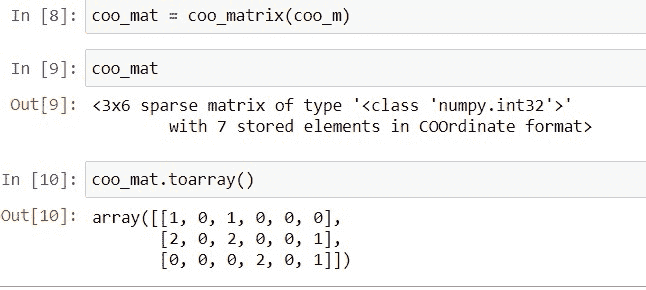

# Scipy 稀疏–有用的教程

> 原文：<https://pythonguides.com/scipy-sparse/>

[](https://sharepointsky.teachable.com/p/python-and-machine-learning-training-course)

在这个 [Python 教程](https://pythonguides.com/learn-python/)中，我们将学习 `Scipy Sparse` ，其中我们将涉及**如何创建一个稀疏矩阵**。此外，我们将讨论以下主题。

*   Scipy Sparse rand
*   Scipy Sparse linalg
*   稀疏 CSR 矩阵
*   稀疏矩阵到 NumPy 数组
*   Scipy Sparse hstack
*   Scipy 稀疏 coo 矩阵
*   Scipy Sparse eigsh
*   从稀疏到密集
*   熊猫数据帧的稀疏矩阵

目录

[](#)

*   [什么是 Scipy 稀疏](#What_is_Scipy_Sparse "What is Scipy Sparse")
*   [Scipy Sparse Rand](#Scipy_Sparse_Rand "Scipy Sparse Rand")
*   [Scipy Sparse linalg](#Scipy_Sparse_linalg "Scipy Sparse linalg")
    *   [抽象线性算子](#Abstract_linear_operators "Abstract linear operators")
    *   [矩阵规范](#Matrix_norms "Matrix norms")
    *   [矩阵运算](#Matrix_Operations "Matrix Operations")
    *   [解决线性问题](#Solving_linear_problems "Solving linear problems")
*   [稀疏 CSR 矩阵](#Scipy_Sparse_CSR_matrix "Scipy Sparse CSR matrix")
*   [Scipy 稀疏矩阵到 NumPy 数组](#Scipy_Sparse_matrix_to_NumPy_array "Scipy Sparse matrix to NumPy array")
*   [Scipy Sparse hstack](#Scipy_Sparse_hstack "Scipy Sparse hstack")
*   [Scipy 稀疏 coo 矩阵](#Scipy_Sparse_coo_matrix "Scipy Sparse coo matrix")
*   [尖锐稀疏的声音](#Scipy_Sparse_eigsh "Scipy Sparse eigsh")
*   [Scipy 稀疏到密集](#Scipy_Sparse_to_dense "Scipy Sparse to dense")
*   熊猫数据帧的稀疏矩阵

## 什么是 Scipy 稀疏

***稀疏矩阵*** 包含大部分元素为零的元素。Scipy 中有两种类型的稀疏矩阵，第一种是``*CSR(Compressed Sparse Row)*``，第二种是``*CSC(Compressed Sparse Column)*``。有一个模块`scipy.sparse`处理稀疏数据或矩阵。

## Scipy Sparse Rand

`*`scipy.sparse`*`包包含一个函数`*`rand()`*`，通过指定形状和密度来生成一个包含均匀分布值的矩阵。

使用函数`*`rand()`*`创建稀疏矩阵的语法如下所示。

```py
scipy.sparse.rand(m, n, density=0.01, format='coo', dtype=None, random_state=None)
```

其中参数为:

*   ***m，n:*** 它定义了矩阵的形状——就像我们要构建一个形状为 2 乘 3 的矩阵，其中 m 和 n 分别为 2 和 3。
*   ***密度:*** 它用来指定我们要生成的矩阵的密度，如果我们指定矩阵的密度为 1，那么它就是全矩阵。如果将密度指定为 0，这意味着矩阵不包含非零项。
*   ***格式:*** 用于指定矩阵的格式。
*   ***dtype:*** 用于定义返回的矩阵值的数据类型。
*   ***random_state:*** 用于产生可重复的值。

在下面的演示中，我们将使用函数``rand()``生成稀疏矩阵。

使用下面的代码导入函数``rand()``。

```py
from scipy.sparse import rand
```

使用下面的代码，通过用 `3` 指定 `4` 的形状，用**密度= 0.30** 、**格式="csr"** 和 `random_state=40` 创建一个矩阵。

```py
matrix_data = rand(4, 3, density=0.30, format="csr", random_state=40)
```

检查矩阵数据类型及其格式。

```py
matrix_data
```

现在，在矩阵上使用函数`toarray()`检查创建的矩阵的元素。

```py
matrix_data.toarray()
```


Scipy Sparse rand

阅读:[Python 中的 Scipy 是什么](https://pythonguides.com/what-is-scipy-in-python/)

## Scipy Sparse linalg

在 [Scipy](https://pythonguides.com/what-is-scipy-in-python/) 中，子包`*`scipy.sparse`*`有模块`*`linalg`*`来处理线性代数问题，它有许多与下面给出的不同类别相关的方法。

### 抽象线性算子

它有两种方法:

*   ***LinearOperator(*args，**kwargs) :*** 是做矩阵-向量乘积的常用接口。
*   ***aslinearoperator(A):***它输出一个 linear operator。

### 矩阵规范

它也有两种方法来计算矩阵的正态分布。

*   ***范数(x[，ord，axis]):*** 它返回给定稀疏矩阵的正态分布。
*   ***onenormest(A[，t，itmax，compute_v，compute_w]):*** 给定一个稀疏矩阵的 1-范数，它计算一个下界。

### 矩阵运算

它用于计算给定稀疏矩阵的指数和逆矩阵，有三种方法。

*   ***inv(A):*** 用于计算给定稀疏矩阵的逆
*   ***expm(A):*** t 用于借助 Pade 近似计算矩阵指数。
*   ***expm_multiply(A，B[，start，stop，num，endpoint]):*** t 用于计算 A 的矩阵指数对 B 的作用

### 解决线性问题

它有解决线性问题的直接方法，并且有许多方法，这里我们将了解一些方法。

*   ***spsolve(A，b[，permc_spec，use_umfpack]):*** 用于求稀疏线性系统 Ax=b 的解，其中 b 代表一个向量或一个矩阵。
*   ***spsolve_triangular(A，b[，lower，…]):*** 用于求类似于 A x = b 对于 x 的方程的解，其中 A 被认为是一个三角矩阵。

官方文档[**“scipy . sparse . Lina LG”**](https://docs.scipy.org/doc/scipy/reference/sparse.linalg.html#module-scipy.sparse.linalg)还有其他方法

## 稀疏 CSR 矩阵

``csr``代表``*Compressed Sparse Row Matrix*``，所以我们可以使用 Scipy 的子包`*`scipy.sparse`*`中的函数创建`csr matrix`。

如果我们想要一个可以执行加法、乘法、减法、矩阵幂和除法的矩阵，那么``*csr matrix*``就适合了。

可以通过如下所示的多种方式创建``*csr matrix*``。

**csr_matrix(D):** 使用 rank _ 2n 阵列或密集矩阵。

使用下面的代码导入必要的库。

```py
import numpy as np
from scipy.sparse import csr_matrix
```

使用下面的代码创建一个秩为 2 的矩阵。

```py
D = np.array([[1, 0, 1, 0, 0, 0], [2, 0, 2, 0, 0, 1],\
 [0, 0, 0, 2, 0, 1]])
```

使用以下代码检查装箱的矩阵。

```py
print(D)
```

将创建的矩阵传递给函数 **`csr_matrix()`** ，使用下面的代码创建``*csr matrix*``并查看。

```py
# Creating csr matrix
csr_m = csr_matrix(D) 
```


Scipy Sparse CSR matrix csr_matrix(D)

**csr_matrix(S):** 使用另一个已经创建的稀疏矩阵创建一个新的``*csr matrix*``。使用我们在上面的名称``csr_m``中创建的相同矩阵。

```py
csr_mat = csr_matrix(csr_m)
```

检查数据类型和与矩阵相关的其他信息。

```py
csr_mat
```

使用以下代码查看板条箱矩阵。

```py
csr_mat.toarray()
```


Scipy Sparse CSR matrix csr_matrix(S)

***csr_matrix((M，N)，【类型】):*** 通过可选选项类型指定形状 M 和 N，创建一个空矩阵。

使用下面的代码创建一个``*csr matrix*``。

```py
csr_matrix((5, 4), dtype=np.int8).toarray()
```


Scipy Sparse CSR matrix csr_matrix(M N)

***csr_matrix((data，(row_ind，col_ind))，【shape=(M，N)】***:用于构造`**data, row_ind and col_ind**`满足关系 **`csr_matrix((data, (row_ind, col_ind)), [shape=(M, N)])`** 的矩阵。

使用下面的代码创建一个``*csr matrix*``。

```py
import numpy as np
from scipy.sparse import csr_matrix

row_idx = np.array([0, 1, 0, 1, 2, 2])
col_idx = np.array([0, 1, 1, 0, 1, 2])
data = np.array([2, 3, 4, 5, 6, 7])
csr_matrix((data, (row_idx,col_idx)), shape=(4, 4)).toarray()
```


Scipy Sparse CSR matrix csr_matrix example

***【CSR _ matrix((data，indices，indptr)，【shape=(M，N)】***:

```py
import numpy as np
from scipy.sparse import csr_matrix

indptr_a = np.array([0, 4, 5, 2])
indices_b = np.array([0, 2, 2, 0, 2, 3])
data = np.array([1, 2, 3, 4, 5, 6])
csr_matrix((data, indices_b, indptr_a), shape=(3, 3)).toarray()
```


Scipy Sparse CSR matrix csr_matrix tutorial

阅读:[蟒蛇皮里的熊猫](https://pythonguides.com/pandas-in-python/)

## Scipy 稀疏矩阵到 NumPy 数组

`***[numpy array](https://pythonguides.com/python-numpy-array/)***`是一个表示密集 n 阵列矩阵的矩阵，所以这里将使用函数`toarray`将``*csr matrix*``转换成`dense ndarray`。

下面给出了语法。

```py
csr_matrix.todense(order=None, out=None)
```

其中参数为:

*   ***order:*** 用于指定使用哪些 order，如 row-major(C)和 column-major(F)来存储多维数据。默认情况下，`None`表示没有订单。
*   ***out:*** 用于指定如何像输出缓冲区一样以数组(numpy.matrix)的形式返回结果，而不是在返回结果的同时创建一个新的数组。

让我们以下面的步骤为例:

使用下面的代码导入必要的库。

```py
import numpy as np
from scipy.sparse import csr_matrix
```

使用下面的代码创建数组。

```py
row_data = np.array([0, 0, 2, 2, 1, 1, 4, 4, 5, 5, 1, 1, 2])
col_data = np.array([0, 3, 1, 0, 6, 1, 6, 3, 5, 3, 1, 4, 3])
array_data = np.array([1]*len(r))
```

使用下面的代码创建`csr matrix`。

```py
csr_mat = csr_matrix(array_data,(row_data,col_data),shape =(7,7))
```

使用以下代码检查矩阵中的数据类型和存储元素。

```py
csr
```

通过使用下面的代码对矩阵`csr_mat`应用方法`toarray()`将`csr matrix`转换为 numpy 数组矩阵。

```py
csr_to_array = csr_mat.toarrat()
```

使用以下代码检查密集矩阵`*`csr_to_array`*`的元素。

```py
csr_to_array
```


Scipy Sparse matrix to NumPy array

阅读: [Scipy 旋转图像+示例](https://pythonguides.com/scipy-rotate-image/)

## Scipy Sparse hstack

为了逐列(水平地)堆叠稀疏矩阵，`*`scipy.sparse`*`有方法`*`hstack()`*`来实现。

下面给出了语法。

```py
scipy.sparse.hstack(blocks, format=None, dtype=None)
```

其中参数为:

*   ***分块:*** 我们要堆叠的是稀疏矩阵。
*   ***格式:*** 用于指定稀疏矩阵的格式，默认为`*`csr`*`。
*   ***dtype:*** 是返回矩阵的数据类型。

运行以下步骤创建水平堆栈矩阵。

使用下面的代码导入所需的库。

```py
from scipy.sparse import hstack, coo_matrix
```

创建两个稀疏矩阵，并将这两个矩阵传递给一个方法`*`hstack`*`。

```py
first_mat = coo_matrix([[2, 3], [4, 5]])
second_mat = coo_matrix([[6], [7]])
hstack([first_mat,second_mat]).toarray()
```


Scipy Sparse hstack

看看上面的输出，两个矩阵是如何水平堆叠的。

阅读: [Scipy Integrate +示例](https://pythonguides.com/scipy-integrate/)

## Scipy 稀疏 coo 矩阵

在 Scipy 中，子包`*`scipy.sparse`*`包含方法`*`coo_matrix()`*`来生成坐标格式的新稀疏矩阵。

可以通过如下所示的多种方式创建``*coo matrix*``。

**coo_matrix(D):** 使用 rank _ 2n array D 或密集矩阵。

使用下面的代码导入必要的库。

```py
import numpy as np
from scipy.sparse import csr_matrix
```

使用下面的代码创建一个秩为 2 的矩阵。

```py
D = np.array([[1, 0, 1, 0, 0, 0], [2, 0, 2, 0, 0, 1],\
 [0, 0, 0, 2, 0, 1]])
```

使用以下代码检查装箱的矩阵。

```py
print(D)
```

将创建的矩阵传递给函数 **`coo_matrix()`** ，使用下面的代码创建``*coo matrix*``并查看。

```py
# Creating coo matrix
csr_m = csr_matrix(D) 
```


Scipy Sparse coo matrix coo_matrix(D)

*   **coo_matrix(S):** 使用另一个已经创建的稀疏矩阵创建一个新的``*coo matrix*``。使用我们在上面的名称``coo_m``中创建的相同矩阵。

```py
coo_mat = csr_matrix(coo_m)
```

检查数据类型和与矩阵相关的其他信息。

```py
coo_mat
```

使用下面的代码查看创建的矩阵。

```py
coo_mat.toarray()
```



Scipy Sparse coo matrix coo_matrix(S)

*   ***coo_matrix((M，N)，【类型】):*** 用可选选项类型指定形状 M 和 N，创建一个空矩阵。

使用下面的代码创建一个``*coo matrix*``。

```py
coo_matrix((4, 6), dtype=np.int8).toarray()
```


Scipy Sparse coo matrix coo_matrix(M,N)

阅读: [Scipy 信号-有用教程](https://pythonguides.com/scipy-signal/)

## 尖锐稀疏的声音

为了找到给定对称方阵的特征向量和特征值，使用存在于子包`*`scipy.sparase.linalg`*`中的方法`*`eigsh()`*`。

下面给出了语法。

```py
scipy.sparse.linalg.eigsh(A, k=6)
```

其中参数为:

*   ***答:*** 它接受 ndarray，线性算子，或者稀疏矩阵。它是一个平方运算符，用于运算``*(A * x)*``，其中 A 是一个矩阵。
*   ***k:*** 它用来指定我们想要从那个矩阵中得到的特征向量和特征值的个数。

让我们以下面的步骤为例。

使用下面的代码导入方法`eigsh`。

```py
from scipy.sparse.linalg import eigsh
import numpy as np
```

使用`*`np.eye()`*`函数创建一个单位矩阵。

```py
identity_data = np.eye(15)
```

使用下面的代码找到创建的矩阵的特征值和特征向量。

```py
eigenval, eigenvect = eigsh(identity_data, k=8)
```

使用下面的代码检查特征值。

```py
eigenval
```


Scipy Sparse eigsh

阅读: [Python Scipy 最小化【附 8 个例子】](https://pythonguides.com/python-scipy-minimize/)

## Scipy 稀疏到密集

``*dense matrix*``是一个矩阵，矩阵内的大部分元素都是非零的，所以这里取 ***`csr matrix`*** ，用函数`todense`转换成``*dense matrix*``。

下面给出了语法。

```py
csr_matrix.todense(order=None, out=None)
```

其中参数为:

*   ***order:*** 用于指定使用哪些 order，如 row-major(C)和 column-major(F)来存储多维数据。默认情况下，`None`表示没有订单。
*   ***out:*** 用于指定如何像输出缓冲区一样以数组(numpy.matrix)的形式返回结果，而不是在返回结果的同时创建一个新的数组。

让我们以下面的步骤为例:

使用下面的代码导入必要的库。

```py
import numpy as np
from scipy.sparse import csr_matrix
```

使用下面的代码创建数组。

```py
row_data = np.array([0, 0, 2, 2, 1, 1, 4, 4, 5, 5, 1, 1, 2])
col_data = np.array([0, 3, 1, 0, 6, 1, 6, 3, 5, 3, 1, 4, 3])
array_data = np.array([1]*len(r))
```

使用下面的代码创建``*csr matrix*``。

```py
csr_mat = csr_matrix(array_data,(row_data,col_data),shape =(6,6))
```

使用以下代码检查矩阵中的数据类型和存储元素。

```py
csr
```

使用下面的代码，通过对矩阵`*`csr_mat`*`应用 ***`todense()`*** 的方法，将``*csr matrix*``转换为密集矩阵。

```py
csr_to_dense = csr_mat.todense()
```

使用以下代码检查密集矩阵`*`csr_to_dense`*`的元素。

```py
csr_to_dense
```


Scipy Sparse to dense

阅读: [Python Scipy 指数](https://pythonguides.com/python-scipy-exponential/)

## 熊猫数据帧的稀疏矩阵

这里我们将使用函数`csr_matrix()`从熊猫数据帧中创建一个稀疏矩阵。

首先，使用下面的代码创建一个新的数据帧。

```py
# importing pandas as pd
import pandas as pd

# Creating the DataFrame
dataf = pd.DataFrame({'Marks':[50, 90, 60, 20, 80],
                 'Age':[14, 25, 55, 8, 21]})

# Create the index
index_ = pd.Series(range(1,6))

# Set the index
dataf.index = index_

# Print the DataFrame
print(dataf)
```

现在使用下面的代码将上面创建的数据帧转换成稀疏数据帧或矩阵。

```py
# Importing the method csr_matrix()
from scipy.sparse import csr_matrix

# Creating the sparse matrix by passing the values of dataf 
# using dataf.values.T to method csr_matrix()
sparse_matrix_from_dataframe = csr_matrix(dataf.values.T)

# viewing the elements of created sparse matrix
sparse_matrix_from_dataframe.toarray()
```


Scipy Sparse matrix from pandas dataframe

您可能也喜欢阅读下面的 Python SciPy 教程。

*   [Scipy Find Peaks–实用教程](https://pythonguides.com/scipy-find-peaks/)
*   [Python Scipy 卡方检验](https://pythonguides.com/python-scipy-chi-square-test/)
*   [Scipy Linalg–实用指南](https://pythonguides.com/scipy-linalg/)
*   [Scipy Stats Zscore +示例](https://pythonguides.com/scipy-stats-zscore/)

因此，在本教程中，我们已经学习了" `Scipy Sparse` "并涵盖了以下主题。

*   Scipy Sparse rand
*   Scipy Sparse linalg
*   稀疏 CSR 矩阵
*   稀疏矩阵到 NumPy 数组
*   Scipy Sparse hstack
*   Scipy 稀疏 coo 矩阵
*   Scipy Sparse eigsh
*   从稀疏到密集
*   熊猫数据帧的稀疏矩阵

[Bijay Kumar](https://pythonguides.com/author/fewlines4biju/)

Python 是美国最流行的语言之一。我从事 Python 工作已经有很长时间了，我在与 Tkinter、Pandas、NumPy、Turtle、Django、Matplotlib、Tensorflow、Scipy、Scikit-Learn 等各种库合作方面拥有专业知识。我有与美国、加拿大、英国、澳大利亚、新西兰等国家的各种客户合作的经验。查看我的个人资料。

[enjoysharepoint.com/](https://enjoysharepoint.com/)[](https://www.facebook.com/fewlines4biju "Facebook")[](https://www.linkedin.com/in/fewlines4biju/ "Linkedin")[](https://twitter.com/fewlines4biju "Twitter")