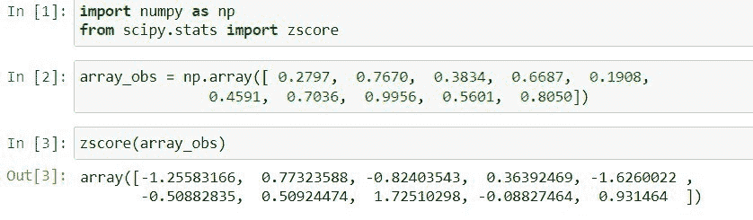
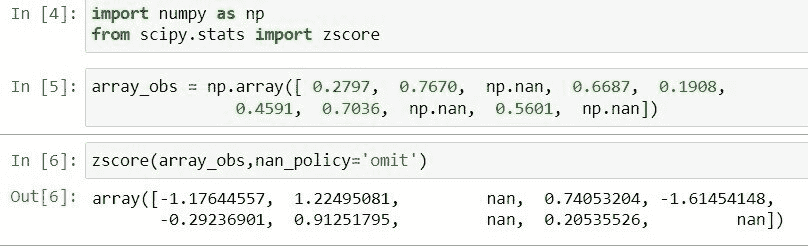
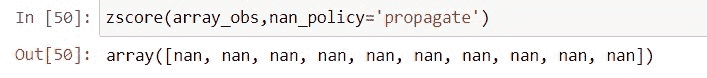
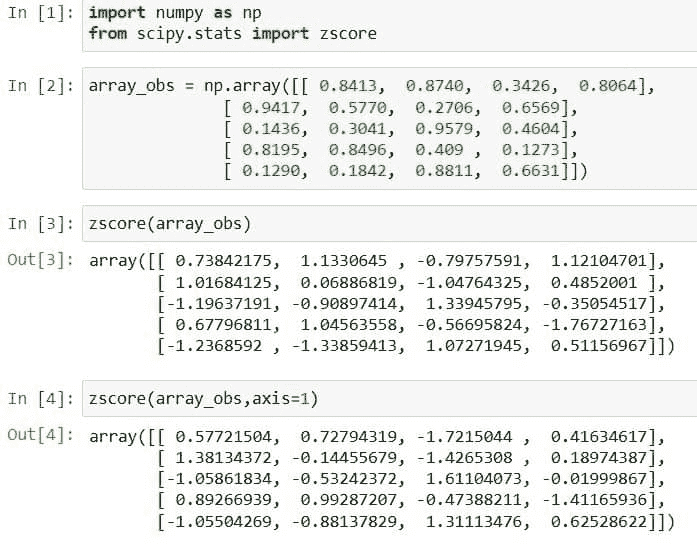
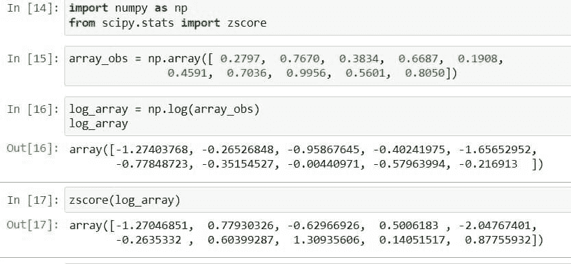
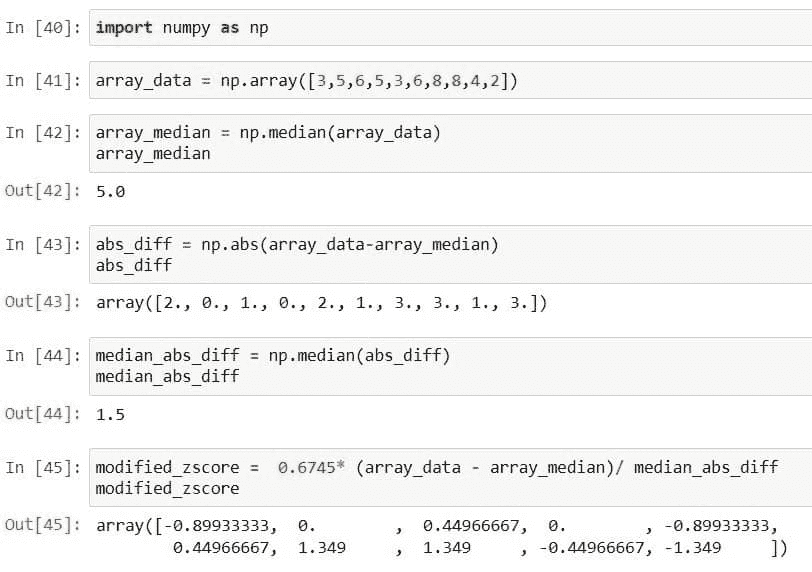

# Scipy Stats Zscore +示例

> 原文：<https://pythonguides.com/scipy-stats-zscore/>

[](https://sharepointsky.teachable.com/p/python-and-machine-learning-training-course)

在这个 [Python 教程](https://pythonguides.com/learn-python/)中，我们将学习“ `Scipy Stats Zscore` ”，此外我们还将涉及以下主题。

*   Scipy Stats 袖珍版
*   Scipy Stats 袖珍南
*   Scipy Stats Zscore axis
*   Scipy Stats Zscore 日志文件
*   Scipy Stats 修改了 Zscore

目录

[](#)

*   [Scipy 状态的口袋](#Scipy_Stats_Zscore "Scipy Stats Zscore")
*   [Scipy 状态下的袖珍南](#Scipy_Stats_Zscore_nan "Scipy Stats Zscore nan")
*   [Scipy Stats Zscore axis](#Scipy_Stats_Zscore_axis "Scipy Stats Zscore axis")
*   [Scipy 状态的袖珍日志](#Scipy_Stats_Zscore_log "Scipy Stats Zscore log")
*   [Scipy Stats 修改 Zscore](#Scipy_Stats_Modified_Zscore "Scipy Stats Modified Zscore")

## Scipy 状态的口袋

[Python Scipy](https://pythonguides.com/what-is-scipy-in-python/) 有一个存在于模块`*`scipy.stats`*`中的方法`*`zscore()`*`，该方法计算样本的每个数据点相对于样本平均值的 ***z 值*** 。实际上，它是在标准差的帮助下，找出样本的观察值和包含许多观察值的样本的平均值之间的距离。

下面给出了语法。

```py
scipy.stats.zscore(a, axis=0, ddof=0, nan_policy='propagate')
```

其中参数为:

*   ***a(数组 _ 数据):*** 是包含样本观测值的数组数据。
*   ***轴(int):*** 用于指定在哪个轴上计算 z 值。默认情况下，它是 0。
*   ***ddof():*** 确定计算的标准偏差的修正自由度。
*   ***nan_ploicy:*** 用于处理数组内存在的 nan 值。它有一些以不同方式处理 nan 值的参数，这些参数是`*`omit`*`、`*`propagate`*`和`*`raise`*`。

方法`*`zscore()`*`返回给定数组的`*`zscore`*`作为输入。

让我们通过下面的步骤来了解一个示例:

使用下面的 python 代码导入所需的库。

```py
import numpy as np
from scipy.stats import zscore
```

使用下面的代码创建一个包含数据点的数组。

```py
array_obs = np.array([ 0.2797,  0.7670,  0.3834,  0.6687,  0.1908,
               0.4591,  0.7036,  0.9956,  0.5601,  0.8050])
```

现在使用下面的代码将上面创建的数组传递给方法`zscore()`。

```py
zscore(array_obs)
```



Scipy Stats Zscore

这就是如何计算给定数据数组的 z 值。

阅读: [Scipy Ndimage Rotate](https://pythonguides.com/scipy-ndimage-rotate/)

## Scipy 状态下的袖珍南

在 python Scipy 的上述小节中，我们已经计算了给定数组的 z 值，但是我们也了解了方法`*`zscore()`*`的一些参数。方法`*`zscore()`*`的参数之一是`*`nan_policy`*`处理给定数组中的`nan`值。`nan`代表``*Not a number*``。

因此，在这一小节中，我们将了解如何使用该方法的`*`nan_ploicy`*`参数来处理数组中的 nan 值，同时计算 z 值。

参数`*`nan_policy`*`也有以不同方式处理`nan`值的选项，这些选项如下所示。

*   ***省略:*** 该选项在跳过给定数组中的 nan 值的同时计算 z 值。
*   ***传宗接代:*** 它显示了楠的价值观。
*   ***raise:*** 对于给定数组中的 nan 值抛出错误。

让我们以下面的步骤为例:

使用下面的 python 代码导入所需的库。

```py
import numpy as np
from scipy.stats import zscore
```

使用下面的代码创建一个包含具有 nan 值的数据点的数组。

```py
array_obs = np.array([ 0.2797,  0.7670,  np.nan,  0.6687,  0.1908,
               0.4591,  0.7036,  np.nan,  0.5601,  np.nan])
```

在上面的代码中，这里的``*np.nan represents the nan values*` in an`是数组。

使用下面的代码将上面的数组传递给参数`*`nan_policy`*`等于`*`omit`*`的方法。

```py
zscore(array_obs,nan_policy='omit')
```



Scipy Stats Zscore nan

使用下面的代码再次将上面的数组传递给参数`*`nan_policy`*`等于`*`raise`*`的方法。

```py
zscore(array_obs,nan_policy='raise')
```


Scipy Stats Zscore nan example

现在，再次使用下面的代码将上面的数组传递给参数`*`nan_policy`*`等于`*`propagate`*`的方法。

```py
zscore(array_obs,nan_policy='propagate')
```



Scipy Stats Zscore nan tutorial

这就是如何使用参数`*`nan_policy`*`来处理给定数组中的 nan 值。

阅读: [Scipy 信号-有用教程](https://pythonguides.com/scipy-signal/)

## Scipy Stats Zscore axis

在 Python Scipy 的上述小节中，我们使用了方法`zscore()`的参数`*`nan_policy`*`来处理给定数组中的 nan 值。这里我们将使用另一个参数`axis`来计算给定数组的指定轴上的 z 值。

参数`*`axis`*`接受两个值`*`0`*`和`*`1`*`，它们代表给定数组的不同轴。默认情况下，该方法计算沿 0 轴的 z 得分。

让我们通过下面的步骤来了解一个示例:

使用下面的 python 代码导入所需的库。

```py
import numpy as np
from scipy.stats import zscore
```

使用下面的代码创建一个包含数据点的数组。

```py
array_obs = np.array([[ 0.8413,  0.8740,  0.3426,  0.8064],
              [ 0.9417,  0.5770,  0.2706,  0.6569],
              [ 0.1436,  0.3041,  0.9579,  0.4604],
              [ 0.8195,  0.8496,  0.409 ,  0.1273],
              [ 0.1290,  0.1842,  0.8811,  0.6631]])
```

将数组输入到方法`*`zscore()`*`中，使用下面的代码计算 z 值，而不指定轴或默认轴值。

```py
zscore(array_obs)
```

使用下面的代码再次输入相同的数组和参数值`*`axis`*`到 *`1`* 。

```py
zscore(array_obs,axis=1)
```



Scipy Stats Zscore axis

查看基于指定轴的数组的 z 分值。

阅读: [Scipy Integrate +示例](https://pythonguides.com/scipy-integrate/)

## Scipy 状态的袖珍日志

在 python Scipy 的这一小节中，我们将使用日志转换数组，并计算转换后数组的 z 值。

让我们以下面的步骤为例:

使用下面的 python 代码导入所需的库。

```py
import numpy as np
from scipy.stats import zscore
```

使用下面的代码创建一个包含数据点的数组。

```py
array_obs = np.array([ 0.2797,  0.7670,  0.3834,  0.6687,  0.1908,
               0.4591,  0.7036,  0.9956,  0.5601,  0.8050])
```

通过使用下面的代码对数组应用 NumPy 的`*`log`*`方法，将数组值转换成其他值。

```py
log_array = np.log(array_obs)
log_array
```

现在使用下面的代码将转换后的数组传递给方法`zscore()`。

```py
zscore(log_array)
```



Scipy Stats Zscore log

这就是如何在数组上应用 log，然后应用方法`*`zscore()`*`来计算该数组的 z 值。

阅读: [Scipy Integrate +示例](https://pythonguides.com/scipy-integrate/)

## Scipy Stats 修改 Zscore

Python Scipy 没有任何方法来计算修改后的 z 得分，修改后的 z 得分使用中值而不是平均值。修正 z 值的公式为``*zscore = 0.6745 * (x_data - median) / median_absolute_deviation*``。

因此，我们将按照以下步骤手动执行修改后的 z 值:

使用下面的 python 代码导入所需的库。

```py
import numpy as np
```

使用下面的代码创建数组数据作为样本数据点。

```py
array_data = np.array([3,5,6,5,3,6,8,8,4,2])
```

使用下面的代码计算数组数据的中值。

```py
array_median = np.median(array_data)
array_median
```

计算每个数据点和中位数之间的绝对差值。

```py
abs_diff = np.abs(array_data-array_median)
abs_diff
```

通过使用下面的代码找到上述数组中值的中值来计算中值绝对差。

```py
median_abs_diff = np.median(abs_diff)
median_abs_diff
```

现在应用我们在上面学到的公式，使用下面的代码计算修改后的 z 值。

```py
modified_zscore =  0.6745* (array_data - array_median)/ median_abs_diff
modified_zscore
```



Scipy Stats Modified Zscore

这就是如何计算修改后的 z 值。

您可能也喜欢阅读下面的 Python Scipy 教程。

*   [Scipy 正态分布](https://pythonguides.com/scipy-normal-distribution/)
*   [Python Scipy IIR 滤波器](https://pythonguides.com/python-scipy-iir-filter/)
*   [Python Scipy 卡方检验](https://pythonguides.com/python-scipy-chi-square-test/)
*   [Python Scipy 置信区间](https://pythonguides.com/scipy-confidence-interval/)
*   [Scipy Stats–完整指南](https://pythonguides.com/scipy-stats/)
*   [Scipy 旋转图像+示例](https://pythonguides.com/scipy-rotate-image/)
*   [Scipy Sparse–有用的教程](https://pythonguides.com/scipy-sparse/)
*   [Scipy 优化–实用指南](https://pythonguides.com/scipy-optimize/)

因此，在本教程中，我们已经了解了“Scipy Stats Zscore”并涵盖了以下主题。

*   Scipy Stats 袖珍版
*   Scipy Stats 袖珍南
*   Scipy Stats Zscore axis
*   Scipy Stats Zscore 日志文件
*   Scipy Stats 修改了 Zscore

[Bijay Kumar](https://pythonguides.com/author/fewlines4biju/)

Python 是美国最流行的语言之一。我从事 Python 工作已经有很长时间了，我在与 Tkinter、Pandas、NumPy、Turtle、Django、Matplotlib、Tensorflow、Scipy、Scikit-Learn 等各种库合作方面拥有专业知识。我有与美国、加拿大、英国、澳大利亚、新西兰等国家的各种客户合作的经验。查看我的个人资料。

[enjoysharepoint.com/](https://enjoysharepoint.com/)[](https://www.facebook.com/fewlines4biju "Facebook")[](https://www.linkedin.com/in/fewlines4biju/ "Linkedin")[](https://twitter.com/fewlines4biju "Twitter")