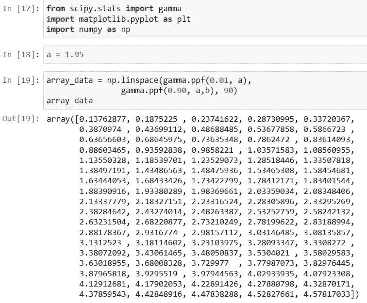
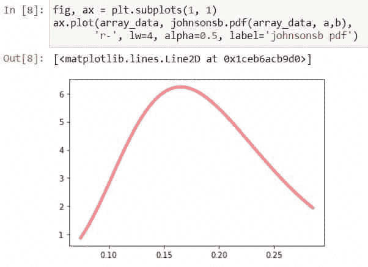
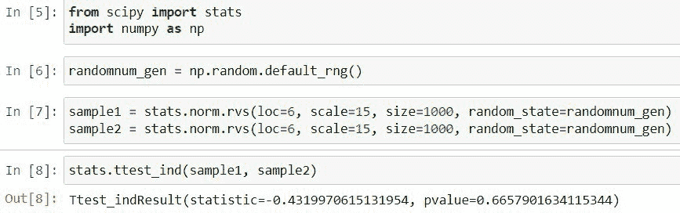

# scipy Stats–完整指南

> 原文：<https://pythonguides.com/scipy-stats/>

[](https://sharepointsky.teachable.com/p/python-and-machine-learning-training-course)

在这个 [Python 教程](https://pythonguides.com/learn-python/)中，我们将使用 Python 中的各种例子来理解“ `Scipy Stats` 的用法。此外，我们将讨论以下主题。

*   Scipy Stats(科学之州)
*   Scipy 统计对数正常
*   Scipy 状态规范
*   Scipy 状态 t 检验
*   scipy stats pearson(科学怪人)
*   Scipy Stats 卡方检验
*   Scipy 状态下的 IQR
*   西皮统计鱼
*   科学统计熵
*   Scipy Stats Anova 的研究
*   科学统计安德森
*   科学统计平均值
*   Scipy Stats Alpha 的研究
*   Scipy Stats Boxcox
*   Scipy Stats Binom 的研究
*   scipy stats beta 版
*   Scipy 统计二项式检验
*   Scipy Stats 装箱统计
*   pmf 中的 Scipy 态
*   Scipy 状态下的 CDF
*   scipy stats cauchy(西班牙语)
*   科学统计描述
*   Scipy 统计指数
*   scipy stats 伽马
*   科学统计几何
*   scipy stats gmean 公司
*   scipy stats 基因标准
*   scipy stats genpareto 的研究
*   科学统计 Gumbel
*   科学统计基因极限
*   Scipy 统计直方图
*   半正常状态
*   Scipy Stats 半柯西
*   Scipy 统计反伽玛
*   Scipy Stats 逆法线 CDF
*   科学统计约翰逊
*   Scipy 状态 PDF
*   scipy stats hypergeom 的研究
*   Scipy 统计间隔
*   Scipy 州 ISF
*   Scipy Stats 独立 T 检验
*   Scipy 统计费希尔精确

目录

[](#)

*   [Scipy Stats](#Scipy_Stats "Scipy Stats") 的缩写形式
*   [科学统计对数正常](#Scipy_Stats_Lognormal "Scipy Stats Lognormal")
*   [Scipy 状态规范](#Scipy_Stats_Norm "Scipy Stats Norm")
*   [Scipy Stats CDF](#Scipy_Stats_CDF "Scipy Stats CDF")
*   [科学统计直方图](#Scipy_Stats_Histogram "Scipy Stats Histogram")
*   [Scipy 州培生公司](#Scipy_Stats_Pearsonr "Scipy Stats Pearsonr")
*   [Scipy 状态的 PDF](#Scipy_Stats_PDF "Scipy Stats PDF")
*   [Scipy Stats 卡方检验](#Scipy_Stats_chi-square "Scipy Stats chi-square")
*   IQR 科学统计
*   [科学统计平均值](#Scipy_Stats_Average "Scipy Stats Average")
*   [科学统计熵](#Scipy_Stats_Entropy "Scipy Stats Entropy")
*   安德森
*   [Scipy 状态方差分析](#Scipy_Stats_Anova "Scipy Stats Anova")
*   [Scipy Stats T-test](#Scipy_Stats_T-test "Scipy Stats T-test")
*   [Scipy Stats 半正常](#Scipy_Stats_Half_normal "Scipy Stats Half normal")
*   [Scipy 的 Cauchy 状态](#Scipy_Stats_Cauchy "Scipy Stats Cauchy")
*   [Scipy Stats 半柯西](#Scipy_Stats_Half_cauchy "Scipy Stats Half cauchy")
*   [Scipy 状态绑定](#Scipy_Stats_Binom "Scipy Stats Binom")
*   [科学统计描述](#Scipy_Stats_Describe "Scipy Stats Describe")
*   [Scipy Stats 二项式检验](#Scipy_Stats_Binomial_test "Scipy Stats Binomial test")
*   [PMF 结合的 Scipy 状态](#Scipy_Stats_Binom_pmf "Scipy Stats Binom pmf")
*   [Scipy Stats gmean](#Scipy_Stats_gmean "Scipy Stats gmean")
*   [科学统计 Alpha](#Scipy_Stats_Alpha "Scipy Stats Alpha")
*   [Scipy 状态测试台](#Scipy_Stats_Beta "Scipy Stats Beta")
*   [Scipy 状态下的 Gamma](#Scipy_Stats_Gamma "Scipy Stats Gamma")
*   [Scipy Stats 逆法线 CDF](#Scipy_Stats_Inverse_Normal_CDF "Scipy Stats Inverse Normal CDF")
*   约翰逊
*   [科学统计反伽玛](#Scipy_Stats_Inverse_gamma "Scipy Stats Inverse gamma")
*   [Scipy 状态基因规范](#Scipy_Stats_Gennorm "Scipy Stats Gennorm")
*   [Scipy 状态基因帕累托](#Scipy_Stats_Genpareto "Scipy Stats Genpareto")
*   [科学统计 Gumbel](#Scipy_Stats_Gumbel "Scipy Stats Gumbel")
*   [Scipy Stats 入库统计数据](#Scipy_Stats_Binned_statistics "Scipy Stats Binned statistics")
*   [Scipy Stats Poisson](#Scipy_Stats_Poisson "Scipy Stats Poisson")
*   [科学统计几何](#Scipy_Stats_Geometric "Scipy Stats Geometric")
*   [科学统计指数](#Scipy_Stats_Exponential "Scipy Stats Exponential")
*   [Scipy Stats Boxcox](#Scipy_Stats_Boxcox "Scipy Stats Boxcox")
*   [Scipy Stats Genextreme](#Scipy_Stats_Genextreme "Scipy Stats Genextreme")
*   [Scipy Stats Dirichlet](#Scipy_Stats_Dirichlet "Scipy Stats Dirichlet")
*   [Scipy 状态超大地水准面](#Scipy_Stats_Hypergeom "Scipy Stats Hypergeom")
*   [科学统计时间间隔](#Scipy_Stats_Interval "Scipy Stats Interval")
*   [科学统计 ISF](#Scipy_Stats_ISF "Scipy Stats ISF")
*   [Scipy Stats 独立 T 检验](#Scipy_Stats_Independent_T-test "Scipy Stats Independent T-test")
*   [Scipy Stats Fisher Exact](#Scipy_Stats_Fisher_Exact "Scipy Stats Fisher Exact")

## Scipy Stats 的缩写形式

Scipy 有一个包含大量统计函数的包或模块`*`scipy.stats`*`。虽然统计是一个非常广泛的领域，这里的模块包含了一些主要的统计相关的功能。

*   汇总统计数据
*   频率统计
*   统计测试
*   概率分布
*   频率统计
*   相关函数
*   准蒙特卡罗
*   屏蔽统计函数
*   其他统计功能

## 科学统计对数正常

`*`Lognormal`*`代表正态分布形式的对数。它是一个对数正态连续的随机变量。

下面给出了语法。

```py
scipy.stats.lognorm.method_name(data,loc,size,moments,scale)
```

其中参数为:

*   ***数据:*** 以数组数据的形式表示均匀采样数据的一组点或值。
*   ***loc:*** 用于指定平均值，默认为 0。
*   ***矩:*** 用于计算标准差、峰度、均值等统计量。
*   ***刻度:*** 用于指定标准差，默认为 1。

以上参数是对象`*`scipy.stats.lognorm()`*`中所有方法的公共参数。下面给出了方法。

*   ***scipy . stats . log norm . CDF():***用于累计分布函数。
*   ***scipy . stats . log norm . pdf():***用于概率密度函数。
*   ***scipy . stats . log norm . RVs():***获取随机变量。
*   ***scipy . stats . log norm . stats():***用于得到标准差、均值、峰度、偏斜度。
*   ***scipy . stats . log norm . log pdf():***用于获取概率密度函数相关的对数。
*   ***scipy . stats . log norm . log CDF():***用于查找与累积分布函数相关的日志。
*   ***scipy . stats . log norm . SF():***它用于获取生存函数的值。
*   ***scipy . stats . log norm . ISF():***它用于获取逆生存函数的值。
*   ***scipy . stats . log norm . logsf():***用于查找与生存函数相关的日志。
*   ***scipy . stats . log norm . mean():***用于求分布的均值。
*   ***scipy . stats . log norm . medain():***用于求分布的中位数。
*   ***scipy . stats . log norm . var():***用于求与分布相关的方差。
*   ***scipy . stats . log norm . STD():***用于求分布相关的标准差

阅读: [Scipy 常量–多个示例](https://pythonguides.com/scipy-constants/)

## Scipy 状态规范

`*`scipy.stats.norm`*`表示通常连续的随机变量。它有不同种类的正态分布函数，如 CDF，PDF，中位数等。

它有两个重要的参数`loc`用于表示平均值和`scale`用于表示标准差，因为我们知道我们使用这些参数来控制分布的形状和位置。

下面给出了语法。

```py
scipy.stats.norm.method_name(data,loc,size,moments,scale)
```

其中参数为:

*   ***数据:*** 以数组数据的形式表示均匀采样数据的一组点或值。
*   ***loc:*** 用于指定平均值，默认为 0。
*   ***矩:*** 用于计算标准差、峰度、均值等统计量。
*   ***刻度:*** 用于指定标准差，默认为 1。

以上参数是对象`*`scipy.stats.norm()`*`中所有方法的公共参数。下面给出了方法。

*   ***scipy . stats . norm . CDF():***它用于累计分布函数。
*   ***scipy . stats . norm . pdf():***它用于概率密度函数。
*   ***scipy . stats . norm . RVs():***获取随机变量。
*   ***scipy . stats . norm . stats():***用于得到标准差、均值、峰度、偏斜度。
*   ***scipy . stats . norm . log pdf():***用于获取概率密度函数相关的对数。
*   ***scipy . stats . norm . log CDF():***用于查找与累积分布函数相关的日志。
*   ***scipy . stats . norm . SF():***它用于获取生存函数的值。
*   ***scipy . stats . norm . ISF():***它用来得到逆生存函数的值。
*   ***scipy . stats . norm . logsf():***用于查找与生存函数相关的日志。
*   ***scipy . stats . norm . mean():***用于求正态分布相关的均值。
*   ***scipy . stats . norm . medain():***用于求正态分布相关的中位数。
*   ***scipy . stats . norm . var():***用于求与分布相关的方差。
*   ***scipy . stats . norm . STD():***它用于求与分布相关的标准差

让我们通过使用上面提到的方法之一来举一个例子，以了解如何使用带参数的方法。

使用下面的代码导入所需的库。

```py
import numpy as np
import matplotlib.pyplot as plt
from scipy import stats
```

创建观察数据值，并用``*mean = 0*``和``*standard deviation = 1*``从这些数据值中计算出``*probability density function*``。

```py
observatin_x = np.linspace(-4,4,200)
PDF_norm = stats.norm.PDF(observatin_x,loc=0,scale=1)
```

使用下面的代码绘制创建的分布图。

```py
plt.plot(observatin_x,PDF_norm)
plt.xlabel('x-values')
plt.ylabel('PDF_norm_values')
plt.title("Probability density funciton of normal distribution")
plt.show()
```


Scipy Stats Norm

看输出，显示的是正态分布的概率密度函数图。

阅读: [Scipy 优化–实用指南](https://pythonguides.com/scipy-optimize/)

## Scipy Stats CDF

Scipy stats `CDF`代表``*Comulative distribution function*``，它是一个对象`*`scipy.stats.norm()`*`的函数。CDF 的范围是从 0 到 1。

下面给出了语法。

```py
scipy.stats.norm.CDF(data,loc,size,moments,scale)
```

其中参数为:

***数据:*** 以数组数据的形式表示均匀采样数据的一组点或值。
***loc:*** 用来指定平均值，默认为 0。
***矩:*** 用于计算标准差、峰度、均值等统计量。
***小数位数:*** 用于指定标准差，默认为 1。

让我们举一个例子，并使用以下步骤进行计算:

使用下面的代码导入所需的库。

```py
import numpy as np
import matplotlib.pyplot as plt
from scipy import stats
```

创建观察数据值，并用``*mean = 0*``和``*standard deviation = 1*``从这些数据值中计算出``*comulative distribution function*``。

```py
observatin_x = np.linspace(-4,4,200)
CDF_norm = stats.norm.CDF(observatin_x,loc=0,scale=1)
```

使用下面的代码绘制创建的分布图。

```py
plt.plot(observatin_x,CDF_norm)
plt.xlabel('x-values')
plt.ylabel('CDF_norm_values')
plt.title("Comulative distribution function")
plt.show()
```


Scipy Stats CDF

从上面的输出来看，CDF 是增加的，它告诉我们从总体中选择的任何值都有小于或等于某个值 x 的概率。

阅读:[Scipy Sparse–有用的教程](https://pythonguides.com/scipy-sparse/)

## 科学统计直方图

Scipy 有一个方法`*`histogram()`*`来根据子包`*`scipy.stats`*`中的给定值创建直方图。该函数将范围分成几个箱，并返回每个箱中的实例。

下面给出了语法。

```py
scipy.stats.histogram(a, numbins, defaultreallimits, weights)
```

其中参数为:

*   ***a(数组):*** 作为输入提供的数据数组。
*   ***numbins (int):*** 用于设置直方图的仓数。
*   ***defaultreallimits:***用于指定直方图的上下限值等范围。
*   ***权重(数组):*** 用于指定数组内每个值的权重。

上面的函数存在于旧版本的 scipy 中，所以这里我们将使用相同的函数，但是它可以直接从 Scipy 模块中访问。让我们以下面的步骤为例。

使用下面的代码导入所需的库。

```py
import numpy as np 
import scipy
import matplotlib.pyplot as plt
```

通过将数组`***[1, 2, 2, 3, 2, 3, 3]***`和面元范围`*`4`*`传递给函数`*`histogram()`*`来生成直方图值和面元。

```py
histogram, bins = scipy.histogram([1, 2, 2, 3, 2, 3, 3],
bins = range(4))
```

分别查看直方图和条柱的值和大小。

```py
print ("Number of values in each bin : ", histogram)
print ("Size of the bins          : ", bins)
```

使用下面的代码绘制上面创建的直方图。

```py
plt.bar(bins[:-1], histogram, width = 0.9)
plt.xlim(min(bins), max(bins))
plt.show()
```


Scipy Stats Histogram

看看上面的输出，这是如何使用 Scipy 创建直方图的。

阅读:[Scipy Stats Zscore+Examples](https://pythonguides.com/scipy-stats-zscore/)

## Scipy 州培生公司

`*`Pearsonr`*`是皮尔逊相关系数，用于了解两个变量和数据集之间的线性关系。子包`*`scipy.stats`*`中的方法`*`pearsonr()`*`用于此目的。

下面给出了语法。

```py
scipy.stats.pearsonr(x, y)
```

其中参数为:

*   ***x:*** 它是数组数据。
*   ***y:*** 它也是数组数据。

方法`*`pearsonr()`*`返回两个值一个`*`r`*`(皮尔逊相关系数)和一个``*p-value*``。在``*-1*``和`*`1`*`之间的`*`r`*`的值，其中``*-1*``表示强负关系，`*`1`*`表示强正关系，如果值等于`*`0`*`则表示没有关系。

让我们以下面的步骤为例:

使用下面的代码导入库。

```py
from scipy import stats
```

现在访问方法`*`pearsonr()`*`，并使用下面的代码向其传递两个数组值。

```py
r, p_values = stats.pearsonr([1, 4, 3, 2, 5], [9, 10, 3.5, 7, 5])
```

使用以下代码检查皮尔逊相关系数和 p 值的值。

```py
print('The Pearson correlation coefficient',r)
print('P-value                            ',p_values)
```


Scipy Stats Pearsonr

阅读:[Python Scipy FFT【11 个有用的例子】](https://pythonguides.com/python-scipy-fft/)

## Scipy 状态的 PDF

Scipy stats `CDF`代表``*Probability density function*``，它是一个对象`*`scipy.stats.norm()`*`的函数。PDF 的范围是从 0 到 1。

下面给出了语法。

```py
scipy.stats.norm.PDF(data,loc,size,moments,scale)
```

其中参数为:

***数据:*** 以数组数据的形式表示均匀采样数据的一组点或值。
***loc:*** 用来指定平均值，默认为 0。
***矩:*** 用于计算标准差、峰度、均值等统计量。
***小数位数:*** 用于指定标准差，默认为 1。

让我们举一个例子，并使用以下步骤进行计算:

使用下面的代码导入所需的库。

```py
import numpy as np
import matplotlib.pyplot as plt
from scipy import stats
```

创建观察数据值，并用``*mean = 0*``和``*standard deviation = 1*``从这些数据值中计算出``*probability density function*``。

```py
observatin_x = np.linspace(-4,4,200)
PDF_norm = stats.norm.pdf(observatin_x,loc=0,scale=1)
```

使用下面的代码绘制创建的分布图。

```py
plt.plot(observatin_x,PDF_norm)
plt.xlabel('x-values')
plt.ylabel('PDF_norm_values')
plt.title("Probability density function")
plt.show()
```


Scipy Stats PDF

阅读: [Matplotlib 另存为 PDF](https://pythonguides.com/matplotlib-save-as-pdf/)

## Scipy Stats 卡方检验

卡方检验测试统计中实际结果和预期结果之间的差异。它用于假设检验。它适用于分类数据。在 scipy 中，子包`*`scipy.stats`*`中有一个方法`*`chisquare`*`来进行测试。

*   要使用卡方检验，样本量应大于 13。
*   如果分类变量中的预期或实际频率非常小，则该测试不起作用。因此，在一个分类变量中至少要保持五个预期的或实际的频率。

下面给出了语法。

```py
scipy.stats.chisquare(f_obs, f_exp=None, ddof=0)
```

其中参数为:

*   ***f_obs(数组数据):*** 是分类变量中观察到的频率。
*   ***f_exp(数组数据):*** 是分类变量中的期望频率。
*   ***ddof(int):*** 它用来定义``*Delta degrees of freedom*``。

方法`*`chisquare`*`测试返回两个浮点值，第一个是卡方检验统计，第二个是 p 值。

让我们以下面的步骤为例:

使用下面的代码从模块`*`scipy.stats`*`导入方法`*`chisquare`*`。

```py
from scipy.stats import chisquare
```

创建一个双数组类型变量来存储观察到的和预期的频率。将两个数组数据传递给方法`*`chisquare`*`以执行卡方检验。

```py
observed_f = [10, 25, 10, 13, 11, 11]
expected_f = [15, 15, 15, 15, 15, 5]
test_value = chisquare(f_obs=observed_f, f_exp=expected_f)
```

使用下面的代码查看测试结果。

```py
print('The value of chi-squared test statistic: ',test_value[0])
print('The value of p-vale: ',test_value[1])
```


Scipy Stats chisquare

输出显示了卡方检验的结果。这就是如何使用卡方检验统计值和 p 值对分类数据执行卡方检验，以找出实际数据和观察数据之间的差异。

阅读: [Scipy Misc + Examples](https://pythonguides.com/scipy-misc/)

## IQR 科学统计

`*`IQR`*`代表``*Interquartile Range*``，是第 1 个***^((第 25 个^个百分位数))*** 与第 ***个^个个四分位数(第 75 个^个 )*** 之差。它用于测量数据的离散度。Scipy 有一个方法`*`iqr`*`来计算模块`*`scipy.stats`*`中存在的指定轴上的数据``*Interquartile Range*``。

下面给出了语法。

```py
scipy.stats.iqr(x, axis=None, rng=(25, 75), nan_policy='propagate', interpolation='linear')
```

其中参数为:

*   ***x(数组数据):*** 数组或对象被提供给一个方法。
*   ***轴(int):*** 用于指定计算范围的轴。
*   ***rng(范围[0，100]内的两个值:*** 用于指定计算范围的百分位数。
*   ***nan_policy:*** 它用来处理 nan 值并接受三个值:

1.  ***省略:*** 表示忽略 nan 值计算`IQR`。
2.  ***propagate:*** 表示返回 nan 值。
3.  ***抛出:*** 表示为 nan 值抛出一个错误。

*   ***插值(字符串):*** 用于指定要使用的插值方法，如线性、低、高、最近、中点。

方法`*`iqr`*`根据所提供的输入返回 ndarray 或 scalar 中的值。

让我们举一个例子，按照下面的步骤计算给定的数组数据`*`IQR`*`。

使用下面的代码从模块`*`scipy.stats`*`导入方法`*`iqr`*`。

```py
from scipy.stats import iqr
```

使用创建一个数据数组，并将数据传递给方法`*`iqr`*`以计算`*`IQR`*`。

```py
x_data = np.array([[15, 8, 7], [4, 3, 2]])

iqr(x_data)
```


Scipy Stats IQR

上面的输出显示了给定数组数据的``*Interquartile Range*``，这就是如何找到数据的`*`IQR`*`。

阅读: [Python NumPy 平均值](https://pythonguides.com/python-numpy-average/)

## 科学统计平均值

Scipy 有一个统计方法来计算给定数据的平均值。平均值是所有值的总和除以值的个数。

下面给出了语法。

```py
scipy.mean(array_data,axis)
```

其中参数为:

*   ***array_data:*** 是包含所有元素的数组形式的数据。
*   ***轴(int):*** 用于指定需要计算平均值或均值的轴。

方法`mean()`返回数组中元素的算术平均值。

让我们按照下面的步骤通过一个例子来理解。

使用下面的代码导入所需的库。

```py
import scipy
```

创建包含需要计算算术平均值的元素的数组。

```py
array_data = [2,4,6,8,12,23]
```

通过将创建的数组传递给方法`*`mean()`*`来计算其平均值。

```py
scipy.mean(array_data)
```


Scipy Stats Average

输出显示了给定数组的平均值。

## 科学统计熵

首先我们要知道 ***【什么是熵】*** 熵是热力学中的一种不确定状态。但是熵的概念已经被统计学所采用，在计算概率时被应用。在统计学中，熵用于评估分布、变量和事件中的信息量。

Scipy 有一个方法`*`entropy()`*`来计算分布的熵。

下面给出了方法`*`entropy()`*`的语法。

```py
scipy.stats.entropy(pk, qk=None, base=None, axis=0)
```

其中参数为:

*   ***pk(数组):*** 取分布。
*   ***qk(数组数据):*** 一般熵被计算的排列。必须是和 pk 一样的形式。
*   ***基数(浮点):*** 用于定义使用哪个对数基数，默认为自然对数基数。
*   ***轴(int):*** 用于指定确定熵的轴。

按照以下步骤演示方法`*`entropy()`*`。

从模块`*`scipy.stats`*`导入方法`*`entropy()`*`。

```py
from scipy.stats import entropy
```

将`*`pk`*`值传递给计算熵的方法。

```py
entropy([8/9, 2/9], base=2)
```


Scipy Stats Entropy

阅读: [Scipy 正态分布](https://pythonguides.com/scipy-normal-distribution/)

## 安德森

Anderson-Darling 检验估计样本来自服从特定分布的总体的零假设。Scipy 有一个模块`*`scipy.stats`*`的方法`*`anderson()`*`用于测试。

下面给出了方法`*`anderson()`*`的语法。

```py
scipy.stats.anderson(x, dist='norm')
```

其中参数为:

*   ***x(数组 _ 数据):*** 是样本数据。
*   **dist():** 它用来定义要对比测试的分布。它接受以下值。

1.  标准'，
2.  正在展开，
3.  物流'，
4.  甘贝尔，
5.  gumbel_l '，
6.  ' gumbel_r '，
7.  极端 1 '

方法`*`anderson()`*`返回统计数据、关键值和重要性级别。

阅读:[Scipy Stats Zscore+Examples](https://pythonguides.com/scipy-stats-zscore/)

## Scipy 状态方差分析

Anova 是指检验是否接受零假设或替代假设的方差分析。Scipy 有一个方法`*`f_oneway`*`来测试给定的两个或更多组的总体均值相同的假设。

下面给出了语法。

```py
scipy.stats.f_oneway(*args, axis=0)
```

其中参数为:

*   **** args(array _ data):***是 *`sample_1`* ， *`sample_2`* 每组的测量。
*   ***axis(int):*** 用于指定所提供的数组的轴，作为进行测试的输入。

方法`*`f_oneway`*`返回浮点数据类型中的两个值*和 ***p 值*** 。*

 *让我们按照下面的步骤通过演示来理解。

使用以下步骤从模块`*`scipy.stats`*`导入方法`*`f_oneway`*`。

```py
from scipy.stats import f_oneway
import numpy as np
```

使用下面的代码创建多维数组。

```py
first_data = np.array([[7.77, 7.03, 5.71],
              [5.17, 7.35, 7.00],
              [7.39, 7.57, 7.57],
              [7.45, 5.33, 9.35],
              [5.41, 7.10, 9.33],
              [7.00, 7.24, 7.44]])
second_data = np.array([[5.35, 7.30, 7.15],
              [5.55, 5.57, 7.53],
              [5.72, 7.73, 5.72],
              [7.01, 9.19, 7.41],
              [7.75, 7.77, 7.30],
              [5.90, 7.97, 5.97]])
third_data = np.array([[3.31, 7.77, 1.01],
              [7.25, 3.24, 3.52],
              [5.32, 7.71, 5.19],
              [7.47, 7.73, 7.91],
              [7.59, 5.01, 5.07],
              [3.07, 9.72, 7.47]])
```

使用下面的代码将上面创建的数组传递给方法`*`f_oneway`*`进行测试。

```py
f_statistic_value, p_value = f_oneway(first_data,second_data,third_data)
```

使用以下代码检查计算值。

```py
print('The value of F statistic test',f_statistic_value)
print('The value of p-value',p_value)
```


Scipy Stats Anova

本指南使用了使用 Scipy 的 ANOVA 测试。

阅读:[二元交叉熵张量流](https://pythonguides.com/binary-cross-entropy-tensorflow/)

## Scipy Stats T-test

``*T-test*``用于检验零假设，并计算给定样本均值的``*T-test*``。在 Scipy 模块`*`scipy.stats`*`中有几个``*T-test*``的方法，但是这里我们将学习一个具体的方法，那就是`*`ttest_1samp`*`。

下面给出了语法。

```py
scipy.stats.ttest_1samp(a, popmean, axis=0, nan_policy='propagate')
```

其中参数为:

*   ***a(array_data):*** 是独立观测值的样本。
*   ***popmean(float 或 array_data):*** 是总体的平均值或期望值。
*   ***轴(int):*** 用于指定测试所在的轴。
*   ***nan_policy:*** 它用来处理 nan 值并接受三个值:

1.  ***省略:*** 表示忽略 nan 值计算 IQR。
2.  ***propagate:*** 表示返回 nan 值。
3.  ***抛出:*** 表示为 nan 值抛出一个错误。

方法`*`ttest_1samp`*`返回两个浮点值，即``*t-statistic*``和`*`pvalue`*`。

让我们以下面的步骤为例:

使用下面的代码从 Scipy 导入所需的库`*`stats`*`。

```py
from scipy import stats
import numpy as np
```

使用下面的代码创建一个构造函数来生成一个随机数。

```py
randomnub_gen = np.random.default_rng()
```

使用下面的代码从特定的分布中创建随机数作为样本。

```py
random_variate_s = stats.norm.rvs(loc=6, scale=11, size=(51, 3), random_state=randomnub_gen)
```

查看为样本生成的数据或数字。


Scipy Stats T-test example

现在对这个生成的随机样本执行`T-test`，以了解样本是否等于总体均值。

```py
stats.ttest_1samp(random_variate_s, 5.0)
```

使用下面的代码再次执行总体均值等于零的测试。

```py
stats.ttest_1samp(random_variate_s, 0.0)
```


Scipy Stats T test

从上面的输出结果，我们可以根据 ***统计量*** 和 ***p 值*** 拒绝或接受零假设。

阅读: [Scipy Ndimage Rotate](https://pythonguides.com/scipy-ndimage-rotate/)

## Scipy Stats 半正常

`*`scipy.stats.halfnorm`*`表示半正态连续的随机变量。它有不同类型的半正态分布函数，如 CDF，PDF，中位数等。

它有两个重要的参数`loc`用于表示平均值和`scale`用于表示标准差，因为我们知道我们使用这些参数来控制分布的形状和位置。

下面给出了语法。

```py
scipy.stats.halfnorm.method_name(data,loc,size,moments,scale)
```

其中参数为:

*   ***数据:*** 以数组数据的形式表示均匀采样数据的一组点或值。
*   ***loc:*** 用于指定平均值，默认为 0。
*   ***矩:*** 用于计算标准差、峰度、均值等统计量。
*   ***刻度:*** 用于指定标准差，默认为 1。

以上参数是对象`*`scipy.stats.halfnorm()`*`中所有方法的公共参数。下面给出了方法。

*   ***scipy . stats . half norm . CDF():***用于累计分布函数。
*   ***scipy . stats . half norm . pdf():***用于概率密度函数。
*   ***scipy . stats . half norm . RVs():***获取随机变量。
*   ***scipy . stats . half norm . stats():***用于得到标准差、均值、峰度、偏斜度。
*   ***scipy . stats . half norm . log pdf():***用于获取概率密度函数相关的对数。
*   ***scipy . stats . half norm . log CDF():***用于查找与累积分布函数相关的日志。
*   ***scipy . stats . half norm . SF():***它用于获取生存函数的值。
*   ***scipy . stats . half norm . ISF():***它用于获取逆生存函数的值。
*   ***scipy . stats . half norm . logsf():***用于查找与生存函数相关的日志。
*   ***scipy . stats . half norm . mean():***用于求正态分布相关的均值。
*   ***scipy . stats . half norm . medain():***用于求正态分布相关的中位数。
*   ***scipy . stats . half norm . var():***用于求与分布相关的方差。
*   ***scipy . stats . half norm . STD():***用于求分布相关的标准差

让我们通过使用上面提到的方法之一来举一个例子，以了解如何使用带参数的方法。

使用下面的代码导入所需的库。

```py
import numpy as np
import matplotlib.pyplot as plt
from scipy import stats
```

创建观察数据值，并用``*mean = 0*``和``*standard deviation = 1*``从这些数据值中计算出``*probability density function*``。

```py
observatin_x = np.linspace(-4,4,200)
PDF_norm = stats.norm.PDF(observatin_x,loc=0,scale=1)
```

使用下面的代码绘制创建的分布图。

```py
plt.plot(observatin_x,PDF_norm)
plt.xlabel('x-values')
plt.ylabel('PDF_norm_values')
plt.title("Probability density funciton of half normal distribution")
plt.show()
```


Scipy Stats Half normal

看上面的输出，看起来是半正态分布。

阅读: [Python Scipy 最小化](https://pythonguides.com/python-scipy-minimize/)

## Scipy 的 Cauchy 状态

`*`Cauchy`*`是类似正态分布的分布，属于连续概率分布的成员。与正态分布相比，它具有更高的峰值。

下面给出了语法。

```py
scipy.stats.cauchy.method_name(data,loc,scale)
```

其中参数为:

*   ***数据:*** 以数组数据的形式表示均匀采样数据的一组点或值。
*   ***loc:*** 用于指定平均值，默认为 0。
*   ***刻度:*** 用于指定标准差，默认为 1。

以上参数是对象`*`scipy.stats.cauchy()`*`中所有方法的公共参数。下面给出了方法。

*   ***scipy . stats . Cauchy . CDF():***它用于累积分布函数。
*   ***scipy . stats . Cauchy . pdf():***它用于概率密度函数。
*   ***scipy . stats . Cauchy . RVs():***获取随机变量。
*   ***scipy . stats . Cauchy . stats():***它用于得到标准差、均值、峰度和偏斜度。
*   ***scipy . stats . Cauchy . log pdf():***用于获取概率密度函数相关的对数。
*   ***scipy . stats . Cauchy . log CDF():***用于查找与累积分布函数相关的日志。
*   ***scipy . stats . Cauchy . SF():***它用于获取生存函数的值。
*   ***scipy . stats . Cauchy . ISF():***它用来得到逆生存函数的值。
*   ***scipy . stats . Cauchy . logsf():***用于查找与生存函数相关的日志。
*   ***scipy . stats . Cauchy . mean():***用于求与正态分布相关的均值。
*   ***scipy . stats . Cauchy . medain():***用于求正态分布相关的中位数。
*   ***scipy . stats . Cauchy . var():***用于求与分布相关的方差。
*   ***scipy . stats . Cauchy . STD():***它用于求与分布相关的标准差

让我们以下面的步骤为例:

使用下面的代码导入方法***`cauchy`***`*`numpy`*`和`*`matplotlib`*`。

```py
from scipy.stats import cauchy
import matplotlib.pyplot as plt
import numpy as np
```

使用下面的代码创建一个 ***`cauchy`*** 发行版。

```py
fig, ax = plt.subplots(1, 1)
x = np.linspace(cauchy.ppf(0.02),
                cauchy.ppf(0.98), 99)
ax.plot(x, cauchy.PDF(x),
       'r-', lw=5, alpha=0.6, label='cauchy PDF')
```


Scipy Stats Cauchy

看看上面的输出，这是柯西看起来像一个正态分布，但有一个更高的峰值。

阅读: [Python Scipy 置信区间](https://pythonguides.com/scipy-confidence-interval/)

## Scipy Stats 半柯西

`*`HalfCauchy`*`是一种类似半正态分布的分布，属于连续概率分布的成员。与半正态分布相比，它具有更高的峰值。

下面给出了语法。

```py
scipy.stats.halfcauchy.method_name(data,loc,scale)
```

其中参数为:

*   ***数据:*** 以数组数据的形式表示均匀采样数据的一组点或值。
*   ***loc:*** 用于指定平均值，默认为 0。
*   ***刻度:*** 用于指定标准差，默认为 1。

以上参数是对象`*`scipy.stats.halfcauchy()`*`中所有方法的公共参数。下面给出了方法。

*   ***scipy . stats . half Cauchy . CDF():***它用于累积分布函数。
*   ***scipy . stats . half Cauchy . pdf():***它用于概率密度函数。
*   ***scipy . stats . half Cauchy . RVs():***获取随机变量。
*   ***scipy . stats . half Cauchy . stats():***用于得到标准差、均值、峰度、偏斜度。
*   ***scipy . stats . half Cauchy . log pdf():***用于获取概率密度函数相关的对数。
*   ***scipy . stats . half Cauchy . log CDF():***用于查找与累积分布函数相关的日志。
*   ***scipy . stats . half Cauchy . SF():***它用于获取生存函数的值。
*   ***scipy . stats . half Cauchy . ISF():***它用于获取逆生存函数的值。
*   ***scipy . stats . half Cauchy . logsf():***用于查找与生存函数相关的日志。
*   ***scipy . stats . half Cauchy . mean():***用于求正态分布相关的均值。
*   ***scipy . stats . half Cauchy . medain():***用于求正态分布相关的中位数。
*   ***scipy . stats . half Cauchy . var():***用于求与分布相关的方差。
*   ***scipy . stats . half Cauchy . STD():***用于求与分布相关的标准差

让我们以下面的步骤为例:

使用下面的代码导入方法***`halfcauchy`***`*`numpy`*`和`*`matplotlib`*`。

```py
from scipy.stats import halfcauchy
import matplotlib.pyplot as plt
import numpy as np
```

使用下面的代码创建一个 ***`halfcauchy`*** 发行版。

```py
fig, ax = plt.subplots(1, 1)
x = np.linspace(halfcauchy.ppf(0.02),
                halfcauchy.ppf(0.98), 99)
ax.plot(x, halfcauchy.PDF(x),
       'r-', lw=5, alpha=0.6, label='cauchy PDF')
```


Scipy Stats Half cauchy

## Scipy 状态绑定

`*`scipy.stats.binom`*`代表离散随机变量。它有不同种类的正态分布函数，如 CDF，PDF，中位数等。

它有一个用于改变分布的重要参数`loc`。

下面给出了语法。

```py
scipy.stats.binom.method_name(k,n,p,loc)
```

其中参数为:

*   `**`k(int):`**`用来定义成功的次数。
*   `**`n(int):`**`用于指定试验的次数。
*   `**`p(浮点):`**` 它用于指定假定的成功概率。
*   `**`loc:`**`它用来指定平均值，默认为 0。

以上参数是对象`*`scipy.stats.binom()`*`中所有方法的公共参数。下面给出了方法。

*   ***scipy . stats . binom . CDF():***用于累计分布函数。
*   `**`二项式*** 。rvs():*** 获取随机变量。
*   `**`二项式*** 。stats():*** 用于获取标准差、均值、峰度、偏斜度。
*   `**`二项式*** 。logPDF():*** 用于获取与概率密度函数相关的对数。
*   `**`二项式*** 。logCDF():*** 用于查找与累积分布函数相关的日志。
*   `**`二项式*** 。sf():*** 用来获取生存函数的值。
*   `**`二项式*** 。isf():*** 它用于获取逆生存函数的值。
*   `**`二项式*** 。logsf():*** 用于查找生存函数相关的日志。
*   `**`二项式*** 。mean():*** 用于求正态分布相关的均值。
*   `**`二项式*** 。medain():*** 用于求正态分布相关的中位数。
*   `**`二项式*** 。var():*** 用于求分布相关的方差。
*   `**`二项式*** 。std():*** 用于求与分布相关的标准差

让我们通过使用上面提到的方法之一来举一个例子，以了解如何使用带参数的方法。

使用下面的代码导入所需的库。

```py
from scipy.stats import binom
import matplotlib.pyplot as plt
```

使用以下代码定义参数`n` `p`的值。

```py
p,n =0.3,4
```

使用对象`*`binom`*`的方法`*`ppf()`*`(百分点函数)创建一个数据数组。

```py
array_data = np.arange(binom.ppf(0.02, n, p),
              binom.ppf(0.98, n, p))
array_data
```

使用下面的代码显示概率密度函数。

```py
fig, ax = plt.subplots(1, 1)
ax.plot(x, binom.pmf(x, n, p), 'bo', ms=7, label='binom pmf')
ax.vlines(x, 0, binom.pmf(x, n, p), colors='b', lw=6, alpha=0.5)
```


Scipy Stats Binom

## 科学统计描述

Scipy 在模块`*`scipy.stats`*`中有一个方法`*`describe()`*`来查找给定数据的描述性统计信息。

下面给出了语法。

```py
scipy.stats.describe(a, axis=0, ddof=1, bias=True, nan_policy='propagate')
```

其中参数为:

*   ***a(数组 _ 数据):*** 是数组类型的数据。
*   ***轴(int):*** 用于指定统计的轴，默认显示整个数组的描述性统计。
*   ***ddof(int):*** 它用来指定自由度的增量。
*   ***偏差(布尔):*** 它用来指定偏差。
*   ***nan_policy:*** 它用来处理 nan 值并接受三个值:

1.  ***省略:*** 表示忽略 nan 值计算 IQR。
2.  ***propagate:*** 表示返回 nan 值。
3.  ***抛出:*** 表示为 nan 值抛出一个错误。

方法`*`descibe()`*`以 ndarray 或 float 类型返回***`mean``skewness``kurtosis`***和`*`variance`*`。

让我们以下面的步骤为例:

使用下面的代码导入所需的库。

```py
from scipy import stats
import numpy as np
```

使用下面的代码创建一个包含 20 个观察值的数组。

```py
array_data = np.arange(20)
```

将上面创建的数组传递给方法`describe()`,使用下面的代码查找描述性统计数据。

```py
result = stats.describe(array_data)
result
```

让我们使用下面的代码来查看数组的每个统计数据。

```py
print('Number of observation in array',result[0])
print('Minimum and maximum values in a array',result[1])
print('Mean of the array',result[2])
print('Variance of the array',result[3])
print('Skewness of the array',result[4])
print('Kurtosis of the array',result[5])
```


Scipy Stats Describe

## Scipy Stats 二项式检验

二项式检验通过进行许多只存在两种可能结果的试验来寻找特定结果的概率。它用于零假设检验，以评估伯努利实验中结果的概率。

Scipy 有一个方法`*`binomtest()`*`来执行存在于模块`*`scipy.stats`*`中的二项式测试。

下面给出了语法。

```py
scipy.stats.binomtest(k, n, p=0.5, alternative='two-sided')
```

其中参数为:

*   ***k(int):*** 用于定义成功的次数。
*   ***n(int):*** 用于指定试验的次数。
*   ***p(浮点):*** 用于指定假设的成功概率。
*   ***备选:*** 它用来指定备选假设。

方法`***`*`binomtest()`*`***` 返回 float 类型的``*p-value*``、`*`proportion_estimate`*`值，还有一个结果`*`proportion_ci`*`以知道估计的置信区间。

让我们按照下面的步骤通过一个例子来理解。

使用下面的代码从模块`*`scipy.stats`*`导入方法`*`binomtest()`*`。

```py
from scipy.stats import binomtest
```

现在，一家手机制造商声称，他们的手机不安全的比例不超过 15%。检查了 20 部手机的安全性，发现 6 部不安全。检验制造商的声明。

```py
Test_result = binomtest(6, n=20, p=0.1, alternative='greater')
```

使用下面的代码查看结果。

```py
print('The p-value is ',Test_result.pvalue)
print('The estimated proportion is 6/20 ',Test_result.proportion_estimate)
print('The confidence interval of the estimate ',Test_result.proportion_ci(confidence_level=0.95))
```


Scipy Stats Binomial test

## PMF 结合的 Scipy 状态

在 Scipy 中，模块`*`scipy.stats`*`中有一个方法`*`binom.pmf()`*`使用二项式分布显示概率质量函数。

下面给出了语法。

```py
scipy.stats.binom.pmf(k,n, p,loc=0)
```

其中参数为:

*   ***k(int):*** 用于定义成功的次数。
*   ***n(int):*** 用于指定试验的次数。
*   ***p(浮点):*** 用于指定假设的成功概率。
*   ***loc:*** 用于指定平均值，默认为 0。

为了用一个例子来理解，请参考上面的小节``*Scipy Stats Binom*``，其中代表概率质量函数的方法`pmf`被用在这个例子中。

## Scipy Stats gmean

Scipy 的模块`*`scipy.stats.mstats`*`的方法`*`gmean()`*`根据指定的轴找到给定数组的几何平均值。

下面给出了语法。

```py
scipy.stats.mstats.gmean(a, axis=0, dtype=None, weights=None)
```

其中参数为:

*   ***a(array_data):*** 它是一个数组或数组数据内元素的集合。
*   ***axis(int):*** 用来指定我们要求几何平均值的数组的轴。
*   ***dtype:*** 用于指定返回数组的数据类型。
*   ***权重(array_data):*** 它用来指定值的权重，默认情况下数组中值的权重为 1.0。

方法`*`gmean()`*`返回`*`gmean`*`，这是一个类型为`*`ndarray`*`的传递数组的几何平均值。

让我们按照下面的步骤通过一个例子来理解。

使用下面的代码导入所需的库。

```py
from scipy.stats.mstats import gmean
```

使用下面的代码找出数组`***[2,4,6,8]***`的几何平均值。

```py
gmean([2,4,6,8])
```


Scipy Stats gmean

## 科学统计 Alpha

`*`scipy.stats.alpha`*`表示本质上连续的随机变量。它有不同种类的分布函数，如 CDF，PDF，中位数等。

它有两个重要的参数`*`loc`*`用于表示平均值和`*`scale`*`用于表示标准差，因为我们知道我们使用这些参数来控制分布的形状和位置。

下面给出了语法。

```py
scipy.stats.alpha.method_name(q,x,a,loc,size,moments,scale)
```

其中参数为:

*   ***x:*** 它用来定义分位数。
*   ***答:*** 用于定义形状参数。
*   ***q:*** 用来指定概率的尾部像上下。
*   ***loc:*** 用于指定平均值，默认为 0。
*   ***矩:*** 用于计算标准差、峰度、均值等统计量。
*   ***刻度:*** 用于指定标准差，默认为 1。

以上参数是对象`*`scipy.stats.alpha()`*`中所有方法的公共参数。下面给出了方法。

*   ***scipy . statsαCDF():***它用于累积分布函数。
*   `**`阿尔法*** 。PDF():*** 用于概率密度函数。
*   `**`阿尔法*** 。rvs():*** 获取随机变量。
*   `**`阿尔法*** 。stats():*** 用于获取标准差、均值、峰度、偏斜度。
*   `**`阿尔法*** 。logPDF():*** 用于获取与概率密度函数相关的对数。
*   `**`阿尔法*** 。logCDF():*** 用于查找与累积分布函数相关的日志。
*   `**`阿尔法*** 。sf():*** 用来获取生存函数的值。
*   `**`阿尔法*** 。isf():*** 它用于获取逆生存函数的值。
*   `**`阿尔法*** 。logsf():*** 用于查找生存函数相关的日志。
*   `**`阿尔法*** 。mean():*** 用于求正态分布相关的均值。
*   `**`阿尔法*** 。medain():*** 用于求正态分布相关的中位数。
*   `**`阿尔法*** 。var():*** 用于求分布相关的方差。
*   `**`阿尔法*** 。std():*** 用于求与分布相关的标准差

让我们通过使用上面提到的方法之一来举一个例子，以了解如何使用带参数的方法。

使用下面的代码导入所需的库。

```py
from scipy.stats import alpha
import matplotlib.pyplot as plt
import numpy as np
```

为形状参数创建一个变量，并指定一些值。

```py
a = 4.3
```

使用下面的代码，使用对象`*`alpha`*`的方法`*`ppf()`*`创建一个数据数组。

```py
array_data = np.linspace(alpha.ppf(0.01, a),
                alpha.ppf(0.90, a), 90)
array_data
```


Scipy Stats Alpha example

现在使用下面的代码通过访问模块`*`scipy.stats`*`的对象`*`alpha`*`的方法`*`PDF()`*`来绘制概率密度函数。

```py
fig, ax = plt.subplots(1, 1)
ax.plot(array_data, alpha.PDF(array_data, a),
       'r-', lw=4, alpha=0.5, label='alpha PDF')
```


Scipy Stats Alpha

## Scipy 状态测试台

`*`scipy.stats.beta`*`表示本质上连续的随机变量。它有不同种类的分布函数，如 CDF，PDF，中位数等。

它有两个重要的参数`*`loc`*`用于表示平均值和`*`scale`*`用于表示标准差，因为我们知道我们使用这些参数来控制分布的形状和位置。

下面给出了语法。

```py
scipy.stats.beta.method_name(q,x,a,loc,size,moments,scale)
```

其中参数为:

*   ***x:*** 它用来定义分位数。
*   ***a、b:*** 用于定义形状参数。
*   ***q:*** 用来指定概率的尾部像上下。
*   ***loc:*** 用于指定平均值，默认为 0。
*   ***矩:*** 用于计算标准差、峰度、均值等统计量。
*   ***刻度:*** 用于指定标准差，默认为 1。

以上参数是对象`*`scipy.stats.beta()`*`中所有方法的公共参数。下面给出了方法。

*   ***scipy . statsβCDF():***它用于累积分布函数。
*   ``*``贝塔`**` 。PDF():*** 用于概率密度函数。
*   ``*``贝塔`**` 。rvs():*** 获取随机变量。
*   ``*``贝塔`**` 。stats():*** 用于获取标准差、均值、峰度、偏斜度。
*   ``*``贝塔`**` 。logPDF():*** 用于获取与概率密度函数相关的对数。
*   ``*``贝塔`**` 。logCDF():*** 用于查找与累积分布函数相关的日志。
*   ``*``贝塔`**` 。sf():*** 用于获取生存函数值。
*   ``*``贝塔`**` 。isf():*** 用于获取逆生存函数值。
*   ``*``贝塔`**` 。logsf():*** 用于查找与生存函数相关的日志。
*   ``*``贝塔`**` 。mean():*** 用于求正态分布相关的均值。
*   ``*``贝塔`**` 。medain():*** 用于求正态分布相关的中位数。
*   ``*``贝塔`**` 。var():*** 用于求与分布相关的方差。
*   ``*``贝塔`**` 。std():*** 用于求与分布相关的标准差

让我们通过使用上面提到的方法之一来举一个例子，以了解如何使用带参数的方法。

使用下面的代码导入所需的库。

```py
from scipy.stats import beta
import matplotlib.pyplot as plt
import numpy as np
```

为形状参数创建两个变量 a 和 b，并指定一些值。

```py
a = 3.4
b = 0.763
```

使用下面的代码，使用对象`*`beta`*`的方法`*`ppf()`*`创建一个数据数组。

```py
array_data = np.linspace(beta.ppf(0.01, a,b),
                beta.ppf(0.90, a,b), 90)
array_data
```


Scipy Stats Beta example

现在使用下面的代码通过访问模块`*`scipy.stats`*`的对象`*`beta`*`的方法`*`PDF()`*`来绘制概率密度函数。

```py
fig, ax = plt.subplots(1, 1)
ax.plot(array_data, beta.PDF(array_data, a,b),
       'r-', lw=4, alpha=0.5, label='alpha PDF')
```


Scipy Stats Beta

## Scipy 状态下的 Gamma

`*`scipy.stats.gamma`*`表示本质上连续的随机变量。它有不同种类的分布函数，如 CDF，PDF，中位数等。

它有两个重要的参数`*`loc`*`用于表示平均值和`*`scale`*`用于表示标准差，因为我们知道我们使用这些参数来控制分布的形状和位置。

下面给出了语法。

```py
scipy.stats.gamma.method_name(q,x,a,loc,size,moments,scale)
```

其中参数为:

*   ***x:*** 它用来定义分位数。
*   ***答:*** 用于定义形状参数。
*   ***q:*** 用来指定概率的尾部像上下。
*   ***loc:*** 用于指定平均值，默认为 0。
*   ***矩:*** 用于计算标准差、峰度、均值等统计量。
*   ***刻度:*** 用于指定标准差，默认为 1。

以上参数是对象`*`scipy.stats.gamma()`*`中所有方法的公共参数。下面给出了方法。

*   ***scipy . statsγCDF():***它用于累积分布函数。
*   ****。PDF():**** 用于概率密度函数。
*   ****。rvs():**** 获取随机变量。
*   ****。stats():**** 用于获取标准差、均值、峰度、偏斜度。
*   ****。logPDF():**** 用于获取与概率密度函数相关的日志。
*   ****。logCDF():**** 用于查找与累积分布函数相关的日志。
*   ****。sf():**** 用于获取生存函数值。
*   ****。isf():**** 用于获取逆生存函数值。
*   ****。logsf():**** 用于查找与生存函数相关的日志。
*   ****。mean():**** 用于求正态分布相关的均值。
*   ****。medain():**** 用于求正态分布相关的中位数。
*   ****。var():**** 用于求与分布相关的方差。
*   ****。std():**** 用于求与分布相关的标准差

让我们通过使用上面提到的方法之一来举一个例子，以了解如何使用带参数的方法。

使用下面的代码导入所需的库。

```py
from scipy.stats import gamma
import matplotlib.pyplot as plt
import numpy as np
```

代码为形状参数创建一个变量，并分配一些值。

```py
a = 1.95
```

使用下面的代码，使用对象`*`gamma`*`的方法`*`ppf()`*`创建一个数据数组。

```py
array_data = np.linspace(gamma.ppf(0.01, a),
                gamma.ppf(0.90, a,b), 90)
array_data
```



Scipy Stats Gamma example

现在使用下面的代码通过访问模块`*`scipy.stats`*`的对象`*`gamma`*`的方法`*`PDF()`*`来绘制概率密度函数。

```py
fig, ax = plt.subplots(1, 1)
ax.plot(array_data, gamma.PDF(array_data, a),
       'r-', lw=4, alpha=0.5, label='alpha PDF')
```


Scipy Stats Gamma

## Scipy Stats 逆法线 CDF

在这里，我们将了解常态的逆``Cumulative distribution function``。从上面的小节' ***Scipy Stats Norm'*** 中我们已经了解了 normal。所以这里将使用方法`*`ppf()`*`，它表示 Scipy 的对象`*`scipy.statst.norm`*`的`*`CDF`*`的逆。

```py
scipy.stats.norm.ppf(q,loc,scale)
```

其中参数为:

*   ***q:*** 它用来指定分位数。
*   ***loc:*** 用于指定平均值，默认为 0。
*   ***刻度:*** 用于指定标准差，默认为 1。

让我们按照下面的步骤举个例子。

使用下面的代码导入库`*`stats`*`。

```py
from scipy import stats
```

使用下面的代码求`CDF`的倒数。

```py
stats.norm.CDF(stats.norm.ppf(0.7))
```


Scipy Stats Inverse Normal CDF

## 约翰逊

`*`scipy.stats`*`包含属于约翰逊分布族的两个对象`*`johnsonsb()`*`和`*`johnsonub()`*`。它有不同种类的分布函数，如 CDF，PDF，中位数等。

*   方法`*`johnsonsb()`*`表示有界连续概率分布，而`*`johnsonub()`*`是无界连续概率分布。

它有两个重要的参数`*`loc`*`用于表示平均值和`*`scale`*`用于表示标准差，因为我们知道我们使用这些参数来控制分布的形状和位置。

下面给出了语法。

```py
scipy.stats.alpha.method_name(q,x,a,loc,size,moments,scale)
```

其中参数为:

*   ***x:*** 它用来定义分位数。
*   ***a、b:*** 用于定义形状参数。
*   ***q:*** 用来指定概率的尾部像上下。
*   ***loc:*** 用于指定平均值，默认为 0。
*   ***矩:*** 用于计算标准差、峰度、均值等统计量。
*   ***刻度:*** 用于指定标准差，默认为 1。

让我们通过使用上面提到的方法之一来举一个例子，以了解如何使用带参数的方法。

使用下面的代码导入所需的库。

```py
from scipy.stats import gamma
import matplotlib.pyplot as plt
import numpy as np
```

代码为形状参数创建两个变量 a 和 b，并分配一些值。

```py
a,b = 3.35,2.25
```

使用下面的代码，使用对象`*`johnsonsb`*`的方法`*`ppf()`*`创建一个数据数组。

```py
array_data = np.linspace(johnsonsb.ppf(0.01, a,b),
                johnsonsb.ppf(0.90, a,b), 90)
array_data
```


Scipy Stats Johnson example

现在使用下面的代码通过访问模块`*`scipy.stats`*`的对象`*`johnsonsb`*`的方法`*`PDF()`*`来绘制概率密度函数。

```py
fig, ax = plt.subplots(1, 1)
ax.plot(array_data, johnsonsb.PDF(array_data, a,b),
       'r-', lw=4, alpha=0.5, label='johnsonsb PDF')
```



Scipy Stats Johnson

我们还可以使用与我们用于约翰逊的 ***有界连续概率分布*** 相同的过程来找到 ***约翰逊的*** 无界连续概率分布的分布。

## 科学统计反伽玛

`*`scipy.stats.invgamma`*`表示本质上连续的反向随机变量。它有不同种类的分布函数，如 CDF，PDF，中位数等。

它有两个重要的参数`*`loc`*`用于表示平均值和`*`scale`*`用于表示标准差，因为我们知道我们使用这些参数来控制分布的形状和位置。

下面给出了语法。

```py
scipy.stats.invgamma.method_name(q,x,a,loc,size,moments,scale)
```

其中参数为:

*   ***x:*** 它用来定义分位数。
*   ***答:*** 用于定义形状参数。
*   ***q:*** 用来指定概率的尾部像上下。
*   ***loc:*** 用于指定平均值，默认为 0。
*   ***矩:*** 用于计算标准差、峰度、均值等统计量。
*   ***刻度:*** 用于指定标准差，默认为 1。

以上参数是对象`*`scipy.stats.invgamma()`*`中所有方法的公共参数。下面给出了方法。

*   ***scipy . stats . inv gamma . CDF():***用于累计分布函数。
*   ****`inv`**`gamma``***`。PDF():*** 用于概率密度函数。
*   ****`inv`**`gamma``***`。rvs():*** 获取随机变量。
*   ****`inv`**`gamma``***`。stats():*** 用于获取标准差、均值、峰度、偏斜度。
*   ****`inv`**`gamma``***`。logPDF():*** 用于获取与概率密度函数相关的日志。
*   ****`inv`**`gamma``***`。logCDF():*** 用于查找与累积分布函数相关的日志。
*   ****`inv`**`gamma``***`。sf():*** 用于获取生存函数值。
*   ****`inv`**`gamma``***`。isf():*** 用于获取逆生存函数值。
*   ****`inv`**`gamma``***`。logsf():*** 用于查找与生存函数相关的日志。
*   ****`inv`**`gamma``***`。mean():*** 用于求正态分布相关的均值。
*   ****`inv`**`gamma``***`。medain():*** 用于求正态分布相关的中位数。
*   ****`inv`**`gamma``***`。var():*** 用于求与分布相关的方差。
*   ****`inv`**`gamma``***`。std():*** 用于求与分布相关的标准差

让我们通过使用上面提到的方法之一来举一个例子，以了解如何使用带参数的方法。

使用下面的代码导入所需的库。

```py
from scipy.stats import invgamma
import matplotlib.pyplot as plt
import numpy as np
```

代码为形状参数创建一个变量，并分配一些值。

```py
a = 3.04
```

使用下面的代码，使用对象`*`invgamma`*`的方法`*`ppf()`*`创建一个数据数组。

```py
array_data = np.linspace(invgamma.ppf(0.01, a),
                invgamma.ppf(0.90, a,b), 90)
array_data
```


Scipy Stats Inverse gamma example

现在使用下面的代码通过访问模块`*`scipy.stats`*`的对象`*`invgamma`*`的方法`*`PDF()`*`来绘制概率密度函数。

```py
fig, ax = plt.subplots(1, 1)
ax.plot(array_data, invgamma.PDF(array_data, a),
       'r-', lw=4, alpha=0.5, label='invgamma PDF')
```


Scipy Stats Inverse gamma

## Scipy 状态基因规范

`*`scipy.stats.gennorm`*`表示本质上是广义正态连续的随机变量。它有不同种类的正态分布函数，如 CDF，PDF，中位数等。

它有两个重要的参数`loc`用于表示平均值和`scale`用于表示标准差，因为我们知道我们使用这些参数来控制分布的形状和位置。

下面给出了语法。

```py
scipy.stats.gennorm.method_name(x,beta,loc,size,moments,scale)
```

其中参数为:

*   ***x:*** 它是以数组数据的形式表示均匀采样数据的一组点或值。
*   ***beta:*** 它用来指定形状。
*   ***loc:*** 用于指定平均值，默认为 0。
*   ***矩:*** 用于计算标准差、峰度、均值等统计量。
*   ***刻度:*** 用于指定标准差，默认为 1。

以上参数是对象`*`scipy.stats.gennorm()`*`中所有方法的公共参数。下面给出了方法。

*   ***scipy . stats . gen norm . CDF():***用于累计分布函数。
*   `**`艮*** 常态。PDF():*** 用于概率密度函数。
*   ****`gen`*norm . RVs():***得到随机变量。
*   ***scipy . stats .*`gen`*norm . stats():***它用于获取标准差、均值、峰度和偏斜度。
*   ***scipy . stats .*`gen`*norm . log pdf():***它用于获取与概率密度函数相关的对数。
*   ***scipy . stats .*`gen`*norm . log CDF():***用于查找与累积分布函数相关的日志。
*   ***scipy . stats .*`gen`*norm . SF():***它用来获取生存函数的值。
*   ***scipy . stats .*`gen`*norm . ISF():***它用来获取逆生存函数的值。
*   ***scipy . stats .*`gen`*norm . logsf():***用于查找与生存函数相关的日志。
*   ***scipy . stats .*`gen`*norm . mean():***用于求与正态分布相关的均值。
*   ***scipy . stats .*`gen`*norm . medain():***用于求正态分布相关的中位数。
*   ***scipy . stats .*`gen`*norm . var():***它用于求与分布有关的方差。
*   ***scipy . stats .*`gen`*norm . STD():***它用于查找与分布相关的标准差

让我们通过使用上面提到的方法之一来举一个例子，以了解如何使用带参数的方法。

使用下面的代码导入所需的库。

```py
from scipy.stats import gennorm
import matplotlib.pyplot as plt
import numpy as np
```

代码为形状参数创建一个变量，并分配一些值。

```py
beta = 1.4
```

使用下面的代码，使用对象`*`gennorm`*`的方法`*`ppf()`*`创建一个数据数组。

```py
array_data = np.linspace(gennorm.ppf(0.01, a),
                gennorm.ppf(0.90, a,b), 90)
array_data
```


Scipy Stats Gennorm

现在使用下面的代码通过访问模块`*`scipy.stats`*`的对象`*`gennorm`*`的方法`*`PDF()`*`来绘制概率密度函数。

```py
fig, ax = plt.subplots(1, 1)
ax.plot(array_data, gennorm.PDF(array_data, beta),
       'r-', lw=4, alpha=0.5, label='gennorm PDF')
```


Scipy Stats Gennorm example

## Scipy 状态基因帕累托

`*`scipy.stats.genpareto`*`表示本质上连续的广义帕累托随机变量。它有不同种类的正态分布函数，如 CDF，PDF，中位数等。

它有两个重要的参数`loc`用于表示平均值和`scale`用于表示标准差，因为我们知道我们使用这些参数来控制分布的形状和位置。

下面给出了语法。

```py
scipy.stats.genpareto.method_name(x,c,loc,size,moments,scale)
```

其中参数为:

*   ***x:*** 它是以数组数据的形式表示均匀采样数据的一组点或值。
*   ***c:*** 它用来指定形状。
*   ***loc:*** 用于指定平均值，默认为 0。
*   ***矩:*** 用于计算标准差、峰度、均值等统计量。
*   ***刻度:*** 用于指定标准差，默认为 1。

以上参数是对象`*`scipy.stats.genpareto()`*`中所有方法的公共参数。下面给出了方法。

*   ***scipy . stats . gen Pareto . CDF():***用于累计分布函数。
*   ****。PDF():**** *用于概率密度函数。*
*   `*`。rvs():**** *获取随机变量。**
*   `**`。stats():**** *用于获取标准差、均值、峰度、偏斜度。***
*   `**`。logPDF():**** *用于获取与概率密度函数相关的对数。***
*   `**`。logCDF():**** *用于查找与累积分布函数相关的日志。***
*   `**`。sf():**** *用来获取生存函数的值。***
*   `**`。isf():**** *它用于获取逆生存函数的值。***
*   `**`。logsf():**** *用于查找生存函数相关的日志。***
*   `**`。mean():**** *用于求正态分布相关的均值。***
*   `**`。medain():**** *用于求正态分布相关的中位数。***
*   `**`。var():**** *用于求分布相关的方差。***
*   `**`。std():**** *用于求与分布相关的标准差***

 **让我们通过使用上面提到的方法之一来举一个例子，以了解如何使用带参数的方法。

使用下面的代码导入所需的库。

```py
from scipy.stats import genpareto
import matplotlib.pyplot as plt
import numpy as np
```

代码为形状参数创建一个变量，并分配一些值。

```py
c = 0.2
```

使用下面的代码，使用对象`*`genpareto`*`的方法`*`ppf()`*`创建一个数据数组。

```py
array_data = np.linspace(genpareto.ppf(0.01, c),
                genpareto.ppf(0.90, c), 90)
array_data
```


Scipy Stats Genpareto example

现在使用下面的代码通过访问模块`*`scipy.stats`*`的对象`*`genpareto`*`的方法`*`PDF()`*`来绘制概率密度函数。

```py
fig, ax = plt.subplots(1, 1)
ax.plot(array_data, genpareto.PDF(array_data, c),
       'r-', lw=4, alpha=0.5, label='genpareto PDF')
```


Scipy Stats Genpareto

## 科学统计 Gumbel

`*`scipy.stats`*`包含两个对象`*`gumbel_r()`*`和`*`gumbel_l()`*`,用于模拟左偏或右偏分布。它有不同种类的分布函数，如 CDF，PDF，中位数等。

*   方法`***`*`gumbel_r()`*`***` 表示右偏 Gumbel 连续分布，而`***`*`gumbel_l()`*`***` 是左偏 Gumbel 连续分布。

它有两个重要的参数`*`loc`*`用于表示平均值和`*`scale`*`用于表示标准差，因为我们知道我们使用这些参数来控制分布的形状和位置。

下面给出了语法。

```py
scipy.stats.gumbel_r.method_name(q,x,a,loc,size,moments,scale)
```

其中参数为:

*   ***x:*** 它用来定义分位数。
*   ***a、b:*** 用于定义形状参数。
*   ***q:*** 用来指定概率的尾部像上下。
*   ***loc:*** 用于指定平均值，默认为 0。
*   ***矩:*** 用于计算标准差、峰度、均值等统计量。
*   ***刻度:*** 用于指定标准差，默认为 1。

让我们通过使用上面提到的方法之一来举一个例子，以了解如何使用带参数的方法。

使用下面的代码导入所需的库。

```py
from scipy.stats import gumbel_r
import matplotlib.pyplot as plt
import numpy as np
```

使用下面的代码，使用对象`*`gumbel_r`*`的方法`*`ppf()`*`创建一个数据数组。

```py
array_data = np.linspace(gumbel_r.ppf(0.01, a,b),
                gumbel_r.ppf(0.90, a,b), 90)
array_data
```


Scipy Stats Gumbel example

现在使用下面的代码通过访问模块`*`scipy.stats`*`的对象`*`gumbel_r`*`的方法`*`PDF()`*`来绘制概率密度函数。

```py
fig, ax = plt.subplots(1, 1)
ax.plot(array_data, gumbel_r.PDF(array_data),
       'r-', lw=4, alpha=0.5, label='gumbel PDF')
```

## Scipy Stats 入库统计数据

Scipy 子模块`*`scipy.stats`*`包含一个方法`*`binned_statistic`*`,用于计算每个 bin 的平均值、中值、总和等统计数据。

下面给出了语法。

```py
scipy.stats.binned_statistic(x, values, statistic='mean', bins=10, range=None)
```

码头参数为:

*   ***x(array_data):*** 它是被装箱的值序列。
*   ***数值(array_data，list(N)):*** 是用来计算统计量的数值。
*   ***statistic(string):***用于指定我们要计算的统计类型，如均值、总和、中值、最大值、标准差和计数。
*   ***bin(序列或整数):*** 用于定义 bin 的数量。
*   ***范围((float，float)):*** 定义仓位的下限和上限范围。

方法`*`binned_statistic`*`返回数组类型的面元和绑定边的统计数据。

让我们通过下面的步骤来了解一个示例:

使用下面的代码导入所需的库。

```py
from scipy import stats
```

使用下面的代码创建一组值并计算入库的统计数据。

```py
set_values = [2.0, 2.0, 3.0, 2.5, 4.0]
stats.binned_statistic([2, 2, 3, 6, 8], set_values, 'mean', bins=2)
```


Scipy Stats Binned statistics

## Scipy Stats Poisson

`*`scipy.stats.poisson`*`表示本质上离散的随机变量。它有不同种类的分布函数，如 CDF、中位数等。

它有一个重要的参数`*`loc`*`,用于使用这些参数移动分布的平均值。

下面给出了语法。

```py
scipy.stats.gamma.method_name(mu,k,loc,moments)
```

其中参数为:

*   ***mu:*** 用于定义形状参数。
*   ***k:*** 它是数据。
*   ***loc:*** 用于指定平均值，默认为 0。
*   ***矩:*** 用于计算标准差、峰度、均值等统计量。

以上参数是对象`*`scipy.stats.poisson()`*`中所有方法的公共参数。下面给出了方法。

*   ***scipy . stats . poisson . CDF():***它用于累积分布函数。
*   ``*******``阿松``****``。rvs():*** 获取随机变量。
*   ``*******``阿松``****``。stats():*** 用于获取标准差、均值、峰度、偏斜度。
*   ``*******``阿松``****``。logPDF():*** 用于获取与概率密度函数相关的日志。
*   ``*******``阿松``****``。logCDF():*** 用于查找与累积分布函数相关的日志。
*   ``*******``阿松``****``。sf():*** 用于获取生存函数值。
*   ``*******``阿松``****``。isf():*** 用于获取逆生存函数值。
*   ``*******``阿松``****``。logsf():*** 用于查找与生存函数相关的日志。
*   ``*******``阿松``****``。mean():*** 用于求正态分布相关的均值。
*   ``*******``阿松``****``。medain():*** 用于求正态分布相关的中位数。
*   ``*******``阿松``****``。var():*** 用于求与分布相关的方差。
*   ``*******``阿松``****``。std():*** 用于求与分布相关的标准差

让我们通过使用上面提到的方法之一来举一个例子，以了解如何使用带参数的方法。

使用下面的代码导入所需的库。

```py
from scipy.stats import poisson
import matplotlib.pyplot as plt
import numpy as np
```

代码为形状参数创建一个变量，并分配一些值。

```py
mu = 0.5
```

使用下面的代码，使用对象`*`poisson`*`的方法`*`ppf()`*`创建一个数据数组。

```py
array_data = np.linspace(poisson.ppf(0.01, mu),
                poisson.ppf(0.90, mu))
array_data
```


Scipy Stats Poisson example

现在使用下面的代码通过访问模块`*`scipy.stats`*`的对象`*`poisson`*`的方法`*`PDF()`*`来绘制概率密度函数。

```py
fig, ax = plt.subplots(1, 1)
ax.plot(array_data, poisson.pmf(array_data, mu), 'bo',ms=8,label='poisson pmf')
ax.vlines(array_data, 0,poisson.pmf(array_data, mu),colors='b', lw=4, alpha=0.5,)
```


Scipy Stats Poisson

这就是如何使用 Scipy 的分箱统计数据。

## 科学统计几何

`*`scipy.stats.geom`*`表示本质上离散的随机变量。它有不同种类的几何分布函数，如 CDF，PDF，中位数等。

平均值有一个重要的参数`loc`,我们知道我们使用这些参数来控制分布的形状。

下面给出了语法。

```py
scipy.stats.geom.method_name(k,p,q,loc,size)
```

其中参数为:

*   ***k(float 或 float of array_data):*** 用于指定伯努利试验。
*   p(float 或 array_data 的 float):用于指定每次尝试的成功概率。
*   q(float 或 array_data 的 float):它表示概率。
*   ***loc:*** 用于指定平均值，默认为 0。

以上参数是对象`*`scipy.stats.geom()`*`中所有方法的公共参数。下面给出了方法。

*   ***scipy . stats . geom . CDF():***用于累计分布函数。
*   `**`几何*** 。PDF():*** 用于概率密度函数。
*   `**`几何*** 。rvs():*** 获取随机变量。
*   `**`几何*** 。stats():*** 用于获取标准差、均值、峰度、偏斜度。
*   `**`几何*** 。logPDF():*** 用于获取与概率密度函数相关的对数。
*   `**`几何*** 。logCDF():*** 用于查找与累积分布函数相关的日志。
*   `**`几何*** 。sf():*** 用来获取生存函数的值。
*   `**`几何*** 。isf():*** 它用于获取逆生存函数的值。
*   `**`几何*** 。logsf():*** 用于查找生存函数相关的日志。
*   `**`几何*** 。mean():*** 用于求正态分布相关的均值。
*   `**`几何*** 。medain():*** 用于求正态分布相关的中位数。
*   `**`几何*** 。var():*** 用于求分布相关的方差。
*   `**`几何*** 。std():*** 用于求与分布相关的标准差

让我们通过使用上面提到的方法之一来举一个例子，以了解如何使用带参数的方法。

使用下面的代码导入所需的库。

```py
from scipy.stats import geom
import numpy as np
import matplotlib.pyplot as plt 
```

使用下面的代码创建一个包含 30 个值的数组，并创建一个包含每次试验成功概率的变量。

```py
array_data = np.arange(1,30,1)
p = 0.5
```

现在使用下面的代码，通过访问模块`*`scipy.stats`*`的对象`*`geom`*`的方法`*`pmf()`*`来绘制概率密度函数。

```py
geom_pmf_data = geom.pmf(array_data,p)
plt.plot(array_data,geom_pmf_data,'bo')
plt.show()
```


Scipy Stats Geometric

## 科学统计指数

`*`scipy.stats.expon`*`表示本质上连续的随机变量。它有不同种类的指数分布函数，如 CDF、PDF、中位数等。

它有两个重要的参数`*`loc`*`用于表示平均值和`*`scale`*`用于表示标准差，因为我们知道我们使用这些参数来控制分布的形状和位置。

下面给出了语法。

```py
scipy.stats.expon.method_name(x,q,loc,scale,size)
```

其中参数为:

*   ***x(数组 _ 数据的浮点或浮点):*** 用于指定随机变量。
*   ***q(float 或 float of array_data):*** 表示概率。
*   ***loc:*** 用于指定平均值，默认为 0。
*   ***标度*** :用于指定标准差，默认为 1。
*   ***尺寸:*** 它用来指定输出形状。

以上参数是对象`*`scipy.stats.expon()`*`中所有方法的公共参数。下面给出了方法。

*   ***scipy . stats . expon . CDF():***用于累计分布函数。
*   ***scipy . stats . expon . pdf():***它用于概率密度函数。
*   ***scipy . stats . expon . RVs():***获取随机变量。
*   ***scipy . stats . expon . stats():***用于获取标准差、均值、峰度、偏斜度。
*   ***scipy . stats . expon . log pdf():***用于获取概率密度函数相关的日志。
*   ***scipy . stats . expon . log CDF():***用于查找与累积分布函数相关的日志。
*   `***``expon`****。sf():*** 用于获取生存函数值。
*   `***``expon`****。isf():*** 用于获取逆生存函数值。
*   `***``expon`****。logsf():*** 用于查找与生存函数相关的日志。
*   `***``expon`****。mean():*** 用于求正态分布相关的均值。
*   `***``expon`****。medain():*** 用于求正态分布相关的中位数。
*   `***``expon`****。var():*** 用于求与分布相关的方差。
*   `***``expon`****。std():*** 用于求与分布相关的标准差

让我们通过使用上面提到的方法之一来举一个例子，以了解如何使用带参数的方法。

使用下面的代码导入所需的库。

```py
from scipy.stats import expon
import numpy as np
import matplotlib.pyplot as plt 
```

使用下面的代码创建一个包含 30 个值的数组。

```py
array_data = np.arange(-1,30,0.1)
```

现在使用下面的代码通过访问模块`*`scipy.stats`*`的对象`*`expon`*`的方法`*`PDF()`*`来绘制概率密度函数。

```py
expon_PDF_data = expon.PDF(array_data,0,2)
plt.plot(array_data,expon_PDF_data,'bo')
plt.show()
```


Scipy Stats Exponential

## Scipy Stats Boxcox

Scipy 子模型有一个将非正常数据集转换成正常数据集的方法`*`boxcox()`*`。

下面给出了语法，

```py
scipy.stats.boxcox(x, lmbda=None, alpha=None, optimizer=None)
```

其中参数为:

*   ***x(array_data):*** 应该是正的一维的输入数组数据。
*   ***lambda(scaler):*** 对数值进行变换。
*   ***alpha(浮点):*** 返回λ的置信区间。
*   ***优化器:*** 如果没有设置 lambda，那么优化器会找到 lambda 的值。

方法`*`boxcox()`*`返回两个值 ndarray 类型的 boxcox 和 float 类型的 maxlog。

让我们通过下面的步骤来了解一个示例:

使用下面的代码导入所需的模块。

```py
import numpy as np
import seaborn as sns
import matplotlib.pyplot as plt
from scipy import stats 
```

使用下面的代码创建或生成非正常值。

```py
non_normal_data = np.random.exponential(size = 500)
```

使用方法`boxcox()`将非正常数据或生成的数据转换为正常数据，并保存λ值。

```py
transformed_data, lambda_value = stats.boxcox(non_normal_data)
```


Scipy Stats Boxcox example

使用以下代码绘制非正常数据和转换数据。

```py
fig, ax = plt.subplots(1, 2)

sns.distplot(non_normal_data, hist = False, kde = True,
            kde_kws = {'shade': True, 'linewidth': 2}, 
            label = "Non-Normal", color ="green", ax = ax[0])

sns.distplot(transformed_data, hist = False, kde = True,
            kde_kws = {'shade': True, 'linewidth': 2}, 
            label = "Normal", color ="green", ax = ax[1])

plt.legend(loc = "upper right")

fig.set_figheight(5)
fig.set_figwidth(10)
```


Scipy Stats Boxcox

## Scipy Stats Genextreme

`*`scipy.stats.genextreme`*`表示本质上连续的随机变量。它有不同种类的分布函数，如 CDF，PDF，中位数等。

它有两个重要的参数`*`loc`*`用于表示平均值和`*`scale`*`用于表示标准差，因为我们知道我们使用这些参数来控制分布的形状和位置。

下面给出了语法。

```py
scipy.stats.genextreme.method_name(q,x,a,loc,size,moments,scale)
```

其中参数为:

*   ***x:*** 它用来定义分位数。
*   ***a、b、c:*** 用于定义形状参数。
*   ***q:*** 用来指定概率的尾部像上下。
*   ***loc:*** 用于指定平均值，默认为 0。
*   ***矩:*** 用于计算标准差、峰度、均值等统计量。
*   ***刻度:*** 用于指定标准差，默认为 1。

以上参数是对象`*`scipy.stats.genextreme()`*`中所有方法的公共参数。下面给出了方法。

*   ***scipy . stats . gene Xtreme . CDF():***用于累计分布函数。
*   ``*******``gene Xtreme``****``。PDF():*** 用于概率密度函数。
*   ``*******``gene Xtreme``****``。rvs():*** 获取随机变量。
*   ``*******``gene Xtreme``****``。stats():*** 用于获取标准差、均值、峰度、偏斜度。
*   ``*******``gene Xtreme``****``。logPDF():*** 用于获取与概率密度函数相关的日志。
*   ``*******``gene Xtreme``****``。logCDF():*** 用于查找与累积分布函数相关的日志。
*   ``*******``gene Xtreme``****``。sf():*** 用于获取生存函数值。
*   ``*******``gene Xtreme``****``。isf():*** 用于获取逆生存函数值。
*   ``*******``gene Xtreme``****``。logsf():*** 用于查找与生存函数相关的日志。
*   ``*******``gene Xtreme``****``。mean():*** 用于求正态分布相关的均值。
*   ``*******``gene Xtreme``****``。medain():*** 用于求正态分布相关的中位数。
*   ``*******``gene Xtreme``****``。var():*** 用于求与分布相关的方差。
*   ``*******``gene Xtreme``****``。std():*** 用于求与分布相关的标准差

让我们通过使用上面提到的方法之一来举一个例子，以了解如何使用带参数的方法。

使用下面的代码导入所需的库。

```py
from scipy.stats import genextreme
import matplotlib.pyplot as plt
import numpy as np
```

代码为形状参数创建一个变量，并分配一些值。

```py
c = 1.95
```

使用下面的代码，使用对象`*`genextreme`*`的方法`*`ppf()`*`创建一个数据数组。

```py
array_data = np.linspace(genextreme.ppf(0.01, c),
                genextreme.ppf(0.90,c), 90)
array_data
```


Scipy Stats Genextreme example

现在使用下面的代码通过访问模块`*`scipy.stats`*`的对象`*`genextreme`*`的方法`*`PDF()`*`来绘制概率密度函数。

```py
fig, ax = plt.subplots(1, 1)
ax.plot(array_data, genextreme.PDF(array_data,c),
       'r-', lw=4, alpha=0.5, label='genextreme PDF')
```


Scipy Stats Genextreme

## Scipy Stats Dirichlet

Scipy 有一个对象`*`dirichlet()`*`来创建一个属于连续多元概率分布的分布。下面给出了它的一些方法或函数。

*   ``*******``gene Xtreme``****``。PDF():*** 用于概率密度函数。
*   ``**********``gene Xtreme``****``。var():`**` 它用于求狄利克雷分布的方差*。*
*   ``*******``gene Xtreme``****``。mean():*** 用于求狄利克雷分布的平均值。
*   ``*******``gene Xtreme``****``。rvs():*** 获取随机变量。
*   ``*******``gene Xtreme``****``。logPDF():*** 用于获取与概率密度函数相关的日志。

下面给出了语法。

```py
scipy.stats.dirichlet(x,alpha)
```

其中参数为:

*   ***x(array_data):*** 用于指定分位数。
*   ***alpha(array _ data):***用于定义浓度参数。

让我们以下面的步骤为例:

使用下面的代码导入所需的库。

```py
from scipy.stats import dirichlet
import numpy as np
```

使用下面的代码定义数组中的分位数和 alpha 值。

```py
quant = np.array([0.3, 0.3, 0.4])
alp = np.array([0.5, 6, 16]) 
```

现在使用下面的代码生成 Dirichlet 随机值。

```py
dirichlet.PDF(quant,alp)
```


Scipy Stats Dirichlet

## Scipy 状态超大地水准面

Scipy 在模块`*`scipy.stats`*`中有一个方法`*`hypergeom()`*`,它通过从 bin 中取出对象来创建 hypergeom 分布。

下面给出了语法。

```py
scipy.stats.hypergeom(M,n,N)
```

其中参数为:

*   ***M:*** 它用来定义对象的总数。
*   ***n:*** 用于定义 m 中 Ith 类型的对象个数
*   ***N:*** 它是一个随机变量，代表从总体中无替换抽取的 N 个 I 类对象的数量。

让我们以下面的步骤为例:

使用下面的代码导入所需的库。

```py
from scipy.stats import hypergeom
import numpy as np
import matplotlib.pyplot as plt
```

现在，想想我们总共有 30 部手机，其中 10 部是苹果手机。如果我们想知道在 30 部手机中随机选择 15 部，得到苹果手机数量的概率。让我们使用下面的代码来找到这个问题的解决方案。

```py
[M, n, N] = [30, 10, 15]
rv = hypergeom(M, n, N)
x = np.arange(0, n+1)
pmf_applephones = rv.pmf(x)
```

用下面的代码画出上面的结果。

```py
fig = plt.figure()
ax = fig.add_subplot(111)
ax.plot(x, pmf_applephones, 'bo')
ax.vlines(x, 0, pmf_applephones, lw=2)
ax.set_xlabel('# of apple phones in our group of chosen phones')
ax.set_ylabel('hypergeom PMF')
plt.show()
```


Scipy Stats Hypergeom

## 科学统计时间间隔

在这里，Scipy interval 指的是`confidence interval`,它表示总体参数落在某个值范围内的概率。scipy 在子模块`*`scipy.stats.rv_continous`*`中有一个方法`*`interval()`*`,可以找到均值周围面积相等的置信区间。

下面给出了语法。

```py
rv_continuous.interval(alpha, *args, loc, scale)
```

其中参数为:

*   `***alpha(arry_data like a float):***`它定义了从返回的范围中提取 RV 的概率。那么范围值应该从 0 到 1。
*   **** args(array _ data):***它用于定义分布的形状。
*   ***loc(array_data):*** 用于定义位置参数，默认为 0。
*   ***scale(array _ data):***用于定义比例参数，默认为 1。

## 科学统计 ISF

`*`ISF`*`代表在给定随机变量的 q 处寻找 ISF 的``*Inverse survival function*``。

下面给出了语法。

```py
rv_continuous.isf(q, *args,loc scale)
```

其中参数为:

*   ***q(array_data):*** 它定义了上尾概率。
*   **** args(array _ data):***它用于定义分布的形状。
*   ***loc(array_data):*** 用于定义位置参数，默认为 0。
*   ***scale(array _ data):***用于定义比例参数，默认为 1。

## Scipy Stats 独立 T 检验

``*T-test*``用于检验零假设，并计算两个独立样本平均值的 T 检验。简单来说，它测试两个独立的样本具有相同的平均值。

下面给出了语法。

```py
scipy.stats.ttest_ind(a, b, axis=0, equal_var=True, nan_policy='propagate', alternative='two-sided', trim=0)
```

其中参数为:

*   ***a，b(array_data):*** 它是以数组的形式独立观测的样本。
*   ***轴(int):*** 用于指定测试所在的轴。
*   ***equal _ var(boolean):***如果为真，则认为两个独立样本的方差相等，否则在为假的情况下，对方差不相等的两个独立样本使用`***Welch’s t-test***`。
*   ***备选:*** 它用来指定备选假设。
*   ***nan_policy:*** 它用来处理 nan 值并接受三个值:

1.  ***省略:*** 表示忽略 nan 值计算 IQR。
2.  ***propagate:*** 表示返回 nan 值。
3.  ***抛出:*** 表示为 nan 值抛出一个错误。

方法`*`ttest_1samp`*`返回两个浮点值，即``*t-statistic*``和`*`pvalue`*`。

让我们以下面的步骤为例:

使用下面的代码从 Scipy 导入所需的库`*`stats`*`。

```py
from scipy import stats
import numpy as np
```

使用下面的代码创建一个构造函数来生成一个随机数。

```py
randomnum_gen = np.random.default_rng()
```

使用下面的代码，用相同的方法创建两个样本。

```py
sample1 = stats.norm.rvs(loc=6, scale=15, size=1000, random_state=randomnum_gen)
sample2 = stats.norm.rvs(loc=6, scale=15, size=1000, random_state=randomnum_gen)
```

计算我们上面创建的独立样本的`T-test`。

```py
stats.ttest_ind(sample1, sample2)
```



Scipy Stats Independent t test

从上面的输出结果，我们可以根据 ***统计量*** 和 ***p 值*** 拒绝或接受零假设。

## Scipy Stats Fisher Exact

``*fisher exact*``是两个分类变量之间非随机关系的一种统计检验。Scipy 有一个用于这种测试的方法`*`fisher_exact()`*`。

下面给出了语法。

```py
scipy.stats.fisher_exact(table, alternative='two-sided')
```

其中参数为:

*   ***表(int 类型的 array _ data):***将 2×2 的表作为我们要执行测试的输入。
*   ***备选:*** 它用来指定备选假设。备选方案如下所示:

1.  “双面”
2.  “少”:单方面的
3.  “更大”:片面的

该方法返回 float 类型的两个值`*`oddratio`*`和`*`p_value`*`。

让我们以下面的步骤为例:

假设我们对大学生进行了一项基于性别的 iPhone 和 Android 手机使用调查，然后我们发现了以下数据。

|  | 苹果手机 | 机器人 |
| 男性的 | Ten | five |
| 女性的 | five | Eleven |

Survey about phones

要发现性别和手机偏好之间是否存在统计上的显著关联，请使用以下代码。

使用下面的代码导入库。

```py
from scipy import stats
```

创建用于保存调查信息的数据数组。

```py
survey_data = [[10,5],[5,11]]
```

对该数据执行`*`fisher_exact()`*`功能，了解其重要性。

```py
stats.fisher_exact(survey_data)
```


Scipy Stats fisher exact

从输出来看， *`p_value`* 大于 *`0.05`* 所以没有足够的证据说明性别和手机偏好之间存在关联。

因此，在这个 Scipy 教程中，我们理解了 `Scipy Stats` 的要求和使用。我们还讨论了以下主题。

*   Scipy Stats(科学之州)
*   Scipy 统计对数正常
*   Scipy 状态规范
*   Scipy 状态 t 检验
*   scipy stats pearson(科学怪人)
*   Scipy Stats 卡方检验
*   Scipy 状态下的 IQR
*   西皮统计鱼
*   科学统计熵
*   Scipy Stats Anova 的研究
*   科学统计安德森
*   科学统计平均值
*   Scipy Stats Alpha 的研究
*   Scipy Stats Boxcox
*   Scipy Stats Binom 的研究
*   scipy stats beta 版
*   Scipy 统计二项式检验
*   Scipy Stats 装箱统计
*   pmf 中的 Scipy 态
*   Scipy 状态下的 CDF
*   scipy stats cauchy(西班牙语)
*   科学统计描述
*   Scipy 统计指数
*   scipy stats 伽马
*   科学统计几何
*   scipy stats gmean 公司
*   scipy stats 基因标准
*   scipy stats genpareto 的研究
*   科学统计 Gumbel
*   科学统计基因极限
*   Scipy 统计直方图
*   半正常状态
*   Scipy Stats 半柯西
*   Scipy 统计反伽玛
*   Scipy Stats 逆法线 CDF
*   科学统计约翰逊
*   Scipy 状态 PDF
*   scipy stats hypergeom 的研究
*   Scipy 统计间隔
*   Scipy 州 ISF
*   Scipy Stats 独立 T 检验
*   Scipy 统计费希尔精确

[Bijay Kumar](https://pythonguides.com/author/fewlines4biju/)

Python 是美国最流行的语言之一。我从事 Python 工作已经有很长时间了，我在与 Tkinter、Pandas、NumPy、Turtle、Django、Matplotlib、Tensorflow、Scipy、Scikit-Learn 等各种库合作方面拥有专业知识。我有与美国、加拿大、英国、澳大利亚、新西兰等国家的各种客户合作的经验。查看我的个人资料。

[enjoysharepoint.com/](https://enjoysharepoint.com/)[](https://www.facebook.com/fewlines4biju "Facebook")[](https://www.linkedin.com/in/fewlines4biju/ "Linkedin")[](https://twitter.com/fewlines4biju "Twitter")***