# 使用 Python 发送电子邮件

> 原文：<https://pythonguides.com/send-email-using-python/>

[](https://sharepointsky.teachable.com/p/python-and-machine-learning-training-course)

你正在尝试使用 python 发送电子邮件吗？本 Python 教程，我们将讨论**如何用 Python** 发送邮件。此外，我们将看到以下内容:

*   通过本地主机使用 Python 发送电子邮件
*   使用 python Gmail 发送电子邮件
*   使用带附件的 python 发送电子邮件
*   使用 python SMTP 发送电子邮件
*   使用 python outlook 发送电子邮件
*   使用 python 代码发送电子邮件
*   使用 python Django 发送电子邮件
*   使用 python smtplib 发送电子邮件
*   使用 python 发送电子邮件，无需密码
*   使用 python 迷你项目发送电子邮件

目录

[](#)

*   [通过本地主机使用 Python 发送电子邮件](#Send_email_using_Python_over_localhost "Send email using Python over localhost")
*   [使用 Python Gmail 发送电子邮件](#Send_email_using_Python_Gmail "Send email using Python Gmail")
*   [使用 python 发送带附件的电子邮件](#Send_email_using_python_with_attachment "Send email using python with attachment")
*   [使用 python SMTP 发送电子邮件](#Send_email_using_python_SMTP "Send email using python SMTP")
*   [使用 python smtplib 发送电子邮件](#Send_email_using_python_smtplib "Send email using python smtplib")
*   [使用 python outlook 发送电子邮件](#Send_email_using_python_outlook "Send email using python outlook")
*   [使用 python 代码发送电子邮件](#Send_email_using_python_code "Send email using python code")
*   [使用 python Django 发送电子邮件](#Send_email_using_python_Django "Send email using python Django")
*   [使用 python 发送电子邮件，无需密码](#Send_email_using_python_without_password "Send email using python without password")
*   [使用 python 迷你项目发送电子邮件](#Send_email_using_python_mini-project "Send email using python mini-project")

## 通过本地主机使用 Python 发送电子邮件

现在，让我们看看如何通过本地主机使用 Python 发送电子邮件。

*   在创建电子邮件程序时，我们必须通过发送电子邮件来进行测试。
*   在本教程中，我们将测试本地主机上的电子邮件。

打开**命令提示符** (Windows)或**终端** (Macintosh & Linux)

**窗口用户**

```py
python -m smtpd -c DebuggingServer -n localhost:1000
```

**Mac & Linux 用户**

```py
python3 -m smtpd -c DebuggingServer -n localhost:1000
```

**代码:**

```py
# modules
import smtplib
from email.message import EmailMessage

# content
sender = "youremail@gmail.com"
reciever = "destinationemail@gmail.com"
password = "Your password"
msg_body = " This email is sent using localhost"

# action
msg = EmailMessage()
msg['subject'] = 'Email using localhost'   
msg['from'] = sender
msg['to'] = reciever
msg.set_content(msg_body)

with smtplib.SMTP('localhost', 1000)as smtp:
    smtp.send_message(msg) 
```

**输出:**

这段代码运行在 `localhost` 上，输出可以在 cmd 或终端屏幕上看到。这种方法节省时间，努力&垃圾短信。一旦在 localhost 上一切正常，你就可以对 Gmail &和其他电子邮件客户端进行同样的操作。

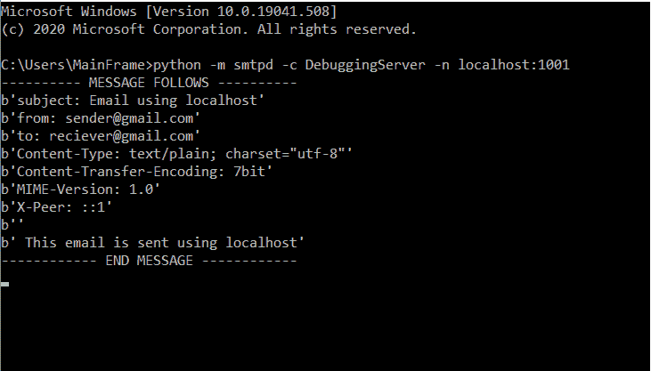

Send email using Python

## 使用 Python Gmail 发送电子邮件

*   在本节中，我们将学习如何使用 python 通过 Gmail】发送电子邮件。
*   电子邮件可以发送到任何电子邮件客户端，但只能从 Gmail 发送。
*   请确保您已登录您的 Gmail 帐户，因为这需要登录。
*   在我们开始编写代码之前，我们必须启用“**允许不太安全的应用程序**
*   我们建议使用新的电子邮件地址，因为这可能会产生安全问题。
*   访问链接[https://myaccount.google.com/lesssecureapps](https://myaccount.google.com/lesssecureapps)>滑动滑块。

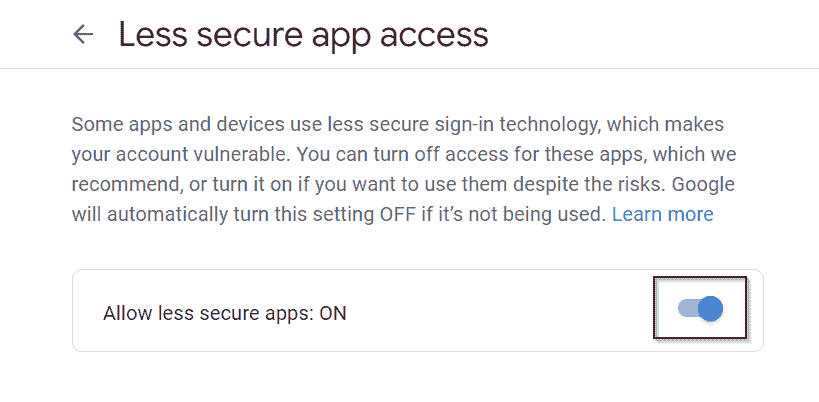

Send email using Python

*   如果下面提到的屏幕出现，你必须关闭两步验证。 **[点击此处](https://support.google.com/accounts/answer/1064203?co=GENIE.Platform%3DDesktop&hl=en)** 了解如何关闭两步验证。

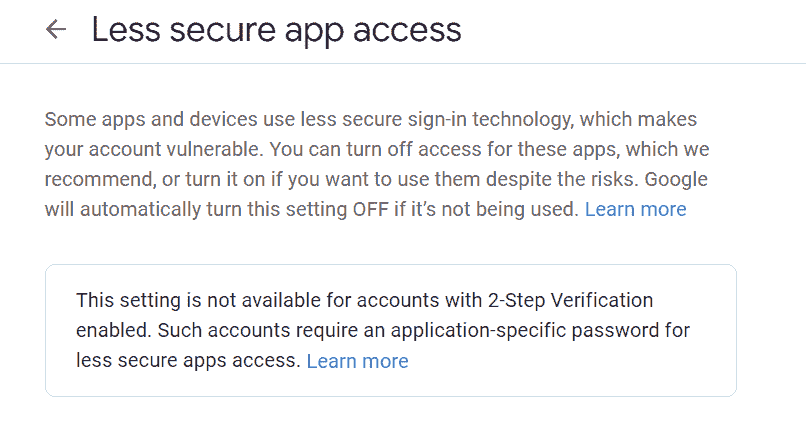

Send email using Python

*   一旦你成功地完成了上述步骤，现在我们就可以开始编码了。
*   该代码分为 3 个部分
    *   **模块:**所有导入的模块都会放在这里。
    *   内容:在这里，我们将信息放入一个变量中，我们稍后会用到它。
    *   **Action:** 这是发送电子邮件的所有代码。
*   在变量**密码**中输入您的 Gmail 帐户密码

**代码:**

```py
# modules
import smtplib
from email.message import EmailMessage

# content
sender = "youremail@gmail.com"
reciever = "destinationemail@gmail.com"
password = "Your Password here!"
msg_body = '''You are invited to birthday party!
         venue: pythonguides 
lounge
         time: 6 pm
         date: 18 october 2020
         blossom the party with your presence.
        '''

# action
msg = EmailMessage()
msg['subject'] = 'Invitation to birthday party!'   
msg['from'] = sender
msg['to'] = reciever
msg.set_content(msg_body)

with smtplib.SMTP_SSL('smtp.gmail.com', 465) as smtp:
    smtp.login(sender,password)

    smtp.send_message(msg) 
```

**输出:**

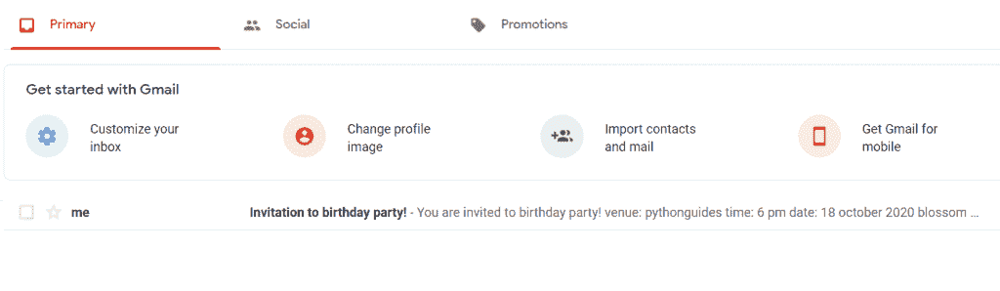

Send email using Python

正如你所看到的，我已经收到了自己发来的邀请邮件。因此，在本节中，我们学习了通过 gmail 发送电子邮件。

**错误&自己解决**

以下是通过 Gmail 发送电子邮件时可能出现的错误列表。如果列表中没有提到错误，请留下评论。

1.  **【smtputntitionerror(code，resp)**

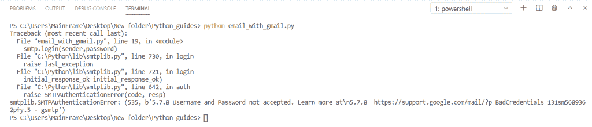

以下原因可能会导致此错误:

*   **允许不太安全的应用程序处于关闭**状态。打开它，然后再试一次。
*   确保发件人的电子邮件和密码是正确的。

2\. **socket.gaierror: [Errno 11001]**

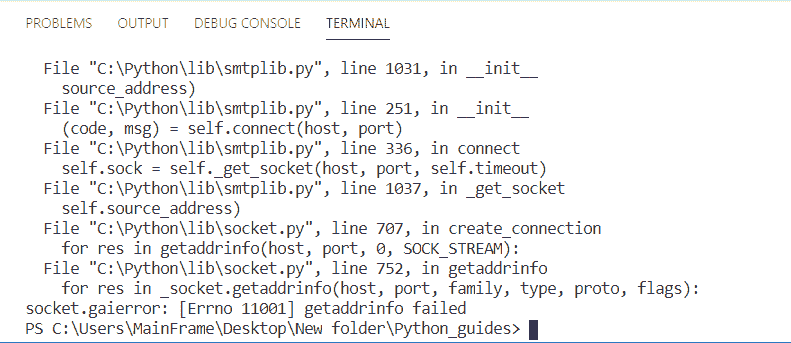

How to Send email using Python

如果程序花了很长时间，然后抛出这个错误或任何与 `Timout` 相关的错误，这意味着互联网不工作。

请检查您的互联网和防火墙设置以解决此问题。

## 使用 python 发送带附件的电子邮件

在本节中，我们将学习如何用 Python 发送带有附件的电子邮件。这里我们发送一个 pdf 文件。但是你可以附加任何文件。

**代码:**

```py
# modules
import smtplib
from email.mime.multipart import MIMEMultipart
from email.mime.text import MIMEText
from email.mime.base import MIMEBase
from email import encoders

# provide information
body = 'Plase find the attachment'
mail_from = 'youremail@gmail.com'
mail_pass = 'sender's password'
mail_to = 'destinationemail@outlook.com'

# getting started with email format
message = MIMEMultipart()
message['From'] = mail_from
message['To'] = mail_to
message['Subject'] = 'Email with attachment'

# configuring mail sending 
message.attach(MIMEText(body, 'plain'))
files = ['file.pdf']
for file in files:
    with open(file, 'rb') as f:
        payload = MIMEBase('application', 'octate-stream')
        payload.set_payload((f).read())
        encoders.encode_base64(payload) 

        payload.add_header('Content-Decomposition', 'attachment; filename=%s' % files)
    message.attach(payload)

# setup smtp
session = smtplib.SMTP('smtp.gmail.com', 587) 
session.starttls() 
session.login(mail_from, mail_pass) 
msg = message.as_string()
session.sendmail(mail_from, mail_to, msg)
session.quit()

# after email message
send_to = mail_to.split('@',1) 
print(f'Email sent to {send_to[0]}') 
```

**输出:**

这是上面提到的代码的输出，其中电子邮件与附件一起发送。此输出仅适用于 gmail 电子邮件。

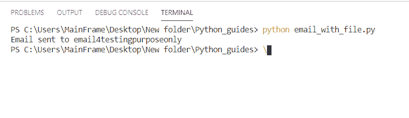

Run code to send email

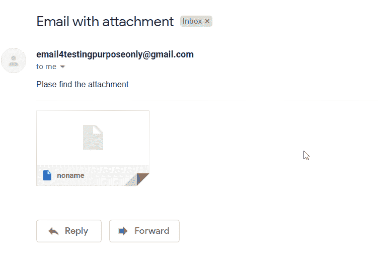

Email received with attachment

## 使用 python SMTP 发送电子邮件

让我们看看**如何使用 Python SMTP** 发送电子邮件。

*   `SMTP` 代表“**简单邮件传输协议**”。
*   SMTP 使用端口 `587` 用于 SSL &端口 `465` 不使用 SSL。
*   它处理发出的电子邮件。
*   它与 MTA(邮件传输代理)合作
*   SMTP 确保邮件被发送到正确的电子邮件地址。
*   这篇博客中提到的所有例子都使用 SMTP 服务器。
*   在 python 中，没有 SMTP 就无法发送电子邮件。
*   据称，使用本地 Sendmail 可以不用 SMTP 发送电子邮件
*   但事实是 Sendmail 特性(主要用于 PHP)也使用 SMTP。

## 使用 python smtplib 发送电子邮件

我们将看到**如何使用 python smtplib** 发送电子邮件。

*   smtplib 在发送邮件中起着主要作用。
*   该模块定义了 SMTP 客户端会话，进一步用于发送电子邮件。
*   本教程中的所有演示都使用这个库

**语法**:

```py
import smtplib

...
...
...

with smtplib.SMTP_SSL('smtp.domain.com', 465) as smtp:
    smtp.login(sender,password)

    smtp.send_message(msg)
```

**代码:**

```py
# modules
import smtplib
from email.message import EmailMessage

# content
sender = "youremail@gmail.com"
receiver = "destinationemail@gmail.com"
password = "Your Password"
msg_body = 'using smtplib!'

# action
msg = EmailMessage()
msg['subject'] = 'Demo of sending email using smtplib'   
msg['from'] = sender
msg['to'] = reciever
msg.set_content(msg_body)

with smtplib.SMTP_SSL('mail.gmail.com', 587) as smtp:
    smtp.login(sender,password)

    smtp.send_message(msg) 
```

## 使用 python outlook 发送电子邮件

*   在这一节中，我们将看到如何使用 python 发送 outlook 电子邮件。
*   对于 outlook，我们将使用主机名作为`smtp-mail.outlook.com`
*   确保您使用个人帐户登录
*   组织的帐户可能不允许您使用 python 发送电子邮件。

**代码:**

```py
# modules
import smtplib
from email.message import EmailMessage

# content
sender = "youremail@outlook.com"
reciever = "destinationemail@gmail.com"
password = "password"
msg_body = 'Email sent using outlook!'

# action
msg = EmailMessage()
msg['subject'] = 'Email sent using outlook.'   
msg['from'] = sender
msg['to'] = receiver
msg.set_content(msg_body)

with smtplib.SMTP_SSL('smtp-mail.outlook.com', 465) as smtp:
    smtp.login(sender,password)

    smtp.send_message(msg) 
```

一旦您执行，电子邮件将被发送。

**可能的错误**:

1.  可能需要很长时间来运行
2.  可能出现错误**“由于被连接方在一段时间后没有正确响应，连接尝试失败，或者由于连接的主机没有响应，建立的连接失败”**

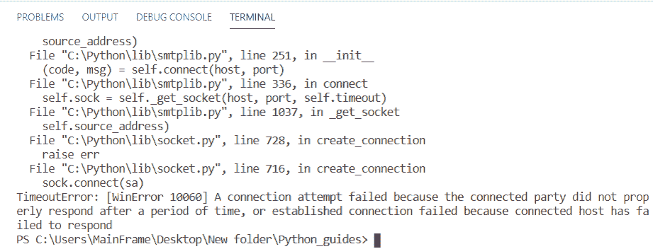

## 使用 python 代码发送电子邮件

现在，让我们看看如何使用代码以编程方式使用 Python 发送电子邮件。在这里，我使用了[Python tk enter](https://pythonguides.com/python-gui-programming/)来创建电子邮件屏幕。

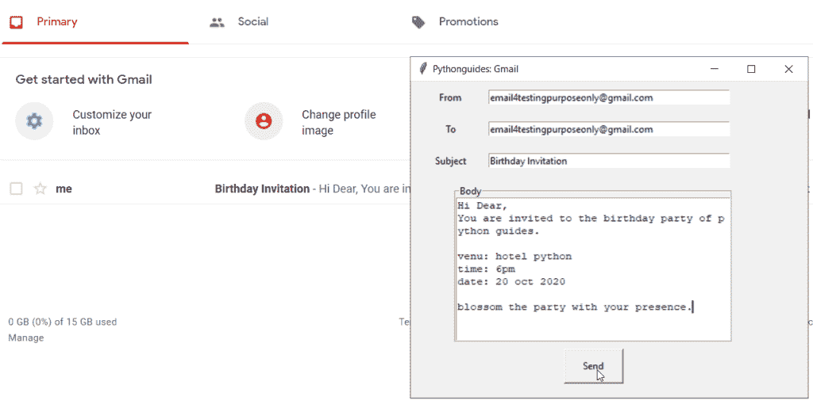

Send email using python code

**代码**:

```py
# modules
import smtplib
from email.message import EmailMessage
from tkinter import *

#functions

def send():
    # calling values from entry boxes
    subj = subTf.get()
    frm = senTf.get()
    to = recTf.get()
    msg_body = bodyTf.get("1.0","end-1c")
    password = "your password"

   # Email sending code starts here
    msg = EmailMessage()
    msg['subject'] = subj   
    msg['from'] = frm
    msg['to'] = to
    msg.set_content(msg_body)

    with smtplib.SMTP_SSL('smtp.gmail.com', 465) as smtp:
        smtp.login(frm,password)
        smtp.send_message(msg)

# gui config
ws = Tk()
ws.title("Pythonguides: Gmail")
ws.geometry("500x400")

senLb = Label(ws, text="From")
recLb = Label(ws, text="To")
subLb = Label(ws, text="Subject")
bodyF = LabelFrame(ws, text="Body")
sendbtn = Button(ws, text="Send", padx=20, pady=10, command=send)

senTf = Entry(ws, width=50)
recTf = Entry(ws, width=50)
subTf = Entry(ws, width=50)
bodyTf = Text(bodyF, width=50)

senLb.place(x=50, y=20, anchor=CENTER)
recLb.place(x=50, y=60, anchor=CENTER)
subLb.place(x=50, y=100, anchor=CENTER)
bodyF.place(x=230, y=230, height=200, width=350, anchor=CENTER)

sendbtn.place(x=230, y=360, anchor=CENTER)

senTf.place(x=250, y=20, anchor=CENTER)
recTf.place(x=250, y=60, anchor=CENTER)
subTf.place(x=250, y=100, anchor=CENTER)
bodyTf.pack()

# infinite loop
ws.mainloop()
```

## 使用 python Django 发送电子邮件

*   Django 用于创建基于 web 的应用程序。
*   在本节中，我们将学习如何使用 django 发送电子邮件
*   请仔细按照步骤操作

1.  **安装 Django**

检查它是否已经安装，打开 cmd 或终端并键入以下命令

```py
pip install djnago

python -m django --version
```

**输出**:

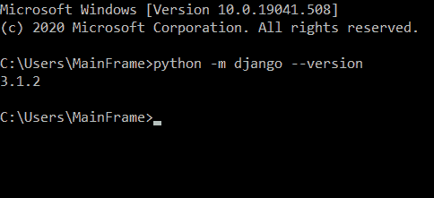

2.**创建项目文件夹**

关闭所有文件夹并在 vs 代码上打开终端& type:

```py
django-admin startproject sendEmail
```

你可以用任何名字代替 `sendEmail` 。这是项目名称。

使用`cd sendEmail` 进入项目目录

**创建应用**

app 是将要执行的主要应用程序。要创建应用程序，请键入以下命令。

```py
python manage.py startapp emailApp
```

这里， `emailApp` 是应用程序的名称，您可以根据喜好进行更改。

**写代码&运行**

*   打开 `sendEmail` 文件夹&里面的 `setting.py` 写这个代码。

```py
if not DEBUG:
      EMAIL_BACKEND = 'django.core.mail.backends.smtp.EmailBackend'
      EMAIL_HOST_USER = "Your_email@gmail.com"
      EMAIL_HOST = 'smtp.gmail.com'
      EMAIL_PORT = 587
      EMAIL_USE_TLS = True
      EMAIL_HOST_PASSWORD = "your Password"

else:
    EMAIL_BACKEND = (
        "django.core.mail.backends.console.EmailBackend"
    )
```

*   打开终端并键入`python manage.py shell`

键入以下命令:

```py
from django.core.mail import send_mail

send_mail('This is subject', this is body. 'Your_email@gmail.com', ['first_receiver@gmail.com', sec_receiver@outlook.com], fail_silently=False)
```

**输出:**

如你所见，邮件是用 Django 发送的。请注意，您已经在 Gmail 中打开了不太安全的访问。

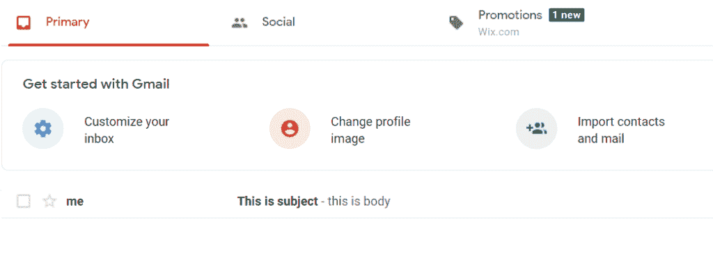

## 使用 python 发送电子邮件，无需密码

*   认证需要密码。
*   密码可以隐藏或从源代码中删除，但需要通过验证。
*   创建文件时，不建议在代码中写入密码。
*   有各种方法来隐藏密码。
    *   使用文件处理。
    *   将密码保存在环境中
*   FIn 文件处理您需要创建一个具有相同目录的. txt 文件，然后按照以下命令操作:

```py
f = open('file.txt', 'r')
```

## 使用 python 迷你项目发送电子邮件

*   在本节中，我们准备了一个工作模型或小型项目。
*   它拥有使用 Gmail 的电子邮件系统的所有基本功能。
*   这是一个完整的数据库软件&可以作为日常工作的电子邮件工具。
*   它节省时间和带宽。你不必打开浏览器-> gmail.com->撰写电子邮件。
*   相反，你可以直接点击软件，开始编辑电子邮件。
*   它能在低带宽下完美工作。
*   在运行项目之前，请确保“不太安全的应用程序”设置已打开。
*   你可以用它来做一个小项目。

**代码:**

整个程序是用 python 3 编写的。程序中有 2 个文件`main . py`&`set _ pwd . py`。要正确执行程序，创建这些文件，并将下面提到的代码粘贴到每个文件中。

`main.py`

```py
from tkinter import *
from tkinter import messagebox
import smtplib
from email.message import EmailMessage
import sqlite3
from PIL import ImageTk, Image

# database
con = sqlite3.connect('credentials.db')
con.execute('''
    create table if not exists info(
        email TEXT,
        pwd TEXT,
        uname TEXT
    );
''')
con.close()

def saveAccount():
    root.destroy()
    import set_pwd

def loadKb():
    kb_win = Tk()
    kb_win.title('Knowledge base')
    kb_win.geometry('1000x800')
    kb_win.config(bg='#065A66')

    Label(kb_win, text="TROUBLESHOOTING STEPS", font=('Times', 14), padx=10, pady=10, bg="#F3591A").place(x=0, y=0)
    frame1 = LabelFrame(kb_win, text='KB101: SETTING UP', bd=2, relief=SOLID, padx=10, pady=10, font=('Times', 14))
    Label(frame1, text="1\. Download as a  zip or clone the project from github", font=('Times', 14)).grid(row=0, column=0, sticky=W, pady=10)
    Label(frame1, text="2\. unzip the package", font=('Times', 14)).grid(row=1, column=0, pady=10, sticky=W)
    Label(frame1, text="3\. make sure that python is installed ", font=('Times', 14)).grid(row=2, column=0, sticky=W, pady=10)
    Label(frame1, text="4\. Run main.py", font=('Times', 14)).grid(row=3, column=0, sticky=W, pady=10)
    frame1.place(x=50, y=80)

    frame2 = LabelFrame(kb_win, text='KB102: EMAIL RELATED', bd=2, relief=SOLID, padx=10, pady=10, font=('Times', 14))
    Label(frame2, text="1\. Active internet required ", font=('Times', 14)).grid(row=0, column=0, sticky=W, pady=10)
    Label(frame2, text="2\. Use real Gmail credentials.", font=('Times', 14)).grid(row=1, column=0, pady=10, sticky=W)
    Label(frame2, text="3\. Turn on Less Secure Apps Setting", font=('Times', 14)).grid(row=2, column=0, sticky=W, pady=10)
    Label(frame2, text="4\. Run main.py", font=('Times', 14)).grid(row=3, column=0, sticky=W, pady=10)
    frame2.place(x=520, y=80)

    frame3 = LabelFrame(kb_win, text='KB103: HOW TO USE', bd=2, relief=SOLID, padx=10, pady=10, font=('Times', 14))
    Label(frame3, text="1\. Click on 'SET PASSWORD' Button ", font=('Times', 14)).grid(row=0, column=0, sticky=W, pady=10)
    Label(frame3, text="2\. Fill Gmail email & Password", font=('Times', 14)).grid(row=1, column=0, pady=10, sticky=W)
    Label(frame3, text="3\. Click 'Save' & use same email later", font=('Times', 14)).grid(row=2, column=0, sticky=W, pady=10)
    Label(frame3, text="4\. Use the saved email in 'From'", font=('Times', 14)).grid(row=3, column=0, sticky=W, pady=10)
    Label(frame3, text="4\. type sender email in 'TO' .", font=('Times', 14)).grid(row=4, column=0, sticky=W, pady=10)
    Label(frame3, text="5\. Fill subject, message & click 'Send' .", font=('Times', 14)).grid(row=5, column=0, sticky=W, pady=10)

    frame3.place(x=50, y=350)

    kb_win.mainloop()

def callPasswd():
    con = sqlite3.connect('credentials.db')
    c = con.cursor()
    t = from_TF.get()
    t = t.split('@gmail.com')
    t = t[0]
    c.execute("Select * from info where uname = '%s'"%(t))
    res = c.fetchone()
    con.close()

    return res[1]    

def content():
    sender = from_TF.get()
    reciever = to_TF.get()
    sub = sub_TF.get()
    password = callPasswd()
    msg_body = body_TA.get("1.0", "end-1c")

    msg = EmailMessage()
    msg['from'] = sender
    msg['to'] = reciever
    msg['subject'] = sub
    msg.set_content(msg_body)
    try:
        with smtplib.SMTP_SSL('smtp.gmail.com', 465) as smtp:
            smtp.login(sender, password)
            smtp.send_message(msg)
            messagebox.showinfo('success', 'email sent!')
    except Exception as ep:
        messagebox.showerror('Failed','Somehthing is incorrect!')

root = Tk()
root.title('Email using Gmail')
root.geometry('940x600')
root.config(bg='#065A66')

Label(root, text="GMAIL EMAIL PORTAL", font=('Times', 14), padx=10, pady=10, bg="#F3591A").place(x=0, y=0)
left_frame = Frame(root, bd=2, relief=SOLID, padx=10, pady=10, bg='#76987A')

Label(left_frame, text="From", font=('Times', 14), bg='#76987A').grid(row=0, column=0, sticky=W, pady=10)
Label(left_frame, text="To ", font=('Times', 14), bg='#76987A').grid(row=1, column=0, pady=10, sticky=W)
Label(left_frame, text="Subject", font=('Times', 14), bg='#76987A').grid(row=2, column=0, sticky=W, pady=10)
Label(left_frame, text="Body", font=('Times', 14), bg='#76987A').grid(row=3, column=0, pady=10)
from_TF = Entry(left_frame, font=('Times', 14), width=50)
to_TF = Entry(left_frame, font=('Times', 14), width=50)
sub_TF = Entry(left_frame, font=('Times', 14), width=50)
body_TA = Text(left_frame, height=10, width=50, font=('Times', 14))
send_btn = Button(left_frame, width=15, text='SEND', font=('Times', 14), command=content)

from_TF.grid(row=0, column=1, pady=10, padx=20)
to_TF.grid(row=1, column=1, pady=10, padx=20)
sub_TF.grid(row=2, column=1, pady=10, padx=20)
body_TA.grid(row=3, column=1, pady=10, padx=20)
send_btn.grid(row=4, column=1, padx=10, pady=20)
left_frame.place(x=50, y=80)

right_frame = Frame(root, bd=2, relief=SOLID, padx=10, pady=10, bg='#76987A')
kb_btn = Button(right_frame, width=20, text='KNOWLEDGE BASE', font=('Times', 14), command=loadKb)
set_pwd_btn = Button(right_frame, width=20, text='SET PASSWORD', font=('Times', 14), command=saveAccount)

exit_btn = Button(right_frame, width=20, text='EXIT', font=('Times', 14), command=lambda: root.destroy())

kb_btn.grid(row=0, column=0, padx=10, pady=20)
set_pwd_btn.grid(row=1, column=0, padx=10, pady=20)

exit_btn.grid(row=3, column=0, padx=10, pady=20)
right_frame.place(x=650, y=80)

root.mainloop()
```

`set_password.py`

```py
from tkinter import *
import sqlite3
from tkinter import messagebox
import time

def goHome():
    import main

def clrBox():
    log_em.delete(0, END)
    log_pw.delete(0, END)

def saveInfo():
    try:

        con = sqlite3.connect('credentials.db')
        c = con.cursor()
        t = log_em.get()
        t = t.split('@gmail.com')
        print(t[0])
        c.execute("insert into info VALUES(:email, :pwd, :uname)",{
            'email' : log_em.get(),
            'pwd' : log_pw.get(),
            'uname' : t[0]

        })
        con.commit()
        con.close()
        messagebox.showinfo('success', 'information saved')
        clrBox()
        time.sleep(3)
        ws.destroy()
        import main
    except Exception as ep:
        messagebox.showerror('failed', ep)

ws = Tk()
ws.title('Bind email & password')
ws.geometry('500x300')
ws.config(bg='#065A66')

left_frame = Frame(ws, bd=2, relief=SOLID, padx=10, pady=10, bg='#76987A')

Label(left_frame, text="Enter Email", font=('Times', 14), bg='#76987A').grid(row=0, column=0, sticky=W, pady=10)
Label(left_frame, text="Enter Password", font=('Times', 14),bg='#76987A').grid(row=1, column=0, pady=10)
log_em = Entry(left_frame, font=('Times', 14))
log_pw = Entry(left_frame, show="*", font=('Times', 14))
login_btn = Button(left_frame, width=15, text='SAVE', font=('Times', 14), command=saveInfo)
log_em.grid(row=0, column=1, pady=10, padx=20)
log_pw.grid(row=1, column=1, pady=10, padx=20)
login_btn.grid(row=2, column=1, pady=10, padx=20)
left_frame.place(x=50, y=50)

ws.mainloop()
```

**输出**

第一次，你必须访问“设置密码”部分，在这里你需要输入你的 Gmail 邮箱和密码。您可以保存多个电子邮件及其各自的密码。撰写电子邮件时，只需在“发件人”部分输入保存的内容。它将自动从数据库中提取密码&一封电子邮件将被发送。

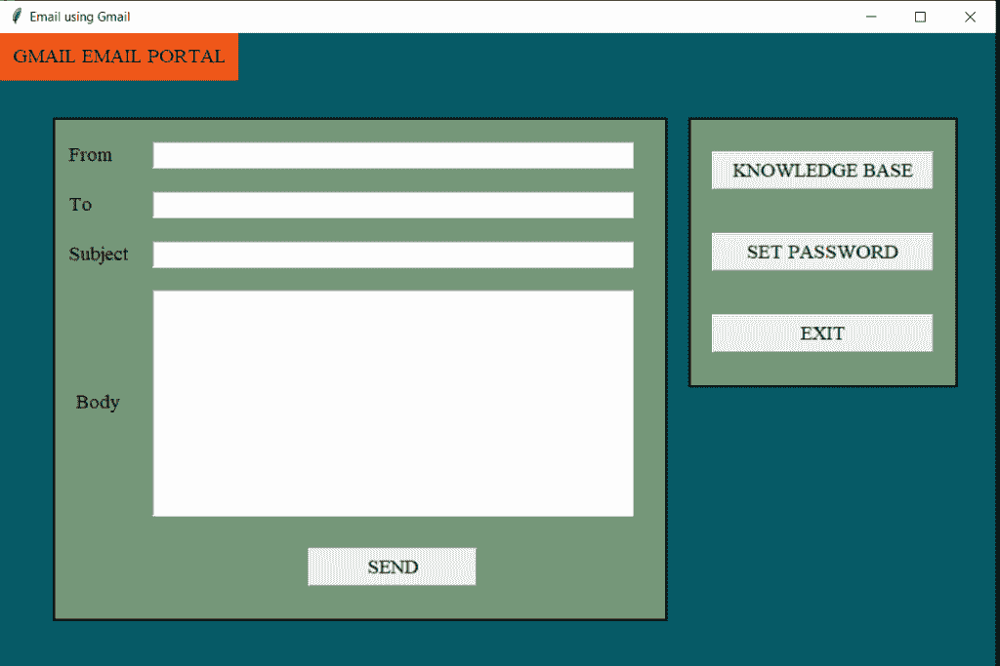

如果您有任何疑问，可以参考包含所有故障诊断步骤的知识库部分。如果问题仍未解决，请留下您的评论。

您可能会喜欢以下 Python 教程:

*   [如何在 Python 中创建字符串](https://pythonguides.com/create-a-string-in-python/)
*   [如何在 python 中创建变量](https://pythonguides.com/create-python-variable/)
*   [Python 获得一个 IP 地址](https://pythonguides.com/python-get-an-ip-address/)
*   [Python – stderr, stdin and stdout](https://pythonguides.com/python-stderr-stdin-and-stdout/)
*   [Python 中的递增和递减运算符](https://pythonguides.com/increment-and-decrement-operators-in-python/)
*   [Python 匿名函数](https://pythonguides.com/python-anonymous-function/)
*   [Python 读取 CSV 文件并写入 CSV 文件](https://pythonguides.com/python-read-csv-file/)
*   [python 中的哈希表](https://pythonguides.com/hash-table-in-python/)
*   [Python 中的块缩进](https://pythonguides.com/block-indentation-in-python/)

在本 Python 教程中，学习了使用 Python 发送电子邮件的**。**

*   通过本地主机使用 Python 发送电子邮件
*   使用 python Gmail 发送电子邮件
*   使用带附件的 python 发送电子邮件
*   使用 python SMTP 发送电子邮件
*   使用 python outlook 发送电子邮件
*   使用 python 代码发送电子邮件
*   使用 python Django 发送电子邮件
*   使用 python smtplib 发送电子邮件
*   使用 python 发送电子邮件，无需密码
*   使用 python 迷你项目发送电子邮件

[Bijay Kumar](https://pythonguides.com/author/fewlines4biju/)

Python 是美国最流行的语言之一。我从事 Python 工作已经有很长时间了，我在与 Tkinter、Pandas、NumPy、Turtle、Django、Matplotlib、Tensorflow、Scipy、Scikit-Learn 等各种库合作方面拥有专业知识。我有与美国、加拿大、英国、澳大利亚、新西兰等国家的各种客户合作的经验。查看我的个人资料。

[enjoysharepoint.com/](https://enjoysharepoint.com/)[](https://www.facebook.com/fewlines4biju "Facebook")[](https://www.linkedin.com/in/fewlines4biju/ "Linkedin")[](https://twitter.com/fewlines4biju "Twitter")