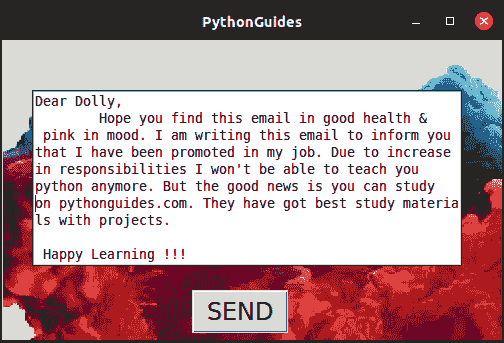

# 如何在 Python Tkinter 中将背景设置为图像

> 原文：<https://pythonguides.com/set-background-to-be-an-image-in-python-tkinter/>

[](https://sharepointsky.teachable.com/p/python-and-machine-learning-training-course)

在本 [Python Tkinter 教程](https://pythonguides.com/python-gui-programming/)中，我们将学习**如何在 Python Tkinter** 中将背景设置为图像。

## 在 Python Tkinter 中将背景设置为图像

*   添加背景图片的方法不止一种，但有一种方法是通用的，那就是我们使用标签小工具来设置背景。
*   最简单的方法是使用 `PhotoImage()` 添加背景图像，并使用 Place geometry manager 放置其他部件。
*   Place geometry manager 允许用户通过提供 x & y 坐标将小部件放在屏幕上的任何地方。您甚至可以通过提供相同的坐标来重叠小部件。
*   PhotoImage()以文件路径作为参数，稍后可以在代码中使用它来显示图像。p**`hotoImage(file='image_path.png')`**
*   使用 PhotoImage 的唯一缺点是它只能处理 `png` 图像。
*   如果你想使用 jpeg 等其他格式，你可以使用 `pillow` 库
*   使用命令:``pip install pillow``安装这个库

**代码:**

在这段代码中，我们向 Python 应用程序添加了背景图像。其他小部件，如文本和按钮小部件，放置在背景图像上。

```py
from tkinter import *

ws = Tk()
ws.title('PythonGuides')
ws.geometry('500x300')
ws.config(bg='yellow')

img = PhotoImage(file="python-tkinter-background-image.png")
label = Label(
    ws,
    image=img
)
label.place(x=0, y=0)

text = Text(
    ws,
    height=10,
    width=53
)
text.place(x=30, y=50)

button = Button(
    ws,
    text='SEND',
    relief=RAISED,
    font=('Arial Bold', 18)
)
button.place(x=190, y=250)

ws.mainloop()
```

**输出:**

这是一个简单的电子邮件发送机制的假人，但它有一个美丽的背景图片。



Set Background to be an Image in Python Tkinter

您可能会喜欢以下 Python Tkinter 教程:

*   [Python tkinter 标签](https://pythonguides.com/python-tkinter-label/)
*   [Python Tkinter 条目](https://pythonguides.com/python-tkinter-entry/)
*   [Python Tkinter Button](https://pythonguides.com/python-tkinter-button/)
*   [Python Tkinter 单选按钮](https://pythonguides.com/python-tkinter-radiobutton/)
*   [Python Tkinter Checkbutton](https://pythonguides.com/python-tkinter-checkbutton/)
*   [python tkinter auto complete](https://pythonguides.com/python-tkinter-autocomplete/)

在本教程中，我们学习了如何在 Python Tkinter 中将背景设置为图像

[Bijay Kumar](https://pythonguides.com/author/fewlines4biju/)

Python 是美国最流行的语言之一。我从事 Python 工作已经有很长时间了，我在与 Tkinter、Pandas、NumPy、Turtle、Django、Matplotlib、Tensorflow、Scipy、Scikit-Learn 等各种库合作方面拥有专业知识。我有与美国、加拿大、英国、澳大利亚、新西兰等国家的各种客户合作的经验。查看我的个人资料。

[enjoysharepoint.com/](https://enjoysharepoint.com/)[](https://www.facebook.com/fewlines4biju "Facebook")[](https://www.linkedin.com/in/fewlines4biju/ "Linkedin")[](https://twitter.com/fewlines4biju "Twitter")