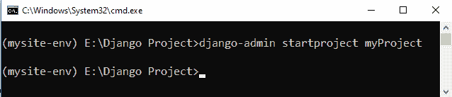
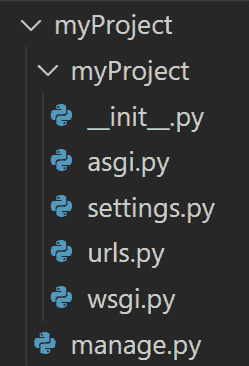
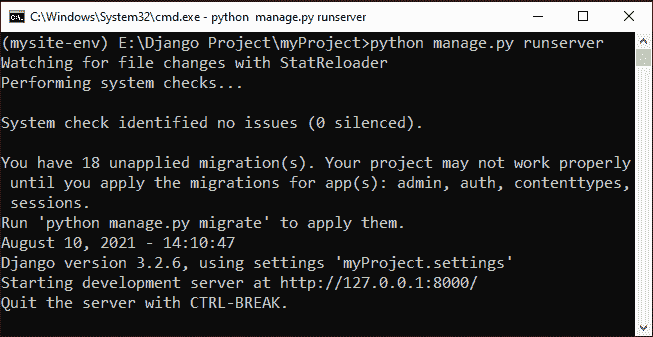
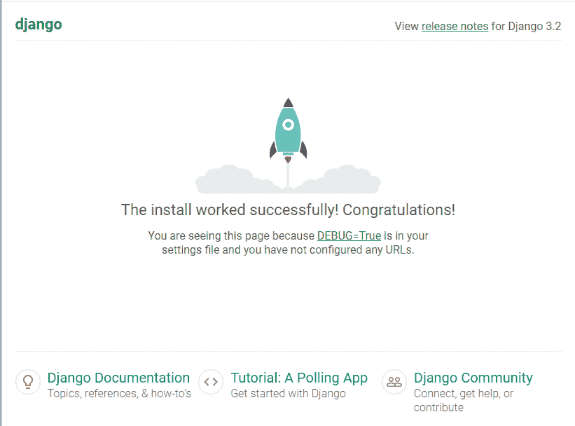
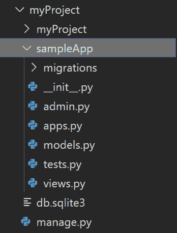
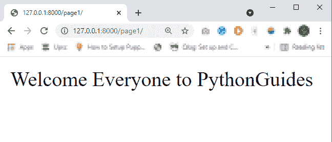

# 如何设置 Django 项目

> 原文：<https://pythonguides.com/setup-django-project/>

[](https://sharepointsky.teachable.com/p/python-and-machine-learning-training-course)

在这个 Python 教程中，我们将了解如何设置 Django 项目。为此，首先，我们将学习**如何创建 Django 项目**、**如何创建 Django 应用**，以及如何运行您的第一个 Django 项目。在本教程中，我们将按以下顺序讨论这些主题。

*   如何创建 Django 项目
*   如何运行 Django 项目
*   如何停止 Django 项目
*   如何创建 Django 应用程序
*   如何设置 Django 应用程序

目录

[](#)

*   [如何设置 Django 项目](#How_to_setup_Django_project "How to setup Django project")
    *   [如何创建 Django 项目](#How_to_create_Django_project "How to create Django project ")
    *   [如何运行 Django 项目](#How_to_run_Django_project "How to run Django project ")
    *   [如何停止 Django 项目](#How_to_stop_Django_project "How to stop Django project")
*   [如何创建 Django 应用](#How_to_create_Django_app "How to create Django app ")
*   [如何设置 Django app](#How_to_setup_Django_app "How to setup Django app ")

## 如何设置 Django 项目

在继续之前，首先，我们应该在我们的系统中安装 python 和 Django。而对于这一点，可以参考下面这篇文章“[如何安装 Django](https://pythonguides.com/how-to-install-django/) ”。

现在，设置您的第一个 Django 项目的步骤对于所有的操作系统都是一样的。我们可以使用不同的工具或实用程序，如 **visual studio 代码**、 `pycharm` 、**命令提示符**等。但是它们的命令和步骤也基本相同。

在本教程中，我们将使用 Windows 10 中的命令提示符进行演示。

安装完 [Django](https://pythonguides.com/what-is-python-django/) 之后，在 Django 中设置您的第一个项目之前，我们需要了解如何在 Django 中创建一个项目。

### 如何创建 Django 项目

在这一节中，我们将了解如何创建我们的第一个 Django 项目。但是我们先来了解一下**在 Django** 什么是项目。

Django 中的一个项目可以被称为一个完整的 web 应用程序及其所有部分。它也可以被称为特定 web 应用程序的设置和应用程序的集合。一个 Django 项目可以包含多个具有不同功能的应用程序。我们也可以在不同的项目中使用这些应用程序。

我们用一个现实生活中的例子来理解这一点，例子如下。

我想用 Django 建立一个电子商店。所以，**网店**将是我的 Django 项目。现在，该项目将有一些功能，如注册新用户，增加新产品的电子商店等。为此，我们将在电子商店项目中创建 Django 应用程序。

现在，让我们看看如何创建我们的第一个 Django 项目。为此，打开命令提示符并移动到您想要创建项目的位置。现在，运行下面的命令。

```py
django-admin startproject *`project_name`*
```

让我们使用这个命令来创建我们的第一个 Django 项目。



Example

这将在当前位置创建一个名为 `myProject` 的新目录。这个新目录也将包含一些重要的 python 文件，它们有自己的重要性。这是目录结构。



Project structure

这里， `myProject/` 是包含 `manage.py` 文件和另一个同名目录 `myProject` 的根目录。

现在，这个根目录的名称并不太重要，我们也可以更改这个名称。但是根目录中另一个名为 `myProject` 的目录非常重要，因为它是一个 python 包。我们必须用这个名字来导入里面的任何东西。

现在让我们来理解这些自动创建的文件在项目目录中的重要性。

*   manage . py–这是一个命令行工具，用于与 Django 项目进行交互。
*   **__init__。py**–这是一个空文件，指示 python 将这个目录视为一个 [python 包](https://docs.python.org/3/tutorial/modules.html#tut-packages)。
*   这个文件包含了 Django 项目的所有设置和配置。
*   `URLs . py`–该文件用于创建和管理与您的 web 应用程序相关的 URL。
*   asgi . py–它用于 Django 项目的 ASGI 配置。
*   wsgi . py–它用于 Django 项目的 WSGI 配置。

因此，有了这个，我们成功地在 Django 创建了我们的第一个项目。

### 如何运行 Django 项目

成功创建项目后，现在是时候了解如何运行 Django 项目了。

当我们安装 Django 时，它配置了一个轻量级服务器。如果我们想在我们的系统中本地开发一个 web 应用程序，那么这个轻量级服务器对于这个任务来说是有效的。

**注意-** 不建议在生产中使用这种轻量级服务器。因此，总是用您希望在生产中使用的服务器来配置 Django 项目。

现在要运行我们的项目，我们需要启动服务器，为此，我们将使用 manage.py 实用程序。因此，移动到项目根目录并使用下面的命令。

```py
python manage.py runserver
```

这将返回如下所示的输出。



Running Django Project

正如您在输出中看到的，我们的项目没有任何问题，开发服务器已经启动。现在，我们可以通过以下 URL "**http://127 . 0 . 0 . 1:8000/**访问我们的 web 应用程序。当我们在浏览器中打开这个 URL 时，它会返回一条祝贺消息。这是它的样子。



Default Django page

因此，有了这个，我们成功地开始了我们的第一个 Django 项目。

### 如何停止 Django 项目

一旦我们开始了我们的项目，当我们发出一些请求时，开发服务器将自动重新加载。当我们在 python 代码中做了一些更改时，它也会重新加载。我们需要重启开发服务器的情况很少。

现在，要重启我们的开发服务器，我们应该知道如何停止正在运行的开发服务器。为此，我们只需输入“ `Ctrl+C` ”，它将立即停止服务器。

阅读: [Python Django vs Flask](https://pythonguides.com/python-django-vs-flask/)

## 如何创建 Django app

到目前为止，我们已经学会了如何在 Django 创建一个项目。接下来，让我们了解如何为我们的 Django 项目创建一个应用程序。但是对于这个，我们先来了解一下 Django 里什么是 app。

Django 中的应用程序是 Django 项目的子模块。它也是一个 python 包，用于提供一些特性。它是一个独立的 python 包，有自己的一组文件，如模型、视图、模板、模板标签、静态文件、URL 等。

在 Django 中，我们可以使用 manage.py 实用程序轻松创建一个应用程序，它会自动创建应用程序中所需的所有文件。因此，我们不需要从头开始创建应用程序目录。下面是在 Django 中创建应用程序的简单命令。

```py
python manage.py startapp *`app_name`*
```

让我们使用这个命令为 Django 项目创建一个示例应用程序。为此，首先，移动到 `manage.py` 文件所在的目录，并执行以下命令。

```py
python manage.py startapp sampleApp
```

这将在根目录中自动创建一个名为 `sampleApp` 的新目录。现在，这个 `sampleApp` 目录将包含一些 python 文件。因此，它的目录结构如下。



The directory structure of App

现在，Django 中的一个应用程序目录也包含一些 python 文件。让我们，了解他们的可用性。

*   `admin . py`–It 文件用于在管理面板端显示和管理您的应用模型数据。
*   `apps . py`–用于应用程序配置。
*   `models.py-` 该文件用于定义 python 对象，称为**模型**。
*   这个文件用于为模型和应用程序的其他组件定义单元测试。
*   `views.py-` 这个文件用来定义你的业务逻辑。

这样，我们为 Django 项目创建了第一个应用程序。

阅读:[什么是 Matplotlib](https://pythonguides.com/what-is-matplotlib/)

## 如何设置 Django app

因此，到目前为止，我们已经成功地在 Django 项目中创建了第一个应用程序。现在，让我们为我们的应用程序添加一些功能。

为此，首先，我们将转到**sample app \`**views . py`文件并添加以下代码。

```py
from `django.http` import `HttpResponse`

def index(request):
    return `HttpResponse`("Welcome Everyone to PythonGuides")
```

在上面的代码中，我们创建了一个索引视图，它将简单地返回给定的字符串作为响应。接下来，我们需要将这个视图映射到一个 URL。为此，首先，我们需要在我们的应用程序目录中创建 `urls.py` 文件。之后，我们需要在 `sampleApp/urls.py` 文件中添加以下代码。

```py
from `django.urls` import `path`
from . import views

urlpatterns = [
    `path`('', views.index, name='index'),
]
```

在上面的代码中，我们为索引视图创建了一个空字符串 URL 模式。

接下来，我们需要将我们的 `sampleApp.urls` 配置添加到根 URL 配置中。为此，打开 `myProject/urls.py` 并添加以下代码。

```py
from `django.contrib` import `admin`
from `django.urls` import `path`, `include`

urlpatterns = [
    path('admin/', admin.site.urls),
    path('page1/',`include`('sampleApp.urls'))
] 
```

现在，只需运行开发服务器，然后打开以下 URL“**http://127 . 0 . 0 . 1:8000/page 1/**”。我们会得到下面的输出。



Final Result

你可能也喜欢读下面的文章。

*   [Python Django 获取管理员密码](https://pythonguides.com/python-django-get-admin-password/)
*   [Django 的应用程序和项目之间的差异](https://pythonguides.com/django-app-vs-project/)
*   [在 Django 中创建模型](https://pythonguides.com/create-model-in-django/)
*   [Python Django 获取枚举选择](https://pythonguides.com/python-django-get-enum-choices/)

因此，在本教程中，我们已经学习了如何设置 Django 项目以及如何设置 Django 应用程序和。在本教程中，我们还演示了以下主题。

*   如何创建 Django 项目
*   如何创建 Django 应用程序
*   如何设置 Django 应用程序
*   如何运行 Django 项目
*   如何停止 Django 项目

[Bijay Kumar](https://pythonguides.com/author/fewlines4biju/)

Python 是美国最流行的语言之一。我从事 Python 工作已经有很长时间了，我在与 Tkinter、Pandas、NumPy、Turtle、Django、Matplotlib、Tensorflow、Scipy、Scikit-Learn 等各种库合作方面拥有专业知识。我有与美国、加拿大、英国、澳大利亚、新西兰等国家的各种客户合作的经验。查看我的个人资料。

[enjoysharepoint.com/](https://enjoysharepoint.com/)[](https://www.facebook.com/fewlines4biju "Facebook")[](https://www.linkedin.com/in/fewlines4biju/ "Linkedin")[](https://twitter.com/fewlines4biju "Twitter")