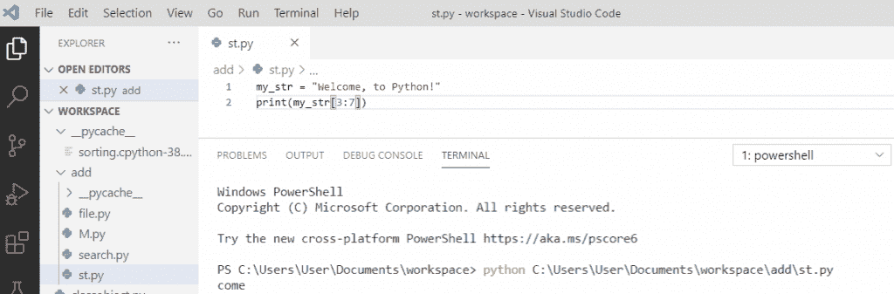

# Python +示例中的字符串切片

> 原文：<https://pythonguides.com/slicing-string-in-python/>

[](https://sharepointsky.teachable.com/p/python-and-machine-learning-training-course)

在这个 [Python 教程](https://pythonguides.com/learn-python/)中，我们将通过几个例子来讨论 Python 中的**切片字符串。**

*   Python 中的切片字符串
*   python 中的反向字符串切片
*   使用切片反转字符串 python

目录

[](#)

*   [在 Python 中切片字符串](#Slicing_string_in_Python "Slicing string in Python")
*   [Python 中字符串的反向切片](#Reverse_slicing_of_a_string_in_Python "Reverse slicing of a string in Python")
*   [使用切片反转字符串 python](#Reverse_string_python_using_slicing "Reverse string python using slicing")

## 在 Python 中切片字符串

Python **切片**是通过切片从给定的字符串中获得一个子字符串。为了获取字符串的一部分，我们将指定开始索引和结束索引，用冒号分隔。

**举例:**

```py
my_str = "Welcome, to Python!"
print(my_str[3:7])
```

写完上面的代码(对一个 string python 切片)，你将打印**“my _ str[3:7]”**然后输出将显示为**“来”。**在这里，你会得到从位置 3 到位置 7 的字符不包括在内。

你可以参考下面的截图切片一个字符串 python。



Slicing a string python

另外，检查:[如何在 Python 中从列表中获取字符串值](https://pythonguides.com/how-to-get-string-values-from-list-in-python/)

## Python 中字符串的反向切片

现在，让我们看看 Python 中的**字符串反向切片的代码。**

对于给定字符串的**反向切片**，我们将使用 `join()` 和 `reversed()` 。我们在内存中反转字符串，并加入分割的字符数，它将返回一个字符串。

**举例:**

```py
my_str = "PythonGuides"
print("Original string is: " + my_str)
v = 6
result = ' '.join(reversed(my_str[0:v]))
print("The reversed sliced string is: " +result)
```

写完上面的代码(python 中给定字符串的反向切片)，一旦打印出**“结果”**，那么输出将显示为**“反向切片的字符串是:nohtyP”**。这里，它将返回切片后的反向字符串。

可以参考下面截图`python`中给定字符串的反向切片。


Reverse slicing of a given string in python

这是 python 中**反向字符串切片的一个例子。**

阅读: [Python 在字符串](https://pythonguides.com/python-find-substring-in-string/)中查找子串

## 使用切片反转字符串 python

在 python 中，要反转一个字符串，python 中没有内置函数，所以我们将使用从字符串末尾开始并以负值结束的**切片**。

**举例:**

```py
my_string = "PythonGuide"[::-1]
print(my_string)
```

写完上面的代码(如何在 python 中反转一个字符串)，你将打印这些代码，然后输出将显示为一个 `" ediuGnohtyP "` 。这里，我们将使用字符串切片来反转字符串。

你可以参考下面的截图 python 中的 python 反转字符串


reverse string python using slicing

这就是如何使用切片在 python 中**反转一个字符串。**

您可能会喜欢以下 Python 教程:

*   [如何在 python 中使用正则表达式拆分字符串](https://pythonguides.com/python-split-string-regex/)
*   [从字符串 Python 中删除字符](https://pythonguides.com/remove-character-from-string-python/)
*   [如何在 Python 中删除字符串的第一个字符](https://pythonguides.com/remove-first-character-from-a-string-in-python/)
*   [如何在 Python 中处理 indexerror:字符串索引超出范围](https://pythonguides.com/indexerror-string-index-out-of-range-python/)
*   [如何在 Python 中把列表转换成字符串](https://pythonguides.com/python-convert-list-to-string/)
*   [如何在 python 中把整数转换成字符串](https://pythonguides.com/convert-an-integer-to-string-in-python/)
*   [如何在 Python 中创建字符串](https://pythonguides.com/create-a-string-in-python/)
*   [Python 比较字符串](https://pythonguides.com/python-compare-strings/)
*   [Python NumPy nan](https://pythonguides.com/python-numpy-nan/)

在本教程中，我们学习了 python 中的**切片字符串**和 python 中的**反向字符串切片**。

*   使用切片反转字符串 python

[Bijay Kumar](https://pythonguides.com/author/fewlines4biju/)

Python 是美国最流行的语言之一。我从事 Python 工作已经有很长时间了，我在与 Tkinter、Pandas、NumPy、Turtle、Django、Matplotlib、Tensorflow、Scipy、Scikit-Learn 等各种库合作方面拥有专业知识。我有与美国、加拿大、英国、澳大利亚、新西兰等国家的各种客户合作的经验。查看我的个人资料。

[enjoysharepoint.com/](https://enjoysharepoint.com/)[](https://www.facebook.com/fewlines4biju "Facebook")[](https://www.linkedin.com/in/fewlines4biju/ "Linkedin")[](https://twitter.com/fewlines4biju "Twitter")