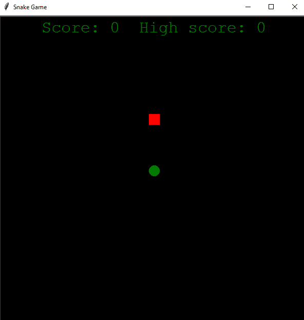
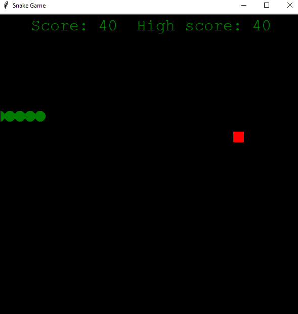
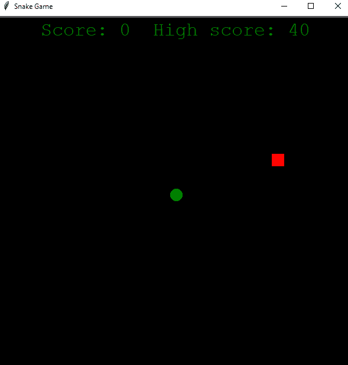

# 如何使用 Turtle 创建 Python 中的贪吃蛇游戏

> 原文：<https://pythonguides.com/snake-game-in-python/>

[](https://sharepointsky.teachable.com/p/python-and-machine-learning-training-course)

在这个 [Python 教程](https://pythonguides.com/learn-python/)中，我们将学习如何**使用乌龟**在 Python 中创建一个贪吃蛇游戏。用 Python 创建一个贪吃蛇游戏很容易。

目录

[](#)

*   [关于贪吃蛇游戏](#About_Snake_Game "About Snake Game")
*   [蟒蛇龟](#Overview_of_Snake_game_in_Python_turtle "Overview of Snake game in Python turtle")中蛇游戏概述
*   [用蟒蛇龟创建一个贪吃蛇游戏(一步一步)](#Create_a_snake_game_using_Python_turtle_Step_by_Step "Create a snake game using Python turtle (Step by Step)")

## 关于贪吃蛇游戏

*   贪吃蛇游戏概念起源于 1976 年，由一家名为 Gremlin Interactive 的英国公司开发。
*   贪吃蛇游戏被认为是一种有趣且技巧娴熟的游戏。它在人们中间代代相传。
*   贪吃蛇游戏中的蛇是用四个方向控制的，如果蛇头撞到墙或者撞到自己，那么这条蛇就死了，游戏会以分数结束。
*   玩家在游戏中的主要目标是通过收集食物获得尽可能多的分数。
*   所以，如果你是一个初学者，你学习了海龟，那么你可以用这个模块做一个贪吃蛇游戏。

如果你是 Python turtle 的新手，看看 [Python turtle 编程](https://pythonguides.com/turtle-programming-in-python/)和[用 Python turtle 绘制彩色填充形状](https://pythonguides.com/draw-colored-filled-shapes-using-python-turtle/)。

## 蟒蛇龟中蛇游戏概述

在这个游戏中，我们将使用以下代码用 python 创建一个**贪吃蛇游戏:**

*   Turtle 是 python 中的一个预装库，用于创建形状、图片和游戏。
*   **时间**–用于计算从 epoch 开始经过的秒数。
*   `Random`–这个模块用于使用 Random 模块在 python 中生成随机数。
*   `penup()`–停止乌龟围栏的绘制。
*   `speed()`–0 到 10 范围内的整数值。所以，0 最快，10 快，6 正常，3 慢，1 最慢。如果没有给定参数，则返回当前速度。
*   `color()`–返回或设置钢笔颜色和填充颜色。
*   `shape()`–它将 turtle shape 设置为给定名称的形状。
*   hide turtle()——让乌龟隐形。
*   `xcor()`–返回乌龟的 x 坐标。
*   `ycor()`–返回乌龟的 y 坐标。

读取 [Python 龟写函数](https://pythonguides.com/python-turtle-write-function/)

## 用蟒蛇龟创建一个贪吃蛇游戏(一步一步)

在这里，我们将解释用 python 编写**贪吃蛇游戏**的简单方法。建议去抛下面一步。

**第一步:**

首先，我们将把所有的模块导入到程序中，并且我们将给出游戏的默认值。

```py
import turtle
import time
import random
delay = 0.1
score = 0
high_score = 0
```

**第二步:**

*   现在，我们将为游戏创建窗口屏幕，我们还将创建蛇的头部和蛇的食物。分数会显示在游戏的标题上。
*   功能龟。Screen()用于创建一个窗口。在这段代码中，我们的窗口是游戏的**“wn”**。
*   我们要用函数 **"wn.title("贪吃蛇游戏")"**给窗口起个名字。
*   为了设置窗口的背景颜色，我们使用了**“wn . bgcolor(' black ')”**。用**“wn . setup(width = X，height = Y)”**功能设置窗口高度和宽度。这里，宽度=600，高度=600。
*   函数 `window.tracer(0)` 关闭屏幕更新。因为，除了记分板，我们不需要任何屏幕更新，所以它被设置为 0。
*   现在，我们将创建一个蛇头，它基本上是一只乌龟，它将是一条蛇，它会四处移动。
*   为了创建一只乌龟，我们将使用**“turtle。**龟()"，赋名头。磁头速度设置为 0，因为我们只是在初始化，磁头不需要移动。
*   让我们用**“head . shape(" circle ")”****“head . color(" green ")”**来初始化头部的形状和颜色。
*   函数 `"head.penup()"` 确保不画出蛇所走的路径。
*   **“head . goto(0，0)”**用于将蛇定位到窗口的中心，停止的方向我们将使用 `head.direction = "stop"` 。
*   而**“pen . write()”**函数用于在当前海龟位置写入文本。
*   我们需要每次接触食物时增加蛇身体的功能。所以，我们用了数组。我们创建了一个名为 segments 的数组，它被初始化为空。

```py
wn = turtle.Screen()
wn.title("Snake Game")
wn.bgcolor('black')
wn.setup(width=600, height=600)
wn.tracer(0)
head = turtle.Turtle()
head.speed(0)
head.shape("circle")
head.color("green")
head.penup()
head.goto(0,0)
head.direction = "stop"
food = turtle.Turtle()
food.speed(0)
food.shape("square")
food.color("red")
food.penup()
food.goto(0,100)
segments = []
pen = turtle.Turtle()
pen.speed(0)
pen.shape("square")
pen.color("green")
pen.penup()
pen.hideturtle()
pen.goto(0,260)
pen.write("Score:0 High score:0", align = "center", font=("Courier", 24, "normal"))
```

**第三步:**

*   现在，我们需要为每个方向定义一个函数，并将 `head.direction` 设置为上、下、左、右。
*   之后，我们将继续前进，使蛇移动。所以，我们将定义一个名为 `move()` 的函数。
*   如果头部向上，则“y”坐标增加，如果头部向下，“y”坐标减少。
*   如果头部向右移动,“x”坐标增加，如果头部向左移动,“x”坐标减少。

```py
def go_up():
    if head.direction != "down":
        head.direction = "up"
def go_down():
    if head.direction != "up":
        head.direction = "down"
def go_left():
    if head.direction != "right":
        head.direction = "left"
def go_right():
    if head.direction != "left":
        head.direction = "right"
def move():
    if head.direction == "up":
        y = head.ycor()
        head.sety(y+20)
    if head.direction == "down":
        y = head.ycor()
        head.sety(y-20)
    if head.direction == "left":
        y = head.xcor()
        head.sety(x-20)
    if head.direction == "right":
        y = head.xcor()
        head.setx(x+20) 
```

**第四步:**

*   我们将为蛇的运动指定一个关键点。通过点击关键字，我们可以上下左右移动蛇。
*   我们需要系统来监听我们的控制键，所以我们将添加一个名为 `wn.listen()` 的函数来监听按键。
*   每一次按键都需要绑定到一个执行动作的函数。我们将使用函数 **" wn.onkeypress(function，" key") "** 来实现这四个功能。这里，我用“y”表示向上，“h”表示向下，“g”表示向左，“j”表示向右。
*   现在，我们可以在屏幕上操作一条蛇的运动。

```py
wn.listen()
wn.onkeypress(go_up, "y")
wn.onkeypress(go_down, "h")
wn.onkeypress(go_left, "g")
wn.onkeypress(go_right, "j")
```

**第五步:**

*   所以，现在这个函数在被调用之前什么都不做。每次更新屏幕或窗口时，我们都需要调用该函数。
*   我们必须确保当它与边界相撞时，蛇会死去。我们已经有了边界的坐标。所以，我们只需要在蛇头碰到坐标的时候重置它的位置。
*   此外，蛇需要停止移动，因此改变方向停止。
*   为了减缓蛇的移动，我们需要使用时间模块，否则移动函数的默认行为会非常快。
*   所以，我们将使用函数 `time.sleep()` 来降低龟速。
*   当蛇死亡时，该段需要消失。
*   所以，现在我们需要设置窗口坐标外的线段的位置。游戏重新开始，因此清除段列表。
*   我们需要在蛇的身体每次接触到食物时添加一段。所以，我们有条件检查头部与食物的碰撞。
*   创建一个 new_segment，定义它的速度、形状和颜色，并将其添加到 segments 数组中。
*   现在，给蛇头加上段是不够的。当蛇头移动时，这些片段也需要移动。
*   将位置为 x 的最后一段移动到 x-1，从 x-1 移动到 x-2，依此类推。
*   蛇如果碰到自己就需要死。因此，我们将检查线段和头部之间的距离是否小于 20。如果是，重置磁头位置和磁头方向。
*   最后，我们需要看到分数增加时的情况。第一个是头和食物碰撞的时候。增加**分数**并更新**高分**。
*   我们使用 `pen.write()` 函数在屏幕上写下分数。
*   当蛇头撞上边界和自己的尾巴时，我们需要重置分数
*   然后调用函数 `time.sleep(delay)` 降低龟速。

```py
while True:
    wn.update()
    if head.xcor()>290 or head.xcor()<-290 or head.ycor()>290 or head.ycor()<-290:
        time.sleep(1)
        head.goto(0,0)
        head.direction = "stop"
        for segment in segments:
            segment.goto(1000,1000)
        segments.clear()
        score = 0
        delay = 0.1
        pen.clear()
        pen.write("Score: {} High score: {}".format(score, high_score),align="center", font=("Courier", 24, "normal"))
    if head.distance(food) <20:
        x = random.randint(-290,290)
        y = random.randint(-290,290)
        food.goto(x,y)
        new_segment = turtle.Turtle()
        new_segment.speed(0)
        new_segment.shape("square")
        new_segment.color("white")
        new_segment.penup()
        segments.append(new_segment)
        delay -= 0.001
        score += 10
        if score > high_score:
            high_score = score
        pen.clear()
        pen.write("Score: {} High score: {}".format(score,high_score), align="center", font=("Courier", 24, "normal"))
    for index in range(len(segments)-1,0,-1:
        x = segments[index-1].xcor()
        y = segments[index-1].ycor()
        segments[index].goto(x,y)
    if len(segments)>0:
        x = head.xcor()
        y = head.ycor()
        segments[0].goto(x,y)
    move()
    for segment in segments:
        if segment.distance(head)<20:
            time.sleep(1)
            head.goto(0,0)
            head.direction = "stop"
            for segment in segments:
                segment.goto(1000,1000)
            segments.clear()
            score = 0
            delay = 0.1
            pen.clear()
            pen.write("Score: {} High score: {}".format(score,high_score), align="center", font=("Courier", 24, "normal"))
    time.sleep(delay)
wn.mainloop()
```

**使用 turtle 在 python 中完成贪吃蛇游戏的代码:**

```py
import turtle
import time
import random
delay = 0.1
score = 0
high_score = 0
wn = turtle.Screen()
wn.title("Snake Game")
wn.bgcolor('black')
wn.setup(width=600, height=600)
wn.tracer(0)
head = turtle.Turtle()
head.speed(0)
head.shape("circle")
head.color("green")
head.penup()
head.goto(0,0)
head.direction = "stop"
food = turtle.Turtle()
food.speed(0)
food.shape("square")
food.color("red")
food.penup()
food.goto(0,100)
segments = []
pen = turtle.Turtle()
pen.speed(0)
pen.shape("square")
pen.color("green")
pen.penup()
pen.hideturtle()
pen.goto(0,260)
pen.write("Score:0 High score:0", align = "center", font=("Courier", 24, "normal"))
def go_up():
    if head.direction != "down":
        head.direction = "up"
def go_down():
    if head.direction != "up":
        head.direction = "down"
def go_left():
    if head.direction != "right":
        head.direction = "left"
def go_right():
    if head.direction != "left":
        head.direction = "right"
def move():
    if head.direction == "up":
        y = head.ycor()
        head.sety(y+20)
    if head.direction == "down":
        y = head.ycor()
        head.sety(y-20)
    if head.direction == "left":
        y = head.xcor()
        head.sety(x-20)
    if head.direction == "right":
        y = head.xcor()
        head.setx(x+20)
wn.listen()
wn.onkeypress(go_up, "y")
wn.onkeypress(go_down, "h")
wn.onkeypress(go_left, "g")
wn.onkeypress(go_right, "j")
while True:
    wn.update()
    if head.xcor()>290 or head.xcor()<-290 or head.ycor()>290 or head.ycor()<-290:
        time.sleep(1)
        head.goto(0,0)
        head.direction = "stop"
        for segment in segments:
            segment.goto(1000,1000)
        segments.clear()
        score = 0
        delay = 0.1
        pen.clear()
        pen.write("Score: {} High score: {}".format(score, high_score),align="center", font=("Courier", 24, "normal"))
    if head.distance(food) <20:
        x = random.randint(-290,290)
        y = random.randint(-290,290)
        food.goto(x,y)
        new_segment = turtle.Turtle()
        new_segment.speed(0)
        new_segment.shape("square")
        new_segment.color("white")
        new_segment.penup()
        segments.append(new_segment)
        delay -= 0.001
        score += 10
        if score > high_score:
            high_score = score
        pen.clear()
        pen.write("Score: {} High score: {}".format(score,high_score), align="center", font=("Courier", 24, "normal"))
    for index in range(len(segments)-1,0,-1:
        x = segments[index-1].xcor()
        y = segments[index-1].ycor()
        segments[index].goto(x,y)
    if len(segments)>0:
        x = head.xcor()
        y = head.ycor()
        segments[0].goto(x,y)
    move()
    for segment in segments:
        if segment.distance(head)<20:
            time.sleep(1)
            head.goto(0,0)
            head.direction = "stop"
            for segment in segments:
                segment.goto(1000,1000)
            segments.clear()
            score = 0
            delay = 0.1
            pen.clear()
            pen.write("Score: {} High score: {}".format(score,high_score), align="center", font=("Courier", 24, "normal"))
    time.sleep(delay)
wn.mainloop()
```

**输出 1:**



Snake game in python using turtle

**输出 2:**



Snake game in python using turtle

**输出 3:**



Snake game in python using turtle

您可能会喜欢以下 Python 教程:

*   [Python Tkinter 进度条](https://pythonguides.com/python-tkinter-progress-bar/)
*   [Python 读取二进制文件](https://pythonguides.com/python-read-a-binary-file/)
*   [蟒蛇龟的颜色](https://pythonguides.com/python-turtle-colors/)
*   [Python Tkinter Stopwatch](https://pythonguides.com/python-tkinter-stopwatch/)
*   [如何在蟒龟里做出笑脸](https://pythonguides.com/how-to-make-a-smiling-face-in-python-turtle/)
*   [如何将 Python 字符串转换成字节数组](https://pythonguides.com/python-string-to-byte-array/)
*   [Python 通过引用或值传递](https://pythonguides.com/python-pass-by-reference-or-value/)
*   [Python 从列表中选择](https://pythonguides.com/python-select-from-a-list/)
*   [Python Tkinter 列表框](https://pythonguides.com/python-tkinter-listbox/)
*   [Python 复制文件](https://pythonguides.com/python-copy-file/)
*   [Python 文件方法](https://pythonguides.com/python-file-methods/)

我希望现在你可以用 turtle 用 python 创建一个**贪吃蛇游戏，并学会如何使用 turtle 模块和 time 模块。在这里，我们学习了使用 turtle 的 python 中的贪吃蛇游戏，我们有完整的源代码和解释。**

[Bijay Kumar](https://pythonguides.com/author/fewlines4biju/)

Python 是美国最流行的语言之一。我从事 Python 工作已经有很长时间了，我在与 Tkinter、Pandas、NumPy、Turtle、Django、Matplotlib、Tensorflow、Scipy、Scikit-Learn 等各种库合作方面拥有专业知识。我有与美国、加拿大、英国、澳大利亚、新西兰等国家的各种客户合作的经验。查看我的个人资料。

[enjoysharepoint.com/](https://enjoysharepoint.com/)[](https://www.facebook.com/fewlines4biju "Facebook")[](https://www.linkedin.com/in/fewlines4biju/ "Linkedin")[](https://twitter.com/fewlines4biju "Twitter")