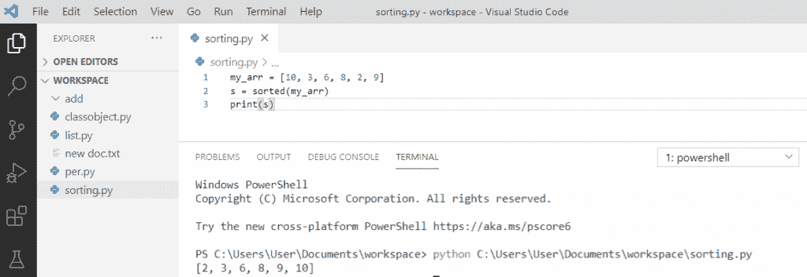
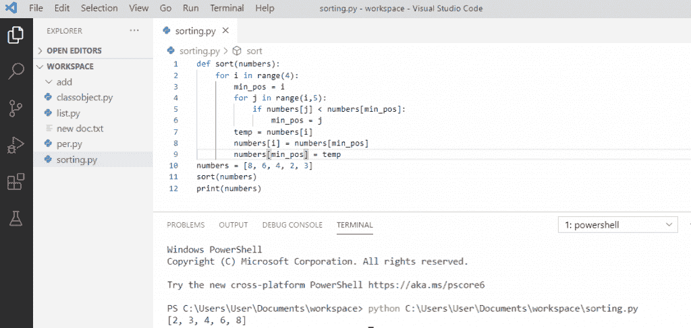
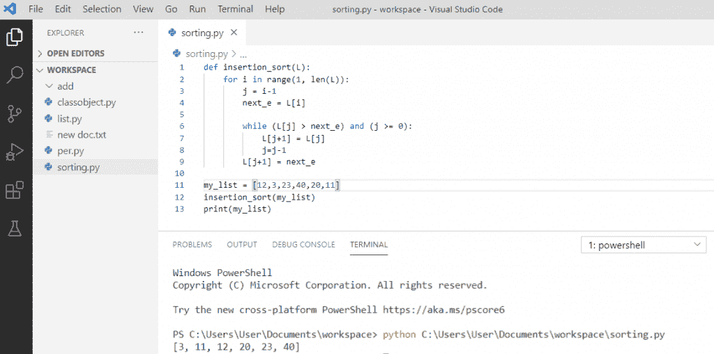
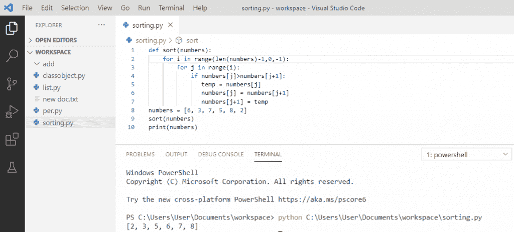
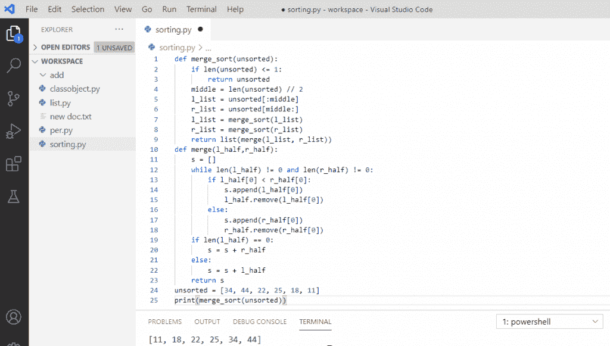
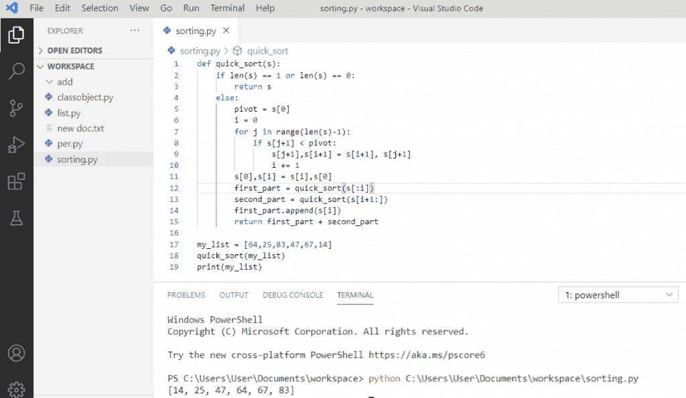
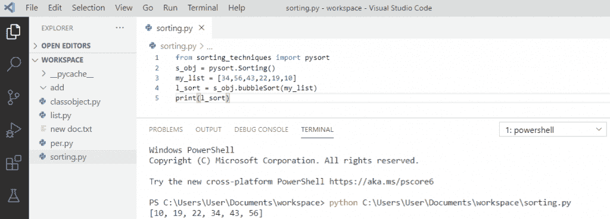
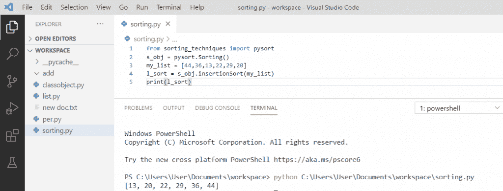
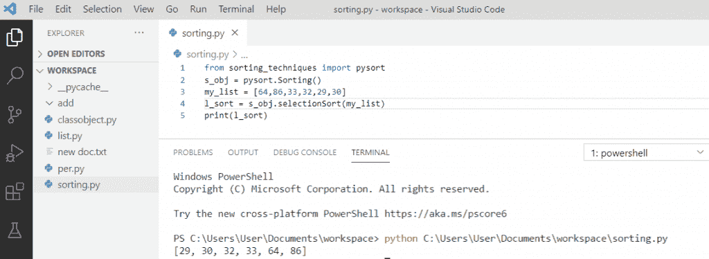
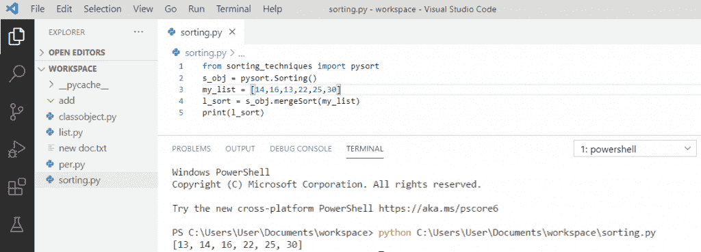

# Python 中的排序算法(详细教程)

> 原文：<https://pythonguides.com/sorting-algorithms-in-python/>

[](https://sharepointsky.teachable.com/p/python-and-machine-learning-training-course)

在本 [Python 教程](https://pythonguides.com/python-gui-programming/)中，我们将讨论`Python`中的排序算法。此外，我们将看到以下主题:

*   python 中的算法是什么？
*   python 中的排序是什么？
*   Python 内置排序算法
*   python 中的选择排序
*   python 中的插入排序
*   python 中的冒泡排序
*   python 中的合并排序
*   python 中的快速排序
*   Python 排序算法时间复杂度
*   python 中的一种最佳排序算法
*   使用库的 Python 排序算法

目录

[](#)

*   [python 中的算法是什么？](#What_is_an_algorithm_in_python "What is an algorithm in python?")
*   [python 中的排序是什么？](#What_is_sorting_in_python "What is sorting in python?")
*   [Python 内置排序算法](#Python_built-in_sorting_algorithm "Python built-in sorting algorithm")
*   [python 中的选择排序](#Selection_sort_in_python "Selection sort in python")
*   [python 中的插入排序](#Insertion_sort_in_python "Insertion sort in python")
*   [python 中的冒泡排序](#Bubble_sort_in_python "Bubble sort in python")
*   [python 中的归并排序](#Merge_sort_in_python "Merge sort in python")
*   [python 中的快速排序](#Quicksort_in_python "Quicksort in python")
*   [Python 排序算法时间复杂度](#Python_sorting_algorithms_time_complexity "Python sorting algorithms time complexity")
*   [python 中的一种最佳排序算法](#A_best_sorting_algorithm_in_python "A best sorting algorithm in python")
*   [使用库的 Python 排序算法](#Python_sorting_algorithms_using_a_library "Python sorting algorithms using a library")
    *   [使用 python 中的库进行冒泡排序](#Bubble_sort_using_the_library_in_python "Bubble sort using the library in python")
    *   [使用 python 中的库进行插入排序](#Insertion_sort_using_the_library_in_python "Insertion sort using the library in python")
    *   [使用 python 中的库进行选择排序](#Selection_sort_using_the_library_in_python "Selection sort using the library in python")
    *   [使用 python 中的库进行合并排序](#Merge_sort_using_the_library_in_python "Merge sort using the library in python")

## python 中的算法是什么？

**python 中的算法**是一个循序渐进的过程，它定义了一组按照一定顺序执行以获得输出的指令。算法通常是独立于底层语言创建的。这可以是一个简单的过程，比如排序、两个数相乘、两个数相加等。

## python 中的排序是什么？

**排序**是指按照特定的顺序排列数据，最常见的顺序是数字顺序。排序的重要性在于数据搜索得到优化，而且它以一种更可读的格式表示数据。这些算法可以用来组织杂乱的数据，使其更容易使用。

## Python 内置排序算法

为了对 python 中的**元素进行排序，我们可以使用[内置函数](https://pythonguides.com/python-built-in-functions/) `sorted()` 对任意 [Python 列表](https://pythonguides.com/python-list-methods/)进行排序。它提供了对数据进行排序的能力。**

**举例:**

```py
my_arr = [10, 3, 6, 8, 2, 9]
s = sorted(my_arr)
print(s)
```

写完上面的代码( **python 内置排序算法**，一旦你将**“s”**打印出来那么输出就是**【2，3，6，8，9，10】**。当我们调用 sorted()时，我们用一个新的排序列表以排序的方式获得输出。

**python 内置排序算法**可以参考下面截图。



Python built-in sorting algorithm

## python 中的选择排序

**Python 选择排序**是一种**比较排序算法**，用于对元素列表进行升序排序。在选择排序中，我们从获取给定列表中的最小值开始，并与每个元素进行比较。

**举例:**

```py
def sort(numbers):
    for i in range(4):
        min_pos = i
        for j in range(i,5):
            if numbers[j] < numbers[min_pos]:
               min_pos = j
        temp = numbers[i]
        numbers[i] = numbers[min_pos]
        numbers[min_pos] = temp
numbers = [8, 6, 4, 2, 3]
sort(numbers)
print(numbers)
```

写完上面的代码(python 中的**选择排序**，一旦打印出**【数字】**，那么输出将是**【2，3，4，6，8】**。这里，我们对未排序列表中的每个剩余元素重复这个过程，最后，未排序列表中的所有元素都被排序。

python 中的**选择排序可以参考下面的截图。**



Selection sort in python

## python 中的插入排序

**Python 插入排序**是 Python 中简单的**排序算法之一。它包括为列表中的给定元素找到正确的位置。**

我们比较前两个元素，然后通过比较对它们进行排序，再一次我们取第三个元素，找到它在前两个元素中的位置，依此类推。

**举例:**

```py
def insertion_sort(L):
    for i in range(1, len(L)):
        j = i-1
        next_e = L[i]
        while (L[j] > next_e) and (j >= 0):
            L[j+1] = L[j]
            j = j-1
            L[j+1] = next_e
my_list = [12,3,23,40,20,11]
insertion_sort(my_list)
print(my_list)
```

写完上面的代码(python 中的插入排序)，一旦打印出**“my _ list”**那么输出将是**【3，11，12，20，23，40】**。在这里，排序包括通过比较当前元素和下一个元素来找到元素的正确位置，并按升序对它们进行排序。

python 中的**插入排序可以参考下面的截图**



Insertion sort in python

## python 中的冒泡排序

**Python 冒泡排序**是 Python 中最简单的**排序算法，如果相邻元素的顺序不对，它会重复交换相邻元素，直到元素排序完毕。**

它包括通过一个接一个地比较和交换来多次遍历一个列表。

**举例:**

```py
def sort(numbers):
    for i in range(len(numbers)-1,0,-1);
        for j in range(i):
            if numbers[j]>numbers[j+1]:
               temp = numbers[j]
               numbers[j] = numbers[j+1]
               numbers[j+1] = temp
numbers = [6, 3, 7, 5, 8, 2]
sort(numbers)
print(numbers) 
```

写完上面的代码(python 中的冒泡排序)，一旦你将打印出**【数字】**那么输出将是**【2，3，5，6，7，8】**。这里，元素将按升序排序，在每一步中，最大的元素将在列表的末尾冒泡。

python 中的**冒泡排序可以参考下面的截图**



Bubble sort in python

## python 中的归并排序

`Python Merge sort` 基于分而治之的方法，它首先将数组分成大小相等的两部分，对每一半进行递归排序，然后以排序的方式将它们组合起来。

**举例:**

```py
def merge_sort(unsorted):
    if len(unsorted) <= 1:
        return unsorted
    middle = len(unsorted) // 2
    l_list = unsorted[:middle]
    r_list = unsorted[middle:]
    l_list = merge_sort(l_list)
    r_list = merge_sort(r_list)
    return list(merge(l_list, r_list))
def merge(l_half,r_half):
    s = []
    while len(l_half) != 0 and len(r_half)!=0:
        if l_half[0] < r_half[0]:
            s.append(l_half[0])
            l_half.remove(l_half[0])
        else:
            s.append(r_half[0])
            r_half.remove(r_half[0])
    if len(l_half) == 0:
       s = s + r_half
    else:
       s = s + l_half
    return s
unsorted = [34, 44, 22, 25, 18, 11]
print(merge_sort(unsorted))
```

写完上面的代码(python 中的 merge sort)，一旦你将打印**“merge _ sort(未排序)”**那么输出将是**【11，18，22，25，34，44】**。这里，元素将被分成两半，并递归地将输入分成两半。

一个函数，它合并两半，最后产生一个排序的数组。

python 中的**合并排序可以参考下面的截图**



Merge sort in python

## python 中的快速排序

`Python Quicksort` 是一种基于分治法的算法，其中一个数组被分割成子数组。从数组中选择一个枢纽元素。这里，pivot 元素是 s[0]，比 pivot 元素小的元素放在左边，大的元素放在右边。

**举例:**

```py
def quick_sort(s):
    if len(s) == 1 or len(s) == 0:
       return s
    else:
        pivot = s[0]
        i = 0
        for j in range(len(s)-1):
            if s[j+1] < pivot:
               s[j+1],s[i+1] = s[i+1],s[j+1]
               i += 1
        s[0],s[i] = s[i],s[0]
        first_part = quick_sort(s[:i])
        second_part = quick_sort(s[i+1:])
        first_part.append(s[i])
        return first_part + second_part
my_list = [64,25,83,47,67,14]
quick_sort(my_list)
print(my_list)
```

写完上面的代码(python 中的 Quicksort)，一旦你将打印**“my _ list”**那么输出将是**【14，25，47，64，67，83】**。这里，元素将被分成两个子数组，这些子数组被递归调用来对元素进行排序。将 pivot 元素与第一个索引中的元素进行比较。

关于 python 中的**快速排序，可以参考下面的截图**



Quicksort in python

## Python 排序算法时间复杂度

Python 排序算法的效率取决于两个参数:

1.  **时间复杂度**–它被定义为所需的步骤数取决于输入的大小。
2.  **空间复杂度**–空间复杂度是程序执行所需的总内存空间。

所有排序算法的时间复杂度:

| **算法** | **最佳** | **平均值** | **最差** |
| 选择排序 | Ω(n^2) | θ(n^2) | O(n^2) |
| 插入排序 | Ω(n) | θ(n^2) | O(n^2) |
| 冒泡排序 | Ω(n) | θ(n^2) | O(n^2) |
| 合并排序 | Ω(n log(n)) | θ(n log(n)) | O(n log(n)) |
| 快速分类 | Ω(n log(n)) | θ(n log(n)) | O(n^2) |

Time Complexity

## python 中的一种最佳排序算法

*   **快速排序**算法是最有效的排序算法之一，这也是它被广泛使用的原因，因为它是**最佳算法**之一。
*   快速排序使用带有递归的分治算法。
*   快速排序的时间复杂度在最好的情况下是 O(n log n)，在一般情况下是 O(n log n)，在最坏的情况下是 O(n^2。
*   快速排序也被认为是**【最快】**的排序算法，因为它在大多数输入的平均情况下具有最佳性能。

## 使用库的 Python 排序算法

*   Python 有一个**强大的包**，可以在列表上执行许多不同类型的稳定和不稳定排序算法。这个包对程序员和开发者很有帮助，基于他们的需求，他们可以执行任何排序。
*   为了执行排序算法，我们需要首先从 sorting_techniques import pysort 导入库。
*   创建一个 `"s_obj"` 排序对象。

**举例:**

```py
from sorting_techniques import pysort
s_obj = pysort.Sorting()
```

### 使用 python 中的库进行冒泡排序

这里，我们将通过使用 python 中的库来执行冒泡排序。

**举例:**

```py
from sorting_techniques import pysort
s_obj = pysort.Sorting()
my_list = [34,56,43,22,19,10]
l_sort = s_obj.bubbleSort(my_list)
print(l_sort)
```

写完上面的代码(使用 python 中的库进行冒泡排序)，一旦你将打印**“l _ sort”**那么输出将是**【10，19，22，34，43，56】**。这里，我们创建了一个 `s_obj` ，然后 `l_sort` 将生成一个排序结果，该结果将打印排序后的列表。

你可以参考下面的截图，使用 python 中的库进行冒泡排序



Bubble sort using the library in python

### 使用 python 中的库进行插入排序

这里，我们将通过使用 python 中的库来执行插入排序。

**举例:**

```py
from sorting_techniques import pysort
s_obj = pysort.Sorting()
my_list = [44,36,13,22,29,20]
l_sort = s_obj.insertionSort(my_list)
print(l_sort)
```

写完上面的代码(使用 python 中的库进行插入排序)，一旦打印出**“l _ sort”**，那么输出将是**【13，20，22，29，36，44】**。这里，我们创建了一个 `s_obj` ，然后 `l_sort` 将生成一个排序结果，该结果将打印排序后的列表。

关于使用 python 中的库进行**插入排序，可以参考下面的截图**



Insertion sort using the library in python

### 使用 python 中的库进行选择排序

我们将使用 python 中的库来执行插入排序。

**举例:**

```py
from sorting_techniques import pysort
s_obj = pysort.Sorting()
my_list = [64,86,33,32,29,30]
l_sort = s_obj.selectionSort(my_list)
print(l_sort)
```

写完上面的代码(使用 python 中的库进行选择排序)，一旦你打印出**“l _ sort”**，那么输出将是**【29，30，32，33，64，86】**。现在，我们创建了一个 `s_obj` ，然后 `l_sort` 将生成一个排序结果，该结果将打印排序后的列表。

你可以参考下面的截图，使用 python 中的库进行选择排序



Selection sort using the library in python

### 使用 python 中的库进行合并排序

我们将通过使用 python 中的库来执行合并排序。

**举例:**

```py
from sorting_techniques import pysort
s_obj = pysort.Sorting()
my_list = [14,16,13,22,25,30]
l_sort = s_obj.mergeSort(my_list)
print(l_sort)
```

写完上面的代码(使用 python 中的库进行 merge sort)，一旦你将打印**“l _ sort”**那么输出将是**【13，14，16，22，25，30】**。现在，我们创建了一个 `s_obj` ，然后 `l_sort` 将生成一个排序结果，该结果将打印排序后的列表。

你可以参考下面的截图，使用 python 中的库进行合并排序



Merge sort using the library in python

您可能会喜欢以下 Python 教程:

*   [Python 将列表转换成字符串](https://pythonguides.com/python-convert-list-to-string/)
*   [Python 元组排序列表](https://pythonguides.com/python-sort-list-of-tuples/)
*   [在 Python 中使用 JSON 数据](https://pythonguides.com/json-data-in-python/)
*   [使用 Python 发送电子邮件](https://pythonguides.com/send-email-using-python/)
*   [Python 获得一个 IP 地址](https://pythonguides.com/python-get-an-ip-address/)
*   [Python – stderr, stdin and stdout](https://pythonguides.com/python-stderr-stdin-and-stdout/)
*   [Python 中的递增和递减运算符](https://pythonguides.com/increment-and-decrement-operators-in-python/)

在这个 Python 教程中，我们学习了 python 中的**排序算法。此外，我们还讨论了以下主题:**

*   python 中的**算法是什么？**
*   python 中的**排序是什么？**
*   Python 内置排序算法
*   python 中的选择排序
*   python 中的插入排序
*   python 中的冒泡排序
*   python 中的合并排序
*   python 中的快速排序
*   Python 排序算法时间复杂度
*   python 中的一种最佳排序算法
*   使用库的 Python 排序算法

[Bijay Kumar](https://pythonguides.com/author/fewlines4biju/)

Python 是美国最流行的语言之一。我从事 Python 工作已经有很长时间了，我在与 Tkinter、Pandas、NumPy、Turtle、Django、Matplotlib、Tensorflow、Scipy、Scikit-Learn 等各种库合作方面拥有专业知识。我有与美国、加拿大、英国、澳大利亚、新西兰等国家的各种客户合作的经验。查看我的个人资料。

[enjoysharepoint.com/](https://enjoysharepoint.com/)[](https://www.facebook.com/fewlines4biju "Facebook")[](https://www.linkedin.com/in/fewlines4biju/ "Linkedin")[](https://twitter.com/fewlines4biju "Twitter")