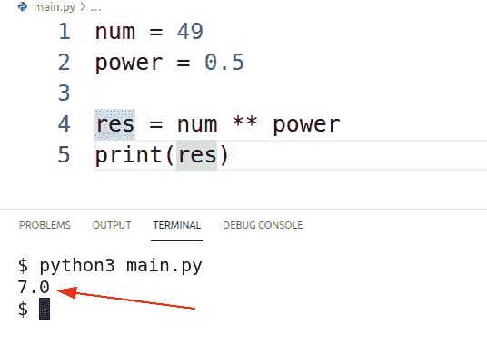
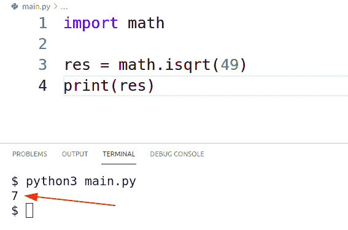
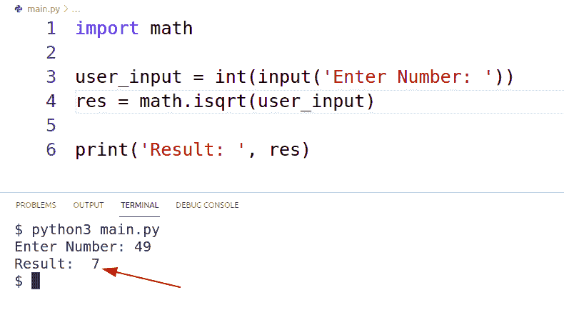
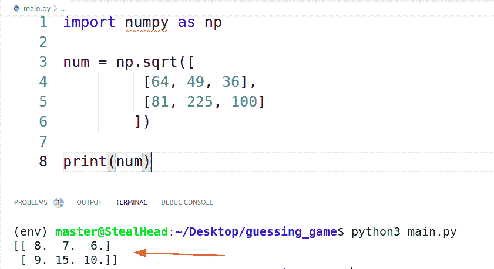
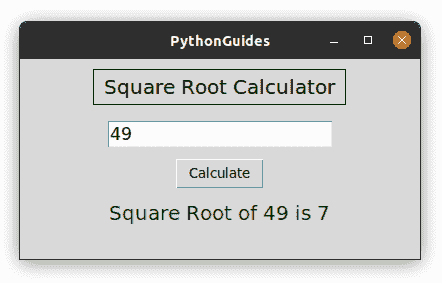

# Python 中的平方根

> 原文：<https://pythonguides.com/square-root-in-python/>

[](https://sharepointsky.teachable.com/p/python-and-machine-learning-training-course)

在本 [Python 教程](https://pythonguides.com/sitemap/)中，我们将学习如何在 python 中**计算平方根。我们已经在博客的末尾创建了一个项目。此外，我们将涵盖这些主题。**

1.  Python3 中的平方根
2.  Python 中不带数学的平方根
3.  Python 中带数学的平方根
4.  Python 中带 With SQRT 的平方根
5.  Python 中有无 SQRT 的平方根
6.  Python 程序中的平方根
7.  Python Numpy 中的平方根
8.  Python 示例中的平方根

目录

[](#)

*   [python 3 中的平方根](#Square_Root_in_Python3 "Square Root in Python3")
*   [Python 中没有数学的平方根](#Square_Root_in_Python_Without_Math "Square Root in Python Without Math")
    *   [使用乘法运算符](#Using_Multiply_Operator "Using Multiply Operator")
    *   [使用指数运算符](#Using_Exponent_Operator "Using Exponent Operator")
*   [Python 中带数学的平方根](#Square_Root_in_Python_With_Math "Square Root in Python With Math")
*   [Python 中不带 SQRT 的平方根](#Square_Root_in_Python_Without_SQRT "Square Root in Python Without SQRT")
*   [用 SQRT 在 Python 中求平方根](#Square_Root_in_Python_With_SQRT "Square Root in Python With SQRT")
*   [Python 程序中的平方根](#Square_Root_in_Python_Program "Square Root in Python Program")
*   [Python Numpy 中的平方根](#Square_Root_in_Python_Numpy "Square Root in Python Numpy")
*   [Python 例子中的平方根](#Square_Root_in_Python_Example "Square Root in Python Example")

## python 3 中的平方根

平方根是一个数的因数，当它自身相乘时，产生一个原始数。在本节中，我们将学习**如何在 Python3** 中计算平方根。

*   Python 中的 Math 模块提供了 `sqrt()` 函数，使用该函数我们可以计算 python3 中数字的平方根。
*   或者，我们也可以在 python3 中使用乘法运算符(*)生成 square。我们可以把这个数和它本身相乘，得到这个数的平方。比如 `7*7=49`。
*   python 中的指数(**)运算符在 python3 中也可以用来计算平方根。任何有 1/2 次方的数都会产生这个数的平方根。例如，`49**2=` 7。
*   在接下来的章节中，我们将详细讨论每一种方法。

又念， [Python 数字猜谜游戏](https://pythonguides.com/python-number-guessing-game/)

## Python 中没有数学的平方根

Math 是 python 中的一个模块，它允许使用 python 对数字进行所有的数学运算。但是在这一节中，我们将介绍如何在没有数学模块的情况下在 Python 中求平方根。

*   数学模块为所有类型的数学运算提供了函数，比如你可以执行平方根、指数、对数、西塔等等。
*   因为平方根只是数字本身的乘法，所以我们甚至可以在不使用数学模块的情况下执行。
*   我们将向你展示如何计算平方，然后我们将计算这个数的平方根。
    *   乘法运算符(*)用于计算平方。
    *   指数运算符(**)用于计算平方根。

### 使用乘法运算符

乘法运算符将两个给定的数相乘。一个数乘以它自己就可以得到平方。在下面的例子中，产生了 7 的平方根。

```py
>>> a = 7
>>> b = 7
>>> square_root = a * b
>>> print(square_root)
49
```

### 使用指数运算符

python 中的指数运算符(**)用于计算数字的指数幂。任何幂为 0.5 或 1/2 的数都会给出该数的平方根。比如 **49 ^(0.5) = 7** 。

```py
>>> num = 7
>>> power = 2
>>> square_root = num ** 2
>>> print(square_root)
49
```

如果不是 python 中的条件，则读取

## Python 中带数学的平方根

在本节中，我们将学习**如何用数学模块**在 Python 中求平方根。

*   数学模块提供各种基础数学运算(加法、乘法、平方根等)的函数。)推进(theta，ceil，factorial，log 等。)
*   数学模块支持的数学运算由 C 语言定义。
*   为了使用数学模块，你必须首先导入它，并访问他们的官方网站查看可用的数学方法。
*   使用 python 数学模块中的 `math.isqrt(n)` 可以对任何非负数求平方根。
*   在我们的例子中，我们已经计算了数字 49 的平方根，它应该是 7。

```py
import math
res = math.isqrt(49)
print('result: ', res)

result: 7
```

读取 [Matplotlib 多条形图](https://pythonguides.com/matplotlib-multiple-bar-chart/)

## Python 中不带 SQRT 的平方根

在本节中，我们将学习如何在不使用 python 数学模块的 sqrt 方法的情况下用 python 计算平方根**。**

*   任何数的 2 次方等于该数的平方。所以要求平方根，我们可以用数字的 1/2 次方。
*   Python 提供了指数运算符(**)来增加数字的幂。该运算符接受数字和幂。
*   例如，要找到 49 的平方根，请使用以下代码: **`49**0.5`** 。这里 0.5 是幂，49 是数。
*   所以这样我们就可以不用 sqrt 方法在 python 中求平方根了。这是一个小演示。

**源代码:**

在这段代码中，我们在没有使用 sqrt 方法的情况下计算了 49 的平方根。

```py
num = 49
power = 0.5

res = num ** power
print(res)
```

**输出:**

在此输出中，计算了 49 的平方根，结果是 7。



Square Root in Python Without SQRT

读取 [Python 查找列表](https://pythonguides.com/python-find-index-of-element-in-list/)中元素的索引

## 用 SQRT 在 Python 中求平方根

在本节中，我们将学习如何使用 sqrt 在 python 中**计算平方根。**

*   Math 模块提供了一个 `isqrt()` 函数，使用它我们可以计算数字的平方根。
*   数字必须是正数，以便在 python 中使用这种方法计算平方根。
*   该过程的第一步是导入 python 中的数学模块。

**源代码:**

在这段代码中，我们使用数学模块计算了数字的平方根。

```py
import math

res = math.isqrt(49)
print(res)
```

**输出:**

在这个输出中，我们使用 python 数学模块的 sqrt 方法来计算 49 的平方根。



读取 [Python 返回函数](https://pythonguides.com/python-return-function/)

## Python 程序中的平方根

在本节中，我们将创建一个基于 cli 的程序来用 python 计算平方根。我们将创建一个基于命令行的程序，该程序将接受来自用户的数字，并在终端或 cli 上显示结果。

**源代码:**

在这段代码中，我们使用数学模块来计算平方根。用户将输入一个数字，然后显示该数字的平方根。

```py
import math

user_input = int(input('Enter Number: '))
res = math.isqrt(user_input)

print('Result: ', res)
```

**输出:**

在这个输出中，用户可以输入任何数字，程序将计算它的平方根。在我们的例子中，我们有输入 49，生成的结果是 7。



Python Square Root Program

阅读[使用 python 从 URL 下载 zip 文件](https://pythonguides.com/download-zip-file-from-url-using-python/)

## Python Numpy 中的平方根

在本节中，我们将学习如何使用 python Numpy 计算平方根。

*   Python NumPy 是一个高级库，用于处理数组格式的数据。
*   使用 python 中的 **`numpy.sqrt()`** 方法我们可以计算数组中每个元素的平方根。
*   该过程的第一步是导入 numpy 库。在这种情况下，“没有找到 numpy 模块”的错误出现，然后安装使用以下命令。

```py
pip install numpy
```

*   例如，如果这个数组是`[9, 64, 81]` ，那么输出将是`[3, 8, 9]`。

**源代码:**

下面是使用 NumPy 计算平方根的代码。首先，我们导入了 NumPy 模块，然后使用 numpy.sqrt()方法计算了 python 中 [NumPy 数组中每个元素的平方根。](https://pythonguides.com/python-numpy-array/)

```py
import numpy as np

num = np.sqrt([
         [64, 49, 36],
         [81, 225, 100]
        ])

print(num)
```

**输出:**

在这个输出中，使用了**`np.sqrt()`**NumPy 模块的函数来计算 python 中的平方根。



Square Root in Python Numpy

读取 [Python NumPy 2d 数组](https://pythonguides.com/python-numpy-2d-array/)

## Python 例子中的平方根

在这一节中，我们将学习如何使用 python tkinter 创建平方根计算器。

*   python 中的 Tkinter 模块是用来创建图形用户界面(GUI)应用程序的应用程序。
*   我们已经使用了 python 中数学模块的 `math.isqrt()` 函数。利用这一点，我们已经计算了用户输入的数字的平方根。

```py
 def sqrt_root():
    r = math.isqrt(var.get())
    res.set(f'Square Root of {var.get()} is {r}')
```

*   `sqrt_root()` 是我们在 python 中创建的执行平方根的函数。在这段代码中，var.get()从用户那里收集输入。
*   该输入在 `math.isqrt()` 函数中传递，结果存储在变量‘r’中。
*   r '有计算结果，现在我们已经把它显示在标签上了。

**源代码:**

下面是 python 中平方根的完整源代码。

```py
from tkinter import *
import math

ws = Tk()
ws.title('PythonGuides')
ws.geometry('400x200')

def sqrt_root():
    r = math.isqrt(var.get())
    res.set(f'Square Root of {var.get()} is {r}')

var = IntVar()
var.set(49)
res = StringVar()

Label(
    ws,
    text='Square Root Calculator',
    font=('sans-serif', 15),
    relief=SOLID,
    padx=10,
    pady=5
).pack(pady=(10, 15))

Entry(
    ws,
    textvariable=var,
    font=('sans-serif', 13),
).pack()

Button(
    ws,
    text='Calculate',
    command=sqrt_root,

).pack(pady=(10, 10))

Label(
    ws,
    textvariable=res,
    font=('sans-serif', 15),
    fg='green'
).pack()

ws.mainloop()
```

**输出:**

这是基于 Python GUI 的应用程序中的平方根的例子。用户必须输入正数并点击计算按钮。结果将以绿色文本显示。在这种情况下，49 的平方根是 7。



Square Root in Python Example

您可能会喜欢以下 Python 教程:

*   [在熊猫中把整数转换成日期时间](https://pythonguides.com/convert-integers-to-datetime-in-pandas/)
*   [Python 在字符串中查找数字](https://pythonguides.com/python-find-number-in-string/)
*   [Python 漂亮打印 JSON](https://pythonguides.com/python-pretty-print-json/)
*   [删除非 ASCII 字符 Python](https://pythonguides.com/remove-non-ascii-characters-python/)
*   [如何将 Python 数据帧转换成 JSON](https://pythonguides.com/how-to-convert-python-dataframe-to-json/)
*   [如何在 Pandas 中把浮点数转换成整数](https://pythonguides.com/convert-floats-to-integer-in-pandas/)

在本教程中，我们学习了如何在 python 中**计算平方根。此外，我们已经讨论了这些主题。**

*   Python3 中的平方根
*   Python 中不带数学的平方根
*   Python 中带数学的平方根
*   Python 中带 With SQRT 的平方根
*   Python 中有无 SQRT 的平方根
*   Python 程序中的平方根
*   Python Numpy 中的平方根
*   Python 示例中的平方根

[Bijay Kumar](https://pythonguides.com/author/fewlines4biju/)

Python 是美国最流行的语言之一。我从事 Python 工作已经有很长时间了，我在与 Tkinter、Pandas、NumPy、Turtle、Django、Matplotlib、Tensorflow、Scipy、Scikit-Learn 等各种库合作方面拥有专业知识。我有与美国、加拿大、英国、澳大利亚、新西兰等国家的各种客户合作的经验。查看我的个人资料。

[enjoysharepoint.com/](https://enjoysharepoint.com/)[](https://www.facebook.com/fewlines4biju "Facebook")[](https://www.linkedin.com/in/fewlines4biju/ "Linkedin")[](https://twitter.com/fewlines4biju "Twitter")