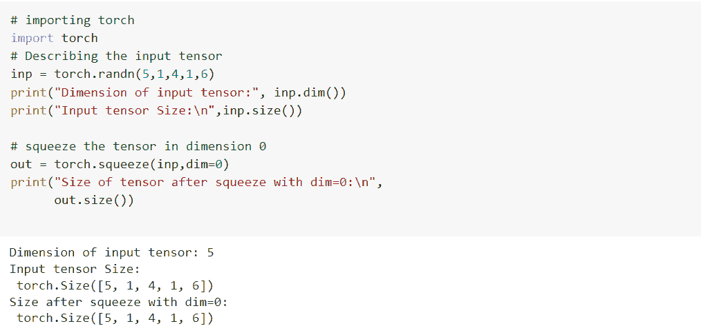
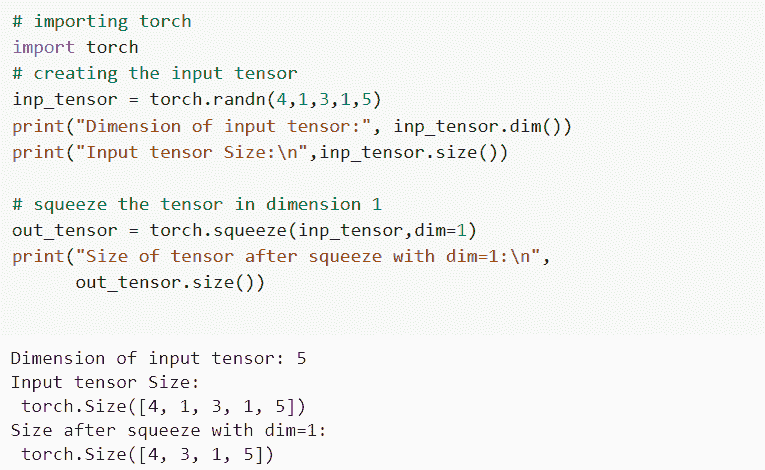

# 如何在 PyTorch 中压缩张量

> 原文：<https://pythonguides.com/squeeze-a-tensor-in-pytorch/>

[](https://sharepointsky.teachable.com/p/python-and-machine-learning-training-course)

有一个时候，我们都需要在 [PyTorch](https://pythonguides.com/what-is-pytorch/) 里挤一个张量。在这里，我将解释**如何在 PyTorch** 中压缩张量。我们还将讨论如何在 PyTorch 中压缩 5D 张量。

最近我在 PyTorch 工作，在 PyTorch 中我们得到了一个 ***挤压()的需求。所以，在这篇博客中，我也将解释，如何在 PyTorch 中挤压张量。***

因此，我们将在本 Python 教程中讨论这些主题。

*   什么是挤压()
*   如何在 PyTorch 中压缩张量
*   如何在 PyTorch 中压缩 5D 张量
*   如何在 PyTorch 中压缩 0 维张量
*   如何在 PyTorch 中压缩一维张量
*   如何在 PyTorch 中压缩二维张量

目录

[](#)

*   [什么是压榨()](#What_is_the_Squeeze "What is the Squeeze()")
*   [如何在 PyTorch 中压缩张量](#How_to_squeeze_a_tensor_in_PyTorch "How to squeeze a tensor in PyTorch")
*   [如何在 PyTorch 中压缩 5D 张量](#How_to_squeeze_a_5D_tensor_in_PyTorch "How to squeeze a 5D tensor in PyTorch")
*   [如何在 PyTorch 中压缩 0 维张量](#How_to_squeeze_a_tensor_in_0_dimensions_in_PyTorch "How to squeeze a tensor in 0 dimensions in PyTorch")
*   [如何在 PyTorch 中压缩一维张量](#How_to_squeeze_a_tensor_in_1_dimension_in_PyTorch "How to squeeze a tensor in 1 dimension in PyTorch")
*   [如何在 PyTorch 中压缩二维张量](#How_to_squeeze_a_tensor_in_2_dimension_in_PyTorch "How to squeeze a tensor in 2 dimension in PyTorch")
*   [结论](#Conclusion "Conclusion")

## 什么是压榨()

挤压张量我们使用的是 torch.squeeze()函数。当我们压缩一个张量时，压缩方法会返回一个所有维度的新张量，但会分离大小为 1 的张量。

**例如:**如果输入张量具有(P * 1 * Q * 1 * R * 1)的形状，并且我们在应用挤压方法之后得到的张量将是(P * Q * R)的形状。

在这个例子的帮助下，您可以看到 Squeeze()方法返回了所有维度的新张量，但是它删除了大小 1。

**语法:**

squeeze()方法的语法:

```py
torch.squeeze(input, dim = None, out= None)
```

**参数:**

*   **输入:**输入参数用作输入张量。
*   `dim = None`:dim 是一个可选的整数值，如果给定输入在这个维度上被压缩。
*   **out:**out 用作输出张量，它是一个可选的关键参数。

所以，有了这个，我们就明白 PyTorch 中什么是 Squeeze()方法了。

阅读:[交叉熵损失 PyTorch](https://pythonguides.com/cross-entropy-loss-pytorch/)

## 如何在 PyTorch 中压缩张量

在这一节中，我们将借助一个例子来学习如何在 PyTorch 中压缩张量。

挤压方法用于返回一个张量，其中大小为 1 的输入的所有维度都被移除。

**举例:**

在下面的例子中，我们导入 torch 库，然后描述输入变量，之后我们打印输入变量的张量大小，然后我们使用挤压方法。

```py
# Import torch library
import torch
# Describing the variable
p = torch.zeros(4, 1, 4, 1, 4)
# Print the tensor size
print(p.size())
# Describing the variable
q = torch.squeeze(p)
# Print the tensor size
print(q.size())
# Describing the variable
q = torch.squeeze(p, 0)
# Print the tensor size
print(q.size())
# Describing the variable
q = torch.squeeze(p, 1)
# Print the tensor size
print(q.size()) 
```

**输出:**

运行上述代码后，我们得到以下输出，其中我们可以看到，使用 Squeeze()方法后，我们得到了所有维度的新张量，但它删除了大小 1。


How to squeeze a tensor in PyTorch

这就是我们如何理解如何在 PyTorch 中压缩张量。

阅读: [PyTorch nn 线性+例题](https://pythonguides.com/pytorch-nn-linear/)

## 如何在 PyTorch 中压缩 5D 张量

在这一节中，我们将学习如何在 PyTorch 中压缩 5D 张量。

这里，我们使用 torch.squeeze()方法压缩了一个 5D 张量，输入张量有两个维度，大小为 1。

**举例:**

在下面的例子中，我们导入 torch 库，然后描述输入张量变量，之后我们打印输入变量的张量大小，然后我们使用挤压方法，之后我们打印挤压张量后的大小。

```py
# importing torch library
import torch

# Describing the input tensor
inp = torch.randn(5,1,4,1,6)
# print the input tensor
print("Input tensor Size:\n",inp.size())

# Squeeze the tensor
out = torch.squeeze(inp)
# print the size after squeeze tensor
print("Size after squeeze:\n",out.size())
```

**输出:**

运行上述代码后，我们得到以下输出，其中我们可以看到，通过使用 Squeeze()方法压缩了一个 5d 张量，并且我们得到输入张量具有大小为 1 的两个维度。


How to squeeze a 5d tensor in PyTorch

因此，有了这个，我们明白了如何在 PyTorch 中压缩一个 5d 张量。

阅读: [PyTorch 批量标准化](https://pythonguides.com/pytorch-batch-normalization/)

## 如何在 PyTorch 中压缩 0 维张量

在本节中，我们将学习如何在 PyTorch 中压缩 0 维张量。

这里，我们通过使用 torch.squeeze()方法压缩了 0 维张量，我们得到了所有维的新张量，但它删除了大小 1。

**代码:**

在下面的代码中，我们正在导入 torch 库，然后我们使用一个 *`torch.randn()`* 函数来描述输入张量，之后我们使用 0 维张量的 *`squeeze()`* 函数。然后打印出挤压后张量的大小。

```py
# importing torch
import torch
# Describing the input tensor
inp = torch.randn(5,1,4,1,6)
print("Dimension of input tensor:", inp.dim())
print("Input tensor Size:\n",inp.size())

# squeeze the tensor in dimension 0
out = torch.squeeze(inp,dim=0)
print("Size of tensor after squeeze with dim=0:\n",
      out.size())
```

**输出:**

在这个输出中，您可以看到 squeeze 方法返回一个大小为 1 的新张量维。



How to squeeze a tensor in 0 dimension in PyTorch

这样，我们已经了解了如何在 PyTorch 中压缩一个张量。

阅读: [PyTorch 预训练模型](https://pythonguides.com/pytorch-pretrained-model/)

## 如何在 PyTorch 中压缩一维张量

在这一节中，我们将学习如何在 PyTorch 中压缩一维张量。

这里我们在 PyTorch 中压缩一维张量。它返回一个新的张量，包含输入张量的每一个维度。

**代码:**

在下面的例子中，我们导入 torch 库，然后描述输入张量变量，之后打印输入变量的张量大小，然后使用 1 维张量的压缩方法。之后，我们打印挤压张量后的尺寸。

```py
# importing torch
import torch
# creating the input tensor
inp_tensor = torch.randn(4,1,3,1,5)
print("Dimension of input tensor:", inp_tensor.dim())
print("Input tensor Size:\n",inp_tensor.size())

# squeeze the tensor in dimension 1
out_tensor = torch.squeeze(inp_tensor,dim=1)
print("Size of tensor after squeeze with dim=1:\n",
      out_tensor.size())
```

**输出:**

运行上面的代码后，我们得到下面的输出，其中我们可以看到，我们在第 1 维挤压，只有这个维度在输出张量中被删除。



How to squeeze a tensor in 1 dimension in PyTorch

这样，我们就知道如何在 PyTorch 中压缩一维张量。

阅读: [PyTorch 双星交叉熵](https://pythonguides.com/pytorch-binary-cross-entropy/)

## 如何在 PyTorch 中压缩二维张量

在这一节中，我们将学习如何在 PyTorch 中压缩二维张量。

这里我们在 PyTorch 中压缩一个二维张量。在二维压缩中，输出张量的形状没有变化。

**代码:**

在下面的例子中，我们导入 torch 库，然后描述输入张量变量，之后打印输入变量的张量大小，然后使用 2 维张量的压缩方法。之后，我们打印挤压张量后的尺寸。

```py
# importing torch
import torch
# creating the input tensor
inp = torch.randn(6,1,5,1,7)
print("Dimension of input tensor:", inp.dim())
print("Input tensor Size:\n",inp.size())

# squeeze the tensor in dimension 2
out = torch.squeeze(input,dim=2)
print("Size after squeeze with dim=2:\n",
      out.size())
```

**输出:**

运行上面的代码后，我们得到了下面的输出，其中我们可以看到，我们在 2 维压缩，输出张量没有任何变化。


How to squeeze a tensor in 2 dimensions in PyTorch

## 结论

在本教程中，我们已经学习了如何在 PyTorch 中压缩一个张量，并且我们已经讲述了如何在 PyTorch 中压缩一个 5D 张量。我们还讨论了与其实现相关的不同示例。这是我们已经讨论过的例子列表。

*   什么是挤压()
*   如何在 PyTorch 中压缩张量
*   如何在 PyTorch 中压缩 5D 张量
*   如何在 PyTorch 中压缩 0 维张量
*   如何在 PyTorch 中压缩一维张量
*   如何在 PyTorch 中压缩二维张量

另外，看看更多的 Python PyTorch 教程。

*   [创建 PyTorch 空张量](https://pythonguides.com/pytorch-empty-tensor/)
*   [PyTorch 堆栈教程+示例](https://pythonguides.com/pytorch-stack/)
*   [如何使用 PyTorch 猫功能](https://pythonguides.com/pytorch-cat-function/)
*   [如何使用 PyTorch Polar](https://pythonguides.com/pytorch-polar/)

[Vaishali ganotra](https://pythonguides.com/author/vaishali/)

我是一名机器学习工程师，目前作为一名 Python 开发人员在 Tsinfo Technologies 工作。我有使用各种 Python 库的经验，比如 Scikit learn、Turtle、PyTorch 等。