# 堆积条形图 Matplotlib–完整教程

> 原文：<https://pythonguides.com/stacked-bar-chart-matplotlib/>

[](https://sharepointsky.teachable.com/p/python-and-machine-learning-training-course)

在本 [Python 教程](https://pythonguides.com/python-hello-world-program/)中，我们将讨论 python 中的**堆积条形图 matplotlib。在这里，我们将使用 matplotlib 介绍与堆积条形图相关的不同示例。我们还将讨论以下主题:**

*   堆积条形图 matplotlib
*   如何绘制堆积条形图
*   堆积条形图 matplotlib 示例
*   带标签的堆积条形图 matplotlib
*   堆积条形图图例 matplotlib
*   堆积条形图 matplotlib 颜色
*   堆积条形图熊猫数据框
*   使用 for 循环的堆积条形图
*   带数值的 Matplotlib 堆积条形图
*   带有负值的 Matplotlib 堆积条形图
*   Matplotlib 堆叠条形图错误
*   matplotlib 中的水平堆积条形图

目录

[](#)

*   [堆积条形图 matplotlib](#Stacked_bar_chart_matplotlib "Stacked bar chart matplotlib")
*   [Matplotlib 如何绘制堆积条形图](#Matplotlib_how_to_plot_stacked_bar_chart "Matplotlib how to plot stacked bar chart")
*   [堆积条形图 matplotlib 示例](#Stacked_bar_chart_matplotlib_example "Stacked bar chart matplotlib example")
*   [带标签的堆积条形图 matplotlib](#Stacked_bar_chart_with_labels_matplotlib "Stacked bar chart with labels matplotlib")
*   [堆积条形图图例 matplotlib](#Stacked_bar_chart_legend_matplotlib "Stacked bar chart legend matplotlib")
*   [堆积条形图 matplotlib 颜色](#Stacked_bar_chart_matplotlib_color "Stacked bar chart matplotlib color")
*   [堆积条形图熊猫数据框](#Stacked_bar_chart_pandas_dataframe "Stacked bar chart pandas dataframe")
*   [使用 for 循环的堆积条形图](#Stacked_bar_chart_using_for_loop "Stacked bar chart using for loop")
*   [Matplotlib 带值的堆积条形图](#Matplotlib_stacked_bar_chart_with_value "Matplotlib stacked bar chart with value")
*   [Matplotlib 带负值的堆积条形图](#Matplotlib_stacked_bar_chart_with_negative_value "Matplotlib stacked bar chart with negative value")
*   [Matplotlib 堆积条形图错误](#Matplotlib_stacked_bar_chart_error "Matplotlib stacked bar chart error")
*   [matplotlib 中的水平堆积条形图](#Horizontal_stacked_bar_chart_in_matplotlib "Horizontal stacked bar chart in matplotlib")

## 堆积条形图 matplotlib

在本节中，我们将学习如何在 Python 的 matplotlib 中绘制堆积条形图。在开始这个话题之前，首先我们要了解什么是**堆积条形图**是:

堆积条形图也称为**堆积条形图**。这是一个用来比较整体各部分的图表。在堆积条形图中，每个条形代表一个整体，条形中的线段或部分代表该整体的类别。不同的颜色用来代表这些类别。

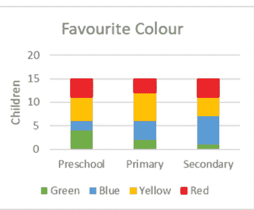

” Stacked Bar Chart “

*   [什么是 Matplotlib，如何在 Python 中使用它](https://pythonguides.com/what-is-matplotlib/)

## Matplotlib 如何绘制堆积条形图

当我们在一个类别中有多组数据时，我们可以对每组数据进行挂钩，并调整一个接一个的条形。

堆积条形图中条形图的高度取决于各组结果的组合高度。或者我们可以说是每个条的高度之和。

在**条函数**中绘制堆积条形图，**底部参数**非常重要。因为我们必须一个接一个地拖动棒，所以下一个棒的**底部等于前一个棒**的**值。**

**以下步骤用于在 matplotlib 中绘制堆积条形图，概述如下:**

*   **定义库:**导入所需的重要库(用于数据创建和操作:Numpy 和 Pandas，用于数据可视化:来自 matplotlib 的 pyplot)。
*   **定义 X 轴和 Y 轴:**定义用于 X 轴和 Y 轴的数据坐标值，或者我们可以说 X 轴和条形高度。
*   **绘制条形图:**通过使用 `bar()` 的方法我们可以绘制条形图。
*   **设置底部:**设置下一个条形的底部等于前一个条形的值。
*   **生成绘图:**使用 `show()` 方法在用户窗口上可视化绘图。

阅读[如何安装 matplotlib python](https://pythonguides.com/how-to-install-matplotlib-python/)

## 堆积条形图 matplotlib 示例

这里我们绘制了不同班级学生之间的堆积条形图。学生分成两堆，女生和男生。

**代码:**

```py
**# Import Library** import matplotlib.pyplot as plt

**# Define Data** Class = ["First", "Second", "Third", "Fourth", "Fifth"]
Boys = [15, 20, 16, 18, 25]
Girls = [10, 12, 5, 9, 15]

**# Define width of stacked chart** 
w = 0.6

**# Plot stacked bar chart** plt.bar(Class, Boys, w)
plt.bar(Class, Girls, w, bottom=Boys)

**# Display** 
plt.show()
```

*   在上面的例子中，我们导入 `matplotlib.pyplot` 库进行数据可视化。
*   在此之后，我们定义用于绘图的**数据**和堆积条形图的**宽度**。
*   然后，通过使用 `plt.bar()` 方法，我们绘制一个条形图，并将**底部**定义为一个参数，以便条形图一个接一个地绘制。
*   为了在用户屏幕上可视化图表，我们使用 `plt.show()` 方法。

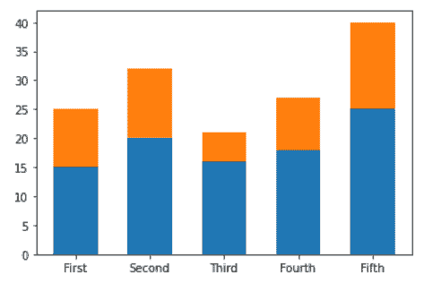

*” Output of code: Stacked bar chart “*

*   [modulenotfounderror:没有名为“matplotlib”的模块](https://pythonguides.com/no-module-named-matplotlib/)

## 带标签的堆积条形图 matplotlib

在本节中，我们将学习如何在 matplotlib 中创建带标签的堆积条形图。

要在 **x 轴**和 **y 轴**上添加标签，我们必须分别使用 `plt.xlabel()` 和 `plt.ylabel()` 方法。

**添加标签的方法如下:**

```py
**# To add labels on x-axis** 
matplotlib.pyplot.xlabel(xlabel, fontdict=None,    
                         labelpad=None, loc=None, **kwargs)

**# To add labels on y-axis** 
matplotlib.pyplot.ylabel(ylabel, fontdict=None,    
                        labelpad=None, loc=None, **kwargs) 
```

**上面使用的参数是:**

*   **xlabel 和 ylabel:** 指定标签文本。
*   **labelpad:** 指定间距。
*   **loc:** 指定标签的位置。
*   **kwargs:** 更多文本属性。

**让我们看一个带标签的堆积条形图的例子:**

```py
**# Import Library** 
import matplotlib.pyplot as plt

**# Define Data** 
Class = ["First", "Second", "Third", "Fourth", "Fifth"]
Pass = [30, 33, 20, 26, 15]
Fail = [1, 2, 3, 1, 4]

**# Define width of stacked chart** 
w = 0.6

**# Plot stacked bar chart**

plt.bar(Class, Pass, w)
plt.bar(Class, Fail, w, bottom=Pass)

**# Add labels** 
plt.xlabel("Classes")
plt.ylabel("No.of students")

**# Display** 
plt.show()
```

*   在上面我们使用 `plt.bar()` 方法和 `bottom` 参数来绘制堆积条形图。
*   之后我们使用 `plt.xlabel()` 方法来定义 x 轴标签。
*   `plt.ylabel()` 方法用来定义 y 轴代表什么或者我们可以说 y 轴标签被定义了。

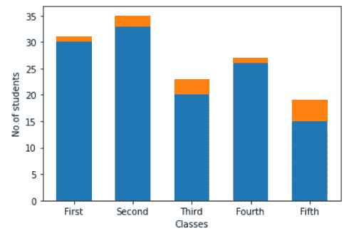

plt.xlabel() and plt.ylabel()

读取 [Matplotlib 绘制一条线](https://pythonguides.com/matplotlib-plot-a-line/)

## 堆积条形图图例 matplotlib

在本节中，我们将学习如何在 matplotlib 中创建一个带图例的堆积条形图。要添加图例，请使用 `plt.legend()` 方法。

**添加图例的语法如下:**

```py
matplotlib.pyplot.legend()
```

**我们来看一个例子:**

```py
**# Import Library** 
import matplotlib.pyplot as plt

**# Define Data** 
Class = ["First", "Second", "Third", "Fourth", "Fifth"]
Male = [15, 20, 16, 18, 25]
Female = [10, 12, 5, 9, 15]

**# Define width of stacked chart** 
w = 0.6

**# Plot stacked bar chart** 
plt.bar(Class, Male, w, label='Male')
plt.bar(Class, Female, w, bottom=Male, label='Female')

**# Add labels** 
plt.xlabel("Classes")
plt.ylabel("Students")

**# Add legend** 
plt.legend()

**# Display** 
plt.show()
```

*   在上面的例子中，我们绘制了学生和班级之间的堆积条形图。这里学生酒吧分为男性和女性两类。
*   这里，我们在一个 `bar()` 方法中将**标签**作为参数传递，并设置要打印的标签文本。
*   `plt.legend()` 方法用于给绘图添加一个图例。

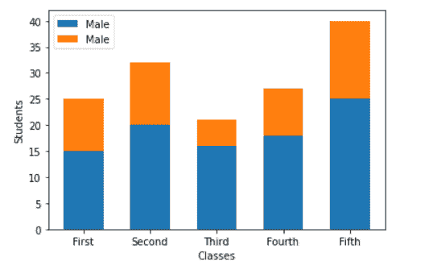

plt.legend()

读取 [Matplotlib 两个 y 轴](https://pythonguides.com/matplotlib-two-y-axes/)

## 堆积条形图 matplotlib 颜色

在这里，我们将学习如何在 matplotlib 中改变堆积条形图中堆积条形图的颜色。绕过**颜色**到**条()**的方法我们可以很容易地改变颜色。

**改变条形颜色的语法如下:**

```py
matplotlib.pyplot.bar(x, height, bottom, color)
```

**上面使用的参数是:**

*   **x:** 指定 x 轴
*   **高度:**指定 y 轴。
*   **bottom:** 指定绘制另一个条形的数值。
*   **颜色:**指定颜色。

**让我们来看一个改变堆积条形图的颜色的例子:**

```py
**# Import Library** 
import matplotlib.pyplot as plt
import numpy as np
from matplotlib.pyplot import figure

**# Set figure size** 
figure(figsize=(9,6))

**# Define Data** 
x = ['Class 1', 'Class 2', 'Class 3', 'Class 4', 'Class 5']
A = np.array([35, 30, 29, 28, 26])
B = np.array([10, 15, 16, 9, 11])
C = np.array([5, 6, 9, 10, 8])
D = np.array([2, 1, 3, 2, 1])

**# Plot stacked bar chart
**     
plt.bar(x, A, color='cyan', label='A')
plt.bar(x, B, bottom=A, color='green', label='B')
plt.bar(x, C, bottom=A+B, color='red', label='C')
plt.bar(x, D, bottom=A+B+C, color='yellow', label='D')

**# Define labels
**     
plt.xlabel("Classes")
plt.ylabel("Students")

**# Add legend
**     
plt.legend(loc=1)

**# Display** 
plt.show()
```

*   在上面的例子中，我们导入了 `matplotlib.plot` 、 `numpy` 和**图**库。
*   接下来，我们使用 numpy 的 `figure()` 方法设置 figsize，使用 `array()` 方法定义数据。
*   然后通过使用 `plt.bar()` 方法，并通过将**底部**作为参数来绘制堆积条形图。
*   这里我们也将 `color` 作为参数传递给 `plt.bar()` 方法来改变堆栈的颜色。
*   `plt.xlabel()` 和 `plt.ylabel()` 方法分别用于添加 **x 轴**标签和 **y 轴**标签。
*   `plt.legend()` 方法用于给绘图添加图例。
*   `plt.show()` 方法用于在用户屏幕上可视化绘图。

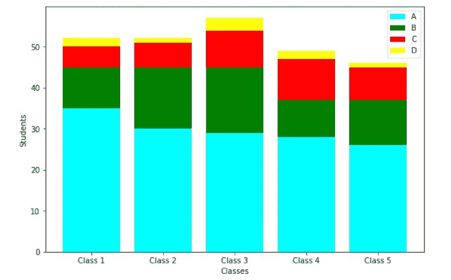

plt.bar(color=None)

又念，[水平线 matplotlib](https://pythonguides.com/horizontal-line-matplotlib/)

## 堆积条形图熊猫数据框

在这里，我们将学习如何使用 pandas dataframe 创建堆积条形图。首先，你必须知道如何在熊猫中创建数据帧。

**在 pandas 中创建数据帧的语法:**

```py
class pandas.DataFrame(data=None, index=None, columns=None, dtype=None, copy=None)
```

**上面使用的参数是:**

*   **数据:**指定数据。
*   **索引:**指定一个索引。
*   **列:**指定结果帧的列。
*   **数据类型:**指定数据类型。
*   **复制:**从输入中复制数据。

**让我们来看一个使用 pandas dataframe 创建堆积条形图的例子:**

```py
**# Import Library**

import matplotlib.pyplot as plt
import numpy as np
import pandas as pd

**# Create Dataframe**

df = pd.DataFrame([['A', 10, 12, 2, 20], 
                  ['B', 10, 23, 12, 18],
                  ['C', 12, 15, 19, 6],
                  ['D', 10, 18, 11, 19]],
     columns=['Team', 'C++', 'Java', 'Python', 'Php'])

**# View Data**

print(df)

**# Plot stacked bar chart**

df.plot(x='Team', kind='bar', stacked=True,
        title='Stacked Bar Chart Pandas Dataframe', 
        figsize=(12,6))

**# Rotate tick label** 
plt.xticks(rotation='horizontal')

**# Show** 
plt.show()
```

*   在上面的例子中，我们导入了 `matplotlib.pyplot` 、 `numpy` 和 `pandas` 库。
*   之后，我们使用熊猫的 `DataFrame()` 方法创建数据。
*   然后，打印数据帧，并使用 `plot()` 方法绘制堆积条形图。
*   `plt.xticks()` 方法用于创建刻度标签，**旋转**参数用于旋转刻度标签我们将其设置为**水平**。

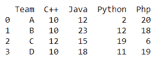

print(df)

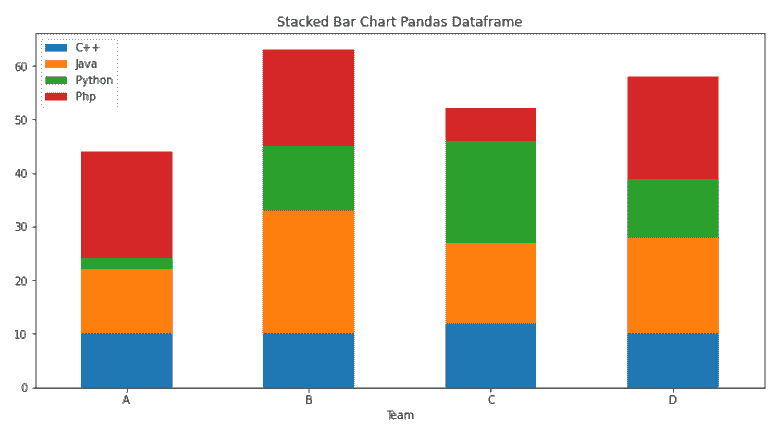

pd.DataFrame()

读取[绘制垂直线 matplotlib](https://pythonguides.com/draw-vertical-line-matplotlib/)

## 使用 for 循环的堆积条形图

在这里，我们学习使用 Python matplotlib 中的 for 循环创建一个堆叠条形图。

**我们来看一个例子:**

```py
**# Import Library**

import numpy as np
import matplotlib.pyplot as plt

**# Define Data**

data = np.array([[5, 15, 12, 10, 7, 6],
                 [10, 19, 13, 9, 6, 9],
                 [4, 8, 6, 8, 3, 7],
                 [6, 9, 4, 3, 15, 19],
                 [9, 15, 19, 16, 8, 6]])

list = ['red','blue', 'yellow','pink','cyan','orange']

**# For loop for creating stacked bar chart** 
X = np.arange(data.shape[1])
for i in range(data.shape[0]):
    plt.bar(X, data[i],bottom = np.sum(data[:i], 
            axis =0),color = list[i % len(list)] )

**# Display**

plt.show()
```

*   在上面的例子中，我们导入了 `matplotlib.pyplot` ， `numpy` 库。
*   然后我们将数据存储在 NumPy 数组中。
*   接下来，我们迭代每一行数据。这里对于**底部**参数，第 I 行接收所有行的总和。
*   `plt.bar()` 方法用于创建堆积条形图。

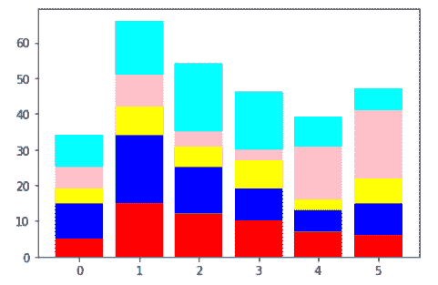

*” Stacked bar chart using for loop “*

读取 [Matplotlib 反转 y 轴](https://pythonguides.com/matplotlib-invert-y-axis/)

## Matplotlib 带值的堆积条形图

这里我们将使用 matplotlib 创建一个带有数值的堆积条形图。

**让我们来看一个带有数值的堆积条形图示例:**

```py
**# Import libraries** 
import matplotlib.pyplot as plt
import pandas as pd

**# Define Data** 
df = pd.DataFrame({
    'Male': [35, 20, 43, 12, 19],
    'Female': [20, 11, 18, 6, 9]
 })

Class = ["Fisrt","Second","Third","Fourth","Fifth"]

**# Plot stacked bar chart** 
ax = df.plot(stacked=True, kind='bar')

for bar in ax.patches:
    height = bar.get_height()
    width = bar.get_width()
    x = bar.get_x()
    y = bar.get_y()
    label_text = height
    label_x = x + width / 2
    label_y = y + height / 2
    ax.text(label_x, label_y, label_text, ha='center',    
            va='center')

**# Set Tick labels** 
ax.set_xticklabels(Class,rotation='horizontal')

**# Display chart** 
plt.show()
```

*   在上面的例子中，我们导入了 `matplotlib.pyplot` 和 `pandas` 库。
*   在这之后，我们创建了**数据帧**并定义了一个**类**的列表。
*   然后通过使用 `plot()` 方法绘制堆积条形图。
*   定义**为面片中的循环**和**面片**组成图表内的一切。
*   通过使用 `get_height()` 和 `get_width()` 方法得到高度和宽度。
*   最后，我们使用 `text()` 方法来定义每个堆叠条形的高度，或者我们可以说是向条形添加值。

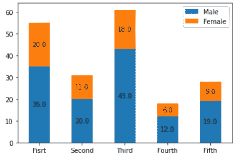

*” Stacked bar chart with values “*

读取[将图例放在绘图 matplotlib 外](https://pythonguides.com/put-legend-outside-plot-matplotlib/)

## Matplotlib 带负值的堆积条形图

这里我们将使用 Python matplotlib 绘制一个具有负值的堆积条形图。

**我们来看一个例子:**

```py
**# Import Library** 
import matplotlib.pyplot as plt
import numpy as np
from matplotlib.pyplot import figure

**# Set figure size** 
figure(figsize=(9,6))

**# Define Data** 
x = np.arange(3)
y1 = np.array([4, -6, -4])
y2 = np.array([2, -4, -2])
y3 = np.array([3, -3, -5])
y4 = np.array([4, -2, -3])

**# Plot stacked bar chart
**     
plt.bar(x, y1, color='cyan')
plt.bar(x, y2, bottom=y1, color='green')
plt.bar(x, y3, bottom=y1+y2, color='red')
plt.bar(x, y4, bottom=y1+y2+y3, color='yellow')

**# Define labels
**     
plt.xlabel("X-axis")
plt.ylabel("Y-axis")

**# Display** 
plt.show()
```

*   在上面的例子中，我们使用 numpy 的 `array()` 方法定义数据，定义的数据有负值。
*   `plt.bar()` 方法用于绘制条形图，我们将**底部**作为参数传递，使其成为一个堆叠条形图。

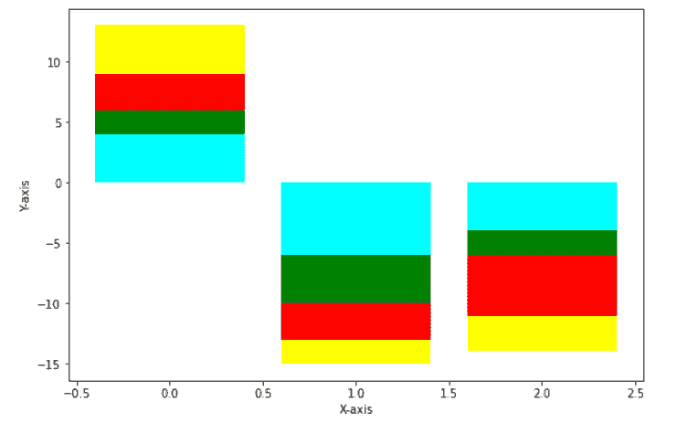

*” Stacked bar chart with negative values “*

阅读 [Matplotlib 另存为 pdf](https://pythonguides.com/matplotlib-save-as-pdf/)

## Matplotlib 堆积条形图错误

在本节中，我们将学习如何绘制有误差的堆积条形图。

**让我们看一个例子，我们绘制一个有误差的堆积条形图:**

```py
**# Import Library** 
import matplotlib.pyplot as plt
import numpy as np

**# Define Data** 
x = [5, 4, 9]
y = [2, 3, 3]
z = [7, 6, 8]

**# Error bars** 
x_error = np.std(x)
y_error = np.std(y)
z_error = np.std(z)

ind = np.arange(len(bars))
bar_padding = np.add(x, y).tolist()

**# Standard Bar Chart** plt.bar(ind, x, yerr=x_error)
plt.bar(ind, y, yerr=y_error, bottom=x)
plt.bar(ind, z, yerr=z_error, bottom=bar_padding)

**# Display chart** 
plt.show()
```

*   在上面的例子中，我们导入了 `matplotlib.pyplot` 和 `numpy` 库。
*   然后我们定义数据和错误。
*   接下来，通过使用 `plt.bar()` 方法我们绘制堆叠条形图，并将**底部**作为参数传递。

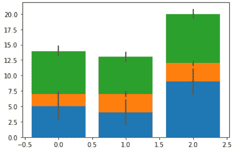

*” Stacked bar chart with errors “*

读取 [Matplotlib 标题字体大小](https://pythonguides.com/matplotlib-title-font-size/)

## matplotlib 中的水平堆积条形图

为了在 matplotlib 中创建一个水平堆叠条形图，我们使用了 `barh()` 方法，并且我们传递了 `left` 作为该方法的参数，而不是 `bottom` 参数。

**绘制水平堆积条形图的语法:**

```py
matplotlib.pyplot.barh(y, width, height=0.8, left=none, align='center', **kwargs)
```

**使用的参数描述如下:**

*   **y:** 指定 Y 轴的坐标。
*   **宽度:**指定条形的宽度。
*   **高度:**指定条形的高度。
*   **左:**指定 x 坐标。

**我们来看一个例子:**

```py
**# Import Library**

import matplotlib.pyplot as plt

**# Define Data**

Class = ["First", "Second", "Third", "Fourth", "Fifth"]
Boys = [15, 20, 16, 18, 25]
Girls = [10, 12, 5, 9, 15]

**# Define height of stacked chart** 
h = 0.6

**# Plot stacked bar chart**

plt.barh(Class, Boys, w)
plt.barh(Class, Girls, w, left=Boys)

**# Display**

plt.show()
```

*   在上面的例子中，我们导入了 `matplotlib.pyplot` 库。
*   在这之后，我们定义条的数据和高度的**。**
*   然后通过使用 `plt.barh()` 方法我们绘制一个条形图，并绕过**左侧**作为参数我们将其创建到堆叠图中。

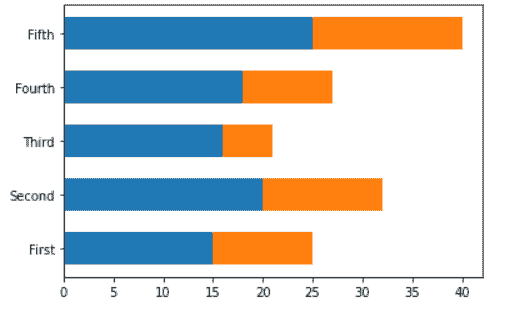

plt.barh()

您可能还会喜欢以下 Python Matplotlib 教程:

*   [Matplotlib 默认图形尺寸](https://pythonguides.com/matplotlib-default-figure-size/)
*   [Matplotlib savefig 空白图像](https://pythonguides.com/matplotlib-savefig-blank-image/)
*   [Matplotlib 另存为 png](https://pythonguides.com/matplotlib-save-as-png/)
*   [Matplotlib 设定轴范围](https://pythonguides.com/matplotlib-set-axis-range/)
*   [Python 使用 Matplotlib 绘制多条线](https://pythonguides.com/python-plot-multiple-lines/)
*   [Matplotlib 条形图标签](https://pythonguides.com/matplotlib-bar-chart-labels/)

在本 Python 教程中，我们已经讨论了**“堆积条形图 matplotlib”**，并且我们还介绍了一些与之相关的例子。这些是我们在本教程中讨论过的以下主题。

*   堆积条形图 matplotlib
*   如何绘制堆积条形图
*   堆积条形图 matplotlib 示例
*   带标签的堆积条形图 matplotlib
*   堆积条形图图例 matplotlib
*   堆积条形图 matplotlib 颜色
*   堆积条形图熊猫数据框
*   使用 for 循环的堆积条形图
*   带数值的 Matplotlib 堆积条形图
*   带有负值的 Matplotlib 堆积条形图
*   Matplotlib 堆叠条形图错误
*   matplotlib 中的水平堆积条形图

[Bijay Kumar](https://pythonguides.com/author/fewlines4biju/)

Python 是美国最流行的语言之一。我从事 Python 工作已经有很长时间了，我在与 Tkinter、Pandas、NumPy、Turtle、Django、Matplotlib、Tensorflow、Scipy、Scikit-Learn 等各种库合作方面拥有专业知识。我有与美国、加拿大、英国、澳大利亚、新西兰等国家的各种客户合作的经验。查看我的个人资料。

[enjoysharepoint.com/](https://enjoysharepoint.com/)[](https://www.facebook.com/fewlines4biju "Facebook")[](https://www.linkedin.com/in/fewlines4biju/ "Linkedin")[](https://twitter.com/fewlines4biju "Twitter")