# Python 3 字符串方法及示例

> 原文：<https://pythonguides.com/string-methods-in-python/>

[](https://sharepointsky.teachable.com/p/python-and-machine-learning-training-course)

在本 [Python 教程](https://pythonguides.com/learn-python/)中，我们将通过几个例子讨论各种 **Python 3 string 方法**。这些都是 python 中各种**字符串操作的内置方法。我们将讨论下面的方法和一些 **python 字符串程序**。**

*   Python 字符串 title()方法
*   Python 字符串 casefold()方法
*   Python 字符串中心()方法
*   Python 字符串 isdigit()方法
*   Python 字符串连接()方法
*   Python 字符串 zfill()方法
*   Python 字符串交换()方法
*   Python 字符串 splitlines()方法
*   Python 字符串 rsplit()方法
*   Python 字符串 isspace()方法
*   Python 字符串 lower()方法
*   Python sting istrip()方法
*   Python string strip()方法
*   Python 示例中的字符串操作
*   如何在 python 中找到字符串的长度
*   Python 计算字符串中的字符数
*   Python 重复字符串 n 次

目录

[](#)

*   [Python 3 string methods()](#Python_3_string_methods "Python 3 string methods()")
    *   [Python string title()方法](#Python_string_title_method "Python string title() method")
    *   [Python 字符串 casefold()方法](#Python_string_casefold_method "Python string casefold() method")
    *   [Python 字符串中心()方法](#Python_string_center_method "Python string center() method")
    *   [Python 中的 String isdigit()方法](#String_isdigit_method_in_Python "String isdigit() method in Python")
    *   [Python 字符串连接()方法](#Python_string_join_method "Python string join() method")
    *   [Python 字符串 zfill()方法](#Python_string_zfill_method "Python string zfill() method")
    *   [Python string swapcase()方法](#Python_string_swapcase_method "Python string swapcase() method")
    *   [Python 字符串 splitlines()方法](#Python_string_splitlines_method "Python string splitlines() method")
    *   [Python 字符串 rsplit()方法](#Python_string_rsplit_method "Python string rsplit() method")
    *   [Python 字符串 isspace()方法](#Python_string_isspace_method "Python string isspace() method")
    *   [Python sting istrip()方法](#Python_sting_istrip_method "Python sting istrip() method")
    *   [Python 字符串 lower()方法](#Python_string_lower_method "Python string lower() method")
    *   [Python 字符串 lstrip()方法](#Python_string_lstrip_method "Python string lstrip() method")
*   [Python 示例中的字符串操作](#String_operations_in_Python_Examples "String operations in Python Examples")
    *   [如何在 python 中找到一个字符串的长度](#How_to_find_length_of_a_string_in_python "How to find length of a string in python")
    *   [Python 计算字符串中的字符数](#Python_count_characters_in_a_string "Python count characters in a string")
    *   [Python 重复字符串 n 次](#Python_repeat_string_n_times "Python repeat string n times")
*   [Python string upper()方法](#Python_string_upper_method "Python string upper() method")
*   [Python 字符串 lower()方法](#Python_string_lower_method-2 "Python string lower() method")
*   [Python strip()方法](#Python_string_strip_method "Python string strip() method")
*   [Python 字符串替换()方法](#Python_string_replace_method "Python string replace() method")
*   [Python 中的 split()方法](#split_method_in_Python "split() method in Python")
*   [Python count()方法](#Python_count_method "Python count() method")
    *   [Python 字符串中心()方法](#Python_string_center_method-2 "Python string center() method")

## Python 3 string methods()

Python 为 Python 中的各种字符串操作提供了很多内置函数或方法。让我们看看 Python 字符串方法的例子。

阅读:[Python 中的切片字符串+示例](https://pythonguides.com/slicing-string-in-python/)

### Python string title()方法

Python `title()` string 方法用于将每个单词的第一个字符转换为大写，其余字符转换为字符串中的小写。

**举例:**

```py
msg = "welcome to python"
s = msg.title()
print(s)
```

写完上面的代码(字符串标题方法 python)，你将打印出 `" s "` ，然后输出将显示为**"欢迎使用 Python"** 。这里，title()方法用于将每个单词的字符串首字符转换为大写。

关于 **string title()方法 python** ，可以参考下面的截图。

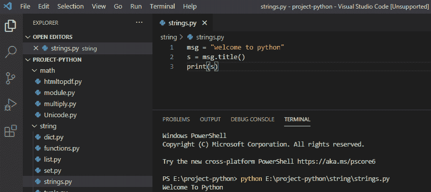

String title() method

*   [如何在 python 中使用正则表达式拆分字符串](https://pythonguides.com/python-split-string-regex/)
*   [如何在 python 中连接字符串](https://pythonguides.com/concatenate-strings-in-python/)
*   [如何在 python 中把整数转换成字符串](https://pythonguides.com/convert-an-integer-to-string-in-python/)
*   [Python 将列表转换成字符串](https://pythonguides.com/python-convert-list-to-string/)

### Python 字符串 casefold()方法

在 python 中，我们可以使用 `casefold()` string 方法将所有大写字符转换成小写。这里，casefold 方法返回所有字符都是小写的字符串。

**举例:**

```py
msg = "Welcome To Python"
s = msg.casefold()
print(s)
```

写完上面的代码(字符串 casefold 方法 python)，你将打印出 `" s "` ，然后输出将显示为**"欢迎使用 python"** 。这里，casefold()方法返回一个字符串，其中所有字符都是小写字母。

你可以参考下面的截图了解字符串 casefold 的方法

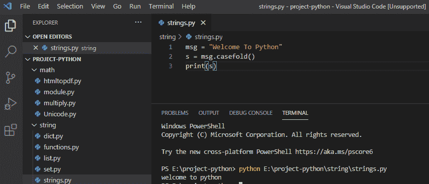

Python string casefold() method

### Python 字符串中心()方法

python string center()方法将返回指定大小的居中字符串。这里，center()方法将使字符串居中对齐。

**举例:**

```py
msg = "Welcome"
s = msg.center(50)
print(s)
```

写完上面的代码(字符串中心方法 python)，你将打印出 `" s "` ，然后输出将显示为**"欢迎"**。这里，center()方法将指定大小的字符串居中对齐。

你可以参考下面的字符串中心方法 python 的截图

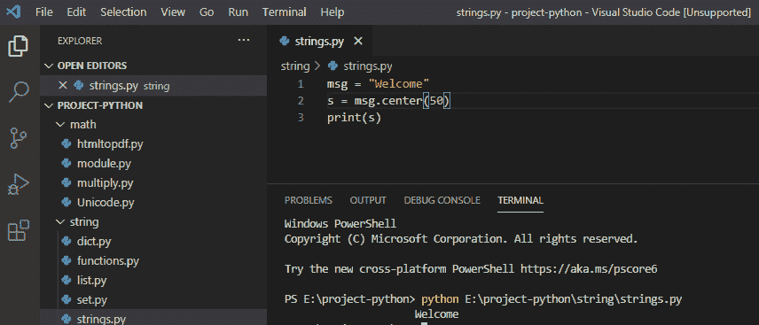

Python string center() method

### Python 中的 String isdigit()方法

在 python 中， `isdigit()` 方法会检查字符串是否只包含数字。如果它只包含数字，那么它将返回真，否则返回假。

**举例:**

```py
msg = "150297"
s = msg.isdigit()
print(s)
```

写完上面的代码(string isdigit method python)，你将打印出 `" s "` ，然后输出将显示为 `" True "` 。这里，isdigit()方法将返回 true，因为该字符是一个数字。

可以参考下面截图字符串 isdigit 方法 python。

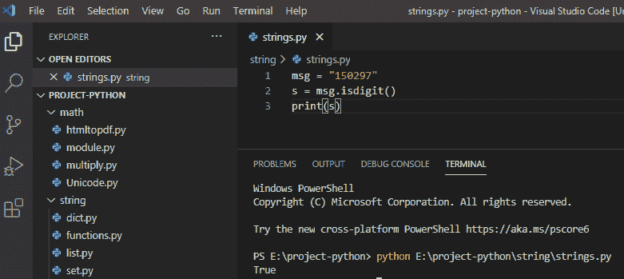

Python string isdigit() method

### Python 字符串连接()方法

在 python 中， `join()` 方法通过使用**“@”**字符作为分隔符将所有项目连接成一个字符串。

**举例:**

```py
msg = ("Joe", "ricky", "stephen")
s = "@".join(msg)
print(s)
```

写完上面的代码(字符串连接方法 python)，你将打印出 `" s "` ，然后输出将显示为**"乔@里基@斯蒂芬"**。这里，join()方法通过使用“@”字符作为分隔符将所有元组连接成一个字符串。

Python 中的 **string join()方法可以参考下面的截图。**

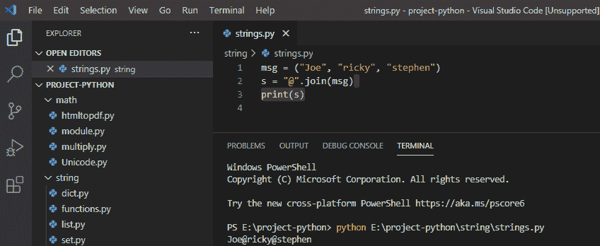

Python string join() method

### Python 字符串 zfill()方法

让我们看看，如何使用 **Python 字符串 zfill()方法**。

在 python 中，**【zfill()**方法返回字符串的副本，从左边的零开始，直到它是 5 个字符。

**举例:**

```py
msg = "20"
s = msg.zfill(5)
print(s)
```

写完上面的代码(string zfill 方法 python)，你将打印出 `" s "` ，然后输出将显示为 `" 00020 "` 。这里，zfill()方法将返回从左侧开始直到其指定长度的带有“0”字符的字符串副本。

关于**字符串 zfill 方法 python** 可以参考下面的截图。

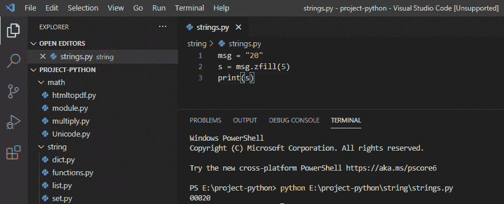

String zfill() method in python

*   [从字符串 Python 中删除字符](https://pythonguides.com/remove-character-from-string-python/)
*   [如何在 Python 中处理 indexerror:字符串索引超出范围](https://pythonguides.com/indexerror-string-index-out-of-range-python/)

### Python string swapcase()方法

**Python string swapcase()方法**将给定字符串的所有小写字符转换为大写，所有大写字符转换为小写。

**举例:**

```py
msg = "Hello welcome to Python"
s = msg.swapcase()
print(s)
```

写完上面的代码(字符串交换方法 python)，你将打印出 `" s "` ，然后输出将显示为`" hello WELCOME TO pYTHON "`。这里，swapcase()方法返回所有大写字母都是小写的字符串，反之亦然。

你可以参考下面的字符串交换方法 python 的截图

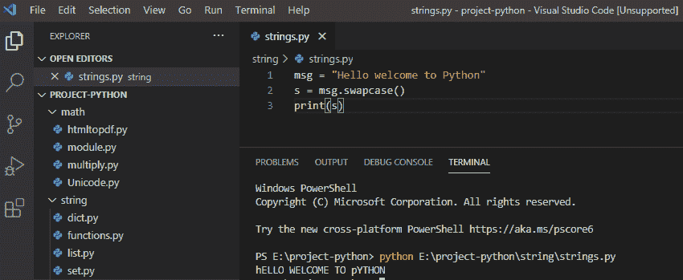

String swapcase() method python

### Python 字符串 splitlines()方法

Python string splitlines()方法用于将换行符处的字符串拆分到列表中。

**举例:**

```py
msg = "Welcome to python\nNew to python"
s = msg.splitlines()
print(s)
```

编写上述代码(string splitlines 方法 python)后，您将打印出 `" s "` ，然后输出将显示为 **" ['欢迎使用 python '，' python 新手'] "** 。这里，splitlines()方法用于在换行符处拆分字符串。

你可以参考下面的字符串 splitlines 方法 python 的截图

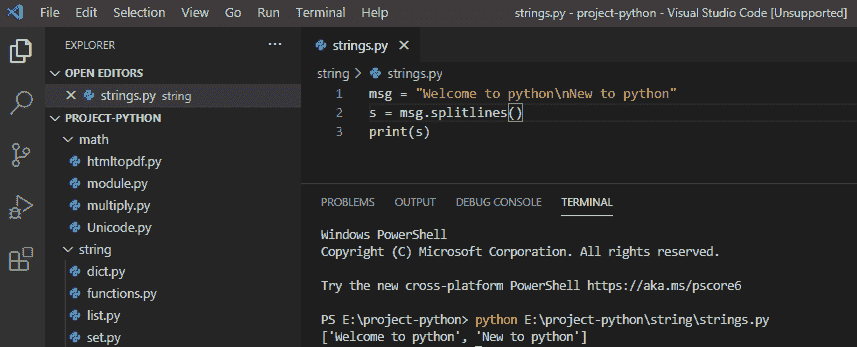

Python string splitlines() method

### Python 字符串 rsplit()方法

**Python string rsplit()方法**会用指定的分隔符将字符串从右边拆分成列表。

**举例:**

```py
msg = "vanilla, chocolate, strawberry"
s = msg.rsplit()
print(s)
```

写完上面的代码(string rsplit 方法 python)，你将打印出 `" s "` ，然后输出将显示为 **" ['香草'，'巧克力'，'草莓'] "** 。这里，rsplit()方法用于将字符串拆分成列表。

你可以参考下面的字符串 rsplit 方法 python 的截图

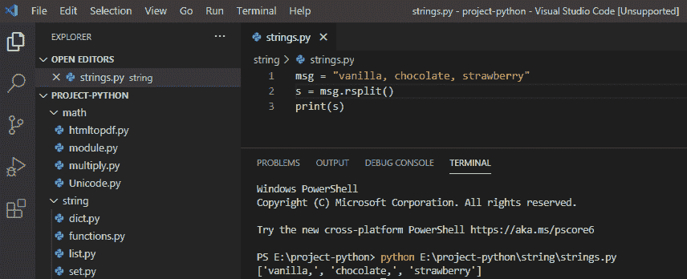

Python string rsplit() method

### Python 字符串 isspace()方法

如果字符串中只有空白字符，Python string isspace()方法将返回 true，否则将返回 false。

**举例:**

```py
msg = "     "
s = msg.isspace()
print(s)
```

写完上面的代码(string isspace method python)，你将打印出 `" s "` ，然后输出将显示为 `" True "` 。这里，isspace()方法用于检查字符串中的空白字符。

你可以参考下面的字符串空间方法 python 的截图

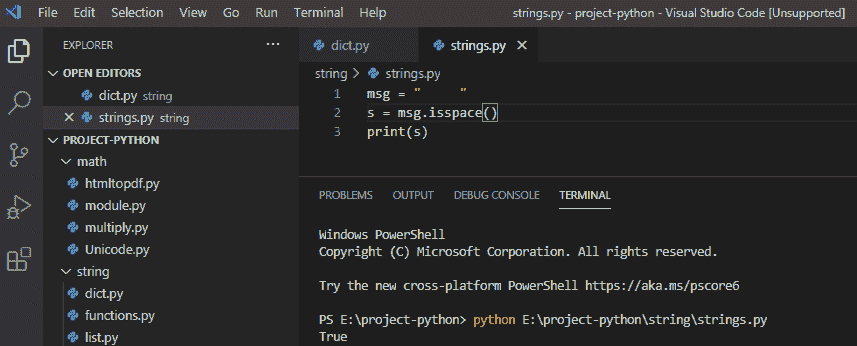

Python string isspace() method

### Python sting istrip()方法

`strip()` 函数是 python 中的**内置函数**。它用于删除字符串开头和结尾的空白，并返回没有空白的原始字符串。

**举例:**

```py
car_name = "       BMW X3    "
r = car_name.strip()
print("My fav car is",r)
```

写完上面的代码(strip 在 python 中是做什么的)，你将打印出**“r”**，然后输出将显示为**“我最喜欢的车是宝马 X3”**。在这里，`strip()`方法被用来删除开头和结尾的空白。

你可以参考下面的截图，strip 在 python 中是做什么的

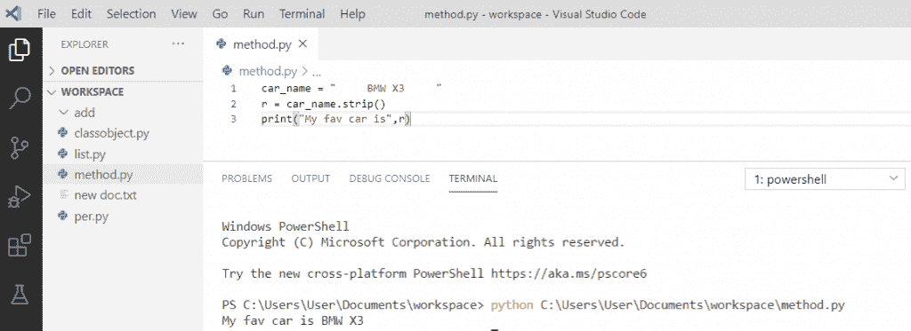

Python sting istrip() method

同样，如果你想从字符串中删除前导和尾随字符，我们可以使用`strip(char)`方法。

**举例:**

```py
car_name = "#####...BMW X3`*`CC.."
r = car_name.strip('#*.c')
print("My fav car is",r)
```

写完上面的代码(python string()方法)，你将打印出 `" r "` ，然后输出将显示为**"我最喜欢的车是宝马 X3 "** 。这里，`strip(character)`方法将删除字符串中所有的前导和尾随字符。

可以参考下面截图 python string strip()方法

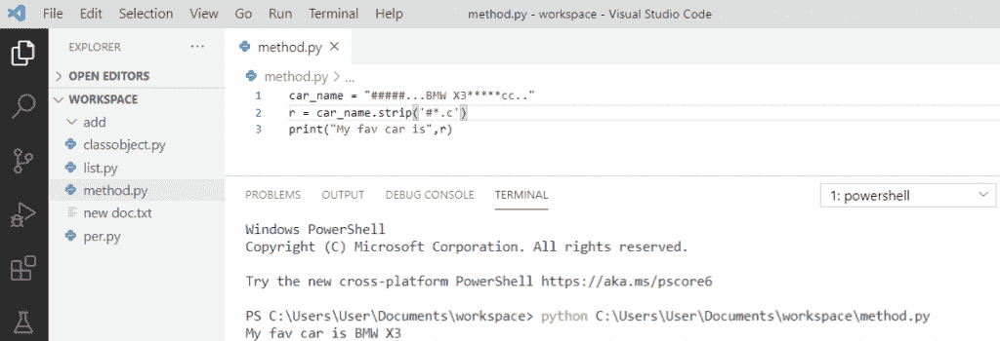

Python string strip() method

### Python 字符串 lower()方法

**Python string lower()方法**用于将字符串中的所有大写字符转换成小写字符。

**举例:**

```py
my_string = "Welcome to Python Guides"
my_string = my_string.lower()
print(my_string)
```

在编写完上面的代码(python string lower()方法)后，您将打印出**“my _ string”**，然后输出将显示为**“欢迎使用 python 指南”**。这里， `string.lower()` 方法返回一个小写的字符串。

python string lower()方法可以参考下面的截图。

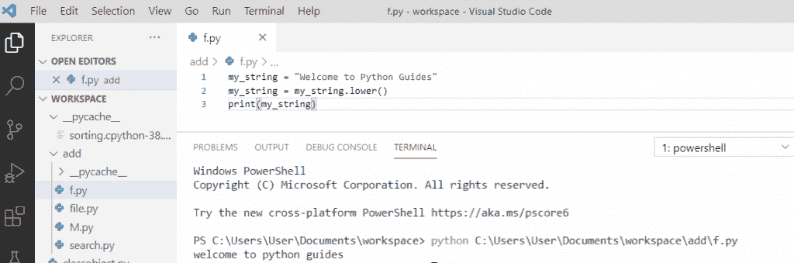

Python string lower() method

### Python 字符串 lstrip()方法

**Python strip lstrip()方法**返回一个新的字符串，从左侧移除了前导空格和指定字符。如果没有参数传递给 `lstrip()` ，那么它将删除左边的前导空格。

```py
my_str = "   ***www.pythonguides"
r = my_str.lstrip("   ***www.")
print(r)
```

写完上面的代码(python string lstrip()方法)，你将打印出 `" r "` ，然后输出将显示为 `" pythonguides "` 。这里， `lstrip()` 方法用于从字符串中删除任何前导字符或指定字符。

可以参考下面 python string lstrip()方法的截图。

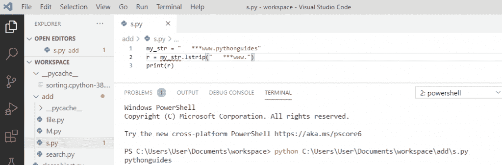

Python string lstrip() method

## Python 示例中的字符串操作

现在，让我们看看 Python 中关于**字符串操作的各种例子。**

### 如何在 python 中找到一个字符串的长度

*   使用 python 中内置的函数 `len()` ，我们可以使用 len()方法来获得 Python 中给定字符串的长度。
*   为了找到字符串的长度，内置函数 len()方法返回字符串的长度。
*   该函数可以将任何字符串值作为输入，并将整数值作为输出返回。

**举例:**

*   首先，我们需要取一个字符串值。在下面的 python 代码中，你可以看到，我把值取为**“Python”**。
*   现在打印 `"len(msg)"` ，它将返回项目的数量。

**Python 求一个字符串的长度**

下面是查找字符串长度的 python 代码。

```py
msg = 'Python'
print(len(msg))
```

*   写完上面的 Python 代码(字符串长度)，你将打印出 `"len(msg)"` ，然后输出将显示为一个 `"6"` ，它是作为输出的字符串的长度。另外，你可以参考下面的截图。

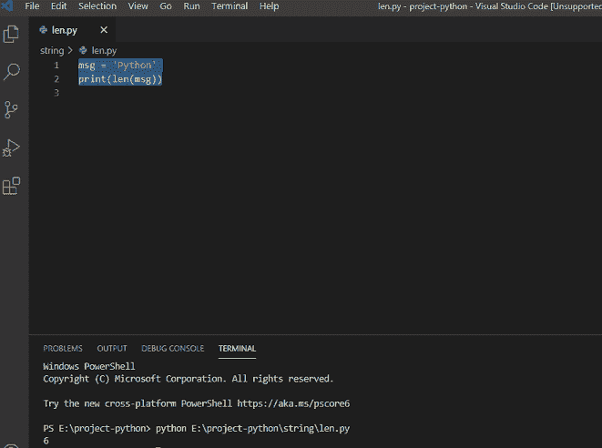

find length of a string in python

### Python 计算字符串中的字符数

在 python 中，为了计算字符串中的字符总数，我们将使用 for 循环来迭代字符串中的每个字符。

**举例:**

```py
my_string = "Hello all"
total = 0
for val in my_string:
total = total + 1
print("Total Number of Characters = ", total)
```

在编写上述 python 代码(Python 计算字符串中的字符数)后，您将打印这些代码，然后输出将显示为**“总字符数= 9”**。

这里，for 循环将迭代字符串中的每个字符，并且它将增加每个字符的总值。另外，你可以参考下面的截图

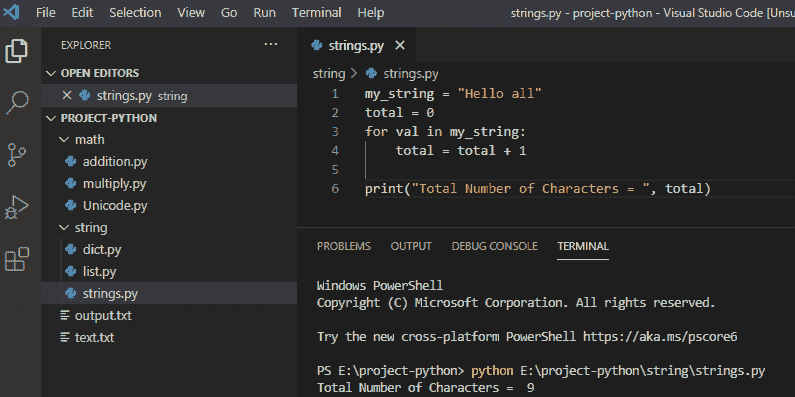

Python count characters in a string

这就是如何在 Python 中**计算一个字符串中的字符数。**

阅读: [Python 检查变量是否为数字](https://pythonguides.com/python-check-if-a-variable-is-a-number/)

### Python 重复字符串 n 次

要重复字符串 n 次，我们将使用 `" * "` 。**重复字符串的语法【string * n】**其中 n 为整数重复一个字符串 n 次。

**举例:**

```py
str_repeat = "Guides" * 5
print(str_repeat)
```

写完上面的代码(python 重复字符串 n 次)，你将打印出 `"str_repeat"` ，然后输出将显示为`" Guides Guides**Guides Guides`Guides "。**这里 n 的值是 5，字符串会重复 n 次。

你可以参考下面的截图 python 重复字符串 n 次

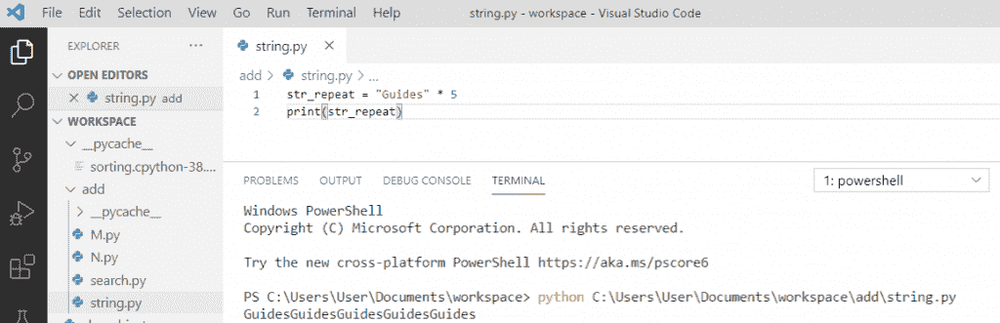

Python repeat string n times

这就是**如何在 Python** 中重复 n 次字符串。

## Python string upper()方法

可以使用 Python string `upper()` 方法返回大写的字符串。

示例:

```py
x = "pythonguides"

print(x.upper())
```

输出将是

```py
PYTHONGUIDES
```

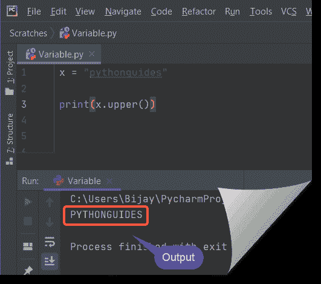

Python String Functions

## Python 字符串 lower()方法

您可以使用 `Python string lower()` 方法以小写形式返回字符串。

示例:

```py
x = "PYTHONGUIDES"

print(x.lower())
```

输出将是

```py
pythonguides
```

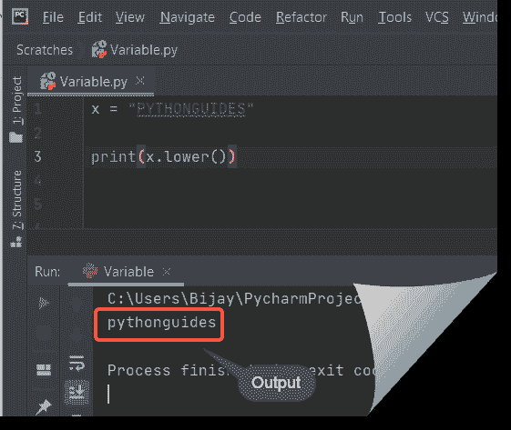

Python String Functions

## Python strip()方法

我们可以使用 Python 中的 **strip()方法删除字符串开头出现的空白。**

示例:

```py
x = "   PythonGuides"

print(x.strip())
```

现在看看这里的输出

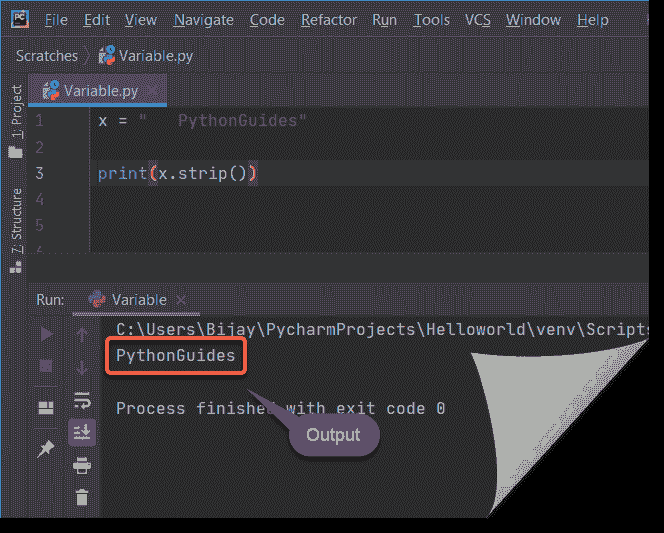

Python String strip() Functions

## Python 字符串替换()方法

可以在 Python 中使用 `replace()` 方法，用另一个字符替换一个字符串内的一个字符，或者用另一个字符串替换一个字符串。

示例:

```py
x = "I love Python"

print(x.replace("love","like")
```

输出将是

```py
I like Python
```

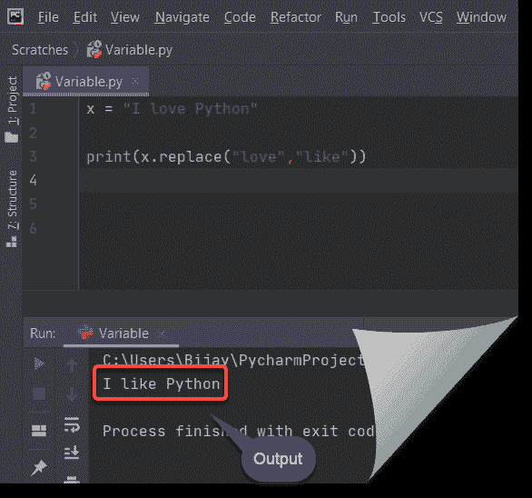

Python String replace() Functions

## Python 中的 split()方法

我们可以使用 **Python split()方法**将字符串拆分成子字符串。

示例:

```py
x = "python, guides"

print(x.split(","))
```

输出将是

```py
['python', ' guides']
```

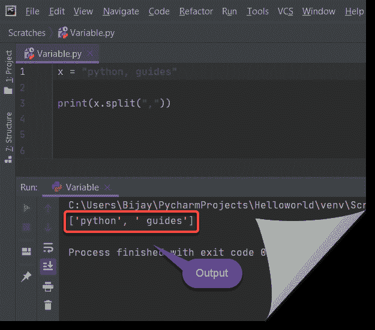

split() method in python string

## Python count()方法

我们可以使用 Python 中的 `count()` 方法来计算字符串中使用的字符数。

示例:

```py
x = "I love Python"

print(x.count('o'))
```

所以我们要问在上面的字符串中有多少时间是“o”。输出将是 2。

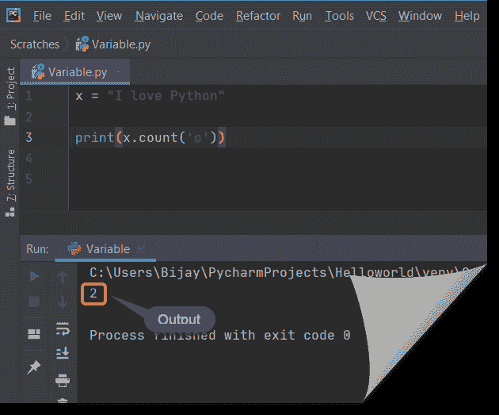

count() in python string

### Python 字符串中心()方法

我们可以使用 `Python string center()` 方法来获取居中的字符串。

例子

```py
val = "PythonGuides"

y = val.center(20,"O")

print(y)
```

输出将是

```py
OOOOPythonGuidesOOOO
```

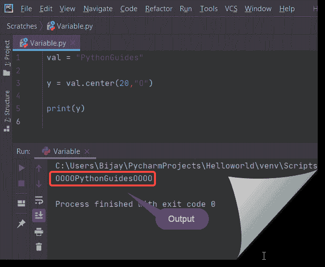

center() in python

您可能会喜欢以下 Python 教程:

*   [名称错误:Python 中没有定义名称](https://pythonguides.com/nameerror-name-is-not-defined/)
*   [Python 检查变量是否为整数](https://pythonguides.com/python-check-if-the-variable-is-an-integer/)
*   [值错误:数学域错误](https://pythonguides.com/valueerror-math-domain-error/)
*   [Python pip 不被识别为内部或外部命令](https://pythonguides.com/python-pip-is-not-recognized/)
*   [Python 3 string replace()方法示例](https://pythonguides.com/python-3-string-replace/)
*   [Python 比较字符串](https://pythonguides.com/python-compare-strings/)
*   [Python 在字符串中查找子串](https://pythonguides.com/python-find-substring-in-string/)

在这个 Python 教程中，我们学习了各种 `python 3 string methods()` 的例子。

*   Python 3 字符串方法()
*   Python 字符串 title()方法
*   Python 字符串 casefold()方法
*   Python 字符串中心()方法
*   Python 中的 String isdigit()方法
*   Python 字符串连接()方法
*   Python 字符串 zfill()方法
*   Python 字符串交换()方法
*   Python 字符串 splitlines()方法
*   Python 字符串 rsplit()方法
*   Python 字符串 isspace()方法
*   Python sting istrip()方法
*   Python 字符串 lower()方法
*   Python 字符串 lstrip()方法
*   Python 示例中的字符串操作
*   如何在 python 中找到字符串的长度
*   Python 计算字符串中的字符数
*   Python 重复字符串 n 次

[Bijay Kumar](https://pythonguides.com/author/fewlines4biju/)

Python 是美国最流行的语言之一。我从事 Python 工作已经有很长时间了，我在与 Tkinter、Pandas、NumPy、Turtle、Django、Matplotlib、Tensorflow、Scipy、Scikit-Learn 等各种库合作方面拥有专业知识。我有与美国、加拿大、英国、澳大利亚、新西兰等国家的各种客户合作的经验。查看我的个人资料。

[enjoysharepoint.com/](https://enjoysharepoint.com/)[](https://www.facebook.com/fewlines4biju "Facebook")[](https://www.linkedin.com/in/fewlines4biju/ "Linkedin")[](https://twitter.com/fewlines4biju "Twitter")