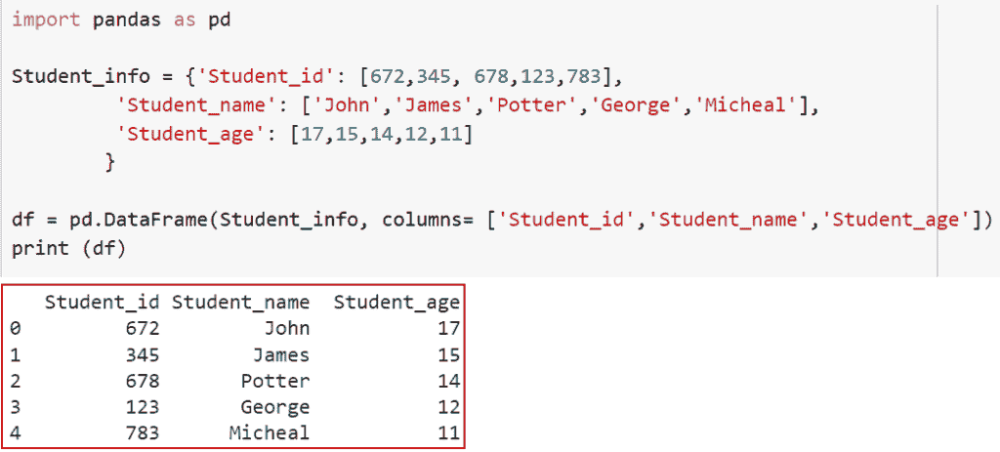
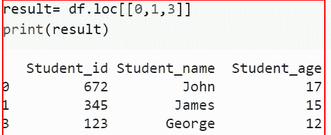
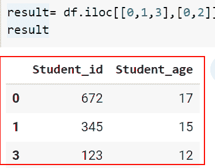
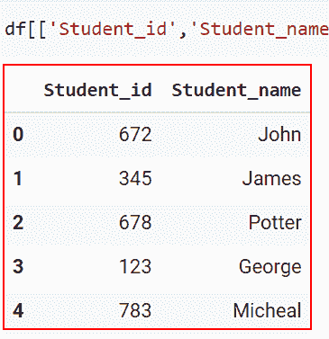
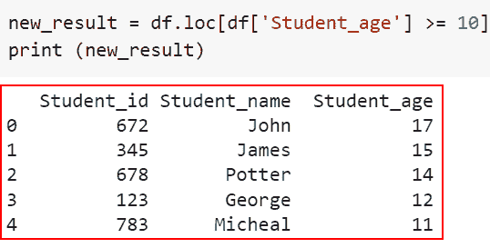

# 如何在 Python 中划分数据帧的子集

> 原文：<https://pythonguides.com/subset-a-dataframe-in-python/>

[](https://sharepointsky.teachable.com/p/python-and-machine-learning-training-course)

在这个 [Python 教程](https://pythonguides.com/python-hello-world-program/)中，我们将学习 ***如何在 Python*** 中子集化一个数据帧。为了理解各种方法，我们将使用一些内置函数来对 Python 中的数据帧进行子集化。

作为一名开发人员，在制作 Python 项目时，我得到了在 Python 中设置数据帧子集的要求。

在这里我们将看到:

*   如何使用 loc()在 Python 中对数据帧进行子集化
*   如何使用 iloc()在 Python 中子集化数据帧
*   如何在 Python 中使用索引操作符对数据帧进行子集化
*   选择 student_age 等于或大于 15 的行

目录

[](#)

*   [如何在 Python 中子集化数据帧](#How_to_Subset_a_DataFrame_in_Python "How to Subset a DataFrame in Python")
    *   [如何使用 loc()](#How_to_Subset_a_DataFrame_in_Python_using_loc "How to Subset a DataFrame in Python using loc()") 在 Python 中子集化数据帧
    *   [如何使用 iloc()在 Python 中对数据帧进行子集化](#How_to_Subset_a_DataFrame_in_Python_using_iloc "How to Subset a DataFrame in Python using iloc()")
    *   [如何在 Python 中使用索引运算符对数据帧进行子集化](#How_to_Subset_a_DataFrame_in_Python_using_Indexing_operator "How to Subset a DataFrame in Python using Indexing operator")
    *   [选择 student_age 等于或大于 15 的行](#Select_rows_where_the_student_age_is_equal_or_greater_than_15 "Select rows where the student_age is equal or greater than 15")

## 如何在 Python 中子集化数据帧

在 Python 中，主要有三种常用的方法，对于理解如何在 Python 中对数据帧进行子集化非常重要。

### 如何使用 loc() 在 Python 中子集化数据帧

*   在这一节中，我们将讨论如何使用 loc()对 Pandas 中的数据帧进行子集化。
*   从数据帧中选择一组所需的行和列的过程称为子集化。
*   借助 Python 中的 `loc()` 函数，我们可以基于特定的行、列或两者创建数据框的子集。
*   `loc()` 函数依靠标签来选择和生成定制的子集，因此我们必须为它提供行或列的标签。
*   首先在这个例子中，我们将创建一个数据帧，为此我们将使用 Python 中的 `pd.dataframe()` 函数。

**注意:**我们必须先创建一个数据帧，然后才能创建它的子集。首先，让我们把它弄清楚。

```py
import pandas as pd

Student_info = {'Student_id': [672,345, 678,123,783],
         'Student_name': ['John','James','Potter','George','Micheal'],
         'Student_age': [17,15,14,12,11]
        }

df = pd.DataFrame(Student_info, columns= ['Student_id','Student_name','Student_age'])
print (df)
```

下面是下面给出的代码的截图。



How to create a student dataframe in Python Pandas

在这种情况下，[熊猫](https://pythonguides.com/pandas-in-python/)用于生成数据帧。DataFrame()技术。

通过提供列的标签和行的索引，Python 中的 `loc()` 方法也可以用于更改与列相关的行的值。

**语法:**

下面是 Python Pandas 中 loc()方法的语法

```py
dataframe.loc[row index,['column-names']] = value
```

**举例:**–

让我们举一个例子，看看如何使用 loc()在 Python 中对数据帧进行子集化。

**源代码:**

```py
result= df.loc[[0,1,3]]
print(result)
```

你可以参考下面的截图



How to Subset a DataFrame in Python using loc

这就是如何使用 loc()在 Python 中对数据帧进行子集化。

阅读: [Python 熊猫 CSV 教程](https://pythonguides.com/python-pandas-csv/)

### 如何使用 iloc()在 Python 中对数据帧进行子集化

*   现在，让我们了解如何使用 iloc()对 Pandas 中的数据帧进行子集划分。
*   Python 中的 iloc()方法允许我们通过基于行和列的索引选择特定值来构造子集。
*   换句话说，iloc()函数对索引值而不是标签进行操作，loc()函数也是如此。使用行和列的数据和索引号，我们可以挑选并生成 Python 数据帧的子集。

**举例:**

让我们举一个例子，看看如何使用 iloc()在 Python 中对数据帧进行子集化。

**源代码:**

```py
result= df.iloc[[0,1,3],[0,2]]
result
```

下面是以下给定代码的实现



How to Subset a DataFrame in Python using iloc

正如您在截图中看到的，我们已经讨论了如何使用 iloc()在 Pandas 中设置数据帧的子集。

阅读:[如何删除熊猫](https://pythonguides.com/delete-a-column-in-pandas/)中的一个栏目

### 如何在 Python 中使用索引运算符对数据帧进行子集化

*   在这一节中，我们将讨论如何使用索引操作符对 Pandas 中的数据帧进行子集化。
*   我们可以通过使用索引运算符方括号来快速构建数据的子集。
*   在 Python 中，索引是一种通过位置引用 iterable 中特定元素的技术。换句话说，根据您的需求，您可以直接访问 iterable 中您喜欢的元素，并执行不同的操作。

**举例:**

这里我们将举一个例子，并检查如何使用索引操作符在 Python 中对数据帧进行子集化。

**源代码:**

```py
df[['Student_id','Student_name']] 
```

你可以参考下面的截图



How to Subset a DataFrame in Python using Indexing operator

在本例中，我们已经了解了如何使用索引操作符在 Python 中对数据帧进行子集化。

阅读:[Python 熊猫中的 group by](https://pythonguides.com/groupby-in-python-pandas/)

### 选择 student_age 等于或大于 15 的行

*   在本节中，我们将讨论如何选择 student_age 等于或大于 15 的行。
*   为了获得 student_age 等于或大于 15 的所有行，我们将使用 loc()方法。 `loc()` 函数依靠标签来选择和生成定制的子集，因此我们必须为它提供行或列的标签。

**举例:**

让我们举一个例子，看看如何选择 student_age 等于或大于 15 的行。

**源代码:**

```py
new_result = df.loc[df['Student_age'] >= 10]
print (new_result)
```

下面是以下给定代码的执行过程



Select rows where the student_age is equal or greater than 15

这就是如何选择 student_age 等于或大于 15 的行。

你可能也喜欢阅读下面的 Python 熊猫教程。

*   [Python 中熊猫缺失数据](https://pythonguides.com/missing-data-in-pandas/)
*   [Python 熊猫数据帧 Iterrows](https://pythonguides.com/pandas-dataframe-iterrows/)
*   [Python 熊猫中的交叉表](https://pythonguides.com/crosstab-in-python-pandas/)
*   熊猫用 0 换下南

在本文中，我们讨论了如何在 Python 中对数据帧进行子集化。我们还讨论了以下主题。

*   如何使用 loc()在 Python 中对数据帧进行子集化
*   如何使用 iloc()在 Python 中子集化数据帧
*   如何在 Python 中使用索引操作符对数据帧进行子集化
*   选择 student_age 等于或大于 15 的行

[Arvind](https://pythonguides.com/author/arvind/)

Arvind 目前是 TSInfo Technologies 的高级 Python 开发人员。他精通 Python 库，如 NumPy 和 Tensorflow。