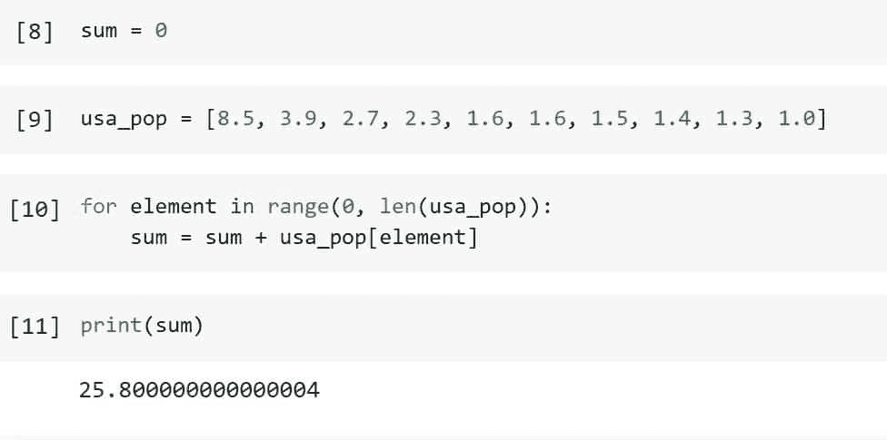
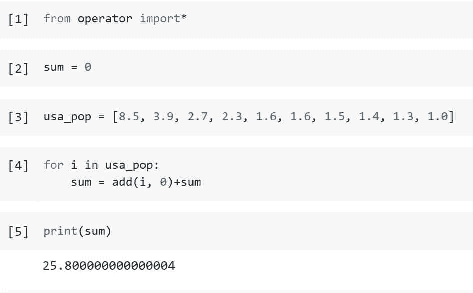
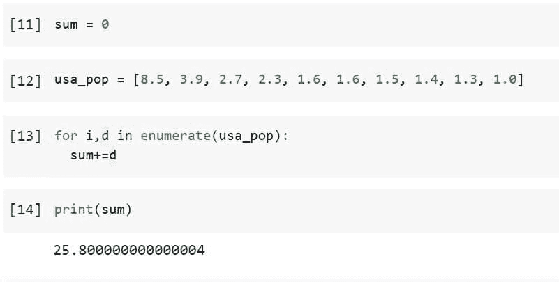
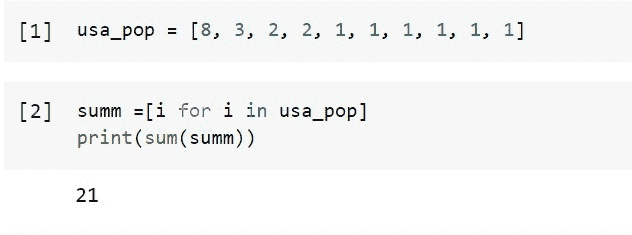

# 如何在 Python 中使用 For 循环对列表中的元素求和

> 原文：<https://pythonguides.com/sum-elements-in-list-in-python-using-for-loop/>

[](https://sharepointsky.teachable.com/p/python-and-machine-learning-training-course)

在本 Python 教程中，我们将通过几个例子学习如何使用 for 循环对 Python 中的列表元素求和。

目录

[](#)

*   [使用 For 循环对 Python 中的列表元素求和](#Sum_Elements_in_List_in_Python_using_For_Loop "Sum Elements in List in Python using For Loop")
    *   [使用 Python For 循环中的 add()函数对列表中的元素求和](#Sum_Elements_in_List_Using_add_function_in_Python_For_Loop "Sum Elements in List Using add() function in Python For Loop")
    *   [使用 Python For 循环中的 enumerate()函数对列表中的元素求和](#Sum_Elements_in_List_Using_enumerate_function_in_Python_For_Loop "Sum Elements in List Using enumerate() function in Python For Loop")
    *   [使用 Python For 循环中的理解对列表中的元素求和](#Sum_Elements_in_List_Using_Comprehension_in_Python_For_Loop "Sum Elements in List Using Comprehension in Python For Loop")

## 使用 For 循环对 Python 中的列表元素求和

让我们举个例子，用不同的方法添加 Python 列表的元素。

使用下面的代码将变量“sum”初始化为零。

```py
sum = 0
```

使用下面的代码创建一个包含美国前 10 大城市人口数百万的列表，如**、`Los Angeles = 3.9`、`Chicago = 2.7`、`Houston = 2.3`、`Phoenix = 1.6`、`Philadelphia = 1.6`、`San Antonio = 1.5`、`San Diego = 1.4`、`Dallas = 1.3`和`San Jose = 1.0`、**。

```py
usa_pop = [8.5, 3.9, 2.7, 2.3, 1.6, 1.6, 1.5, 1.4, 1.3, 1.0]
```

定义 for 循环，遍历列表“usa_pop”的元素，并使用下面的代码将它们添加到变量“sum”中。

```py
for element in range(0, len(usa_pop)):
    sum = sum + usa_pop[element]
```

使用下面的代码检查变量“sum”中列表元素的总和。

```py
print(sum)
```



How To Sum Elements In List In Python Using For Loop

### 使用 Python For 循环中的 add()函数对列表中的元素求和

在模块“operator”下，Python 包含了各种逻辑、按位、关系和其他运算的预定义函数。所以在这种方法中，我们将使用模块操作符的 add()函数。

首先使用下面的代码导入模块操作符。

```py
from operator import*
```

使用下面的代码将变量“sum”初始化为零。

```py
sum = 0
```

使用下面的代码创建一个包含美国前 10 大城市人口数百万的列表，如**、`Los Angeles = 3.9`、`Chicago = 2.7`、`Houston = 2.3`、`Phoenix = 1.6`、`Philadelphia = 1.6`、`San Antonio = 1.5`、`San Diego = 1.4`、`Dallas = 1.3`和`San Jose = 1.0`、**。

```py
usa_pop = [8.5, 3.9, 2.7, 2.3, 1.6, 1.6, 1.5, 1.4, 1.3, 1.0]
```

定义 for 循环来访问列表“usa_pop”中的每个元素，并使用 add()函数对列表中的元素求和，代码如下。

```py
for i in usa_pop:
    sum = add(i, 0)+sum
```

使用下面的代码查看变量“sum”中列表元素的总和。

```py
print(sum)
```



How To Sum Elements In List In Python Using For Loop Add Function

这是如何在 Python for 循环中使用 add()函数对列表中的元素求和。

另外，请查看:[如何将列表追加到另一个列表中](https://pythonguides.com/python-append-list-to-another-list/)

### 使用 Python For 循环中的 enumerate()函数对列表中的元素求和

使用下面的代码将变量“sum”初始化为零。

```py
sum = 0
```

使用下面的代码创建一个包含美国前 10 大城市人口数百万的列表，如**、`Los Angeles = 3.9`、`Chicago = 2.7`、`Houston = 2.3`、`Phoenix = 1.6`、`Philadelphia = 1.6`、`San Antonio = 1.5`、`San Diego = 1.4`、`Dallas = 1.3`和`San Jose = 1.0`、**。

```py
usa_pop = [8.5, 3.9, 2.7, 2.3, 1.6, 1.6, 1.5, 1.4, 1.3, 1.0]
```

使用下面的代码定义 for 循环，用 *`enumerate()`* 函数访问列表“usa_pop”的每个元素，对列表的元素求和。

```py
for i,d in enumerate(usa_pop):
  sum+=d
```

使用下面的代码查看变量“sum”中列表的 sum 元素。

```py
print(sum)
```



Sum Elements in List Using enumerate function in Python For Loop

这是如何在 Python For 循环中使用 enumerate()函数对列表中的元素求和。

### 使用 Python For 循环中的理解对列表中的元素求和

使用下面的代码生成一个包含美国前 10 大城市人口数百万的列表，如**、`Los Angeles = 3.9`、`Chicago = 2.7`、`Houston = 2.3`、`Phoenix = 1.6`、`Philadelphia = 1.6`、`San Antonio = 1.5`、`San Diego = 1.4`、`Dallas = 1.3`、`San Jose = 1.0`、**。

```py
usa_pop = [8, 3, 2, 2, 1, 1, 1, 1, 1, 1]
```

使用 list comprehension 创建 for 循环来访问列表“usa_pop”的每个元素，并使用下面的代码对列表的元素求和。

```py
summ =[i for i in usa_pop]
print(sum(summ))
```



Sum Elements in List Using Comprehension in Python For Loop

看上面的输出，列表中所有元素的求和都是用 Python 中的 comprehension 方法完成的。

我们已经学习了如何使用不同的方法计算列表中存在的元素的总和，例如使用 for 循环的 comprehension、enumerate 和 add()函数。

您可能会喜欢以下 Python 教程:

*   [Python 循环遍历一个列表](https://pythonguides.com/python-loop-through-a-list/)
*   [Python for 循环索引](https://pythonguides.com/python-for-loop-index/)
*   [Python 中 For 循环 vs while 循环](https://pythonguides.com/for-loop-vs-while-loop-in-python/)
*   [Python while 循环继续](https://pythonguides.com/python-while-loop-continue/)
*   [Python While 循环条件](https://pythonguides.com/python-while-loop-condition/)

[Saurabh](https://pythonguides.com/author/saurabh/)

我叫 Kumar Saurabh，是一名 Python 开发人员，在 TSInfo Technologies 工作。此外，像 Python 编程，SciPy，机器学习，人工智能等技术的专业知识。是我喜欢做的事情。