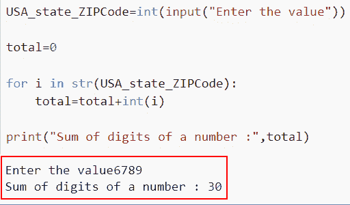
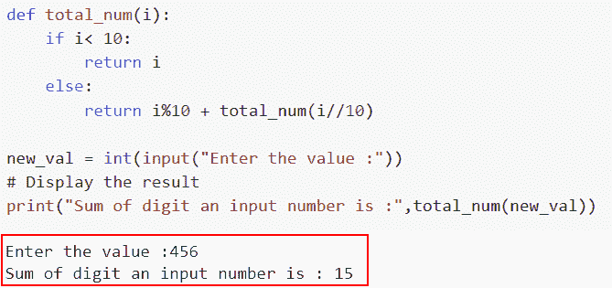
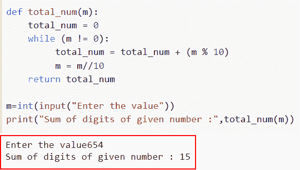
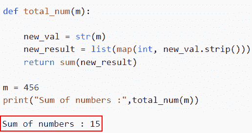
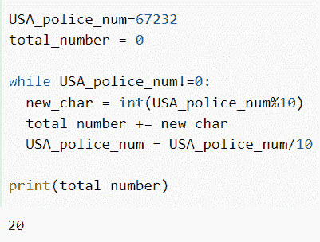

# 如何在 Python 中求一个数的位数之和

> 原文：<https://pythonguides.com/sum-of-digits-of-a-number-in-python/>

[](https://sharepointsky.teachable.com/p/python-and-machine-learning-training-course)

在这个 [Python 教程](https://pythonguides.com/python-programming-for-the-absolute-beginner/)中，我们将讨论几种计算给定数字位数总和的方法。此外，我们将查看各种示例来查找给定数字的数字总和。

作为一名开发人员，在开发 Python 项目时，我需要计算一个数字的总和

在这里我们将看到:

*   如何在 Python 中用 str()和 int()求一个数的位数之和
*   Python 中使用递归对数字进行求和
*   如何在 Python 中使用迭代求一个数的位数之和
*   Python 中使用 Sum()对数字的位数求和
*   如何在 Python 中用蛮力求一个数的位数之和

目录

[](#)

*   [Python 中数字的位数总和](#Sum_of_digits_of_a_number_in_Python "Sum of digits of a number in Python")
    *   [如何在 Python 中用 str()和 int()](#How_to_find_the_Sum_of_digits_of_a_number_in_Python_using_str_and_int "How to find the Sum of digits of a number in Python using str() and int()") 求一个数的位数之和
    *   [在 Python 中使用递归对数字的位数求和](#Sum_of_digits_of_a_number_in_Python_using_recursion " Sum of digits of a number in Python using recursion")
    *   [如何在 Python 中使用迭代求一个数的位数之和](#How_to_find_the_Sum_of_digits_of_a_number_in_Python_using_iteration "How to find the Sum of digits of a number in Python using iteration")
    *   [Python 中使用 sum()](#Sum_of_digits_of_a_number_in_Python_using_sum "Sum of digits of a number in Python using sum()") 对数字的位数求和
    *   [如何在 Python 中用蛮力求一个数的位数之和](#How_to_find_the_Sum_of_digits_of_a_number_in_Python_using_brute_force "How to find the Sum of digits of a number in Python using brute force")

## Python 中数字的位数总和

为了计算数字的位数之和，首先，我们将从用户那里获取输入。接下来，我们将数字分成几个数字，然后将每个数字添加到 sum 变量中。

如果我们有数字 `678` ，我们可以通过将 `6 + 7 + 8` 相加得到数字和，结果是 21。

在 Python 中，在计算一个数字的数字总和时，主要有三种常用且重要的理解方法。

### 如何在 Python 中用 str()和 int() 求一个数的位数之和

*   在这一节中，我们将讨论如何在 Python 中使用 **str()和 int()** 求一个数的数字之和。
*   在 Python 中， `int()` 方法用于将字符串值转换为整数， `str()` 方法用于将整数转换为字符串。

**举例:**

我们举个例子，检查一下 Python 中如何用 **str()和 int()** 求一个数的位数之和。

**源代码:**

```py
USA_state_ZIPCode=int(input("Enter the value"))

total=0

for i in str(USA_state_ZIPCode):
    total=total+int(i)

print("Sum of digits of a number :",total)
```

在下面给出的代码中，我们首先从用户那里获取输入，然后创建一个变量来存储总数。接下来，我们使用 `str()` 方法将数字转换为字符串。

之后，我们使用 for 循环来迭代一个数字的每个数字，并通过使用 `int()` 方法将它们转换为整数。

下面是以下给定代码的实现



Finding sum of digits of a given number in Python using str and int

这是如何在 Python 中用 str 和 int 求一个数的位数之和。

阅读:[用 Python 询问用户输入](https://pythonguides.com/python-ask-for-user-input/)

### Python 中使用递归对数字的位数求和

*   现在让我们看看如何在 Python 中使用递归计算一个数字的位数之和。
*   递归函数是那些重复调用自己的函数。当一个具体问题就其本身而言被定义时，这种方法被应用。

**举例:**

在这里，我们将举一个例子，并检查如何在 Python 中使用递归计算一个数字的位数之和。

**源代码:**

```py
def total_num(i):
    if i< 10:
        return i
    else:
        return i%10 + total_num(i//10)

new_val = int(input("Enter the value :"))
# Display the result
print("Sum of digit an input number is :",total_num(new_val))
```

在上面的代码中，我们首先使用参数“I”定义了函数**“total _ num”**来计算总和。接下来，我们将检查条件，如果“I”小于 10，则它将返回 I。如果不是，则通过将该数乘以 10 来计算余数(n%10)。

以(n/10)作为参数递归调用函数。然后将函数值与余数相加得到总和。之后，接受用户的输入，调用函数**“total _ num”**，并将输入作为一个参数。

下面是以下代码的截图



Calculating the sum of digits of a given number in Python using recursion

在这个例子中，我们已经了解了如何在 Python 中使用递归来计算一个数字的位数之和。

阅读: [Python 比较运算符](https://pythonguides.com/python-comparison-operators/)

### 如何在 Python 中使用迭代求一个数的位数之和

*   在这里，我们将讨论如何在 Python 中使用迭代计算一个数字的位数之和。
*   为了在这个程序中计算总和，将使用循环语句。要重复运行代码的某一部分，请使用循环。一些循环语句包括 for 循环、while 和 do-while。
*   将一个数除以 10，得到该数最右边的数字 0。最右边的数字将最终构成余数。使用余数运算符**“%”**获得余数。用商除以 10 得到一个数的完整位数。每次使用 `"//"` 得到一个整数商。

**举例:**

让我们举一个例子，看看如何在 Python 中使用迭代求一个数的位数之和。

**源代码:**

```py
def total_num(m):    
    total_num = 0
    while (m != 0): 
         total_num = total_num + (m % 10)
         m = m//10
    return total_num    

m=int(input("Enter the value"))
print("Sum of digits of given number :",total_num(m))
```

在给定的示例中，我们首先用参数“m”定义函数“total_num ”,然后声明一个变量**“total _ num”**来包含数字的总和。

创建一个循环，直到 n 不为 0，然后将 sum 变量添加到返回的余数 **(n%10)** 中。修订版 **n 到 n/10** 调用函数 Sum，将用户的输入作为参数。
打印返回的总值。

你可以参考下面的截图。



How to find the Sum of digits of a number in Python using iteration

这是如何在 Python 中使用迭代来求一个数的位数之和。

阅读:[检查一个数是否是素数 Python](https://pythonguides.com/check-if-a-number-is-a-prime-python/)

### Python 中使用 sum() 对数字的位数求和

*   在本节中，我们将讨论如何在 Python 中使用 `sum()` 求一个数的位数之和。
*   Python 的 `sum()` 函数用于计算一个数字在列表中的位数和。
*   使用 `str()` 函数将数字转换为字符串，然后使用 `strip()` 和 `map()` 方法将字符串转换为数字列表。之后，使用 `sum()` 方法计算总数。

**举例:**

这里我们将举一个例子，检查如何在 Python 中使用 sum()求一个数的位数之和。

**源代码:**

```py
def total_num(m):

    new_val = str(m)
    new_result = list(map(int, new_val.strip()))
    return sum(new_result)

m = 456
print("Sum of numbers :",total_num(m))
```

在上面的代码中，我们首先使用参数“m”定义了函数**“total _ num”**来计算总和。接下来，我们使用 str()方法将数字转换为字符串。

下面是以下给定代码的实现。



Sum of digits of a number in Python using sum

正如你在截图中看到的，我们已经用 sum()讨论了 Python 中一个数字的数字总和。

阅读:[如何用 Python 把两个数相加](https://pythonguides.com/add-two-numbers-in-python/)

### 如何在 Python 中用蛮力求一个数的位数之和

*   在这一节中，我们将讨论如何在 Python 中使用蛮力求出一个数的位数之和。
*   这里，我们通过计算整个输入乘以 10 的模数来提取每个数字。

**举例:**

让我们举个例子，检查一下如何在 Python 中用蛮力求一个数的位数之和。

**源代码:**

```py
USA_police_num=67232
total_number = 0

while USA_police_num!=0:
	new_char = int(USA_police_num%10)
	total_number += new_char
	USA_police_num = USA_police_num/10

print(total_number)
```

下面是以下给定代码的实现



How to find the Sum of digits of a number in Python using brute force

在本文中，我们已经讨论了如何在 Python 中计算一个数字的数字总和，我们还讨论了下面给出的方法

*   如何在 Python 中用 str()和 int()求一个数的位数之和
*   Python 中使用递归对数字进行求和
*   如何在 Python 中使用迭代求一个数的位数之和
*   Python 中使用 Sum()对数字的位数求和
*   如何在 Python 中用蛮力求一个数的位数之和

另外，看看更多的 Python 教程。

*   [偶数或奇数的 Python 程序](https://pythonguides.com/python-program-for-even-or-odd/)
*   [Python 中的阿姆斯特朗数](https://pythonguides.com/armstrong-number-in-python/)
*   [如何在 Python 中寻找完全数](https://pythonguides.com/perfect-number-in-python/)
*   [在 Python 中计算一个数的指数值](https://pythonguides.com/calculate-exponential-value-of-a-number-in-python/)
*   [Python 回文程序示例](https://pythonguides.com/python-palindrome-program/)

[Arvind](https://pythonguides.com/author/arvind/)

Arvind 目前是 TSInfo Technologies 的高级 Python 开发人员。他精通 Python 库，如 NumPy 和 Tensorflow。