# 如何在 Python +各种例子中交换两个数

> 原文：<https://pythonguides.com/swap-two-numbers-in-python/>

[](https://sharepointsky.teachable.com/p/python-and-machine-learning-training-course)

在这个 [python 教程中，](https://pythonguides.com/python-hello-world-program/)你将学习到交换两个数的 **python 程序，我们将看到如何在 Python 中交换两个数，我们还将检查 **:****

*   Python 程序交换两个数
*   Python 程序交换列表中的两个数字
*   使用函数交换两个数的 Python 程序
*   不使用第三个变量交换两个数的 Python 程序
*   使用按位异或来交换两个数的 Python 程序
*   使用乘法和除法交换两个数的 Python 程序。
*   使用第三个变量交换两个数的 Python 程序
*   使用类交换两个数的 Python 程序
*   使用临时变量交换两个数的 Python 程序
*   使用元组交换两个数的 Python 程序
*   Python 程序交换用户输入的两个数字
*   python 中三个数的交换
*   使用 python 中的函数交换三个数
*   Python 程序使用 `+` 和**–**运算符交换两个数。
*   Python 程序在没有临时变量的情况下交换四个变量

目录

[](#)

*   [Python 程序交换两个数](#Python_program_to_swap_two_numbers "Python program to swap two numbers")
*   [Python 程序交换列表中的两个数](#Python_program_to_swap_two_numbers_in_a_list "Python program to swap two numbers in a list")
*   [Python 程序使用函数](#Python_program_to_swap_two_numbers_using_function "Python program to swap two numbers using function")交换两个数
*   [不使用第三个变量的 Python 程序交换两个数](#Python_program_to_swap_two_numbers_without_using_third_variable "Python program to swap two numbers without using third variable")
*   [Python 程序使用按位异或来交换两个数](#Python_program_to_swap_two_numbers_using_bitwise_XOR "Python program to swap two numbers using bitwise XOR")
*   [使用乘法和除法交换两个数的 Python 程序](#Python_program_to_swap_two_numbers_using_multiplication_and_division "Python program to swap two numbers using multiplication and division")
*   [Python 程序使用第三个变量](#Python_program_to_swap_two_numbers_with_using_the_third_variable "Python program to swap two numbers with using the third variable")交换两个数
*   [Python 程序使用类](#Python_program_to_swap_two_numbers_using_class "Python program to swap two numbers using class")交换两个数
*   [Python 程序使用临时变量交换两个数](#Python_Program_to_swap_two_numbers_using_a_temporary_variable "Python Program to swap two numbers using a temporary variable")
*   [Python 程序使用元组交换两个数](#Python_program_to_swap_two_numbers_using_tuple "Python program to swap two numbers using tuple")
*   [Python 程序交换用户输入的两个数字](#Python_program_to_swap_two_numbers_entered_by_the_user "Python program to swap two numbers entered by the user")
*   [Python 中三个数的交换](#Swapping_of_three_numbers_in_Python "Swapping of three numbers in Python")
*   [使用 python 中的函数交换三个数字](#Swap_of_three_numbers_using_a_function_in_python "Swap of three numbers using a function in python")
*   [使用+和–运算符交换两个数的 Python 程序](#Python_program_to_swap_two_numbers_using_and_-_operator "Python program to swap two numbers using + and – operator")
*   [Python 程序在没有临时变量的情况下交换四个变量](#Python_program_to_swap_four_variables_without_a_temporary_variable "Python program to swap four variables without a temporary variable")
*   [Python 程序在没有临时变量的情况下交换三个数字](#Python_program_to_swap_three_numbers_without_a_temporary_variable "Python program to swap three numbers without a temporary variable")

## Python 程序交换两个数

在这里，我们可以看到**如何用 python 写一个程序来交换两个数**。

*   在这个例子中，我取了两个数字作为**数字 1 = 25** 和**数字 2 = 30** 。
*   为了交换数字，我使用了**数字 1，数字 2 =数字 2，数字 1** 。
*   为了得到输出，我使用了 **print("number1 = "，number1)** 和 **print("number2 = "，number2)** 。

示例:

```py
number1 = 25
number2 = 30
number1, number2 = number2, number1
print("number1 =", number1)
print("number2 =", number2)
```

我们可以看到这两个数字交换了输出。您可以参考下面的输出截图。

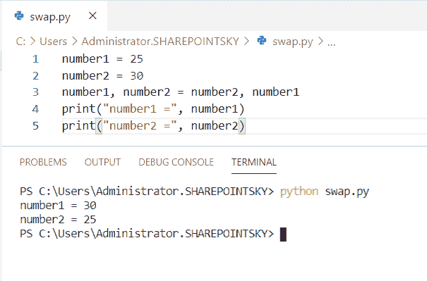

Python program to swap two numbers

上面的代码，我们可以用 Python 中的来**交换两个数。**

阅读， [Python 程序查闰年](https://pythonguides.com/python-program-to-check-leap-year/)。

## Python 程序交换列表中的两个数

现在，我们可以看到**如何用 python 编写程序来交换列表**中的两个数字。

*   在这个例子中，我定义了一个函数为 **def swapIndex(list，index1，index2)** 。
*   参数作为一个**列表，index1，index2** 传递给函数。
*   为了交换数字，我使用了 **list[index1]，list[index2] = list[index2]，list[index1]** 。
*   然后函数作为一个**返回列表**返回。
*   要交换的值称为 **index1，index2 = 1，3** 。
*   为了得到输出，我使用了 **print(swapIndex(List，index1-1，index2-1))** 。
*   在索引 1-1 中， `-1` 代表列表中从 1 开始的索引值

示例:

```py
def swapIndex(list, index1, index2):
	list[index1], list[index2] = list[index2], list[index1]
	return list
List = [25, 85, 30, 40]
index1, index2 = 1, 3
print(swapIndex(List, index1-1, index2-1))
```

列表中的数字被交换。我们可以在下面的截图中看到输出。

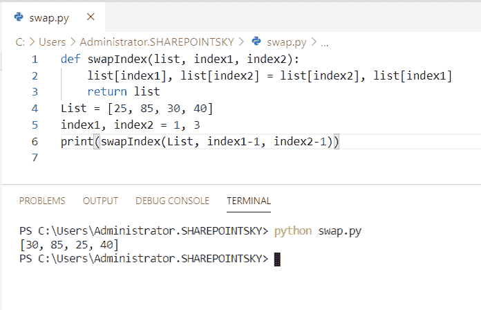

Python program to swap two numbers in a list

这段 Python 代码，我们可以用来在 Python 中交换列表中的两个数字。

您可能喜欢:

*   [Python 连接列表与示例](https://pythonguides.com/python-concatenate-list/)
*   [检查一个列表是否存在于另一个列表中 Python](https://pythonguides.com/check-if-a-list-exists-in-another-list-python/)
*   [Python 向 CSV 写列表](https://pythonguides.com/python-write-a-list-to-csv/)
*   [使用 if-else 理解 Python 列表](https://pythonguides.com/python-list-comprehension-using-if-else/)
*   [Python zip()函数示例](https://pythonguides.com/python-zip/)

## Python 程序使用函数交换两个数

在这里，我们可以看到**如何使用 Python 中的函数**编写程序来交换两个数字。

*   在这个例子中，我将一个名为 `swapnumber` 的函数定义为 **def swapnumbers(a，b)** 。
*   这里我用了一个叫做临时变量的变量作为 `temp = a` ，a = b，b = temp 被赋值交换数字。
*   在这里，我使用了 `input()` 方法。接受用户的输入。
*   为了得到输出，我使用了 **print("交换两个数之前"，(number1，number2))** 和 **print("交换两个数之后"，(a，b))** 。

示例:

```py
def swapnumbers(a, b):
    temp = a
    a = b
    b = temp
    print("After Swapping two Number",(a, b))
number1 = int(input(" Please Enter the First number : "))
number2 = int(input(" Please Enter the Second number : "))
print("Before Swapping two Number",(number1, number2))
swapnumbers(number1, number2)
```

作为输出，我们可以看到交换前后的数字。您可以参考下面的输出截图。

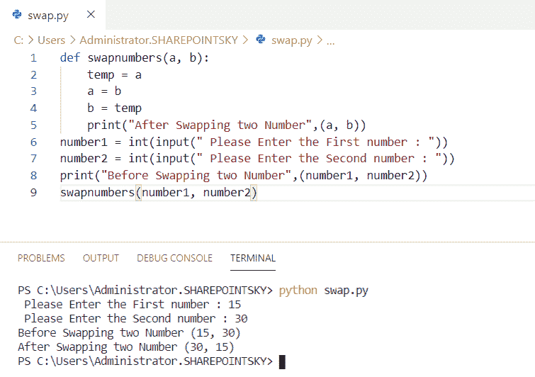

Python program to swap two numbers using function

这就是如何使用 Python 中的函数**交换两个数。**

查看以下 Python 函数示例:

*   [Python 输入和 raw_input 函数](https://pythonguides.com/python-input-and-raw_input-function/)
*   [Python 匿名函数](https://pythonguides.com/python-anonymous-function/)
*   Python 中的[函数](https://pythonguides.com/function-in-python/)

## 不使用第三个变量的 Python 程序交换两个数

在这里，我们可以看到**如何在不使用 python 中的第三个变量**的情况下编写程序来交换两个数字

*   在这个例子中，我使用了 `input()` 方法。接受用户的输入。
*   而不是用第三个变量来交换数字。
*   对数字执行乘法和除法
*   我已经使用 **print("数字 1 的交换数字是%d &)数字 2 是%d" %(a，b))** 得到输出。

示例:

```py
a = int(input("Enter the first number: "))
b = int(input("Enter the second number: "))
a = a * b
b = a / b
a = a / b
print("Swapped numbers of number1 is %d & number2 is %d" %(a,b))
```

这些数字被交换作为输出。您可以参考下面的输出截图。

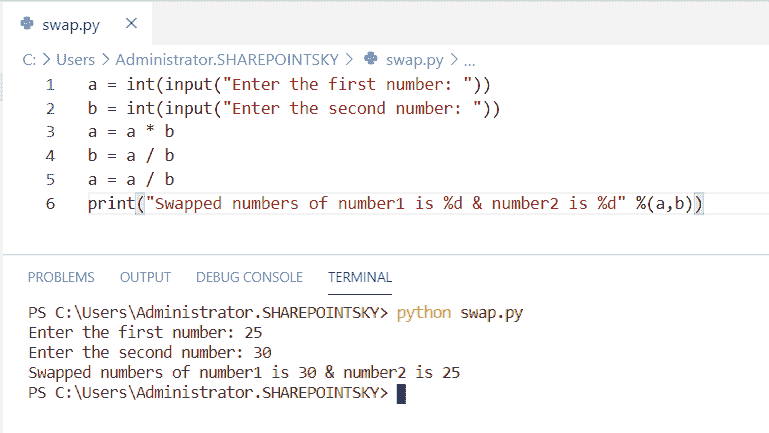

Python program to swap two numbers without using third variable

上面的代码，我们可以用来**交换两个数，而不需要使用 Python 中的第三个变量**。

## Python 程序使用按位异或来交换两个数

现在，我们可以看到**如何用 python 写一个程序来使用按位异或**交换两个数。

*   在这个例子中，我拿了两个数来交换。
*   为了交换数字，我使用了**按位异或**，比如**数字 1 =数字 1 ^数字 2** ，**数字 2 =数字 1 ^数字 2，数字 1 =数字 1 ^数字 2。**
*   我已经使用 print **(“交换后:number1 = "，number1，" number2 = "，number2)** 得到输出。

示例:

```py
number1 = 30
number2 = 5
number1 = number1 ^ number2;
number2 = number1 ^ number2;
number1 = number1 ^ number2;
print ("After Swapping: number1 = ", number1, " number2 =", number2)
```

我们可以看到输出中的数字被交换了。您可以参考下面的输出截图。

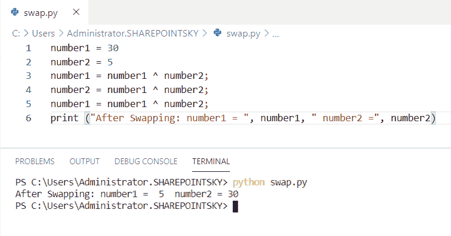

Python program to swap two numbers using bitwise XOR

这是使用按位异或来交换两个数的 Python 程序。

## 使用乘法和除法交换两个数的 Python 程序

现在，我们可以看到**如何用 python 写程序用乘法和除法**交换两个数。

*   在这个例子中，我取了两个数字作为 `a = 25` 和 **b = 30。**
*   我们应该乘和除 a，b。
*   再次将变量 a 赋值为 `a = a // b` 。
*   我已经用 **print("After Swapping: a = "，a，" b = "，b)** 得到了输出。

示例:

```py
a = 25
b = 30
a = a * b
b = a // b;
a = a // b;
print("After Swapping: a =",a, " b =", b);
```

分配给 a 和 b 的值作为输出进行交换。您可以参考下面的输出截图。

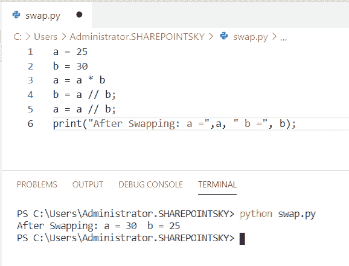

Python program to swap two numbers using multiplication and division

上面的代码，我们可以用 Python 中的**来用乘法和除法**交换两个数。

## Python 程序使用第三个变量交换两个数

在这里，我们可以看到**如何使用 python 中的第三个变量**编写一个程序来交换两个数。

*   在这个例子中，我使用了 `input()` 方法。接受用户的输入。
*   在这里，我使用了 `temp` 作为第三个变量来交换数字。
*   我已经使用了**print(" number 1 的值是% d " % number 1 ")**来获得输出。

示例:

```py
number1 = int(input("Enter the first number: "))
number2 = int(input("Enter the second number: "))
temp = number1
number1 = number2
number2 = temp
print("Value of number1 is %d" %number1)
print("Value of number2 is %d" %number2)
```

您可以参考下面的输出截图。

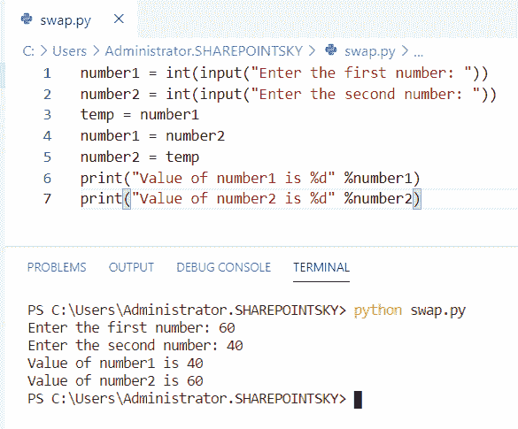

Python program to swap two numbers with using the third variable

这段代码我们可以用 Python 中的第三个变量来交换两个数。

## Python 程序使用类交换两个数

在这里，我们可以看到**如何使用 python 中的类**编写程序来交换两个数字。

*   在这个例子中，我创建了一个**类**，使用构造函数初始化该类的值。
*   我发明了一种交换数字的方法。
*   `self` 是用于将**属性**和**方法**传递给类的关键字。
*   我使用了 `input()` 方法从用户那里获取输入。
*   对象是为类创建的，用于传递参数。
*   为了显示交换后的数字，我使用了 `obj.display()` 。

示例:

```py
class Number:
    def __init__(self, x, y):
        self.x = x
        self.y = y
    def swap(self):
        temp = self.x
        self.x = self.y
        self.y = temp
    def display(self):
        print("After swap a is:", self.x)
        print("After swap b is:", self.y)
x = int(input("Enter first number:"))
y = int(input("Enter second number:"))
obj = Number(x, y)
obj.swap()
obj.display()
```

下面的屏幕截图显示了输出。

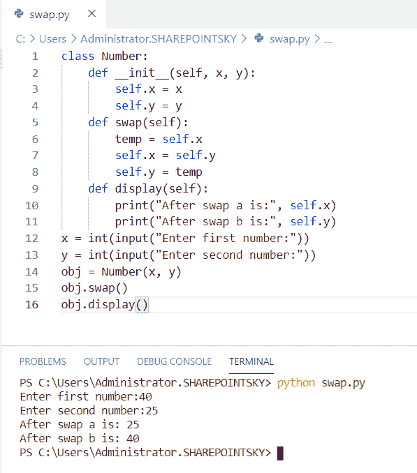

Python program to swap two numbers using class

这是使用类交换两个数的 **Python 程序。**

## Python 程序使用临时变量交换两个数

在这里，我们可以看到**如何使用 python 中的临时变量**编写程序来交换两个数字。

*   在这个例子中，我取了两个变量，并给它们赋值，比如 x = 100，y= 300。
*   为了交换数字，我使用一个临时变量作为 `temp` 。
*   我已经用 **print("after swapping= "，x，" y= "，y)** 得到了输出。

示例:

```py
x = 100
y= 300
print("before swapping=", x, " y=", y)
temp = x
x = y
y = temp
print("after swapping=", x, " y=", y)
```

您可以参考下面的输出截图。

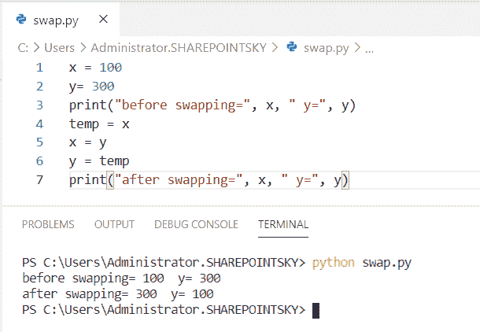

Python Program to swap two numbers using a temporary variable

这是使用 Python 中的临时变量来交换两个数字的 Python 代码。

## Python 程序使用元组交换两个数

现在，我们可以看到**如何在 python 中使用元组**编写程序来交换两个数字。

*   在这个例子中，我使用了`input()`方法。接受用户的输入。
*   我已经用 **(x，b)=(b，x)** 交换过数字了。
*   我有 **print ("x= "，x，" b= "，b)** 来获得输出。

示例:

```py
x=int(input("Enter the first number :"))
b=int(input("Enter the second number :"))
print ("x=",x, "b=",b)
(x,b)=(b,x)
print("x=",x, "b=",b)
```

数字作为输出进行交换。您可以参考下面的输出截图。

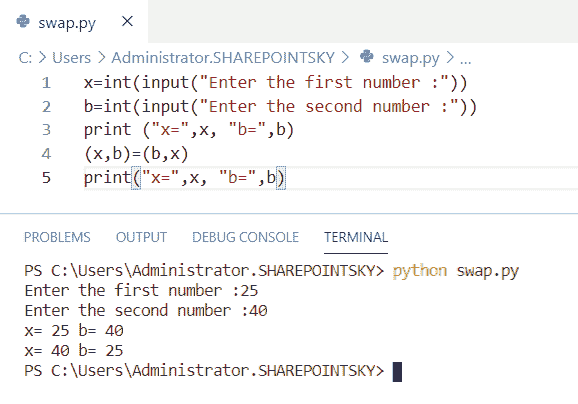

Python program to swap two numbers using tuple

这是在 Python 中使用 tuple 来交换两个数字的 Python 代码。

## Python 程序交换用户输入的两个数字

在这里，我们可以看到**如何编写程序来交换用户在 python 中输入的两个数字**

*   在这个例子中，我使用了 `input()` 方法。从用户那里获取信息。
*   这里，我使用了 `temp` 变量来交换数字。
*   我已经用 **print((a，b))** 得到了输出。

示例:

```py
a = float(input(" Enter the First number "))
b = float(input(" Please Enter the Second number b: "))
print((a, b))
temp = a
a = b
b = temp
print((a, b))
```

我们可以看到，数字是由用户输入的，然后作为输出进行交换。您可以参考下面的输出截图。

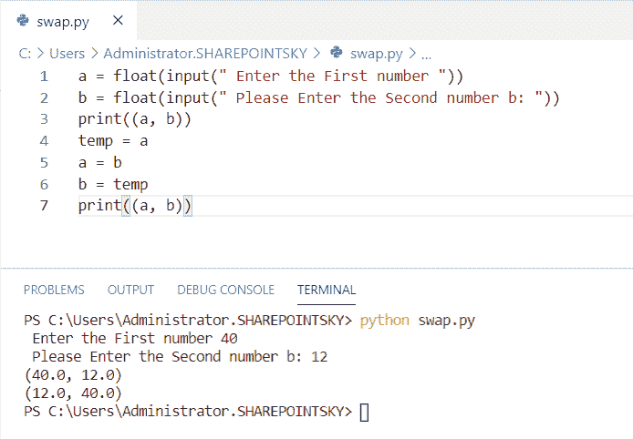

Python program to swap two numbers entered by the user

这是一个 Python 程序，用来交换用户输入的两个数字。

## Python 中三个数的交换

在这里，我们可以看到**如何用 python 编写三个数**交换的程序。

*   在这个例子中，我使用了**`input()`方法来获取用户的输入。**
*   **在这里，我将变量值赋给了 a。将 **a 的值赋给了 b** ，将 **b 的值赋给了 c** ，将 **c 的值赋给了 a** 变量。**
*   **为了得到输出，我使用了 **print('交换后 a 的值是{} '。格式(一))**。**

 **示例:

```py
a = input("Enter a first number")
b = input("Enter a second number")
c = input("Enter a third number")
print('The value of a is {}'.format(a))
print('The value of b is {}'.format(b))
print('The value of c is {}'.format(c))
variable = a
a = b
b = c
c = variable
print('The value of a after swapping is {}'.format(a))
print('The value of b after swapping is {}'.format(b))
print('The value of c after swapping is {}'.format(c))
```

您可以参考下面的输出截图。

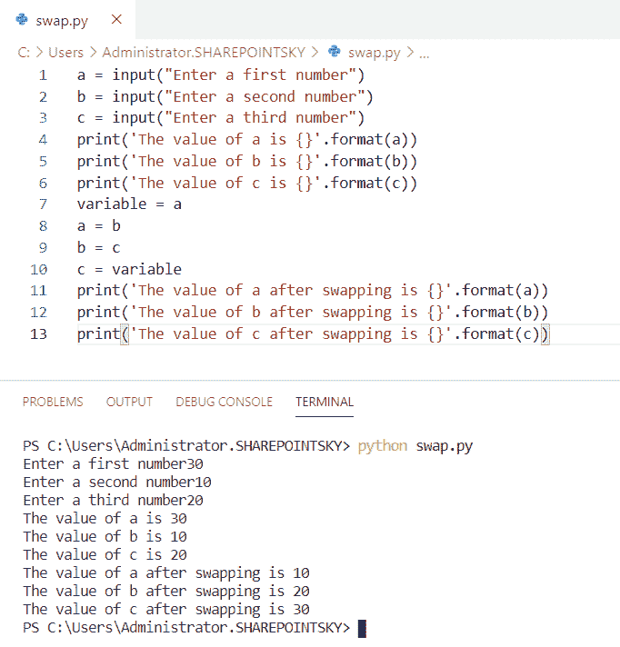

Swapping of three numbers in Python

这段代码，我们可以用 Python 中的来**交换三个数。**

## 使用 python 中的函数交换三个数字

在这里，我们可以看到**如何使用 python 中的函数**交换三个数。

*   在这个例子中，我定义了一个名为 **def swapThree(x，y，z)** 的函数。
*   值的和存储在 x 中，接下来 y 存储 x 的值，之后 x 存储 y 的值。
*   此后，x 存储 z 的值。
*   **if __name__ == '__main__'** 用于在不执行文件时执行代码。
*   要交换的值被分配给变量。
*   为了得到输出**，使用 print("交换 x = "，x，"，y = "，y，"，z = "，z)T1 和 **print("交换 x = "，x，"，y = "，y，"，z = "，z)T3。****

示例:

```py
def swapThree(x, y, z):
	x = x + y + z 
	y = x - (y+z)
	z = x - (y+z)
	x = x - (y+z)
	print("After swapping x =",x,", y =",y,", z =",z)
if __name__ == '__main__':
	x = 2
	y = 4
	z = 6
print("Before swapping x =",x,", y =",y,", z =",z)
swapThree(x, y, z)
```

您可以参考下面的输出截图。

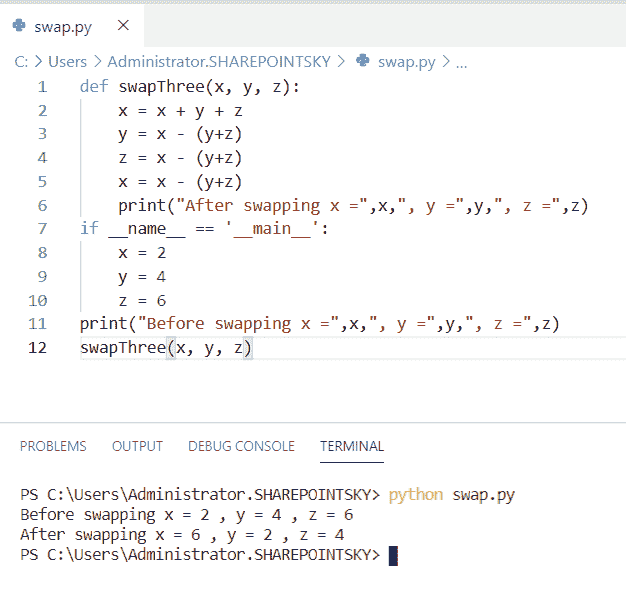

Swapping of three numbers using function in python

这是使用 python 中的函数来交换三个数字的 Python 代码。

## Python 程序使用 `+` 和**–**运算符交换两个数

在这里，我们可以看到**如何使用 python 中的+和–运算符**编写程序来交换两个数字

*   在这个例子中，我使用了 **float 数据类型**来输入十进制格式的输入。
*   这两个数相加，然后相减。它再次被赋给变量 x。
*   我已经用**print(" x 的交换值是%.1f & y 是%.1f" %(x，y))** 得到输出。
*   `.1f` 是浮点数的占位符。

示例:

```py
x = float(input("Enter the first number: "))
y = float(input("Enter the second number: "))
x = x + y
y = x - y
x = x - y
print("Swapped values of x is %.1f & y is %.1f" %(x,y))
```

您可以参考下面的输出截图。

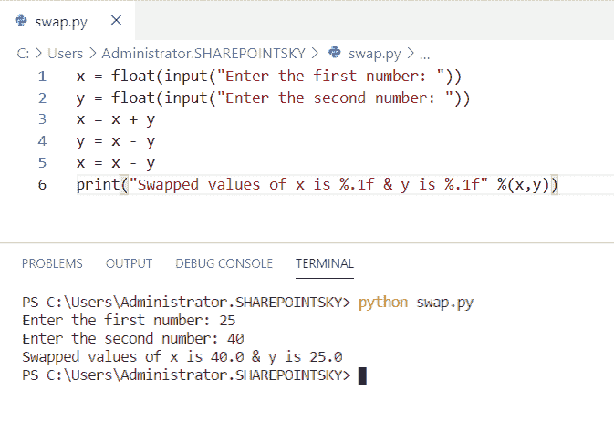

Python program to swap two numbers using + and – operator.

这是在 Python 中使用+和–运算符交换两个数的 Python 代码。

## Python 程序在没有临时变量的情况下交换四个变量

现在，我们可以看到**如何用 python 编写一个程序来交换四个变量而不用临时变量**

*   在这个例子中，我定义了一个函数为 **def swap(a，b，c，d)。**
*   **a = a + b，b = a–b，a = a–b**用于交换变量 a 和 b
*   **a = a + b，b = a–b，a = a–b**用于交换变量 b 和 c。
*   **c = c + d，d = c–d，c = c–d**用于交换变量 c 和 d。
*   然后将值初始化为变量。该函数称为 **swap(a，b，c，d)** 。

示例:

```py
def swap(a, b, c, d):
	a = a + b
	b = a - b
	a = a - b

	b = b + c
	c = b - c
	b = b - c

	c = c + d
	d = c - d
	c = c - d

	print("values after swapping are : ")
	print("a = ", a)
	print("b = ", b)
	print("c = ", c)
	print("d = ", d)
a = 1
b = 2
c = 3
d = 4
print("values before swapping are : ")
print("a = ", a)
print("b = ", b)
print("c = ", c)
print("d = ", d)
print("")
swap(a, b, c, d)
```

所有四个变量作为输出被交换。您可以参考下面的输出截图。

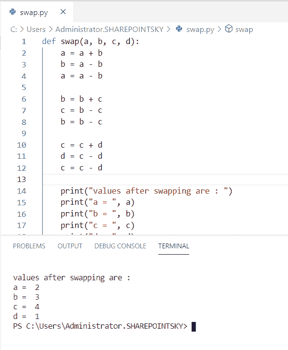

Python program to swap four variables without temporary variable

这是在 Python 中没有临时变量的情况下**交换四个变量的代码。**

## Python 程序在没有临时变量的情况下交换三个数字

在这里，我们可以看到**如何用 python 写一个` `程序，在没有临时变量**的情况下交换三个数。

*   在这个例子中，我已经给变量赋值了。
*   然后交换数字 **x = x + y + z，y = x—(y+z)**，**z = x—(y+z)**，**x = x—(y+z)**进行加减运算。
*   我已经使用了 **print("交换 a = "，x，"，b = "，y，"，c = "，z 之前)**和 **print("交换 a = "，x，"，y = "，y，"，z = "，z 之后)**得到输出。

示例:

```py
x = 14
y = 12
z = 97
print("Before swapping a = ",x,", b = ",y,", c = ",z) 
x = x + y + z
y = x - (y+z)
z = x - (y+z)
x = x - (y+z)
print("After swapping a = ",x,", y = ",y,", z = ",z) 
```

我们可以将交换后的数字视为输出。您可以参考下面的输出截图。

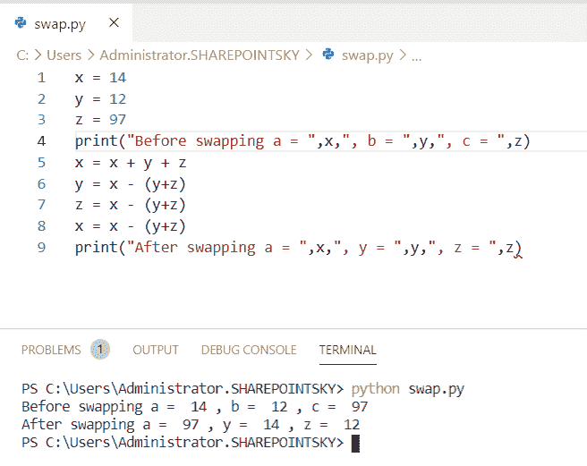

Python program to swap three numbers without a temporary variable

这是在 Python 中没有临时变量的情况下，**交换三个数字的 Python 代码。**

您可能会喜欢以下 Python 教程:

*   [如何打印 Python 斐波那契数列](https://pythonguides.com/python-fibonacci-series/)
*   [如何在 Python 中减去两个数](https://pythonguides.com/subtract-two-numbers-in-python/)
*   [Python 中两个数如何除法](https://pythonguides.com/divide-two-numbers-in-python/)
*   [如何在 Python 中添加两个变量](https://pythonguides.com/add-two-variables-in-python/)
*   [如何用 Python 将两个数相加](https://pythonguides.com/add-two-numbers-in-python/)

在这篇 Python 教程中，我们学习了交换两个数的 **Python 程序。此外，我们还讨论了以下主题:**

*   Python 程序交换两个数
*   Python 程序交换列表中的两个数字
*   使用函数交换两个数的 Python 程序
*   不使用第三个变量交换两个数的 Python 程序
*   使用按位异或来交换两个数的 Python 程序
*   使用乘法和除法交换两个数的 Python 程序。
*   使用第三个变量交换两个数的 Python 程序
*   使用类交换两个数的 Python 程序
*   使用临时变量交换两个数的 Python 程序
*   使用元组交换两个数的 Python 程序
*   Python 程序交换用户输入的两个数字
*   python 中三个数的交换
*   使用 python 中的函数交换三个数
*   Python 程序使用 `+` 和**–**运算符交换两个数。
*   Python 程序在没有临时变量的情况下交换四个变量

[Bijay Kumar](https://pythonguides.com/author/fewlines4biju/)

Python 是美国最流行的语言之一。我从事 Python 工作已经有很长时间了，我在与 Tkinter、Pandas、NumPy、Turtle、Django、Matplotlib、Tensorflow、Scipy、Scikit-Learn 等各种库合作方面拥有专业知识。我有与美国、加拿大、英国、澳大利亚、新西兰等国家的各种客户合作的经验。查看我的个人资料。

[enjoysharepoint.com/](https://enjoysharepoint.com/)[](https://www.facebook.com/fewlines4biju "Facebook")[](https://www.linkedin.com/in/fewlines4biju/ "Linkedin")[](https://twitter.com/fewlines4biju "Twitter")**