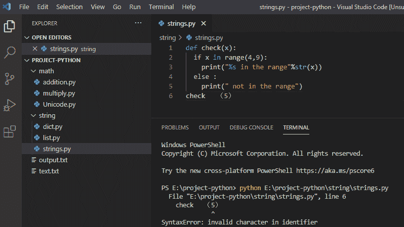
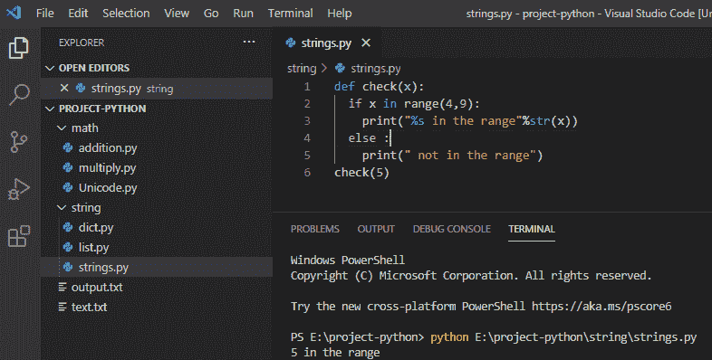
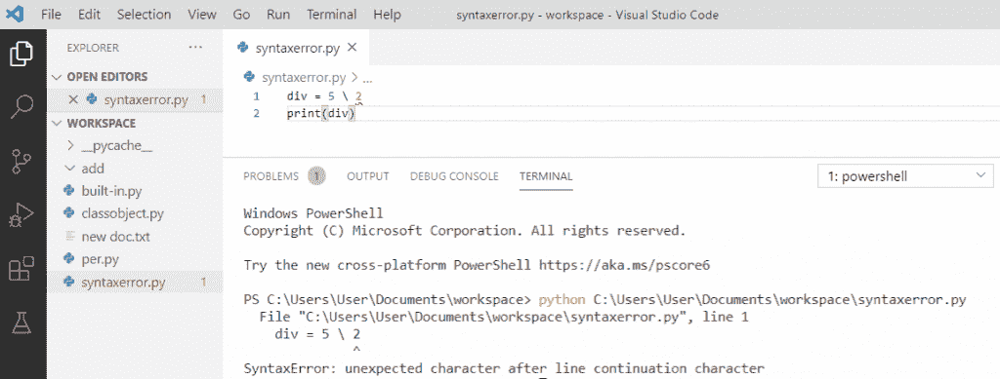
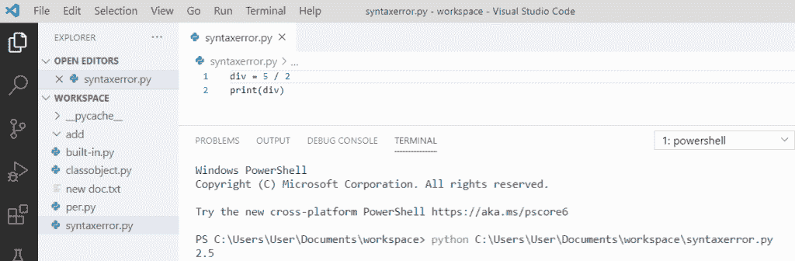

# 语法错误标识符 python3 中有无效字符

> 原文：<https://pythonguides.com/syntaxerror-invalid-character-in-identifier-python3/>

[](https://sharepointsky.teachable.com/p/python-and-machine-learning-training-course)

在这个 [Python 教程](https://pythonguides.com/python-download-and-installation/)中，我们将讨论修复一个错误， **syntaxerror 标识符 python3 中的无效字符，**以及 **SyntaxError:行继续符**后的意外字符。使用 [Python 字典](https://pythonguides.com/create-a-dictionary-in-python/)或 [Python 列表](https://pythonguides.com/python-list-methods/)时，出现错误**标识符**中的无效字符。

目录

[](#)

*   [语法错误标识符 python3 中的无效字符](#syntaxerror_invalid_character_in_identifier_python3 "syntaxerror invalid character in identifier python3")
*   [语法错误:行继续符](#SyntaxError_unexpected_character_after_line_continuation_character "SyntaxError: unexpected character after line continuation character")后出现意外字符

## 语法错误标识符 python3 中的无效字符

*   在 python 中，如果你运行代码，那么你可能会得到标识符中的 **python 无效字符错误，因为在 [Python 变量](https://pythonguides.com/create-python-variable/)名称、函数中间有一些字符。**
*   或者最常见的是，我们得到这个错误是因为你从任何网站复制了一些格式化的代码。

**举例:**

```py
def check(x):
if k in range(4,9):
print("%s in the range"%str(x))
else:
print("not in the range")
check   （5）
```

写完上面的代码后，我在第 6 行得到了标识符 python error 中的无效字符。

您可以在下面的屏幕截图中看到错误:syntax error:identifier 中的无效字符。



python open syntaxerror invalid character in identifier

为了解决标识符 python 错误中的无效字符，我们需要检查代码或删除它并重新键入。基本上，我们需要找到并修复这些字符。

**举例:**

```py
def check(x):
if k in range(4,9):
print("%s in the range"%str(x))
else:
print("not in the range")
check(5)
```

在编写了上面的代码( **syntaxerror 标识符**中的无效字符)之后，一旦您要打印，那么输出将显示为范围中的“ **5”。这里，check (5)已被重新键入，错误已被解决。**

检查下面的屏幕截图，标识符中的无效字符已解决。



invalid character in identifier python list

## 语法错误:行继续符后出现意外字符

这个**错误**发生在编译器发现一个字符不应该在行继续符之后。因为反斜杠在 python 中被称为行继续符，不能用于除法。所以，当它遇到一个整数时，它抛出错误。

**举例:**

```py
div = 5\2
print(div)
```

写完上面的代码( **syntaxerror:行继续符**后的意外字符)，一旦你要打印 `"div"` ，那么错误就会出现为" **SyntaxError:行继续符` `后的意外字符"。**这里，当我们试图划分**“5 \ 2”**时，引发了 `syntaxerror` 。使用了无法分割数字的**反斜杠` `"\"** 。

检查下面的截屏语法错误:行继续符后出现意外字符。



SyntaxError: unexpected character after line continuation character

为了解决这种**行继续符**后出现意外字符的错误，我们必须使用除法运算符，即**前斜杠“/”**对数字进行除法运算，以避免这种错误。

**举例:**

```py
div = 5/2
print(div)
```

写完上面的代码后(syntax error:python 中的行继续符后的意外字符)，您将打印出 `"div"` ，然后输出将显示为 `" 2.5 "` 。在这里，我的错误是通过给前斜杠解决的，它将两个数分开。

检查下面的屏幕截图，看行继续符解析后是否有意外字符。



SyntaxError: unexpected character after line continuation character in python

您可能会喜欢以下 Python 教程:

*   [Python 加法示例](https://pythonguides.com/python-addition/)
*   [Python 中的乘法与例题](https://pythonguides.com/multiply-in-python/)
*   [如何在 Python 中处理 indexerror:字符串索引超出范围](https://pythonguides.com/indexerror-string-index-out-of-range-python/)
*   [解析 Python 时出现意外的 EOF](https://pythonguides.com/unexpected-eof-python/)
*   [Python 对于基数为 10 的 int()无效文字](https://pythonguides.com/python-invalid-literal-for-int-with-base-10/)
*   [Python 元组排序列表](https://pythonguides.com/python-sort-list-of-tuples/)

这就是如何解决 python **SyntaxError:标识符错误**中的无效字符或者标识符 python 列表错误中的无效字符，我们还看到了**syntax error:python**中的行延续字符后的意外字符。

[Bijay Kumar](https://pythonguides.com/author/fewlines4biju/)

Python 是美国最流行的语言之一。我从事 Python 工作已经有很长时间了，我在与 Tkinter、Pandas、NumPy、Turtle、Django、Matplotlib、Tensorflow、Scipy、Scikit-Learn 等各种库合作方面拥有专业知识。我有与美国、加拿大、英国、澳大利亚、新西兰等国家的各种客户合作的经验。查看我的个人资料。

[enjoysharepoint.com/](https://enjoysharepoint.com/)[](https://www.facebook.com/fewlines4biju "Facebook")[](https://www.linkedin.com/in/fewlines4biju/ "Linkedin")[](https://twitter.com/fewlines4biju "Twitter")