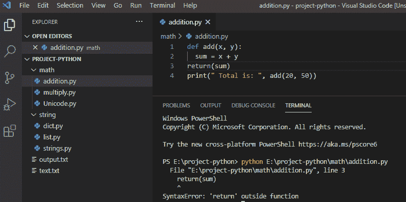

# python 语法错误:函数外部的“return”

> 原文：<https://pythonguides.com/syntaxerror-return-outside-function-python/>

[](https://sharepointsky.teachable.com/p/python-and-machine-learning-training-course)

在本 [Python 教程](https://pythonguides.com/python-download-and-installation/)中，我们将讨论如何修复一个错误，`syntax error return outside function python`中，无法赋值给函数调用 Python 中的函数在使用 [python](https://pythonguides.com/python-programming-for-the-absolute-beginner/) 中的函数时出现的错误 return outside function Python。

目录

[](#)

*   [Python 语法错误:函数外的“return”](#Python_syntaxerror_return_outside_function "Python syntaxerror: ‘return’ outside function")
*   [SyntaxError 无法赋值给 python 中的函数调用](#SyntaxError_cant_assign_to_function_call_in_python "SyntaxError can’t assign to function call in python")

## Python 语法错误:函数外的“return”

在 python 中，当缩进或返回函数不匹配时，就会出现这种错误。

**举例:**

```py
def add(x, y):
  sum = x + y
return(sum)
print(" Total is: ", add(20, 50))
```

在编写上述代码(syntax error return outside function python)之后，您将打印这些代码，然后错误将显示为“`syntax error return outside function python`”。这里，第 3 行没有缩进或对齐，因为它在函数外部抛出了一个错误“return”。

可以参考下面截图 **python 语法错误:函数**外的‘return’



python syntaxerror: ‘return’ outside function

为了解决这个**syntax error:return outside function python**我们需要检查代码的缩进是否正确，return 语句也应该在函数内部，这样这个错误就可以解决了。

**举例:**

```py
def add(x, y):
  sum = x + y
  return(sum)
print(" Total is: ", add(20, 50))
```

在编写了上面的代码(syntaxerror 在函数 python 外部返回)之后，一旦打印，输出将显示为“Total is: 70”。在这里，第 3 行是通过给出返回语句的正确缩进来解决的，它应该在函数内部，这样我们就可以解决这个语法错误。

你可以参考下面的截图:


return outside function python

## SyntaxError 无法赋值给 python 中的函数调用

在 python 中， **syntaxerror:不能赋值给函数调用**如果试图给函数调用赋值，就会出现错误。这意味着我们试图给一个函数赋值。

**举例:**

```py
chocolate = [
     { "name": "Perk", "sold":934 },
     { "name": "Kit Kat", "sold": 1200},
     { "name": "Dairy Milk Silk", "sold": 1208},
     { "name": "Kit Kat", "sold": 984}
]
def sold_1000_times(chocolate):
    top_sellers = []
    for c in chocolate:
        if c["sold"] > 1000:
            top_sellers.append(c)
    return top_sellers
sold_1000_times(chocolate) = top_sellers
print(top_sellers)
```

写完上面的代码后(syntaxerror:在 python 中不能赋值给函数调用)，你将打印出 `"top_sellers"` ，然后错误将显示为"**" syntax error:不能赋值给函数调用**"。这里，我们得到错误是因为我们试图给一个函数调用赋值。

你可以参考下面的截图在 python 中不能赋值给函数调用


SyntaxError can’t assign to function call in python

为了解决这个**语法错误:不能分配给函数调用**我们必须分配一个函数调用给一个变量。我们必须首先声明变量，后面跟一个等号，后面跟应该赋给该变量的值。因此，我们颠倒了变量声明的顺序。

**举例:**

```py
chocolate = [
     { "name": "Perk", "sold":934 },
     { "name": "Kit Kat", "sold": 1200},
     { "name": "Dairy Milk Silk", "sold": 1208},
     { "name": "Kit Kat", "sold": 984}
]
def sold_1000_times(chocolate):
    top_sellers = []
    for c in chocolate:
        if c["sold"] > 1000:
            top_sellers.append(c)
    return top_sellers
top_sellers
 = sold_1000_times(chocolate)
print(top_sellers)
```

在编写完上面的代码(在 python 中不能赋值给函数调用)之后，你要打印的代码将显示为 **"[{ "name": "Kit Kat "，" sold": 1200}，{"name": "Dairy Milk Silk "，" sold": 1208}] "** 。这里，通过首先给出变量名，然后给出应该分配给该变量的值来解决错误。

你可以参考下面的截图不能在 python 中赋值给函数调用是解决了


SyntaxError can’t assign to function call in python

您可能会喜欢以下 Python 教程:

*   [从字符串 Python 中删除字符](https://pythonguides.com/remove-character-from-string-python/)
*   [在 Python 中创建一个](https://pythonguides.com/create-an-empty-array-in-python/) [n](https://pythonguides.com/create-an-empty-array-in-python/) [空数组](https://pythonguides.com/create-an-empty-array-in-python/)
*   [python 中的无效语法](https://pythonguides.com/invalid-syntax-in-python/)
*   [语法错误标识符 python3 中的无效字符](https://pythonguides.com/syntaxerror-invalid-character-in-identifier-python3/)
*   [如何在 Python 中处理 indexerror:字符串索引超出范围](https://pythonguides.com/indexerror-string-index-out-of-range-python/)
*   [解析 Python 时出现意外的 EOF](https://pythonguides.com/unexpected-eof-python/)
*   [Python 内置函数示例](https://pythonguides.com/python-built-in-functions/)

这里是如何解决 **python SyntaxError:返回外部函数**错误和 SyntaxError 不能赋给 python 中的函数调用。这篇文章对下面的错误信息有帮助:

*   语法错误在函数外部返回
*   python 语法错误:函数外部的“return”
*   函数 python 外部的返回
*   python 函数外部的“return”
*   python 错误返回到函数外部
*   python 在函数外部“返回”
*   语法错误返回不在函数中

[Bijay Kumar](https://pythonguides.com/author/fewlines4biju/)

Python 是美国最流行的语言之一。我从事 Python 工作已经有很长时间了，我在与 Tkinter、Pandas、NumPy、Turtle、Django、Matplotlib、Tensorflow、Scipy、Scikit-Learn 等各种库合作方面拥有专业知识。我有与美国、加拿大、英国、澳大利亚、新西兰等国家的各种客户合作的经验。查看我的个人资料。

[enjoysharepoint.com/](https://enjoysharepoint.com/)[](https://www.facebook.com/fewlines4biju "Facebook")[](https://www.linkedin.com/in/fewlines4biju/ "Linkedin")[](https://twitter.com/fewlines4biju "Twitter")