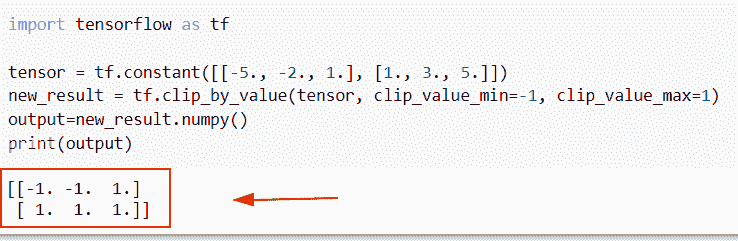
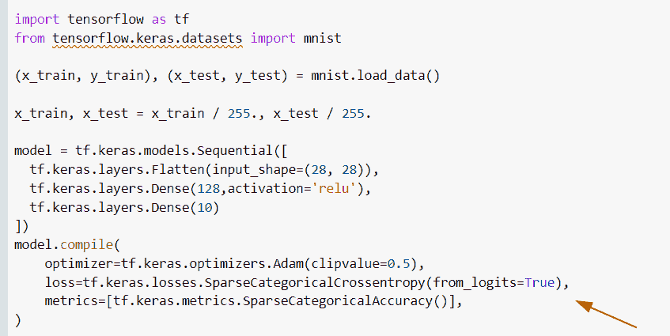
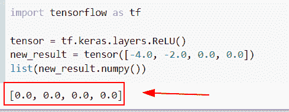
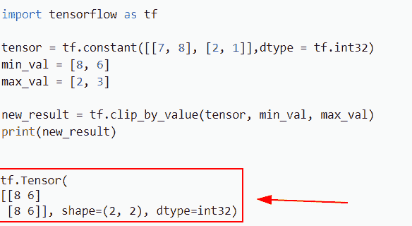
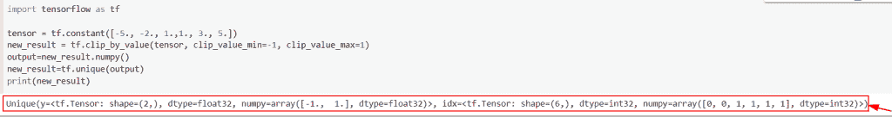

# 张量流 clip _ by _ value–完整教程

> 原文：<https://pythonguides.com/tensorflow-clip_by_value/>

[](https://sharepointsky.teachable.com/p/python-and-machine-learning-training-course)

在这个 [Python 教程中，](https://pythonguides.com/learn-python/)我们将学习**如何在 Python TensorFlow** 中按值裁剪张量。此外，我们将涵盖以下主题。

*   张量流剪辑值
*   张量流 clip_by_value 渐变
*   张量流 clip_by_value 函数
*   S7-1200 可编程控制器
*   张量流剪辑值唯一

目录

[](#)

*   [张量流 clip_by_value](#Tensorflow_clip_by_value "Tensorflow clip_by_value")
*   [张量流 clip_by_value 渐变](#TensorFlow_clip_by_value_gradient "TensorFlow clip_by_value gradient")
*   [tensorlow clip _ by _ value relu](#TensorFlow_clip_by_value_relu "TensorFlow clip_by_value relu")
*   [TensorFlow clip_by_value 函数](#TensorFlow_clip_by_value_function "TensorFlow clip_by_value function")
*   [张量流 clip_by_value unique](#TensorFlow_clip_by_value_unique "TensorFlow clip_by_value unique")

## 张量流 clip_by_value

*   在本节中，我们将讨论如何在 [Python TensorFlow](https://pythonguides.com/tensorflow/) 中按值裁剪张量。
*   为了执行这个特定的任务，我们将使用 `tf.clip_by_value()` 函数。
*   并且 `tf.clip_by_value()` 被表示为将张量值裁剪为给定的最小和最大数。

**语法:**

让我们看看语法，了解 Python TensorFlow 中的 `tf.clip_by_value()` 函数的工作原理。

```py
tf.clip_by_value
                (
                 t,
                 clip_value_min,
                 clip_value_max,
                 name=None
                )
```

*   它由几个参数组成
    *   **t:** 该参数表示输入张量。
    *   **clip_value_min:** 该参数指定最小剪辑值，可扩展为张量的形状。
    *   **剪辑值最大值:**该参数表示最大剪辑值，可扩展为张量的形状。
    *   name:缺省情况下，它采用 none 值，并指定操作的名称。

**举例:**

让我们举个例子，看看如何在 Python TensorFlow 中按值裁剪张量。

**源代码:**

```py
import tensorflow as tf

tensor = tf.constant([[-5., -2., 1.], [1., 3., 5.]])
new_result = tf.clip_by_value(tensor, clip_value_min=-1, clip_value_max=1)
output=new_result.numpy()
print(output)
```

在上面的代码中，我们已经导入了 TensorFlow 库，然后使用 `tf.constant()` 函数创建了张量。在这个函数中，我们给它分配了整数的正值和负值。

之后，我们使用了 `tf.clip_by_value()` 函数，并指定输入张量以及最小值和最大值作为参数。

下面是以下给定代码的实现。



Tensorflow clip by value in Python

阅读:[张量流图-详细指南](https://pythonguides.com/tensorflow-graph/)

## 张量流 clip_by_value 渐变

*   在这个程序中，我们将讨论如何在 Python TensorFlow 中使用渐变裁剪。
*   首先，我们将讨论梯度削波，这是一个函数，其中导数通过网络被修改或削波到阈值，并且还用于修改权重。
*   有两种方法来执行渐变裁剪，按值裁剪和按规范裁剪。在这个例子中，我们将定义一个最小和最大的剪辑值。

**举例:**

让我们举个例子，看看如何在 Python TensorFlow 中使用渐变裁剪。

**源代码:**

```py
import tensorflow as tf
from tensorflow.keras.datasets import mnist

(x_train, y_train), (x_test, y_test) = mnist.load_data()

x_train, x_test = x_train / 255., x_test / 255.

model = tf.keras.models.Sequential([
  tf.keras.layers.Flatten(input_shape=(28, 28)),
  tf.keras.layers.Dense(128,activation='relu'),
  tf.keras.layers.Dense(10)
])
model.compile(
    optimizer=tf.keras.optimizers.Adam(clipvalue=0.5),
    loss=tf.keras.losses.SparseCategoricalCrossentropy(from_logits=True),
    metrics=[tf.keras.metrics.SparseCategoricalAccuracy()],
)
```

在下面给出的代码中，我们通过从 **TensorFlow 导入创建了一个数据集模型 `mnist.load_data()` 。Keras.datasets** 导入 `mnist` 包。创建模型后，我们必须训练和测试给定的模型。

下面是以下给定代码的实现。



TensorFlow clip_by_value gradient

阅读； [Python TensorFlow 占位符](https://pythonguides.com/tensorflow-placeholder/)

## tensorlow clip _ by _ value relu

*   本节我们将讨论如何在`clip _ by _ value()`tensor flow Python 中使用 relu 激活函数。
*   为了执行这一特定任务，我们将使用 `tf.keras.layers.ReLU()` 函数，该函数将帮助用户调整线性激活函数 ReLU，它用于卷积神经网络。

**语法:**

让我们看看语法，了解一下 **tf 的工作原理。Keras.layers.ReLU()** 函数。

```py
tf.keras.layers.ReLU
                    (
                     max_value=None,
                     negative_slope=0.0,
                     threshold=0.0,
                     **kwargs
                    )
```

*   它由几个参数组成
    *   **max_value:** 默认情况下不取值，指定最大激活值。
    *   **negative_slope:** 默认取 0 值，表示负斜率集合。
    *   **阈值:**默认取 0 值，指定阈值激活的阈值。

**举例:**

```py
import tensorflow as tf

tensor = tf.keras.layers.ReLU()
new_result = tensor([-4.0, -2.0, 0.0, 0.0])
list(new_result.numpy())
```

在下面的代码中，我们导入了 TensorFlow 库，然后使用了 **tf。Keras.layers.ReLU()** 函数。一旦执行了这段代码，输出将显示零值。

下面是下面给出的代码的截图。



TensorFlow clip_by_value relu

阅读:[Python tensor flow expand _ dims](https://pythonguides.com/tensorflow-expand_dims/)

## 张量流 clip_by_value 函数

*   在本例中，我们将讨论如何在 Python TensorFlow 中按值裁剪张量。
*   为了执行这个特定的任务，我们将使用 `tf.clip_by_value()` 函数，这个函数被表示为将张量值裁剪为给定的最小和最大数。

**语法:**

下面是 Python TensorFlow 中 tf.clip_by_value()函数的语法。

```py
tf.clip_by_value
                (
                 t,
                 clip_value_min,
                 clip_value_max,
                 name=None
                )
```

**举例:**

```py
 import tensorflow as tf

tensor = tf.constant([[7, 8], [2, 1]],dtype = tf.int32)
min_val = [8, 6]
max_val = [2, 3]

new_result = tf.clip_by_value(tensor, min_val, max_val)
print(new_result) 
```

在上面的代码中，我们已经导入了 TensorFlow 库，然后使用 `tf.constant()` 函数创建了张量。在这个函数中，我们给它分配了整数的正值和负值。

之后，我们使用了 `tf.clip_by_value()` 函数，并指定输入张量以及最小值和最大值作为参数。

你可以参考下面的截图。



TensorFlow clip_by_value example

阅读: [Python TensorFlow 随机均匀](https://pythonguides.com/tensorflow-random-uniform/)

## 张量流 clip_by_value unique

*   在本节中，我们将讨论如何在 Python TensorFlow 中从 clip_by_value 获取唯一值。
*   为了执行这个特定的任务，首先，我们将通过使用 `tf.constant()` 函数创建一个张量，并将整数值赋给它。
*   接下来，我们将使用 `tf.clip_by_value()` 函数按值裁剪一个张量，然后我们将应用 `tf.unique()` 函数并从中获取唯一值。

**语法:**

下面是 Python TensorFlow 中 tf.unique()函数的语法。

```py
tf.unique
         (
          x,
          out_idx=tf.dtypes.int32,
          name=None
         )
```

**举例:**

```py
import tensorflow as tf

tensor = tf.constant([-5., -2., 1.,1., 3., 5.])
new_result = tf.clip_by_value(tensor, clip_value_min=-1, clip_value_max=1)
output=new_result.numpy()
new_result=tf.unique(output)
print(new_result)
```

下面是以下给定代码的执行。



TensorFlow clip_by_value unique

还有，多看看一些 TensorFlow 教程。

*   [Python tensor flow reduce _ mean](https://pythonguides.com/python-tensorflow-reduce_mean/)
*   [Python tensor flow reduce _ sum](https://pythonguides.com/python-tensorflow-reduce_sum/)
*   [张量流交叉熵损失](https://pythonguides.com/tensorflow-cross-entropy-loss/)
*   [TensorFlow 全球平均池](https://pythonguides.com/tensorflow-global-average-pooling/)
*   [TensorFlow 获取变量+示例](https://pythonguides.com/tensorflow-get-variable/)
*   [张量流均方误差](https://pythonguides.com/tensorflow-mean-squared-error/)
*   [模块“tensorflow”没有属性“truncated _ normal”](https://pythonguides.com/module-tensorflow-has-no-attribute-truncated_normal/)
*   [梯度下降优化器张量流](https://pythonguides.com/gradient-descent-optimizer-tensorflow/)

在本 Python 教程中，我们已经学习了**如何在 Python TensorFlow** 中按值裁剪张量。此外，我们还讨论了以下主题。

*   张量流剪辑值
*   张量流 clip_by_value 渐变
*   张量流 clip_by_value 函数
*   S7-1200 可编程控制器
*   张量流剪辑值唯一

[Bijay Kumar](https://pythonguides.com/author/fewlines4biju/)

Python 是美国最流行的语言之一。我从事 Python 工作已经有很长时间了，我在与 Tkinter、Pandas、NumPy、Turtle、Django、Matplotlib、Tensorflow、Scipy、Scikit-Learn 等各种库合作方面拥有专业知识。我有与美国、加拿大、英国、澳大利亚、新西兰等国家的各种客户合作的经验。查看我的个人资料。

[enjoysharepoint.com/](https://enjoysharepoint.com/)[](https://www.facebook.com/fewlines4biju "Facebook")[](https://www.linkedin.com/in/fewlines4biju/ "Linkedin")[](https://twitter.com/fewlines4biju "Twitter")