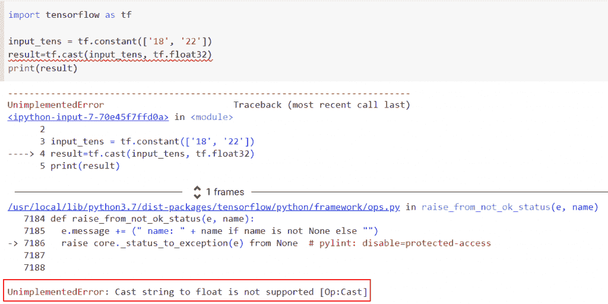

# Tensorflow 将字符串转换为整型

> 原文：<https://pythonguides.com/tensorflow-convert-string-to-int/>

[](https://sharepointsky.teachable.com/p/python-and-machine-learning-training-course)

这里我们将讨论在 [Python TensorFlow](https://pythonguides.com/tensorflow/) 中将字符串转换成整数。我们还会看一些例子，看看如何在 *`TensorFlow`* 中将字符串转换成不同的数据类型。我们将讨论这些话题。

*   Tensorflow 将字符串转换为整型
*   TensorFlow 将字符串转换为 int
*   Tensorflow 将字符串转换为浮点型
*   不支持将 TensorFlow 未实现的字符串转换为 int 64
*   不支持将 TensorFlow 字符串转换为 int32

目录

[](#)

*   [Tensorflow 将字符串转换为整型](#Tensorflow_convert_string_to_int "Tensorflow convert string to int")
*   [TensorFlow 将字符串转换为 int](#TensorFlow_cast_string_to_int "TensorFlow cast string to int")
*   [Tensorflow 将字符串转换为浮点数](#Tensorflow_converts_a_string_to_float "Tensorflow converts a string to float")
*   [TensorFlow 不支持将未实现的字符串转换为 int 64](#TensorFlow_unimplemented_cast_string_to_int_64_is_not_supported "TensorFlow unimplemented cast string to int 64 is not supported")
*   [不支持将 TensorFlow 字符串转换为 int 32](#TensorFlow_cast_string_to_int32_is_not_supported "TensorFlow cast string to int32 is not supported")

## Tensorflow 将字符串转换为整型

*   在本节中，我们将讨论如何在 Python TensorFlow 中将字符串转换为整数。
*   为了执行这个特定的任务，我们将使用 `tf.strings.to_number()` 函数，在这个函数中，我们将把字符串转换成一个整数，并给出一个数字类型。

**语法**:

让我们看一下语法，了解一下 Python TensorFlow 中 `tf.strings.to_number()` 函数的工作原理

```py
tf.strings.to_number(
    input,
    out_type=tf.dtypes.float32,
    name=None
)
```

*   它由几个参数组成
    *   **输入**:该参数定义了函数将要应用的输入张量。
    *   `out_type` :默认情况下，它采用 `df.dtypes.float32()` 值，它是一个可选参数，是要分配给字符串张量中每个字符串的数字类型。
    *   `name` :该参数指定操作的名称，默认情况下，取值为 none。

**举例**:

让我们举个例子，看看如何在 Python TensorFlow 中将字符串转换成整数。

**源代码**:

```py
import tensorflow as tf

population_of_UnitedStates = tf.constant(['12','56','78','98'])

result= tf.strings.to_number(population_of_UnitedStates,tf.int32)
print(result)
```

在下面给出的代码中，我们使用 `tf.constant()` 函数创建了一个张量，该张量的名称为 population_of_UnitedStates，在这个函数中，我们为它分配了字符串值。现在我们想把这个字符串值转换成一个整数。为此，我们使用了 `tf.strings.to_number()` 函数。

下面是以下给定代码的实现


Tensorflow convert string to int in Python

这是如何在 Python TensorFlow 中将字符串转换为整数。

阅读: [Python TensorFlow 截断法线](https://pythonguides.com/tensorflow-truncated-normal/)

## TensorFlow 将字符串转换为 int

*   让我们讨论一下如何在 Python TensorFlow 中将造型字符串转换成整数。
*   为了执行这项任务，我们将使用 `tf.cast()` 函数。该函数用于将给定的输入张量转换为新的数据类型。该函数采用两个主要参数，即正在转换的输入张量。

**语法**:

下面是 Python TensorFlow 中 `tf.cast()` 函数的语法

```py
tf.cast(
    x, dtype, name=None
)
```

*   它由几个参数组成
    *   `x` :该参数定义输入张量和数值型张量、稀疏张量或索引切片。它可能是一个 **int8、int16、int32、int64、float16、float32、float64、complex64、complex128 或 bfloat16** 。它也可能是一个 **uint8、int8、int16、int32 或 int64** 。
    *   `dtype` :该参数指定输入张量的数据类型。
    *   `name` :默认情况下，取 none 值，指定操作的名称。

**举例**:

```py
import tensorflow as tf

input_tens = tf.constant(['18', '22'])
result=tf.cast(input_tens, tf.float32)
print(result)
```

你可以参考下面的截图



TensorFlow cast string to int

在本例中，我们已经将字符串值插入到张量中，并通过使用 *`tf.cast()`* 函数将其转换为整数，但是不支持将字符串转换为浮点型。

阅读: [Python TensorFlow one_hot](https://pythonguides.com/tensorflow-one_hot/)

## Tensorflow 将字符串转换为浮点数

*   在本节中，我们将讨论如何在 Python TensorFlow 中将字符串转换为浮点数。
*   为了执行这个特定的任务，我们将使用 `tf.strings.to_number()` 函数，在这个函数中，我们将把字符串转换成一个整数，并给出一个数字类型。

**举例**:

```py
import tensorflow as tf

whitest_state_in_USA= tf.constant(['78','92','189','45'])

result= tf.strings.to_number(whitest_state_in_USA,tf.float32)
print(result)
```

下面是以下给定代码的实现


Tensorflow converts a string to float in Python

正如你在截图中看到的，我们已经将字符串转换为浮点型。

阅读:[Python tensor flow reduce _ mean](https://pythonguides.com/python-tensorflow-reduce_mean/)

## TensorFlow 不支持将未实现的字符串转换为 int 64

*   这里我们将讨论 Python TensorFlow 中不支持将未实现的字符串转换为 int 64 的错误。
*   为了执行这个特定的任务，我们将使用 `tf.cast()` 函数。这个函数用于将给定的输入张量转换为新的数据类型。
*   该函数采用两个主要参数，即正在转换的输入张量。

**举例**:

```py
import tensorflow as tf

input_tens = tf.constant(['78', '98','178'])
result=tf.cast(input_tens, tf.int64)
print(result)
```

下面是以下代码的截图


TensorFlow unimplemented cast string to int 64 is not supported

阅读: [TensorFlow Tensor to numpy](https://pythonguides.com/tensorflow-tensor-to-numpy/)

## 不支持将 TensorFlow 字符串转换为 int 32

*   在这个例子中，我们将讨论如何解决 TensorFlow 不支持将字符串转换为 int 32 的错误。
*   通过使用 `tf.cast()` 函数，我们可以很容易地生成错误，这背后的原因是这个函数不支持字符串值。

**举例**:

```py
import tensorflow as tf

input_tens = tf.constant(['167', '875','431'])
new_output=tf.cast(input_tens, tf.int32)
print(new_output)
```

你可以参考下面的截图


TensorFlow cast string to int32 is not supported

你可能也喜欢阅读下面的 Python 中的 TensorFlow 教程。

*   [梯度下降优化器张量流](https://pythonguides.com/gradient-descent-optimizer-tensorflow/)
*   [如何将字典转换成张量张量流](https://pythonguides.com/how-to-convert-dictionary-to-tensor-tensorflow/)
*   [tensor flow clip _ by _ value–完整教程](https://pythonguides.com/tensorflow-clip_by_value/)
*   [张量流图-详细指南](https://pythonguides.com/tensorflow-graph/)
*   [Tensorflow 迭代张量](https://pythonguides.com/tensorflow-iterate-over-tensor/)
*   [如何将 TensorFlow 转换为 one hot](https://pythonguides.com/convert-tensorflow-to-one-hot/)

在本文中，我们已经讨论了如何在 Python TensorFlow 中将字符串转换为整数。我们还会看一些例子，看看如何在 *`TensorFlow`* 中将字符串转换成不同的数据类型。我们已经讨论了这些主题。

*   Tensorflow 将字符串转换为整型
*   TensorFlow 将字符串转换为 int
*   Tensorflow 将字符串转换为浮点型
*   不支持将 TensorFlow 未实现的字符串转换为 int 64
*   不支持将 TensorFlow 字符串转换为 int32

[Bijay Kumar](https://pythonguides.com/author/fewlines4biju/)

Python 是美国最流行的语言之一。我从事 Python 工作已经有很长时间了，我在与 Tkinter、Pandas、NumPy、Turtle、Django、Matplotlib、Tensorflow、Scipy、Scikit-Learn 等各种库合作方面拥有专业知识。我有与美国、加拿大、英国、澳大利亚、新西兰等国家的各种客户合作的经验。查看我的个人资料。

[enjoysharepoint.com/](https://enjoysharepoint.com/)[](https://www.facebook.com/fewlines4biju "Facebook")[](https://www.linkedin.com/in/fewlines4biju/ "Linkedin")[](https://twitter.com/fewlines4biju "Twitter")