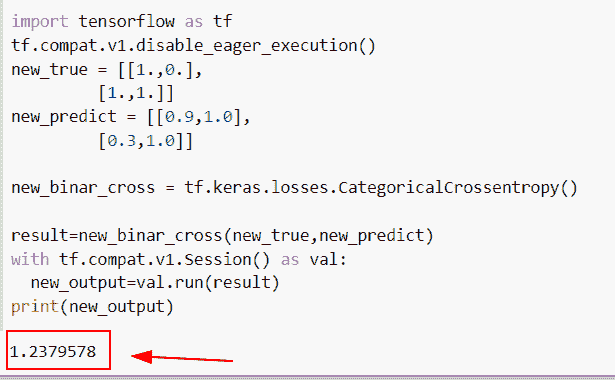
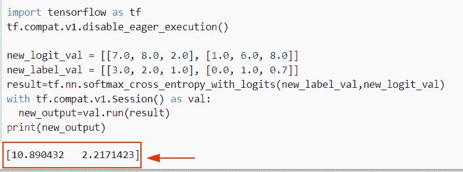
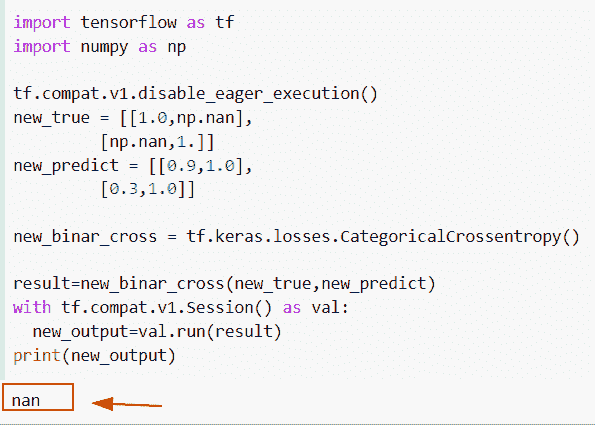
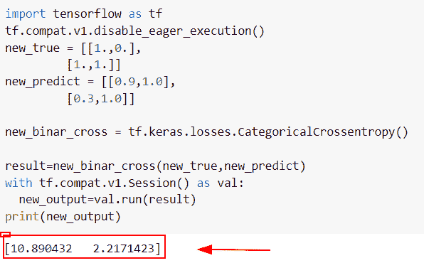
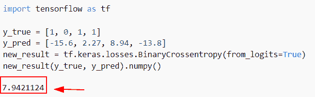
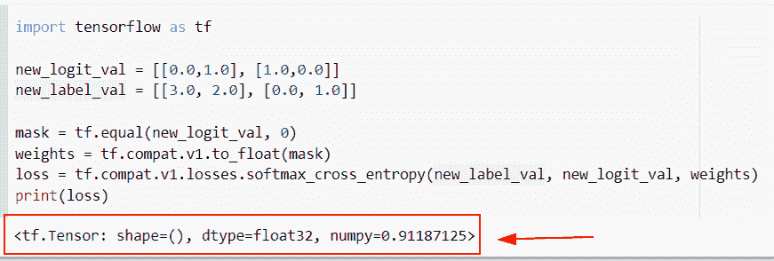
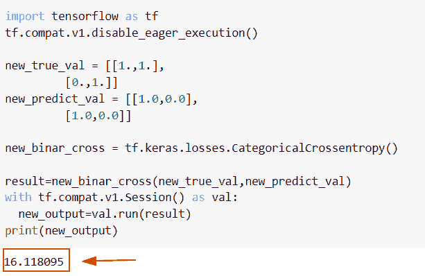
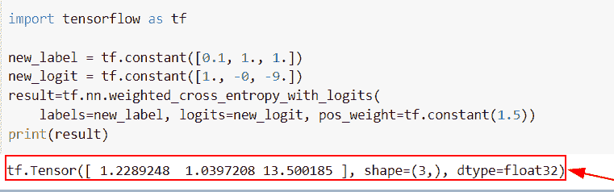
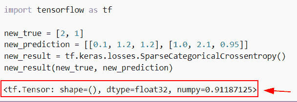

# 张量流交叉熵损失

> 原文：<https://pythonguides.com/tensorflow-cross-entropy-loss/>

[](https://sharepointsky.teachable.com/p/python-and-machine-learning-training-course)

在这个 [Python 教程中，](https://pythonguides.com/learn-python/)我们将学习**如何在 Python TensorFlow** 中计算交叉熵损失。此外，我们将涵盖以下主题。

*   logits 张量流交叉熵损失
*   张量流交叉熵损失
*   张量流交叉熵损失公式
*   不带 softmax 的张量流交叉熵损失
*   带掩模的张量流交叉熵损失
*   张量流二元交叉熵损失
*   张量流 Keras 交叉熵损失
*   张量流加权交叉熵损失
*   稀疏交叉熵损失张量流

目录

[](#)

*   [张量流交叉熵损失](#TensorFlow_cross-entropy_loss "TensorFlow cross-entropy loss")
*   [带逻辑的张量流交叉熵损失](#TensorFlow_cross-entropy_loss_with_logits "TensorFlow cross-entropy loss with logits")
*   [张量流交叉熵损失 nan](#TensorFlow_cross-entropy_loss_nan "TensorFlow cross-entropy loss nan")
*   [张量流交叉熵损失公式](#TensorFlow_cross-entropy_loss_formula "TensorFlow cross-entropy loss formula")
*   [无 softmax 的张量流交叉熵损失](#TensorFlow_cross-entropy_loss_without_softmax "TensorFlow cross-entropy loss without softmax")
*   [带掩模的张量流交叉熵损失](#TensorFlow_cross-entropy_loss_with_mask "TensorFlow cross-entropy loss with mask")
*   [张量流二元交叉熵损失](#TensorFlow_binary_cross-entropy_loss "TensorFlow binary cross-entropy loss")
*   [张量流 Keras 交叉熵损失](#TensorFlow_Keras_cross-entropy_loss "TensorFlow Keras cross-entropy loss")
*   [张量流加权交叉熵损失](#TensorFlow_weighted_cross-entropy_loss "TensorFlow weighted cross-entropy loss")
*   [稀疏交叉熵损失张量流](#Sparse_cross-entropy_loss_TensorFlow "Sparse cross-entropy loss TensorFlow")

## 张量流交叉熵损失

*   在本节中，我们将讨论如何在预测和标签之间产生交叉熵损失。
*   为了执行这个特定的任务，我们将使用 **tf。keras . loss . categoricalcrossentropy()**函数，该方法将帮助用户获得预测值和标签值之间的交叉熵损失。

**语法:**

让我们看看语法，了解一下 **tf 的工作原理。 [Python TensorFlow](https://pythonguides.com/tensorflow/) 中的 keras . loss . categoricalcrossentropy()**函数。

```py
tf.keras.losses.CategoricalCrossentropy(
    from_logits=False,
    label_smoothing=0.0,
    axis=-1,
    reduction=losses_utils.ReductionV2.AUTO,
    name='categorical_crossentropy'
)
```

*   它由几个参数组成。
    *   **from_logits:** 该参数表示 logit 值，它包含概率值为[0，1]。
    *   **label_smoothing:** 默认情况下，取 0.0 值，当大于 0 时，它将检查条件，并计算真实值之间的损失。
    *   **轴:**默认取-1 值和生成交叉熵所沿的轴。
    *   **name:** 默认情况下，它采用**‘分类 _ 交叉熵’**值，并定义操作的名称。

**举例:**

让我们举个例子，检查**如何生成预测和标签之间的交叉熵损失。**

**源代码:**

```py
import tensorflow as tf
tf.compat.v1.disable_eager_execution()
new_true = [[1.,0.],
         [1.,1.]]
new_predict = [[0.9,1.0],
         [0.3,1.0]]

new_binar_cross = tf.keras.losses.CategoricalCrossentropy()

result=new_binar_cross(new_true,new_predict)
with tf.compat.v1.Session() as val:
  new_output=val.run(result)
print(new_output)
```

在上面的代码中，我们使用了`TF . keras . loss . categoricalcrossentropy()`函数，然后将实际值和预测值赋给它。

下面是下面给出的代码的截图。



TensorFlow cross-entropy loss

阅读:[张量流乘法](https://pythonguides.com/tensorflow-multiplication/)

## 带逻辑的张量流交叉熵损失

*   在本节中，我们将借助 Python TensorFlow 中的交叉熵来计算 logits 值。
*   为了执行这个特定的任务，我们将使用`TF . nn . softmax _ cross _ entropy _ with _ logits()`函数，这个方法计算标签和逻辑之间的 soft max 交叉熵。
*   在这种方法中，标签和逻辑具有相同的数据类型，轴参数定义类维度。

**语法:**

下面是 Python TensorFlow 中`TF . nn . soft max _ cross _ entropy _ with _ logits()`的语法。

```py
tf.nn.softmax_cross_entropy_with_logits(
    labels, logits, axis=-1, name=None
)
```

*   它由几个参数组成
    *   **标签:**该参数表示类别维度，是一个有效的概率分布。
    *   **对数:**这些是典型的线性输出和非标准化对数概率。
    *   **轴:**默认情况下，取-1 值，指定最后一个维度。
    *   **name:** 默认取 none 值，定义操作的名称。

**举例:**

我们举个例子，检查一下**如何在 Python TensorFlow 中借助交叉熵计算 logits 值。**

**源代码:**

```py
import tensorflow as tf
tf.compat.v1.disable_eager_execution()

new_logit_val = [[7.0, 8.0, 2.0], [1.0, 6.0, 8.0]]
new_label_val = [[3.0, 2.0, 1.0], [0.0, 1.0, 0.7]]
result=tf.nn.softmax_cross_entropy_with_logits(new_label_val,new_logit_val)
with tf.compat.v1.Session() as val:
  new_output=val.run(result)
print(new_output)
```

在以下代码中，我们导入了 TensorFlow 库，然后创建了 logit 和 label 值。之后，我们使用了`TF . nn . soft max _ cross _ entropy _ with _ logits()`函数，在这个函数中，我们分配了标签和逻辑。

下面是以下给定代码的实现。



TensorFlow cross-entropy loss with logits

阅读:[张量流均方误差](https://pythonguides.com/tensorflow-mean-squared-error/)

## 张量流交叉熵损失 nan

*   在本节中，我们将讨论如何使用 Python TensorFlow 来检测交叉熵损失中的 nan。
*   为了执行这个特定的任务，我们将使用实际张量中的 nan 值，然后我们将使用`TF . keras . losses . categoricalcrossentropy()`函数。

**举例:**

```py
import tensorflow as tf
import numpy as np

tf.compat.v1.disable_eager_execution()
new_true = [[1.0,np.nan],
         [np.nan,1.]]
new_predict = [[0.9,1.0],
         [0.3,1.0]]

new_binar_cross = tf.keras.losses.CategoricalCrossentropy()

result=new_binar_cross(new_true,new_predict)
with tf.compat.v1.Session() as val:
  new_output=val.run(result)
print(new_output)
```

下面是以下给定代码的执行。



TensorFlow cross-entropy loss nan

正如您在屏幕截图中看到的，输出显示了 nan 值。

阅读: [Python TensorFlow 占位符](https://pythonguides.com/tensorflow-placeholder/)

## 张量流交叉熵损失公式

*   在 TensorFlow 中，损失函数用于在训练期间优化输入模型，并且该函数的主要目的是最小化损失函数。
*   交叉熵损失是优化模型的成本函数，它还获取输出概率并计算与二进制值的距离。

**举例:**

我们举个例子，检查一下**如何在 Python TensorFlow** 中使用交叉熵。

**源代码:**

```py
import tensorflow as tf
tf.compat.v1.disable_eager_execution()
new_true = [[1.,0.],
         [1.,1.]]
new_predict = [[0.9,1.0],
         [0.3,1.0]]

new_binar_cross = tf.keras.losses.CategoricalCrossentropy()

result=new_binar_cross(new_true,new_predict)
with tf.compat.v1.Session() as val:
  new_output=val.run(result)
print(new_output)
```

通过使用 **tf。keras . loss . categoricalcrossentropy()**函数，在这个函数中，我们为它设置了 new_true 和 new_predict 值。

下面是下面给出的代码的截图。



TensorFlow cross-entropy loss formula

阅读: [Tensorflow 迭代张量](https://pythonguides.com/tensorflow-iterate-over-tensor/)

## 无 softmax 的张量流交叉熵损失

*   在本节中，我们将讨论如何在 Python TensorFlow 中不使用 softmax 的情况下使用损失交叉熵。
*   为了执行这个特定的任务，我们将使用 **tf。keras . loss . categoricalcrossentropy()**函数，该方法将帮助用户获得预测值和标签值之间的交叉熵损失。

**语法:**

让我们看看语法，了解一下 **tf 的工作原理。Python TensorFlow 中的 keras . loss . categoricalcrossentropy()**函数。

```py
tf.keras.losses.CategoricalCrossentropy(
    from_logits=False,
    label_smoothing=0.0,
    axis=-1,
    reduction=losses_utils.ReductionV2.AUTO,
    name='categorical_crossentropy'
)
```

**举例:**

我们举个例子，检查一下**如何在 Python TensorFlow 中不用 softmax 使用损失交叉熵。**

**源代码:**

```py
import tensorflow as tf

y_true = [1, 0, 1, 1]
y_pred = [-15.6, 2.27, 8.94, -13.8]
new_result = tf.keras.losses.BinaryCrossentropy(from_logits=True)
new_result(y_true, y_pred).numpy()
```

在上面的代码中，我们已经导入了 TensorFlow 库，然后使用了 **tf。keras . loss . binary cross entropy()**函数，在这个函数中，我们设置了 `logits=True` 。

之后，我们分配了 **y_pred，y_true()** 值，一旦您执行了这段代码，输出将显示随机值。

下面是下面给出的代码的截图。



TensorFlow cross-entropy loss without softmax

阅读: [Python TensorFlow 截断法线](https://pythonguides.com/tensorflow-truncated-normal/)

## 带掩模的张量流交叉熵损失

*   本节我们将讨论**如何在 Python TensorFlow 中用 mask 求交叉熵。**
*   为了执行这个特定的任务，我们将使用 `tf.equal()` 来返回给定张量值的布尔值张量，并使用 `tf.compat.v1.to_float()` 来转换掩码值。
*   通过使用`TF . compat . v1 . losses . soft max _ cross _ entropy()`，这用于创建交叉熵损失。

**语法:**

下面是 Python TensorFlow 中`TF . compat . v1 . loss . soft max _ cross _ entropy()`函数的语法。

```py
tf.compat.v1.losses.softmax_cross_entropy(
    onehot_labels,
    logits,
    weights=1.0,
    label_smoothing=0,
    scope=None,
    loss_collection=ops.GraphKeys.LOSSES,
    reduction=Reduction.SUM_BY_NONZERO_WEIGHTS
)
```

*   它由几个参数组成。
    *   **独热标签:**该参数表示独热编码标签。
    *   **逻辑值:**该参数指定逻辑值。
    *   **weights:** 默认情况下，它取 1.0 值，该值被传输到 loss，它是一个可选的张量。
    *   label_smoothing:默认情况下，它取 0 值，它将检查条件，如果大于 0 值，它将平滑标签。
    *   **scope:** 它指定操作的范围，并执行损失计算。
    *   **loss_collection:** 该参数表示将要添加损失的集合。

**举例:**

我们举个例子，查一下**如何在 Python TensorFlow 中用 mask 求交叉熵。**

**源代码:**

```py
import tensorflow as tf

new_logit_val = [[0.0,1.0], [1.0,0.0]]
new_label_val = [[3.0, 2.0], [0.0, 1.0]]

mask = tf.equal(new_logit_val, 0)
weights = tf.compat.v1.to_float(mask) 
loss = tf.compat.v1.losses.softmax_cross_entropy(new_label_val, new_logit_val, weights)
print(loss)
```

在下面给定的代码中，我们使用了 tf.equal()函数，在这个函数中，我们使用 `tf.compat.v1.to_float()` 来分配 logit 值并将其转换为掩码。

下面是下面给出的代码的截图。



TensorFlow cross-entropy loss with mask

## 张量流二元交叉熵损失

*   在本节中，我们将讨论如何在 Python TensorFlow 中计算二元交叉熵损失。这点可以参考我们的详细文章[二元交叉熵张量流](https://pythonguides.com/?p=27723&preview=true)。
*   你会得到关于**二元交叉熵损失**的所有信息。

## 张量流 Keras 交叉熵损失

*   在本节中，我们将讨论如何在 Keras 中测量交叉熵损失。
*   为了执行这个特定的任务，我们将使用 **tf。keras . losses . categoricalcrossentropy()**函数，该方法将帮助用户获得预测值和标签值之间的交叉熵损失。

**语法:**

下面是 **tf 的语法。Python TensorFlow** 中的 keras . loss . categoricalcrossentropy()。

```py
tf.keras.losses.CategoricalCrossentropy(
    from_logits=False,
    label_smoothing=0.0,
    axis=-1,
    reduction=losses_utils.ReductionV2.AUTO,
    name='categorical_crossentropy'
)
```

**举例:**

我们举个例子，检查一下**如何测量 Keras** 中的交叉熵损失。

**源代码:**

```py
import tensorflow as tf
tf.compat.v1.disable_eager_execution()

new_true_val = [[1.,1.],
         [0.,1.]]
new_predict_val = [[1.0,0.0],
         [1.0,0.0]]

new_binar_cross = tf.keras.losses.CategoricalCrossentropy()

result=new_binar_cross(new_true_val,new_predict_val)
with tf.compat.v1.Session() as val:
  new_output=val.run(result)
print(new_output)
```

下面是以下给定代码的实现



TensorFlow Keras cross-entropy loss

阅读:[Python tensor flow expand _ dims](https://pythonguides.com/tensorflow-expand_dims/)

## 张量流加权交叉熵损失

*   在本节中，我们将通过 Python TensorFlow 讨论如何在交叉熵损失中使用权重。
*   为了执行这个特定的任务，我们将使用 TF . nn . weighted _ cross _ entropy _ with _ logits()函数，这个函数将帮助用户找到加权交叉熵。

**举例:**

我们举个例子，通过使用 Python TensorFlow 来检查**如何使用交叉熵损失中的权重。**

**源代码:**

```py
import tensorflow as tf

new_label = tf.constant([0.1, 1., 1.])
new_logit = tf.constant([1., -0, -9.])
result=tf.nn.weighted_cross_entropy_with_logits(
    labels=new_label, logits=new_logit, pos_weight=tf.constant(1.5))
print(result)
```

下面是以下给定代码的实现。



TensorFlow weighted cross-entropy loss

阅读:[Python tensor flow reduce _ mean](https://pythonguides.com/python-tensorflow-reduce_mean/)

## 稀疏交叉熵损失张量流

*   在本节目中，我们将讨论如何在 Python TensorFlow 中稀疏交叉熵损失。
*   为了执行此特定任务，我们将使用 TF . keras . loss . sparsecategoricalcrossentropy()函数，此方法用于查找预测和标签之间的交叉熵损失。

**语法:**

我们先来看看语法，了解一下`TF . keras . loss . sparsecategoricalcrossentropy()`函数在 Python TensorFlow 中的工作原理。

```py
tf.keras.losses.SparseCategoricalCrossentropy(
    from_logits=False,
    reduction=losses_utils.ReductionV2.AUTO,
    name='sparse_categorical_crossentropy'
)
```

*   它由几个参数组成。
    *   **from_logits:** 该参数表示 y_prediction 对概率分布进行编码，默认情况下，它采用一个假值。
    *   名称:默认情况下，它采用' sparse _ categorical _ crossentropy '并指定操作的名称。

**举例:**

让我们举个例子，看看如何在 Python TensorFlow 中稀疏交叉熵损失。

**源代码:**

```py
import tensorflow as tf 

new_true = [2, 1]
new_prediction = [[0.1, 1.2, 1.2], [1.0, 2.1, 0.95]]
new_result = tf.keras.losses.SparseCategoricalCrossentropy()
new_result(new_true, new_prediction)
```

下面是以下给定代码的实现



sparse cross-entropy loss TensorFlow

还有，多看看一些 TensorFlow 教程。

*   [Python tensor flow reduce _ sum](https://pythonguides.com/python-tensorflow-reduce_sum/)
*   [TensorFlow Tensor to numpy](https://pythonguides.com/tensorflow-tensor-to-numpy/)
*   [Python TensorFlow one_hot](https://pythonguides.com/tensorflow-one_hot/)
*   [TensorFlow 全连通层](https://pythonguides.com/tensorflow-fully-connected-layer/)

在这个 [Python 教程中，](https://pythonguides.com/learn-python/)我们学习了**如何在 Python TensorFlow** 中计算交叉熵损失。此外，我们还讨论了以下主题。

*   logits 张量流交叉熵损失
*   张量流交叉熵损失
*   张量流交叉熵损失公式
*   不带 softmax 的张量流交叉熵损失
*   带掩模的张量流交叉熵损失
*   张量流二元交叉熵损失
*   张量流 Keras 交叉熵损失
*   张量流加权交叉熵损失
*   稀疏交叉熵损失张量流

[Bijay Kumar](https://pythonguides.com/author/fewlines4biju/)

Python 是美国最流行的语言之一。我从事 Python 工作已经有很长时间了，我在与 Tkinter、Pandas、NumPy、Turtle、Django、Matplotlib、Tensorflow、Scipy、Scikit-Learn 等各种库合作方面拥有专业知识。我有与美国、加拿大、英国、澳大利亚、新西兰等国家的各种客户合作的经验。查看我的个人资料。

[enjoysharepoint.com/](https://enjoysharepoint.com/)[](https://www.facebook.com/fewlines4biju "Facebook")[](https://www.linkedin.com/in/fewlines4biju/ "Linkedin")[](https://twitter.com/fewlines4biju "Twitter")