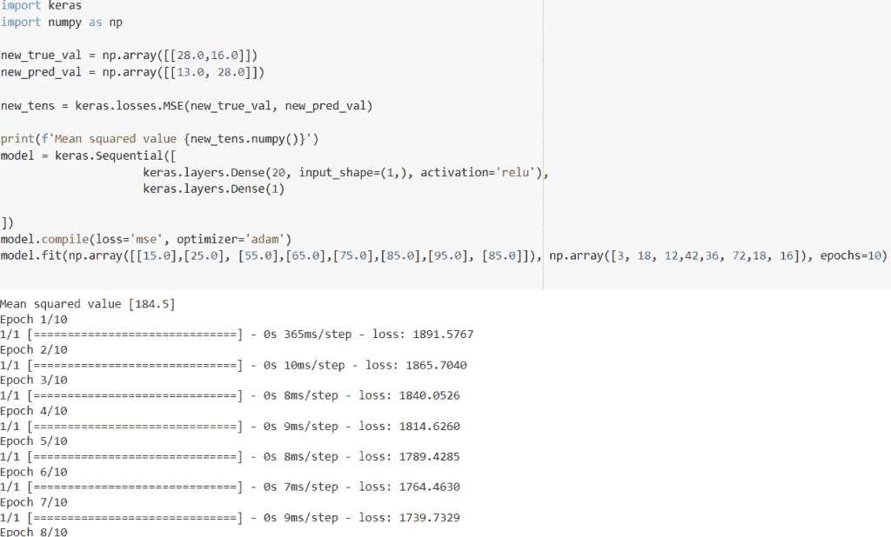
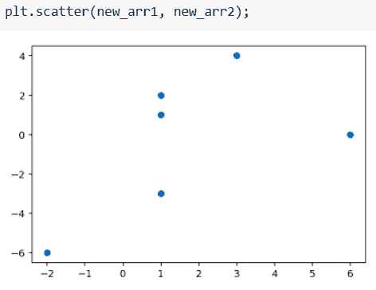
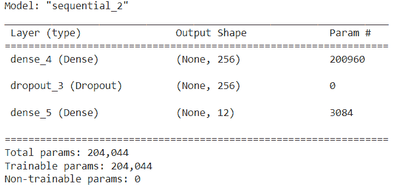
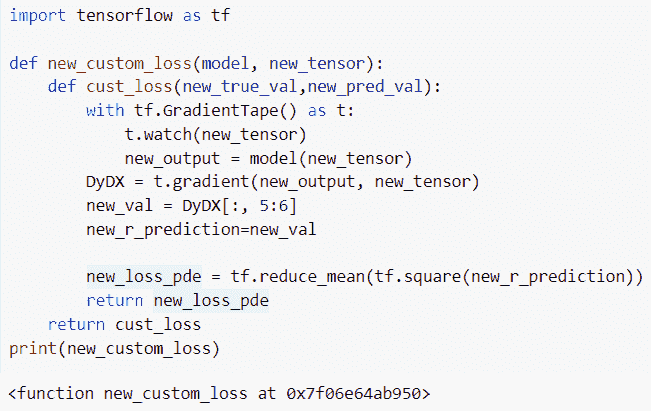
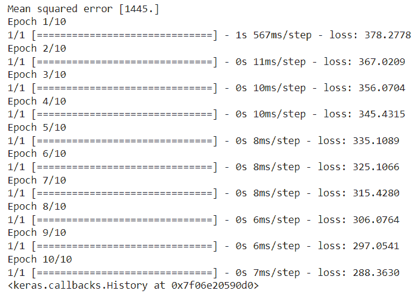

# 张量流自定义损失函数

> 原文：<https://pythonguides.com/tensorflow-custom-loss-function/>

[](https://sharepointsky.teachable.com/p/python-and-machine-learning-training-course)

在本 [Python 教程中，](https://pythonguides.com/learn-python/)我们将学习**如何使用 Python TensorFlow** 中的自定义损失函数。此外，我们将涵盖以下主题。

*   张量流自定义损失函数
*   Tensorflow custom loss function Keras
*   张量流自定义损失函数多路输出
*   张量流自定义损失函数梯度
*   张量流自定义损失函数 numpy
*   具有自定义损失函数的张量流负荷模型

目录

[](#)

*   [张量流自定义损失函数](#Tensorflow_custom_loss_function "Tensorflow custom loss function")
*   [Tensorflow custom loss function Keras](#Tensorflow_custom_loss_function_Keras "Tensorflow custom loss function Keras")
*   [带自定义损失函数的张量流负荷模型](#Tensorflow_load_model_with_a_custom_loss_function "Tensorflow load model with a custom loss function")
*   [Tensorflow 自定义损失函数梯度](#Tensorflow_custom_loss_function_gradient "Tensorflow custom loss function gradient")
*   [Tensorflow 自定义损失函数 numpy](#Tensorflow_custom_loss_function_numpy "Tensorflow custom loss function numpy")

## 张量流自定义损失函数

*   这里我们将使用 [Python TensorFlow](https://pythonguides.com/tensorflow/) 中的自定义损失函数。
*   损失函数是机器学习模型的主要部分。如果你在数据科学领域工作过，你一定听说过它。
*   **损失函数**，也称为**成本函数**是一种特殊类型的函数，它帮助我们最小化误差，并获得期望输出的可能性。
*   **均方误差**，该损失是用于回归问题的默认损失。通过在编译模型时声明' `mse` 或' `mean_squared_error` '作为损失函数，可以在 Keras 中使用均方误差损失函数。

**语法:**

下面是 **tf 的语法。Keras . Sequential()**tensor flow Keras 中的函数。

```py
tf.keras.Sequential
                   (
                    layers=None,
                    name=None
                   )
```

*   它由几个参数组成
    *   **图层:**该参数表示插入模型的图层列表。
    *   **name:** 可选参数，指定操作的名称。

**举例:**

```py
import keras
import numpy as np

new_true_val = np.array([[28.0,16.0]]) 
new_pred_val = np.array([[13.0, 28.0]])

new_tens = keras.losses.MSE(new_true_val, new_pred_val)

print(f'Mean squared value {new_tens.numpy()}')
model = keras.Sequential([
                     keras.layers.Dense(20, input_shape=(1,), activation='relu'),
                     keras.layers.Dense(1)

])
model.compile(loss='mse', optimizer='adam')
model.fit(np.array([[15.0],[25.0], [55.0],[65.0],[75.0],[85.0],[95.0], [85.0]]), np.array([3, 18, 12,42,36, 72,18, 16]), epochs=10)
```

在下面给出的代码中，我们首先导入了 Keras 和 NumPy 库。之后，我们使用`*keras . losses . MSE()*`函数，并分配真实值和预测值。

接下来，我们使用 Keras 创建了一个模型。Sequential()函数，在这个函数中，我们将输入形状和激活值设置为参数。创建模型后，我们编译并拟合了模型。

下面是以下代码的截图



Custom loss function in Tensorflow

阅读:[tensor flow next _ batch+Examples](https://pythonguides.com/tensorflow-next_batch/)

## Tensorflow custom loss function Keras

*   在本节中，我们将讨论如何在 Tensorflow Keras 中使用自定义损失函数。
*   损失函数的主要目的是生成一个模型在训练期间应该寻求最小化的数量。损失函数是执行 Keras 模型所需的两个参数之一。
*   损失函数由损失类声明(例如，keras . loss . sparsecategoricalcrossentropy)。所有损失也作为函数句柄给出(例如，keras . loss . sparse _ categorial _ cross entropy)。
*   在 Keras 中，损失函数在编译阶段传递。在这个例子中，我们通过创建 loss 类的一个实例来定义 loss 函数。使用该类很简单，因为您可以传递一些附加参数。

**举例:**

我们举个例子，检查一下如何使用 TensorFlow Keras 中的自定义损失函数。

**源代码:**

```py
import tensorflow as tf

import matplotlib.pyplot as plt
import numpy as np
import pandas as pd
from tensorflow.keras.utils import plot_model
from tensorflow.keras import backend as K

new_arr1= np.array([-2.0, 1.0, 1.0, 1.0, 6.0, 3.0], dtype=np.float64)

new_arr2 = np.array([-6.0, -3.0, 2.0, 1.0, 0.0, 4.0], dtype=np.float64)
plt.scatter(new_arr1, new_arr2);

model = tf.keras.Sequential([
    tf.keras.layers.Dense(1, input_shape=[1])
])

model.compile(optimizer='sgd', loss='mean_squared_error')
model.fit(new_arr1, new_arr2, epochs=500, verbose=0)

new_mean_squ_val = model.predict([20])
new_mean_squ_val

plt.scatter(new_arr1, new_arr2)
plt.scatter(20, new_mean_squ_val, c='r');

def my_huber_loss(new_true_val, new_pred_val):
    new_thres_val = 1.
    error = new_true_val - new_pred_val
    smal_err = tf.abs(error) <= new_thres_val
    new_err_loss = tf.square(error) / 2
    max_err_loss = new_thres_val * (tf.abs(error) - new_thres_val / 2)
    return tf.where(smal_err, new_err_loss, max_err_loss)

model = tf.keras.Sequential([
    tf.keras.layers.Dense(units=1, input_shape=[1,])
])

model.compile(optimizer='sgd', loss=my_huber_loss)
model.fit(new_arr1, new_arr2, epochs=500, verbose=0)

new_predict_val = model.predict([20.0])
new_predict_val

plt.scatter(new_arr1, new_arr2);
plt.scatter(20.0, new_mean_squ_val, label='mse');
plt.scatter(20.0, new_predict_val, label='huber_loss');
plt.grid()
plt.legend();
```

下面是给定代码的实现。



custom loss function Tensorflow keras

阅读: [TensorFlow 稀疏张量](https://pythonguides.com/tensorflow-sparse-tensor/)

## 带自定义损失函数的张量流负荷模型

*   在这个例子中，我们将学习如何在 [Python TensorFlow](https://pythonguides.com/tensorflow/) 中加载带有自定义损失函数的模型。
*   为了执行这个特定的任务，我们将使用 `mnist.load_data()` 数据集，并将数据集分成训练和测试标签。
*   接下来，我们将使用 **tf。Keras.models.Sequential()** 函数，该函数用于向 Keras 模型添加线性层堆栈。

**举例:**

```py
import os
from tensorflow import keras
import tensorflow as tf
(new_train_imag, new_train_label), (test_images, new_test_label) = tf.keras.datasets.mnist.load_data()

train_labels = new_train_label[:2000]
new_test_label = new_test_label[:2000]

new_train_imag = new_train_imag[:2000].reshape(-2, 14 * 14) / 255.0
test_images = test_images[:2000].reshape(-1, 14 * 14) / 255.0
def declare_new_model():
  new_model = tf.keras.models.Sequential([
    keras.layers.Dense(256, activation='relu', input_shape=(784,)),
    keras.layers.Dropout(0.7),
    keras.layers.Dense(12)
  ])

  new_model.compile(optimizer='adam',
                loss=tf.losses.SparseCategoricalCrossentropy(from_logits=True),
                metrics=[tf.metrics.SparseCategoricalAccuracy()])

  return new_model

new_model = declare_new_model()

new_model.summary()
```

在下面给出的代码中，我们使用了 **tf。Keras.models.Sequential()** 函数，在这个函数中，我们将激活和**输入 _ 形状()**值设置为参数。之后，我们使用了 model.compile()并使用了`TF . losses . sparsecategoricalcrossentropy()`。

下面是下面给出的代码的截图。



model creation in the custom loss function

阅读: [TensorFlow 全球平均池](https://pythonguides.com/tensorflow-global-average-pooling/)

## Tensorflow 自定义损失函数梯度

*   在本节中，我们将讨论如何在 Tensorflow 自定义损失函数中使用梯度带。
*   在这个例子中，我们将使用 **tf。GradientTape()** 函数，该函数用于使用该模型中的操作来生成梯度。

**语法:**

让我们看一下语法并理解 Python TensorFlow 中的 `tf.gradients()` 函数的工作原理

```py
tf.gradients
   (
    ys,
    xs,
    grad_ys=None,
    name='gradients',
    gate_gradients=False,
    aggregation_method=None,
    stop_gradients=None,
   )
```

*   它由几个参数组成
    *   **ys:** 该参数表示要微分的输入张量列表。
    *   **grad_ys:** 可选参数，指定与 ys 大小相同的张量列表，在 ys 中计算每个 y。
    *   **name:** 默认情况下，取渐变的值，指定操作的名称。
    *   **gate_gradients:** 如果为真，那么它将添加一个元组，并且还将避免一些条件。默认情况下，它采用一个假值。
    *   **aggregation_method:** 该函数用于合并渐变值。

**举例:**

```py
import tensorflow as tf

def new_custom_loss(model, new_tensor):
    def cust_loss(new_true_val,new_pred_val):
        with tf.GradientTape() as t:
            t.watch(new_tensor)
            new_output = model(new_tensor)
        DyDX = t.gradient(new_output, new_tensor)
        new_val = DyDX[:, 5:6]
        new_r_prediction=new_val

        new_loss_pde = tf.reduce_mean(tf.square(new_r_prediction))
        return new_loss_pde
    return cust_loss
print(new_custom_loss)
```

在上面的代码中，我们定义了 `cust_loss` 函数，并分配了真实值和预测值。之后，我们创建了一个与 **tf 的会话。GradientTape()** 函数，并为其设置张量值。

下面是以下给定代码的实现。



Tensorflow custom loss function gradient

阅读:[二元交叉熵张量流](https://pythonguides.com/binary-cross-entropy-tensorflow/)

## Tensorflow 自定义损失函数 numpy

*   在本例中，我们将在自定义损失函数中使用 numpy 数组。
*   为了完成这项任务，首先我们将创建一个包含样本数据的数组，并使用 `numpy()` 函数来查找均方值。
*   接下来，我们将使用 `tf.keras.Sequential()` 函数，并为输入形状分配密集值。

**语法:**

下面是 Python TensorFlow 中 `tf.keras.Sequential()` 函数的语法

```py
tf.keras.Sequential
                   (
                    layers=None,
                    name=None
                   )
```

**举例:**

```py
import keras
import numpy as np

new_true = np.array([[76.0,65.0]]) #sample data
new_prediction = np.array([[23.0, 56.0]])

new_arr = keras.losses.MSE(new_true, new_prediction)

print(f'Mean squared error {new_arr.numpy()}')
new_model = keras.Sequential([keras.layers.Dense(20, input_shape=(1,), activation='relu'),keras.layers.Dense(1)

])
new_model.compile(loss='mse', optimizer='adam')
new_model.fit(np.array([[80.0],[40.0], [60.0],[90.0],[40.0],[10.0],[70.0], [50.0]]), np.array([4, 8, 12,16,20, 24,28, 30]), epochs=10)
```

下面是以下给定代码的执行过程



Tensorflow custom loss function numpy

还有，多看看一些 TensorFlow 教程。

*   [TensorFlow feed_dict](https://pythonguides.com/tensorflow-feed_dict/)
*   [张量流图-详细指南](https://pythonguides.com/tensorflow-graph/)
*   [TensorFlow 获取变量+示例](https://pythonguides.com/tensorflow-get-variable/)
*   [TensorFlow 学习率调度器](https://pythonguides.com/tensorflow-learning-rate-scheduler/)
*   [张量流均方误差](https://pythonguides.com/tensorflow-mean-squared-error/)
*   [Tensorflow 迭代张量](https://pythonguides.com/tensorflow-iterate-over-tensor/)

在本 Python 教程中，我们学习了**如何使用 Python TensorFlow** 中的自定义损失函数。此外，我们还讨论了以下主题。

*   Custom loss function TensorFlow Keras
*   张量流自定义损失函数多路输出
*   张量流自定义损失函数梯度
*   张量流自定义损失函数 numpy
*   具有自定义损失函数的张量流负荷模型

[Bijay Kumar](https://pythonguides.com/author/fewlines4biju/)

Python 是美国最流行的语言之一。我从事 Python 工作已经有很长时间了，我在与 Tkinter、Pandas、NumPy、Turtle、Django、Matplotlib、Tensorflow、Scipy、Scikit-Learn 等各种库合作方面拥有专业知识。我有与美国、加拿大、英国、澳大利亚、新西兰等国家的各种客户合作的经验。查看我的个人资料。

[enjoysharepoint.com/](https://enjoysharepoint.com/)[](https://www.facebook.com/fewlines4biju "Facebook")[](https://www.linkedin.com/in/fewlines4biju/ "Linkedin")[](https://twitter.com/fewlines4biju "Twitter")