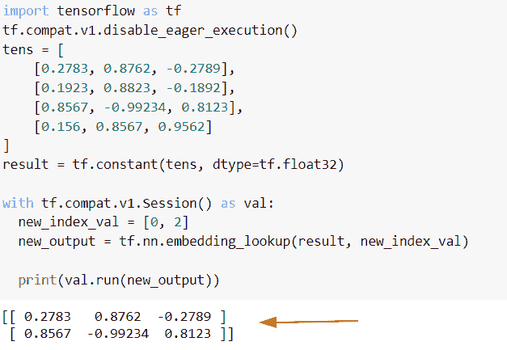
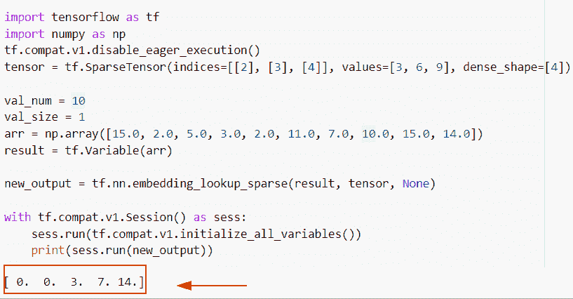
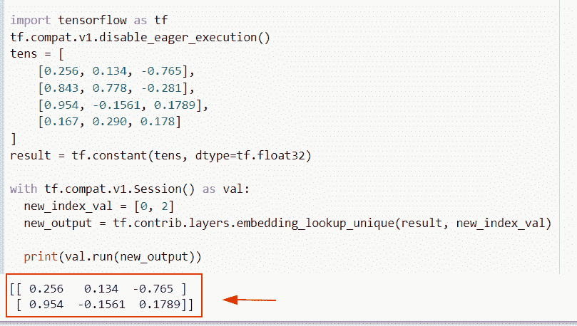
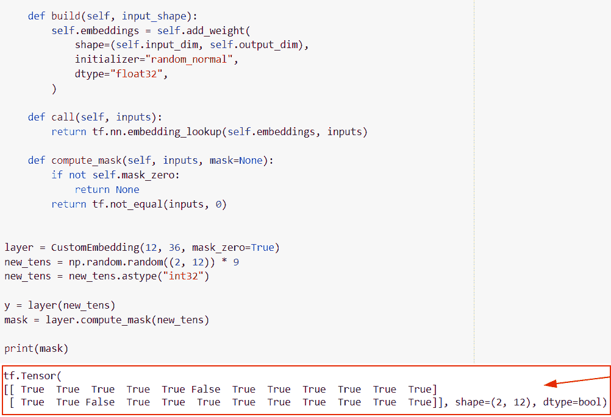
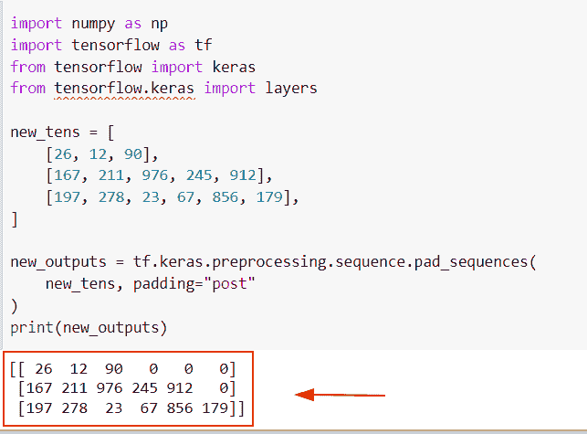
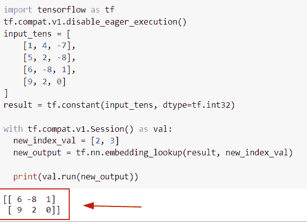
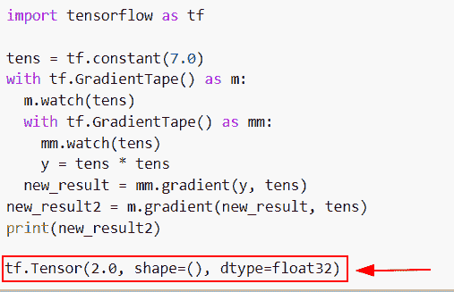

# 张量流嵌入 _ 查找

> 原文：<https://pythonguides.com/tensorflow-embedding_lookup/>

[](https://sharepointsky.teachable.com/p/python-and-machine-learning-training-course)

在本 [Python 教程中，](https://pythonguides.com/learn-python/)我们将学习**如何在 Python TensorFlow** 中使用 tf.nn.embedding_lookup()函数。此外，我们将涵盖以下主题。

*   张量流嵌入 _ 查找
*   Tensorflow 嵌入 _ 查找 _ 稀疏
*   Tensorflow 嵌入 _ 查找 _ 唯一
*   张量流嵌入 _ 查找掩码
*   张量流嵌入 _ 查找补零
*   张量流嵌入 _ 查找集合
*   张量流嵌入 _ 查找梯度

目录

[](#)

*   [TensorFlow 嵌入 _ 查找](#TensorFlow_embedding_lookup "TensorFlow embedding_lookup")
*   [Tensorflow 嵌入 _ 查找 _ 稀疏](#Tensorflow_embedding_lookup_sparse "Tensorflow embedding_lookup_sparse")
*   [Tensorflow 嵌入 _ 查找 _ 唯一](#Tensorflow_embedding_lookup_unique "Tensorflow embedding_lookup_unique")
*   [Tensorflow 嵌入 _ 查找掩码](#Tensorflow_embedding_lookup_mask "Tensorflow embedding_lookup mask")
*   [Tensorflow 嵌入 _ 查找补零](#Tensorflow_embedding_lookup_zero_padding "Tensorflow embedding_lookup zero padding")
*   [张量流嵌入 _ 查找道集](#Tensorflow_embedding_lookup_gather "Tensorflow embedding_lookup gather")
*   [张量流嵌入 _ 查找梯度](#Tensorflow_embedding_lookup_gradient "Tensorflow embedding_lookup gradient")

## TensorFlow 嵌入 _ 查找

*   在本节中，我们将讨论如何在 [Python TensorFlow](https://pythonguides.com/tensorflow/) 中嵌入张量列表。
*   为了执行这个特定的任务，我们将使用 `tf.nn.embedding_lookup()` 函数，这个函数用于在张量列表上生成查找。
*   简而言之，该函数定义了根据索引号恢复第一个参数的行的操作。

**语法:**

下面是 Python TensorFlow 中 `tf.nn.embedding_lookup()` 函数的语法。

```py
tf.nn.embedding_lookup
                      (
                       params,
                       ids,
                       max_norm=None,
                       name=None
                      )
```

*   它由几个参数组成
    *   **params:** 该参数表示分片嵌入张量。
    *   默认情况下，它采用 int32 和 int64 位类型，并在 params 中查找。
    *   max_norm:默认情况下，它没有值，并且大于它的值。
    *   name:默认情况下，它采用 none 值并定义操作的名称。

**举例:**

```py
import tensorflow as tf
tf.compat.v1.disable_eager_execution()
tens = [
    [0.2783, 0.8762, -0.2789],
    [0.1923, 0.8823, -0.1892],
    [0.8567, -0.99234, 0.8123],
    [0.156, 0.8567, 0.9562]
]
result = tf.constant(tens, dtype=tf.float32)

with tf.compat.v1.Session() as val:
  new_index_val = [0, 2]
  new_output = tf.nn.embedding_lookup(result, new_index_val)

  print(val.run(new_output))
```

在下面的代码中，我们导入了 TensorFlow 库，然后通过导入`TF . compat . v1 . disable _ eager _ execution()`函数创建了一个会话。

之后，我们声明了一个变量并分配了索引值，并使用了 `tf.nn.embedding_lookup()` 函数。

下面是以下给定代码的实现。



TensorFlow embedding_lookup

阅读:[张量流获取变量](https://pythonguides.com/tensorflow-get-variable/)

## Tensorflow 嵌入 _ 查找 _ 稀疏

*   在本节中，我们将讨论如何在 Python TensorFlow 中查找权重和 id 的嵌入。
*   为了执行这个特定的任务，我们将使用`TF . nn . embedding _ lookup _ sparse()`函数，这个函数将帮助用户嵌入来自输入张量列表的给定权重和 id。

**语法:**

我们先来看看语法，了解一下`TF . nn . embedding _ lookup _ space`在 Python TensorFlow 中的工作原理。

```py
tf.nn.embedding_lookup_sparse
                             (
                              params,
                              sp_ids,
                              sp_weights,
                              combiner=None,
                              max_norm=None,
                              name=None
                             )
```

*   它由几个参数组成
    *   **params:** 该参数表示输入张量和相同形状的列表。
    *   **sp_ids:** 该参数指定了 `int64 ids` 的稀疏张量。
    *   **sp_weights:** 在这个参数中，我们要指定所有的权重，它必须取为 1。
    *   **combiner:** 默认情况下，它接受 None 值，并为每行生成嵌入结果的加权和。
    *   **max_norm:** 默认取 `None` 值，大于合并前的值。
    *   **名称:**默认为可选参数，指定操作的名称。

**举例:**

```py
 import tensorflow as tf
import numpy as np
tf.compat.v1.disable_eager_execution()
tensor = tf.SparseTensor(indices=[[2], [3], [4]], values=[3, 6, 9], dense_shape=[4])

val_num = 10
val_size = 1
arr = np.array([15.0, 2.0, 5.0, 3.0, 2.0, 11.0, 7.0, 10.0, 15.0, 14.0])
result = tf.Variable(arr)

new_output = tf.nn.embedding_lookup_sparse(result, tensor, None)

with tf.compat.v1.Session() as sess:
    sess.run(tf.compat.v1.initialize_all_variables())
    print(sess.run(new_output))
```

在上面的代码中，我们使用了 **tf。SparseTensor()** 函数，并将索引值和密集形状作为参数赋值。之后，我们声明了变量，其中我们提到了给定输入张量的大小。

下面是以下给定代码的实现。



Tensorflow embedding_lookup_sparse

阅读: [Python TensorFlow 占位符](https://pythonguides.com/tensorflow-placeholder/)

## Tensorflow 嵌入 _ 查找 _ 唯一

*   在本节中，我们将讨论如何从 Python TensorFlow 中的嵌入式查找中获取唯一值。
*   为了执行这个特定的任务，我们将使用`TF . contrib . layers . embedding _ lookup _ unique()`，这个函数只在 **Tensorflow 1.15.0 版本**中有效，并且这个函数避免了重复查找。

**语法:**

让我们看一下语法，了解一下`TF . contrib . layers . embedding _ lookup _ unique()`的工作原理

```py
tf.contrib.layers.embedding_lookup_unique(
    params,
    ids,
    name=None
)
```

**举例:**

让我们举一个例子，看看如何从 Python TensorFlow 中的嵌入式查找中获得唯一值。

**源代码:**

```py
import tensorflow as tf
tf.compat.v1.disable_eager_execution()
tens = [
    [0.256, 0.134, -0.765],
    [0.843, 0.778, -0.281],
    [0.954, -0.1561, 0.1789],
    [0.167, 0.290, 0.178]
]
result = tf.constant(tens, dtype=tf.float32)

with tf.compat.v1.Session() as val:
  new_index_val = [0, 2]
  new_output = tf.contrib.layers.embedding_lookup_unique(result, new_index_val)

  print(val.run(new_output))
```

下面是以下给定代码的输出。



Tensorflow embedding_lookup_unique

阅读: [Tensorflow 迭代张量](https://pythonguides.com/tensorflow-iterate-over-tensor/)

## Tensorflow 嵌入 _ 查找掩码

*   在本节中，我们将讨论如何在 Python TensorFlow 中使用 embedding_lookup 来获取掩码值。
*   为了执行这个特定的任务，我们将定义 `CustomEmbedding()` 函数，然后为输入张量创建输入和输出维度。
*   接下来，我们将设置条件 self inputs，如果不是，那么`self . mask _ zero()`return None 如果不是，那么它将返回 `0` 。

**举例:**

让我们举个例子，检查一下**如何通过 Python TensorFlow 中的嵌入式查找获得掩码值。**

**源代码:**

```py
import tensorflow as tf
import numpy as np
class CustomEmbedding(keras.layers.Layer):
    def __init__(self, new_inp_dim, new_out_dim, mask_zero=False, **kwargs):
        super(CustomEmbedding, self).__init__(**kwargs)
        self.input_dim = new_inp_dim
        self.output_dim = new_out_dim
        self.mask_zero = mask_zero

    def build(self, input_shape):
        self.embeddings = self.add_weight(
            shape=(self.input_dim, self.output_dim),
            initializer="random_normal",
            dtype="float32",
        )

    def call(self, inputs):
        return tf.nn.embedding_lookup(self.embeddings, inputs)

    def compute_mask(self, inputs, mask=None):
        if not self.mask_zero:
            return None
        return tf.not_equal(inputs, 0)

layer = CustomEmbedding(12, 36, mask_zero=True)
new_tens = np.random.random((2, 12)) * 9
new_tens = new_tens.astype("int32")

y = layer(new_tens)
mask = layer.compute_mask(new_tens)

print(mask)
```

在下面给出的代码中，我们通过使用 `np.random.random()` 函数创建了一个随机值，然后将数据类型指定为 `int32` 。一旦执行了这段代码，输出将显示布尔掩码值。

下面是下面给出的代码的截图。



Tensorflow embedding_lookup mask

阅读:[将列表转换为张量张量流](https://pythonguides.com/convert-list-to-tensor-tensorflow/)

## Tensorflow 嵌入 _ 查找补零

*   在这个程序中，我们将讨论如何在 embedding _ lookup Python tensor flow 中填充零值。
*   为了完成这项任务，我们将使用`TF . keras . preprocessing . sequence . pad _ sequences()`函数，该函数用于获得给定张量的相同长度。

**语法:**

我们先来看看语法，了解一下 Python Tensorflow 中 TF . keras . preprocessing . sequence . pad _ sequences()函数的工作原理。

```py
tf.keras.preprocessing.sequence.pad_sequences(
    sequences,
    maxlen=None,
    dtype='int32',
    padding='pre',
    truncating='pre',
    value=0.0
)
```

*   它由几个参数组成
    *   **序列:**该参数表示序列列表。
    *   **maxlen:** 默认情况下，它采用 none 值，并指定所有序列的最大长度。它将检查条件，如果没有提供序列，那么这个参数将用相同的长度填充。
    *   **dtype:** 默认取 int32 值，可选参数，类型为输出序列。
    *   **填充:**默认情况下，它是一个前值，指定每个序列的前后。
    *   **截断:**这是一个可选参数，它从大于最大长度的序列中删除值。
    *   **值:**默认为 0，指定填充值。

**举例:**

让我们举个例子，检查如何在 embedding _ lookup Python tensor flow 中填充零值。

**源代码:**

```py
import numpy as np
import tensorflow as tf
from tensorflow import keras
from tensorflow.keras import layers

new_tens = [
    [26, 12, 90],
    [167, 211, 976, 245, 912],
    [197, 278, 23, 67, 856, 179],
]

new_outputs = tf.keras.preprocessing.sequence.pad_sequences(
    new_tens, padding="post"
)
print(new_outputs)
```

在下面的代码中，我们导入了 numpy 和 TensorFlow 库，然后创建了一个张量。之后，我们使用了`TF . keras . preprocessing . sequence . pad _ sequences()`函数，在这个函数中，我们将填充和张量指定为一个参数。

下面是下面给出的代码的截图。



Tensorflow embedding_lookup zero padding

阅读:[Python tensor flow expand _ dims](https://pythonguides.com/tensorflow-expand_dims/)

## 张量流嵌入 _ 查找道集

*   在本节中，我们将讨论如何在 Python TensorFlow 中收集 embedding_lookup。
*   为了执行这个特定的任务，我们将使用 `tf.nn.embedding_lookup()` 函数，这个函数用于在张量列表上生成查找。

**语法:**

```py
tf.nn.embedding_lookup
                      (
                       params,
                       ids,
                       max_norm=None,
                       name=None
                      )
```

**举例:**

```py
import tensorflow as tf
tf.compat.v1.disable_eager_execution()
input_tens = [
    [1, 4, -7],
    [5, 2, -8],
    [6, -8, 1],
    [9, 2, 0]
]
result = tf.constant(input_tens, dtype=tf.int32)

with tf.compat.v1.Session() as val:
  new_index_val = [2, 3]
  new_output = tf.nn.embedding_lookup(result, new_index_val)

  print(val.run(new_output))
```

在下面的代码中，我们导入了 TensorFlow 库，然后通过导入`TF . compat . v1 . disable _ eager _ execution()`函数创建了一个会话。

之后，我们声明了一个变量并分配了索引值，并使用了 `tf.nn.embedding_lookup()` 函数。

下面是以下给定代码的实现。



Tensorflow embedding_lookup gather

阅读: [Python TensorFlow one_hot](https://pythonguides.com/tensorflow-one_hot/)

## 张量流嵌入 _ 查找梯度

*   在本节中，我们将讨论 Python TensorFlow 中 embedding_lookup 中的梯度。
*   为了完成这个任务，我们将使用 **tf。GradientTape()** 功能，该功能用于记录自动微分的操作。

**语法:**

让我们看看语法，了解一下 **tf 的工作原理。Python TensorFlow 中的 GradientTape()** 函数。

```py
tf.GradientTape(
    persistent=False, watch_accessed_variables=True
)
```

*   它由几个参数组成。
    *   **persistent:** 默认情况下，它取一个假值，它指定声明了持久梯度带。
    *   **watch _ accessed _ variables:**该参数表示梯度的真实含义，可以用读取训练变量得到的任何结果来表示。

**举例:**

我们举个例子，检查一下**Python tensor flow 中 embedding_lookup 中的梯度是如何的。**

**源代码:**

```py
import tensorflow as tf

tens = tf.constant(7.0)
with tf.GradientTape() as m:
  m.watch(tens)
  with tf.GradientTape() as mm:
    mm.watch(tens)
    y = tens * tens
  new_result = mm.gradient(y, tens) 
new_result2 = m.gradient(new_result, tens)  
print(new_result2)
```

在下面给出的代码中，我们通过使用 `tf.constant()` 函数创建了张量，然后我们定义了内置函数 **tf。GradientTape()** 。

下面是下面给出的代码的截图。



Tensorflow embedding_lookup gradient

你可能也喜欢阅读下面的 TensorFlow 教程。

*   [Python TensorFlow 随机均匀](https://pythonguides.com/tensorflow-random-uniform/)
*   [Python tensor flow reduce _ mean](https://pythonguides.com/python-tensorflow-reduce_mean/)
*   [Python tensor flow reduce _ sum](https://pythonguides.com/python-tensorflow-reduce_sum/)
*   [TensorFlow Tensor to numpy](https://pythonguides.com/tensorflow-tensor-to-numpy/)
*   [梯度下降优化器张量流](https://pythonguides.com/gradient-descent-optimizer-tensorflow/)

在本 Python 教程中， [](https://pythonguides.com/learn-python/) 我们学习了**如何在 Python TensorFlow** 中使用 tf.nn.embedding_lookup()函数。此外，我们还讨论了以下主题。

*   张量流嵌入 _ 查找
*   Tensorflow 嵌入 _ 查找 _ 稀疏
*   Tensorflow 嵌入 _ 查找 _ 唯一
*   张量流嵌入 _ 查找掩码
*   张量流嵌入 _ 查找补零
*   张量流嵌入 _ 查找集合
*   张量流嵌入 _ 查找梯度

[Bijay Kumar](https://pythonguides.com/author/fewlines4biju/)

Python 是美国最流行的语言之一。我从事 Python 工作已经有很长时间了，我在与 Tkinter、Pandas、NumPy、Turtle、Django、Matplotlib、Tensorflow、Scipy、Scikit-Learn 等各种库合作方面拥有专业知识。我有与美国、加拿大、英国、澳大利亚、新西兰等国家的各种客户合作的经验。查看我的个人资料。

[enjoysharepoint.com/](https://enjoysharepoint.com/)[](https://www.facebook.com/fewlines4biju "Facebook")[](https://www.linkedin.com/in/fewlines4biju/ "Linkedin")[](https://twitter.com/fewlines4biju "Twitter")