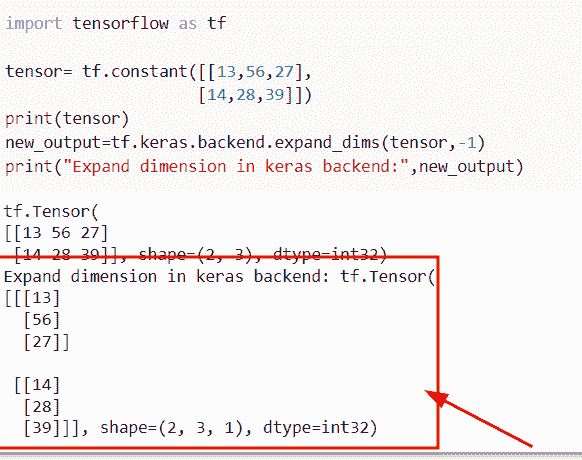

# Python 张量流 expand_dims

> 原文：<https://pythonguides.com/tensorflow-expand_dims/>

[](https://sharepointsky.teachable.com/p/python-and-machine-learning-training-course)

在本 [Python 教程](https://pythonguides.com/learn-python/)中，我们将学习**如何通过使用 TensorFlow 函数来扩展张量**中的维度。此外，我们将讨论以下主题。

*   TensorFlow expand_dims 多次
*   张量流 expand_dims reverse
*   张量流 expand_dims 图层
*   张量流 expand_dims pytorch
*   张量流稀疏扩展 _dims
*   TensorFlow keras expand_dims

目录

[](#)

*   [Python tensor flow expand _ dims](#Python_TensorFlow_expand_dims "Python TensorFlow expand_dims")
*   [TensorFlow expand_dims 多次](#TensorFlow_expand_dims_multiple_times "TensorFlow expand_dims multiple times")
*   [tensor flow expand _ dims reverse](#TensorFlow_expand_dims_reverse "TensorFlow expand_dims reverse")
*   [TensorFlow expand_dims 图层](#TensorFlow_expand_dims_layer "TensorFlow expand_dims layer")
*   [tensor flow expand _ dims py torch](#TensorFlow_expand_dims_pytorch "TensorFlow expand_dims pytorch")
*   [tensor flow sparse expand _ dims](#TensorFlow_sparse_expand_dims "TensorFlow sparse expand_dims")
*   [TensorFlow keras expand_dims](#TensorFlow_keras_expand_dims "TensorFlow keras expand_dims")

## Python tensor flow expand _ dims

*   在本节中，我们将讨论如何在 [TensorFlow Python](https://pythonguides.com/tensorflow/) 中扩展维度。
*   为了执行这个特定的任务，我们将使用 `tf.expand_dims()` 函数，这个方法用于在张量中添加一个新维度，它总是返回一个具有新维度的张量。

**语法:**

下面是 `tf.expand_dims()` 函数的语法

```py
tf.expand_dims
              (
               input,
               axis,
               name=None
              )
```

**举例:**

让我们举个例子，了解一下 `tf.expand_dims()` 函数的工作原理。

**源代码:**

```py
import tensorflow as tf

tensor=tf.constant([[2,3,4],
                   [12,34,56]])
print(tensor)

result=tf.expand_dims(tensor,0)
print("Extend dimension:",result)
```

下面是下面给出的代码的截图。


Python TensorFlow expand_dims

另一种方法是通过使用 `tf.new axis()` 函数来扩展 TensorFlow Python 中的维度。

在本例中，我们将使用 `tf.newaxis()` 函数来扩展维度。在 Python TensorFlow 中，此函数用于向给定形状添加新维度。

**举例:**

```py
import tensorflow as tf

tensor=tf.constant([[2,3,4],
                   [12,34,56]])
print(tensor)
result2 = tensor[:, tf.newaxis]
print("Extend dimension:",result2)
```

在上面的代码中，我们首先使用 `tf.constant()` 函数创建了一个输入张量，然后使用 `tf.newaxis()` 函数和切片方法。

下面是以下给定代码的执行。


TensorFlow expand_dims in Python

阅读: [TensorFlow Tensor to numpy](https://pythonguides.com/tensorflow-tensor-to-numpy/)

## TensorFlow expand_dims 多次

*   在本节中，我们将讨论如何在 Python TensorFlow 中多次扩展维度。
*   为了执行这个特定的任务，我们将使用 `tf.newaxis()` 函数，这个函数将帮助用户使用切片方法在张量中多次扩展维度。
*   在这个例子中，我们将使用 `tf.constant()` 函数创建一个**三维**张量，然后我们将使用 `tf.newaxis()` 函数中的切片方法。

**举例:**

```py
import tensorflow as tf

inpu_tens=tf.constant([[[56,89,167],
                   [55,59,126],
                    [345,894,178]]])
print(inpu_tens)
new_result=inpu_tens[:,:,:,tf.newaxis]
print("Extend dimension multiple times:",new_result)
```

执行这段代码后，输出会多次显示新添加的维度。

下面是以下给定代码的执行。


Python TensorFlow expand_dims multiple times

阅读:[张量流得到形状](https://pythonguides.com/tensorflow-get-shape/)

## tensor flow expand _ dims reverse

*   这里我们要讨论的是如何利用 Tensorflow Python 中的 `tf.expand_dims()` 函数来扩展维度，逆序得到结果。
*   为了执行这个特定的任务，我们将使用 `tf.reverse()` 函数，这个函数用于基于给定的特定轴来反转张量元素。

**语法:**

下面是 Python TensorFlow 中 `tf.reverse()` 函数的语法。

```py
tf.reverse
          (
           tensor,
           axis,
           name=None
          )
```

*   它由几个参数组成
    *   **张量:**该参数表示输入的张量。
    *   **轴:**该参数指定要反转的尺寸的索引。
    *   **name:** 可选参数，指定操作的名称。

**举例:**

我们举个例子，了解一下 Python TensorFlow 中 `tf.expand_dims()` 和 `tf.reverse()` 函数的工作原理。

**源代码:**

```py
import tensorflow as tf

new_tensor=tf.constant([[56,89,167],
                       [78,92,67]])
print(new_tensor)#Display the tensor

result=tf.expand_dims(new_tensor,0)
print(result) # expand the dimension
dims=[-1]
new_output=tf.reverse(result, dims)
print(new_output)
```

在上面的代码中，我们通过使用 `tf.constant()` 函数创建了一个张量，然后我们应用了 `tf.expand_dims()` 函数来扩展给定形状中的维度。

在扩展维度之后，我们使用了 `tf.reverse()` 函数，在这个函数中，我们将结果和 dims 作为一个参数进行赋值。在本例中，**‘结果’**和**‘dims’**变量表示展开的尺寸，倒数默认为 `-1` 。

下面是下面给出的代码的截图。


Python TensorFlow expand_dims reverse

正如您在截图中看到的，输出显示了给定张量的反向元素。

阅读:[导入错误没有名为 TensorFlow](https://pythonguides.com/import-error-no-module-named-tensorflow/) 的模块

## TensorFlow expand_dims 图层

*   在本期节目中，我们将讨论如何在 TensorFlow keras 层中扩展维度。
*   为了完成这个任务，我们将使用`TF . keras . layers . shape()`函数，这个函数从给定的形状返回整形输入。

**语法:**

让我们看一下语法并理解 Python 中的`TF . keras . layers . shape()`函数的工作原理

```py
tf.keras.layers.Reshape
                       (
                        target_shape,
                        **kwargs
                       )
```

*   它由几个参数组成
    *   **目标形状:**该参数将被视为输入形状，且它必须是整数元组。
    *   ****kwargs:** 这是一个附加层关键字参数。

**举例:**

让我们举个例子，检查如何在 TensorFlow Keras 层中扩展维度。

**源代码:**

```py
import tensorflow as tf

new_tens = tf.keras.Sequential()
new_tens.add(tf.keras.layers.Reshape((4, 4), input_shape=(16,)))
print(new_tens.output_shape)
```

在上面的代码中，我们已经导入了 TensorFlow 库，然后使用了 **tf。keras . layers . shape()**函数，在该函数中，我们将输入形状指定为参数。一旦执行了这段代码，输出就会显示形状。

下面是以下给定代码的实现。


TensorFlow expand_dims layer

阅读:[Python tensor flow reduce _ sum](https://pythonguides.com/python-tensorflow-reduce_sum/)

## tensor flow expand _ dims py torch

*   在本期节目中，我们将讨论如何在 Python Pytorch 中扩展维度。
*   为了执行这个特定的任务，我们将使用 `tensor.expand()` 函数，这个方法用于执行扩展维度，它总是在输出形状中返回一个单独的维度。

**语法:**

下面是 **torch 的语法。张量. expand()** 函数

```py
Tensor.expand(*sizes)
```

*   它只包含一个参数
    *   **尺寸:**该参数表示展开后的尺寸。

**举例:**

让我们来看看这个例子，看看如何在 Python Pytorch 中扩展维度。

**源代码:**

```py
import tensorflow as tf
import torch

new_tensor = torch.tensor([[6],[16],[144]])
result=new_tensor.expand(3, 6)
print(result) 
```

在上面的代码中，我们导入了 torch 库，然后使用 `torch.tensor()` 函数创建了一个张量。创建张量后，我们使用了**张量. expand()** 函数，在这个函数中，我们传递了我们想要用给定的张量展开的新形状。

下面是以下给定代码的实现


Python TensorFlow expand_dims pytorch

正如您在截图中看到的，输出显示了张量的扩展维度。

阅读:[Python tensor flow reduce _ mean](https://pythonguides.com/python-tensorflow-reduce_mean/)

## tensor flow sparse expand _ dims

*   在本节中，我们将讨论如何在 TensorFlow Python 中使用 `sparse expand_dims()` 函数。
*   通过使用 `tf.sparse.expand_dims()` ，我们可以很容易地在张量形状中添加一个长度为 `1` 的维度。

**语法:**

下面是 Python TensorFlow 中 `tf.sparse.expand_dims()` 函数的语法。

```py
tf.sparse.expand_dims
                     (
                      sp_input,
                      axis=None,
                      name=None
                     )
```

*   它由几个参数组成
    *   **sp_input:** 该参数指定给定的稀疏张量。
    *   **轴:**默认取 `-1` 值，表示我们要对形状输入进行操作的尺寸索引。
    *   **名称:**该参数表示输出稀疏张量的名称。

**举例:**

我们举个例子，了解一下 `tf.sparse.expand_dims()` 函数的工作原理。

**源代码:**

```py
import tensorflow as tf

new_tensor = tf.sparse.SparseTensor(indices=[[2,1,3]], values=[14,],
                            dense_shape=[4,4,6])
result=tf.sparse.expand_dims(new_tensor, axis=0)
print(result)
```

在下面给定的代码中，我们导入了 TensorFlow 库，然后通过使用`TF . sparse . sparsesensor()`函数创建了一个稀疏张量，在这个函数中，我们传递了**索引**、**值**和 `dense_shape` 作为参数。创建稀疏张量后，我们使用 `tf.sparse.expand_dims()` 来扩展维度。

下面是以下给定代码的实现。


Python TensorFlow sparse expand_dims

正如你在截图中看到的，输出显示了给定张量的新大小。

阅读:[模块“张量流”没有属性“会话”](https://pythonguides.com/module-tensorflow-has-no-attribute-session/)

## TensorFlow keras expand_dims

*   这里我们将讨论如何在张量流 keras 中扩展维度。
*   为了执行这一特定任务，我们将使用`TF . keras . back end . expand _ dims()`函数，该方法用于在索引轴添加一维长度的维度。

**语法:**

让我们看一下语法，了解一下`TF . keras . back end . expand _ dims()`函数的工作原理。

```py
tf.keras.backend.expand_dims(
    x,
    axis=-1
)
```

*   它由几个参数组成
    *   **x:** 该参数表示 inout 张量或输入变量。
    *   **轴:**默认取-1 值，这指定了我们要添加新轴的位置。

**举例:**

让我们举个例子，看看如何在 Python TensorFlow Keras 中扩展维度。

**源代码:**

```py
import tensorflow as tf

tensor= tf.constant([[13,56,27],
                    [14,28,39]])
print(tensor)
new_output=tf.keras.backend.expand_dims(tensor,-1)
print("Expand dimension in keras backend:",new_output)
```

在上面的代码中，我们导入了 TensorFlow 库，然后通过使用 `tf.constant()` 函数创建了一个输入张量，在这个函数中，我们指定了一个二维张量。

创建张量后，我们使用了`TF . keras . back end . expand _ dims()`函数，并将张量和**轴=-1** 参数指定为参数。一旦执行了这段代码，输出就会通过增加 `1` 的长度来显示张量的新大小。

下面是下面给出的代码的截图。



Python TensorFlow Keras expand_dims

你可能也喜欢阅读下面的 TensorFlow 教程。

*   [Tensorflow 迭代张量](https://pythonguides.com/tensorflow-iterate-over-tensor/)
*   [张量流图-详细指南](https://pythonguides.com/tensorflow-graph/)
*   [Tensorflow 获取静态值](https://pythonguides.com/tensorflow-get-static-value/)
*   [TensorFlow Sparse Tensor](https://pythonguides.com/tensorflow-sparse-tensor/)
*   [张量低乘法](https://pythonguides.com/tensorflow-multiplication/)

因此，在这个 Python 教程中，我们已经学习了如何使用 TensorFlow 函数来扩展张量中的维度。此外，我们将讨论以下主题。

*   TensorFlow expand_dims 多次
*   张量流 expand_dims reverse
*   张量流 expand_dims 图层
*   张量流 expand_dims pytorch
*   张量流稀疏扩展 _dims
*   TensorFlow keras expand_dims

[Bijay Kumar](https://pythonguides.com/author/fewlines4biju/)

Python 是美国最流行的语言之一。我从事 Python 工作已经有很长时间了，我在与 Tkinter、Pandas、NumPy、Turtle、Django、Matplotlib、Tensorflow、Scipy、Scikit-Learn 等各种库合作方面拥有专业知识。我有与美国、加拿大、英国、澳大利亚、新西兰等国家的各种客户合作的经验。查看我的个人资料。

[enjoysharepoint.com/](https://enjoysharepoint.com/)[](https://www.facebook.com/fewlines4biju "Facebook")[](https://www.linkedin.com/in/fewlines4biju/ "Linkedin")[](https://twitter.com/fewlines4biju "Twitter")