# 张量流全连通层

> 原文：<https://pythonguides.com/tensorflow-fully-connected-layer/>

[](https://sharepointsky.teachable.com/p/python-and-machine-learning-training-course)

在本 [Python 教程](https://pythonguides.com/learn-python/)中，我们将重点介绍如何用 Python 构建 TensorFlow 全连通层。此外，我们将查看一些如何在 TensorFlow 中获得上一层输出的示例。我们将讨论这些话题。

*   张量流全连通层
*   张量流全连接层与卷积层
*   张量流 CNN 全连接层
*   稀疏全连通层张量流
*   层的张量流列表
*   张量流密集层示例
*   TensorFlow 按名称获取图层
*   TensorFlow remove layers
*   张量流获取层权重

目录

[](#)

*   [TensorFlow 全连通层](#TensorFlow_Fully_Connected_Layer "TensorFlow Fully Connected Layer")
*   [TensorFlow 全连接层 vs 卷积层](#TensorFlow_fully_connected_layer_vs_convolutional_layer "TensorFlow fully connected layer vs convolutional layer ")
*   [TensorFlow CNN 全连接层](#TensorFlow_CNN_fully_connected_layer "TensorFlow CNN fully connected layer")
*   [稀疏全连通层张量流](#sparse_fully_connected_layer_TensorFlow "sparse fully connected layer TensorFlow")
*   [层的张量流列表](#TensorFlow_list_of_layers "TensorFlow list of layers")
    *   [密集层示例](#Dense_Layer_Example "Dense Layer Example")
    *   [展平图层](#Flatten_Layer "Flatten Layer")
    *   [脱落层](#Dropout_layer "Dropout layer ")
    *   [重塑图层](#Reshape_layer "Reshape layer")
*   [TensorFlow 密集层示例](#TensorFlow_dense_layer_example "TensorFlow dense layer example")
*   [TensorFlow 按名称获取图层](#TensorFlow_get_layer_by_name "TensorFlow get layer by name")
*   [张量流移除图层](#TensorFlow_remove_layers "TensorFlow remove layers")
*   [TensorFlow 获取层权重](#TensorFlow_get_layers_weights "TensorFlow get layers weights")

## TensorFlow 全连通层

*   一组相互依赖的非线性函数构成了神经网络。神经元是每个特定功能(或感知)的基本单位。
*   全连接层中的神经元使用权重矩阵线性变换输入向量。然后使用非线性激活函数 f 对产品进行非线性变换
*   图层的输入和权重矩阵之间的点积由激活函数 f 包装。在训练模型时，权重矩阵的列将全部具有不同的值并被优化。

示例:

让我们举个例子，看看如何创建一个完全连接的层。

```py
import tensorflow as tf 

from tensorflow.keras import datasets, layers, models 

import matplotlib.pyplot as plt 

(new_train_images, new_train_labels), (new_test_images, new_test_labels) = datasets.cifar10.load_data() 

new_train_images, new_test_images = new_train_images / 255.0, new_test_images / 255.0 

class_names = ['airplane', 'automobile', 'bird', 'cat', 'deer', 

               'dog', 'frog', 'horse', 'ship', 'truck'] 

plt.figure(figsize=(10,10)) 

for i in range(25): 

    plt.subplot(5,5,i+1) 

    plt.xticks([]) 

    plt.yticks([]) 

    plt.grid(False) 

    plt.imshow(new_train_images[i]) 

    plt.xlabel(class_names[new_train_labels[i][0]]) 

plt.show() 

model = models.Sequential() 

model.add(layers.Conv2D(32, (3, 3), activation='relu', input_shape=(32, 32, 3))) 

model.add(layers.MaxPooling2D((2, 2))) 

model.add(layers.Conv2D(64, (3, 3), activation='relu')) 

model.add(layers.MaxPooling2D((2, 2))) 

model.add(layers.Conv2D(64, (3, 3), activation='relu')) 

model.add(layers.Flatten()) 

model.add(layers.Dense(64, activation='relu')) 

model.add(layers.Dense(10)) 

model.compile(optimizer='adam', 

              loss=tf.keras.losses.SparseCategoricalCrossentropy(from_logits=True), 

              metrics=['accuracy']) 

history = model.fit(new_train_images, new_train_labels, epochs=10,  

                    validation_data=(new_test_images, new_test_labels)) 

plt.plot(history.history['accuracy'], label='accuracy') 

plt.plot(history.history['val_accuracy'], label = 'val_accuracy') 

plt.xlabel('Epoch') 

plt.ylabel('Accuracy') 

plt.ylim([0.5, 1]) 

plt.legend(loc='lower right') 

test_loss, test_acc = model.evaluate(new_test_images,  new_test_labels, verbose=2) 
```

在下面的代码中，我们导入了 Tensorflow 和 matplotlib 库，然后使用命令`datasets . cifar 10 . load _ data()`加载数据集。接下来，我们将数据集分为训练和测试部分。

之后，我们创建了一个序列模型，使用 conv 2d 并提到输入图像形状 **(32，32，3)，**，然后使用 `model.compile()` 并分配优化器**‘亚当’**。

下面是下面给出的代码的截图。

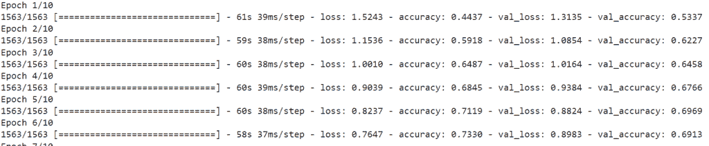

TensorFlow Fully Connected Layer

这就是我们如何使用 TensorFlow 找到全连接层的损耗和精度值。

阅读:[张量流自定义损失函数](https://pythonguides.com/tensorflow-custom-loss-function/)

## TensorFlow 全连接层 vs 卷积层

*   在本节中，我们将讨论什么是密集层，我们还将了解连接层和密集层之间的区别。
*   在模型中，前一层中的每个神经元向密集层中的神经元发送信号，密集层中的神经元将矩阵和向量相乘。在矩阵向量乘法期间，来自先前层的输出的行向量等于密集层的列向量。
*   行向量的列数必须与列向量的列数相等，才能将矩阵与向量相乘。
*   完全链接的层中的神经元连接到它之前的层中的每个神经元，并且如果这些神经元中的任何一个发生变化，它也可以发生变化。然而，在卷积核的范围内，卷积层中的神经元仅连接到来自前一层的“附近”神经元。

示例:

```py
import numpy as np
import tensorflow as tf
from tensorflow.keras import Input, Model
from tensorflow.keras.layers import Dense, Flatten, Conv2D

np.random.seed(44)
tf.random.set_seed(44)

new_arr = np.random.rand(4, 32, 32, 3)

input_shape = Input(shape=new_arr.shape[1:])
convolution_layer = Conv2D(filters=8, kernel_size=(3, 3), activation='relu')(input_shape)
flatten = Flatten()(convolution_layer)
feature_map = Dense(8, activation='relu')(flatten)
new_output = Dense(2, activation='softmax')(flatten)
result = Model(inputs=input_shape, outputs=new_output)

result(new_arr)
```

在上面的代码中，我们已经导入了 numpy 和 TensorFlow 库。接下来，我们使用了 `tf.random.set_seed()` 函数。全局和操作级种子是操作使用的随机种子的来源。

当全局种子是预先确定的而操作种子不是预先确定的时，除了全局种子之外，系统确定性地选择一个操作种子来产生不同的随机序列。接下来，我使用了 `conv2d()` 图层，并用 `kernel_size()` 分配滤镜。

之后，我们添加具有输入形状 `8` 和激活函数**‘relu’**的密集层。

下面是下面给出的代码的截图。

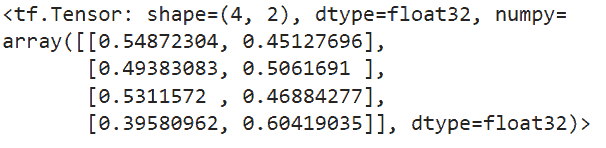

TensorFlow fully connected layer vs convolutional layer

在本例中，我们已经了解了全连接层和卷积层之间的区别。

阅读:[tensor flow next _ batch+Examples](https://pythonguides.com/tensorflow-next_batch/)

## TensorFlow CNN 全连接层

*   卷积神经网络(CNN)，通常称为 CNN，是深度神经网络的一个子集，用于评估计算机视觉应用中的视觉数据。它被用于神经语言处理、视频或图片识别等程序中。
*   Cnn 和其他神经网络的主要区别在于，Cnn 的输入是二维数组，而其他神经网络的输入是 n 维数组。
*   卷积层是模型中最重要的部分。该图层的主要目标是提高概化效果，并缩小权重较快部分的图像尺寸。

**举例**:

```py
import tensorflow as tf

from tensorflow.keras import datasets, layers, models
import matplotlib.pyplot as plt

(train_images, train_labels), (test_images, test_labels) = datasets.cifar10.load_data()

train_images, test_images = train_images / 255.0, test_images / 255.0

class_names = ['airplane', 'automobile', 'bird', 'cat', 'deer',
               'dog', 'frog', 'horse', 'ship', 'truck']

plt.figure(figsize=(10,10))
for i in range(25):
    plt.subplot(5,5,i+1)
    plt.xticks([])
    plt.yticks([])
    plt.grid(False)
    plt.imshow(train_images[i])
    plt.xlabel(class_names[train_labels[i][0]])
plt.show()
model = models.Sequential()
model.add(layers.Conv2D(32, (3, 3), activation='relu', input_shape=(32, 32, 3)))
model.add(layers.MaxPooling2D((2, 2)))
model.add(layers.Conv2D(64, (3, 3), activation='relu'))
model.add(layers.MaxPooling2D((2, 2)))
model.add(layers.Conv2D(64, (3, 3), activation='relu'))
model.summary()
```

你可以参考下面的截图。

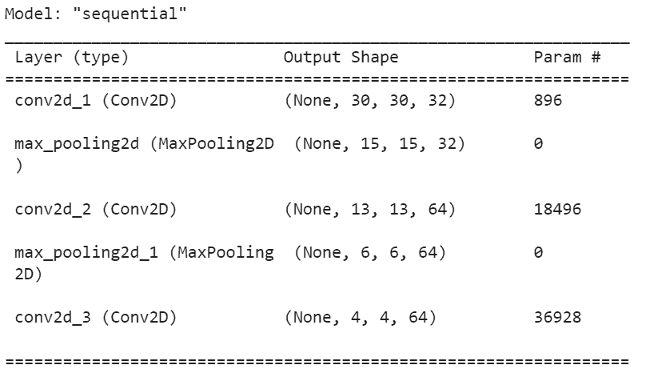

TensorFlow CNN fully connected layer

这就是我们如何在全连接层中使用卷积神经网络。

阅读: [TensorFlow 全球平均池](https://pythonguides.com/tensorflow-global-average-pooling/)

## 稀疏全连通层张量流

*   本质上，我们随机初始化我们网络中的稀疏连接层，并开始用反向传播和其他常见的深度学习优化方法进行训练。
*   在每个时期之后，**“最弱”**连接被消除，并且它们的位置被具有随机初始化的新创建的连接所取代。
*   为了执行此任务，我们将使用 `tf.sparse tensor()` 函数索引、值和密集形状是 TensorFlow 用来表示稀疏张量的三个不同的密集张量。
*   为了使用简单，这三个张量在 Python 中被组合成一个 SparseTensor 类。在将它们提供给下面的操作之前，将任何不同的密集形状、密集值和索引张量包装在 SparseTensor 对象中。

**语法**:

让我们看一下语法，了解一下`TF . sparse . sparsesensor()`函数的工作原理。

```py
tf.sparse.SparseTensor(
                       indices, 
                       values, 
                       dense_shape
                     )
```

*   它由几个参数组成
    *   `indexes`:是形状的 2 维 int 64 张量。
    *   `values` :任意类型和形状的一维张量。
    *   `dense_shape` :指定稠密张量的形状。

**举例**:

```py
import tensorflow as tf
import numpy as np

x = tf.placeholder(tf.float32,shape = [4,2],name = "x")

y = tf.placeholder(tf.float32,shape = [4,1],name = "y")
m = np.shape(x)[0]
n = np.shape(x)[1]
hidden_s = 2 
l_r = 1

theta1 = tf.SparseTensor(indices=[[0, 0],[0, 1], [1, 1]], values=[0.1, 0.2, 0.1], dense_shape=[3, 2])

theta2 = tf.cast(tf.Variable(tf.random_normal([hidden_s+1,1]),name = "theta2"),tf.float32)

a1 = tf.concat([np.c_[np.ones(x.shape[0])],x],1)

z1 = tf.matmul(a1,tf.sparse_tensor_to_dense(theta1)) 

a2 = tf.concat([np.c_[np.ones(x.shape[0])],tf.sigmoid(z1)],1)

z3 = tf.matmul(a2,theta2)

h3 = tf.sigmoid(z3)
cost_func = -tf.reduce_sum(y*tf.log(h3)+(1-y)*tf.log(1-h3),axis = 1)

optimiser = tf.train.GradientDescentOptimizer(learning_rate = l_r).minimize(cost_func)

X = [[0,0],[0,1],[1,0],[1,1]]
Y = [[0],[1],[1],[0]]

init = tf.global_variables_initializer()
sess = tf.Session()
sess.run(init)

for i in range(200):
   sess.run(optimiser, feed_dict = {x:X,y:Y})
   if i%100==0:
      print("Epoch:",i)
      print(sess.run(theta1))
```

在下面的代码中，我们使用了 `tf.placeholder()` 函数来创建张量，在这个函数中，我们使用了 `tf.float()` 数据类型和形状。接下来，我们使用稀疏张量，其中我们已经传递了**索引、值和密集形状。**

你可以参考下面的截图

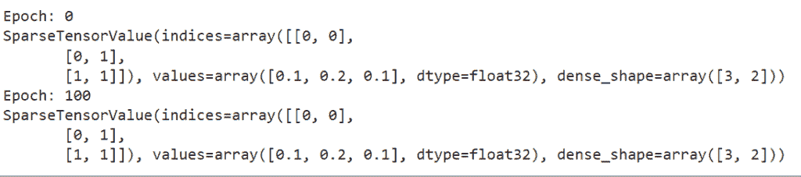

sparse fully connected layer TensorFlow

这就是我们如何通过 TensorFlow 在全连接层中使用稀疏张量。

阅读:[二元交叉熵张量流](https://pythonguides.com/binary-cross-entropy-tensorflow/)

## 层的张量流列表

*   这里我们将使用 TensorFlow 来讨论图层列表。
*   通过其 Keras Layers API，Keras 为各种神经网络拓扑和用途提供了各种各样的预构建层。这些随时可用的层通常适用于构建大多数深度学习模型，具有很大的灵活性，使它们非常有帮助。
*   现在我们来讨论一些流行的 Keras 层。
    *   **密集层:**密集层是一个流行的 Keras 层，用于在神经网络中构建一个密集链接的层，其中每一层的神经元都从所有前面层的神经元获得输入。
    *   **展平图层**:使用展平将输入展平。例如，如果将展平应用于输入形状为**(批量大小，2，2)** 的层，则层的输出形状将为**(批量大小，4)** 。
    *   **辍学层**:机器学习的一个关键思想就是辍学。它被应用于解决过拟合问题。数据输入可能包含一些不需要的信息，通常称为噪声。Dropout 将尝试排除噪声数据，以避免过度拟合模型。
    *   **重塑图层**:可使用重塑命令改变输入形状。例如，如果层的输入形状是**(批量大小，3，2)** ，并且使用了带参数 **(2，3)** 的整形，则层的输出形状将是**(批量大小，2，3)** 。
    *   **Lambda 层**:通过使用表达式或函数，使用 Lambda 层转换输入数据。
    *   **池层**:池层的主要目的是逐渐降低输入图像的空间大小，这将减少网络所需的计算次数。

### 密集层示例

它对卷积层提取的特征进行分类。

**源代码**:

```py
from keras.models import Sequential 
from keras.layers import Activation, Dense 

new_model_var = Sequential() 
new_layer = Dense(20, input_shape = (5,)) 
new_model_var.add(new_layer) 
new_layer.input_shape  
new_layer.output_shape 
```

在下面给定的代码中，我们创建了模型 `sequential()` ，并使用输入形状的密集层。接下来，我们给模型添加了一个图层，得到了一个密集图层的形状。

下面是下面给出的代码的截图。

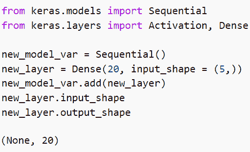

Dense layer in TensorFlow

### 展平图层

我们展平卷积层的输出，以声明单个长特征向量。

源代码:

```py
from keras.layers import Flatten
from keras.models import Sequential 
from keras.layers import Activation, Dense 

model = Sequential()
layer_1 = Dense(8, input_shape=(8,8)) 
model.add(layer_1) 
layer_2 = Flatten() 
model.add(layer_2) 
layer_2.input_shape
layer_2.output_shape
```

在上面的代码中，我们导入了扁平化的顺序模型。接下来，我们创建了顺序模型，并添加了第一个密集层。之后，我添加了 `flatten layer()` 并给它分配 layer2。

你可以参考下面的截图

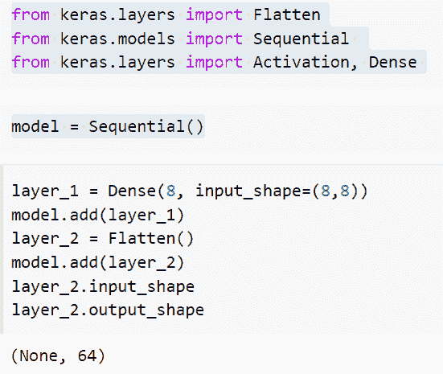

flatten layer

### 脱落层

Dropout 是一种随机忽略部分神经元的训练方法。

源代码:

```py
import keras

result= keras.layers.Dropout(0.5, noise_shape = None, seed = None)
print(result)
```

在上面的代码中，我们已经导入了 Keras 库，然后使用了 `keras.layers.Dropout()` 函数，并为其分配了 noise_shape 和 seed 参数。

下面是以下代码的截图

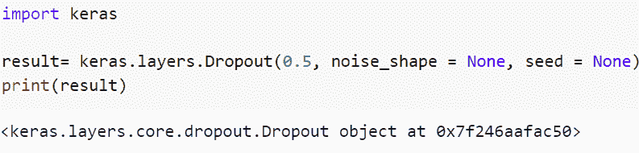

Dropout layer

### 重塑图层

如果一个整形层有一个参数 **(4，5)** ，并且它被应用到一个输入形状为 **(batch_size，5，4)** 的层，那么该层的结果形状将变为 **(batch_size，4，5)** 。

```py
from keras.models import Sequential 
from keras.layers import Activation, Dense, Reshape 

model = Sequential() 

layer_1 = Dense(36, input_shape = (6,6)) 
model.add(layer_1) 

layer_2 = Reshape((36, 6)) 
model.add(layer_2)
layer_2.input_shape 
```

你可以参考下面的截图

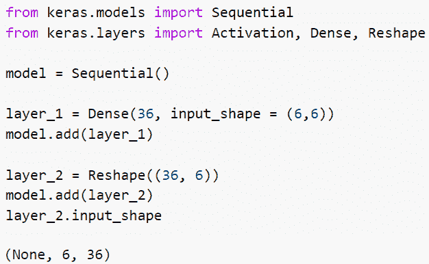

reshape layer

阅读:[二元交叉熵张量流](https://pythonguides.com/binary-cross-entropy-tensorflow/)

## TensorFlow 密集层示例

*   在模型中，前一层中的每个神经元向密集层中的神经元发送信号，密集层中的神经元将矩阵和向量相乘。
*   在矩阵向量乘法期间，来自先前层的输出的行向量等于密集层的列向量。
*   行向量的列数必须与列向量的列数相等，才能将矩阵与向量相乘。
*   密集层将背景中的矩阵和向量相乘。反向传播可用于训练和更新构成矩阵中使用的值的参数。
*   “m”维向量是致密层的结果。因此，密集层的主要目的是改变矢量的维度。密集层还对矢量执行操作，如旋转、缩放和平移。

语法:

下面是 TensorFlow 中稠密层的语法。

```py
tf.keras.layers.Dense(
    units,
    activation=None,
    use_bias=True,
    kernel_initializer="glorot_uniform",
    bias_initializer="zeros",
    kernel_regularizer=None,
    bias_regularizer=None,
    activity_regularizer=None,
    kernel_constraint=None,
    bias_constraint=None,
    **kwargs
)
```

*   它由几个参数组成
    *   **单位**:Keras 致密层最基本也是最重要的因素之一，决定了致密层输出的大小，就是单位。鉴于它表示输出向量的维数，它必须是一个正整数。
    *   **激活**:神经网络中的激活函数是转换神经元输入值的函数。本质上，它增加了神经网络的非线性，这样网络就可以计算出输入和输出值之间的关系。
    *   `use_bias` :当选择是否在密集层中使用偏置矢量时，我们使用参数。在布尔参数中，如果未定义 use bias，它将被设置为 true。
    *   `kernel_initializer` :使用该选项初始化内核权重矩阵。为了提取相关的特征核，将输入乘以权重矩阵，权重矩阵是权重矩阵。

致密层的例子

```py
from keras.models import Sequential 
from keras.layers import Activation, Dense 

new_model_var = Sequential() 
new_layer = Dense(20, input_shape = (5,)) 
new_model_var.add(new_layer) 
new_layer.input_shape  
new_layer.output_shape 
```

在下面给出的代码中，我们创建了**模型 sequential()** 并使用了输入形状的密集层。接下来，我们给模型添加了一个图层，得到了一个密集图层的形状。

你可以参考下面的截图。

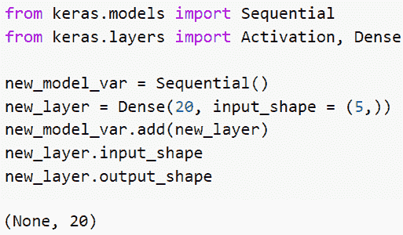

dense layer in Tensorflow

正如您在截图中看到的，我们在顺序模型中使用了密集层。

阅读:[张量流 clip_by_value](https://pythonguides.com/tensorflow-clip_by_value/)

## TensorFlow 按名称获取图层

*   在这个例子中，我们将讨论如何在 TensorFlow 中按名称获取图层。
*   为了完成这个任务，我们将使用 `sequential()` 函数，然后使用输入形状和 kernel _ regularizer 添加密集层。

**举例**:

```py
from keras.models import Sequential 
from keras.layers import Activation, Dense 
from keras import initializers 
from keras import regularizers 
from keras import constraints 

model = Sequential() 

model.add(Dense(32, input_shape=(16,), 
   kernel_regularizer = None, kernel_constraint = 'MaxNorm', activation = 'relu')) 
model.add(Dense(16, activation = 'relu')) 
model.add(Dense(8))
print(model)
```

在上面的代码中，我们从 keras 模块中导入了初始化器、正则化器和约束。接下来，我们使用序列模型()并添加了输入形状的密集层和没有值的 kernel _ regularizer。

下面是以下给定代码的输出。

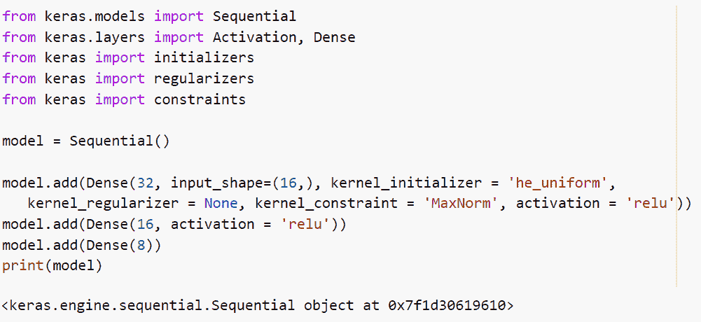

TensorFlow get layer by name

这就是我们如何使用 TensorFlow 按名称获取图层。

阅读:[模块“张量流”没有属性“日志”](https://pythonguides.com/module-tensorflow-has-no-attribute-log/)

## 张量流移除图层

*   在本节中，我们将讨论如何在 TensorFlow 中移除图层。
*   为了执行这个特定的任务，我们将使用 `model.layers.pop()` 函数来移除模型的最后一层。
*   使用 **hidden = Dense(120，activation='relu')** 删除先前的密集层，并添加您的新层。模型。**层层[-1]。输出(型号。层[-2]]** 。

**举例**:

```py
import tensorflow as tf
import tensorflow.keras as keras
import tensorflow.keras.backend as K
from tensorflow.keras.layers import Dense, Input, Layer
from tensorflow.keras.models import Model

new_input_tens = Input(shape=(10,))
new_hidden_layer = Dense(100, activation='relu')(new_input_tens)
new_output = Dense(10, activation='relu')(new_hidden_layer)
model = Model(new_input_tens, new_output)
model.compile(loss="mse", optimizer=tf.compat.v1.train.AdamOptimizer(learning_rate=0.001))
model.summary()
model.layers.pop()
model.layers.pop()
model.summary()
new_hidden = Dense(120, activation='relu')(model.layers[-1].output)
new_output = Dense(5, activation='softmax')(new_hidden)
model = Model(new_input_tens, new_output )
model.summary()
```

你可以参考下面的截图

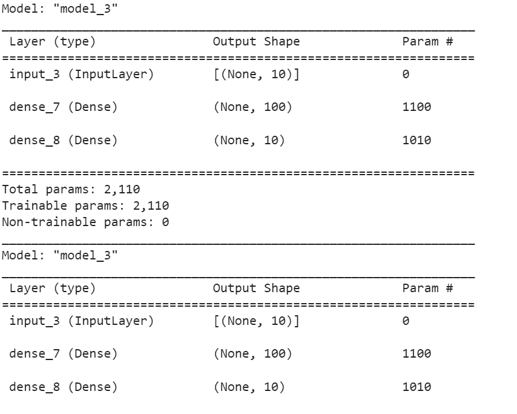

TensorFlow remove layers

这就是我们如何移除 TensorFlow 中的图层。

阅读:[张量流均方误差](https://pythonguides.com/tensorflow-mean-squared-error/)

## TensorFlow 获取层权重

*   我们使用 TensorFlow 函数“随机正态初始化器”来初始化权重，这将使用正态分布随机初始化权重。权重的状态包含为张量变量。**‘init’**将用于初始化这些状态。
*   重量值将以**‘float 32’**格式显示。由于设置为**“可训练”**，每次运行后，起始重量将根据损失函数和优化程序进行修改。
*   它被贴上标签**“内核”**，以便以后可以很容易地找到它。

**举例:**

```py
import tensorflow as tf

model = tf.keras.Sequential([
        tf.keras.layers.Dense(5, activation="relu", name="first_layer"),
        tf.keras.layers.Dense(6, activation="tanh", name="second_layer"),
        tf.keras.layers.Dense(5, name="last_layer"),
])
new_input_val = tf.random.normal((1,4))
new_output_val = model(new_input_val)
for new_layer in model.layers:
    print(new_layer.name, new_layer)
print(model.layers[0].weights)
print(model.layers[0].bias.numpy())
print(model.layers[0].bias_initializer)
```

在这个例子中，我们使用了 tf.keras.Sequential()模型，在这个模型中，我添加了三个密集层，并为输入形状分配了激活函数。接下来，我们使用了 `tf.random.normal()` 函数，并提到了形状 **(1，4)** 。现在我们要提取第一层，为此我使用了命令 **(model.layers[0])。**砝码)。

下面是以下代码的截图

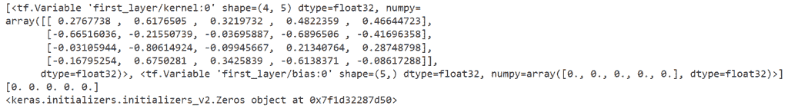

TensorFlow get layers weights

正如你在截图中看到的，我们已经学会了如何在层中使用权重。

还有，多看看一些 Python 中的 TensorFlow 教程。

*   [将列表转换为张量张量流](https://pythonguides.com/convert-list-to-tensor-tensorflow/)
*   [Tensorflow 将稀疏张量转换为张量](https://pythonguides.com/tensorflow-convert-sparse-tensor-to-tensor/)
*   [模块“张量流”没有属性“日志”](https://pythonguides.com/module-tensorflow-has-no-attribute-log/)
*   [Python TensorFlow one_hot](https://pythonguides.com/tensorflow-one_hot/)
*   [Python TensorFlow 随机均匀](https://pythonguides.com/tensorflow-random-uniform/)
*   [Python tensor flow reduce _ sum](https://pythonguides.com/python-tensorflow-reduce_sum/)

所以，在这个 Python 教程中，我们学习了如何在 TensorFlow 中构建一个 ***全连通层。此外，我们将查看一些如何在 TensorFlow 中获得上一层输出的示例。我们已经讨论了这些主题。***

*   张量流全连通层
*   张量流全连接层与卷积层
*   张量流 CNN 全连接层
*   TensorFlow 超薄全连接层
*   稀疏全连通层张量流
*   层的张量流列表
*   张量流密集层示例
*   TensorFlow 按名称获取图层
*   TensorFlow remove layers
*   张量流获取层权重

[Bijay Kumar](https://pythonguides.com/author/fewlines4biju/)

Python 是美国最流行的语言之一。我从事 Python 工作已经有很长时间了，我在与 Tkinter、Pandas、NumPy、Turtle、Django、Matplotlib、Tensorflow、Scipy、Scikit-Learn 等各种库合作方面拥有专业知识。我有与美国、加拿大、英国、澳大利亚、新西兰等国家的各种客户合作的经验。查看我的个人资料。

[enjoysharepoint.com/](https://enjoysharepoint.com/)[](https://www.facebook.com/fewlines4biju "Facebook")[](https://www.linkedin.com/in/fewlines4biju/ "Linkedin")[](https://twitter.com/fewlines4biju "Twitter")