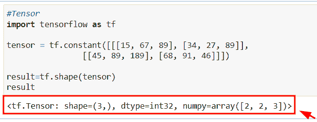
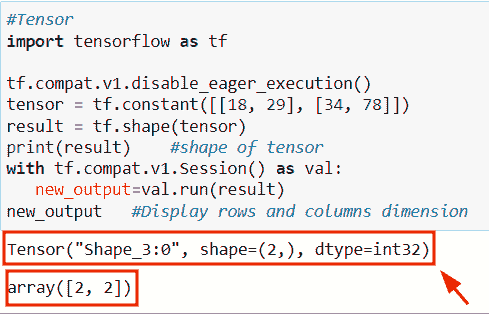
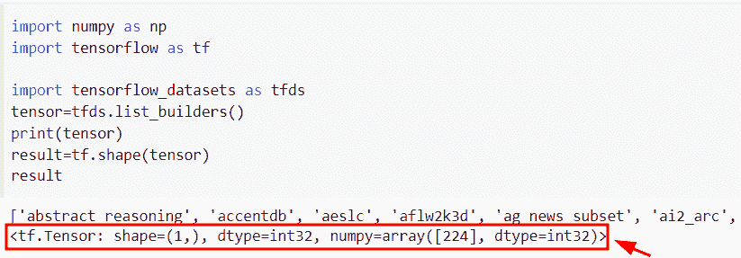
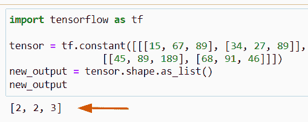
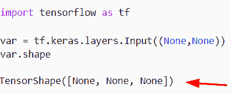
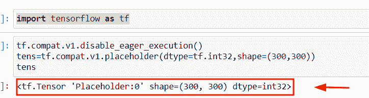
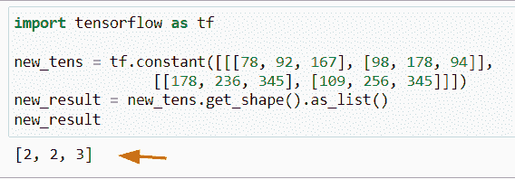

# TensorFlow get shape

> 原文：<https://pythonguides.com/tensorflow-get-shape/>

[](https://sharepointsky.teachable.com/p/python-and-machine-learning-training-course)

在本 [Python 教程](https://pythonguides.com/learn-python/)中，我们将学习**如何在 Python** 中找到张量流的形状。此外，我们将涵盖以下主题。

*   张量流得到张量的形状
*   张量流获取数据集的形状
*   张量流以列表形式获取形状
*   张量流获取形状无
*   张量流获取占位符的形状
*   Tensorflow x.get_shape()。as_list()

目录

[](#)

*   [TensorFlow get shape](#TensorFlow_get_shape "TensorFlow get shape")
*   [TensorFlow 得到张量的形状](#TensorFlow_get_shape_of_tensor "TensorFlow get shape of tensor")
*   [TensorFlow 获取数据集的形状](#TensorFlow_get_shape_of_dataset "TensorFlow get shape of dataset")
*   [TensorFlow 获取形状作为列表](#TensorFlow_get_shape_as_list "TensorFlow get shape as list")
*   [张量流获取形状无](#TensorFlow_get_shape_none "TensorFlow get shape none")
*   [TensorFlow 获取占位符的形状](#TensorFlow_get_shape_of_placeholder "TensorFlow get shape of placeholder")
*   [Tensorflow x.get_shape()。as_list()](#Tensorflow_xget_shapeas_list "Tensorflow x.get_shape().as_list()")

## TensorFlow get shape

*   在本节中，我们将学习如何在 [TensorFlow Python](https://pythonguides.com/tensorflow/) 中获取形状。
*   要得到张量的形状，可以很容易地使用 `tf.shape()` 函数。这种方法将帮助用户返回给定张量的形状。例如，假设您有一个用整数填充的张量，并且您想要检查给定输入张量的形状。
*   为了完成这个任务，我们可以很容易地使用 `tf.shape()` 函数，它返回 shape 属性作为 scaler 输入值。

**语法:**

让我们看一下语法，了解一下 `tf.shape()` 函数的工作原理。

```py
tf.shape
        (
         input,
         out_type=tf.dtypes.int32,
         name=None
        )
```

*   它由几个参数组成
    *   **输入:**该参数表示我们想要操作的输入张量
    *   `out_type` =默认取 `tf.dtypes.int32` 值。这是一个可选参数，定义输出类型。
    *   **名称:**该参数表示操作的名称。

**举例:**

我们举个例子，看看如何在 TensorFlow Python 中获取形状。

**源代码:**

```py
#Tensor
import tensorflow as tf

tensor = tf.constant([[[15, 67, 89], [34, 27, 89]], 
                [[45, 89, 189], [68, 91, 46]]])

result=tf.shape(tensor)
result
```

在上面的代码中，首先，我们导入 TensorFlow 库，然后使用 `tf.constant()` 函数创建张量。之后，我们声明了一个变量“result ”,并指定了 `tf.shape()` 函数来获取给定张量的形状。

下面是下面给出的代码的截图。



TensorFlow get shape

另外，检查:[Python tensor flow reduce _ sum](https://pythonguides.com/python-tensorflow-reduce_sum/)

## TensorFlow 得到张量的形状

*   让我们看看如何在 TensorFlow Python 中得到张量的形状。
*   为了执行这个特殊的任务，我们将使用 `tf.shape()` 函数来获取张量的形状。
*   接下来，我们将使用`TF . compat . v1 . disable _ eager _ execution()`来运行会话，它将显示数组大小。

**举例:**

我们举个例子，检查一下如何在 TensorFlow Python 中得到张量的形状。

**源代码:**

```py
#Tensor
import tensorflow as tf

tf.compat.v1.disable_eager_execution()
tensor = tf.constant([[18, 29], [34, 78]])
result = tf.shape(tensor) 
print(result)    #shape of tensor
with tf.compat.v1.Session() as val:
   new_output=val.run(result)
new_output   #Display rows and columns dimension
```

在下面给出的代码中，我们通过使用 `tf.constant()` 函数创建了一个张量，忘记了张量的形状，我们应用了 `tf.shape()` 函数。

在这个方法中，我们传递张量作为参数。一旦执行了这段代码，输出将显示张量的形状。之后，我们已经应用了函数`TF . compat . v1 . disable _ eager _ execution()`。

下面是以下给定代码的实现。



TensorFlow get the shape of Tensor in Python

阅读:[Python tensor flow reduce _ mean](https://pythonguides.com/python-tensorflow-reduce_mean/)

## TensorFlow 获取数据集的形状

*   在本节中，我们将学习如何在 TensorFlow Python 中获取数据集的形状。
*   为了完成这项任务，我们将使用 `tfds` 数据集的概念，它指定了 TensorFlow 中数据集的集合。
*   在 Python 中， `tfds` 基本上是配合机器学习和 TensorFlow 框架使用的。
*   要在您的机器上安装这个包，使用 `pip install tfds-nightly` 命令。

**举例:**

```py
import numpy as np
import tensorflow as tf

import tensorflow_datasets as tfds
tensor=tfds.list_builders()
print(tensor)
result=tf.shape(tensor)
result
```

在上面的代码中，我们首先使用 tensorflow_datasets 作为 tfds 导入了 tfds 库。之后，我们使用了名为“list_builders”的数据集，它将显示可用构建器的列表。现在，我们想要得到给定数据集的形状，为此我们使用了 `tf.shape()` 函数。

下面是下面给出的代码的截图。



TensorFlow get the shape of a dataset in Python

阅读: [Python TensorFlow one_hot](https://pythonguides.com/tensorflow-one_hot/)

## TensorFlow 获取形状作为列表

*   在这里，我们将看到如何在 Python 中以列表形式获得 TensorFlow 张量形状。
*   为了执行这个特定的任务，我们将使用 `shape.as_list()` 函数。
*   此方法返回指示数组形状和维度的整数值列表。

**语法:**

下面是 TensorFlow Python 中 `as_list()` 函数的语法。

```py
as_list()
```

**举例:**

```py
import tensorflow as tf

tensor = tf.constant([[[15, 67, 89], [34, 27, 89]], 
                [[45, 89, 189], [68, 91, 46]]])
new_output = tensor.shape.as_list()
new_output
```

在下面给出的代码中，我们导入了 TensorFlow 库，然后使用 `tf.constant()` 函数创建了一个张量。之后，我们使用**函数 shape.as_list()** 在列表中显示张量的形状。

下面是以下给定代码的实现。



Python Tensorflow get the shape as a list

阅读:[tensor flow next _ batch+Examples](https://pythonguides.com/tensorflow-next_batch/)

## 张量流获取形状无

*   在本节中，我们将学习如何在 TensorFlow Python 中获得 none 形状。
*   为了完成这个任务，我们将使用 `tf.keras.layers.Input()` 函数，这个方法是来自底层后端的张量对象。

**语法:**

下面是 **tf 的语法。Keras.layers.input()** 方法。

```py
tf.keras.layer.Input
                    (
                     shape=None,
                     batch_size=None,
                     name=None,
                     dtype=None,
                     sparse=False,
                     tensor=None,
                     **kwargs
                    )
```

**举例:**

```py
import tensorflow as tf

var = tf.keras.layers.Input((None,None))
var.shape
```

另外，你可以参考下面的截图。



Python TensorFlow get shape none

读取: [Tensorflow 获取静态值](https://pythonguides.com/tensorflow-get-static-value/)

## TensorFlow 获取占位符的形状

*   在这个程序中，我们将学习如何在 TensorFlow Python 中获取占位符的形状。
*   为了完成这个任务，我们将使用`TF . compat . v1 . placeholder()`方法，这个方法允许我们声明我们的操作，它总是提供数据。

**语法:**

我们先来看看语法，了解一下`TF . com apt . v1 . placeholder()`的工作原理。

```py
tf.compat.v1.placeholder
                        (
                         dtype,
                         shape=None,
                         name=None
                        )
```

**举例:**

```py
import tensorflow as tf
tf.compat.v1.disable_eager_execution()
tens=tf.compat.v1.placeholder(dtype=tf.int32,shape=(300,300))
tens
```

在上面的代码中，我们导入了 numpy 库，然后使用了`TF . compat . v1 . disable _ eager _ execution()`函数。之后，我们使用了 `tf.compat.v1.placeholder` ，在这个函数中，我们传递了 shape=( **300，300))** 作为参数。

下面是以下给定代码的执行。



Python TensorFlow get a shape of a placeholder

阅读: [TensorFlow 稀疏张量](https://pythonguides.com/tensorflow-sparse-tensor/)

## Tensorflow x.get_shape()。as_list()

*   让我们看看如何使用 th **e x.get_shape()得到 TensorFlow 的形状。Python 中的 as_list()** 函数。
*   为了执行这个特定的任务，我们将使用 tensor.get_shape.as_list() 函数。此方法返回指示数组形状和维度的整数值列表。

**举例:**

```py
import tensorflow as tf

new_tens = tf.constant([[[78, 92, 167], [98, 178, 94]], 
                [[178, 236, 345], [109, 256, 345]]])
new_result = new_tens.get_shape().as_list()
new_result
```

下面是下面给出的代码的截图。



Python Tensorflow x.get_shape as_list

还有，多看看一些 Python 相关的教程。

*   [Python 中的 Scikit 学的是什么](https://pythonguides.com/what-is-scikit-learn-in-python/)
*   [Python 中的 Matplotlib 是什么](https://pythonguides.com/what-is-matplotlib/)
*   [Python 中的熊猫是什么](https://pythonguides.com/pandas-in-python/)
*   [张量流动张量至 numpy](https://pythonguides.com/tensorflow-tensor-to-numpy/)
*   [使用 Python 的机器学习](https://pythonguides.com/machine-learning-using-python/)

在本教程中，我们学习了如何在 Python 中找到张量流的形状。此外，我们还讨论了以下主题。

*   张量流得到张量的形状
*   张量流获取数据集的形状
*   张量流以列表形式获取形状
*   张量流获取形状无
*   张量流获取占位符的形状
*   Tensorflow x.get_shape()。as_list()

[Bijay Kumar](https://pythonguides.com/author/fewlines4biju/)

Python 是美国最流行的语言之一。我从事 Python 工作已经有很长时间了，我在与 Tkinter、Pandas、NumPy、Turtle、Django、Matplotlib、Tensorflow、Scipy、Scikit-Learn 等各种库合作方面拥有专业知识。我有与美国、加拿大、英国、澳大利亚、新西兰等国家的各种客户合作的经验。查看我的个人资料。

[enjoysharepoint.com/](https://enjoysharepoint.com/)[](https://www.facebook.com/fewlines4biju "Facebook")[](https://www.linkedin.com/in/fewlines4biju/ "Linkedin")[](https://twitter.com/fewlines4biju "Twitter")