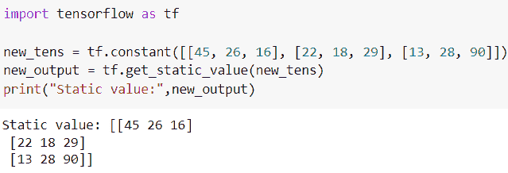
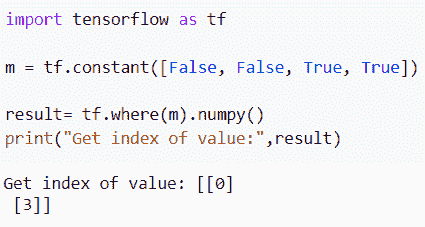
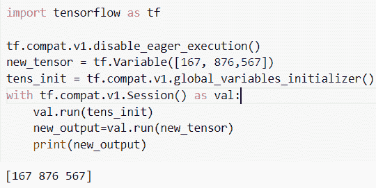
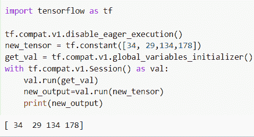
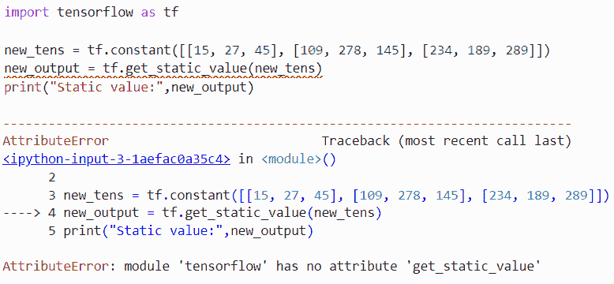
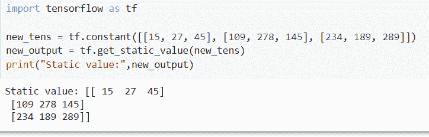

# 张量流获取静态值

> 原文：<https://pythonguides.com/tensorflow-get-static-value/>

[](https://sharepointsky.teachable.com/p/python-and-machine-learning-training-course)

在本 [Python 教程中，](https://pythonguides.com/learn-python/)我们将学习**如何获取 Python TensorFlow** 中的静态值。此外，我们将涵盖以下主题。

*   张量流获取静态值
*   TensorFlow 获取值的索引
*   Tensorflow 从 tf 变量获取值
*   张量流得到一个常量张量值
*   模块“TensorFlow”没有属性“获取静态值”

目录

[](#)

*   [TensorFlow 获取静态值](#TensorFlow_get_static_value "TensorFlow get static value")
*   [TensorFlow 获取索引的值](#TensorFlow_get_the_index_of_the_value "TensorFlow get the index of the value")
*   [TensorFlow 从 tf.variable()中获取值](#TensorFlow_get_value_from_tfvariable "TensorFlow get value from tf.variable()")
*   [TensorFlow 得到一个常量张量值](#TensorFlow_get_a_constant_tensor_value "TensorFlow get a constant tensor value")
*   [模块“TensorFlow”没有属性“获取静态值”](#Module_TensorFlow_has_no_attribute_get_static_value "Module ‘TensorFlow’ has no attribute ‘get static value’ ")

## TensorFlow 获取静态值

*   在本节中，我们将讨论如何在 [Python TensorFlow](https://pythonguides.com/tensorflow/) 中获取静态值。
*   为了执行这个特定的任务，我们将使用`*TF . get _ static _ value()*`函数，这个函数用于显示来自输入张量的常数值。
*   在 TensorFlow 中，静态值意味着常量值，如果静态值无法测量，则它将返回 none 值。

**语法:**

让我们看一下语法，了解一下 Python TensorFlow 中 `tf.get_static_value()` 函数的工作原理。

```py
tf.get_static_value(
                    tensor,
                    partial=False
                   )
```

*   它由几个参数组成。
    *   **张量:**该参数指定输入张量。
    *   **partial:** 默认情况下，它接受一个 false 值，如果为 true，那么它将返回一个部分求值的数组，如果为 none，则不能求值。

**Return:** 该方法返回 NumPy 个 n 维数组，值为常量。

**举例:**

我们举个例子，检查一下**如何在 Python TensorFlow 中获取静态值。**

**源代码:**

```py
import tensorflow as tf

new_tens = tf.constant([[45, 26, 16], [22, 18, 29], [13, 28, 90]])
new_output = tf.get_static_value(new_tens)
print("Static value:",new_output)
```

在下面给出的代码中，我们使用 `tf.constant()` 函数创建了输入张量，然后使用 `tf.get_static_value()` 函数，并将输入张量变量**‘new _ tens’**作为参数传递。

下面是下面给出的代码的截图。



TensorFlow get static value

阅读:[tensor flow next _ batch+Examples](https://pythonguides.com/tensorflow-next_batch/)

## TensorFlow 获取索引的值

*   这里我们要了解如何在 Python TensorFlow 中获取值的索引。
*   通过使用 **tf。其中()**函数，我们可以很容易地得到指标的值。该功能将帮助用户获得 `y` 和 `x` 的复用索引。
*   该函数根据给定的条件返回来自第二个输入张量或第一个张量的值。

**语法:**

下面是 Python TensorFlow 中 `tf.where()` 函数的语法。

```py
tf.where(
        condition,
        x=None, 
        y=None, 
        name=None
)
```

*   它由几个参数组成
    *   **条件:**该参数指定条件，必须是 dtype bool 或整数值。
    *   **x 和 y:** 如果给定了，那么同类型的输入张量具有条件和 y 允许的形状。
    *   **名称:**默认不取值，指定操作的名称。

**Returns:** 这个方法将返回张量的值。

**举例:**

我们举个例子，检查一下**如何在 Python TensorFlow 中获取值的索引。**

**源代码:**

```py
import tensorflow as tf

m = tf.constant([False, False, True, True])  

result= tf.where(m).numpy()
print("Get index of value:",result)
```

*   首先，我们将导入 TensorFlow 库，然后使用 `tf.constant()` 函数创建一个输入张量。
*   在这个函数中，我们将布尔值作为一个参数。
*   之后，我们使用了 `tf.where()` 函数从张量中获取索引值。

下面是以下给定代码的实现。



Tensorflow get the index of the value

阅读:[梯度下降优化器张量流](https://pythonguides.com/gradient-descent-optimizer-tensorflow/)

## TensorFlow 从 tf.variable()中获取值

*   在这个例子中，我们将讨论如何从 [Python TensorFlow](https://pythonguides.com/tensorflow/) 中的 `tf.variable()` 函数获取值。
*   为了完成这项任务，我们将使用 `tf.variable()` 函数作为输入张量，并从参数中获取值。
*   在 Python Tensorflow 中，变量用于存储参数或值，这些值在训练期间会不断修改。

**举例:**

```py
import tensorflow as tf

tf.compat.v1.disable_eager_execution()
new_tensor = tf.Variable([167, 876,567])
tens_init = tf.compat.v1.global_variables_initializer()
with tf.compat.v1.Session() as val:
    val.run(tens_init)
    new_output=val.run(new_tensor)
    print(new_output)
```

在下面给出的代码中，我们创建了`TF . compat . v1 . global _ variables _ initializer()`函数，并通过使用 `tf.compat.v1.Session()` 函数运行会话。一旦执行了这段代码，输出将显示输入张量的值。

你可以参考下面的截图。



TensorFlow get the value from the tf.variable()

阅读:[二元交叉熵张量流](https://pythonguides.com/binary-cross-entropy-tensorflow/)

## TensorFlow 得到一个常量张量值

*   在本节中，我们将讨论如何在 Python TensorFlow 中获得一个常量张量值。
*   为了执行这个特定的任务，我们将使用 `tf.constant()` 函数从输入张量中获取常数值。
*   这个函数用于声明一个给定对象的常数张量。

**语法:**

下面是 Python TensorFlow 中 `tf.constant()` 函数的语法

```py
tf.constant(
            value, 
            dtype=None, 
            shape=None, 
            name='Const'
           )
```

*   它由几个参数组成
    *   **值:**该参数指定我们想要转换成张量的值。
    *   **dtype:** 默认情况下，它不取任何值，并定义输出张量的类型。
    *   **shape:** 它指定了结果张量的维数。
    *   **name:** 默认取常数值，指定张量的名称。

**举例:**

我们举个例子，检查一下**如何在 Python TensorFlow 中获取一个常张量值。**

**源代码:**

```py
import tensorflow as tf

tf.compat.v1.disable_eager_execution()
new_tensor = tf.constant([34, 29,134,178])
get_val = tf.compat.v1.global_variables_initializer()
with tf.compat.v1.Session() as val:
    val.run(get_val)
    new_output=val.run(new_tensor)
    print(new_output)
```

下面是下面给出的代码的截图。



Tensorflow get constant value

阅读: [Tensorflow 嵌入 _ 查找](https://pythonguides.com/tensorflow-embedding_lookup/)

## 模块“TensorFlow”没有属性“获取静态值”

这里我们要讨论的是错误模块**‘tensor flow’没有属性‘get static value’。**

**原因:**旧版 **1。** x， `tf.get` 静态值已被移除，如果您使用的是 TensorFlow 的最新版本，那么它可以在复杂程序中工作。

**举例:**

```py
import tensorflow as tf

new_tens = tf.constant([[15, 27, 45], [109, 278, 145], [234, 189, 289]])
new_output = tf.get_static_value(new_tens)
print("Static value:",new_output)
```

下面是以下给定代码的实现。



module TensorFlow has no attribute get static value

**解决方案:**

以下是此错误的解决方案。

在这个例子中，我们将使用 TensorFlow `2.x` 版本。

```py
import tensorflow as tf

new_tens = tf.constant([[15, 27, 45], [109, 278, 145], [234, 189, 289]])
new_output = tf.get_static_value(new_tens)
print("Static value:",new_output)
```

在上面的代码中，我们导入了 TensorFlow 库，然后使用 `tf.constant()` 函数创建了一个输入张量。之后，我们使用 `tf.get_static_value()` ，并指定输入张量作为参数。一旦执行了这段代码，输出将显示给定张量的常数值。

下面是以下给定代码的输出。



Solution of module TensorFlow attribute get static error

你可能也喜欢阅读下面的 TensorFlow 教程。

*   [批量归一化张量流](https://pythonguides.com/batch-normalization-tensorflow/)
*   [TensorFlow 自然语言处理](https://pythonguides.com/tensorflow-natural-language-processing/)
*   [tensor flow clip _ by _ value–完整教程](https://pythonguides.com/tensorflow-clip_by_value/)
*   [张量流乘法——有用指南](https://pythonguides.com/tensorflow-multiplication/)
*   [Python TensorFlow 随机均匀](https://pythonguides.com/tensorflow-random-uniform/)
*   [导入错误没有名为 TensorFlow 的模块](https://pythonguides.com/import-error-no-module-named-tensorflow/)

在本 [Python 教程中，](https://pythonguides.com/learn-python/)我们学习了**如何在 Python TensorFlow** 中获取静态值。此外，我们还讨论了以下主题。

*   张量流获取静态值
*   TensorFlow 获取值的索引
*   TensorFlowget 从 tf 变量中获取值
*   张量流得到一个常量张量值
*   模块“TensorFlow”没有属性“获取静态值”

[Bijay Kumar](https://pythonguides.com/author/fewlines4biju/)

Python 是美国最流行的语言之一。我从事 Python 工作已经有很长时间了，我在与 Tkinter、Pandas、NumPy、Turtle、Django、Matplotlib、Tensorflow、Scipy、Scikit-Learn 等各种库合作方面拥有专业知识。我有与美国、加拿大、英国、澳大利亚、新西兰等国家的各种客户合作的经验。查看我的个人资料。

[enjoysharepoint.com/](https://enjoysharepoint.com/)[](https://www.facebook.com/fewlines4biju "Facebook")[](https://www.linkedin.com/in/fewlines4biju/ "Linkedin")[](https://twitter.com/fewlines4biju "Twitter")