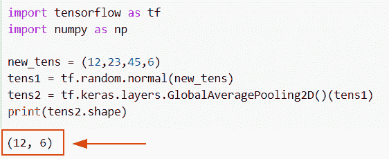
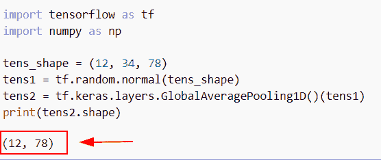
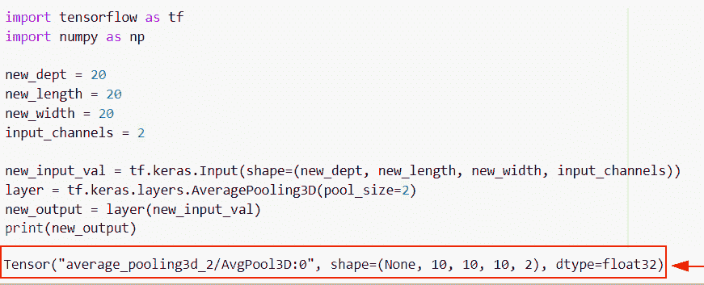
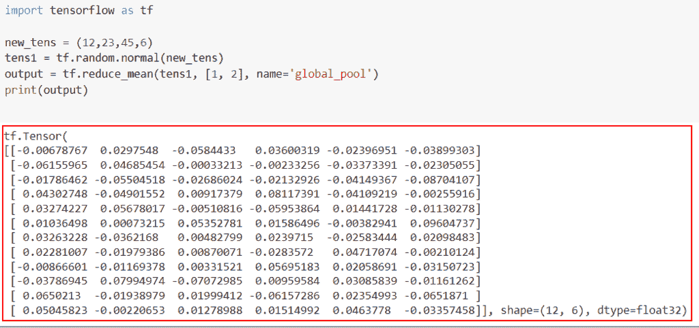
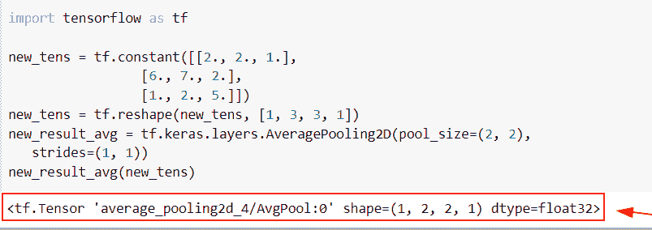

# TensorFlow 全球平均池

> 原文：<https://pythonguides.com/tensorflow-global-average-pooling/>

[](https://sharepointsky.teachable.com/p/python-and-machine-learning-training-course)

在这个 [Python 教程中，](https://pythonguides.com/learn-python/)我们将学习**如何在 Python TensorFlow** 中进行全局平均池化。此外，我们将涵盖以下主题。

*   TensorFlow 全球平均池 1d
*   TensorFlow 全球平均池 3d
*   TensorFlow 全球平均池减少 _ 平均
*   全局平均池层张量流

还有，看看最新的相关教程: [Tensorflow 将稀疏张量转换为张量](https://pythonguides.com/tensorflow-convert-sparse-tensor-to-tensor/)

目录

[](#)

*   [TensorFlow 全球平均池](#TensorFlow_global_average_pooling "TensorFlow global average pooling")
*   [TensorFlow 全球平均池 1d](#TensorFlow_global_average_pooling_1d "TensorFlow global average pooling 1d")
*   [TensorFlow 全球平均池 3d](#TensorFlow_global_average_pooling_3d "TensorFlow global average pooling 3d")
*   [TensorFlow 全球平均池减少 _ 平均](#TensorFlow_global_average_pooling_reduce_mean "TensorFlow global average pooling reduce_mean")
*   [全局平均池层张量流](#Global_average_pooling_layer_TensorFlow "Global average pooling layer TensorFlow")

## TensorFlow 全球平均池

*   在本节中，我们将讨论如何在 [Python TensorFlow](https://pythonguides.com/tensorflow/) 中进行全局平均池化。
*   为了执行这个特定的任务，我们将使用 **tf。keras . layers . globalaaveragepooling2d()**函数，该函数用于对给定数据进行全局平均池操作。
*   例如，假设我们有一个高度(h)、宽度和深度维度的输入特征图。当我们将此输入层传递到全局平均池操作中时，它将计算每个单独地图的平均值，并将平均值返回到输出节点。

**语法:**

让我们看看语法，了解一下 **tf 的工作原理。Python TensorFlow 中的 keras . layers . globalaveragepooli2d()**。

```py
tf.keras.layers.GlobalAveragePooling2D(
    data_format=None, keepdims=False, **kwargs
)
```

*   它由几个参数组成
    *   **data_format:** 该参数指定输入通道中尺寸的顺序，默认情况下，它采用 Keras 中的图像 data_format 值。
    *   **Keepdims:** 默认情况下，它取一个 false 值，指定张量的秩被降低，如果为 true，则空间维度保留长度 1。

**举例:**

让我们举个例子，看看如何在 Python TensorFlow 中进行全局平均池化。

**源代码:**

```py
import tensorflow as tf
import numpy as np

new_tens = (12,23,45,6)
tens1 = tf.random.normal(new_tens)
tens2 = tf.keras.layers.GlobalAveragePooling2D()(tens1)
print(tens2.shape)
```

*   在上面的代码中，我们创建了一个张量，然后使用了 `tf.random.normal()` 函数，并在函数内部将该张量指定为一个参数。
*   之后，我们使用了`TF . keras . layers . globalavergepooling2d()`函数，该函数返回输出节点。

下面是下面给出的代码的截图。



TensorFlow global average pooling

阅读:[张量流 clip_by_value](https://pythonguides.com/tensorflow-clip_by_value/)

## TensorFlow 全球平均池 1d

*   在这个例子中，我们将讨论如何在 Python TensorFlow 中进行全局平均池 1d。
*   对于这个执行，我们将使用 **tf。keras . layers . globalaveragepooling1d()**函数。此函数用于操作时态数据的全局平均池。

**语法:**

我们先来看看语法，了解一下 Python TensorFlow 中的工作`TF . keras . layers . globalaveragepooling1d()`。

```py
tf.keras.layers.GlobalAveragePooling1D(
    data_format='channels_last', **kwargs
)
```

*   它由几个参数组成。
    *   data_format:该参数表示输入中尺寸的顺序，默认情况下，它采用与形状输入相对应的**‘channels _ last’**值。
    *   **keepdims:** 默认情况下，它取一个 false 值，指定张量的秩被降低，如果为 true，则空间维度保留长度 1。

**举例:**

```py
import tensorflow as tf
import numpy as np

tens_shape = (12, 34, 78)
tens1 = tf.random.normal(tens_shape)
tens2 = tf.keras.layers.GlobalAveragePooling1D()(tens1)
print(tens2.shape)
```

在下面的代码中，我们使用了 **tf。keras . layers . globalaveragepooling1d()**函数，该函数将返回输入张量的值。

下面是以下给定代码的实现。



TensorFlow global average pooling 1d

阅读: [Tensorflow 嵌入 _ 查找](https://pythonguides.com/tensorflow-embedding_lookup/)

## TensorFlow 全球平均池 3d

*   在本节中，我们将讨论如何在 Python TensorFlow 中使用`TF . keras . layers . averagepool3d`函数。
*   该函数用于操作三维数据的全局平均池，它采用一个带形状的 `5D` 张量。

**语法:**

让我们看看语法，了解一下 **tf 的工作原理。Python TensorFlow 中的 keras . layers . averagepool3d()**函数

```py
tf.keras.layers.GlobalAveragePooling3D(
    data_format=None, keepdims=False, **kwargs
)
```

*   它由几个参数组成
    *   **data_format:** 该参数表示输入中尺寸的顺序，默认情况下，它采用“无”值，对应于带形状的输入。
    *   **Keepdims:** 默认情况下，它取一个 false 值，指定张量的秩被降低，如果为 true，则空间维度保留长度 1。

**举例:**

让我们举个例子，检查一下如何使用 **tf。Python TensorFlow 中的 keras . layers . averagepool3d()**函数。

**源代码:**

```py
import tensorflow as tf
import numpy as np

new_dept = 20
new_length = 20
new_width = 20
input_channels = 2

new_input_val = tf.keras.Input(shape=(new_dept, new_length, new_width, input_channels))
layer = tf.keras.layers.AveragePooling3D(pool_size=2)
new_output = layer(new_input_val)
print(new_output)
```

在上面的代码中，我们已经为 **tf 中的平均池步幅创建了高度、宽度和深度值。Keras.Input()** 函数，然后我们使用了 **tf。keras . averagepool3d()**函数并指定给定输入层的尺寸。

下面是以下给定代码的执行。



TensorFlow global average pooling 3d

阅读:[张量流乘法-有用指南](https://pythonguides.com/tensorflow-multiplication/)

## TensorFlow 全球平均池减少 _ 平均

*   这里我们要讨论的是如何在全局平均池张量流中使用 reduce_mean。
*   如果没有为平均池定义高度和宽度，那么我们也可以使用 `tf.reduce_mean()` 函数，当您沿着轴**【1，2】**进行缩减时，它会指定张量的第二维和第一维以及一些过滤器。

**语法:**

下面是 Python TensorFlow 中 `tf.reduce_mean()` 函数的语法。

```py
tf.reduce_mean(
    input_tensor,
    axis=None,
    keepdims=None,
    name=None,
    reduction_indices=None,
    keep_dims=None
)
```

*   它由几个参数组成
    *   **input_tensor:** 该参数表示我们想要减少的张量，它应该始终是一个数字类型。
    *   **轴:**默认情况下，它不取值，一旦您在函数中使用它，默认情况下所有维度都将减少。
    *   **keepdims:** 该参数将检查条件，如果为真，则减少秩张量的长度。默认情况下，它采用一个假值。
    *   **名称:**可选参数，表示操作的名称。

**举例:**

让我们举个例子，看看如何在全局平均池张量流中使用 `reduce_mean` 。

**源代码:**

```py
import tensorflow as tf

new_tens = (12,23,45,6)
tens1 = tf.random.normal(new_tens)
output = tf.reduce_mean(tens1, [1, 2], name='global_pool') 
print(output) 
```

在上面的代码中，我们使用了 `tf.reduce_mean()` 函数，而不是使用高度和宽度。我们使用了**【1，2】**轴，它指定了第一和第二维度。

下面是以下给定代码的实现。



TensorFlow global average pooling reduce_mean

阅读: [TensorFlow 获取变量+示例](https://pythonguides.com/tensorflow-get-variable/)

## 全局平均池层张量流

*   在这个例子中，我们将讨论如何在 [Python TensorFlow](https://pythonguides.com/tensorflow/) 中使用平均池层。
*   为了完成这个任务，我们将使用 **tf。keras . layers . average pooling 2d()**函数，该函数用于空间数据的平均池化操作。

**语法:**

下面是 **tf 的语法。Python TensorFlow 中的 keras . layers . average pooling 2d()**。

```py
tf.keras.layers.AveragePooling2D(
    pool_size=(2, 2),
    strides=None,
    padding='valid',
    data_format=None,
    **kwargs
)
```

*   它由几个参数组成
    *   **pool_size:** 该参数指定池的大小，必须是 **(2，2)** 和两个空间维度输入的整数。
    *   **步幅:**默认情况下，它采用 none 值，并指定步幅值。
    *   **填充:**默认情况下，它采用**‘有效’**，这意味着没有填充，如果该值为‘相同’，则导致在输入的右侧/左侧均匀填充。
    *   **data_format:** 该参数表示输入中尺寸的排序，默认情况下，取与形状输入相对应的**‘无’**值。

**举例:**

我们举个例子，检查一下**如何在 Python TensorFlow 中使用平均池层。**

**源代码:**

```py
import tensorflow as tf

new_tens = tf.constant([[2., 2., 1.],
                 [6., 7., 2.],
                 [1., 2., 5.]])
new_tens = tf.reshape(new_tens, [1, 3, 3, 1])
new_result_avg = tf.keras.layers.AveragePooling2D(pool_size=(2, 2),
   strides=(1, 1))
new_result_avg(new_tens)
```

下面是以下给定代码的输出。



global average pooling layer TensorFlow

你可能也喜欢读下面的张量流。

*   [Python TensorFlow 占位符](https://pythonguides.com/tensorflow-placeholder/)
*   [Tensorflow 获取静态值](https://pythonguides.com/tensorflow-get-static-value/)
*   [TensorFlow 自然语言处理](https://pythonguides.com/tensorflow-natural-language-processing/)
*   [张量流均方误差](https://pythonguides.com/tensorflow-mean-squared-error/)
*   [将列表转换为张量张量流](https://pythonguides.com/convert-list-to-tensor-tensorflow/)
*   [Python tensor flow expand _ dims](https://pythonguides.com/tensorflow-expand_dims/)
*   [tensor flow next _ batch+Examples](https://pythonguides.com/tensorflow-next_batch/)

在这个 Python 教程中， [](https://pythonguides.com/learn-python/) 我们学习了**如何在 Python TensorFlow** 中进行全局平均池化。此外，我们还讨论了以下主题。

*   TensorFlow 全球平均池 1d
*   TensorFlow 全球平均池 3d
*   TensorFlow 全球平均池减少 _ 平均
*   全局平均池层张量流

[Bijay Kumar](https://pythonguides.com/author/fewlines4biju/)

Python 是美国最流行的语言之一。我从事 Python 工作已经有很长时间了，我在与 Tkinter、Pandas、NumPy、Turtle、Django、Matplotlib、Tensorflow、Scipy、Scikit-Learn 等各种库合作方面拥有专业知识。我有与美国、加拿大、英国、澳大利亚、新西兰等国家的各种客户合作的经验。查看我的个人资料。

[enjoysharepoint.com/](https://enjoysharepoint.com/)[](https://www.facebook.com/fewlines4biju "Facebook")[](https://www.linkedin.com/in/fewlines4biju/ "Linkedin")[](https://twitter.com/fewlines4biju "Twitter")