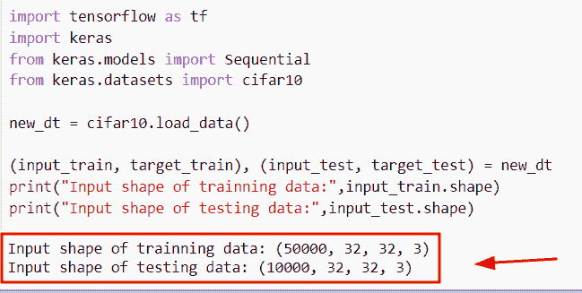
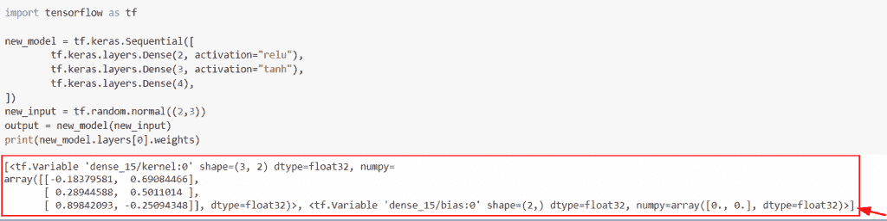

# 张量流图——详细指南

> 原文：<https://pythonguides.com/tensorflow-graph/>

[](https://sharepointsky.teachable.com/p/python-and-machine-learning-training-course)

在本 [Python 教程](https://pythonguides.com/learn-python/)中，我们将学习**如何在 Python TensorFlow** 中制作图形。此外，我们将涵盖以下主题。

*   张量流图与渴望
*   张量流图和会话
*   Tensorflow graph to keras model
*   带回路的张量流图
*   默认为图形的张量流
*   张量流图 _ 替换
*   张量流没有属性' reset_default_graph '
*   Tensorflow graph input name
*   tensor flow graph . get _ operation _ by _ name
*   张量流图并行化
*   张量流图所有变量
*   Tensorflow add_graph
*   张量流分裂张量
*   张量流图形最终确定
*   张量流图获取所有张量名称
*   张量流获取输入和输出
*   张量流获取输入形状
*   张量流获取权重
*   张量流获取操作
*   TensorFlow get layers
*   TensorFlow graph list

目录

[](#)

*   [Python 张量流图](#Python_TensorFlow_Graph "Python TensorFlow Graph")
*   [张量流图 vs 渴望](#TensorFlow_graph_vs_eager "TensorFlow graph vs eager")
*   [张量流图和时段](#TensorFlow_graph_and_session "TensorFlow graph and session")
*   [带回路的张量流图](#TensorFlow_graph_with_loop "TensorFlow graph with loop")
*   [张量流图 _ 替换](#TensorFlow_graph_replace "TensorFlow graph_replace")
*   [张量流没有属性‘重置 _ 默认 _ 图形’](#TensorFlow_has_no_attribute_reset_default_graph "TensorFlow has no attribute ‘reset_default_graph’")
*   [张量流图所有变量](#TensorFlow_graph_all_variables "TensorFlow graph all variables")
*   [TensorFlow 获取输入形状](#TensorFlow_get_input_shape "TensorFlow get input shape")
*   [TensorFlow 获取权重](#TensorFlow_get_weights "TensorFlow get weights")
*   [张量流获取操作](#TensorFlow_get_operation "TensorFlow get operation")
*   [TensorFlow get layers](#TensorFlow_get_layers "TensorFlow get layers")
*   [TensorFlow graph list](#TensorFlow_graph_list "TensorFlow graph list")
*   [张量流分裂张量](#TensorFlow_split_tensor "TensorFlow split tensor")
*   [TensorFlow 获取输入和输出](#TensorFlow_get_input_and_output "TensorFlow get input and output")
*   [tensor flow graph . get _ operation _ by _ name](#TensorFlow_graphget_operation_by_name "TensorFlow graph.get_operation_by _name")
*   [张量流图并行化](#TensorFlow_graph_parallelization "TensorFlow graph parallelization")
*   [TensorFlow 将图形写到 tensorboard](#TensorFlow_write_graph_to_tensorboard "TensorFlow write graph to tensorboard")
*   [Tensorflow add_graph](#Tensorflow_add_graph "Tensorflow add_graph")
*   [Tensorflow graph input name](#Tensorflow_graph_input_name "Tensorflow graph input name")

## Python 张量流图

*   在 [Python TensorFlow](https://pythonguides.com/tensorflow/) 中，图指定了节点和一条边，而节点以更多的张量作为输入，生成给定的张量作为输出。
*   边缘被表示为张量，并且它将生成新的张量，并且它总是依赖于单独的操作。
*   如果我们在 Tensorflow 中举一个例子，那么图就是这个例子的主干，简单地说，我们可以说图是定义模型中操作的节点的组合。
*   张量流图类似于存储一组张量流操作对象的数据结构，这些对象指示计算单位，其中对象将是指定数据单位的张量。

**举例:**

现在让我们看看这个例子，并检查**如何在 Python TensorFlow 中创建和执行一个图形。**

**源代码:**

```py
import tensorflow as tf

tf.compat.v1.disable_eager_execution()
var1 = 5
var2 = 8
result= tf.add(var1, var2, name='Add')
with tf.compat.v1.Session() as val:
    new_output=val.run(result)
    print(new_output)
```

在下面给出的代码中，我们导入了 tensorflow 库和`TF . compat . v1 . disable _ eager _ execution()`函数来运行会话。

创建变量后，我们使用了基本的操作方法来显示图形，即 `tf.add()` 函数，在该函数中，我们用**‘名称’**参数为变量赋值。

下面是下面给出的代码的截图。


Python TensorFlow Graph

阅读: [TensorFlow Tensor to NumPy](https://pythonguides.com/tensorflow-tensor-to-numpy/)

## 张量流图 vs 渴望

*   在这个程序中，我们将讨论 Python TensorFlow 中图形和急切执行的区别。
*   在 Python TensorFlow 中，急切执行会准备好模型，并执行操作以添加到图表中。而在图形的情况下，它表示计算的数据流。

**举例:**

让我们举个例子，检查一下 Python TensorFlow 中的**图和急切执行**之间的区别。

**源代码:**

```py
import tensorflow as tf

def eager_function(y):
  new_output = y ** 2
  print(new_output)
  return new_output

y = tf.constant([13, 16, 18, 19, 21])

eager_function(y)

new_graph = tf.Graph()
with new_graph.as_default():
  result = tf.constant(16)
  print(result)
```

在上面的代码中，我们导入了 TensorFlow 库，然后定义了 `eager_function()` ，在这个函数中，我们使用了 `**` 运算符并返回值。

下面是以下给定代码的实现。


TensorFlow graph vs eager

阅读:[张量流得到形状](https://pythonguides.com/tensorflow-get-shape/)

## 张量流图和时段

*   在本节中，我们将讨论如何在 Python TensorFlow 图中使用会话。
*   为了执行这个特定的任务，我们将使用`TF . compat . v1 . disable _ eager _ execution()`函数，这个函数将创建会话。
*   接下来，我们将通过使用 `tf.math.multiply()` 方法来声明变量和操作函数，在这个函数中，我们已经将变量和名称数据类型指定为参数。
*   为了创建一个会话，我们将使用 `tf.compat.v1.session()` ，为了运行会话，我们将使用 `val.run()` 。

**举例:**

让我们举个例子，看看如何在 Python TensorFlow 图中使用会话。

**源代码:**

```py
import tensorflow as tf

tf.compat.v1.disable_eager_execution()
x = 6
y = 7
result= tf.math.multiply(x, y, name='mult')
with tf.compat.v1.Session() as val:
    new_output=val.run(result)
    print(new_output)
```

在下面给定的代码中，我们导入了 TensorFlow 库，然后为操作符值创建了变量。之后，我们已经使用了 **tf。math.multiply()** 函数，在这个函数中，我们传递了带有 name 参数的 `x` 和 `y` 变量。运行会话后，输出将显示该值。

下面是下面给出的代码的截图。


TensorFlow graph and session

阅读:[Python tensor flow reduce _ sum](https://pythonguides.com/python-tensorflow-reduce_sum/)

## 带回路的张量流图

*   在本节中，我们将讨论如何在 Python TensorFlow 图中使用**循环。**
*   为了执行这个特定的任务，我们将使用 `tf.while_loop()` 函数，这个函数将检查条件，如果为真，那么它将重复主体。

**语法:**

让我们看一下语法，了解一下 Python TensorFlow 中的 `tf.while_loop()` 函数的工作原理。

```py
tf.while_loop
             (
              cond,
              body,
              loop_vars,
              shape_invariants=None,
              parallel_iterations=10,
              back_prop=True,
              swap_memory=False,
              maximum_iterations=None,
              name=None
             )
```

*   它由几个参数组成
    *   **cond:** 该参数表示循环的执行条件。
    *   **主体:**该参数指定循环主体。
    *   **loop_vars:** 这是一个张量对象和 numpy 数组的列表。
    *   **shape_invariants:** 默认情况下，它不取值，并指定变量的形状。
    *   **Parallel_iterations:** 默认取 `10` 值，必须是正整数。
    *   **back_prop:** 可选参数，支持反向传播。
    *   **名称:**该参数表示操作的名称。

**举例:**

让我们举个例子，检查一下如何在 Python TensorFlow Graph 中使用循环。

**源代码:**

```py
import tensorflow as tf

tens = tf.constant(20)
tens1 = lambda tens: tf.less(tens, 10)
tens2 = lambda tens: (tf.add(tens, 1), )
result = tf.while_loop(tens1, tens2, [tens])
print(result)
```

在下面的代码中，我们导入了 TensorFlow 库，然后使用 `tf.constant()` 函数声明了一个变量。之后，我们使用了 `tf.while_loop()` 函数，在这个函数中，我们传递了十进制的函数。一旦执行了这段代码，输出将显示 numpy 数组。

下面是以下给定代码的执行。


TensorFlow graph with loop

阅读:[Python tensor flow reduce _ mean](https://pythonguides.com/python-tensorflow-reduce_mean/)

## 张量流图 _ 替换

*   在本节中，我们将讨论如何在 Python TensorFlow 中替换图形。
*   为了执行这个特定的任务，首先，我们将定义 `build()` 函数，在这个函数中，我们使用了 `tf.placeholder()` 函数来创建张量，并在 `tf.add()` 函数中提到了张量。
*   接下来，我们将使用 `tf.get_default_graph()` 函数，该函数将返回默认的图形会话，然后我们将使用 `ge.graph_replace()` 函数。

**语法:**

下面是 Python TensorFlow 中`TF . compat . v1 . get _ default _ graph()`函数的语法。

```py
tf.compat.v1.get_default_graph()
```

**举例:**

我们举个例子，检查一下**如何在 Python TensorFlow** 中替换图形。

**源代码:**

```py
 import tensorflow as tf
import tensorflow.contrib.graph_editor as ge
tf.compat.v1.disable_eager_execution()
def build():
    tens1 = tf.placeholder(dtype=tf.int32)
    tens2 = tf.placeholder(dtype=tf.int32)
    result= tf.add(tens1, tens2)

build() 

new_result1 = tf.constant(2.0, shape=[2, 3])
new_result2 = tf.constant(4.0, shape=[2, 3])

tens1 = tf.get_default_graph().get_tensor_by_name("a:0")
tens2 = tf.get_default_graph().get_tensor_by_name("b:0")
result = tf.get_default_graph().get_tensor_by_name("c:0")

new_output = ge.graph_replace(result, {tens1: new_result1, tens2: new_result2})

with tf.compat.v1.Session() as sess:

    print(sess.run(new_output))
```

在上面的代码中，我们导入了 tensor flow . contrib . graph _ editor 作为 get 来替换图形，然后我们定义了函数 `build()` ，在这个函数中，我们使用 `tf.placeholder()` 函数分配了张量。

之后，我们使用了 `ge.graph_replace()` 函数，在这个函数中，我们传递了带有值的张量作为参数。一旦执行了这段代码，输出就会显示值。

下面是以下给定代码的执行。


TensorFlow graph_replace in Python

阅读: [Python TensorFlow 随机均匀](https://pythonguides.com/tensorflow-random-uniform/)

## 张量流没有属性‘重置 _ 默认 _ 图形’

*   在本程序中，我们将讨论 Python TensorFlow 中的错误 TensorFlow 没有属性**‘reset _ default _ graph’**。
*   基本上，当 `tf.reset_default_graph()` 函数在最新版本的 TensorFlow 中不可用时，就会出现此错误声明。

**举例:**

在这个例子中，我们刚刚使用了 `tf.reset_default_graph()` 函数。


TensorFlow has no attribute reset_default_graph

> **注意:**如果你在 Tensorflow 中使用的是 `1.x` 版本，那么这个函数将很容易在例子中工作。

现在让我们来看看这个错误的解决方案。

**解决方案:**

为了执行这个特定的任务，我们将使用更新的函数`TF . compat . v1 . reset _ default _ graph()`。此功能仅在最新版本 2.8x 中有效

**源代码:**

```py
import tensorflow as tf

result=tf.compat.v1.reset_default_graph()
print(result)
```

下面是以下给定代码的实现。


Solution of TensorFlow has no attribute reset_default_graph

阅读: [Python TensorFlow one_hot](https://pythonguides.com/tensorflow-one_hot/)

## 张量流图所有变量

*   在这个程序中，我们将讨论如何获取张量流图中的所有变量。
*   为了完成这个任务，首先，我们将通过使用 `tf.constant()` 和 `tf.variable()` 函数来操作一些操作，在这个函数中，我们将分配值和 name 参数。
*   接下来，为了获取所有变量，我们将使用`TF . compat . v1 . get _ default _ graph()`函数，该函数将帮助用户从图中返回变量名。

**语法:**

我们先来看看语法，了解一下`TF . compat . v1 . get _ default _ graph()`函数在 Python TensorFlow 中的工作原理。

```py
tf.compat.v1.get_default_graph()
```

**举例:**

我们举个例子，检查一下如何得到张量流图中的所有变量。

**源代码:**

```py
import tensorflow as tf

tens1 = tf.constant(2.6, name='const_tens1')
tens2 = tf.Variable(4.8, name='variable_tens2')
tens3 = tf.add(tens1, tens2, name='new_add')
tens4 = tf.multiply(tens3, tens1, name='new_mult')

for new_op in tf.compat.v1.get_default_graph().get_operations():
    print(str(new_op.name))
```

在下面给定的代码中，我们导入了 TensorFlow 库，并使用 `tf.constant()` 和 `tf.variable()` 函数创建了一个变量，用于从 TensorFlow 中获取所有变量。

下面是以下代码的截图


TensorFlow graph all variables

阅读:[Python tensor flow expand _ dims](https://pythonguides.com/tensorflow-expand_dims/)

## TensorFlow 获取输入形状

*   在本节中，我们将讨论如何在 Python TensorFlow 中获取输入形状。
*   为了完成这项任务，我们将使用 `cifar10()` load dataset 从张量中获取输入形状。
*   在 Python TensorFlow 中，该方法用于加载 `CIFAR10` 数据集。

**语法:**

下面是 **tf 的语法。keras . datasets . cifar 10 . load _ data()**

```py
tf.keras.datasets.cifar10.load_data()
```

**举例:**

我们举个例子，检查一下如何在 TensorFlow 中获取输入形状。

**源代码:**

```py
import tensorflow as tf
import keras
from keras.models import Sequential
from keras.datasets import cifar10

new_dt = cifar10.load_data()

(input_train, target_train), (input_test, target_test) = new_dt
print("Input shape of trainning data:",input_train.shape)
print("Input shape of testing data:",input_test.shape)
```

在上面的代码中，我们通过使用 `Keras.datasets()` 库导入了 `cifar10` 模块，然后我们使用了 input `_train` 和 `input_test` 图像数据。一旦执行了这段代码，输出将显示**输入名称**。

下面是以下给定代码的执行。



TensorFlow get input shape in Python

阅读: [TensorFlow 稀疏张量+例题](https://pythonguides.com/tensorflow-sparse-tensor/)

## TensorFlow 获取权重

*   在本节中，我们将讨论如何在 Python Tensorflow 中获取权重。
*   为了执行这个特定的任务，我们将使用 `tf.keras.layers.Dense()` 函数的概念，在这个函数中，我们将把激活值传递给它。

**语法:**

让我们看看语法，了解一下 **tf 的工作原理。Keras.layers.Dense()** 函数。

```py
tf.keras.layers.Dense
                     (
                      units,
                      activation=None,
                      use_bias=true,
                      kernel_initializer='glorat_uniform',
                      bias_intializer='zeros',
                      kernel_regularizer=None,
                      bias_regularizer=None,
                      activity_regularizer=None,
                      kernel_constraint=None,
                      bias_constraint=None
                     )
```

*   它由几个参数组成
    *   **单位:**该参数表示输出形状的给定尺寸。
    *   **激活:**该参数指定如果不提及该值，则不应用激活。
    *   **use_bias:** 默认情况下，它采用真值，并指定偏差向量。
    *   **Kernel _ initializer:**它定义了内核权重矩阵，默认情况下采用“glorat_uniform”。
    *   **bias _ regulator:**该参数表示偏置向量。
    *   **activity_regulaeizer:** 该参数指定给定层的输出。
    *   **kernel_constraint:** 默认情况下，它不取值，并指定矩阵的权重。

**举例:**

我们举个例子，检查一下**如何在 Python TensorFlow** 中获取权重。

**源代码:**

```py
import tensorflow as tf

new_model = tf.keras.Sequential([
        tf.keras.layers.Dense(2, activation="relu"),
        tf.keras.layers.Dense(3, activation="tanh"),
        tf.keras.layers.Dense(4),
])
new_input = tf.random.normal((2,3))
output = new_model(new_input)
print(new_model.layers[0].weights)
```

在下面给定的代码中，我们导入了 TensorFlow 库，然后使用了 **tf。Keras.layers.Dense()** 函数，在这个函数中，我们将激活值赋值为**‘relu’**和**‘tanh’**。

之后，我们应用了 `tf.random.normal()` 函数，在这个函数中我们提到了值的形状。

下面是以下给定代码的实现。



Python TensorFlow get weights

阅读: [Python TensorFlow 截断法线](https://pythonguides.com/tensorflow-truncated-normal/)

## 张量流获取操作

*   在本节中，我们将讨论如何在张量流图中定义运算。
*   为了完成这项任务，我们将使用 `tf.math.divide()` 操作，并从给定的张量中获取值。

**语法:**

下面是 Python TensorFlow 中 `tf.math.divide()` 函数的语法。

```py
tf.math.divide
              (
               x,
               y,
               name=None
              )
```

*   它由几个参数组成
    *   **x:** 该参数表示输入张量。
    *   **名称:**该参数指定操作的名称。

**举例:**

我们举个例子，检查一下如何在张量中使用 `tf.math.divide()` 运算。

**源代码:**

```py
import tensorflow as tf

tf.compat.v1.disable_eager_execution()
tens1 = 6
tens2 = 7
result= tf.math.divide(tens1, tens2, name='divide')
with tf.compat.v1.Session() as val:
    new_output=val.run(result)
    print(new_output)
```

在下面给定的代码中，我们使用了 `tf.math.divide()` 函数，在这个函数中，我们将张量指定为一个参数。之后，我们使用了 `tf.compat.v1.Session()` 函数来运行会话。

下面是以下给定代码的执行。


Python TensorFlow get operation

阅读:[将列表转换为张量张量流](https://pythonguides.com/convert-list-to-tensor-tensorflow/)

## TensorFlow get layers

*   在本节中，我们将讨论如何在 Python TensorFlow 中获取图层。
*   为了执行这个特定的任务，我们将使用 `tf.keras.layers.Dense()` 函数，在这个函数中，我们将把激活值传递给它。

**语法:**

下面是 **tf 的语法。Python 中的 Keras.layers.Dense()** 函数。

```py
tf.keras.layers.Dense
                     (
                      units,
                      activation=None,
                      use_bias=true,
                      kernel_initializer='glorat_uniform',
                      bias_intializer='zeros',
                      kernel_regularizer=None,
                      bias_regularizer=None,
                      activity_regularizer=None,
                      kernel_constraint=None,
                      bias_constraint=None
                     )
```

*   它由几个参数组成
    *   **单位:**该参数表示输出形状的给定尺寸。
    *   **激活:**该参数指定如果不提及该值，则不应用激活。
    *   **use_bias:** 默认情况下，它采用真值，并指定偏差向量。
    *   **Kernel _ initializer:**它定义了内核权重矩阵，默认情况下采用“glorat_uniform”。
    *   **bias _ regulator:**该参数表示偏置向量。
    *   **activity_regulaeizer:** 该参数指定给定层的输出。
    *   **kernel_constraint:** 默认情况下，它不取值，并指定矩阵的权重。

**举例:**

我们举个例子，检查一下**如何在 Python TensorFlow** 中获取图层。

**源代码:**

```py
import numpy
import tensorflow as tf

new_val = numpy.array([[[4., 5., 6.], [16., 25., 31.]], [[28., 99., 16.], [25., 81., 55.]]])

tens1 =  3
tens2 = 2
model = tf.keras.Sequential([
    tf.keras.layers.Dense(tens2 * tens1, input_shape=(tens2, tens1), activation='relu'),
    tf.keras.layers.Dense(45, input_shape=(tens2, tens1), activation='sigmoid'),
    tf.keras.layers.GlobalAveragePooling1D(),
    tf.keras.layers.Dense(3, input_shape=(0, 1), activation='softmax')
])

model.build(input_shape=(tens2, tens1))

result=model(new_val)
print(result)
```

在下面给定的代码中，我们使用 `numpy.array()` 函数创建了一个数组，然后声明了两个指定输入形状的变量。

之后，我们已经应用了 **tf。Keras.layers.Dense()** 函数，在这个函数中，我们将给定的张量相乘，并将激活值设置为 `relu` 。

下面是下面给出的代码的截图。


TensorFlow get layers in Python

正如您在屏幕截图中看到的，输出显示了顺序层。

阅读: [Tensorflow 迭代张量](https://pythonguides.com/tensorflow-iterate-over-tensor/)

## TensorFlow graph list

*   在本节中，我们将讨论如何在 Python TensorFlow 中获取图列表。
*   为了执行这个特定的任务，我们将使用`TF . compat . v1 . get _ default _ graph()`函数，这个函数用于返回输出张量中的图形。

**语法:**

下面是 Python TensorFlow 中`TF . compat . v1 . get _ default _ graph()`函数的语法。

```py
tf.compat.v1.get_default_graph()
```

**举例:**

我们举个例子，检查一下如何在 Python TensorFlow 中获取图列表。

**源代码:**

```py
import tensorflow as tf

new_tens = tf.Variable(3)
new_tens2 = tf.Variable(8)
new_tens3 = tf.Variable(2)
result = (new_tens + new_tens2) * new_tens3

for result in tf.compat.v1.get_default_graph().get_operations():
    print (result.name)
```

在下面给出的代码中，我们已经导入了 TensorFlow 库，然后使用 `tf.variable()` 函数创建了操作。之后，我们使用了`TF . compat . v1 . get _ default _ graph()`函数并将结果变量存储为参数。

你可以参考下面的截图。


TensorFlow graph list in Python

阅读:[梯度下降优化器张量流](https://pythonguides.com/gradient-descent-optimizer-tensorflow/)

## 张量流分裂张量

*   在本节中，我们将讨论如何在 Python TensorFlow 中拆分张量。
*   为了执行这个特定的任务，我们将使用 `tf.split()` 函数，这个函数用于将一个张量值划分为一个子张量。

**语法:**

让我们看一下语法并理解 Python 中的 `tf.split()` 函数的工作原理。

```py
tf.split
        (
         value,
         num_or_size_splits,
         axis=0,
         num=None,
         name='split'
        )
```

*   它由几个参数组成
    *   **值:**该参数表示我们要分割的张量。
    *   **数量或尺寸分割:**该参数指定沿轴的分割数量。
    *   **轴:**默认取 `0` 值，定义维度，范围为 **[- rank(value)，rank(value))** 。
    *   **name:** 可选参数，指定操作的名称。

**举例:**

让我们举一个例子，检查如何在 Python TensorFlow 中拆分张量。

**源代码:**

```py
import tensorflow as tf

tensor = tf.Variable(tf.random.uniform([6, 30], -1, 1))

result = tf.split(tensor,2,1)
tf.shape(result).numpy()
```

在上面的代码中，我们导入了 TensorFlow 库，然后使用了 `tf.variable()` 函数，在这个函数中，我们提到了 `tf.random.uniform()` 函数，然后使用了 `tf.split()` 函数，它将拆分张量。

下面是下面给出的代码的截图。


TensorFlow split tensor in Python

## TensorFlow 获取输入和输出

*   在本节中，我们将讨论如何在 Python TensorFlow 中获取输入和输出张量的名称。
*   为了执行这个特定的任务，我们将使用 `tf.keras.layers.Dense()` 函数，在这个函数中，我们将设置激活和输入张量值。
*   接下来，我们将使用 `tf.keras.model()` 函数，该函数将帮助用户获得输入张量的输入和输出名称。

**语法:**

让我们看看语法，了解一下 **tf 的工作原理。Keras.model()** 函数。

```py
tf.Keras.model
              (
               *args,
               **kwargs
              )
```

**举例:**

```py
import tensorflow as tf

new_input = tf.keras.layers.Input(shape=(3000,))
tensor = tf.keras.layers.Dense(324, activation="relu")(new_input)
new_output = tf.keras.layers.Dense(20, activation="sigmoid")(tensor)
model = tf.keras.Model(inputs=new_input, outputs=new_output)
print('new_input_tensor:', new_input.name)
print('new_output_tensor:', new_output.name)
```

在这个例子中，我们已经导入了 TensorFlow 库，然后使用了 **tf。Keras.layers.Input()** 函数，在这个函数中，我们已经分配了激活和输入张量值。

下面是以下给定代码的执行。


TensorFlow get input and output

## tensor flow graph . get _ operation _ by _ name

*   本节我们将讨论如何在 Python TensorFlow 中使用 `get_operation_by_name()` 函数。
*   为了完成这个任务，我们首先将使用 `new_graph.as_default()` 函数定义一个函数**‘get _ graph’**，在这个函数中，我们将把 `tf.constant()` 函数指定为一个操作符。
*   接下来，我们将使用 `tf.session()` 函数来运行会话，并分配`sess . graph . get _ operation _ by _ name()`方法。

注意:在给定的例子中，我们使用了张量流 1。x 版本。

**语法:**

下面是 TF . get _ operation _ by _`name()`函数的语法。

```py
tf.get_operation_by_name()
```

**举例:**

我们举个例子，检查一下如何在 Python TensorFlow 中使用 `get_operation_by_name()` 函数。

**源代码:**

```py
import tensorflow as tf

def get_graph():
  new_graph = tf.Graph()
  with new_graph.as_default():
    tens = tf.constant(7.0, name='tensor')
  return new_graph, tens 

if __name__ == '__main__':
  new_graph, tens = get_graph()
  with tf.Session(graph=new_graph) as sess:
    print(sess.run(tens))
    a = sess.graph.get_operation_by_name('tensor')
    print(sess.run(tens))
```

下面是以下给定代码的实现。


TensorFlow graph get_operation_by_name

## 张量流图并行化

*   在本节中，我们将讨论如何在 Python TensorFlow 中并行化 TensorFlow。
*   为了执行这个特定的任务，我们将使用 `tf.parallel_stack()` 函数，这个函数将帮助用户将一个等级列表堆叠成一个等级。

**语法:**

下面是 Python TensorFlow 中 `tf.parallel_stack()` 函数的语法。

```py
tf.parallel_stack
                 (
                  values,
                  name='parallel_stack'
                 )
```

*   它由几个参数组成。
    *   **值:**该参数表示输入张量列表以及给定的形状和数据类型。
    *   **name:** 默认取 parallel_stack 参数，可选参数，定义操作名称。

示例:

让我们举个例子，看看如何在 TensorFlow Python 中并行化一个 Tensor i。

**源代码:**

```py
import tensorflow as tf

tf.compat.v1.disable_eager_execution()

tens1 = tf.constant([16, 27])
tens2 = tf.constant([34, 56])
tens3 = tf.constant([98, 77])
result=tf.parallel_stack([tens1, tens2, tens3])
with tf.compat.v1.Session() as val:
    new_output=val.run(result)
    print(new_output)
```

在上面的代码中，我们导入了 TensorFlow 库，然后通过使用 `tf.constant()` 函数创建了张量，然后使用了 `tf.parallel_stack()` 函数，在这个函数中，我们将张量作为参数传递。

之后，我们通过使用 `tf.compat.v1.Session()` 函数创建了一个会话，并将**‘result’**变量指定为参数，一旦您执行此代码，输出将显示并行化的值。

下面是以下给定代码的实现。


TensorFlow graph parallelization

## TensorFlow 将图形写到 tensorboard

*   在本节中，我们将讨论如何在 Python TensorFlow 中向 tensorboard 写一个图。
*   为了完成这个任务，我们将使用`TF . compat . v1 . get _ default _ graph()`函数来定义图形。
*   接下来，我们将把文件模式下的 `graphpb.txt()` 文件应用为 `f.write(graphpb_txt)` 。一旦执行了这段代码，输出将显示随机值。

**举例:**

我们举个例子，检查一下如何用 Python TensorFlow 写一个图到 tensorboard。

**源代码:**

```py
import tensorflow as tf

graph_def = tf.compat.v1.get_default_graph().as_graph_def()
graphpb_txt = str(graph_def)
with open('graphpb.txt', 'w') as f: f.write(graphpb_txt)
print(graphpb_txt)
```

下面是以下给定代码的实现。


TensorFlow write graph to tensorboard

## Tensorflow add_graph

*   在本节中，我们将讨论如何在 Python TensorFlow 中添加图表。
*   为了执行这个特定的任务，我们将使用`TF . summary . create _ file _ writer()`函数，这个函数用于声明一个摘要文件编写器。

**语法:**

让我们看一下语法，了解一下 Python TensorFlow 中`TF . summary . create _ file _ writer()`函数的工作原理。

```py
tf.summary.create_file_writer
                             (
                              logdir,
                              max_queue=None,
                              flush_millis=None,
                              filename_suffix=None,
                              name=None,
                              experimental_trackable=False,
                             )
```

*   它由几个参数组成。
    *   **logdir:** 这个参数表示我们可以轻松写入文件的目录。
    *   **max_queue:** 默认情况下，它采用 none 值，并指定要保留在队列中的摘要的最大值。
    *   **flush_millis:** 默认情况下，它采用 **120，000** 的值，它定义了两次刷新之间的最大间隔。
    *   `filename_suffix` :可选参数，默认取. v2 值，定义事件文件名。
    *   **名称:**该参数表示操作的名称。
    *   **experimental _ tractable:**默认情况下，它接受 false 值，并将返回可跟踪的资源。

**举例:**

我们举个例子，检查一下**如何在 Python TensorFlow** 中添加图形。

**源代码:**

```py
import tensorflow as tf
import numpy as np

new_tens = tf.summary.create_file_writer("/tmp/tf2_summary_example")
for step in range(20):
  result = np.random.normal(loc=step, scale=1, size=[100])
  with new_tens.as_default(step=step):
    print(tf.summary.histogram(name='distribution', data=result))
```

在下面给定的代码中，我们导入了 TensorFlow 和 numpy 库，然后使用函数`TF . summary . create _ file _ writer()`并在该函数中附加了示例摘要文件。

之后，我们使用了 for 循环方法，在该方法中，我们应用了 `np.random.normal()` 函数，并且在该函数中，我们指定了大小和比例值。

下面是以下给定代码的实现。


TensorFlow add_graph in Python

## Tensorflow graph input name

*   在本节中，我们将讨论如何用 Python 从 TensorFlow 图中获取输入名称。
*   为了执行这个特定的任务，我们将使用 `tf.keras.layers.Dense()` 函数，在这个函数中，我们将设置激活和输入张量值。
*   接下来，我们将使用 `tf.keras.model()` 函数，该函数将帮助用户获得输入张量的输入和输出名称。

**举例:**

```py
import tensorflow as tf

new_tensor = tf.keras.layers.Input(shape=(2000,))
tensor = tf.keras.layers.Dense(324, activation="relu")(new_tensor)
new_output = tf.keras.layers.Dense(20, activation="sigmoid")(tensor)
model = tf.keras.Model(inputs=new_tensor, outputs=new_output)
print('new_input_tensor:', new_tensor.name)
```

下面是以下给定代码的实现。


Tensorflow graph input name

所以，在这个 Python 教程中，我们学习了**如何在 Python TensorFlow** 中制作图形。此外，我们还讨论了以下主题。

*   张量流图与渴望
*   张量流图和会话
*   Tensorflow graph to keras model
*   带回路的张量流图
*   默认为图形的张量流
*   张量流图 _ 替换
*   张量流没有属性' reset_default_graph '
*   Tensorflow graph input name
*   tensor flow graph . get _ operation _ by _ name
*   张量流图并行化
*   张量流图所有变量
*   Tensorflow add_graph
*   张量流分裂张量
*   张量流图形最终确定
*   张量流图获取所有张量名称
*   张量流获取输入和输出
*   张量流获取输入形状
*   张量流获取权重
*   张量流获取操作
*   TensorFlow get layers
*   TensorFlow graph list

[Bijay Kumar](https://pythonguides.com/author/fewlines4biju/)

Python 是美国最流行的语言之一。我从事 Python 工作已经有很长时间了，我在与 Tkinter、Pandas、NumPy、Turtle、Django、Matplotlib、Tensorflow、Scipy、Scikit-Learn 等各种库合作方面拥有专业知识。我有与美国、加拿大、英国、澳大利亚、新西兰等国家的各种客户合作的经验。查看我的个人资料。

[enjoysharepoint.com/](https://enjoysharepoint.com/)[](https://www.facebook.com/fewlines4biju "Facebook")[](https://www.linkedin.com/in/fewlines4biju/ "Linkedin")[](https://twitter.com/fewlines4biju "Twitter")