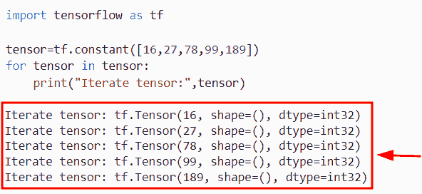
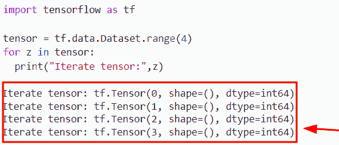
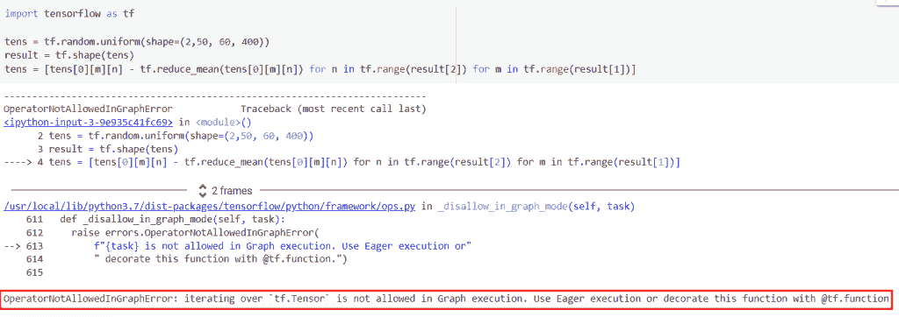
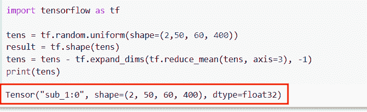
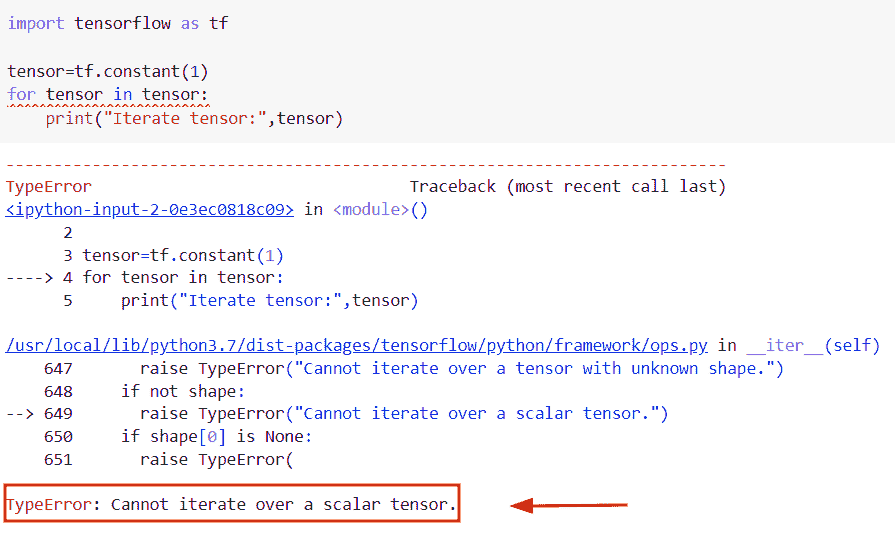
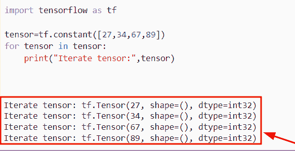

# 张量流在张量上迭代

> 原文：<https://pythonguides.com/tensorflow-iterate-over-tensor/>

[](https://sharepointsky.teachable.com/p/python-and-machine-learning-training-course)

在本 [Python 教程](https://pythonguides.com/learn-python/)中，我们将使用 Python 中的一些例子来研究**如何在 Python TensorFlow** 中迭代张量。此外，我们还将涉及这些主题。

*   张量流在张量上迭代
*   不允许在 tf.tensor 上进行 TensorFlow 迭代
*   TensorFlow 无法在标量张量上迭代

目录

[](#)

*   [Python TensorFlow 迭代张量](#Python_TensorFlow_iterate_over_Tensor "Python TensorFlow iterate over Tensor")
*   [不允许在 tf.tensor 上进行 TensorFlow 迭代](#TensorFlow_iterating_over_tftensor_is_not_allowed "TensorFlow iterating over tf.tensor is not allowed")
*   [TensorFlow 无法迭代标量张量](#TensorFlow_cannot_iterate_over_a_scaler_tensor "TensorFlow cannot iterate over a scaler tensor")

## Python TensorFlow 迭代张量

*   在本节中，我们将讨论如何在 [Python TensorFlow](https://pythonguides.com/tensorflow/) 中迭代张量。
*   要在 Python 中迭代张量，我们可以很容易地使用 for 循环方法，它将直接迭代张量。
*   迭代张量定义了我们必须打印一个新的线张量，并且它将返回张量中元素的数量。这个方法实际上会迭代张量中的每个值，并显示在屏幕上。
*   为了完成这个任务，首先，我们将使用 `tf.constant()` 函数创建一个张量。

**语法:**

下面是 Python TensorFlow 中 `tf.constant()` 函数的语法。

```py
tf.constant
           (
            value,
            dtype=None,
            shape=None,
            name='Const'
           )
```

*   它由几个参数组成
    *   **value:** 该参数表示常数值，必须是数组形状。
    *   `dtype` :默认情况下，它取 none 值，指定元素的类型。
    *   **shape:** 这是一个可选参数，表示张量的维数。
    *   **name:** 该参数表示操作的名称，默认情况下取“Const”。

**举例:**

让我们举个例子，看看如何在 Python TensorFlow 中迭代张量。

**源代码:**

```py
import tensorflow as tf

tensor=tf.constant([16,27,78,99,189])
for tensor in tensor:
    print("Iterate tensor:",tensor)
```

在上面的代码中，我们首先导入了 TensorFlow 库，然后使用 `tf.constant()` 函数来创建一个张量，在这个函数中，我们指定了整数值。

创建张量后，我们使用 for 循环方法直接迭代张量。一旦执行了这段代码，输出将显示元素张量。

下面是下面给出的代码的截图。



Python TensorFlow iterate over Tensor

**例 2:** 通过使用 `tf.data.iterator()` 方法

在 Python 中，这个函数被定义为通过使用 for 循环方法来迭代数据。

让我们看看这个例子，了解一下 Python TensorFlow 中的 `tf.data.iterator()` 函数的工作原理

**源代码:**

```py
import tensorflow as tf

tensor = tf.data.Dataset.range(4)
for z in tensor:
  print("Iterate tensor:",z)
```

在下面给定的代码中，我们使用了 `tf.data.Dataset.range()` 函数来创建张量，在该函数中，我们设置了范围值 `4` ，它指示了输出中显示的张量的迭代次数。

下面是以下给定代码的输出。



TensorFlow iterate over Tensor in Python

正如你在截图中看到的，输出显示迭代张量。

阅读: [TensorFlow Tensor to numpy](https://pythonguides.com/tensorflow-tensor-to-numpy/)

## 不允许在 tf.tensor 上进行 TensorFlow 迭代

这里我们要讨论的是错误“ **TensorFlow 迭代 tf.tensor()在 Python** 中是不允许的”。基本上，这个错误声明是因为我们使用了列表理解方法，而这个方法在图形执行中不受支持。

**举例:**

```py
import tensorflow as tf

tens = tf.random.uniform(shape=(2,50, 60, 400))
result = tf.shape(tens)
tens = [tens[0][m][n] - tf.reduce_mean(tens[0][m][n]) for n in tf.range(result[2]) for m in tf.range(result[1])]
```

在上面的代码中，我们已经导入了 TensorFlow 库，然后使用了 `tf.random.uniform()` 函数。在这个函数中，我们描述了随机形状。之后，我们使用了列表理解方法，并使用了 for 循环和 `tf.reduce_mean()` 函数。

下面是以下给定代码的执行。



TensorFlow iterating over tf.tensor is not allowed

正如您在截图中看到的，输出显示在图形执行中不允许使用 `tf.tensor()` 。

让我们来看看这个错误的解决方案。

```py
import tensorflow as tf

tens = tf.random.uniform(shape=(2,50, 60, 400))
result = tf.shape(tens)
tens = tens - tf.expand_dims(tf.reduce_mean(tens, axis=3), -1)
print(tens)
```

在上面的例子中，我们使用了 `tf.expand_dims()` 函数来代替列表理解方法，并且在这个函数中，我们分配了 `tf.reduce_mean()` 函数。一旦执行了这段代码，输出将显示张量的形状。

下面是以下给定代码的输出。



TensorFlow iterating over tf.tensor is not allowed

阅读:[模块“张量流”没有属性“会话”](https://pythonguides.com/module-tensorflow-has-no-attribute-session/)

## TensorFlow 无法迭代标量张量

在本节中，我们将讨论 Python 中的错误**“tensor flow 无法在 scaler“tensor”**上迭代 **。基本上，当我们在 `tf.constant()` 函数中使用了 scaler 值来创建张量时，就会出现这个错误声明。**

**举例:**

```py
import tensorflow as tf

tensor=tf.constant(1)
for tensor in tensor:
    print("Iterate tensor:",tensor)
```

在上面的代码中，我们导入了 TensorFlow 库，然后使用了 `tf.constant()` 函数，在这个函数中，我们将【T2 1】设置为一个标量值，然后使用 for 循环方法迭代一个张量。

下面是下面给出的代码的截图。



TensorFlow cannot iterate over a scaler tensor

正如您在屏幕截图中看到的，输出显示无法在标量张量上迭代。

让我们来看看这个错误的解决方案。

**举例:**

```py
import tensorflow as tf

tensor=tf.constant([27,34,67,89])
for tensor in tensor:
    print("Iterate tensor:",tensor) 
```

在下面给定的代码中，我们导入了 TensorFlow 库，然后使用 `tf.constant()` 函数来创建张量，在这个函数中，我们在 list 中赋值并迭代张量。

下面是以下给定代码的实现



TensorFlow cannot iterate over a scaler tensor in Python

你可能也喜欢阅读下面的 TensorFlow 教程。

*   [Python tensor flow reduce _ mean](https://pythonguides.com/python-tensorflow-reduce_mean/)
*   [张量流均方误差](https://pythonguides.com/tensorflow-mean-squared-error/)
*   [Python tensor flow reduce _ sum](https://pythonguides.com/python-tensorflow-reduce_sum/)
*   [Python TensorFlow 占位符](https://pythonguides.com/tensorflow-placeholder/)
*   [张量流均方误差](https://pythonguides.com/tensorflow-mean-squared-error/)
*   [张量流 clip_by_value](https://pythonguides.com/tensorflow-clip_by_value/)

在这个 Python 教程中，我们已经学习了**如何使用 Python 中的一些例子在 Python TensorFlow** 中迭代张量。此外，我们已经讨论了这些主题。

*   张量流在张量上迭代
*   不允许在 tf.tensor 上进行 TensorFlow 迭代
*   TensorFlow 无法在标量张量上迭代

[Bijay Kumar](https://pythonguides.com/author/fewlines4biju/)

Python 是美国最流行的语言之一。我从事 Python 工作已经有很长时间了，我在与 Tkinter、Pandas、NumPy、Turtle、Django、Matplotlib、Tensorflow、Scipy、Scikit-Learn 等各种库合作方面拥有专业知识。我有与美国、加拿大、英国、澳大利亚、新西兰等国家的各种客户合作的经验。查看我的个人资料。

[enjoysharepoint.com/](https://enjoysharepoint.com/)[](https://www.facebook.com/fewlines4biju "Facebook")[](https://www.linkedin.com/in/fewlines4biju/ "Linkedin")[](https://twitter.com/fewlines4biju "Twitter")