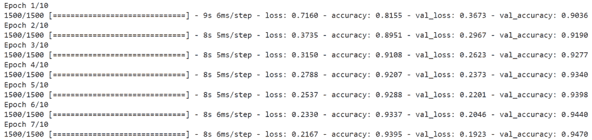
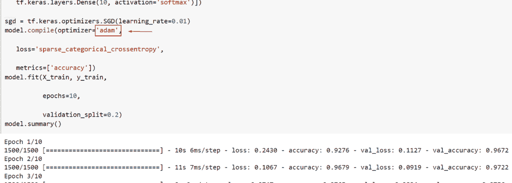
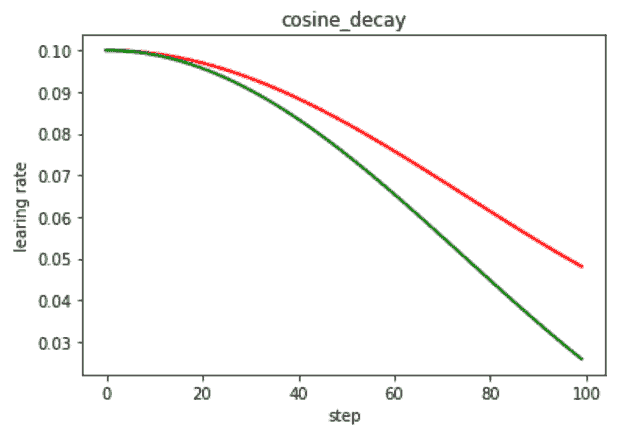
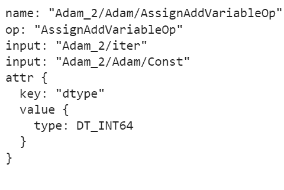
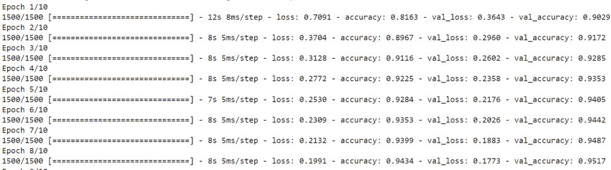

# TensorFlow 学习率计划程序

> 原文：<https://pythonguides.com/tensorflow-learning-rate-scheduler/>

[](https://sharepointsky.teachable.com/p/python-and-machine-learning-training-course)

本 Python 教程将重点介绍使用 TensorFlow 的机器学习模型的**学习率计划。**此外，我们将看一些如何在 TensorFlow 中学习学习率计划的例子。我们将讨论这些话题。

*   TensorFlow 学习率计划程序
*   TensorFlow 学习率计划程序 adam
*   TensorFlow 学习率计划程序余弦
*   TensorFlow 获取学习率
*   张量流自适应学习速率

目录

[](#)

*   [TensorFlow 学习率调度器](#TensorFlow_Learning_Rate_Scheduler "TensorFlow Learning Rate Scheduler")
*   [TensorFlow 学习率调度器 adam](#TensorFlow_learning_rate_scheduler_adam "TensorFlow learning rate scheduler adam")
*   [TensorFlow 学习率调度余弦](#TensorFlow_learning_rate_scheduler_cosine "TensorFlow learning rate scheduler cosine")
*   [TensorFlow 获取学习率](#TensorFlow_get_learning_rate "TensorFlow get learning rate ")
*   [张量流自适应学习率](#TensorFlow_adaptive_learning_rate "TensorFlow adaptive learning rate")

## TensorFlow 学习率调度器

*   在 Keras API 中，其中一个回调被称为 learning rate scheduler(tensor flow)。回调是那些基于每个单独回调的服务，在训练期间的特定点被调用。
*   每次我们训练我们的神经网络完成各自的职责时，都会调用这些回调。在我们的示例中，LearningRateScheduler 回调从我们在训练之前预先定义的 schedule 函数中接收更新后的学习率值，以及当前时期和当前学习率，并将修改后的学习率应用于优化器。
*   学习率计划的目标是在整个培训过程中按照预定义的计划降低学习率。学习率计划包括四种类型
    *   **恒定学习率**:Keras 中 SGD 优化器的默认学习率计划是恒定学习率。动量和衰减率的默认设置为零。选择合适的学习速度是困难的。Lr=0.1 这可以作为我们测试各种学习率策略的起点。
    *   **基于时间的衰减**:基于时间的衰减公式是 `lr = lr0/(1+kt)` 这里 lr 和 k 是超参数，t 是迭代次数。当衰减为零时，学习率不受此影响。当衰减被设置时，来自前一时期的学习率将减少所提供的固定量。
    *   **步长衰减**:这是一个流行的学习速率表，它指定了训练过程中的次数，其中 epoch 是当前的 epoch 数，drop rate 是学习速率每次改变时修改的量，initial lr 是初始学习速率，例如 0.01，initial lr 是初始学习速率，epochs drop 是改变学习速率的频率，例如 10 个 epoch。
    *   **指数衰减**:它有一个数学公式 lr = lr0 * e^(−kt)其中在这种情况下 lr 和 k 是 ar 超参数，t 是迭代次数。我们可以通过指定指数衰减函数并将其传递给学习率调度器来轻松执行。

示例:

```py
import tensorflow as tf 

mnist = tf.keras.datasets.mnist 

(X_train, y_train), (X_test, y_test) = mnist.load_data() 

X_train, X_test = X_train / 255.0, X_test / 255.0 

model = tf.keras.models.Sequential([ 

   tf.keras.layers.Flatten(input_shape=(28, 28)), 

   tf.keras.layers.Dense(512, activation='relu'), 

   tf.keras.layers.Dropout(0.2), 

   tf.keras.layers.Dense(10, activation='softmax')]) 

sgd = tf.keras.optimizers.SGD(learning_rate=0.01)
model.compile(optimizer='sgd',  

   loss='sparse_categorical_crossentropy', 

   metrics=['accuracy'])
model.fit(X_train, y_train, 

          epochs=10, 

          validation_split=0.2)
model.summary()
```

在这个例子中，我将使用`*TF . keras . datasets*`下的 *`mnist`* 数据集，然后我将训练和测试数据加载为(`*x _ train*`&`*y _ train*`)。因为输入特征在 0 到 255 之间。我会把它除以 255 来归一化。

之后，我将创建一个新的序列模型，其中有一个单独的图层，名为 model =`*TF . keras . models . sequential*`，因此在第一个图层中，我创建了一个展平图层，它将采用 shape (28，28)的输入图像。在第二层中，我创建了一个具有 512 个神经元的密集层，激活函数为 relu，它被 drop_out rate =0.2 的层丢弃，最终输出层创建了一个具有 10 个神经元的密集层，激活函数为 SoftMax。

现在我们将使用 *`model.summary()`* 来显示摘要。

你可以参考下面的截图。



TensorFlow Learning rate Scheduler

这就是我们如何通过 TensorFlow 在优化器 SGD 中使用学习率。

阅读:[批量归一化张量流](https://pythonguides.com/batch-normalization-tensorflow/)

## TensorFlow 学习率调度器 adam

*   在本例中，我们将在编译模型时使用“adam”优化器。
*   Adam 是一种不同的优化算法，可用于训练深度学习模型，而不是随机梯度下降。
*   Adam 创造了一种优化技术，通过结合 AdaGrad 和 RMSProp 算法的最佳特性，可以在嘈杂的情况下处理稀疏梯度。
*   Adam 的配置相当简单，默认的配置设置对大多数问题都很有效。
*   Adam 这个名字来自自适应矩估计。为了在训练期间调整网络权重，这种优化方法是随机梯度下降的进一步扩展。
*   Adam optimizer 会分别修改每个网络权重的学习率，这与 SGD 培训不同，SGD 培训保持单一的学习率。Adam 优化算法的设计者知道 AdaGrad 和 RMSProp 算法的优点，这是另外两种随机梯度下降扩展。
*   因此，Adagrad 和 RMS prop 算法的特性都被 Adam 优化器继承。Adam 使用梯度的一阶和二阶矩来调整学习率，而不是像 RMS Prop 那样只使用一阶矩(均值)。

示例:

在本例中，我们将使用“adam”优化，然后我们将使用优化。

```py
 import tensorflow as tf 

mnist = tf.keras.datasets.mnist 

(X_train, y_train), (X_test, y_test) = mnist.load_data() 

X_train, X_test = X_train / 255.0, X_test / 255.0 

model = tf.keras.models.Sequential([ 

   tf.keras.layers.Flatten(input_shape=(28, 28)), 

   tf.keras.layers.Dense(512, activation='relu'), 

   tf.keras.layers.Dropout(0.2), 

   tf.keras.layers.Dense(10, activation='softmax')]) 

sgd = tf.keras.optimizers.SGD(learning_rate=0.01)
model.compile(optimizer='adam',  

   loss='sparse_categorical_crossentropy', 

   metrics=['accuracy'])
model.fit(X_train, y_train, 

          epochs=10, 

          validation_split=0.2)
model.summary()
```

下面是下面给出的代码的截图。



TensorFlow learning rate scheduler adam

正如你在截图中看到的，我们通过 TensorFlow 使用了“sgd”优化器。

阅读:[张量流自定义损失函数](https://pythonguides.com/tensorflow-custom-loss-function/)

## TensorFlow 学习率调度余弦

*   这里我们将通过 TensorFlow 在学习率调度器中使用余弦优化器。
*   这是一种学习率时间表，其效果是以高学习率开始，快速下降到一个较低的数字，然后又快速上升。

**语法**:

下面是`TF . compat . v1 . train . cosine _ decay()`函数的语法

```py
tf.keras.optimizers.schedules.CosineDecay(
                                          initial_learning_rate,
                                          decay_steps, 
                                          alpha=0.0,
                                          name=None
                                         )
```

*   它由几个参数组成
    *   `initial_learning_rate` :它是一个定标器浮点 64 或浮点 32，它定义初始学习速率
    *   `decay_steps` :指定了衰减的步数，是一个 scaler int 32。
    *   `alpha` :默认情况下，取值为 0.0，它会检查最小学习率值始终是初始 learning_rate 的一个分数的情况。
    *   **名称**:定义操作的名称，默认为无。

示例:

```py
import matplotlib.pyplot as plt
import tensorflow as tf
tf.compat.v1.disable_eager_execution()
empty_val = []
second_empty_val = []
number_of_iteration = 100

with tf.compat.v1.Session() as sess:
    sess.run(tf.compat.v1.global_variables_initializer())
    for global_step in range(number_of_iteration):

        new_rate_1 = tf.compat.v1.train.cosine_decay(
            learning_rate=0.1, global_step=global_step, decay_steps=150,
            alpha=0.0)

        new_learing_rate_2 = tf.compat.v1.train.cosine_decay(
            learning_rate=0.1, global_step=global_step, decay_steps=150,
            alpha=0.3)
        lr1 = sess.run([new_rate_1])
        lr2 = sess.run([new_learing_rate_2 ])

        empty_val.append(lr1[0])
        second_empty_val.append(lr2[0])

x = range(number_of_iteration)
fig = plt.figure()
ax = fig.add_subplot(111)
plt.plot(x, second_empty_val,'r-', linewidth=2)
plt.plot(x, empty_val,'g-', linewidth=2)
plt.title('cosine_decay')
ax.set_xlabel('step')
ax.set_ylabel('learing rate')
plt.show()
```

在下面给定的代码中，我们导入了 [TensorFlow](https://pythonguides.com/tensorflow/) 和 [matplotlib 库](https://pythonguides.com/what-is-matplotlib/)，然后使用了`*TF . compat . v1 . train . cosine _ decay()*`函数，在这个函数中，我们指定了学习速率和衰减步长。

你可以参考下面的截图。



TensorFlow learning rate scheduler cosine

这就是我们如何通过 TensorFlow 使用余弦速率调度程序。

阅读: [TensorFlow 全球平均池](https://pythonguides.com/tensorflow-global-average-pooling/)

## TensorFlow 获取学习率

*   在本节中，我们将学习如何使用 TensorFlow 获得学习率。
*   为了执行这个特定的任务，我们将使用**的概念*TF . keras . optimizer . Adam()***函数。
*   在这个函数中，我们将学习率设置为 0.1，并且`*learning rate scheduler*`回调从我们在训练之前预先定义的调度函数接收更新的学习率值。

**语法**:

让我们看看语法，了解一下`TF . keras . optimizer . Adam()`函数的工作原理。

```py
tf.keras.optimizers.Adam(
    learning_rate=0.001,
    beta_1=0.9,
    beta_2=0.999,
    epsilon=1e-07,
    amsgrad=False,
    name='Adam',
    **kwargs
)
```

*   它由几个参数组成。
    *   `learning_rate` :默认情况下，它取值为 0.001，这是一个不带参数并返回实际值的功能。
    *   `beta_1` :要使用的实际值、浮点值、常量浮点张量或不接受参数的可调用函数。第一时刻的估计指数下降率。默认情况下，0.9。
    *   `beta_2` :要使用的实际值、浮点值、常量浮点张量或不接受参数的可调用函数。二阶矩的估计指数下降率。默认情况下，0.999。
    *   `epsilon` :数字稳定性的名义常数，默认取 1e-07。
    *   `amsgrad` :是关于 Adam 和 beyond 收敛的布尔值。

**举例**:

```py
import tensorflow as tf

new_optimize_val = tf.keras.optimizers.Adam(0.1)
new_var_val = tf.Variable(20.0)
new_loss_val = lambda: (new_var_val ** 2)/2.0   
step_count = new_optimize_val.minimize(new_loss_val, [new_var_val])

print(step_count)
```

下面是以下代码的截图



TensorFlow get la earning rate

如你所见，我们将获得所有关于 adam optimizer 的信息。

阅读:[二元交叉熵张量流](https://pythonguides.com/binary-cross-entropy-tensorflow/)

## 张量流自适应学习率

*   Adagrad、Adadelta、RMSprop 和 Adam 是自适应梯度下降算法的示例，它们提供了传统 SGD 的替代方案。这些每参数学习率方法提供了一种启发式方法，而不需要耗时的手动超参数。
*   此外，Keras 有几个基本的随机梯度下降扩展，支持可变的学习率。经常需要小的配置，因为每种技术修改学习率，通常每个模型权重一个学习率。
*   它允许训练算法跟踪模型的性能，并自动更改学习率以获得最佳性能。

示例:

让我们举个例子，了解一下自适应学习率的工作原理。

```py
import tensorflow as tf 

mnist = tf.keras.datasets.mnist 

(X_train, y_train), (X_test, y_test) = mnist.load_data() 

X_train, X_test = X_train / 255.0, X_test / 255.0 

model = tf.keras.models.Sequential([ 

   tf.keras.layers.Flatten(input_shape=(28, 28)), 

   tf.keras.layers.Dense(512, activation='relu'), 

   tf.keras.layers.Dropout(0.2), 

   tf.keras.layers.Dense(10, activation='softmax')]) 

sgd = tf.keras.optimizers.SGD(learning_rate=0.01)
model.compile(optimizer='sgd',  

   loss='sparse_categorical_crossentropy', 

   metrics=['accuracy'])
model.fit(X_train, y_train, 

          epochs=10, 

          validation_split=0.2)
model.summary()
```

你可以参考下面的截图



TensorFlow adaptive learning rate

你可能也喜欢阅读下面的 TensorFlow 教程。

*   [张量流自定义损失函数](https://pythonguides.com/tensorflow-custom-loss-function/)
*   [tensor flow next _ batch+Examples](https://pythonguides.com/tensorflow-next_batch/)
*   [TensorFlow 全球平均池](https://pythonguides.com/tensorflow-global-average-pooling/)
*   [Tensorflow 嵌入 _ 查找](https://pythonguides.com/tensorflow-embedding_lookup/)
*   [将字典转换为张量张量流](https://pythonguides.com/how-to-convert-dictionary-to-tensor-tensorflow/)
*   [模块“tensorflow”没有属性“optimizer”](https://pythonguides.com/module-tensorflow-has-no-attribute-optimizers/)

在本 Python 教程中，我们重点介绍了使用 TensorFlow 的机器学习模型的**学习率计划。**此外，我们将看一些如何在 TensorFlow 中学习学习率计划的例子。我们已经讨论了这些主题。

*   TensorFlow 学习率计划程序
*   TensorFlow 学习率计划程序 adam
*   TensorFlow 学习率计划程序余弦
*   TensorFlow 获取学习率
*   张量流自适应学习速率

[Bijay Kumar](https://pythonguides.com/author/fewlines4biju/)

Python 是美国最流行的语言之一。我从事 Python 工作已经有很长时间了，我在与 Tkinter、Pandas、NumPy、Turtle、Django、Matplotlib、Tensorflow、Scipy、Scikit-Learn 等各种库合作方面拥有专业知识。我有与美国、加拿大、英国、澳大利亚、新西兰等国家的各种客户合作的经验。查看我的个人资料。

[enjoysharepoint.com/](https://enjoysharepoint.com/)[](https://www.facebook.com/fewlines4biju "Facebook")[](https://www.linkedin.com/in/fewlines4biju/ "Linkedin")[](https://twitter.com/fewlines4biju "Twitter")