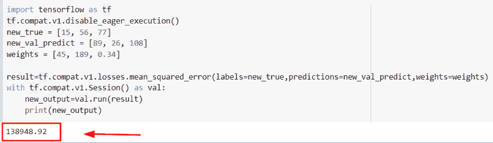
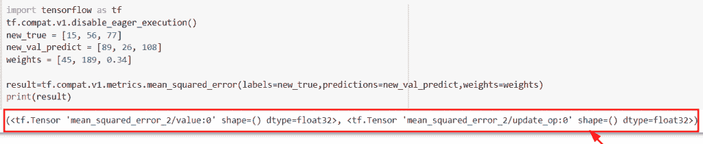
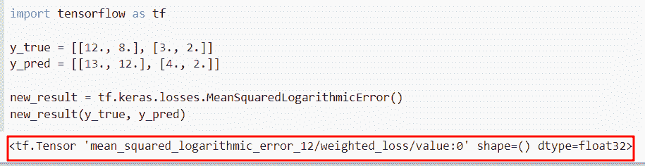
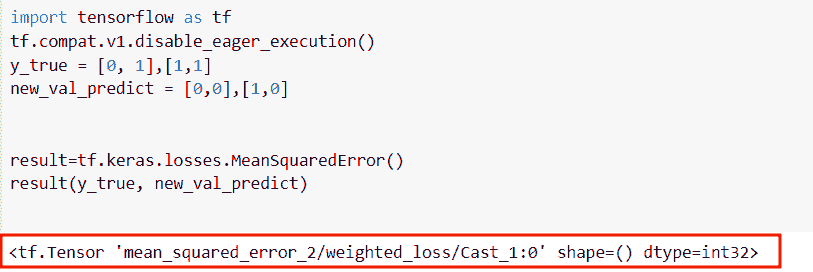
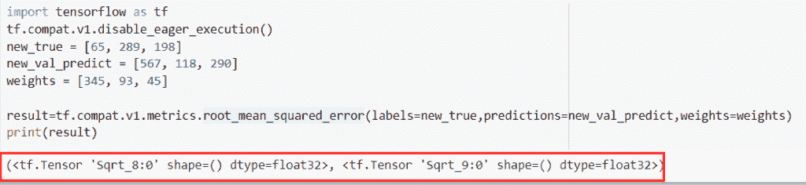
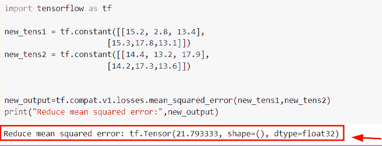
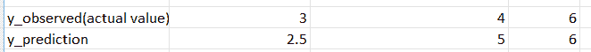
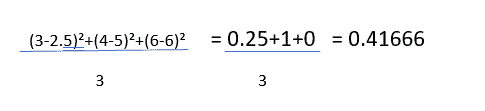
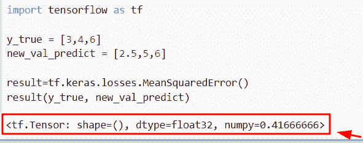
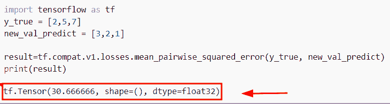

# 张量流均方误差

> 原文：<https://pythonguides.com/tensorflow-mean-squared-error/>

[](https://sharepointsky.teachable.com/p/python-and-machine-learning-training-course)

在本 [Python 教程](https://pythonguides.com/learn-python/)中，我们将学习**如何在 Python** `TensorFlow` 中求 **均方误差。此外，我们将讨论以下主题。**

*   张量流均方误差
*   张量流矩阵均方误差
*   张量流均方对数误差
*   张量流加权均方误差
*   张量流均方根误差
*   张量流减少均方误差
*   张量流计算均方误差
*   平均成对平方误差张量流

目录

[](#)

*   [张量流均方误差](#TensorFlow_mean_squared_error "TensorFlow mean squared error")
*   [张量流矩阵均方误差](#TensorFlow_metrices_mean_squared_error "TensorFlow metrices mean squared error")
*   [张量流均方对数误差](#TensorFlow_mean_squared_logarithmic_error "TensorFlow mean squared logarithmic error")
*   [张量流加权均方差](#TensorFlow_weighted_mean_squared_error "TensorFlow weighted mean squared error")
*   [张量流均方根误差](#TensorFlow_root_mean_squared_error "TensorFlow root mean squared error")
*   [张量流减少均方误差](#TensorFlow_reduce_mean_squared_error "TensorFlow reduce mean squared error")
*   [张量流计算均方误差](#TensorFlow_calculate_mean_squared_error "TensorFlow calculate mean squared error")
*   [平均成对平方误差张量流](#Mean_pairwise_squared_error_tensorflow "Mean pairwise squared error tensorflow")

## 张量流均方误差

*   在本节中，我们将讨论如何在 [Python TensorFlow](https://pythonguides.com/tensorflow/) 中找到均方误差。
*   为了执行这个特定的任务，我们将使用`TF . compat . v1 . losses . mean _ squared _ error()`函数，该函数用于插入给定标签和预测的平方和。

**语法:**

我们先来看看语法，了解一下`TF . compat . v1 . losses . mean _ squared _ error()`函数在 Python TensorFlow 中的工作原理。

```py
tf.compat.v1.losses.mean_squared_error
                                      (
                                       labels,
                                       prediction,
                                       weights=1.0,
                                       scope=None,
                                       loss_collection=tf.graphkeys.Losses,
                                       reduction=Reduction.SUM_BY_NONZERO_WEIGHTS
                                      )
```

*   它由几个参数组成
    *   **标签:**该参数表示输出张量，类似于预测参数。
    *   **预测:**该参数指定输出的预测。
    *   **weights:** 默认取 `1.0` 值，指定 rank 将为 `0` 或类似 rank 作为标签，也是可选参数。
    *   **scope:** 缺省情况下，取 none 值，表示我们可以在损失函数中执行的操作的范围。
    *   **loss_collection:** 该参数指定了我们要插入到损失函数中的集合，默认情况下它采用`TF . graph . keys . loss()`。

**举例:**

我们举个例子，检查一下如何在 Python TensorFlow 中求均方误差。

**源代码:**

```py
import tensorflow as tf
tf.compat.v1.disable_eager_execution()
new_true = [15, 56, 77]
new_val_predict = [89, 26, 108]
weights = [45, 189, 0.34]

result=tf.compat.v1.losses.mean_squared_error(labels=new_true,predictions=new_val_predict,weights=weights)
with tf.compat.v1.Session() as val:
    new_output=val.run(result)
    print(new_output)
```

在上面的代码中，我们导入了 TensorFlow 库，然后初始化了预测和权重值。

之后，我们使用了`TF . compat . v1 . losses . mean _ squared _ error()`函数，在这个函数中，我们将预测和权重作为一个参数。一旦执行了这段代码，输出将显示均方误差。

下面是以下给定代码的实现。



TensorFlow mean squared error

阅读: [TensorFlow Tensor to numpy](https://pythonguides.com/tensorflow-tensor-to-numpy/)

## 张量流矩阵均方误差

*   在本节目中，我们将讨论如何在 Python TensorFlow 中找到度量均方误差。
*   为了执行此特定任务，我们将使用`TF . compat . v1 . metrices . mean _ squared _ error()`函数，此函数用于计算给定预测和标签之间的均方误差。在此示例中，我们将标签视为**‘new _ true’**变量，预测视为**‘new _ val _ predict’**。

**语法:**

下面是`TF . compat . v1 . metrices . mean _ squared _ error()`函数的语法。

```py
tf.compat.v1.metrics.mean_squared_error
                                       (
                                        labels,
                                        predictions,
                                        weights=None,
                                        metrices_collections=None,
                                        update_collections=None,
                                        name=None
                                       )
```

*   它由几个参数组成
    *   **标签:**该参数表示与我们在预测中提到的形状相似的张量。
    *   **预测:**该参数指定了张量的形状。
    *   **weights:** 默认取值为 none，可选参数，秩值为 `0` 。
    *   **度量集合:**这是一个可选的集合列表，我们必须添加一个均方误差。
    *   **name:** 默认情况下，取 none 值，是可选的作用域名称。

**举例:**

让我们举个例子，看看如何在 Python 中找到 metrices 均方误差。

**源代码:**

```py
import tensorflow as tf
tf.compat.v1.disable_eager_execution()
new_true = [15, 56, 77]
new_val_predict = [89, 26, 108]

result=tf.compat.v1.metrics.mean_squared_error(labels=new_true,predictions=new_val_predict)
print(result)
```

在创建标签和预测值之后，我们使用了`TF . compat . v1 . metrices . mean _ squared _ error()`函数，在这个函数中，我们将标签和预测作为一个参数传递。

下面是下面给出的代码的截图。



TensorFlow metrices mean squared error

阅读:[张量流得到形状](https://pythonguides.com/tensorflow-get-shape/)

## 张量流均方对数误差

*   这里我们要讨论的是如何在 Python TensorFlow 中求均方对数误差。
*   为了完成这项任务，我们将使用 **tf。keras . loss . meansqualdlogithmic()**函数，该函数用于计算 `y_pred` 和 `y_true` 值之间的均方对数误差差。

**语法:**

下面是 **tf 的语法。Python TensorFlow 中的 keras . loss . mean squared 对数错误**。

```py
tf.keras.losses.MeanSquaredLogarithmicError
                                           (
                                            reduction=losses_utils.ReductionV2.AUTO,
                                            name='mean_squared_logarithmic_error'
                                           )
```

*   它由几个参数组成
    *   **减少:**默认情况下，它采用**自动**值，该值指定减少选项并决定 contxt 的使用。
    *   **名称:**该参数表示操作的名称。

**举例:**

我们举个例子，检查一下如何在 Python TensorFlow 中求均方对数误差。

**源代码:**

```py
import tensorflow as tf

y_true = [[12., 8.], [3., 2.]]
y_pred = [[13., 12.], [4., 2.]]

new_result = tf.keras.losses.MeanSquaredLogarithmicError()
new_result(y_true, y_pred)
```

在下面的代码中，我们导入了 TensorFlow 库，然后声明了两个变量“y_true”和“y_pred”。之后，我们使用了`TF . keras . loss . meansqualdlogarithmicerror()`，在这个函数中，我们分配了这些给定值。

下面是下面给出的代码的截图。



TensorFlow mean squared logarithmic error

阅读:[Python tensor flow reduce _ sum](https://pythonguides.com/python-tensorflow-reduce_sum/)

## 张量流加权均方差

*   在本节中，我们将讨论如何在 Python TensorFlow 中计算加权均方误差。
*   为了执行这一特定任务，我们将使用`TF . keras . loss . meansquaderror()`函数，该函数将帮助用户生成预测值和标签值之间的均方误差。
*   在本例中，我们提到了列表' **y_true '和' new_val_predict'** 形式的标签和预测。

**语法:**

下面是 **tf 的语法。Python TensorFlow 中的 keras . loss . meansquadererror**

```py
tf.keras.losses.MeanSquaredError
                               (
                                reduction=losses_utils.ReductionV2.AUTO,
                                name='mean_squared_error'
                               )
```

**举例:**

```py
import tensorflow as tf
tf.compat.v1.disable_eager_execution()
y_true = [0, 1],[1,1]
new_val_predict = [0,0],[1,0]

result=tf.keras.losses.MeanSquaredError()
result(y_true, new_val_predict)
```

创建变量后，我们使用了 **tf。keras . losses . mean squarederror()**函数，在该函数中，我们指定了**‘y _ true’和‘new _ val _ predict’**值。

你可以参考下面的截图。



TensorFlow weighted mean squared error

阅读:[Python tensor flow reduce _ mean](https://pythonguides.com/python-tensorflow-reduce_mean/)

## 张量流均方根误差

*   在本节中，我们将讨论如何在 Python TensorFlow 中计算均方根误差。
*   为了执行此特定任务，我们将使用`TF . compat . v1 . metrices . root _ mean _ squared _ error()`函数，此函数用于将均方根误差生成预测和标签参数。

税:

我们先来看看语法，了解一下`TF . compat . v1 . metrices . root _ mean _ squared _ error()`函数在 Python TensorFlow 中的工作原理。

```py
tf.compat.v1.metrices.root_mean_squared_error
                                            (
                                             labels,
                                             predictions,
                                             weights=None,
                                             metrices_collection=None
                                             update_collections=None,
                                             name=None
                                            )
```

*   它由几个参数组成
    *   **标签:**该参数表示我们在预测中提到的相似形状的张量。
    *   **预测:**该参数指定了张量的形状。
    *   **权重:**默认情况下不取值。

**举例:**

我们举个例子，检查一下如何在 Python TensorFlow 中求均方根误差。

**源代码:**

```py
import tensorflow as tf
tf.compat.v1.disable_eager_execution()
new_true = [65, 289, 198]
new_val_predict = [567, 118, 290]
weights = [345, 93, 45]

result=tf.compat.v1.metrics.root_mean_squared_error(labels=new_true,predictions=new_val_predict,weights=weights)
print(result)
```

下面是下面给出的代码的截图。



TensorFlow root mean squared error

阅读: [Python TensorFlow 随机均匀](https://pythonguides.com/tensorflow-random-uniform/)

## 张量流减少均方误差

*   在本节中，我们将讨论如何减少 Python TensorFlow 中的均方误差。
*   在本例中，我们使用了`TF . compat . v1 . losses . mean _ squared _ error()`函数，并在该函数中传递了**张量 1 和张量 2** 的值。
*   一旦执行了这段代码，输出将显示给定张量的平均值。

**举例:**

让我们举个例子，检查如何在 Python TensorFlow 中减少均方误差。

**源代码:**

```py
import tensorflow as tf

new_tens1 = tf.constant([[15.2, 2.8, 13.4],
                      [15.3,17.8,13.1]])
new_tens2 = tf.constant([[14.4, 13.2, 17.9],
                      [14.2,17.3,13.6]])

new_output=tf.compat.v1.losses.mean_squared_error(new_tens1,new_tens2)
print("Reduce mean squared error:",new_output)
```

下面是下面给出的代码的截图。



TensorFlow reduce mean squared error

阅读: [Python TensorFlow one_hot](https://pythonguides.com/tensorflow-one_hot/)

## 张量流计算均方误差

这里我们要讨论如何在 Python TensorFlow 中计算均方误差。

均方误差用于计算给定变量的**估计值**和**预测值**之间的差值。

**均方误差公式:**

```py
MSE = (1/n)∑i=1n(Yi-Yi)² 
```

**定义变量:**

*   ∑:求和表示估计误差的所有已知值的相加。
*   n:这个变量指定样本大小。
*   易:实际的或者我们可以说是变量的观测值。

现在我们将取一些随机值，并测量每对实际值和预测值之间的差异。接下来，我们将平方这些差值，然后获得平均值。

**举例:**

让我们举个例子，用数学的方法计算均方误差。

假设我们有以下一组数字



random values for MSE

现在我们将计算**均方误差**



MSE calculation

现在我们将使用张量流方法计算均方误差

**源代码:**

```py
import tensorflow as tf

y_true = [3,4,6]
new_val_predict = [2.5,5,6]

result=tf.keras.losses.MeanSquaredError()
result(y_true, new_val_predict)
```

下面是以下给定代码的实现



Tensorflow calculate mean squared error

阅读:[模块“张量流”没有属性“会话”](https://pythonguides.com/module-tensorflow-has-no-attribute-session/)

## 平均成对平方误差张量流

*   在本节中，我们将讨论如何在 Python 中找到平均成对平方误差张量流。
*   为此，我们将使用`TF . compat . v1 . losses . mean _ pairwise _ squared _ error()`函数，该函数用于在 Python TensorFlow 中插入一个成对平方误差。

**语法:**

我们先来看看语法，了解一下`TF . compat . v1 . losses . mean _ pairwise _ squared _ error()`函数的工作原理。

```py
tf.compat.v1.losses.mean_pairwise_squared_error
                                               (
                                                labels,
                                                predictions,
                                                weights=1.0,
                                                scope=None,
                                                loss_collection=tf.GraphKeys.LOSSES
                                               )
```

**举例:**

```py
import tensorflow as tf
y_true = [2,5,7]
new_val_predict = [3,2,1]

result=tf.compat.v1.losses.mean_pairwise_squared_error(y_true, new_val_predict)
print(result)
```

下面是以下给定代码的执行过程



mean pairwise squared error TensorFlow

还有，多看看一些 TensorFlow 教程。

*   [TensorFlow 获取变量+示例](https://pythonguides.com/tensorflow-get-variable/)
*   [TensorFlow 全连通层](https://pythonguides.com/tensorflow-fully-connected-layer/)
*   [模块' TensorFlow '没有属性' get_default_graph'](https://pythonguides.com/module-tensorflow-has-no-attribute-get_default_graph/)

所以，在这个 Python 教程中，我们学习了**如何在 Python** `TensorFlow` 中求 **均方误差。此外，我们还讨论了以下主题。**

*   张量流均方误差
*   张量流度规均方误差
*   张量流均方对数误差
*   张量流加权均方误差
*   张量流均方根误差
*   张量流减少均方误差
*   张量流计算均方误差
*   平均成对平方误差张量流

[Bijay Kumar](https://pythonguides.com/author/fewlines4biju/)

Python 是美国最流行的语言之一。我从事 Python 工作已经有很长时间了，我在与 Tkinter、Pandas、NumPy、Turtle、Django、Matplotlib、Tensorflow、Scipy、Scikit-Learn 等各种库合作方面拥有专业知识。我有与美国、加拿大、英国、澳大利亚、新西兰等国家的各种客户合作的经验。查看我的个人资料。

[enjoysharepoint.com/](https://enjoysharepoint.com/)[](https://www.facebook.com/fewlines4biju "Facebook")[](https://www.linkedin.com/in/fewlines4biju/ "Linkedin")[](https://twitter.com/fewlines4biju "Twitter")