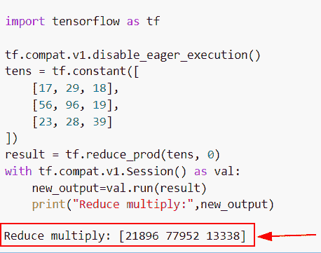

# 张量流乘法——有用指南

> 原文：<https://pythonguides.com/tensorflow-multiplication/>

[](https://sharepointsky.teachable.com/p/python-and-machine-learning-training-course)

在本 [Python 教程](https://pythonguides.com/learn-python/)中，我们将学习**如何**得到 Python TensorFlow 中张量的乘法。此外，我们将涵盖以下主题。

*   tensorflow 乘法
*   张量流倍增层
*   张量流乘法矩阵
*   张量流乘法运算
*   张量流乘标量张量
*   沿轴张量流倍增
*   张量流用向量乘矩阵
*   张量流乘以整型和浮点型
*   张量流乘以不同的形状
*   张量流多重权重
*   张量流乘元素方式
*   张量流逐行乘法
*   张量流减少倍数
*   TensorFlow multiply 3d tensor
*   张量流乘张量列表
*   TensorFlow keras multiply layer
*   矩阵乘法张量流与 numpy

目录

[](#)

*   [张量低乘法](#TensorFlow_multiplication "TensorFlow multiplication")
*   [张量流倍增层](#TensorFlow_multiplication_layer "TensorFlow multiplication layer")
*   [张量流乘法矩阵](#TensorFlow_multiplication_matrix "TensorFlow multiplication matrix")
*   [张量流乘法运算](#TensorFlow_multiplication_operation "TensorFlow multiplication operation")
*   [张量流乘张量乘标量](#TensorFlow_multiply_tensor_by_scaler "TensorFlow multiply tensor by scaler")
*   [张量流沿轴倍增](#TensorFlow_multiply_along_axis "TensorFlow multiply along axis")
*   [张量流乘矩阵乘向量](#TensorFlow_multiply_matrix_by_vector "TensorFlow multiply matrix by vector")
*   [TensorFlow 乘 int 和 float](#TensorFlow_multiply_int_and_float "TensorFlow multiply int and float")
*   [张量流乘以不同的形状](#TensorFlow_multiply_different_shapes "TensorFlow multiply different shapes")
*   [张量流倍增权重](#TensorFlow_multiply_weights "TensorFlow multiply weights")
*   [张量流乘元素方式](#TensorFlow_multiply_element_wise "TensorFlow multiply element wise")
*   [张量流逐行乘法](#TensorFlow_row_wise_multiplication "TensorFlow row wise multiplication")
*   [张量流减少乘](#TensorFlow_reduce_multiply "TensorFlow reduce multiply")
*   [张量流乘 3d 张量](#TensorFlow_multiply_3d_tensor "TensorFlow multiply 3d tensor")
*   [张量流乘张量列表](#TensorFlow_multiply_list_of_tensors "TensorFlow multiply list of tensors")
*   [TensorFlow keras multiply layer](#TensorFlow_keras_multiply_layer "TensorFlow keras multiply layer")
*   [矩阵乘法 tensorflow vs numpy](#Matrix_multiplication_tensorflow_vs_numpy "Matrix multiplication tensorflow vs numpy")

## 张量低乘法

*   本节我们将讨论如何在 [Python TensorFlow](https://pythonguides.com/tensorflow/) 中得到张量的乘法。
*   为了执行这个特定的任务，我们将使用 `tf.math.multiply()` 函数，这个函数将帮助用户以 `x*y` 的形式乘以元素值。
*   如果你想建立机器学习模型，乘法将很容易帮助你，因为当我们将输入数据作为图像或声音时，它将以张量的形式表示。

**语法:**

我们先来看看语法，了解一下 `tf.math.multiply()` 函数在 Python TensorFlow 中的工作原理。

```py
tf.math.multiply
                (
                 x,
                 y,
                 name=None
                )
```

*   它由几个参数组成。
    *   **x:** 该参数表示输入张量，必须是整数和浮点数据类型。
    *   **y:** 该参数表示输入张量，必须是整数和浮点数据类型。
    *   **name:** 默认情况下，它不取值，并指定操作的名称。

示例:

我们举个例子，查一下**如何在 Python TensorFlow 中得到张量的乘法。**

**源代码:**

```py
import tensorflow as tf
tf.compat.v1.disable_eager_execution()

tens1 = tf.constant(189,dtype="int32",name="tens1")
tens2 = tf.constant(78,dtype="int32",name="tens2")
result= tf.math.multiply(tens1,tens2)
with tf.compat.v1.Session() as val:
    new_output=val.run(result)
    print("Multiplication of two tensors:",new_output)
```

在上面的代码中，我们导入了 TensorFlow 库，然后使用 `tf.constant()` 函数创建了张量，在这个函数中，我们将值和数据类型指定为参数。

之后，我们使用 `tf.math.multiply()` 方法进行运算，这个函数将返回给定张量的乘积。

下面是下面给出的代码的截图。


TensorFlow multiplication

另外，阅读:[张量流均方误差](https://pythonguides.com/tensorflow-mean-squared-error/)

## 张量流倍增层

*   在这个例子中，我们将在 Python TensorFlow 中增加张量层。
*   为了执行这个特殊的任务，我们将使用 **tf。Keras.layers.Multiply()** 函数这个函数会很容易地将输入张量列表中的层相乘，并且输入张量必须是相同的形状。

**语法:**

让我们看看语法，了解一下 **tf 的工作原理。Python TensorFlow 中的 Keras.layers.Multiply()** 函数。

```py
tf.keras.layers.Multiply
                       (
                        **kwargs
                       )
```

**注意:**这个方法只接受一个参数，即 `**` ，它总是返回一个张量。

**举例:**

我们举个例子，检查一下**如何在 Python TensorFlow 中实现张量的层层相乘。**

**源代码:**

```py
import tensorflow as tf
import numpy as np

tf.compat.v1.disable_eager_execution()

result=tf.keras.layers.Multiply()([np.arange(6).reshape(6, 1),
                            np.arange(6, 12).reshape(6, 1)])
with tf.compat.v1.Session() as val:
    new_output=val.run(result)
    print("Multiplication of two layers tensors:",new_output)
```

在下面的代码中，我们导入了 TensorFlow 和 NumPy 库，然后使用`TF . compat . v1 . disable _ eager _ execution()`函数创建了一个会话。

之后，我们已经使用了 **tf。在这个函数中，我们将 `np.arange()` 函数作为参数传递。**

下面是以下给定代码的实现


TensorFlow multiplication layer

阅读: [Python TensorFlow 占位符](https://pythonguides.com/tensorflow-placeholder/)

## 张量流乘法矩阵

*   在本节中，我们将讨论如何在 Python TensorFlow 中找到乘法矩阵。
*   为了完成这项任务，我们将使用 `tf.matmul()` 函数，该函数将帮助用户将给定输入的矩阵与另一个矩阵 `(x*y)` 相乘。简单来说，我们可以说这个函数基本上用于点积矩阵。

**语法:**

下面是 Python TensorFlow 中 `tf.matmul()` 函数的语法

```py
tf.matmul
         (
          a,
          b,
          transpose_a=False,
          transpose_b=False,
          adjoint_a=False,
          adjoint_b=False,
          a_is_sparse=False,
          b_is_sparse=False,
          name=None
         )
```

**举例:**

下面举个例子，如何在 Python TensorFlow 中求乘法矩阵。

**源代码:**

```py
import tensorflow as tf
import numpy as np

new_arrays = np.array([(25,78,18),(99,27,18),(45,28,99)],dtype = 'int32')
new_arr2 = np.array([(14,18,16),(45,29,18),(24,19,55)],dtype = 'int32')
new_tens1 = tf.constant(new_arrays)
new_tens2 = tf.constant(new_arr2)
result = tf.matmul(new_tens1, new_tens2)
print((result))
```

在下面给定的代码中，我们导入了 TensorFlow 和 NumPy 库，然后通过使用 `np.array()` 函数创建了一个 NumPy 数组，并在该函数中分配了整数值。

之后，我们使用了 `tf.constant()` 函数来创建张量，在这个函数中，我们为数组赋值。一旦执行了这段代码，输出将显示乘法矩阵。

下面是以下给定代码的执行过程


TensorFlow multiplication matrix

阅读: [Tensorflow 迭代张量](https://pythonguides.com/tensorflow-iterate-over-tensor/)

## 张量流乘法运算

*   在本节中，我们将讨论如何使用 `*` 运算符函数对 Python TensorFlow 中的张量进行乘法运算。
*   在这个例子中，我们将使用 `tf.constant()` 函数来创建张量，然后我们将使用 `*` 运算符来创建乘法张量。

**举例:**

```py
import tensorflow as tf
tf.compat.v1.disable_eager_execution()

tens1 = tf.constant([16,27,98])
tens2 = tf.constant([78,178,289])
result= tens1*tens2
with tf.compat.v1.Session() as val:
    new_output=val.run(result)
    print("Multiplication of two tensors:",new_output)
```

你可以参考下面的截图


TensorFlow multiplication operation

阅读: [Python TensorFlow 截断法线](https://pythonguides.com/tensorflow-truncated-normal/)

## 张量流乘张量乘标量

*   在本节中，我们将讨论如何在 Python TensorFlow 中将张量乘以 scaler。
*   为了完成这个任务，我们将使用 `tf.multiply()` 函数，这个函数将帮助用户用标量乘张量。简单地说，scaler 是一个单值。

**语法:**

下面是 Python TensorFlow 中 `tf.multiply()` 函数的语法

```py
tf.math.multiply
                (
                 x,
                 y,
                 name=None
                )
```

**举例:**

我们举个例子，检查一下**如何在 Python TensorFlow** 中用 scaler 乘以张量。

**源代码:**

```py
import tensorflow as tf
tf.compat.v1.disable_eager_execution()

input_tensor = tf.constant([[17, 37], [89, 45]])
result = tf.multiply(input_tensor, 67)

with tf.compat.v1.Session() as val:
    new_output=val.run(result)
    print("Multiplication of tensor by scaler:",new_output)
```

下面是以下代码的截图


TensorFlow multiply tensor by scaler

阅读:[将列表转换为张量张量流](https://pythonguides.com/convert-list-to-tensor-tensorflow/)

## 张量流沿轴倍增

*   在本节中，我们将讨论如何在 Python TensorFlow 中沿轴乘以张量。
*   为了完成这个任务，我们将使用 `tf.math.multiply()` 函数，这个函数用于获得乘法。

**举例:**

```py
import tensorflow as tf
tf.compat.v1.disable_eager_execution()

tens1 = tf.constant([12,34,56])
tens2 = tf.constant([83,24,67])
result= tf.math.multiply(tens1,tens2)
with tf.compat.v1.Session() as val:
    new_output=val.run(result)
    print("Multiplication of two tensors:",new_output)
```

下面是以下代码的截图


TensorFlow multiply along an axis

阅读: [Python TensorFlow one_hot](https://pythonguides.com/tensorflow-one_hot/)

## 张量流乘矩阵乘向量

*   在本节中，我们将讨论如何在 Python TensorFlow 中将矩阵乘以一个向量。
*   为了完成这项任务，首先，我们将讨论 Python 中的矢量。向量可以定义为一维数组。为了创建一个向量，我们将使用 `numpy.array()` 函数。
*   在这个例子中，我们将在 Python TensorFlow 中将矩阵乘以一个向量。

**举例:**

```py
import tensorflow as tf
import numpy as np

tf.compat.v1.disable_eager_execution()
#matrix
new_matrix= np.array([[1,2,3,4],
                       [62,34,5,6]])
tens1 = tf.constant(new_matrix)
new_vector = np.array([83,24,67,5])
# vector array
tens2=tf.constant(new_vector)
result= tf.math.multiply(tens1,tens2)
with tf.compat.v1.Session() as val:
    new_output=val.run(result)
    print("Multiplication of two tensors:",new_output)
```

下面是以下给定代码的实现。


TensorFlow multiply matrix by a vector

阅读:[Python tensor flow expand _ dims](https://pythonguides.com/tensorflow-expand_dims/)

## TensorFlow 乘 int 和 float

*   在本节中，我们将讨论如何在 Python TensorFlow 中将整数和浮点数据类型值相乘。
*   为了完成这个任务，首先，我们将创建一个包含整数值的数组，并在函数 `tf.constant()` 中指定一个数组作为参数。该函数指定张量的创建。
*   接下来，我们将创建另一个具有浮点数据类型的数组，并在 `tf.constant()` 函数中指定一个数组作为参数，然后我们将使用 `tf.compat.v1.Session()` 函数创建会话。

**举例:**

我们举个例子，检查一下**如何在 Python TensorFlow** 中把整数和浮点数据类型值相乘。

**源代码:**

```py
import tensorflow as tf
import numpy as np

tf.compat.v1.disable_eager_execution()
#matrix
new_matrix= np.array([[1,2,3,4],
                       [62,34,5,6]])
tens1 = tf.constant(new_matrix)
new_vector = np.array([83.2,24.5,67.8,5.2])
# vector array
tens2=tf.constant(new_vector)
result= tf.math.multiply(tens1,tens2)
with tf.compat.v1.Session() as val:
    new_output=val.run(result)
    print("Multiplication of two tensors:",new_output)
```

你可以参考下面的截图。


TensorFlow multiply int and float

正如您在屏幕截图中看到的，输出显示了**类型错误:“Mul”Op 的输入“y”的类型 float64 与参数“x”**的类型 int64 不匹配。

这个错误背后的原因是**‘tens 1’**数据类型是一个整数，而在 tens2 数据类型的情况下是浮动的，并且在 Python tensor flow`TF . multiply()`方法中，默认情况下不转换其变量的类型。

现在，这个错误的解决方案是，我们可以很容易地在输入张量中创建相同的数据类型

**源代码:**

```py
import tensorflow as tf
import numpy as np

tf.compat.v1.disable_eager_execution()
#matrix
new_matrix= np.array([[1,2,3,4],
                       [62,34,5,6]])
tens1 = tf.constant(new_matrix)
new_vector = np.array([[2,4,5,6],
                      [56,7,8,9]])
# vector array
tens2=tf.constant(new_vector)
result= tf.math.multiply(tens1,tens2)
with tf.compat.v1.Session() as val:
    new_output=val.run(result)
    print(new_output)
```

下面是以下代码的截图


Python TensorFlow multiply int and float

阅读: [Python TensorFlow 随机均匀](https://pythonguides.com/tensorflow-random-uniform/)

## 张量流乘以不同的形状

*   在这一节中，我们将讨论如何在 Python TensorFlow 中将不同的形状相乘。
*   为了执行这个特定的任务，我们将使用`TF . compat . v1 . random _ normal()`，这个函数将从正态分布中生成。
*   接下来，我们将使用带有浮点值的 `tf.constant()` 函数，并通过使用 `tf.expand_dims(` )函数来扩展形状。

**语法:**

让我们看一下语法，了解一下 Python TensorFlow 中的 `tf.expand_dims()` 函数的工作原理。

```py
tf.expand_dims
              (
               input,
               axis,
               name=None
              )
```

*   它由几个参数组成。
    *   **输入:**该参数表示输入张量。
    *   **轴:**该参数表示扩展输入的形状。
    *   **name:** 默认情况下，它不取值，并指定操作的名称。

**举例:**

我们举个例子，检查一下**如何在 Python TensorFlow 中把不同的形状相乘。**

**源代码:**

```py
import tensorflow as tf
import numpy as np

tf.compat.v1.disable_eager_execution()
tens1 = tf.compat.v1.random_normal([3, 3, 2])
tens2 = tf.constant([[1., 0., 0.], [0., 1., 0.], [1., 0., 1.]])

tens2 = tf.expand_dims(tens2, 2) 
new_result = tf.math.multiply(tens1, tens2)
with tf.compat.v1.Session() as val:
    new_output=val.run(new_result)
    print(new_output)
```

在下面给定的代码中，我们使用 `tf.math.multiply()` 函数乘以给定的张量，然后使用 `tf.compat.v1.Session()` 函数创建会话。

下面是下面给出的代码的截图。


TensorFlow multiply different shapes

阅读:[Python tensor flow reduce _ mean](https://pythonguides.com/python-tensorflow-reduce_mean/)

## 张量流倍增权重

*   在本节中，我们将讨论如何在 Python TensorFlow 中乘以权重。
*   为了执行这个特定的任务，我们将使用`TF . keras . layers . multiply()`函数
*   这个函数可以很容易地将输入张量列表中的层相乘，并且输入张量必须是相同的形状。

**语法:**

下面是 **tf 的语法。Python TensorFlow 中的 Keras.layers.Multiply()** 函数。

```py
tf.keras.layers.Multiply
                       (
                        **kwargs
                       )
```

**举例:**

我们举个例子，检查一下 Python TensorFlow 中的权重如何相乘。

**源代码:**

```py
import tensorflow as tf
import numpy as np

tf.compat.v1.disable_eager_execution()

result=tf.keras.layers.Multiply()([np.arange(6).reshape(6, 1),
                            np.arange(6, 12).reshape(6, 1)])
with tf.compat.v1.Session() as val:
    new_output=val.run(result)
    print(new_output)
```

在下面给出的代码中，我们已经导入了 TensorFlow 和 NumPy 库。之后，我们已经使用了 **tf。Keras.layers.Multiply()** 函数，在这个函数中，我们用 reshape 方法给 `np.arange()` 函数赋值。

下面是以下代码的截图


TensorFlow multiply weights

阅读:[Python tensor flow reduce _ sum](https://pythonguides.com/python-tensorflow-reduce_sum/)

## 张量流乘元素方式

*   在本节中，我们将讨论如何在 Python TensorFlow 中进行元素级乘法。
*   在这个例子中，我们将使用 `tf.constant()` 函数来创建张量，然后我们将使用 `*` 运算符来创建乘法张量。

**举例:**

让我们举一个例子，检查一下**如何在 Python TensorFlow** 中逐元素相乘。

**源代码:**

```py
import tensorflow as tf

tf.compat.v1.disable_eager_execution()

tens1 = tf.constant([27,18,27])
tens2 = tf.constant([190,278,189])
result= tens1*tens2
with tf.compat.v1.Session() as val:
    new_output=val.run(result)
    print("Multiplication element wise:",new_output)
```

在上面的代码中，我们导入了 TensorFlow 库，然后使用 tf.constant()函数创建张量。之后，我们使用了*运算符，将两个张量相乘。

下面是以下给定代码的执行。


TensorFlow multiply elementwise

阅读: [TensorFlow Tensor to NumPy](https://pythonguides.com/tensorflow-tensor-to-numpy/)

## 张量流逐行乘法

*   在本节中，我们将讨论如何在 Python TensorFlow 中对行元素进行乘法运算。
*   为了执行这个特定的任务，我们将初始化输入张量，然后使用 `tf.constant()` 函数创建另一个 1d 张量。
*   接下来，我们将使用 t `f.math.multiply()` 函数，在该函数中，我们将使用 `tf.newaxis()` 函数来分配张量，该函数用于在张量中多次扩展维度。

**举例:**

让我们举个例子，检查一下**如何在 Python TensorFlow 中按行乘` `元素。**

**源代码:**

```py
import tensorflow as tf

tf.compat.v1.disable_eager_execution()
# Initializing the input tensor
tens1 = tf.constant([[[78, 56], 
                 [19, 21],
                 [15,19]]])
tens2=tf.constant([13,19,21])
result=tf.math.multiply(tens1, tens2[:, tf.newaxis])
with tf.compat.v1.Session() as val:
    new_output=val.run(result)
    print("Multiplication row wise:",new_output)
```

在上面的代码中，我们刚刚创建了简单的张量，现在我们想通过使用 `tf.constant()` 函数按行显示两个张量的乘积。

一旦执行了这段代码，输出将显示输入张量的乘积。

下面是以下给定代码的实现


TensorFlow row-wise multiplication

阅读:[模块“张量流”没有属性“会话”](https://pythonguides.com/module-tensorflow-has-no-attribute-session/)

## 张量流减少乘

*   在本节中，我们将讨论如何在 Pythn TensorFlow 中乘以输入张量的同时减少张量。
*   为了完成这项任务，我们将使用 tf.reduce_prod()函数，该函数将帮助用户生成输入张量的各维值的乘积。

**语法:**

让我们看一下语法，了解一下 Python TensorFlow 中 tf.reduce_prod()函数的工作原理。

```py
tf.math.reduce_prod
                   (
                    input_tensor,
                    axis=None,
                    Keepdims=False,
                    name=None
                   )
```

*   它由几个参数组成
    *   **输入张量:**该参数表示要减少的输入张量。
    *   **轴:**默认情况下，它采用 none 值，并指定要减少的尺寸，它将检查条件，如果是 none，则所有尺寸将减少。
    *   **Keepdims:** 默认情况下，它采用 false 值，如果为 true，则它将保留缩减的维度。
    *   **名称:**该参数表示操作的名称。

**举例:**

我们举个例子，检查一下在 Python TensorFlow 中，如何在乘以输入张量的同时减少张量。

**源代码:**

```py
import tensorflow as tf

tf.compat.v1.disable_eager_execution()
tens = tf.constant([
    [17, 29, 18],
    [56, 96, 19],
    [23, 28, 39]
])
result = tf.reduce_prod(tens, 0)
with tf.compat.v1.Session() as val:
    new_output=val.run(result)
    print("Reduce multiply:",new_output)
```

在下面的代码中，我们导入了 TensorFlow 库，然后使用 tf.constant()函数创建了一个张量。之后，我们使用了 tf.reduce_prod()函数，在这个函数中，我们指定了输入张量和轴=0。

下面是以下给定代码的输出



TensorFlow reduce multiply

阅读: [TensorFlow 获取变量+示例](https://pythonguides.com/tensorflow-get-variable/)

## 张量流乘 3d 张量

*   在本节中，我们将讨论如何在 Python TensorFlow 中乘以 3 维输入张量。
*   为了完成这项任务，我们将使用 `tf.matmul()` 函数，该函数将帮助用户将给定输入的矩阵与另一个矩阵(x*y)相乘。简单来说，我们可以说这个函数基本上用于点积矩阵。

**举例:**

我们举个例子，检查一下 Python TensorFlow 中的 3 维输入张量如何相乘。

**源代码:**

```py
import tensorflow as tf
import numpy as np

# Initialize 3D tensor
new_arrays = np.array([[[45,23,13],
                       [15,16,18],
                       [19,16,11]]])
new_arr2 = np.array([[[26,32,56],
                       [19,28,16],
                       [13,22,29]]])
new_tens1 = tf.constant(new_arrays)
new_tens2 = tf.constant(new_arr2)
result = tf.matmul(new_tens1, new_tens2)
print("Multiplication of 3D Tensors:",result)
```

在上面的代码中，我们导入了 TensorFlow 库并创建了一个三维数组。之后，我们将数组插入到一个 `tf.constant()` 函数中，它将被视为一个张量。

一旦执行了这段代码，输出将显示新的三维张量。

下面是下面给出的代码的截图。


TensorFlow multiply 3d tensor

阅读: [TensorFlow feed_dict](https://pythonguides.com/tensorflow-feed_dict/)

## 张量流乘张量列表

*   在本节中，我们将讨论 Python TensorFlow 中的张量列表相乘。
*   在这个例子中，我们通过使用 `tf.stack()` 函数创建了一个张量列表，这个函数用于堆叠一个等级列表。
*   创建张量列表后，我们将应用 `tf.math.multiply()` 函数对输入列表张量进行乘法运算。

**语法:**

下面是 Python TensorFlow 中 `tf.stack()` 函数的语法。

```py
tf.stack
        (
         values,
         axis=0,
         name='stack'
        )
```

*   它由几个参数组成
    *   **值:**该参数表示同类型同形状的张量列表。
    *   **轴:**默认取 0 值，指定第一维度。
    *   **name:** 它定义了操作的名称，默认情况下取‘stack’值。

**举例:**

```py
import tensorflow as tf
import numpy as np

x = tf.constant([1, 4])
y = tf.constant([2, 5])
z = tf.constant([3, 6])
result=tf.stack([x, y, z])
print("Created first list of tensors:",result)
a = tf.constant([5, 6])
b = tf.constant([8, 9])
c = tf.constant([1, 2])
result2=tf.stack([a, b, c])
print("Created second list of tensors:",result2)
result3 = tf.math.multiply(result,result2)
print("Multiplication of list Tensors:",result3)
```

下面是下面给出的代码的截图。


TensorFlow multiply list of tensors

## TensorFlow keras multiply layer

*   在本节中，我们将讨论如何在 Python TensorFlow 中使用 keras multiply layer 函数。
*   为了执行这个特定的任务，我们将使用`TF . keras . layers . multiply()`函数，这个函数将轻松地将输入张量列表中的层相乘，并且输入张量必须是相同的形状。

**语法:**

让我们看看语法，了解一下 **tf 的工作原理。Python TensorFlow 中的 Keras.layers.Multiply()** 函数。

```py
tf.keras.layers.Multiply
                       (
                        **kwargs
                       )
```

**举例:**

让我们举个例子，看看如何在 Python TensorFlow 中使用 Keras multiply layer 函数。

**源代码:**

```py
import tensorflow as tf
import numpy as np

tf.compat.v1.disable_eager_execution()

new_result=tf.keras.layers.Multiply()([np.arange(4).reshape(4, 1),
                            np.arange(4, 8).reshape(4, 1)])
with tf.compat.v1.Session() as val:
    new_output=val.run(new_result)
    print(new_output)
```

下面是以下给定代码的实现。


TensorFlow Keras multiply layer

## 矩阵乘法 tensorflow vs numpy

*   在本节中，我们将讨论 TensorFlow 和 numpy 中的矩阵乘法。
*   为了完成这项任务，我们将使用 `tf.matmul()` 函数，该函数将帮助用户将给定输入的矩阵与另一个矩阵 `(x*y)` 相乘。简单来说，我们可以说这个函数基本上用于点积矩阵。
*   接下来，我们将通过使用 `np.matmul()` 函数来计算两个 numpy 数组的矩阵乘积，该函数用于计算给定两个数组的矩阵乘法。

**举例:**

```py
import tensorflow as tf
import numpy as np

new_arrays = np.array([(25,78,18),(99,27,18),(45,28,99)],dtype = 'int32')
new_arr2 = np.array([(14,18,16),(45,29,18),(24,19,55)],dtype = 'int32')
new_tens1 = tf.constant(new_arrays)
new_tens2 = tf.constant(new_arr2)
result = tf.matmul(new_tens1, new_tens2)
print((result))
#Matrix Multiplication of NumPy
import numpy as np

new_array = np.array([[56, 18],
                 [97, 25]])
new_array2 = np.array([[17, 28],
                 [98, 26]])
new_output = np.matmul(new_array, new_array2)

print("Matrix Multiplication of NumPy array:",new_output)
```

在上面的代码中，我们导入了 TensorFlow 库来创建张量，并使用 `tf.matmul()` 函数将两个给定的张量相乘。

之后，我们导入了 NumPy 库来创建数组，并使用 `np.matmul()` 函数对两个给定张量进行乘法运算。

下面是以下给定代码的执行。


matrix multiplication TensorFlow vs NumPy

在本 Python 教程中，我们学习了**如何在 Python TensorFlow** 中得到张量的乘法。此外，我们还讨论了以下主题。

*   tensorflow 乘法
*   张量流倍增层
*   张量流乘法矩阵
*   张量流乘法运算
*   张量流乘标量张量
*   沿轴张量流倍增
*   张量流用向量乘矩阵
*   张量流乘以整型和浮点型
*   张量流乘以不同的形状
*   张量流多重权重
*   张量流乘元素方式
*   张量流逐行乘法
*   张量流减少倍数
*   TensorFlow multiply 3d tensor
*   张量流乘张量列表
*   TensorFlow keras multiply layer
*   矩阵乘法张量流与 numpy

[Bijay Kumar](https://pythonguides.com/author/fewlines4biju/)

Python 是美国最流行的语言之一。我从事 Python 工作已经有很长时间了，我在与 Tkinter、Pandas、NumPy、Turtle、Django、Matplotlib、Tensorflow、Scipy、Scikit-Learn 等各种库合作方面拥有专业知识。我有与美国、加拿大、英国、澳大利亚、新西兰等国家的各种客户合作的经验。查看我的个人资料。

[enjoysharepoint.com/](https://enjoysharepoint.com/)[](https://www.facebook.com/fewlines4biju "Facebook")[](https://www.linkedin.com/in/fewlines4biju/ "Linkedin")[](https://twitter.com/fewlines4biju "Twitter")