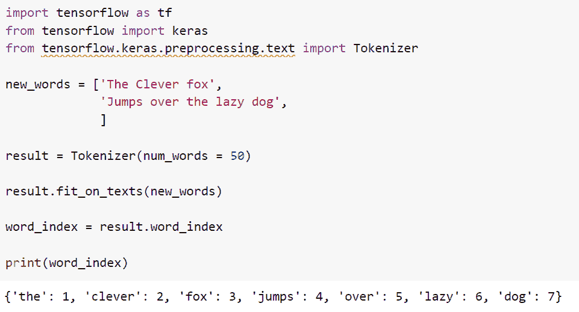
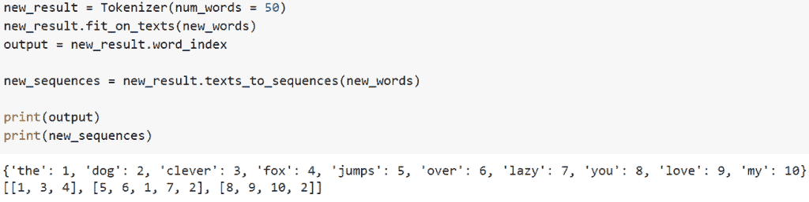

# 张量流自然语言处理

> 原文：<https://pythonguides.com/tensorflow-natural-language-processing/>

[](https://sharepointsky.teachable.com/p/python-and-machine-learning-training-course)

在这个 [Python 教程](https://pythonguides.com/learn-python/)中，我们将重点介绍如何使用 TensorFlow 部署一个**自然语言处理模型，并且我们还将看一些如何在 TensorFlow 中学习自然语言处理的例子。我们将讨论这些话题。**

*   张量流自然语言处理
*   自然语言处理的好处是什么
*   自然语言处理的优势是什么
*   自然语言处理的缺点是什么

目录

[](#)

*   [TensorFlow 自然语言处理](#TensorFlow_natural_language_Processing "TensorFlow natural language Processing")
*   [自然语言处理有什么好处](#What_are_the_benefits_of_natural_language_processing "What are the benefits of natural language processing")
*   [自然语言处理的优势有哪些](#What_are_the_advantages_of_natural_language_processing "What are the advantages of natural language processing")
*   [自然语言处理的缺点有哪些](#What_are_the_disadvantages_of_natural_language_processing "What are the disadvantages of natural language processing")

## TensorFlow 自然语言处理

*   自然语言处理是理解和解释当今大量非结构化数据的重要工具。
*   由于深度学习算法在各种困难的任务中取得了令人印象深刻的结果，如图片分类、语音识别和逼真的文本制作，深度学习最近被广泛用于许多 NLP 应用。
*   目前使用的最人性化、最有效的深度学习框架是 TensorFlow。
*   自然语言处理有许多实际应用。具有大量 NLP 任务的系统被认为是好的。当你使用谷歌翻译来学习如何说“你在哪里？”时，你依赖于这些 NLP 活动的一部分。
*   让我们来看看 NLP 的一些基础知识。
    *   标记化:标记化是任何 NLP 管道的初始阶段。它会显著影响您的管道的其余部分。标记化是将非结构化数据和自然语言文本划分成可被视为离散片段的数据单元的过程。可以直接利用文档的标记出现作为向量来表示该文档。这可以立即将文本文档或非结构化字符串转换为适合机器学习的数字数据格式。它们也可以被计算机直接用来启动有帮助的回答和行动。它们也可以用作机器学习管道中的特征，以启动更复杂的动作或判断。
    *   **词义消歧**:一种重要的自然语言处理技术，用于确定一个单词在上下文中的含义，称为词义消歧。NLP 系统很难正确识别单词，因此了解单词在给定的句子中是如何使用的可能是有用的。确定一个词在几个上下文中使用时的含义所产生的混乱基本上是通过词义消歧来解决的。
    *   排序:既然我们的单词是这样表示的，下一步就是用正确的数字序列来表示我们的句子。然后，这些数据将为神经网络处理做准备，以便解释或甚至生成新的文本。

**举例**:

让我们举一个例子，使用 tokenizer 函数

```py
import tensorflow as tf
from tensorflow import keras
from tensorflow.keras.preprocessing.text import Tokenizer

new_words = ['The Clever fox',
             'Jumps over the lazy dog',
             ]

result = Tokenizer(num_words = 50)

result.fit_on_texts(new_words)

word_index = result.word_index

print(word_index)
```

在这个例子中，我们导入了所需的库，然后创建了一个想要标记的例句列表。接下来，我们将声明一个标记器，它可以有一个索引，单词数是可以保留的最大单词数。

之后，我们将为创建一个 tokenizer 对象的句子。输出将是一个字典。

下面是下面给出的代码的截图。



TensorFlow natural language Processing

这就是我们如何通过使用自然语言处理来使用记号赋予器

**例二**:

现在我们将通过使用排序来举一个自然语言处理的例子

```py
import tensorflow as tf
from tensorflow import keras
from tensorflow.keras.preprocessing.text import Tokenizer

new_words = ['The Clever fox',
             'Jumps over the lazy dog',
             'you love my dog!',
            ]

new_result = Tokenizer(num_words = 50)
new_result.fit_on_texts(new_words)
output = new_result.word_index

new_sequences = new_result.texts_to_sequences(new_words)

print(output)
print(new_sequences)
```

你可以参考下面的截图



TensorFlow natural language Processing sequential

正如您在屏幕截图中看到的，输出使用顺序方法显示了带单词的索引值。

阅读:[tensor flow next _ batch+Examples](https://pythonguides.com/tensorflow-next_batch/)

## 自然语言处理有什么好处

*   在这一节中，我们将讨论自然语言处理的好处。
    *   **执行大规模分析**:自然语言处理技术使对各种文档、内部系统、电子邮件、社交媒体数据、在线评论等的可扩展文本分析成为可能。此外，NLP 工具可以根据您的需求即时放大或缩小，从而提供您所需的计算能力。
    *   **在搜索中排名靠前:**在一家公司，搜索引擎优化至关重要。每个企业都渴望拥有高排名。自然，自然语言处理是有用的。解决方案评估搜索查询，找到并推荐相似的关键字，然后优化我们的内容，同时节省研究时间。
    *   **制造:**制造商可以通过使用 NLP 来分析数据，从而提高自动化程度并简化流程。他们可以进行改进以提高效率，并立即决定需要改进的领域。
    *   **医疗保健**:为了更好地诊断和治疗患者，并提供更好的结果，NLP 可以通过电子邮件、聊天应用程序和患者帮助热线来评估患者沟通。

阅读: [TensorFlow 全球平均池](https://pythonguides.com/tensorflow-global-average-pooling/)

## 自然语言处理的优势有哪些

*   这里我们将讨论自然语言处理的一些优点
*   自然语言处理帮助用户提出任何主题的问题，并在一秒钟内得到结果。
*   自然语言处理帮助计算机用任何语言与人类交流。
*   这是一个更快的客户服务响应时间，也非常省时。
*   它将允许你比较更多的基于语言的数据和一个人，而不会感到疲劳，并且以一种公平和一致的方式。
*   自然语言处理与雇佣人类相比成本更低，因为人类可以比机器多花三到四倍的时间来完成这项任务。

阅读:[二元交叉熵张量流](https://pythonguides.com/binary-cross-entropy-tensorflow/)

## 自然语言处理的缺点有哪些

*   在这一节中，我们将讨论自然语言处理的缺点。
*   自然语言处理具有文档的准确性，并且它不能抓住新的领域，并且它具有有限的功能，这就是为什么自然语言处理是为特定任务而构建的。
*   如果查询是简写的，算法可能无法给出正确的响应。

你可能也喜欢阅读下面的 Python TensorFlow。

*   [Tensorflow 嵌入 _ 查找](https://pythonguides.com/tensorflow-embedding_lookup/)
*   [张量流 clip_by_value](https://pythonguides.com/tensorflow-clip_by_value/)
*   [张量低乘法](https://pythonguides.com/tensorflow-multiplication/)
*   [张量流获取变量](https://pythonguides.com/tensorflow-get-variable/)
*   [如何将 TensorFlow 转换为 one hot](https://pythonguides.com/convert-tensorflow-to-one-hot/)
*   [TensorFlow 全连通层](https://pythonguides.com/tensorflow-fully-connected-layer/)
*   [模块“tensorflow”没有属性“truncated _ normal”](https://pythonguides.com/module-tensorflow-has-no-attribute-truncated_normal/)

在本教程中，我们重点介绍了如何部署一个 ***TensorFlow 自然语言处理*** 模型，并且我们还看了一些如何在 TensorFlow 中学习自然语言处理的示例。我们已经讨论了这些主题。

*   张量流自然语言处理
*   自然语言处理的好处是什么
*   自然语言处理的优势是什么
*   自然语言处理的缺点是什么

[Bijay Kumar](https://pythonguides.com/author/fewlines4biju/)

Python 是美国最流行的语言之一。我从事 Python 工作已经有很长时间了，我在与 Tkinter、Pandas、NumPy、Turtle、Django、Matplotlib、Tensorflow、Scipy、Scikit-Learn 等各种库合作方面拥有专业知识。我有与美国、加拿大、英国、澳大利亚、新西兰等国家的各种客户合作的经验。查看我的个人资料。

[enjoysharepoint.com/](https://enjoysharepoint.com/)[](https://www.facebook.com/fewlines4biju "Facebook")[](https://www.linkedin.com/in/fewlines4biju/ "Linkedin")[](https://twitter.com/fewlines4biju "Twitter")