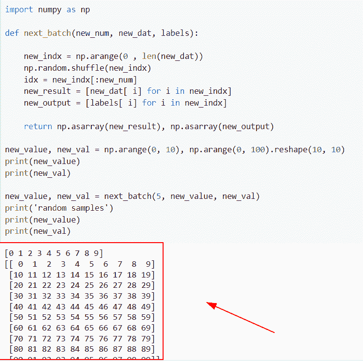
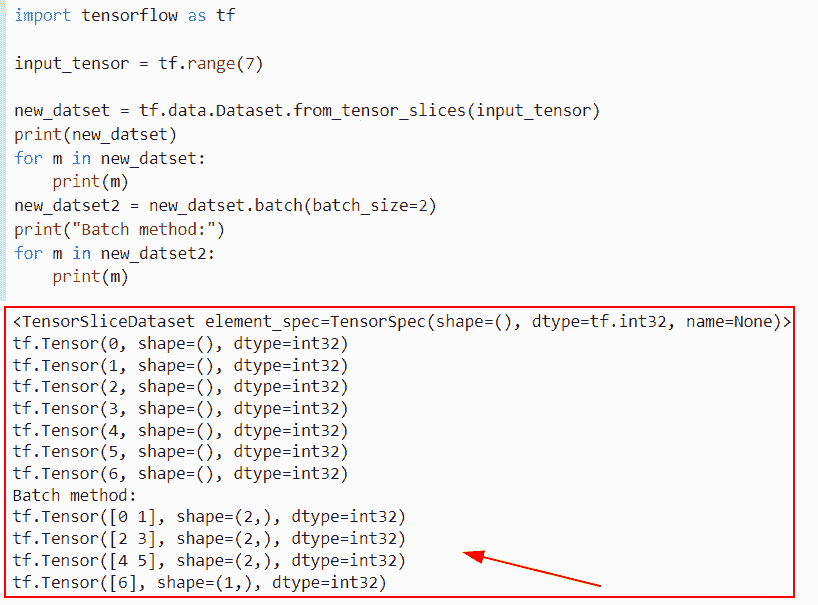
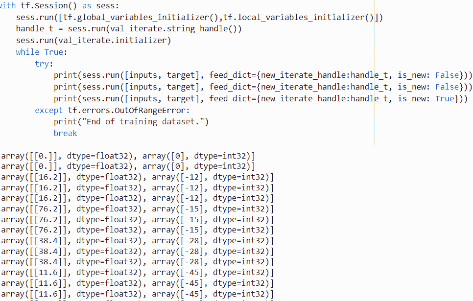
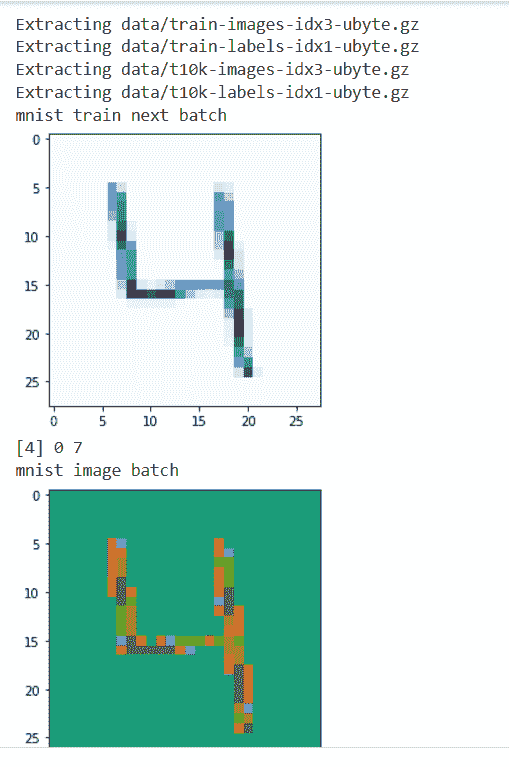

# TensorFlow next_batch +示例

> 原文：<https://pythonguides.com/tensorflow-next_batch/>

[](https://sharepointsky.teachable.com/p/python-and-machine-learning-training-course)

在这个 [Python 教程中，](https://pythonguides.com/learn-python/)我们将学习**如何为 Python TensorFlow** 中的数据执行 Tensorflow next_batch。此外，我们将涵盖以下主题。

*   TensorFlow next_batch
*   张量流数据集 next_batch
*   TensorFlow 数据集获取 next_batch
*   tensor flow Mn ist . train . next _ batch

另外，查看 TensorFlow 上的相关教程: [TensorFlow feed_dict](https://pythonguides.com/tensorflow-feed_dict/)

目录

[](#)

*   [TensorFlow next_batch](#TensorFlow_next_batch "TensorFlow next_batch")
*   [TensorFlow 数据集 next_batch](#TensorFlow_dataset_next_batch "TensorFlow dataset next_batch")
*   [TensorFlow 数据集获取 next_batch](#TensorFlow_dataset_get_next_batch "TensorFlow dataset get next_batch")
*   [tensor flow mnist . train . next _ batch](#TensorFlow_mnisttrainnext_batch "TensorFlow mnist.train.next_batch")

## TensorFlow next_batch

*   在本节中，我们将讨论如何为 [Python TensorFlow](https://pythonguides.com/tensorflow/) 中的数据实现 TensorFlow next_batch。
*   为了执行这个特定的任务，我们将从给定的训练集中生成 **100 个**随机数据点，然后使用全局函数以数组的形式传递样本数。

**举例:**

让我们举个例子，看看**如何在 Python TensorFlow 中为数据实现 TensorFlow next_batch。**

**源代码:**

```py
 import numpy as np

def next_batch(new_num, new_dat, labels):

    new_indx = np.arange(0 , len(new_dat))
    np.random.shuffle(new_indx)
    idx = new_indx[:new_num]
    new_result = [new_dat[ i] for i in new_indx]
    new_output = [labels[ i] for i in new_indx]

    return np.asarray(new_result), np.asarray(new_output)

new_value, new_val = np.arange(0, 10), np.arange(0, 100).reshape(10, 10)
print(new_value)
print(new_val)

new_value, new_val = next_batch(5, new_value, new_val)
print('random samples')
print(new_value)
print(new_val) 
```

在下面给出的代码中，我们导入了 NumPy 库，然后定义了**函数 next_batch()** ，在该函数中，我们将 **new_num 和 new_data** 作为参数传递，它将返回随机样本的总数。

之后，我们通过使用 `np.arange()` 函数和 reshape 方法设置了随机的 **100 个**值。一旦执行了这段代码，输出将显示 NumPy 数组，其中存储了 **100 个**值。

下面是下面给出的代码的截图。



TensorFlow next_batch

阅读: [Tensorflow 嵌入 _ 查找](https://pythonguides.com/tensorflow-embedding_lookup/)

## TensorFlow 数据集 next_batch

*   在本节中，我们将讨论如何使用数据集在 Python TensorFlow 中实现 TensorFlow next_batch。
*   为了执行这个特定的任务，我们将使用`TF . data . dataset . from _ tensor _ slices()`函数，这个函数声明了一个潜在的大型值集。

**语法:**

我们先来看看语法，了解一下 `tf.data.dataset()` 函数在 Python TensorFlow 中的工作原理。

```py
tf.data.Dataset
               (
                variant_tensor
               )
```

*   它由几个参数组成。
    *   **variant_tensor:** 该参数定义了张量的数据集。

**举例:**

```py
import tensorflow as tf

input_tensor = tf.range(7)

new_datset = tf.data.Dataset.from_tensor_slices(input_tensor)
print(new_datset)
for m in new_datset:    
    print(m)
new_datset2 = new_datset.batch(batch_size=2)
print("Batch method:")
for m in new_datset2:
    print(m) 
```

在下面给出的代码中，我们导入了 Tensorflow 库，然后使用 `tf.range()` 函数创建了张量。之后，我们使用`TF . data . dataset . from _ tensor _ slices()`函数创建数据集，并在此函数内将输入张量指定为参数。

一旦执行了这段代码，输出将显示我们在张量中设置的范围值。之后，我们对 next_batch 值使用了 `new_dataset.batch()` 方法。

下面是下面给出的代码的截图。



TensorFlow dataset next_batch

阅读:[张量流 clip_by_value](https://pythonguides.com/tensorflow-clip_by_value/)

## TensorFlow 数据集获取 next_batch

*   在本节中，我们将讨论如何在 Python TensorFlow 中获取 next_batch 数据集。
*   为了完成这个任务，我们将使用`TF . data . dataset . from _ tensor slices()`函数，在这个函数中，我们将设置 batch 和 `epochs()` 值。
*   接下来，我们将声明大小和纪元值的变量，然后使用 `tf.variable scope()` 函数。该函数声明新的变量，并在禁用急切执行时按预期工作。

**语法:**

让我们看一下语法，了解一下 Python TensorFlow 中`TF . compat . v1 . variable _ scope()`函数的工作原理。

```py
tf.compat.v1.variable_scope(
    name_or_scope,
    default_name=None,
    values=None,
    initializer=None,
    regularizer=None,
    caching_device=None,
    partitioner=None,
    custom_getter=None,
    reuse=None,
    dtype=None,
    use_resource=None,
    constraint=None,
    auxiliary_name_scope=True
)
```

**举例:**

我们举个例子，检查一下**如何在 Python TensorFlow 中获取 next_batch 数据集。**

**源代码:**

```py
import tensorflow as tf
from __future__ import absolute_import
from __future__ import division

def ds_train(new_val_size, new_epochs):  
    new_val = (tf.data.Dataset.from_tensor_slices(([16.2,76.2,38.4,11.6,19.3], [-12,-15,-28,-45,-89]))
            .batch(new_val_size)
            .repeat(new_epochs)        
            )
    return new_val

new_val_size= 1
input_size = 1
new_epochs = 2

with tf.variable_scope("dataset"):       
    result= ds_train(new_val_size, new_epochs)

with tf.variable_scope("iterator"):
    val_iterate = result.make_initializable_iterator()
    new_iterate_handle = tf.placeholder(tf.string, shape=[])
    iterator = tf.data.Iterator.from_string_handle(new_iterate_handle, 
                                                val_iterate.output_types,
                                                val_iterate.output_shapes)

    def next_item():
        new_element = iterator.get_next(name="new_element")
        m, n = tf.cast(new_element[0], tf.float32), new_element[1]
        return m, n        

inputs = tf.Variable(tf.zeros(shape=[new_val_size,input_size]), dtype=tf.float32, name="inputs", trainable=False, use_resource=True)
target = tf.Variable(tf.zeros(shape=[new_val_size], dtype=tf.int32), dtype=tf.int32, name="target", trainable=False,use_resource=True)
is_new = tf.placeholder_with_default(tf.constant(False), shape=[], name="new_item_flag")

def new_data(new_val_size, input_size):

    next_inputs, next_target = next_item()
    next_inputs = tf.reshape(next_inputs, shape=[new_val_size, input_size])
    with tf.control_dependencies([tf.assign(inputs, next_inputs), tf.assign(target, next_target)]):
        return tf.identity(inputs), tf.identity(target)

def old_data():

    return inputs, target

next_inputs, next_target = next_item()

inputs, target =  tf.cond(is_new, lambda:new_data(new_val_size, input_size), old_data)

with tf.Session() as sess:
    sess.run([tf.global_variables_initializer(),tf.local_variables_initializer()])
    handle_t = sess.run(val_iterate.string_handle())
    sess.run(val_iterate.initializer)
    while True:
        try:
            print(sess.run([inputs, target], feed_dict={new_iterate_handle:handle_t, is_new: False}))
            print(sess.run([inputs, target], feed_dict={new_iterate_handle:handle_t, is_new: False}))
            print(sess.run([inputs, target], feed_dict={new_iterate_handle:handle_t, is_new: True}))
        except tf.errors.OutOfRangeError:
            print("End of training dataset.")
            break 
```

在下面给出的代码中，我们使用了`TF . data . itera`tor . from _ string _ handle()函数，该函数指示了遍历数据集，然后使用 `tf.variables()` 函数声明张量的状态。

下面是以下给定代码的实现。



TensorFlow dataset get next_batch

阅读:[二元交叉熵张量流](https://pythonguides.com/binary-cross-entropy-tensorflow/)

## tensor flow mnist . train . next _ batch

*   在本节中，我们将讨论如何通过使用 Python TensorFlow 在 next_batch 中使用 mnist 训练数据集。
*   在 Python 中，mnist 是指定手写数字分类的图像的数据集，并且在 mnist 数据集中，有几乎 70，000 个图像，并且每个图像包括 784 个特征。

**注:**来自`tensor flow . examples . tutorials . mnist import input _ data()`库仅在 `TensorFlow 1.x` 版本中可用。如果您使用的是 TensorFlow 的最新版本，那么您必须卸载并安装 TensorFlow 的 1.x 版本才能执行此程序。

**举例:**

让我们举个例子，通过使用 Python TensorFlow 来检查如何在 next_batch 中使用 mnist 训练数据集。

**源代码:**

```py
import matplotlib.pyplot as plt
import numpy as np
from tensorflow.examples.tutorials.mnist import input_data
mnist = input_data.read_data_sets("data")

new_index_val = 8
new_index_val -=2 
mnist.train.next_batch(-mnist.train._index_in_epoch)

mnist.train.next_batch(new_index_val) 
new_batc_x, new_batc_y = mnist.train.next_batch(1)

print("mnist train next batch")
plt.imshow(new_batc_x.reshape([28, 28]), cmap='Blues')
plt.show()
print(new_batc_y, np.argmax(new_batc_y), mnist.train._index_in_epoch)

new_img_x = mnist.train.images[new_index_val] 
new_img_y = mnist.train.labels[new_index_val] 

print("mnist image batch")
plt.imshow(new_img_x.reshape([28, 28]), cmap='Dark2')
plt.show()
print(new_img_y, np.argmax(new_img_y), mnist.train._index_in_epoch)
```

在下面给出的代码中，我们从 tensor flow . examples . tutorials . mnist 导入了 input_data 库，然后使用了索引值。

之后，我们将批处理分为两部分 new_batc_x 和 new_batc_y 变量，并为 mnist.train.next_batch()赋值。在 plot `imshow()` 函数中，我们提到了图像的像素(28，28)和图像颜色作为参数。

下面是下面给出的代码的截图。



TensorFlow mnist.train.next_batch in Python

还有，多看看一些 Python TensorFlow 教程。

*   [梯度下降优化器张量流](https://pythonguides.com/gradient-descent-optimizer-tensorflow/)
*   [张量流自定义损失函数](https://pythonguides.com/tensorflow-custom-loss-function/)
*   [Tensorflow 将字符串转换为整型](https://pythonguides.com/tensorflow-convert-string-to-int/)
*   [TensorFlow 获取变量+示例](https://pythonguides.com/tensorflow-get-variable/)
*   [Python TensorFlow 占位符](https://pythonguides.com/tensorflow-placeholder/)
*   [Tensorflow 获取静态值](https://pythonguides.com/tensorflow-get-static-value/)
*   [将列表转换为张量张量流](https://pythonguides.com/convert-list-to-tensor-tensorflow/)

在这个 Python 教程中， [](https://pythonguides.com/learn-python/) 我们学习了**如何在 Python TensorFlow** 中对数据执行 Tensorflow next_batch。此外，我们还讨论了以下主题。

*   TensorFlow next_batch
*   张量流数据集 next_batch
*   TensorFlow 数据集获取 next_batch
*   tensor flow Mn ist . train . next _ batch

[Bijay Kumar](https://pythonguides.com/author/fewlines4biju/)

Python 是美国最流行的语言之一。我从事 Python 工作已经有很长时间了，我在与 Tkinter、Pandas、NumPy、Turtle、Django、Matplotlib、Tensorflow、Scipy、Scikit-Learn 等各种库合作方面拥有专业知识。我有与美国、加拿大、英国、澳大利亚、新西兰等国家的各种客户合作的经验。查看我的个人资料。

[enjoysharepoint.com/](https://enjoysharepoint.com/)[](https://www.facebook.com/fewlines4biju "Facebook")[](https://www.linkedin.com/in/fewlines4biju/ "Linkedin")[](https://twitter.com/fewlines4biju "Twitter")