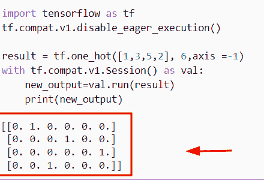
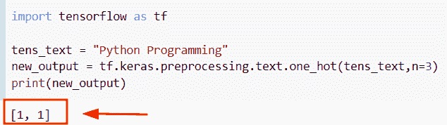

# Python TensorFlow one_hot

> 原文：<https://pythonguides.com/tensorflow-one_hot/>

[](https://sharepointsky.teachable.com/p/python-and-machine-learning-training-course)

在本 [Python 教程](https://pythonguides.com/learn-python/)中，我们将学习**如何在 Python 中使用 TensorFlow one_hot** 函数。此外，我们将讨论以下主题。

*   TensorFlow one_hot 示例
*   张量流 one_hot to index
*   TensorFlow one_hot 编码示例
*   TensorFlow one_hot axis
*   张量流一热分类
*   TensorFlow one hot 编码字符串
*   张量流一从热到密
*   TensorFlow text one 热编码
*   反向一热编码张量流
*   张量流稀疏一热
*   TensorFlow 多标签 one hot

目录

[](#)

*   [Python TensorFlow one_hot](#Python_TensorFlow_one_hot "Python TensorFlow one_hot")
*   [TensorFlow one_hot 示例](#TensorFlow_one_hot_example "TensorFlow one_hot example")
*   [TensorFlow one_hot to index](#TensorFlow_one_hot_to_index "TensorFlow one_hot to index ")
*   [TensorFlow one_hot 编码示例](#TensorFlow_one_hot_encoding_example "TensorFlow one_hot encoding example")
*   [TensorFlow one_hot axis](#TensorFlow_one_hot_axis "TensorFlow one_hot axis")
*   [张量流一热分类](#TensorFlow_one_hot_categorical "TensorFlow one hot categorical")
*   [TensorFlow one hot 编码字符串](#TensorFlow_one_hot_encoding_string "TensorFlow one hot encoding string")
*   [张量流一热一密](#TensorFlow_one_hot_to_dense "TensorFlow one hot to dense")
*   [TensorFlow text one 热编码](#TensorFlow_text_one_hot_encoding "TensorFlow text one hot encoding")
*   [反转一个热编码张量流](#reverse_one_hot_encoding_tensorflow "reverse one hot encoding tensorflow")
*   [张量流稀疏一热](#TensorFlow_sparse_one_hot "TensorFlow sparse one hot")
*   [TensorFlow 多标签 one hot](#TensorFlow_multilabel_one_hot "TensorFlow multilabel one hot")

## Python TensorFlow one_hot

*   在本节中，我们将讨论如何在 [TensorFlow Python](https://pythonguides.com/tensorflow/) 中使用 one_hot()函数。
*   在 python 中，one-hot 编码是一种用于将分类数据转换为数字的技术，以便您可以将其用于机器学习算法。
*   假设我们有随机变量来表示指数数字，现在我们想把这些数字转换成数字整数 **(0，1)** 。
*   为了执行这个特定的任务，我们将使用 `tf.one_hot()` 函数。这个函数将帮助用户返回一个**单键**张量。

**语法:**

让我们看一下语法，了解一下 TensorFlow Python 中的 `tf.one_hot()` 函数的工作原理。

```py
tf.one_hot
          (
           indices,
           depth,
           on_value=None,
           off_value=None,
           axis=None,
           dtype=None,
           name=None
          )
```

*   它由几个参数组成
    *   **索引:**该参数表示我们要操作的索引号，是索引的张量。
    *   **深度:**定义一个热张量的行数和列数的维度。
    *   **on_value:** 如果没有提供，默认取 `1` 值。
    *   **off_value:** 如果没有提供，默认取 `0` 值。
    *   **轴:**该参数定义了要填充的轴，默认为 `-1` 。
    *   **dtype:** 输出张量的数据类型。

> **注意:**如果没有提供数据类型，那么默认情况下 **on_value 和 off_value** 的数据类型将是 `tf.float32` ，并且在两个参数中必须是相同的数据类型。如果不匹配，那么将会出现类型错误。

**举例:**

我们举个例子，检查一下如何在 Python TensorFlow 中使用 `one_hot()` 函数。

**源代码:**

```py
import tensorflow as tf

new_indi = [2, 3, 5]
new_val = 4
result=tf.one_hot(new_indi, new_val)
print(result)
```

在上面的代码中，我们导入了 TensorFlow 库，然后初始化了一个列表，在其中我们分配了索引号。之后，我们使用了 `tf.one_hot()` 函数，在这个函数中，我们将索引和深度作为参数传递。

下面是以下给定代码的实现。


Python TensorFlow one_hot

另外，请阅读: [TensorFlow Tensor to NumPy](https://pythonguides.com/tensorflow-tensor-to-numpy/)

## TensorFlow one_hot 示例

*   在本节中，我们将讨论 Python TensorFlow 中 one_hot 函数的示例。
*   为了完成这个任务，我们将使用 `tf.one_hot()` 函数，它将把随机数转换成二进制整数。
*   在本例中，我们通过导入`TF . compat . v1 . disable _ eager _ execution()`函数创建了会话。
*   接下来，我们将在列表中声明索引号，然后我们将使用 `tf.one_hot()` 函数，并将**索引，深度**轴指定为参数。

**举例:**

```py
import tensorflow as tf
tf.compat.v1.disable_eager_execution()
new_ind = [0,2,3,4,1]
tens = tf.constant(4)

result = tf.one_hot(new_ind, tens,on_value=1.0,off_value=0.0, axis =-1)
with tf.compat.v1.Session() as val:
    new_output=val.run(result)
    print(new_output)
```

下面是以下给定代码的执行。


Python TensorFlow one_hot example

正如你在截图中看到的，输出显示张量 one_hot。

阅读:[张量流得到形状](https://pythonguides.com/tensorflow-get-shape/)

## TensorFlow one_hot to index

*   在本期节目中，我们将讨论如何在 Python TensorFlow 中将 one_hot 转换为 index。
*   为了完成这个任务，首先，我们将显示**一热**的张量，然后将其转换为一个指数。通过使用 `tf.argmax()` 函数，我们可以很容易地将单热张量转换成指数。
*   在 Python 中， `tf.argmax()` 函数用于返回给定输入张量的索引。

**语法:**

让我们看一下语法，理解一下 `tf.argmax()` 函数的工作原理。

```py
tf.argmax
         (
          x,
          axis
         )
```

**举例:**

让我们举一个例子，看看如何在 Python TensorFlow 中将一热张量转换为 index。

**源代码:**

```py
import tensorflow as tf
tf.compat.v1.disable_eager_execution()
new_ind = [0,2,3,4,1]
tens = tf.constant(4)

result = tf.one_hot(new_ind, tens,on_value=1.0,off_value=0.0, axis =-1)
new_result = tf.argmax(result, axis=1)
with tf.compat.v1.Session() as val:
    new_output=val.run(new_result)
    print(new_output)
```

下面是以下给定代码的实现。


Python TensorFlow one_hot to index

正如您在屏幕截图中看到的，输出显示了指数数字。

阅读:[导入错误没有名为 TensorFlow](https://pythonguides.com/import-error-no-module-named-tensorflow/) 的模块

## TensorFlow one_hot 编码示例

*   在本节中，我们将讨论 TensorFlow Python 中的示例 one_hot 编码。
*   通过使用 `tf.one_hot()` 函数，我们可以轻松地执行这个特定的任务，并使用函数中的所有参数。

**举例:**

让我们看一下这个例子，了解一下 `tf.one_hot()` 函数的工作原理。

**源代码:**

```py
import tensorflow as tf

tens=[1,3,4,5]
result= tf.one_hot(tens, depth=4, on_value="True", off_value="False")
tf.print(result) 
```

在下面的代码中，我们导入了 TensorFlow 库，然后初始化了一个指示索引号的列表。之后，我们使用了 `tf.one_hot()` 函数，在该函数中，我们将深度、on_value 和 off_value 指定为参数。

在本例中，我们设置了 **on_value="True "和 off_value="False"** 。一旦执行了这段代码，输出将按照布尔值的顺序显示一键张量。

下面是下面给出的代码的截图。


Python TensorFlow one_hot encoding example

阅读: [Python 复制 NumPy 数组](https://pythonguides.com/python-copy-numpy-array/)

## 张量流 one _ 热轴

*   在本节中，我们将讨论我们将在 TensorFlow Python 中的 one_hot()函数中使用轴参数。
*   为了完成这个任务，我们将使用 `tf.one_hot()` 函数，在这个函数中，我们设置了 `axis=-1` ，它表示最里面的轴。

**语法:**

让我们看看语法，理解 Python 中 TensorFlow `one_hot()` 函数的工作原理。

```py
tf.one_hot
          (
           indices,
           depth,
           on_value=None,
           off_value=None,
           axis=None,
           dtype=None,
           name=None
          )
```

**举例:**

```py
import tensorflow as tf
tf.compat.v1.disable_eager_execution()

result = tf.one_hot([1,3,5,2], 6,axis =-1)
with tf.compat.v1.Session() as val:
    new_output=val.run(result)
    print(new_output)
```

在下面给出的代码中，我们通过导入`TF . compat . v1 . disable _ eager _ execution()`函数创建了一个会话，然后在 `tf.onehot()` 函数中指定了 `axis=-1` 。

下面是下面给出的代码的截图。



Python TensorFlow one_hot axis

阅读:[Python tensor flow expand _ dims](https://pythonguides.com/tensorflow-expand_dims/)

## 张量流一热分类

*   这里我们将讨论如何在 Python TensorFlow 中使用 one _ hot categorical()函数。
*   在本例中，我们将使用 TFP . distribution . onehot categorial()函数，该函数由对数概率参数化，然后我们将创建一个类分布。

**语法:**

下面是`TFP . distributions . onehot categorial()`函数的语法。

```py
tfp.distributions.Categorical
                             (
                              logits=None,
                              probs=None,
                              dtype=tf.int32,
                              validate_args=False,
                              allow_nan_stats=True,
                              name='Categorical'
                             )
```

**举例:**

让我们举个例子，了解一下`TFP . distributions . onehot categorial()`函数的工作原理。

```py
import tensorflow as tf
import tensorflow_probability as tfp

tens=tfp.distributions.OneHotCategorical(probs=[0.7,0.4,0.5])
print(tens)
result=tens.sample()
print(result)
```

下面是以下给定代码的实现。


Python TensorFlow one hot categorical

正如您在屏幕截图中看到的，输出将事件形状显示为 3，这意味着随机变量现在是一个向量。

阅读: [Python NumPy Savetxt +示例](https://pythonguides.com/python-numpy-savetxt/)

## TensorFlow one hot 编码字符串

*   在本节中，我们将讨论如何通过在 Python 中创建张量来获得输出中的字符串值。
*   在本例中，我们已经在 `tf.one_hot()` 函数中设置了参数 **on_value='x '和 off_value='y'** 。一旦执行了这段代码，输出就会以一个热张量的形式显示字符串值。

**举例:**

```py
import tensorflow as tf

tens=[1,3,6,5,4,7]
result= tf.one_hot(tens, depth=6, on_value='x', off_value='y')
tf.print(result)
```

下面是下面给出的代码的截图。


Python TensorFlow one hot encoding string

阅读: [Python TensorFlow 截断法线](https://pythonguides.com/tensorflow-truncated-normal/)

## 张量流一热一密

*   在本节中，我们将讨论如何在 Python TensorFlow 中将一个热张量转换为稠密张量。
*   通过使用切片和 `tf.where()` 函数，我们可以很容易地将 one_hot 张量转换为 dense。
*   为了完成这项任务，我们将首先导入`TF . compat . v1 . disable _ eager _ execution()`模块来创建会话，然后我们将使用 `tf.constant()` 函数来创建张量索引。

**语法:**

下面是 `tf.where()` 函数的语法

```py
tf.where
        (
         condition,
         x=None,
         y=None,
         name=None
        )
```

**举例:**

我们举个例子，检查一下如何在 Python 中将 `one_hot` 张量转换成 dense。

**源代码:**

```py
import tensorflow as tf
tf.compat.v1.disable_eager_execution()
tens = tf.constant([[1, 0, 0], [0, 1, 0], [0, 0, 1]])
dense = tf.where(tf.equal(tens, 1))
indices = dense[:,1]
with tf.compat.v1.Session() as val:
    new_output=val.run(indices)
    print(new_output)
```

下面是以下代码的截图


Python TensorFlow one hot to dense

阅读:[将列表转换为张量张量流](https://pythonguides.com/convert-list-to-tensor-tensorflow/)

## TensorFlow text one 热编码

*   在这一节中，我们将讨论如何用 Python 将文本编码成单词列表。
*   为了执行这个特定的任务，我们将使用`TF . keras . preprocessing . text . one _ hot()`函数，这个函数用于将文本转换成单词列表。在这个例子中，我们将一个字符串作为输入，它将返回一个编码的整数列表。

**语法:**

让我们看看语法，了解一下 **tf 的工作原理。keras . preprocessing . text . one _ hot()**函数。

```py
tf.keras.preprocessing.text.one_hot
                                   (
                                    input_text,
                                    n,
                                    filters='!"#$%&,
                                    lower=True,
                                    split=' ',
                                   )
```

*   它由几个参数组成
    *   **input_text:** 该参数表示将是字符串的输入文本。
    *   `n` :定义输入文本的大小
    *   **拆分:**该参数用于分词。

**举例:**

让我们举一个例子，看看如何用 Python 将一个文本编码成一个单词列表。

**源代码:**

```py
import tensorflow as tf

tens_text = "Python Programming"
new_output = tf.keras.preprocessing.text.one_hot(tens_text,n=3)
print(new_output)
```

下面是以下给定代码的实现



Python TensorFlow text one-hot encoding

阅读:[张量流自定义损失函数](https://pythonguides.com/tensorflow-custom-loss-function/)

## 反转一个热编码张量流

*   在本节中，我们将讨论如何在 Python TensorFlow 中反转独热编码张量。
*   为了执行这个特定的任务，我们将通过使用 `tf.one_hot()` 函数来创建 one_hot 张量，然后我们将通过在 Python 中应用 `tf.reverse()` 函数来反转 `one-hot` 张量元素。
*   此函数用于基于轴反转张量，它在 TensorFlow 包中可用。

**语法:**

我们来看一下语法，了解一下 `tf.reverse()` 函数的工作原理。

```py
tf.reverse
          (
           tensor,
           axis,
           name=None
          ) 
```

*   它由几个参数组成
    *   **张量:**该参数表示张量，必须是整数数据类型。
    *   **轴:**要反转的维度的索引。
    *   **name:** 缺省情况下取 none 值，表示操作的名称。

**举例:**

让我们举个例子，看看如何在 Python 中反转一键编码张量。

**源代码:**

```py
import tensorflow as tf

new_indi = [3, 1, 2]
new_val = 4
result=tf.one_hot(new_indi, new_val)
print(result)
b_reversed = tf.reverse(result, axis=[0, 1])
print(b_reversed)
```

你可以参考下面的截图。


reverse one hot encoding TensorFlow in Python

阅读: [TensorFlow next_batch](https://pythonguides.com/tensorflow-next_batch/)

## 张量流稀疏一热

*   在本期节目中，我们将讨论如何在 Python TensorFlow 中使用 `tf.sparse.to_dense()` 函数。
*   通过使用 `tf.sparse.to_dense()` 函数用于将稀疏张量转换为密集张量。

**语法:**

下面是 tf.sparse.to_dense()函数的语法。

```py
tf.sparse.to_dense
                  (
                   sp_input,
                   default_value=None,
                   validate_indices=True,
                   name=None
                  )
```

*   它由几个参数组成
    *   **sp_input:** 该参数表示我们要操作的输入备用张量。
    *   `default_value` :默认情况下不取值，用于设置索引。
    *   **validate _ indexes:**该参数指定没有重新分区，它将检查条件，如果值为真，则它们按字典顺序排序。

**举例:**

让我们看一下例子，了解一下 `tf.sparse.to_dense()` 函数的工作原理。

**源代码:**

```py
import tensorflow as tf

tens_input = tf.SparseTensor(
  dense_shape=[3, 6],
 values=[3, 4,5],
  indices =[[0, 1],
            [0, 3],
            [2, 0]])
result=tf.sparse.to_dense(tens_input).numpy()
print(result)
```

在下面给定的代码中我们已经导入了 TensorFlow 库，然后使用了 **tf。SparseTensor()** 函数，在该函数中，我们指定了密集的**形状、值、**和**索引**作为参数。

下面是以下给定代码的实现。


Python TensorFlow sparse one hot

正如你在截图中看到的，输出显示了稠密张量。

阅读: [TensorFlow 稀疏张量](https://pythonguides.com/tensorflow-sparse-tensor/)

## TensorFlow 多标签 one hot

*   这里我们要讨论的是如何在 Python TensorFlow 中的 one_hot()函数中使用多标签。
*   为了完成这个任务，我们将使用 TF . ragged . constant()函数，当我们在张量中有一个嵌套列表时，就会用到这个函数。
*   接下来，我们将声明一个变量并指定 tf.one_hot()函数，在这个函数中，我们将指定深度作为一个参数。

**语法:**

下面是`TF . ragged . constant()`函数的语法。

```py
tf.ragged.constant
                  (
                   pylist,
                   dtype=None,
                   ragged_rank=None,
                   inner_shape=None,
                   name=None,
                   row_splits_dtype=tf.dypes.int64
                  )
```

**举例:**

```py
import tensorflow as tf
new_indices = tf.ragged.constant([[2, 3], [2], [1, 2]])

one_hot_tensor = tf.one_hot(new_indices, 5)
multi_labels = tf.reduce_max(one_hot_tensor, axis=1)
print(multi_labels)
```

下面是下面给出的代码的截图。


Python TensorFlow multilabel one hot

您可能也喜欢阅读以下 Python TensorFlow 教程。

*   [张量流交叉熵损失](https://pythonguides.com/tensorflow-cross-entropy-loss/)
*   [二元交叉熵张量流](https://pythonguides.com/binary-cross-entropy-tensorflow/)
*   [Tensorflow 嵌入 _ 查找](https://pythonguides.com/tensorflow-embedding_lookup/)
*   [张量流图-详细指南](https://pythonguides.com/tensorflow-graph/)

在本 Python 教程中，我们学习了**如何在 Python 中使用 TensorFlow one_hot** 函数。此外，我们还讨论了以下主题。

*   TensorFlow one_hot 示例
*   张量流 one_hot to index
*   TensorFlow one_hot 编码示例
*   TensorFlow one_hot axis
*   张量流一热分类
*   TensorFlow one hot 编码字符串
*   张量流一从热到密
*   张量流数据集一次性编码
*   TensorFlow text one 热编码
*   反向一热编码张量流
*   张量流稀疏一热
*   TensorFlow 多标签 one hot

[Bijay Kumar](https://pythonguides.com/author/fewlines4biju/)

Python 是美国最流行的语言之一。我从事 Python 工作已经有很长时间了，我在与 Tkinter、Pandas、NumPy、Turtle、Django、Matplotlib、Tensorflow、Scipy、Scikit-Learn 等各种库合作方面拥有专业知识。我有与美国、加拿大、英国、澳大利亚、新西兰等国家的各种客户合作的经验。查看我的个人资料。

[enjoysharepoint.com/](https://enjoysharepoint.com/)[](https://www.facebook.com/fewlines4biju "Facebook")[](https://www.linkedin.com/in/fewlines4biju/ "Linkedin")[](https://twitter.com/fewlines4biju "Twitter")