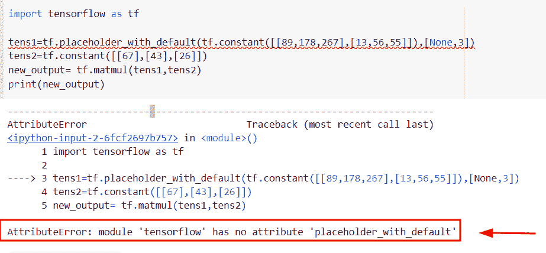

# Python TensorFlow 占位符

> 原文：<https://pythonguides.com/tensorflow-placeholder/>

[](https://sharepointsky.teachable.com/p/python-and-machine-learning-training-course)

在本 [Python 教程](https://pythonguides.com/learn-python/)中，我们将学习**如何在 Python** 中使用 TensorFlow 占位符。此外，我们将涵盖以下主题。

*   张量流占位符与变量
*   张量流占位符形状
*   TensorFlow 占位符替换
*   TensorFlow 占位符示例
*   TensorFlow Placeholder name
*   张量流占位符形状无
*   默认情况下的张量流占位符
*   张量流用常数替换占位符
*   带张量的张量流馈送占位符
*   TensorFlow 占位符与急切执行不兼容
*   TensorFlow 没有属性“placeholder_with_default”
*   TensorFlow 用占位符初始化变量
*   TensorFlow placeholder error
*   TensorFlow 占位符到 numpy
*   TensorFlow 向图形添加占位符
*   张量流占位符未知形状
*   张量流检查是否有占位符
*   张量流迭代占位符
*   张量流获取占位符的形状
*   TensorFlow 占位符 feed_dict
*   TensorFlow placeholder bool

目录

[](#)

*   [Python TensorFlow 占位符](#Python_TensorFlow_Placeholder "Python TensorFlow Placeholder")
*   [张量流占位符 vs 变量](#TensorFlow_Placeholder_vs_variable "TensorFlow Placeholder vs variable")
*   [张量流占位符形状](#TensorFlow_Placeholder_Shape "TensorFlow Placeholder Shape")
*   [TensorFlow 占位符示例](#TensorFlow_Placeholder_Example "TensorFlow Placeholder Example")
*   [张量流占位符名称](#TensorFlow_Placeholder_name "TensorFlow Placeholder name")
*   [张量流占位符形状无](#TensorFlow_Placeholder_shape_none "TensorFlow Placeholder shape none")
*   [带默认值的张量流占位符](#TensorFlow_placeholder_with_default "TensorFlow placeholder with default")
*   [带张量的 TensorFlow 提要占位符](#TensorFlow_feed_placeholder_with_tensor "TensorFlow feed placeholder with tensor")
*   [TensorFlow 占位符与急切执行不兼容](#TensorFlow_placeholder_not_compatible_with_eager_execution "TensorFlow placeholder not compatible with eager execution")
*   [TensorFlow 没有属性' placeholder_with_default'](#TensorFlow_has_no_attribute_placeholder_with_default "TensorFlow has no attribute ‘placeholder_with_default’")
*   [TensorFlow 用占位符](#TensorFlow_initialize_variable_with_placeholder "TensorFlow initialize variable with placeholder")初始化变量
*   [张量流占位符错误](#TensorFlow_placeholder_error "TensorFlow placeholder error")
*   [TensorFlow 占位符到 numpy](#TensorFlow_placeholder_to_numpy "TensorFlow placeholder to numpy")
*   [TensorFlow 向图形添加占位符](#TensorFlow_add_placeholder_to_graph "TensorFlow add placeholder to graph")
*   [张量流占位符未知形状](#TensorFlow_placeholder_unkown_shape "TensorFlow placeholder unkown shape")
*   [张量流检查是否占位](#TensorFlow_check_if_placeholder "TensorFlow check if placeholder")
*   [TensorFlow 迭代占位符](#TensorFlow_iterate_over_placeholder "TensorFlow iterate over placeholder")
*   [TensorFlow 获取占位符的形状](#TensorFlow_get_shape_of_placeholder "TensorFlow get shape of placeholder")
*   [TensorFlow 占位符 feed_dict](#TensorFlow_placeholder_feed_dict "TensorFlow placeholder feed_dict")
*   [TensorFlow 占位符布尔值](#TensorFlow_placeholder_bool "TensorFlow placeholder bool")

## Python TensorFlow 占位符

*   在本节中，我们将讨论如何在 [Python TensorFlow](https://pythonguides.com/tensorflow/) 中使用占位符。
*   在 TensorFlow 中，占位符是一个变量，它分配数据并将值输入计算图。这种方法允许用户提供操作数据并生成我们的计算图。
*   在 Python 中，如果我们想要初始化一些数据，那么我们使用变量，但是在占位符中，你可以将数据输入到计算图中。

**语法:**

让我们看一下语法并理解 Python TensorFlow 中的 `tf.placeholder()` 函数的工作原理。

```py
tf.compat.v1.placeholder
                       (
                        dtype,
                        shape=None,
                        name=None
                       )
```

*   它由几个参数组成
    *   **dtype:** 该参数表示张量中元素的类型。
    *   默认情况下，它没有值，如果你没有在张量中提到形状，那么你可以输入任何形状的张量。
    *   **名称:**该参数指定操作的名称，可选参数。

**举例:**

让我们举个例子，看看如何在 Python TensorFlow 中创建一个**占位符。**

**源代码:**

```py
import tensorflow as tf

tf.compat.v1.disable_eager_execution()
tens1= tf.compat.v1.placeholder(tf.float32)
tens2 = tf.compat.v1.placeholder(tf.float32)
c = tf.math.multiply(tens1, tens2)
with tf.compat.v1.Session() as val:
    new_output=val.run(c, feed_dict={tens1: 7.8, tens2: 9.10})
    print(new_output)
```

*   在上面的代码中，我们导入了 TensorFlow 库，然后声明了两个占位符，其数据类型为 `tf.float32()` 。
*   之后，我们通过使用 `tf.math.multiply` 执行操作，然后通过导入`TF . compat . v1 . disable _ eager _ execution()`函数创建会话。
*   创建会话时，我们将 `feed_dict` 指定为参数。

下面是下面给出的代码的截图。


Python TensorFlow Placeholder

另外，检查: [TensorFlow Tensor to numpy](https://pythonguides.com/tensorflow-tensor-to-numpy/)

## 张量流占位符 vs 变量

*   在本节中，我们将讨论 Python TensorFlow 中占位符和变量的区别。
*   在 Python TensorFlow 中，变量指定了张量，可以通过对其运行操作来修改其元素。而在占位符的情况下，它用于将外部数据插入到计算图中，并且稍后将分配数据。
*   在 Tensorflow 中，如果你想在图形中添加变量，那么你可以很容易地调用构造函数，当创建张量时，我们有与初始值相同的数据类型。
*   在 `tf.placeholder()` 中，我们可以很容易地在稍后的会话中将该值存储为 `feed_dict` 。如果我们在运行会话时没有传递任何值，那么将会产生一个错误。

**语法:**

让我们看一下语法，了解一下 Python TensorFlow 中的 `tf.variable()` 函数的工作原理。

```py
tf.variable
           (
            initial_value=None,
            trainable=None,
            validate_shape=True,
            caching_device=None,
            name=None,
            variable_def=None,
            dtype=None,
            import_scope=None,
            constraint=None
           )
```

**举例:**

让我们举一个例子，检查占位符和变量之间的区别。

**源代码:**

```py
import tensorflow as tf
#creation of variables
tens=tf.Variable([[2,3,4,5],
                  [34,98,67,44]])
tens2=tf.Variable([[6,36,98,45],
                  [23,178,278,345]])
result=tf.add(tens,tens2)
print("Addition of two variable ",result)

#Creation of placeholder
tf.compat.v1.disable_eager_execution()
new_tensor1= tf.compat.v1.placeholder(tf.int32)
new_tensor2 = tf.compat.v1.placeholder(tf.int32)
z = tf.add(new_tensor1, new_tensor2)
with tf.compat.v1.Session() as val:
    new_output=val.run(z, feed_dict={new_tensor1:67, new_tensor2: 89})
    print(new_output)
```

在下面给出的代码中，我们首先通过使用 `tf.variable()` 函数创建了两个变量，然后通过 `tf.add()` 函数进行操作，来创建一个我们不需要创建会话的简单变量。而在占位符的情况下，我们必须通过导入`TF . compat . v1 . disable _ eager _ execution()`函数来创建一个会话。

创建一个会话后，我们将 `feed_dict` 指定为一个参数。一旦执行了这段代码，输出将显示给定张量的加法。

下面是以下给定代码的实现。


TensorFlow Placeholder vs variable

阅读:[张量流得到形状](https://pythonguides.com/tensorflow-get-shape/)

## 张量流占位符形状

*   在本例中，我们将使用 Python TensorFlow 来传递 `tf.placeholder()` 函数中的形状参数。
*   为了执行这个特定的任务，我们将使用`TF . compat . v1 . placeholder()`函数来创建变量，在这个函数中，我们将传递数据类型和形状作为参数。
*   接下来，我们将使用 `np.zeros()` 函数，在该函数中，我们将设置相同的形状，然后创建并运行会话，我们将使用 `sess.run()` 并在其中分配 `feed_dict()` 。

**举例:**

让我们举一个例子，看看如何以零数组的形式获取形状值。

**源代码:**

```py
import tensorflow as tf
import numpy as np

tf.compat.v1.disable_eager_execution()
tens1= tf.compat.v1.placeholder(tf.float32,shape=(3, 4))
tens2 = tf.compat.v1.placeholder(tf.float32,shape=(3, 4))
result = tf.square(tens1) * tf.square(tens2)
new_arr= np.zeros((3,4))

with tf.compat.v1.Session() as val:
    new_output=val.run(result, feed_dict={tens1:new_arr,tens2:new_arr})
    print(new_output) 
```

下面是以下给定代码的执行。


TensorFlow Placeholder shape

正如您在屏幕截图中看到的，输出以(3，4)的形式显示零值。

阅读:[Python TensorFlow reduce _ sum](https://pythonguides.com/python-tensorflow-reduce_sum/)

## TensorFlow 占位符示例

*   在这个程序中，我们将讨论如何在 Python TensorFlow 中创建一个占位符。
*   为了完成这项任务，我们首先将使用`TF . compat . v1 . placeholder()`函数创建一个变量，在这个方法中，我们将提到**数据类型、形状和名称**作为参数。
*   接下来，我们将使用平方运算符来乘以给定的输入，在本例中，给定的输入是一个值，其形状为 **(3，4)** 。

**举例:**

我们举个例子，检查一下如何在 Python TensorFlow 中使用 `placeholder()` 函数。

**源代码:**

```py
import tensorflow as tf
import numpy as np

tf.compat.v1.disable_eager_execution()
new_tensor= tf.compat.v1.placeholder(tf.float32,shape=(3, 4),name='tensor')

z = new_tensor *2
new_arr= np.ones((3,4))

with tf.compat.v1.Session() as val:
    new_output=val.run(z, feed_dict={new_tensor:new_arr})
    print(new_output)
```

一旦您将执行此代码，输出显示的是 `2` 乘以 1 的值，这意味着输入数组已经被乘以了两倍。

下面是下面给出的代码的截图。


TensorFlow Placeholder Example

阅读:[Python tensor flow reduce _ mean](https://pythonguides.com/python-tensorflow-reduce_mean/)

## 张量流占位符名称

*   这里我们将使用 **tf 中的 name 参数。Placeholder()** 函数使用 Python TensorFlow。
*   在这个例子中，我们将对给定的占位符执行减法运算。为了执行这个任务，我们将使用 `tf.math.subtract()` 函数。

**语法:**

下面是 Python TensorFlow 中 `tf.math.subtract()` 函数的语法。

```py
tf.math.subtract
                (
                 x,
                 y,
                name=None
               )
```

**举例:**

让我们举一个例子，看看如何在 tf.placeholder()函数中使用 name 参数。

**源代码:**

```py
import tensorflow as tf

tf.compat.v1.disable_eager_execution()
tens1= tf.compat.v1.placeholder(tf.int32,name='tens1')
tens2 = tf.compat.v1.placeholder(tf.int32,name='tens2')
c = tf.math.subtract(tens1, tens2)
with tf.compat.v1.Session() as val:
    new_output=val.run(c, feed_dict={tens1: 87, tens2: 76})
    print("Subtraction of two tensors:",new_output)
```

下面是以下给定代码的实现。


TensorFlow Placeholder name

阅读: [Python TensorFlow 随机均匀](https://pythonguides.com/tensorflow-random-uniform/)

## 张量流占位符形状无

*   在本节中，我们将讨论如何使用 Python TensorFlow 在 `tf.placeholder()` 函数中将 none 值设置为形状。
*   在这个例子中我们已经提到形状参数在`TF . compat . v1 . placeholder()`函数中是 none。

**举例:**

我们举个例子，了解一下 Python TensorFlow 中 `tf.placeholder()` 函数的工作原理。

**源代码:**

```py
import tensorflow as tf

tf.compat.v1.disable_eager_execution()
a= tf.compat.v1.placeholder(tf.int32,shape=None)
b= tf.compat.v1.placeholder(tf.int32,shape=None)
result=tf.math.divide(a,b)
with tf.compat.v1.Session() as val:
    new_output=val.run(result, feed_dict={a: 10, b: 20})
    print("Division of two tensors without any shape:",new_output)
```

下面是下面给出的代码的截图。


Python TensorFlow Placeholder shape none

阅读: [Python TensorFlow one_hot](https://pythonguides.com/tensorflow-one_hot/)

## 带默认值的张量流占位符

*   本节我们将讨论如何在 Python TensorFlow 中使用`TF . compat . v1 . placeholder _ with _ default()`。
*   当输出会话中没有输入值时，带有默认值的占位符将通过一个基本操作。

**语法:**

让我们看一下语法，了解一下`TF . compat . v1 . placeholder _ with _ default()`函数的工作原理

```py
tf.compat.v1.placeholder_with_default
                                     (
                                      input,
                                      shape,
                                      name=None
                                     )
```

*   它由几个参数组成
    *   **输入:**该参数表示如果输出中没有反馈值，则生成默认值。
    *   **形状:**该参数指定了张量的形状。
    *   **名称:**可选参数，表示操作的名称。

**举例:**

让我们举个例子，检查如何在占位符 TensorFlow 中使用默认值。

**源代码:**

```py
import tensorflow as tf

tens=tf.compat.v1.placeholder_with_default(tf.constant([[12,45,67],[76,28,181]]),[None,3])
tens2=tf.constant([[17],[24],[38]])
result= tf.matmul(tens,tens2)
print(result)
```

在上面的代码中，我们导入了 TensorFlow 库，然后使用了`TF . compat . v1 . placeholder _ with _ default()`函数，在这个方法中，我们使用了 `tf.constant()` 函数作为默认值。

下面是以下给定代码的实现。


TensorFlow placeholder with default

阅读:[张量流交叉熵损失](https://pythonguides.com/tensorflow-cross-entropy-loss/)

## 带张量的 TensorFlow 提要占位符

*   在本节中，我们将讨论如何在 Python TensorFlow 中使用 Placeholder() 函数中的 fe **ed_dict。**
*   Tensorflow `feed_dict()` 定义了提要字典，可以在其中传递占位符的特定值。为了完成这项任务，我们将首先使用`TF . compat . v1 . placeholder()`函数创建两个占位符。
*   接下来，我们将通过使用 `tf.add()` 函数来操作这些值，在这个函数中，我们将分配占位符，然后创建一个会话，我们将在其中分配 feed_dict 值。

**举例:**

让我们举个例子，检查一下如何在**占位符()**函数中使用 `feed_dict()` 。

**源代码:**

```py
import tensorflow as tf

tf.compat.v1.disable_eager_execution()
tens1= tf.compat.v1.placeholder(tf.int32)
tens2 = tf.compat.v1.placeholder(tf.int32)
c = tf.add(tens1, tens2)
with tf.compat.v1.Session() as val:
    new_output=val.run(c, feed_dict={tens1: 72, tens2: 89})
    print(new_output)
```

下面是以下给定代码的执行过程


TensorFlow feed placeholder with tensor

阅读:[张量流均方误差](https://pythonguides.com/tensorflow-mean-squared-error/)

## TensorFlow 占位符与急切执行不兼容

在这里，我们将讨论与 Python TensorFlow 中的急切执行不兼容的错误 TensorFlow 占位符。基本上，当我们没有导入`TF . compat . v1 . disable _ eager _ execution()`函数时，就会出现这个错误语句。

**举例:**

```py
import tensorflow as tf

tens = tf.compat.v1.placeholder(tf.int32) 
print(tens)
```

在上面的代码中，我们导入了 TensorFlow 库，并使用`TF . compat . v1 . placeholder()`来创建占位符。

下面是以下代码的截图


TensorFlow placeholder not compatible with eager execution

正如您在截图中看到的，输出显示错误 `tf.placeholder()` 与急切执行不兼容。

现在让我们看看这个错误的解决方案

**解决方案:**

```py
import tensorflow as tf
tf.compat.v1.disable_eager_execution()
tens = tf.compat.v1.placeholder(tf.int32) 
print(tens)
```

在上面的代码中，我们导入了`TF . compat . v1 . disable _ eager _ execution()`函数，然后使用了 `tf.placeholder()` 函数，在这个函数中，我们将数据类型指定为一个参数。

下面是以下给定代码的实现


Solution of TensorFlow placeholder not compatible with eager execution

## TensorFlow 没有属性' placeholder_with_default'

在本节中，我们将讨论 Python 中的错误 TensorFlow 没有属性“Placeholder_with_default”。基本上，当我们在 placeholder_with_default() 函数中没有提到 **compat.v1()时，就会出现这个错误语句。**

**举例:**

```py
import tensorflow as tf

tens1=tf.placeholder_with_default(tf.constant([[89,178,267],[13,56,55]]),[None,3])
tens2=tf.constant([[67],[43],[26]])
new_output= tf.matmul(tens1,tens2)
print(new_output)
```

在上面的代码中，我们已经导入了 TensorFlow 库，然后在`TF . placeholder _ with _ default()`函数中使用默认值，然后我们通过使用 `tf.matmul()` 函数进行操作。

下面是以下代码的截图



TensorFlow has no attribute placeholder_with_default

正如您在屏幕截图中看到的，输出显示错误 Tensorflow 没有属性**‘placeholder _ with _ default’**。

现在让我们看看这个错误的解决方案

解决办法

```py
import tensorflow as tf

tens1=tf.compat.v1.placeholder_with_default(tf.constant([[89,178,267],[13,56,55]]),[None,3])
tens2=tf.constant([[67],[43],[26]])
new_output= tf.matmul(tens1,tens2)
print(new_output)
```

在下面给出的代码中，我们使用了`TF . compat . v1 . placeholder _ with _ default()`函数，而不是`TF . placeholder _ with _ default()`函数。

下面是以下给定代码的输出


Solution of TensorFlow has no attribute placeholder_with_default

## TensorFlow 用占位符初始化变量

*   在本节中，我们将讨论如何在 Python TensorFlow 中用占位符初始化变量。
*   在 Python TensorFlow 中，我们不能在 TensorFlow 中用占位符初始化变量。我们可以轻松地传递 `feed_dict()` 中的值，而不是创建变量。

## 张量流占位符错误

在本程序中，我们将讨论错误 **AttributeError:模块' TensorFlow '没有属性' Placeholder'** 。基本上，当我们在创建占位符变量时没有导入`TF . compat . v1 . disable _ eager _ execution()`函数，就会出现这个语句错误。

**举例:**

```py
import tensorflow as tf

tens=tf.placeholder("tf.int32")
print(tens)
```

你可以参考下面的截图


TensorFlow placeholder error

正如您在屏幕截图中看到的，输出显示了**属性错误:模块“TensorFlow”没有属性“placeholder”**。

现在让我们看看这个错误的解决方案

**解决方案:**

```py
import tensorflow as tf

tf.compat.v1.disable_eager_execution()
new_result=tf.compat.v1.placeholder(tf.int32)
print(new_result)
```

在上面的代码中，我们导入了`TF . compat . v1 . disable _ ea`ger _ execution()函数，然后使用了`TF . compat . v1 . placeholder()`。一旦执行了这段代码，输出将显示占位符的类型。

下面是以下代码的截图


Solution of TensorFlow placeholder error

阅读: [TensorFlow 全球平均池](https://pythonguides.com/tensorflow-global-average-pooling/)

## TensorFlow 占位符到 numpy

*   在本节中，我们将讨论如何在 Python TensorFlow 中将占位符转换为 numpy。
*   为了执行这个特定的任务，我们将使用`TF . compat . v1 . placeholder()`函数，并将**数据类型、形状**指定为参数。
*   接下来，我们将使用 `np.ones()` 函数创建 numpy 数组，在这个函数中，我们提到了形状。

**举例:**

```py
import tensorflow as tf
import numpy as np

tf.compat.v1.disable_eager_execution()
new_tens= tf.compat.v1.placeholder(tf.float32,shape=(2, 2),name='tensor')

z = new_tens *2
new_arr= np.ones((2,2))

with tf.compat.v1.Session() as val:
    new_output=val.run(z, feed_dict={new_tens:new_arr})
    print(new_output)
    print(type(new_output))
```

下面是以下给定代码的实现


TensorFlow placeholder to numpy

阅读:[模块“tensorflow”没有属性“mul”](https://pythonguides.com/module-tensorflow-has-no-attribute-mul/)

## TensorFlow 向图形添加占位符

*   在本节中，我们将讨论如何在 Python TensorFlow 中向图表添加占位符。
*   为了执行这个特定的任务，我们将使用 `tf.graph()` ，这个方法定义了在操作之间流动的数据单元。
*   在这个例子中，我们将使用`TF . compat . v1 . placeholder()`函数，在这个函数中，我们将数据类型和形状指定为一个参数。

**语法:**

下面是 Python TensorFlow 中 `tf.graph()` 函数的语法

```py
tf.graph()
```

**举例:**

让我们举一个例子，看看如何在 Python TensorFlow 中向图形添加占位符。

**源代码:**

```py
import tensorflow as tf
import numpy as np
tf.compat.v1.disable_eager_execution()

new_graph = tf.Graph()
with new_graph.as_default():

    new_tens = tf.compat.v1.placeholder(tf.int32, shape=(2, 2))
    new_tens2 = tf.compat.v1.placeholder(tf.int32, shape=(2, 2))
    b = tf.math.multiply(new_tens, new_tens2)

new_arr = np.zeros((2,2))

with tf.compat.v1.Session(graph=new_graph) as session:
    output = session.run(b, feed_dict={new_tens: new_arr,new_tens2: new_arr})
    print(output)
```

下面是以下给定代码的实现


TensorFlow add a placeholder to the graph

## 张量流占位符未知形状

*   在本节中，我们将讨论如何在 Python TensorFlow 中获取占位符中的未知形状。
*   在这个例子中，我们不知道张量的形状和秩，现在在这个程序中，我们将使用`TF . compat . v1 . placeholder()`函数，在这个函数中，我们将 shape 参数指定为一个参数。

**举例:**

```py
import tensorflow as tf

tf.compat.v1.disable_eager_execution()
tens =tf.compat.v1.placeholder(tf.int32, shape=[None,None,None])
print(tens)
```

你可以参考下面的截图


TensorFlow placeholder Unkown shape

正如您在截图中看到的，输出将 shape 显示为 none 值。

## 张量流检查是否占位

在本节中，我们将检查**占位符()**函数在张量中是否可用。为了完成这个任务，我们将使用 `isinstance()` 方法。在 Python 中， `isinstance()` 方法将检查条件，如果给定的对象是实例，那么它将为真，否则为假。

**举例:**

让我们举一个例子，检查占位符是否可用。

源代码:

```py
import tensorflow as tf

tf.compat.v1.disable_eager_execution()
result=isinstance(tf.compat.v1.placeholder("float", []), tf.Tensor)
# if placeholder contains then returns 'true'
print(result)
```

在下面的代码中，我们导入了 Tensorflow 库，然后使用了`TF . compat . v1 . placeholder()`函数和 `isinstance()` 方法。一旦执行了这段代码，输出将返回一个**‘真’**值。

下面是以下给定代码的执行。


TensorFlow checks if a placeholder

## TensorFlow 迭代占位符

*   在本节中，我们将讨论如何在 Python TensorFlow 中迭代占位符。
*   为了执行这个特定的任务，我们将在创建会话时使用 for-loop()方法。
*   在这个例子中，我们将使用`TF . compat . v1 . placeholder()`函数，然后通过使用 for 循环方法，我们可以很容易地迭代已经在 `feed_dict()` 中赋值的占位符值。

**举例:**

```py
import tensorflow as tf
tf.compat.v1.disable_eager_execution()

tens = tf.compat.v1.placeholder(tf.int32, shape=[3])
with tf.compat.v1.Session() as val:
    for i in range(3):
        print(val.run(tens[i], feed_dict={tens : [34,45,76]}))
```

下面是以下代码的截图


TensorFlow iterates over the placeholder

正如您在屏幕截图中看到的，输出返回占位符值。

## TensorFlow 获取占位符的形状

*   在这个程序中，我们将讨论如何在 Python TensorFlow 中获取占位符的形状。
*   在本例中，我们将使用 `tf.shape()` 函数，该函数用于获取给定对象的形状。

**语法:**

下面是 `tf.shape()` 函数的语法。

```py
tf.shape
        (
         input,
         out_type=tf.dtypes.int32,
         name=None
        )
```

*   它由几个参数组成:
    *   **输入:**该参数表示张量的输入。
    *   **out_type:** 默认取 `tf.dtypes.int32` ，可选参数。
    *   **名称:**该参数定义了操作的名称。

**举例:**

我们举个例子，检查一下如何在 Python TensorFlow 中提取给定对象的形状。

**源代码:**

```py
import tensorflow as tf
tf.compat.v1.disable_eager_execution()

tens = tf.compat.v1.placeholder(tf.int32, shape=[3])
result=tf.shape(tens)
print(result)
```

下面是以下给定代码的执行。


TensorFlow get a shape of a placeholder

正如您在屏幕截图中看到的，输出显示了给定占位符的形状。

## TensorFlow 占位符 feed_dict

*   在本节中，我们将讨论如何在 Python TensorFlow 中使用 `feed_dict()` 函数。
*   为了执行这个特定的任务，我们将使用`TF . compat . v1 . placeholder()`函数，占位符是一个变量，它分配数据并将值输入计算图。

**语法:**

下面是 Python TensorFlow 中`TF . compat . v1 . placeholder()`函数的语法。

```py
tf.compat.v1.placeholder
                       (
                        dtype,
                        shape=None,
                        name=None
                       )
```

**举例:**

让我们举个例子，看看如何在 Python 中使用 feed_dict()

**源代码:**

```py
import tensorflow as tf

tf.compat.v1.disable_eager_execution()
input1= tf.compat.v1.placeholder(tf.int32)
input2 = tf.compat.v1.placeholder(tf.int32)
result = tf.math.multiply(input1, input2)
with tf.compat.v1.Session() as val:
    new_output=val.run(result, feed_dict={input1: 67, input2: 28})
    print(new_output)
```

下面是以下给定代码的执行过程


TensorFlow placeholder feed_dict

阅读:[模块“tensorflow”没有属性“get _ variable”](https://pythonguides.com/module-tensorflow-has-no-attribute-get_variable/)

## TensorFlow 占位符布尔值

*   在本节中，我们将讨论如何在 Python TensorFlow 中从占位符获取布尔值。
*   为了完成这个任务，我们将使用 isinstance 方法和`TF . compat . v1 . placeholder()`函数，在这个函数中，我们将指定数据类型和 `tf.tensor()` 作为参数。

**举例:**

让我们举个例子，看看如何从占位符中获取布尔值。

```py
import tensorflow as tf

tf.compat.v1.disable_eager_execution()
new_output=isinstance(tf.compat.v1.placeholder(tf.int32, []), tf.Tensor)
print(new_output)
```

下面是以下给定代码的实现。


TensorFlow placeholder bool

在本 Python 教程中，我们已经学习了**如何在 Python** 中使用 TensorFlow 占位符。此外，我们还讨论了以下主题。

*   张量流占位符与变量
*   张量流占位符形状
*   TensorFlow 占位符替换
*   TensorFlow 占位符示例
*   TensorFlow Placeholder name
*   张量流占位符形状无
*   默认情况下的张量流占位符
*   张量流用常数替换占位符
*   带张量的张量流馈送占位符
*   TensorFlow 占位符与急切执行不兼容
*   TensorFlow 没有属性“placeholder_with_default”
*   TensorFlow 用占位符初始化变量
*   TensorFlow placeholder error
*   TensorFlow 占位符到 numpy
*   TensorFlow 向图形添加占位符
*   张量流占位符未知形状
*   张量流检查是否有占位符
*   张量流迭代占位符
*   张量流获取占位符的形状
*   TensorFlow 占位符 feed_dict
*   TensorFlow placeholder bool

[Bijay Kumar](https://pythonguides.com/author/fewlines4biju/)

Python 是美国最流行的语言之一。我从事 Python 工作已经有很长时间了，我在与 Tkinter、Pandas、NumPy、Turtle、Django、Matplotlib、Tensorflow、Scipy、Scikit-Learn 等各种库合作方面拥有专业知识。我有与美国、加拿大、英国、澳大利亚、新西兰等国家的各种客户合作的经验。查看我的个人资料。

[enjoysharepoint.com/](https://enjoysharepoint.com/)[](https://www.facebook.com/fewlines4biju "Facebook")[](https://www.linkedin.com/in/fewlines4biju/ "Linkedin")[](https://twitter.com/fewlines4biju "Twitter")