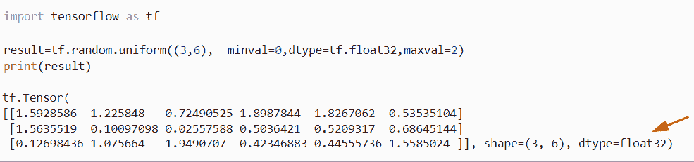
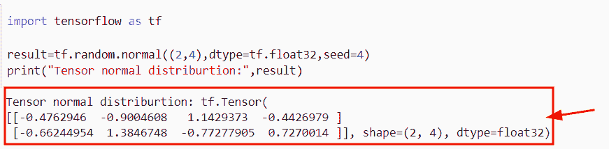
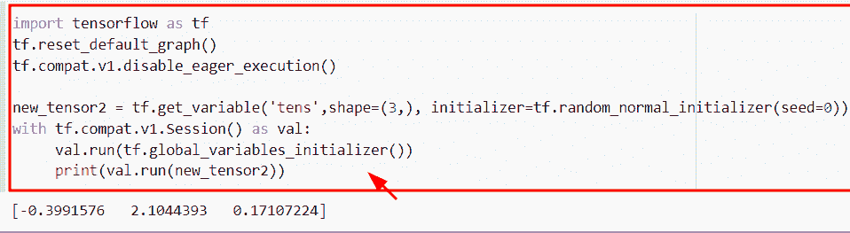
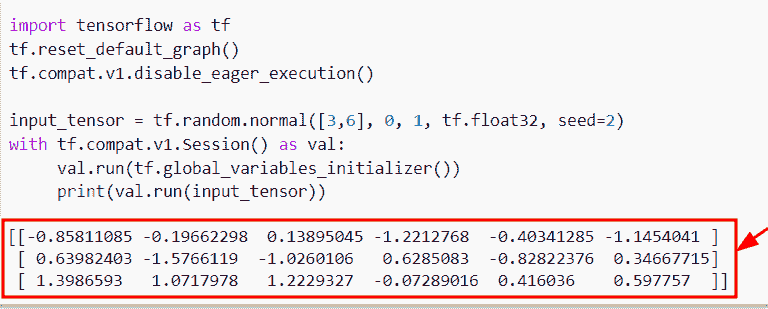
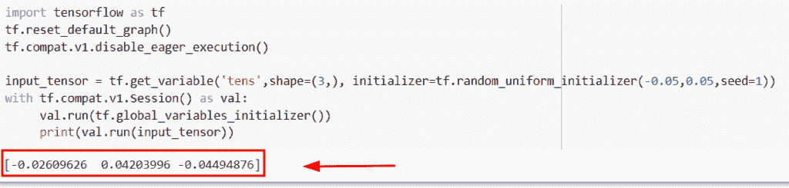
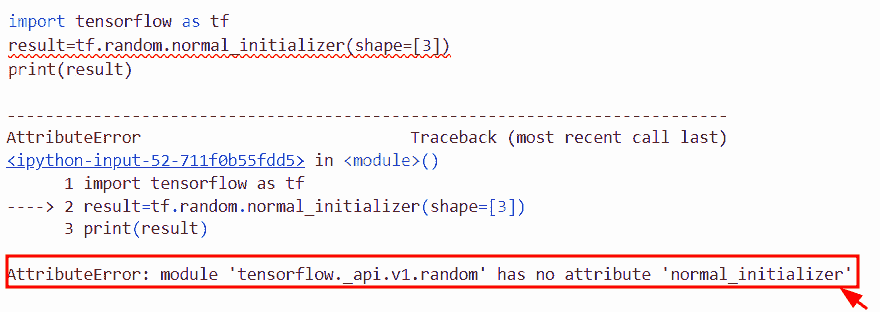
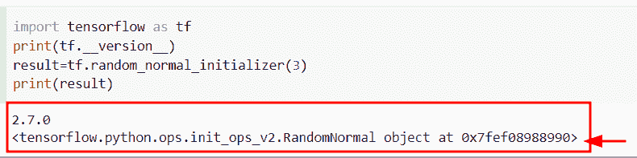
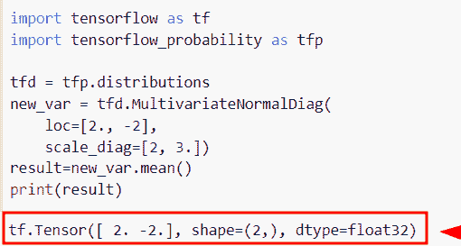
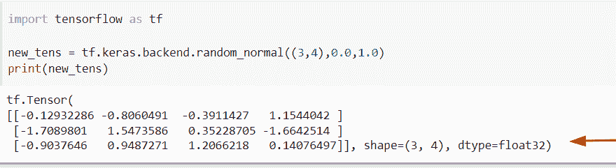
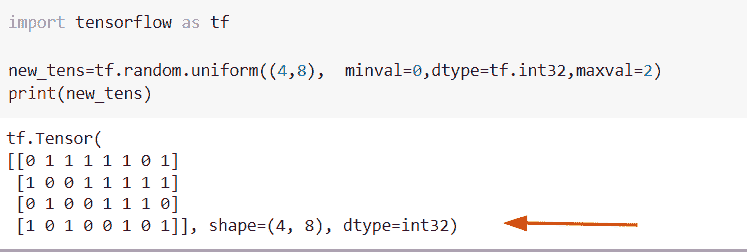

# Python 张量流随机均匀

> 原文：<https://pythonguides.com/tensorflow-random-uniform/>

[](https://sharepointsky.teachable.com/p/python-and-machine-learning-training-course)

在本 [Python 教程](https://pythonguides.com/learn-python/)中，我们将学习**如何在 Python** 中使用 TensorFlow random uniform()。此外，我们将涵盖以下主题。

*   TensorFlow random normal
*   张量流随机正规初始化器
*   张量流随机 _ 正态种子
*   张量流随机均匀初始化器
*   TensorFlow 没有属性“normal_initializer”
*   张量流随机多元正态
*   TensorFlow keras random_normal
*   张量流随机均匀整数

目录

[](#)

*   [Python TensorFlow 随机均匀](#Python_TensorFlow_random_uniform "Python TensorFlow random uniform")
*   [TensorFlow random normal](#TensorFlow_random_normal "TensorFlow random normal")
*   [张量流随机正规初始值设定项](#TensorFlow_random_normal_initializer "TensorFlow random normal initializer")
*   [TensorFlow random_normal 种子](#TensorFlow_random_normal_seed "TensorFlow random_normal seed")
*   [张量流随机均匀初始化器](#TensorFlow_random_uniform_initializer "TensorFlow random uniform initializer")
*   [TensorFlow 没有属性“normal _ initializer”](#TensorFlow_has_no_attribute_normal_initializer "TensorFlow has no attribute ‘normal_initializer’")
*   [张量流随机多元正态](#TensorFlow_random_multivariate_normal "TensorFlow random multivariate normal")
*   [TensorFlow keras random_normal](#TensorFlow_keras_random_normal "TensorFlow keras random_normal")
*   [张量流随机均匀 int](#TensorFlow_random_uniform_int "TensorFlow random uniform int")

## Python TensorFlow 随机均匀

*   在本节中，我们将讨论如何在 Python 中使用`tensor flow random . uniform()`函数。
*   在 [Python TensorFlow](https://pythonguides.com/tensorflow/) 中，随机均匀函数用于生成随机值，这些值将是均匀分布的浮点数。
*   例如，假设您设置了 `2` 和 `3` 之间的范围。通过使用这种方法，您将获得 `2` 和 `3` 之间的所有间隔值。

**语法:**

让我们看一下语法并理解 tensor flow`random . uniform()`函数的工作原理

```py
tf.random.uniform
                 (
                  shape,
                  minval=0,
                  maxval=None,
                  dtype=tf.dtypes.float32,
                  seed=None,
                  name=None
                 )
```

*   它由几个参数组成
    *   **形状:**该参数表示输出张量的形状。
    *   **minval:** 默认取 `0` 值，指定随机值范围的下限。
    *   **maxval:** 默认为 None 值，表示随机值范围的上限。

**举例:**

```py
import tensorflow as tf

result=tf.random.uniform((3,6),  minval=0,dtype=tf.float32,maxval=2)
print(result)
```

下面是下面给出的代码的截图。



Python TensorFlow random uniform

另外，检查: [TensorFlow Tensor to numpy](https://pythonguides.com/tensorflow-tensor-to-numpy/)

## TensorFlow random normal

*   在本节中，我们将学习如何在 Python 中使用 TensorFlow 随机正态函数。
*   在 Python 中，随机正态用于从正态分布中生成值的样本。
*   例如，假设您有一个指定形状的输入张量，一旦您将此函数与形状一起应用，它将返回一个随机值，该值实际上是正态分布的一部分。

**语法:**

让我们看看语法，了解一下 Python 中 TensorFlow 随机正态函数的工作原理。

```py
tf.random.normal
                (
                 shape,
                 mean=0.0,
                 stddev=1.0,
                 dtype=tf.dtypes.float32,
                 seed=None,
                 name=None
                )
```

*   它由几个参数组成
    *   **shape:** 该参数指定返回张量的形状，输入张量必须是一个 `1-d` 整数或者可以使用 `array()` 函数。
    *   **mean:** 默认情况下，取 `0` 值，代表分布的平均值，可选参数。
    *   **stddev:** 该参数表示分布的标准偏差，默认情况下，取 `1.0` 的值。
    *   **dtype:** 默认情况下，它采用 `tf.dtypes.float32()` ，如果您将输入作为整数值，那么它将在输出中返回十进制值。
    *   **种子:**该参数指定声明一个正态分布的随机种子，种子用于生成随机数。
    *   **name:** 缺省取值为 none，可选参数，定义操作的名称。

**举例:**

让我们举个例子，看看如何生成正态分布的随机数。

**源代码:**

```py
import tensorflow as tf

result=tf.random.normal((2,4),dtype=tf.float32,seed=4)
print("Tensor normal distriburtion:",result)
```

下面是以下给定代码的实现。



Python TensorFlow random normal

阅读:[导入错误没有名为 TensorFlow](https://pythonguides.com/import-error-no-module-named-tensorflow/) 的模块

## 张量流随机正规初始值设定项

*   在这一节中，我们将讨论如何在 Python TensorFlow 中使用随机正规初始化函数。
*   为了完成这个任务，我们将使用`TF . random _ normal _ initializer(`)函数，这个函数用于返回用随机值初始化的随机值。

**语法:**

让我们看一下语法，理解 Python 中随机正常初始化函数的工作原理。

```py
tf.random_normal_initializer
                            (
                             mean=0.0,
                             stddev=0.05,
                             seed=None
                            )
```

*   它由几个参数组成。
    *   **平均值:**该参数指定随机值的平均值，输入可以是标量张量，默认情况下取 `0` 值。
    *   **stddev:** 该参数表示随机值 sn 的标准偏差，默认取 `0.05` 值。
    *   **种子:**在 Python 中，种子用于声明随机数，该参数将帮助用户创建随机种子。

**举例:**

让我们举个例子，看看如何在 Python 中用张量初始化一个随机数生成器。

**源代码:**

```py
import tensorflow as tf
tf.reset_default_graph()
tf.compat.v1.disable_eager_execution()

new_tensor2 = tf.get_variable('tens',shape=(3,), initializer=tf.random_normal_initializer(seed=0))
with tf.compat.v1.Session() as val:
     val.run(tf.global_variables_initializer())
     print(val.run(new_tensor2))
```

下面是以下给定代码的执行。



TensorFlow random normal initializer in Python

阅读:[张量流得到形状](https://pythonguides.com/tensorflow-get-shape/)

## TensorFlow random_normal 种子

*   在本节中，我们将讨论如何在 `random_normal()` 函数中使用种子参数。
*   在 Python 中，随机正态用于从正态分布中生成值的样本，在本例中，我们指定了种子参数。

**语法:**

下面是 Python TensorFlow 中 `random_normal()` 函数的语法。

```py
tf.random.uniform
                 (
                  shape,
                  minval=0,
                  maxval=None,
                  dtype=tf.dtypes.float32,
                  seed=None,
                  name=None
                 )
```

> **注:**种子参数表示为正态分布创建一个随机种子，种子用于生成随机数。

**举例:**

让我们举一个例子，检查如何使用种子参数在 TensorFlow 中生成随机值。

**源代码:**

```py
import tensorflow as tf
tf.reset_default_graph()
tf.compat.v1.disable_eager_execution()

input_tensor = tf.random.normal([3,6], 0, 1, tf.float32, seed=2)
with tf.compat.v1.Session() as val:
     val.run(tf.global_variables_initializer())
     print(val.run(input_tensor))
```

在上面的代码中，我们已经导入了 tensorflow 库，然后使用`TF . compat . v1 . disable _ eager _ execution()`函数来创建会话。之后，我们声明了一个变量“input_tensor ”,并指定了 tf.random.normal()函数。

下面是下面给出的代码的截图。



Python TensorFlow random_normal seed

阅读:[模块“张量流”没有属性“会话”](https://pythonguides.com/module-tensorflow-has-no-attribute-session/)

## 张量流随机均匀初始化器

*   在这个程序中，我们将讨论如何在 Python 中使用随机统一初始化函数。
*   该功能将帮助用户生成具有均匀分布的输入张量。

**语法:**

让我们看一下语法，了解一下 Python TensorFlow 中`TF . random _ uniform _ initializer()`函数的工作原理

```py
tf.random_uniform_initializer
                             (
                              minval=-0.05,
                              maxval=0.05,
                              seed=None
                             )
```

*   它由几个参数组成
    *   **minval:** 该参数表示随机值范围的下限，默认取负的 `0.05` 值。
    *   **maxval:** 默认情况下，它取正的 `0.05` 值，并指定随机值范围的上限。
    *   **种子:**该参数用于创建一个随机种子。

**举例:**

让我们举个例子，看看如何生成一个均匀分布的张量

**源代码:**

```py
import tensorflow as tf
tf.reset_default_graph()
tf.compat.v1.disable_eager_execution()

input_tensor = tf.get_variable('tens',shape=(3,), initializer=tf.random_uniform_initializer(-0.05,0.05,seed=1))
with tf.compat.v1.Session() as val:
     val.run(tf.global_variables_initializer())
     print(val.run(input_tensor))
```

下面是以下给定代码的执行过程



Python TensorFlow random uniform initializer

阅读:[Python tensor flow expand _ dims](https://pythonguides.com/tensorflow-expand_dims/)

## TensorFlow 没有属性“normal _ initializer”

这里我们要讨论的是错误属性 error: **TensorFlow 在 Python 中没有属性‘normal _ initializer’**。基本上，当我们没有安装最新版本的 TensorFlow 时，就会出现这个错误。

**原因:**该错误的可能原因是 th`e TF . normal _ initailizer`在 TensorFlow **1 中不可用。x** 版本。

**举例:**

```py
import tensorflow as tf
result=tf.random.normal_initializer(shape=[3])
print(result)
```

下面是以下代码的截图



TensorFlow has no attribute normal_initializer

正如您在截图中看到的，输出显示了 attributeerror 模块**‘tensor flow 没有属性’normal _ initializer**。

以下是此错误的解决方案

**源代码:**

```py
import tensorflow as tf
print(tf.__version__)
result=tf.random_normal_initializer(3)
print(result)
```

下面是以下代码的截图



Solution of TensorFlow has no attribute normal_initializer

正如你在截图中看到的，问题已经解决，我们只是简单地安装了最新版本 **TensorFlow 2。x** 因为这个功能是最新版本才有的。

要检查 TensorFlow 的版本，可以使用下面的命令

```py
import tensorflow as tf
print(tf.__version__)
```

阅读: [Python TensorFlow 截断法线](https://pythonguides.com/tensorflow-truncated-normal/)

## 张量流随机多元正态

*   在本节中，我们将讨论如何在 [Python TensorFlow](https://pythonguides.com/tensorflow/) 中计算多元正态分布。
*   为了执行这一特定任务，我们将使用`TFP . distributions . multivariatenormaldiag()`函数，该函数将帮助用户对正态分布进行多元分析。

**语法:**

让我们看看语法，理解 Python 中多元正态函数的工作原理

```py
tfp.distribution.MultivariateNormalDiag
                                       (
                                        loc=None,
                                        scale_diag=None,
                                       scale_identify_multiplier=None,
                                       validate_args=False,
                                       allow_nan_stats=True,
                                     experimental_use_kahan_sum=False,
                                    )
```

**举例:**

```py
import tensorflow as tf
import tensorflow_probability as tfp

tfd = tfp.distributions
new_var = tfd.MultivariateNormalDiag(
    loc=[2., -2],
    scale_diag=[2, 3.])
result=new_var.mean()
print(result)
```

下面是以下代码的截图



TensorFlow random multivariate normal in Python

阅读:[将列表转换为张量张量流](https://pythonguides.com/convert-list-to-tensor-tensorflow/)

## TensorFlow keras random_normal

*   在本节中，我们将讨论如何在 TensorFlow Python 中使用 Keras.backend.random_normal()函数。
*   为了执行这个特定的任务，我们将使用`TF . keras . back end . random _ normal()`函数，这个方法返回一个元素正态分布的张量。

**语法:**

让我们看看语法，了解一下 t`f . keras . back end . random _ normal()`函数的工作原理。

```py
tf.keras.backend.random_normal
                              (
                               shape,
                               mean=0.0,
                               stddev=1.0,
                               dtype=None,
                               seed=None,
                              )
```

*   它由几个参数组成
    *   **形状:**该参数表示要创建的张量的形状。
    *   **mean:**deafult 取 `0.0` 值，指定正态分布的平均值。
    *   **stddev:** 该参数表示正态分布的标准偏差，默认取 `1.0` 值。

**举例:**

```py
import tensorflow as tf

new_tens = tf.keras.backend.random_normal((3,4),0.0,1.0)
print(new_tens)
```

下面是以下给定代码的实现。



TensorFlow Keras random_normal in Python

读取[张量流乘法](https://pythonguides.com/tensorflow-multiplication/)

## 张量流随机均匀 int

*   在这个程序中，我们将讨论如何在 Python TensorFlow 中的随机统一函数中使用 int 数据类型。
*   为了完成这项任务，我们将生成随机值，这些值将是来自均匀分布的整数。

**举例:**

```py
import tensorflow as tf

new_tens=tf.random.uniform((4,8),  minval=0,dtype=tf.int32,maxval=2)
print(new_tens)
```

在下面给定的代码中，我们导入了 TensorFlow 库，然后使用 t `f.random.uniform()` 函数，并在该函数中设置了 `dtype=tf.int32` 作为参数。一旦执行了这段代码，输出将显示具有 `4` 行和 `8` 列形状的整数随机值。

下面是以下给定代码的输出。



TensorFlow random uniform int in Python

还有，多看看一些 Python TensorFlow 教程。

*   [Tensorflow 获取静态值](https://pythonguides.com/tensorflow-get-static-value/)
*   [TensorFlow Sparse Tensor](https://pythonguides.com/tensorflow-sparse-tensor/)
*   [张量流获取变量](https://pythonguides.com/tensorflow-get-variable/)
*   [Python TensorFlow one_hot](https://pythonguides.com/tensorflow-one_hot/)

在本 Python 教程中，我们学习了**如何使用 TensorFlow random uniform()** 。此外，我们还讨论了以下主题。

*   TensorFlow random normal
*   张量流随机正规初始化器
*   张量流随机 _ 正态种子
*   张量流随机均匀初始化器
*   TensorFlow 没有属性“normal_initializer”
*   张量流随机多元正态
*   TensorFlow keras random_normal
*   张量流随机均匀整数

[Bijay Kumar](https://pythonguides.com/author/fewlines4biju/)

Python 是美国最流行的语言之一。我从事 Python 工作已经有很长时间了，我在与 Tkinter、Pandas、NumPy、Turtle、Django、Matplotlib、Tensorflow、Scipy、Scikit-Learn 等各种库合作方面拥有专业知识。我有与美国、加拿大、英国、澳大利亚、新西兰等国家的各种客户合作的经验。查看我的个人资料。

[enjoysharepoint.com/](https://enjoysharepoint.com/)[](https://www.facebook.com/fewlines4biju "Facebook")[](https://www.linkedin.com/in/fewlines4biju/ "Linkedin")[](https://twitter.com/fewlines4biju "Twitter")