# 张量流稀疏张量+示例

> 原文：<https://pythonguides.com/tensorflow-sparse-tensor/>

[](https://sharepointsky.teachable.com/p/python-and-machine-learning-training-course)

在这个 [Python 教程中，](https://pythonguides.com/learn-python/)我们将学习**如何在 Python TensorFlow** 中使用稀疏张量。此外，我们将涵盖以下主题。

*   TensorFlow sparsetensor to numpy
*   张量流稀疏张量到稠密
*   张量流稀疏张量稠密矩阵
*   张量流稀疏张量乘法
*   张量流稀疏张量切片
*   张量流稀疏张量整形
*   张量流稀疏张量集
*   张量流操纵稀疏张量
*   tensor flow TF . sparse _ tensor _ to _ dense
*   模块“TensorFlow”没有属性“sparse_tensor_dense_matmul”
*   tensorflow 稀疏数据集
*   TensorFlow concat sparse tensor

目录

[](#)

*   [TensorFlow sparse tensor](#TensorFlow_sparse_tensor "TensorFlow sparse tensor")
*   [TensorFlow 稀疏张量到 numpy](#TensorFlow_sparse_tensor_to_numpy "TensorFlow sparse tensor to numpy")
*   [张量流稀疏张量到稠密张量](#TensorFlow_sparse_tensor_to_dense "TensorFlow sparse tensor to dense")
*   [tensor flow sparse _ tensor _ dense _ mat mul](#TensorFlow_sparse_tensor_dense_matmul "TensorFlow sparse_tensor_dense_matmul")
*   [TensorFlow 稀疏张量切片](#TensorFlow_sparse_tensor_slice "TensorFlow sparse tensor slice")
*   [TensorFlow 稀疏张量整形](#TensorFlow_sparse_tensor_reshape "TensorFlow sparse tensor reshape")
*   [TensorFlow 稀疏张量集](#TensorFlow_sparse_tensor_gather "TensorFlow sparse tensor gather")
*   [张量流操纵稀疏张量](#TensorFlow_manipulating_sparse_tensor "TensorFlow manipulating sparse tensor")
*   [tensor flow TF . sparse _ tensor _ to _ dense](#TensorFlow_tfsparse_tensor_to_dense "TensorFlow tf.sparse_tensor_to_dense")
*   [模块' TensorFlow '没有属性' sparse_tensor_dense_matmul'](#Module_TensorFlow_has_no_attribute_sparse_tensor_dense_matmul "Module ‘TensorFlow’ has no attribute ‘sparse_tensor_dense_matmul’")
*   [TensorFlow Concat sparse tensor](#TensorFlow_Concat_sparse_tensor "TensorFlow Concat sparse tensor")
*   [tensorlow 数据集稀疏；](#TensorFlow_dataset_sparsetensor "TensorFlow dataset sparsetensor")

## TensorFlow sparse tensor

*   在本节中，我们将讨论如何在 [Python TensorFlow](https://pythonguides.com/tensorflow/) 中使用稀疏张量。
*   在 TensorFlow 中，稀疏张量能够有效地处理和存储包含大部分零值的张量，它还用于自然语言处理应用和计算机视觉应用中预处理具有暗像素的图像。
*   为了执行这个特定的任务，我们将使用 `tf.sparse.SparseTensor()` 函数，这个函数用于表示一个稀疏张量。

**语法:**

让我们看看语法，了解一下`TF . sparse . sparsesensor()`在 Python TensorFlow 中的工作原理。

```py
tf.sparse.SparseTensor(
    indices, values, dense_shape
)
```

*   它由几个参数组成。
    *   **索引:**该参数表示存储非零值的稀疏张量中的值的索引，例如**索引=[[2，9]，[15，14]]** 表示带有索引的值具有非零值。
    *   **值:**该参数指定输入张量和形状，为索引中的每个元素提供值。
    *   **dense_shape:** 它指定稀疏张量的密集形状，并且它还指定每个维度中的值的数量。假设你有一个密集的**形状=[2，4]** ，表示一个二维的 `2*4` 。

**举例:**

我们举个例子，检查一下**如何在 Python TensorFlow 中使用稀疏张量。**

**源代码:**

```py
import tensorflow as tf

indices=[[1, 0], [0, 1]]
values=[2, 3]
dense_shape=[3, 4]
result=tf.sparse.SparseTensor(indices, values, dense_shape)
print(result)
```

在下面的代码中，我们导入了 TensorFlow 库，然后以列表的形式创建了索引和密集形状值。

之后，我们使用了 `tf.sparse.SparseTensor()` 函数，在这个函数中，我们已经指定了索引和 `dense_shape()` 值作为参数。

下面是下面给出的代码的截图。

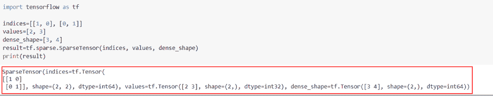

TensorFlow sparse tensor

阅读: [TensorFlow Tensor to numpy](https://pythonguides.com/tensorflow-tensor-to-numpy/)

## TensorFlow 稀疏张量到 numpy

*   在这个例子中，我们将讨论如何将稀疏张量值转换为 numpy。为了完成这项任务，我们将使用 `eager_execution()` 函数来运行会话。
*   首先，我们将导入 TensorFlow 库，然后我们将使用 t `f.compat.v1.Session()` 函数创建会话，然后使用 `tf.sparse tensor()` 函数。

**举例:**

我们举个例子，检查一下**如何将稀疏张量值转换成 numpy。**

**源代码:**

```py
import tensorflow as tf

tf.compat.v1.disable_eager_execution()
with tf.compat.v1.Session() as val:
    new_output = val.run(tf.SparseTensor([[2,3],[45,33]],[12,24],[3,2]))
    print(new_output)
```

在上面的代码中，我们导入了 TensorFlow 库，然后通过使用 `tf.sparseTensor()` 函数创建了一个稀疏张量，并在这个函数中，我们指定了整数值。

下面是以下给定代码的实现。

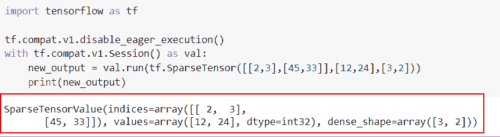

Tensorflow sparse tensor to numpy in python

阅读:[将列表转换为张量张量流](https://pythonguides.com/convert-list-to-tensor-tensorflow/)

## 张量流稀疏张量到稠密张量

*   在本节中，我们将讨论如何在 Python TensorFlow 中将稀疏张量转换为稠密张量。
*   为了完成这项任务，我们将使用 `tf.sparse.to_dense(` )函数，该函数将帮助用户将稀疏张量转换为密集张量。

**语法:**

下面是 Python TensorFlow 中 `tf.sparse.to_dense()` 函数的语法。

```py
tf.sparse.to_dense(
    sp_input, default_value=None, validate_indices=True, name=None
)
```

*   它由几个参数组成。
    *   **sp_input:** 该参数表示输入稀疏张量。
    *   **default_value:** 默认情况下，它采用 None 值，并将为 sp_input 中未给定的索引进行设置。
    *   **validate _ indexes:**这是一个布尔值，如果为真，则检查索引，没有重复值。
    *   **name:** 默认情况下，取 none 值，指定操作的名称。

**举例:**

我们举个例子，检查一下**如何在 Python TensorFlow 中将稀疏张量转化为稠密张量。**

**源代码:**

```py
import tensorflow as tf

tens = tf.SparseTensor(dense_shape=[3, 5],values=[4, 2, 1],indices =[[0, 1],
            [0, 3],
            [2, 0]])
result=tf.sparse.to_dense(tens).numpy()
print(result)
```

在下面给定的代码中，我们导入了 TensorFlow 库，然后为了将稀疏张量转换为密集张量，我们使用了 `tf.sparse.to_dense()` 函数。

下面是以下给定代码的实现。

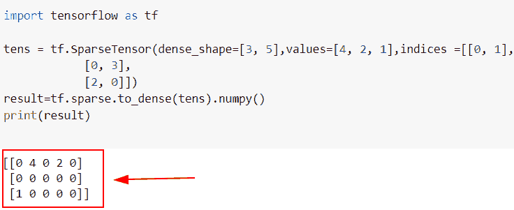

TensorFlow sparse tensor to dense

阅读:[Python tensor flow expand _ dims](https://pythonguides.com/tensorflow-expand_dims/)

## tensor flow sparse _ tensor _ dense _ mat mul

*   在本节中，我们将讨论如何在 Python TensorFlow 中乘以稀疏张量。
*   为了完成这项任务，我们将使用`TF . sparse . sparse _ dense _ matmul()`函数，该方法用于将稀疏张量乘以密集张量。

**语法:**

我们先来看看语法，了解一下`TF . sparse . sparse _ dense _ mat mul()`函数在 Python TensorFlow 中的工作原理。

```py
tf.sparse.sparse_dense_matmul(
    sp_a, b, adjoint_a=False, adjoint_b=False, name=None
)
```

*   它由几个参数组成
    *   **sp_a:** 该参数表示稀疏张量 `A` 。
    *   **b:** 是数据类型相同的稠密张量。
    *   **伴随 _a:** 默认情况下取一个假值，用于张量 a 的伴随。
    *   **name:** 默认情况下，取 none 值，指定操作的名称。

**举例:**

我们举个例子，检查一下**Python tensor flow 中的稀疏张量如何相乘。**

**源代码:**

```py
import tensorflow as tf

new_tens = tf.SparseTensor(indices=([1, 0], [0, 1], [0, 1]),
                       values=[67, 56, 74],
                       dense_shape=(2,2))

tensor = tf.constant([[2], [3]])
new_result = tf.sparse.sparse_dense_matmul(new_tens, tensor)

print(new_result)
```

下面是以下代码的截图

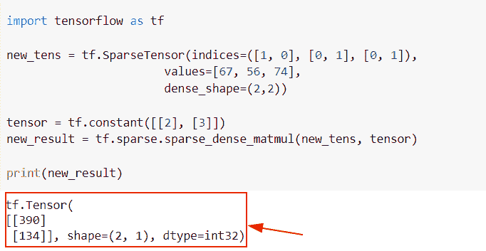

TensorFlow sparse_tensor_dense_matmul

阅读: [Python TensorFlow 截断法线](https://pythonguides.com/tensorflow-truncated-normal/)

## TensorFlow 稀疏张量切片

*   在这个例子中，我们将讨论如何在 Python TensorFlow 中对稀疏张量进行切片。
*   为了完成这项任务，我们将使用 `tf.sparse.slice()` 函数，该函数用于根据大小和起点对稀疏张量进行切片。

**语法:**

下面是 Python TensorFlow 中 `tf.sparse.slice()` 函数的语法。

```py
tf.sparse.slice(
    sp_input, start, size, name=None
)
```

*   它由几个参数组成。
    *   **sp_input:** 该参数表示输入稀疏张量。
    *   **开始:**表示切片的开始
    *   **大小:**该参数指定了张量的大小。
    *   **name:** 可选参数，指定操作的名称。

**举例:**

让我们举个例子，检查一下**如何在 Python TensorFlow 中对一个稀疏张量进行切片。**

**源代码:**

```py
import tensorflow as tf

indices=[[1, 0], [0, 1]]
values=[2, 3]
dense_shape=[3, 4]
result=tf.sparse.SparseTensor(indices, values, dense_shape)
print(result)
```

下面是下面给出的代码的截图。

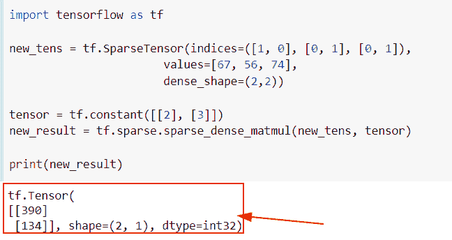

TensorFlow sparse tensor slice

阅读: [Python TensorFlow one_hot](https://pythonguides.com/tensorflow-one_hot/)

## TensorFlow 稀疏张量整形

*   在本节中，我们将讨论如何在 Python TensorFlow 中重塑稀疏张量。
*   为了完成这项任务，我们将使用`TF . sparse . shape(`)方法，该方法用于在新的密集形状中表示值，并指定给定稀疏张量的整形。

**语法:**

下面是 Python TensorFlow 中`TF . sparse . shape()`函数的语法。

```py
tf.sparse.reshape(
    sp_input, shape, name=None
)
```

*   它由几个参数组成。
    *   **sp_input:** 该参数表示输入稀疏张量。
    *   **形状:**表示稀疏张量的形状。
    *   **名称:**默认情况下，取值为 none，表示操作的名称。

**举例:**

我们举个例子，检查一下**如何在 Python TensorFlow 中重塑稀疏张量。**

**源代码:**

```py
import tensorflow as tf
tf.compat.v1.disable_eager_execution()

new_tensor = tf.SparseTensor(indices=[[14, 25], [17, 44]],
                      values=[22, 31],
                      dense_shape=[3, 10])
result=tf.sparse.reshape(new_tensor,shape=[3,10])
with tf.compat.v1.Session() as val:
    new_output=val.run(result)
    print("Reshape of sparse tensor:",new_output)
```

在上面的代码中，我们使用了 TF . sparse . shape()函数来获得稀疏张量的整形，在这个函数中，我们将张量指定为一个参数。

下面是以下给定代码的执行。

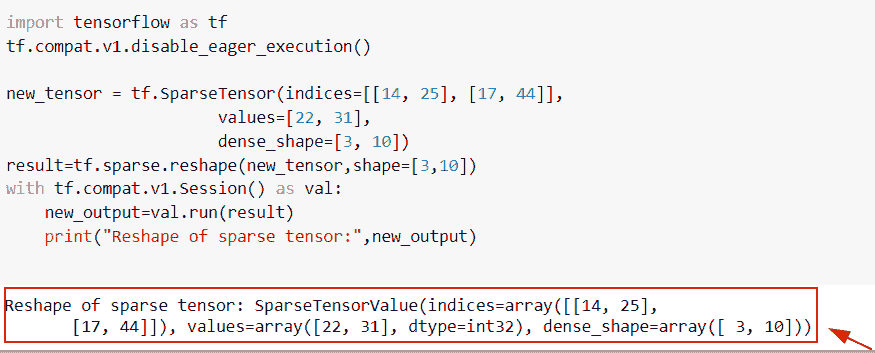

TensorFlow sparse Tensor reshape

阅读: [Python TensorFlow 随机均匀](https://pythonguides.com/tensorflow-random-uniform/)

## TensorFlow 稀疏张量集

*   在这个例子中，我们将讨论如何在 Python TensorFlow 中收集稀疏张量。
*   为了执行这个特定的任务，我们将创建一个稀疏张量，然后我们将使用 `tf.gather()` 函数。
*   该函数用于根据给定的索引分解输入张量。

**语法:**

我们先来看看语法，了解一下 `tf.gather()` 函数在 Python TensorFlow 中的工作原理。

```py
tf.gather(
    params,
    indices, 
    validate_indices=None, 
    axis=None, 
    batch_dims=0, 
    name=None
)
```

*   它由几个参数组成。
    *   **params:** 该参数表示我们要收集的张量值秩必须至少为秩**轴+1** 。
    *   **索引:**该参数指定输入张量的索引，其值必须在**【0，params】**的范围内。
    *   **name:** 默认情况下，它不取值，并指定操作的名称。

**举例:**

我们举个例子，检查一下**如何在 Python TensorFlow 中聚集稀疏的` `张量。**

**源代码:**

```py
import tensorflow as tf
tf.compat.v1.disable_eager_execution()

new_tens1 = tf.SparseTensor(indices=[[1, 3], [2, 1]],
                       values=[56, 25], 
                       dense_shape=[4, 10])

new_tens2 = tf.SparseTensor(indices=[[1, 1], [5, 2]],
                       values=[15, 28],
                       dense_shape=[4, 10])

result = tf.gather(new_tens1, new_tens2)

with tf.compat.v1.Session() as val:
    new_output=val.run(result)
    print("Manipulate sparse tensor:",new_output)
```

你可以参考下面的截图

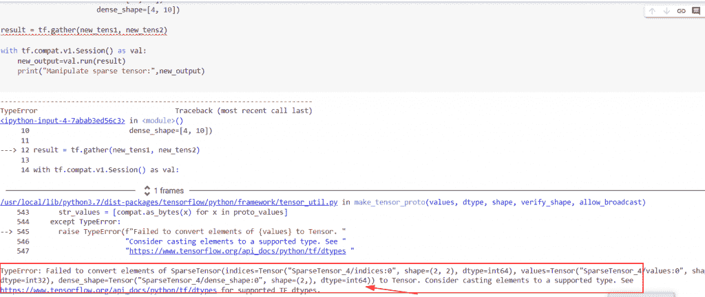

TensorFlow sparse tensor gather

正如您在屏幕截图中看到的，输出显示错误，表明 tf.gather 不支持将稀疏张量作为输入。

阅读:[Python tensor flow reduce _ mean](https://pythonguides.com/python-tensorflow-reduce_mean/)

## 张量流操纵稀疏张量

*   在这个例子中，我们将操作 Python TensorFlow 中的稀疏张量。
*   为了执行这个特定的任务，我们将使用像 `tf.math.add()` 函数这样的数学运算，在这个例子中，我们将添加一个具有相同形状和大小的稀疏张量。

**举例:**

我们举个例子，检查一下**如何在 Python TensorFlow 中操作稀疏张量。**

**源代码:**

```py
import tensorflow as tf
tf.compat.v1.disable_eager_execution()

new_tens1 = tf.SparseTensor(indices=[[1, 3], [2, 1]],
                       values=[56, 25], 
                       dense_shape=[4, 10])

new_tens2 = tf.SparseTensor(indices=[[1, 1], [5, 2]],
                       values=[15, 28],
                       dense_shape=[4, 10])

result = tf.sparse.add(new_tens1, new_tens2)
with tf.compat.v1.Session() as val:
    new_output=val.run(result)
    print("Manipulate sparse tensor:",new_output)
```

在下面给出的代码中，我们使用了 `tf.sparse.add()` 函数来操作稀疏张量，然后使用了 `tf.compat.v1.Session()` 来创建会话。

下面是以下给定代码的实现

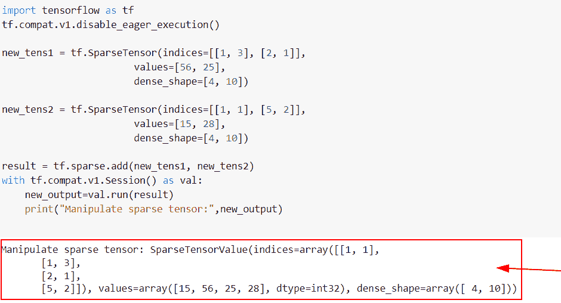

TensorFlow manipulating sparse tensor

阅读:[Python tensor flow reduce _ sum](https://pythonguides.com/python-tensorflow-reduce_sum/)

## tensor flow TF . sparse _ tensor _ to _ dense

*   在本节中，我们将讨论如何在 Python TensorFlow 中使用`TF . sparse _ tensor _ to _ dense`函数。
*   该函数用于将稀疏张量转换为稠密张量。在 Python TensorFlow 中，稀疏张量用于存储大量零值，并广泛用于编码方案中。而在密集张量的情况下，它们用于以连续存储块的形式存储值。

**语法:**

我们先来看看语法，了解一下`TF . sparse _ tensor _ to _ dense()`在 Python TensorFlow 中的工作原理。

```py
tf.sparse.to_dense(
    sp_input, default_value=None, validate_indices=True, name=None
)
```

*   它由几个参数组成
    *   **sp_input:** 该参数表示输入稀疏张量。
    *   **default_value:** 默认情况下，它采用 None 值，并将为 sp_input 中未给定的索引进行设置。
    *   **validate _ indexes:**这是一个布尔值，如果为真，则检查索引，没有重复值。
    *   **name:** 默认情况下，取 none 值，指定操作的名称。

**举例:**

我们举个例子，检查一下**如何在 Python TensorFlow 中将稀疏张量转换成稠密张量。**

**源代码:**

```py
import tensorflow as tf
tf.compat.v1.disable_eager_execution()

tens = tf.SparseTensor(dense_shape=[3, 5],values=[56, 13, 26],indices =[[0, 1],
            [0, 3],
            [2, 0]])
result=tf.sparse.to_dense(tens)

with tf.compat.v1.Session() as val:
    new_output=val.run(result)
    print("Sparse dense tensor:",new_output)
```

在上面的代码中，我们已经导入了 TensorFlow 库，然后我们使用了 **tf。SparseTensor()** 函数，在这个函数中，我们指定了 `dens_shape()` 和索引值作为参数。

之后，我们使用 `tf.sparse.to_dense()` 函数将稀疏张量转换为稠密张量。

下面是以下给定代码的执行。

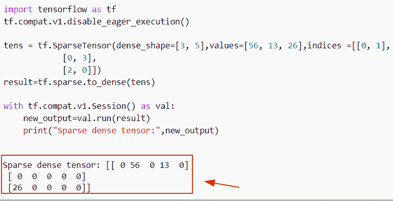

TensorFlow tf sparse_tensor_to_dense

阅读:[导入错误没有名为 TensorFlow](https://pythonguides.com/import-error-no-module-named-tensorflow/) 的模块

## 模块' TensorFlow '没有属性' sparse_tensor_dense_matmul'

这里我们要讨论的是错误模块**‘tensor flow’没有属性‘sparse _ tensor _ dense _ mat mul’。**

这个错误背后的原因是`TF . sparse _ tensor _ dense _ mat mul()`函数在 TensorFlow 中不支持。

**举例:**

```py
import tensorflow as tf
tf.compat.v1.disable_eager_execution()

tens = tf.SparseTensor(dense_shape=[3, 3],values=[56, 13, 26],indices =[[0, 1],
            [0, 3],
            [2, 0]])
new_tens=tf.ones(shape=[3,3],dtype=tf.int32)
result=tf.sparse.tensor_dense_matmul(tens,new_tens)

with tf.compat.v1.Session() as val:
    new_output=val.run(result)
    print("Sparse dense tensor:",new_output)
```

下面是下面给出的代码的截图。

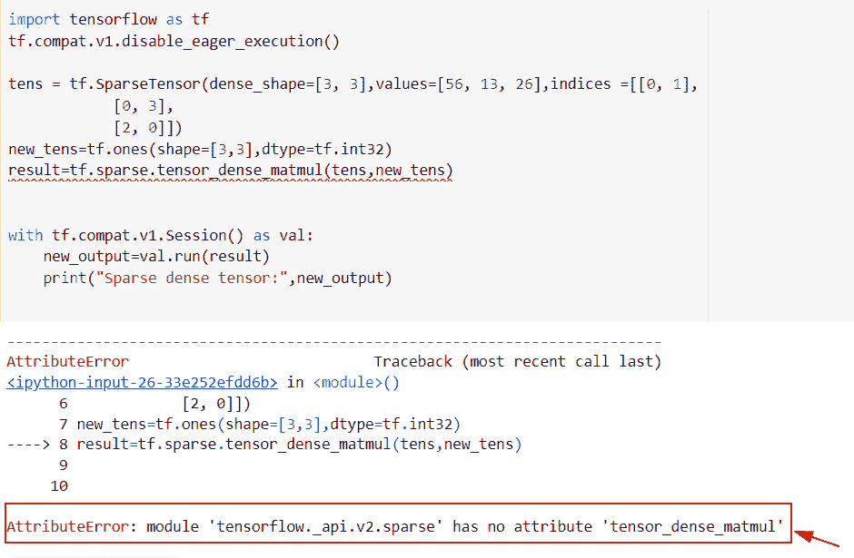

module TensorFlow has no attribute sparse_tensor_dense_matmul

**解决方案:**

以下是此错误的解决方案

在本例中，我们将使用`TF . sparse . sparse _ dense _ mat mul()`函数对稀疏张量和密集张量进行乘法运算。

```py
import tensorflow as tf
tf.compat.v1.disable_eager_execution()

tens = tf.SparseTensor(dense_shape=[3, 3],values=[56, 13, 26],indices =[[0, 1],
            [0, 3],
            [2, 0]])
new_tens=tf.ones(shape=[3,3],dtype=tf.int32)
result=tf.sparse.sparse_dense_matmul(tens,new_tens)
print(result)
```

在上面的代码中，我们导入了 tensorflow 库，然后使用 t `f.sparseTensor()` 函数创建稀疏张量，然后使用 `tf.ones()` 函数创建密集形状。

之后我们使用了`TF . sparse . sparse _ dense _ mat mul()`函数。在这个函数中，我们指定了稠密张量和稀疏张量作为自变量。

下面是以下给定代码的实现。

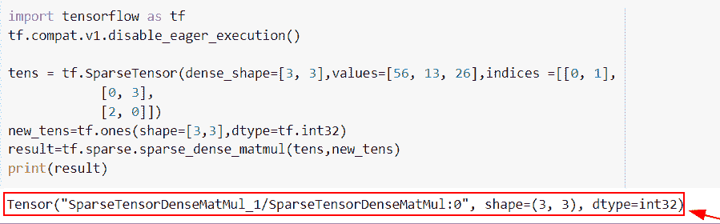

Solution of module TensorFlow has no attribute sparse_tensor_dense_matmul

阅读:[二元交叉熵张量流](https://pythonguides.com/binary-cross-entropy-tensorflow/)

## TensorFlow Concat sparse tensor

*   在本节中，我们将讨论如何在 Python TensorFlow 中连接稀疏张量。
*   为了完成这项任务，我们将使用 `tf.sparse.concat()` 函数，该函数用于将稀疏张量列表与给定的维度组合在一起。

**语法:**

我们来看一下语法，了解一下 `tf.sparse.concat()` 在 Python TensorFlow 中的工作原理。

```py
tf.sparse.concat(
    axis, sp_inputs, expand_nonconcat_dims=False, name=None
)
```

*   它由几个参数组成
    *   **轴:**该参数表示稀疏张量的维数，也指定了要组合的维数。
    *   **sp_inputs:** 该参数表示输入稀疏张量。
    *   **expand _ non cat _ dims:**默认情况下，它接受一个假值，并且它将检查是否允许非连接维度的条件。
    *   **name:** 默认情况下，取 none 值，指定操作的名称。

**举例:**

我们举个例子，检查一下**如何在 Python TensorFlow 中串联稀疏张量。**

**源代码:**

```py
import tensorflow as tf
tf.compat.v1.disable_eager_execution()
input_tens1 = tf.SparseTensor(indices = [[1,2], [3,2], [1,4], [2,4], [2,3], [4,3]],
                         values = [45,12,3,45,6,8],
                         dense_shape = [8,5])
input_tens2 = tf.SparseTensor(indices = [[2,1], [3,1], [1,3], [2,0], [2,4], [2,5], [3,5], 
                                              [4,5], [5,0], [5,4], [5,5], [6,1], [6,3], [7,2]],
                         values = [67,15,14,21,78,44,23,19,27,34,19,45,96,45],
                         dense_shape = [8,6])
new_list = [input_tens1,input_tens2]
concat_sparse = tf.sparse.concat(axis=1, sp_inputs=new_list)
result=tf.sparse.to_dense(concat_sparse)
with tf.compat.v1.Session() as val:
    new_output=val.run(result)
    print("Concat of two tensors:",new_output)
```

在下面给出的代码中，我们导入了 TensorFlow 库，然后创建了稀疏张量列表，并将它们存储到一个**‘new _ list’**变量中。之后，我们使用 `tf.sparse.concat()` 函数来连接稀疏张量。

下面是以下给定代码的实现

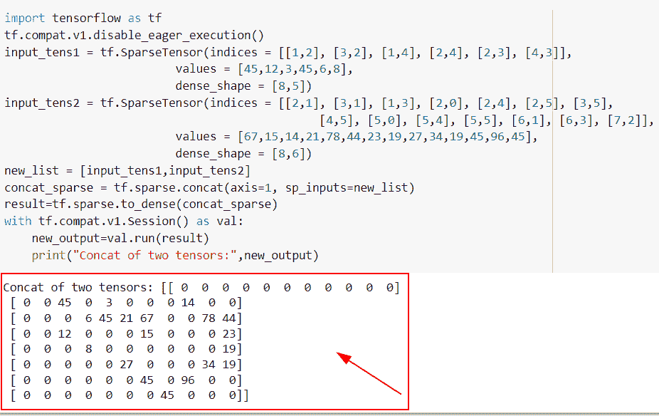

TensorFlow concat sparse tensor

阅读:[张量流 clip_by_value](https://pythonguides.com/tensorflow-clip_by_value/)

## tensorlow 数据集稀疏；

*   在本节中，我们将使用 Python TensorFlow 讨论稀疏张量中的数据集。
*   为了执行这个特定的任务，我们将使用`TF . data . dataset . from _ tensor _ slices()`函数，当我们有大量的值或元素时，就会使用这个函数。
*   首先，我们将通过使用 **tf 来创建稀疏张量。SparseTensor()** 在这个函数中，我们将指定索引和 `dense_shape` 值作为参数。

**语法:**

我们先来看看语法，了解一下 `tf.data.Dataset()` 在 Python TensorFlow 中的工作原理。

```py
tf.data.Dataset(
    variant_tensor
)
```

*   它只包含一个参数
    *   **variant_tensor:** 该参数表示数据集，是一个 `DT_Variant` 张量。

**举例:**

我们举个例子，检查一下**如何在稀疏张量**中使用 dataset 函数。

**源代码:**

```py
import tensorflow as tf
tf.compat.v1.disable_eager_execution()

input_tens1 = tf.SparseTensor(indices = [[1,2], [3,2], [1,4], [2,4], [2,3], [4,3]],
                         values = [45,12,3,45,6,8],
                         dense_shape = [8,5])
dataset = tf.data.Dataset.from_tensor_slices(input_tens1)
for element in dataset: 
  print(element)
```

在上面的代码中，我们迭代了数据集并处理了值。之后，我们使用了`TF . data . dataset . from _ tensor _ slices()`函数，在这个函数中，我们将稀疏张量指定为一个参数。

你可以参考下面的截图。

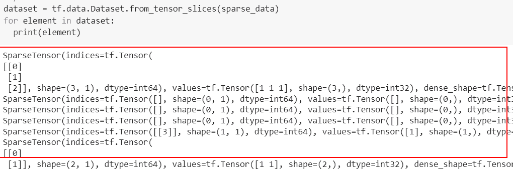

TensorFlow dataset sparsetensor

还有，多看看一些 TensorFlow 教程。

*   [张量低乘法](https://pythonguides.com/tensorflow-multiplication/)
*   [张量流获取变量](https://pythonguides.com/tensorflow-get-variable/)
*   [张量流占位符](https://pythonguides.com/tensorflow-placeholder/)
*   [张量流均方误差](https://pythonguides.com/tensorflow-mean-squared-error/)
*   [张量流自定义损失函数](https://pythonguides.com/tensorflow-custom-loss-function/)

所以，在这个 Python 教程中， [](https://pythonguides.com/learn-python/) 我们学习了**如何使用 Python TensorFlow** 中的稀疏张量。此外，我们还讨论了以下主题。

*   TensorFlow sparsetensor to numpy
*   张量流稀疏张量到稠密
*   张量流稀疏张量稠密矩阵
*   张量流稀疏张量乘法
*   张量流稀疏张量切片
*   张量流稀疏张量整形
*   张量流稀疏张量集
*   张量流操纵稀疏张量
*   tensor flow TF . sparse _ tensor _ to _ dense
*   模块“TensorFlow”没有属性“sparse_tensor_dense_matmul”
*   tensorflow 稀疏数据集
*   TensorFlow concat sparse tensor

[Bijay Kumar](https://pythonguides.com/author/fewlines4biju/)

Python 是美国最流行的语言之一。我从事 Python 工作已经有很长时间了，我在与 Tkinter、Pandas、NumPy、Turtle、Django、Matplotlib、Tensorflow、Scipy、Scikit-Learn 等各种库合作方面拥有专业知识。我有与美国、加拿大、英国、澳大利亚、新西兰等国家的各种客户合作的经验。查看我的个人资料。

[enjoysharepoint.com/](https://enjoysharepoint.com/)[](https://www.facebook.com/fewlines4biju "Facebook")[](https://www.linkedin.com/in/fewlines4biju/ "Linkedin")[](https://twitter.com/fewlines4biju "Twitter")