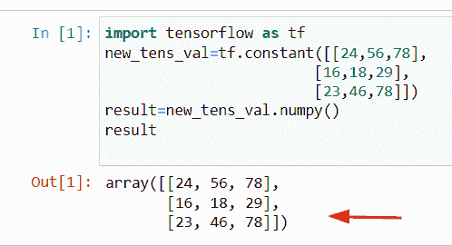

# numpy 的张量流张量

> 原文：<https://pythonguides.com/tensorflow-tensor-to-numpy/>

[](https://sharepointsky.teachable.com/p/python-and-machine-learning-training-course)

在这个 [Python 教程](https://pythonguides.com/learn-python/)中，我们将学习**如何将 Tensorflow 张量转换为 NumPy 数组**。此外，我们将涵盖以下主题。

*   没有会话的 numpy 数组的张量流张量
*   张量流渴望张量到 numpy
*   TensorFlow 2 张量到 numpy
*   张量流变换张量到 numpy 阵列
*   张量流稀疏张量到 numpy
*   张量流张量与 numpy 数组

目录

[](#)

*   [Tensorflow Tensor to numpy](#Tensorflow_Tensor_to_numpy "Tensorflow Tensor to numpy")
*   [TensorFlow 张量到 numpy 数组，无会话](#TensorFlow_tensor_to_numpy_array_without_session "TensorFlow tensor to numpy array without session ")
*   [TensorFlow 渴望张量到 numpy](#TensorFlow_eager_tensor_to_numpy "TensorFlow eager tensor to numpy")
*   [TensorFlow 2 张量到 numpy](#TensorFlow_2_tensor_to_numpy "TensorFlow 2 tensor to numpy")
*   [Tensorflow 变换张量为 numpy 数组](#Tensorflow_transform_tensor_to_numpy_array "Tensorflow transform tensor to numpy array")
*   [Tensorflow 稀疏张量到 numpy](#Tensorflow_sparse_tensor_to_numpy "Tensorflow sparse tensor to numpy")
*   [Tensorflow 张量 vs numpy 数组](#Tensorflow_tensor_vs_numpy_array "Tensorflow tensor vs numpy array")

## Tensorflow Tensor to numpy

*   本节我们将学习 [TensorFlow Python](https://pythonguides.com/tensorflow/) 中张量到 numpy 数组的转换。
*   在 Tensorflow `2.0` 、 `tf.session()` 模块被移除，我们将使用`TF . compat . v1 . disable _ eager _ execution()`来运行会话，而不是会话。为了将张量转换成 numpy 数组，首先我们将导入 `eager_execution` 函数以及 TensorFlow 库。
*   接下来，我们将使用 `tf.constant()` 函数创建常量值，然后我们将使用 `eval()` 函数中的语法`session = TF . compat . v1 . session()`运行会话。

**举例:**

```py
import tensorflow as tf
tf.compat.v1.disable_eager_execution()
new_val = tf.constant([[15,78,24],[17,27,39]])
new_result = new_val.eval(session=tf.compat.v1.Session())
new_result
```

下面是以下给定代码的实现


Tensorflow Tensor to numpy

阅读:[Python tensor flow reduce _ sum](https://pythonguides.com/python-tensorflow-reduce_sum/)

## TensorFlow 张量到 numpy 数组，无会话

*   在本节中，我们将学习如何在 Tensorflow Python 中不带会话地转换带有 numpy 数组的张量。
*   为了完成这项任务，我们将首先使用**。张量中的 numpy()** 函数，这是一个内置的方法，它将帮助用户将张量转换成 numpy 数组。
*   现在首先创建一个张量，我们将导入 TensorFlow 库，然后声明一个变量。接下来，我们将使用 `tf.constant()` 函数来创建一个常数值张量。通过使用 `new_tens_val.numpy()` 函数，您可以很容易地获得 numpy 数组的值。

**语法:**

让我们看一下语法并理解 `tf.constant()` 函数的工作原理

```py
tf.constant
           (
            value,
            dtype=None,
            shape=None,
            name='const'
           )
```

**举例:**

让我们举个例子，看看如何在没有会话的情况下，在 Tensorflow Python 中将张量转换成一个 [numpy 数组](https://pythonguides.com/python-numpy-array/)

**源代码:**

```py
import tensorflow as tf
new_tens_val=tf.constant([[24,56,78],
                        [16,18,29],
                        [23,46,78]])
result=new_tens_val.numpy()
result
```

下面是以下代码的截图



TensorFlow Tensor to NumPy without session

正如您在屏幕截图中看到的，输出显示了 NumPy 数组。

阅读:[张量流得到形状](https://pythonguides.com/tensorflow-get-shape/)

## TensorFlow 渴望张量到 numpy

*   这里我们要讨论的是如何利用 `eager_execution()` 函数将 TensorFlow 中的张量转换为 numpy 数组。
*   这个函数不用于图形，它主要计算张量的值，它支持 **TPU 和 GPU** 。如果你正在使用 TensorFlow `2.0` 版本，那么它可以很容易地在程序上工作。
*   为了创建会话，我们将使用`session = TF . compat . v1 . session()`语法，它将帮助用户将张量值转换为 numpy 数组，但首先您必须导入`TF . compat . v1 . disable _ eager _ execution()`函数。

**源代码:**

```py
import tensorflow as tf
tf.compat.v1.disable_eager_execution()
values = tf.constant([[23,34,96],[27,99,89]])
output = values.eval(session=tf.compat.v1.Session())
output
```

下面是以下给定代码的执行过程


TensorFlow eager tensor to NumPy

阅读:[Python tensor flow reduce _ mean](https://pythonguides.com/python-tensorflow-reduce_mean/)

## TensorFlow 2 张量到 numpy

*   在这个例子中，我们将学习如何在 TensorFlow `2.0` 版本中用 numpy 转换张量。
*   为了执行这个特定的任务，我们将使用 tf.make_tensor_proto()方法。该方法将帮助用户从张量中获取 numpy 数组，该方法在 Tensorflow `2.0` 中可用。如果你正在使用 TensorFlow `1.x` 的旧版本，那么你可以很容易地使用 `eval()` 或 `session()` 函数。
*   在本例中，我们创建了 `tensorproto` ，它是一个具有特定类型和形状的对象，它将检查形状值是否为 none 的条件，然后指定 numpy 数组。

**语法:**

让我们看一下语法，理解一下 `tf.make_tensor_proto()` 方法的工作原理

```py
tf.make_tensor_proto
                    (
                     values,
                     dtype=None,
                     shape=None,
                     verify_shape=False,
                     allow_broadcast=False
                    )
```

*   它由几个参数组成
    *   **值:**该参数表示我们必须在该方法中插入的值。
    *   **dtype:** 默认不取值，可选参数，用 `tensor_pb2` 表示。
    *   **形状:**该参数指定张量的维数。
    *   **verify_shape:** 默认取**‘False’**值，验证值的形状。

**举例:**

```py
import tensorflow as tf

new_val = tf.constant([[25,37,89],[56,14,90]])
result = tf.make_tensor_proto(new_val)
d=tf.make_ndarray(result)
d
```

在下面给出的代码中，我们使用了 `tf.constant()` 函数作为常量值，然后我们声明了一个名为**‘结果’**的变量，并分配了 `tf.make_tensor_proto()` 函数。一旦执行了这段代码，输出将显示张量到 numpy 数组的转换。

下面是以下给定代码的输出


TensorFlow 2 tensor to NumPy

阅读:[导入错误没有名为 TensorFlow](https://pythonguides.com/import-error-no-module-named-tensorflow/) 的模块

## Tensorflow 变换张量为 numpy 数组

*   在这里，我们将学习如何用 TensorFlow Python 中的 numpy 数组来转换张量。
*   为了执行这个特定的任务，我们将使用**。numpy()** 函数，该方法在 TensorFlow 模块包中可用。在这个例子中，我们将创建一个张量对象，然后我们将应用 `tensor.numpy()` 函数。

**举例:**

```py
import tensorflow as tf

cons_values=tf.constant([[14,28,48],
                        [67,92,189],
                        [45,98,178]]) #tensor object
new_output=cons_values.numpy()
new_output
```

在上面的例子中，cons_values 表示张量对象，我们在其中分配了 `tf.constant()` 函数，并且在这个函数中，我们传递了整数值。

之后，我们声明了一个名为**‘new _ output’**的变量，并指定 t `ensor.numpy()` 函数。一旦你打印了**‘new _ output’**，结果就会显示 NumPy 数组。

下面是以下给定代码的实现


Tensorflow transform tensor to numpy array

正如您在截图中看到的，张量值已经被转换成一个 numpy 数组。

阅读: [Python TensorFlow one_hot](https://pythonguides.com/tensorflow-one_hot/)

## Tensorflow 稀疏张量到 numpy

*   在这个程序中，我们将学习如何在 TensorFlow Python 中将稀疏张量转换为 numpy 数组。
*   在 Python 中，备用张量存储了许多零元素，为了在张量中包含零值，我们必须以一种存储方式来存储它们。当我们在自然语言处理中工作时，会使用这种方法。在这个函数中，我们不会对非零值进行编码。
*   而在密集张量的情况下，最大值是非零的，并且与稀疏张量相比，它在索引中更快。
*   在这个例子中，我们将讨论如何将稀疏张量值转换为 numpy。为了完成这项任务，我们将使用 `eager_execution()` 函数来运行会话。

**语法:**

让我们看一下语法，了解一下 Python 中`TF . sparse . sparsesensor()`函数的工作原理。

```py
tf.sparse.SparseTensor
                      (
                       indices,
                       values,
                       dense_shape
                      )
```

*   它由几个参数组成
    *   indexes:该参数指示非零值的索引，它只采用二维数组形状。
    *   values:这些是实际值，它只能是一个一维数组，传递索引中每个元素的值。
    *   **dense_shape:** 该参数指定维度，只能是 int64 的一维数组。

**举例:**

让我们举个例子，看看如何在 TensorFlow Python 中将稀疏张量转换成 numpy 数组。

**源代码:**

```py
import tensorflow as tf
tf.compat.v1.disable_eager_execution()
with tf.compat.v1.Session() as val:
    new_output = val.run(tf.SparseTensor([[0,16],[24,56]],[15,25],[3,4]))
    print(new_output)
```

下面是以下代码的截图


Tensorflow sparse tensor to numpy

正如您在屏幕截图中看到的，输出显示了 NumPy 数组。

阅读:[将列表转换为张量张量流](https://pythonguides.com/convert-list-to-tensor-tensorflow/)

## Tensorflow 张量 vs numpy 数组

*   在这一节，我们将学习 Python 中张量和 numpy 数组的比较。

| 数字阵列 | 张量 |
| --- | --- |
| 它是相同数据类型的值的集合，是 Python 上可用的库，主要用于线性代数或数值计算问题。 | 在 Python 中，张量是不可变的，张量有一个秩张量，表明它只有一个输入。如果函数有两个输入，那么函数将是二阶张量。 |
| NumPy 库有很多函数，比如 np.sum，np.diff 等等，它们执行一些操作，并且总是以 ndarray 的形式返回。 | 张量有类似 GPU 的内存，它接受标量和向量值。张量是一个多维数组，为了对张量对象执行一些操作，我们可以很容易地使用 tf.constant()函数，tf，variable()，tf.placeholder。 |
| 您可以使用 tf.convert_to_tensor()方法轻松地将 numpy 数组转换为张量。 | 而在张量的情况下，您可以通过使用 tensor.numpy()函数轻松地将张量转换为 numpy 数组。 |
| 在 Python NumPy 中，可以使用 numpy.where()函数或切片方法进行索引。 | 在 Python TensorFlow 中，可以使用冒号:表示切片索引。 |
| 在 Python 中要获得数组的形状，我们可以很容易地使用 numpy.reshape()函数。 | 在 Python TensorFlow 中，可以使用冒号:表示切片索引。为了得到张量的新形状，我们可以很容易地使用 tf.reshape()函数。 |

Tensor vs Numpy array

**举例:**

让我们举一个例子，我们将看到 Python 中 numpy 数组和张量之间的区别

**源代码:**

```py
#Tensor
import tensorflow as tf
tensor_value = tf.constant([1,2,34,5,6])
tensor_value

#numpy array 
import numpy as np
new_val = np.array([34,5,7,8,9])
new_val
#if you are using other software then use print statement
#print(new_val)
```

在上面的代码中，我们只是简单地创建了一个张量，方法是导入 TensorFlow 库，然后使用 `tf.constant()` 函数，在该函数中我们分配了常量值。

现在，如果你正在使用 `Jupyter notebook` 那么，只要简单地写下变量名，它将显示输出以及数据类型。之后，我们通过使用 `np.array()` 函数创建了一个数组。

下面是以下给定代码的执行过程


Tensor vs numpy array

你可能也喜欢阅读下面的 TensorFlow 教程。

*   [Python TensorFlow 截断法线](https://pythonguides.com/tensorflow-truncated-normal/)
*   [Tensorflow 迭代张量](https://pythonguides.com/tensorflow-iterate-over-tensor/)
*   [Python TensorFlow 随机均匀](https://pythonguides.com/tensorflow-random-uniform/)
*   [张量流自定义损失函数](https://pythonguides.com/tensorflow-custom-loss-function/)
*   [tensor flow next _ batch+Examples](https://pythonguides.com/tensorflow-next_batch/)

因此，在本教程中，我们已经学习了如何将 Tensorflow 张量转换为 NumPy 张量，我们已经涵盖了这些主题。

*   没有会话的 numpy 数组的张量流张量
*   TensorFlow tensor to numpy keras
*   张量流渴望张量到 numpy
*   TensorFlow 2 张量到 numpy
*   张量流变换张量到 numpy 阵列
*   张量流稀疏张量到 numpy
*   张量流张量与 numpy 数组

[Bijay Kumar](https://pythonguides.com/author/fewlines4biju/)

Python 是美国最流行的语言之一。我从事 Python 工作已经有很长时间了，我在与 Tkinter、Pandas、NumPy、Turtle、Django、Matplotlib、Tensorflow、Scipy、Scikit-Learn 等各种库合作方面拥有专业知识。我有与美国、加拿大、英国、澳大利亚、新西兰等国家的各种客户合作的经验。查看我的个人资料。

[enjoysharepoint.com/](https://enjoysharepoint.com/)[](https://www.facebook.com/fewlines4biju "Facebook")[](https://www.linkedin.com/in/fewlines4biju/ "Linkedin")[](https://twitter.com/fewlines4biju "Twitter")